# A Comparative Study of Output Metrics for an MEMS Resonant Sensor Consisting of Three Weakly Coupled Resonators

Chun Zhao, Member, IEEE, Graham S. Wood, Member, IEEE, Jianbing Xie, Member, IEEE, Honglong Chang, Senior Member, IEEE, Suan Hui Pu, Member, IEEE, and Michael Kraft

Abstract—This paper systematically investigates the characteristics of different output metrics for a weakly coupled three degree-of-freedom microelectromechanical systems resonant sensor. The key figures-of-merit examined are sensitivity and linear range. The four main output metrics investigated are mode frequency shift, amplitude difference, amplitude ratio, and eigenstate shift. It is shown from theoretical considerations, equivalent RLC circuit model simulations and electrical measurements, that there is a strong tradeoff between sensitivity and linear range. For instance, the amplitude difference has the best sensitivity but the worst linear range, whereas frequency shift has the widest linear range but the lowest sensitivity. We also show that using the vibrational amplitude ratio as an output metric provides the best balance between sensitivity and linear range. [2016-0077]

Index Terms—Output metrics, frequency shift, amplitude-based output signals, weakly coupled microelectromechanical systems (MEMS) resonant sensors.

# I. INTRODUCTION

RECENTLY, multiple resonators coupled together have become a viable approach for MEMS resonant sensing [1]-[9]. The advantages of the new type of resonant sensor include enhancement in sensitivity [9], the capability of detecting the position of perturbation by monitoring only one output [3] and an inherent capability of common mode rejection [10]. The applications include mass sensing [2], stiff

Manuscript received April 12, 2016; revised June 1, 2016; accepted June 10, 2016. Date of publication June 28, 2016; date of current version July 29, 2016. Subject Editor M. Rais-Zadeh.

C. Zhao was with the Nano Research Group, School of Electronics and Computer Science, University of Southampton, Southampton SO17 1BJ, U.K. He is now with the Nanoscience Center, Department of Engineering, University of Cambridge, Cambridge CB3 0FF, U.K. (e-mail: c.zhao@eng.cam.ac.uk).

G. S. Wood was with the Nano Research Group, School of Electronics and Computer Science, University of Southampton, Southampton SO17 1BJ, U.K. He is now with the Scottish Microelectronics Centre, School of Engineering, Institute for Integrated Micro and Nano Systems, University of Edinburgh, Edinburgh EH9 3FF, U.K. (e-mail: g.s.wood@ed.ac.uk).

J. Xie and H. Chang are with the Ministry of Education (MOE) Key Laboratory of Micro and Nano Systems Aerospace, Northwestern Polytechnic University, Xi'an 710072, China (e-mail: xiejb@nwpu.edu.cn; changhl@nwpu.edu.cn).

S. H. Pu is with the Nano Research Group, School of Electronics and Computer Science, University of Southampton, Southampton SO17 1BJ, UK., and also with the University of Southampton, Iskandar Puteri 79200, Malaysia (e-mail: suanhui.pu@southampton.ac.uk).

M. Kraft is with the Montefiore Institute, University of Liège, Liège 4000, Belgium (e-mail: m.kraft@ulg.ac.be).

Color versions of one or more of the figures in this paper are available online at http://ieeexplore.ieee.org.

Digital Object Identifier 10.1109/JMEMS.2016.2580529

ness change sensing [6], accelerometers [11] and displacement sensing [12].

At present, research on mode-localized resonant sensors is still in an early stage. Researchers from various groups have used different output metrics for various sensing applications, including mode frequency shift [8]. Recently, the mode localization effect has been used to enhance the sensitivity [2] and to improve the common mode rejection capability of the sensor [10]. To measure the effect of mode localization, amplitude based output metrics such as eigenstate shift [2]-[5] and amplitude ratio [6], [7] have been reported. However, there is no systematic comparisons between the output metrics; therefore, the rationale for choosing an optimized output metric is lacking.

Motivated by this, we aim to investigate different output metrics for a multiple-degree-of-freedom (DoF) weakly coupled MEMS resonant sensor with the purpose of proposing an optimum output metric for future research on this promising topic. We chose normalized sensitivity as one of the key figures-of-merit (FOM) for the output metrics, following common practice for direct comparisons [2], [4]. The other key FOM discussed in this paper is the linearity of the output metric. To measure how linear an output is with respect to the input, we investigate the linear range for the output for which the nonlinearity error is within a certain tolerance. In this paper, the focus is on the fundamental properties of the mechanical sensor. As shown in other research [7], the noise floor of the amplitude output is mainly attributed to the interface electronic circuit, which is beyond the scope of this paper. Therefore, the noise floor and dynamic range of the sensor are not discussed in the following.

For the investigation, we used a weakly coupled 3DoF resonant sensor for stiffness change sensing. In previous work, we have already established a transfer function based model for the sensor [6]. However, we believe that this study on the output metrics of 3DoF sensors can be generalized, due to the similarities compared to other weakly coupled resonant sensors; therefore it can provide a useful guide for 2DoF or other multiple-DoF mode-localized sensors.

Utilizing a transfer function based model for the theoretical analysis, we are able to obtain the analytical expressions of the vibrational amplitudes of individual resonators within the system, in addition to the mode frequencies. Based on the vibrational amplitudes of individual resonators, one amplitude-based output metric not examined before can be derived, i.e.

1057-7157 © 2016 IEEE. Personal use is permitted, but republication/redistribution requires IEEE permission. See http://www.ieee.org/publications_standards/publications/rights/index.html for more information.

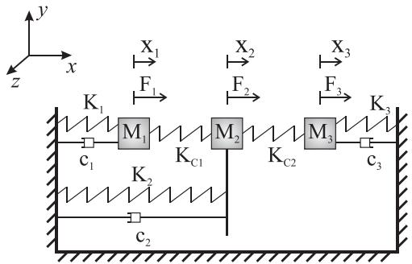  
Fig. 1. Spring-damper-mass model of a 3DoF resonator system [7]. Each resonator consists of a spring $(K_{p})$ , a damper $(c_{p})$ and a mass $(M_{p})$ $(p = 1,2,3)$ , and are coupled to its neighboring resonator through coupling springs $(K_{cq})$ $(q = 1,2)$ . If motions in other degrees-of-freedom are negligible compared to that in the $x$ -direction, it is assumed that each resonator is free to move only in the $x$ -direction, hence a 3DoF system.

amplitude difference. This allows to directly compare different output metrics in terms of sensitivity and linearity among four output metrics: frequency shift, amplitude difference, eigenstate shift and amplitude ratio.

In Section II, theoretical derivations of the mode frequencies and vibrational amplitudes, as well as amplitude-based output metrics, including amplitude difference, amplitude ratio and eigenstate shift, are presented. The description of the device and experimental method are presented in Section III, followed by the comparisons of different output metrics based on the measurement results discussed in Section IV.

# II. THEORY

The lumped element model of a weakly coupled 3DoF resonant sensor is shown in Fig. 1. If $M_{1} = M_{2} = M_{3} = M$ , $K_{c1} = K_{c2} = K_{c}$ , $K_{1} = K$ and stiffness perturbation is added to resonator 3, i.e. $K_{3} = K + \Delta K$ , the equations of motion of such a 3DoF resonator system are given by:

$$
M \ddot {X} _ {1} + c _ {1} \dot {X} _ {1} + \left(K + K _ {c}\right) X _ {1} - K _ {c} X _ {2} = F _ {1} \tag {1}
$$

$$
M \ddot {X} _ {2} + c _ {2} \dot {X} _ {2} + (K + 2 K _ {c}) X _ {2} - K _ {c} X _ {1} - K _ {c} X _ {3} = F _ {2} \tag {2}
$$

$$
M \ddot {X} _ {3} + c _ {3} \dot {X} _ {3} + (K + \Delta K + K _ {c}) X _ {3} - K _ {c} X _ {2} = F _ {3} \tag {3}
$$

In our previous work [7], we used transfer functions-based models instead of matrix analysis, which has been predominantly used by other groups [4]. This allows including damping into the analysis. Also, the limitation of assuming small perturbations is removed. In addition, we demonstrate that this model can be used to derive the vibrational amplitude of each resonator.

# A. Mode Frequencies

From (1), (2) and (3), a block diagram of the 3DoF system as shown in Fig. 2 can be derived [7].

The transfer functions $H_{p}(s)$ ( $p = 1,2$ and 3) can be derived as:

$$
H _ {1} (s) \equiv M s ^ {2} + c _ {1} s + \left(K + K _ {c}\right) \tag {4}
$$

$$
H _ {2} (s) \equiv M s ^ {2} + c _ {2} s + \left(K _ {2} + 2 K _ {c}\right) \tag {5}
$$

$$
H _ {3} (s) \equiv M s ^ {2} + c _ {3} s + \left(K + K _ {c} + \Delta K\right) \tag {6}
$$

Suppose the system is only driven by $F_{1}(s)$ with an amplitude of $F(s)$ and $F_{2}(s) = F_{3}(s) = 0$ , the amplitude of each

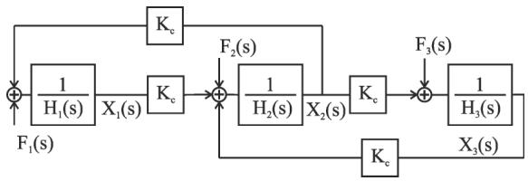  
Fig. 2. A block diagram of the 3DoF system derived from the equations of the motion [7].

individual resonator, $X_{p}(s)$ ( $p = 1,2$ and 3 denotes the $p$ th resonator), with respect to the driving force amplitude $F(s)$ can be found [7] by applying Mason's rule [13]:

$$
\frac {X _ {1} (s)}{F (s)} = \frac {H _ {2} (s) H _ {3} (s) - K _ {c} ^ {2}}{H _ {1} (s) H _ {2} (s) H _ {3} (s) - \left[ H _ {1} (s) + H _ {3} (s) \right] K _ {c} ^ {2}} \tag {7}
$$

$$
\frac {X _ {2} (s)}{F (s)} = \frac {K _ {c} H _ {3} (s)}{H _ {1} (s) H _ {2} (s) H _ {3} (s) - \left[ H _ {1} (s) + H _ {3} (s) \right] K _ {c} ^ {2}} \tag {8}
$$

$$
\frac {X _ {3} (s)}{F (s)} = \frac {K _ {c} ^ {2}}{H _ {1} (s) H _ {2} (s) H _ {3} (s) - \left[ H _ {1} (s) + H _ {3} (s) \right] K _ {c} ^ {2}} \tag {9}
$$

Suppose that the Q-factor is finite but high with $Q > 5000$ , and the universal assumption used in this work, weak coupling $K_{c} < K / 10 < K_{2} / 20$ is satisfied. It should be pointed out that $K_{2} > K$ is assumed. Additionally, we assume that the mode aliasing effect is negligible, with the anti-aliasing condition $f_{op} - f_{ip} > 2 \times f_{3dB}$ being satisfied [6]. To fulfill the requirement of the anti-aliasing condition for all $\Delta K < 0$ in this study, the following inequality has to be valid [6]:

$$
\frac {K \left(K _ {2} - K + K _ {c}\right)}{K _ {c} ^ {2}} <   \frac {Q}{2} \tag {10}
$$

For a 3DoF resonator system, there are three fundamental modes of vibration: in the first mode, all resonators vibrate in phase with each other; in the second mode, resonators 1 and 3 vibrate out-of-phase with respect to each other and in the third mode, each resonator is out-of-phase with its neighboring resonator. In this study, the third mode is not discussed due to the insignificant vibrational amplitudes of resonators 1 and 3 under the used experimental setup, e.g. an AC drive voltage of $8\mathrm{mV}$ . Nevertheless, a study of the third mode could be an interesting topic for future research. The frequencies of the first in-phase (i.e. the first mode) and the out-of-phase modes (i.e. the second mode), $\omega_{\mathrm{ip}}$ and $\omega_{\mathrm{op}}$ , respectively, are [6]:

$$
\begin{array}{l} \omega_ {\mathrm {i p}} \approx \sqrt {\frac {1}{M} \left[ K + K _ {c} + \frac {1}{2} \left(\Delta K - \frac {2 K}{\gamma} - \sqrt {\Delta K ^ {2} + \left(\frac {2 K}{\gamma}\right) ^ {2}}\right) \right]} (11) \\ \omega_ {\mathrm {o p}} \approx \sqrt {\frac {1}{M} \left[ K + K _ {c} + \frac {1}{2} \left(\Delta K - \frac {2 K}{\gamma} + \sqrt {\Delta K ^ {2} + \left(\frac {2 K}{\gamma}\right) ^ {2}}\right) \right]} (12) \\ \end{array}
$$

Where $\gamma$ is defined as:

$$
\gamma = \frac {K \left(K _ {2} - K + K _ {c}\right)}{K _ {c} ^ {2}} \tag {13}
$$

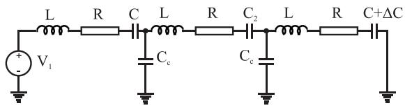  
Fig. 3. Equivalent electrical RLC model for the weakly coupled 3DoF resonant sensor with a perturbation on resonator 3 [6].

TABLEI VALUES USED IN THE SIMULATION TO VERIFY THEORETICAL ESTIMATIONS   

<table><tr><td>Component</td><td>Value</td><td>Mechanical model equivalent</td></tr><tr><td>L</td><td>0.397 MH</td><td>M</td></tr><tr><td>C</td><td>0.318 fF</td><td>K</td></tr><tr><td>C2</td><td>87.6 aF</td><td>K2/K = 3.6</td></tr><tr><td>Cc</td><td>-9.09 fF</td><td>K/Kc = -28.6, γ3 = 2117</td></tr><tr><td>R</td><td>5.89 MΩ</td><td>Q = 6000</td></tr><tr><td>vac</td><td>8 mV</td><td>Peak-peak actuation voltage</td></tr><tr><td>η</td><td>1.01 × 10-7</td><td>Transduction factor</td></tr></table>

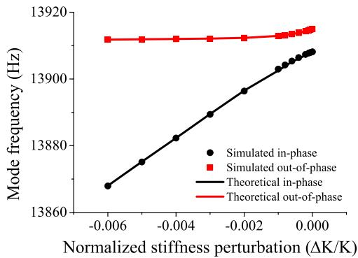  
Fig. 4. Simulated mode frequencies of the in-phase and out-of-phase modes.

Due to the symmetry of the responses for positive and negative stiffness perturbations [6], in this work, we present the analysis for negative perturbations without loss of generality.

To demonstrate the mode frequency shift, as well as other output metrics as a function of the stiffness perturbation $\Delta K$ , in the following sections, a simulation using an equivalent electrical RLC model [6], [14] was carried out. The RLC circuit-based model shown in Fig. 3 was favorable compared to other models such as Matlab matrix based models of a 3DoF resonator system [6] because of its capability of including damping. It is also simple to build and faster to simulate compared to Matlab/Simulink based models [15]. Note that motional currents $i_{\mathrm{mot},p} = \eta \omega X_p$ (where $\eta$ is the transduction factor, $\omega$ is the vibration frequency and $X_p$ is the vibrational amplitude of the $p$ th resonator, $p = 1,2$ and 3) were set as the simulation outputs. The vibrational amplitudes were then calculated based on these outputs.

Values representing the device tested were used to compare the simulation and measurement results; these are listed in Table I.

We plot the simulated mode frequencies of the in-phase and out-of-phase modes, as well as theoretically calculated values using (11) and (12) in Fig. 4. It can be seen that

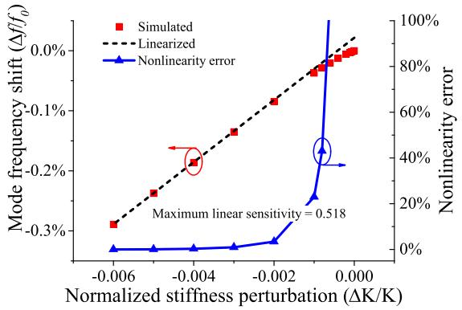  
Fig. 5. Simulated normalized in-phase mode frequency change (red dot), against the linearized scale function (black dashed line). Nonlinearity errors for different stiffness perturbation values are also shown (blue).

the simulated results agree well with the calculated values. More importantly, it can be seen that for $\Delta K < 0$ , the shifts of the in-phase mode frequency are more pronounced than that of the out-of-phase mode: the out-of-phase mode frequency approaches a constant value as the stiffness perturbation increases (negative); whereas the in-phase mode frequency is to good approximation a linear function of the perturbation. Based on these observations, we can linearize the mode frequencies for $\Delta K < 0$ and $|\Delta K| > 20K / \gamma$ :

$$
f _ {\mathrm {i p}} \approx \frac {1}{2 \pi} \sqrt {\frac {1}{M} \left(K + K _ {c} - \frac {K}{\gamma} + \Delta K\right)} \tag {14}
$$

$$
f _ {\mathrm {o p}} \approx \frac {1}{2 \pi} \sqrt {\frac {1}{M} \left(K + K _ {c} - \frac {K}{\gamma}\right)} \tag {15}
$$

Due to the more pronounced response for the same stiffness perturbation, for this comparative study, we use the shift in the in-phase mode frequency. Therefore, the symbol $f$ in this work refers to the in-phase mode frequency. Following common practice [2], [4], we use the normalized sensitivity as a figure-of-merit for sensitivity comparisons. For $|\Delta K| \ll K + K_{c} - K / \gamma$ , the normalized sensitivity, if the mode frequency is used as an output signal, can be expressed as:

$$
\mathcal {S} _ {f} = \frac {\partial \left(\frac {\Delta f}{f _ {0}}\right)}{\partial \left(\frac {\Delta K}{K}\right)} \approx \frac {K - K _ {c} + K / \gamma}{2 K} \tag {16}
$$

Where $f_0$ denotes the in-phase mode frequency for $\Delta K = 0$ ; $\Delta f$ is the change of the in-phase mode frequency relative to $f_0$ .

From Fig. 5, it can be seen that the linear sensitivity is 0.518, agreeing with the theoretical estimation. Also, the nonlinearity errors of the mode frequency change are well within a $\pm 10\%$ tolerance for $\Delta K / K < -0.002$ , suggesting good linearity in this region.

# B. Vibrational Amplitudes

In Appendix A, we show that the vibrational response of resonator 1 at the in-phase mode frequency can be orders of magnitude lower than that at the out-of-phase mode frequency,

if the coupled resonator system is driven with only one actuation force from one side (e.g. $F_{1}(s)$ only); hence, here we only focus on the vibrational amplitudes at the out-of-phase mode. Substituting (12) into Equations (7), (8) and (9), we can obtain the vibrational responses of resonator 1, 2 and 3 at the out-of-phase mode as a function of $\Delta K$ and $F(s)$ :

$$
(X _ {1}) _ {\mathrm {o p}} \approx \left(\frac {\frac {\gamma \Delta K}{K} - \sqrt {\left(\frac {\gamma \Delta K}{K}\right) ^ {2} + 4}}{2} + j \frac {\gamma}{Q}\right) F (s)
$$

(17)

$$
\begin{array}{l} (X _ {2}) _ {\mathrm {o p}} \approx \left(\frac {\Delta K + \frac {2 K}{\gamma} - \sqrt {\Delta K ^ {2} + \left(\frac {2 K}{\gamma}\right) ^ {2}}}{2 K _ {c}} - j \frac {K}{K _ {c} Q}\right) F (s) (18) \\ (X _ {3}) _ {\mathrm {o p}} \approx \left(\frac {1}{\frac {K + K _ {c}}{Q} \left(- j \sqrt {\left(\frac {\gamma \Delta K}{K}\right) ^ {2} + 4} - \frac {\gamma}{Q}\right)}\right) F (s) (19) \\ \end{array}
$$

Equations (17), (18) and (19) can be seen from two different perspectives: magnitude and phase. In what follows, we mainly focus on the magnitude aspect of the vibrational responses. In the following, we use amplitude and magnitude interchangeably.

However, the phase is also important, in the sense that we are able to demonstrate the feasibility of a self-oscillating loop of a weakly coupled 3DoF resonant sensor based on the observations on the theoretical phase difference. The theoretical derivation of the phase can be found in Appendix B.

The theoretical vibrational amplitudes are the magnitudes of the transfer functions (17), (18) and (19). Whereas the simulated vibrational amplitudes were calculated using the simulated motional current and the transduction factor $\eta$ value listed in Table I. It can be seen from Fig. 6 that the simulation agreed well with the theoretical amplitudes, with relative errors within a $\pm 3\%$ range.

From Fig. 6, the amplitudes of resonator 1 and 2 monotonically increase before reaching asymptotes of two different constant values; whereas the amplitude of resonator 3 is monotonically decreasing. Given that the vibrational energy is described by $E = \frac{1}{2} M\omega^2 X^2$ for each resonator, this clearly suggests that the vibrational energy of resonator 3 is redistributed to resonator 1 and 2. In other words, the total

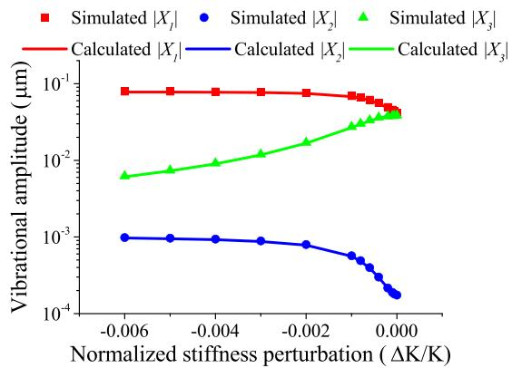  
Fig. 6. Simulated vibrational amplitudes of all resonators at the out-of-phase mode frequency.

energy is confined locally to resonators 1 and 2, indicating the occurrence of the mode localization effect.

To quantitatively measure the mode localization effect within a weakly coupled resonator system for sensing purposes, we propose to manipulate the output amplitudes, and using the resulting value as an output metric. The most intuitive choice is measuring the amplitude changes directly; or alternatively, the summation, subtraction, multiplication and quotient of the amplitudes, as well as the eigenstate shifts can be used. We will discuss them in the following sections.

Another observation from the simulated motional currents shown in Fig. 6 is that resonator 2 has orders of magnitude smaller vibrational amplitudes than that of resonator 1 or 3. In fact, the amplitude of resonator 2 is lower than $1\mathrm{nm}$ , making it practically difficult to detect. Thus, the amplitude of resonator 2 is not considered to be used in any output metrics discussed below.

# C. Amplitude Difference

Since amplitudes of resonators 1 and 3 have opposite trends for a stiffness perturbation, a subtraction between the resonators 1 and 3 results in greater changes compared to summation or using a single resonator. For this reason, we only discuss amplitude difference in this section as an output metric.

From (17), (18) and (19), it can be seen that it takes considerable computational effort to derive a simplified expression for the normalized linear sensitivity; hence, we use linear fitting to find the normalized sensitivity. In Fig. 7, the amplitude difference as a function of stiffness perturbation is shown. Assuming the values of the 3DoF resonators shown in Table I, we find that the maximum normalized sensitivity of the amplitude difference from Fig. 7 is:

$$
\mathcal {S} _ {| X |} = \frac {\partial \left(\frac {| \Delta X _ {d} |}{| X _ {d , 0} |}\right)}{\partial \left(\frac {\Delta K}{K}\right)} \approx - 1 2 4 5 0. 4 8 \tag {20}
$$

where $|X_{d,0}|$ is the amplitude difference $|X_1| - |X_3|$ for $\Delta K = 0$ , and $|\Delta X_d|$ is the amplitude difference change with respect to $|X_{d,0}|$ .

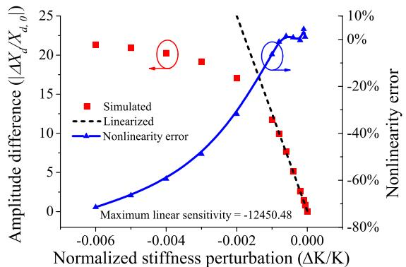  
Fig. 7. Simulated amplitude difference change, $\Delta X_{d}$ , normalized to the amplitude difference $X_{d,0}$ for $\Delta K = 0$ , at the out-of-phase mode frequency (red dots). Also plotted are the linearized function for amplitude difference as an output metric (black dashed line) and the nonlinearity error (blue).

Fig. 7 also shows that the maximum linear sensitivity occurs when the stiffness perturbation is in close vicinity of $\Delta K = 0$ . The nonlinearity of the sensitivity increases as the stiffness perturbation increases (negative). The nonlinearity error is within a $\pm 10\%$ margin for $-0.001 < \Delta K / K < 0$ .

# D. Amplitude Ratios

From the amplitude section, it can be seen that another type of manipulation of the vibrational amplitudes can be the multiplication or quotient between the amplitudes of resonators 1 and 3. However, from inspection of Fig. 6, the quotients between the resonator amplitudes clearly has a more pronounced effect compared to multiplications; hence, we only discuss amplitude ratios (quotient) as an output metric.

Due to the possibly low amplitude of resonator 1 at the in-phase mode frequency (as shown in Appendix A), in this section, we only discuss the amplitude ratios at the out-of-phase mode.

For simplicity, we define $\chi_{p,q}$ as the amplitude ratio of $|X_p / X_q|$ ( $p, q = 1, 2, 3$ ; $p \neq q$ ) at the out-of-phase mode. Within the mechanical linear region of the resonators, we can derive the following amplitude ratios, $\chi_{1,3}$ and $\chi_{2,3}$ ,1 which are independent of the actuation forces:

$$
\begin{array}{l} \chi_ {1, 3} = \left| \frac {X _ {1}}{X _ {3}} \right| _ {\mathrm {o p}} \approx \left| \frac {\frac {\gamma \Delta K}{K} - \sqrt {\left(\frac {\gamma \Delta K}{K}\right) ^ {2} + 4}}{2} + j \frac {\gamma}{Q} \right| (21) \\ \chi_ {2, 3} = \left| \frac {X _ {2}}{X _ {3}} \right| _ {\text {o p}} \approx \left| \frac {\Delta K + \frac {2 K}{\gamma} - \sqrt {\Delta K ^ {2} + \left(\frac {2 K}{\gamma}\right) ^ {2}}}{2 K _ {c}} - j \frac {K}{K _ {c} Q} \right| (22) \\ \end{array}
$$

The simulated amplitude ratios are plotted with the theoretically calculated values in Fig. 8. It can be seen that the

1The amplitude ratio between resonator 1 and 2, $\chi_{1,2}$ , can be derived from these two expressions.

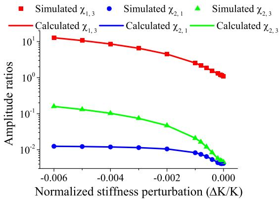  
Fig. 8. Simulated amplitude ratios $\chi_{1,3},\chi_{2,3}$ and $\chi_{2,1}$ along with theoretically calculated values. Due to the difficulty to detect the amplitude of resonator 2, $\chi_{2,1}$ and $\chi_{2,3}$ are shown only for demonstration purposes.

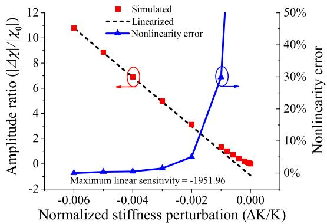  
Fig. 9. Simulated normalized amplitude ratios $\chi_{1,3}$ (red dots), as well as linearized scale function (black dashed line) and nonlinearity error (blue).

theory agrees well with the simulations, and that $\chi_{1,3}$ has the highest value among the three. As shown in Section II-B, the amplitude of resonator 2 is difficult to detect in practice. Therefore, amplitude ratios involving resonator 2 are not discussed in this section; thus, only $\chi_{1,3}$ is considered further. In the following, for simplicity, $\chi$ is used instead of $\chi_{1,3}$ .

For $\Delta K < 0$ and $|\Delta K| > 10K / \gamma$ , the expression of $\chi$ can be linearized based on (21) [6]:

$$
\chi \approx - \gamma \times \frac {\Delta K}{K} \tag {23}
$$

The normalized linear sensitivity of amplitude ratio change $\Delta \chi$ relative to the amplitude ratio for $\Delta K = 0$ , $\chi_0$ , as a result of (23), is:

$$
\mathcal {S} _ {\chi} = \frac {\partial \left(\frac {\Delta \chi}{\chi_ {0}}\right)}{\partial \left(\frac {\Delta K}{K}\right)} \approx - \frac {\gamma}{\chi_ {0}} \approx - \frac {\gamma}{\sqrt {1 + \left(\frac {\gamma}{Q}\right) ^ {2}}} \tag {24}
$$

Using the design parameters given in Table I, the normalized sensitivity for this particular case is $S_{\chi} \approx -1951.96$ .

From Fig. 9, it can be seen that the linearized function (23) is a good approximation of the amplitude ratio $\chi$ for $\Delta K / K < -0.002$ , with a nonlinearity error within a $\pm 10\%$ margin. Therefore, the linear sensitivity expression (24) is considered to be valid for a linear range of $\Delta K / K < -0.002$ .

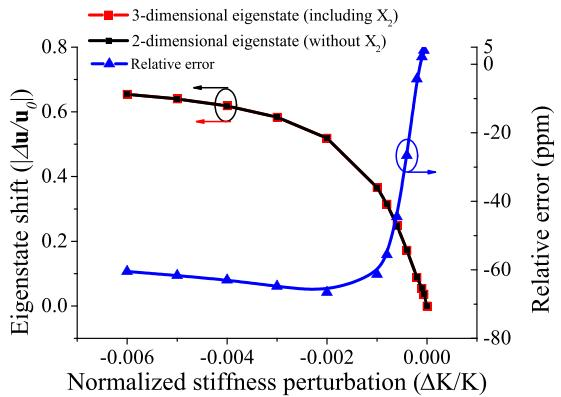  
Fig. 10. Calculated eigenstate of the out-of-phase mode using the simulated amplitudes of: all resonators, hence a 3-dimensional eigenstate (black); only resonators 1 and 3, hence a 2-dimensional eigenstate (red). The relative error induced by neglecting the amplitude of resonator 2 is also shown.

# E. Eigenstate Shift

Eigenstate shift has been used as an output metric in weakly coupled 2DoF resonant sensors to measure the mode localization effect [2], [4]. An eigenstate is essentially an amplitude vector, consisting of the vibrational amplitudes of all the resonators within the system, normalized to unity magnitude, i.e. $\vec{\mathbf{u}} = [X_1 X_2 X_3]^{\mathrm{T}} / [[X_1 X_2 X_3]^{\mathrm{T}}]$ . Due to larger amplitudes of resonator 1, we only discuss the eigenstate of the out-of-phase mode; thus, we use $\vec{\mathbf{u}}$ to indicate this eigenstate.

For weak coupling $K_{c} < K / 10 < K_{2} / 20$ , resonator 2 has orders of magnitude lower amplitude at the out-of-phase mode frequency, as shown in Fig. 6; therefore, we will consider only a two dimensional vector of the eigenstate of the out-of-phase mode:

$$
\vec {\mathbf {u}} = \left[ \begin{array}{c} X _ {1} \\ X _ {3} \end{array} \right] \approx \left[ \begin{array}{c} - \frac {\chi_ {1 , 3}}{\sqrt {1 + \chi_ {1 , 3} ^ {2}}} \\ \frac {1}{\sqrt {1 + \chi_ {1 , 3} ^ {2}}} \end{array} \right] \tag {25}
$$

Based on the simulated vibrational amplitudes, we can compare the eigenstates shifts with and without reducing the dimension of the vector. It can be seen from Fig. 10 that the estimation using the reduced dimension eigenstate is sufficiently accurate, with an error of less than $70\mathrm{ppm}$ . Therefore, using only the amplitudes of resonators 1 and 3 is sufficient to estimate the eigenstate shift of the weakly coupled 3DoF resonant sensor.

However, combining (21) and (25), even with the reduced dimension eigenstate vector, the analytical derivation of the eigenstate shift is tedious and beyond the scope of this paper. Therefore, we use linear fitting from the simulation results to derive the normalized linear sensitivity of the eigenstate shift.

From Fig. 11, the linear sensitivity of eigenstate shift is found to be:

$$
\mathcal {S} _ {\vec {\mathbf {u}}} = \frac {\partial \left(\frac {| \vec {\Delta} \mathbf {u} |}{| \vec {\mathbf {u}} |}\right)}{\partial \left(\frac {\Delta K}{K}\right)} \approx - 3 8 0. 5 \tag {26}
$$

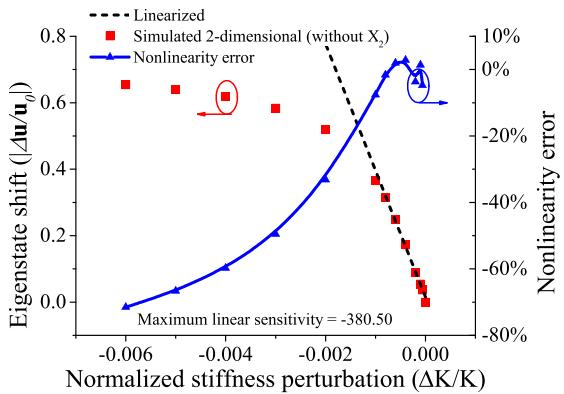

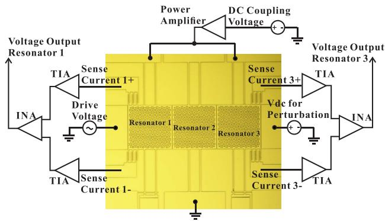  
Fig. 11. Normalized 2-dimensional eigenstate shift with respect to the eigenstate for $\Delta K = 0$ (red dots) against the linearized scale function (black dashed line). The nonlinearity error (blue) is also plotted.   
Fig. 12. The 3DoF MEMS resonant sensor consisting of three weakly coupled resonators [6], along with the interface circuit configuration, tested for comparisons between output metrics.

Also, from Fig. 11, it can be seen that for $-0.001 < \Delta K < 0$ , the nonlinearity error is smaller than $\pm 10\%$ .

# III. DEVICE DESCRIPTION & EXPERIMENTAL SETUP

To perform an experimental comparison between the different output metrics in practice, a 3DoF resonant sensor, as shown in Fig. 12, was fabricated and tested. The fabrication process, device parameters, as well as the experimental methods are discussed and described in detail in [6].

A DC coupling voltage of $50\mathrm{V}$ was applied to resonator 1 and 3, while resonator 2 was grounded. This created electrostatic springs between the resonators, coupling the neighboring resonators. The ratio of the mechanical stiffness of the resonators to the electrostatic coupling stiffness was approximately $-28.55$ , satisfying the weak coupling condition. The peak-to-peak amplitude of the AC voltage driving the resonators was $8\mathrm{mV}$ , so that the resonators were in the mechanical linear region of the springs.

In addition, the device was electrically tested under a vacuum pressure of $20\mu \mathrm{Torr}$ . The Q factor of the device was characterized and was found to be $Q = 6221$ [6]. The resonant frequencies of the in-phase and the out-of-phase modes were found to be $14267\mathrm{Hz}$ and $14274\mathrm{Hz}$ , respectively. Using these values, the bandwidths of the in-phase and out-of-phase modes were calculated to be approximately $2.29\mathrm{Hz}$ . The frequency difference measurement results are shown in Fig. 13; it can be seen that the minimum frequency difference is larger than

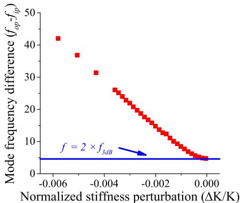  
Fig. 13. The frequency differences $f_{op} - f_{ip}$ is shown along with the minimum frequency difference to minimize mode aliasing effect.

twice of the bandwidth of the out-of-phase mode, suggesting that anti-aliasing condition [6] was fulfilled for all stiffness perturbations.

In addition, by using the same approach as in [6] and [7], the $\gamma$ value and the offset value for the normalized stiffness perturbation, which was introduced by the fabrication tolerances, was found to be 2511.91 and $-0.00269$ , respectively. In the following sections, the stiffness perturbation values are all relative to this operating point.

A DC voltage was applied on the electrode on the right, as shown in Fig. 12. This created a stiffness softening effect on the resonator 3 equivalent to a stiffness perturbation controlled by the applied DC voltage. The normalized stiffness perturbations in the following section are calculated using (27), given the dielectric constant $\varepsilon_0$ , cross-sectional area $A$ , capacitive gap $d$ , voltage difference across the gap $V_{e}$ and the applied DC voltage for stiffness perturbation $\Delta V_{e}$ [6]:

$$
\Delta K \approx - \frac {\varepsilon_ {0} A}{d ^ {3}} \left[ \left(V _ {e} + \Delta V _ {e}\right) ^ {2} - V _ {e} ^ {2} \right] \tag {27}
$$

In the experiment, instead of directly measuring the vibrational amplitudes, the capacitively induced motional currents were converted to voltages, which were then used to calculate the amplitudes. The differential motional currents were converted to voltages through standard transimpedance amplifiers (TIAs) (AD8065, Analog Devices Inc., V/I gain $6.6\mathrm{M}\Omega$ per TIA), then further amplified by instrumentation amplifiers (INAs) (AD8421, Analog Devices Inc., voltage gain 40dB) and eventually measured by an oscilloscope (DSO6032A, Agilent Technologies). The interface circuit configuration for measurement is shown in Fig. 12. The vibrational amplitudes of resonators 1 and 3 were then calculated using the gains of the amplifying stages and the transduction factor calculated based on the design parameters.

# IV. EXPERIMENTAL RESULTS

We examined the linear sensitivity and linear range for different output metrics for negative stiffness perturbations. The output metrics investigated included the mode frequency shift, the vibrational amplitudes and amplitude difference, amplitude ratio, and the eigenstate shift.

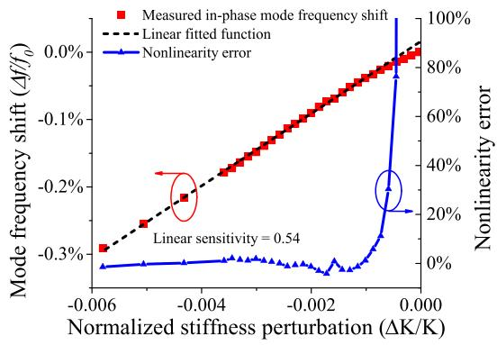  
Fig. 14. Measured normalized in-phase mode frequency shift as a function of normalized stiffness perturbation, together with a linear fitted function and nonlinearity error.

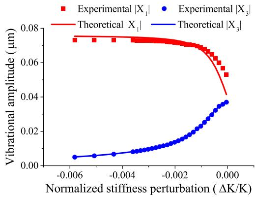  
Fig. 15. Calculated vibrational amplitudes of resonators 1 and 3 based on the measured voltage amplitudes, with respect to the normalized stiffness perturbations, against theoretical values.

# A. Mode Frequency Shifts

Theoretically, we showed that for negative stiffness perturbations the in-phase mode changes were more pronounced than the out-of-phase mode changes. Therefore, we only considered the linear sensitivity of the normalized in-phase mode frequency. The normalized output is plotted in Fig. 14.

From Fig. 14, it can be seen that the normalized linear sensitivity was approximately 0.54. This was $4\%$ higher than the theoretical value of 0.518. The discrepancy is attributed to fabrication tolerances in the stiffness value. In addition to the linear sensitivity, it can be seen that the linear range for a tolerance of $\pm 10\%$ nonlinearity error was approximately $\Delta K / K < -0.001$ . It can also be seen from the results that the calculated stiffness perturbation is an accurate estimation of the perturbation applied.

# B. Vibrational Amplitudes

The measured vibrational amplitudes of resonators 1 and 3 at the out-of-phase mode frequencies are plotted in Fig. 15. It can be seen that both vibrational amplitudes agreed well with the theoretically calculated values for stiffness perturbations $\Delta K / K < -0.001$ , with an error of less than $5\%$ . The discrepancy is likely to be caused by the fabrication tolerances. Another possible reason is the increased mode aliasing effect caused by the reduced mode frequency difference closer to zero perturbations.

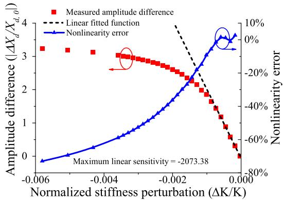  
Fig. 16. Normalized amplitude difference, $|X_1| - |X_3|$ , calculated using the measured amplitudes, as a function of normalized stiffness perturbation, as well as a linear fitted function and nonlinearity error.

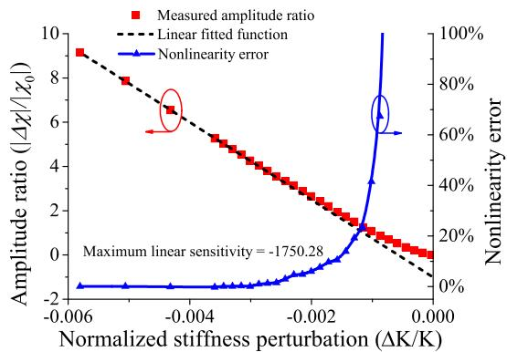  
Fig. 17. Normalized amplitude ratios, $|X_1| / |X_3|$ , calculated using the measured amplitudes, as a function of normalized stiffness perturbation, as well as a linear fitted function and the nonlinearity error.

# C. Amplitude Difference

Using the measured vibrational amplitudes, we are able to calculate the amplitude difference used as the output metric. The maximum normalized linear sensitivity was found to be in close vicinity to the zero perturbation point. This is shown in Fig. 16. The linear fitted normalized linear sensitivity was $-2073.38$ . The discrepancy between this value and theoretically estimated value is considered to be mainly caused by the fabrication tolerances and increased mode aliasing effect, which leads to an increased (approximately 4 times) $X_{d,0}$ value than theory. The linear range with a tolerance of $\pm 10\%$ nonlinearity error was $-0.001 < \Delta K / K < 0$ .

# D. Amplitude Ratios

The theoretical calculations show that the amplitude of resonator 2 is orders of magnitude smaller than the amplitudes of resonators 1 and 3, making it impractical to detect. Therefore, we only considered the amplitude ratio $|X_1 / X_3|$ . From the vibrational amplitudes of the out-of-phase mode, we were able to calculate the amplitude ratio as an output metric. The normalized amplitude ratios are plotted in Fig. 17.

It can be seen that the maximum normalized linear sensitivity of the amplitude ratio was $-1750.28$ . The discrepancy from theoretical value was approximately $10\%$ . The normalized sensitivity is a function of the amplitude ratio for $\Delta K = 0$

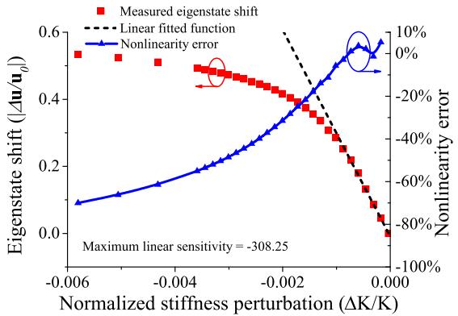  
Fig. 18. Normalized eigenstate shift as a function of normalized stiffness perturbation, along with linear fitted function and nonlinearity error.

which was affected by the mode aliasing effect. Therefore, the discrepancy was due to the mode aliasing effect, as well as fabrication tolerances. In addition, the nonlinearity error was within $\pm 10\%$ for $\Delta K / K < -0.0015$ .

# E. Eigenstate Shift

As shown in Fig. 10, the eigenstate of a weakly coupled 3DoF resonant sensor can be estimated using only the amplitudes of resonators 1 and 3. The normalized eigenstate shift relative to the initial eigenstate was measured experimentally and is plotted in Fig. 18.

The maximum normalized linear sensitivity was found by linear fitting, and the value was $-308.25$ as shown in Fig. 18. Similar to the amplitude difference, the maximum linear sensitivity of eigenstate shift was found near $\Delta K = 0$ . The linear region for eigenstate shift was approximately $-0.001 < \Delta K / K < 0$ .

# F. Output Metrics Comparison

To summarize the simulated and experimental results, we can compare the maximum normalized linear sensitivity (absolute value), as well as the linear region for different output metrics including frequency shift, amplitude difference, amplitude ratio and eigenstate shift. The key figures are listed in Table II. We can come to the following conclusions from both simulations and experimental results.

From the comparisons listed in Table II, it can be clearly seen, that the frequency shift has the largest linear range for both theoretical and experimental results, whilst it has the lowest sensitivity among the four output metrics.

The amplitude difference has the highest value for maximum normalized linear sensitivity, i.e. three orders of magnitude improvement from the lowest sensitivity. However, the sensitivity decreases significantly as the normalized stiffness perturbation increases (negative), e.g. the sensitivity decreased to a level less than half of the maximum value when $\Delta K / K = -0.002$ . In addition, low nonlinearity errors are confined to a rather limited range.

The eigenstate shift has moderate sensitivity, i.e. up to an order of magnitude lower than the highest sensitivity, but two orders of magnitude higher than the lowest sensitivity. In terms of linear range, it is similar to that of the amplitude difference.

TABLE II MAXIMUM NORMALIZED LINEAR SENSITIVITY AND LINEAR REGION COMPARISONS FOR THE OUTPUT METRICS DISCUSSED IN THIS PAPER   

<table><tr><td rowspan="2">Output metrics</td><td colspan="2">Maximum normalized linear sensitivity (absolute value)</td><td colspan="2">Linear range (nonlinearity error tolerance ±10%)</td></tr><tr><td>Simulated</td><td>Measured</td><td>Simulated</td><td>Measured</td></tr><tr><td>Frequency shift</td><td>0.518</td><td>0.54</td><td>ΔK/K &lt; -0.002</td><td>ΔK/K &lt; -0.001</td></tr><tr><td>Amplitude difference</td><td>12450.48</td><td>2073.38</td><td>-0.001 &lt; ΔK/K &lt; 0</td><td>-0.001 &lt; ΔK/K &lt; 0</td></tr><tr><td>Amplitude ratio</td><td>1951.96</td><td>1750.28</td><td>ΔK/K &lt; -0.002</td><td>ΔK/K &lt; -0.0015</td></tr><tr><td>Eigenstate shift</td><td>380.5</td><td>308.25</td><td>-0.001 &lt; ΔK/K &lt; 0</td><td>-0.001 &lt; ΔK/K &lt; 0</td></tr></table>

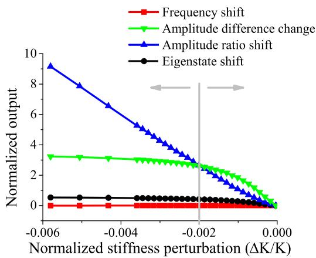  
Fig. 19. Different normalized output metrics as functions of normalized stiffness perturbation. For $\Delta K / K < -0.002$ , amplitude ratio has the highest sensitivity, whereas for $-0.002 < \Delta K / K < 0$ , amplitude difference offers the highest sensitivity.

However, it has already been shown experimentally that eigenstate shift has higher common mode rejection capability than frequency shift [10]. For the other discussed output metrics, no experimental investigation of common mode rejection has been presented to date. All three metrics discussed show a strong trade-off between sensitivity and linear range.

The amplitude ratio offers the best balance between the two key specifications in our discussions. It has the second highest sensitivity and linear range. Despite that the maximum sensitivity is the second highest, in the range of $\Delta K / K < -0.002$ , the normalized output becomes largest among all four metrics, while also having the highest sensitivity. This is shown in Fig. 19.

To conclude, the choice of the output metrics depends on the specific applications. For applications where both linear range and sensitivity are important, we propose to use amplitude ratio as the output metric, since it has both high sensitivity and wide linear range.

In other cases where the sensitivity is the most important specification, the optimized output depends on the region of operation. If we plot the measured output of all four metrics with respect to the stiffness perturbations in Fig. 19, it can be seen that in the region of $\Delta K / K < -0.002$ , the amplitude ratio surpasses amplitude difference, to have the highest normalized output. Thus, for a working region of $\Delta K / K < -0.002$ , the amplitude ratio is the output metric for optimized sensitivity; On the other hand, if the region of measurement is in the range of to $-0.002 < \Delta K / K < 0$ , the amplitude difference has the highest sensitivity.

For cases where linear range is the most important factor, i.e. for ease of calibration, both the frequency shift as well as the amplitude ratio are adequate.

# V. CONCLUSIONS

In this paper, we have systematically investigated four output metrics for a 3DoF MEMS resonant sensor for stiffness change sensing, consisting of three weakly coupled resonators, including frequency shift, amplitude difference, amplitude ratio and eigenstate shift. We have analytically derived the mode frequency shifts and amplitude changes for the 3DoF resonant sensor under stiffness perturbations. From the analytical expressions, we showed that the mode localization effect occurs. To measure the mode localization effect, we have used three output metrics, amplitude difference, amplitude ratio and eigenstate shift.

From the simulation and experimental results, we have presented evidence that by measuring the effect of mode localization, the normalized sensitivity improved by orders of magnitude. However, using different manipulations of the amplitudes of the resonators, we are able to find that the resulting output metrics have different characteristics. For instance, the amplitude difference has the highest normalized sensitivity but a relatively low linear range; whereas the amplitude ratio has the best balance between the sensitivity and linear range.

Using the results from this paper, future research focusing on a MEMS resonant sensor consisting of weakly coupled resonators can choose the optimum output metric. In general, we propose using amplitude ratio as the output metric for the best compromise between sensitivity and linear range, for stiffness change sensing applications. Stiffness change sensing can be applied to inertial, force, displacement and strain sensors; therefore, the presented results can be directly used for the design of such coupled resonator sensors. It is also worth pointing out that for sensing mass changes $(\Delta M \ll M)$ , the mass perturbation can be linearly translated to an equivalent stiffness perturbation [16]. Hence it is believed that the results can also be applied for mass change sensors. In addition, by using a similar methodology as described in this paper, output metrics can be compared and investigated for coupled resonators with other number of degrees of freedom, e.g. 2DoF.

In addition to the sensitivity and linear range, there are other key specifications which are not discussed in the main context of the paper, e.g. resolution and dynamic range. This could be a focus of future research.

Lastly, the analysis in this study assumes high Q-factors with $Q > 5000$ and was verified by experiments using a device with $Q \approx 6000$ . It is believed that the presented analysis is also valid for even higher Q resonators with Q-factors in the order of 10000 or above. In this case, $\gamma$ , and thus the sensitivity, can be improved even further. However, all output metrics show a trade-off between the sensitivity and linearity; therefore, improvement in sensitivity implies a reduction in linear range. On the other hand, for low Q resonators, e.g. resonators in fluids with $Q < 1000$ , it is more difficult to achieve high $\gamma$ , thus high sensitivity, due to the constraints of the anti-mode aliasing condition (as indicated in (10)). However, the overall analysis is still valid, as long as the anti-aliasing condition is satisfied with an appropriate design. This suggests a limitation on maximum sensitivity for low Q resonators, but a potential to improve the linear range.

# APPENDIX A THEORETICAL DERIVATIONS OF AMPLITUDES AND AMPLITUDE RATIOS AT THE IN-PHASE MODE FREQUENCY

Assuming weak coupling, i.e. $K_{c} < K / 10 < K_{2} / 20$ , substituting the in-phase mode frequency (11) into transfer functions (7) and (9), we can obtain:

$$
(X _ {3}) _ {\mathrm {i p}} \approx \left(\frac {1}{\frac {K + K _ {c}}{Q} \left(- j \sqrt {\left(\frac {\gamma \Delta K}{K}\right) ^ {2} + 4} - \frac {\gamma}{Q}\right)}\right) F (s) \tag {28}
$$

$$
\left| \frac {X _ {3}}{X _ {1}} \right| _ {\mathrm {i p}} \approx \left| \frac {\frac {\gamma \Delta K}{K} - \sqrt {\left(\frac {\gamma \Delta K}{K}\right) ^ {2} + 4}}{2} + j \frac {\gamma}{Q} \right| \tag {29}
$$

Comparing (28) to (19), it is obvious that the amplitudes of resonator 3 are approximately equal at the in-phase and the out-of-phase mode frequencies. Based on this, we are able to obtain:

$$
\frac {\left| X _ {1} \right| _ {\mathrm {o p}}}{\left| X _ {1} \right| _ {\mathrm {i p}}} \approx \left| \frac {\frac {\gamma \Delta K}{K} - \sqrt {\left(\frac {\gamma \Delta K}{K}\right) ^ {2} + 4}}{2} + j \frac {\gamma}{Q} \right| ^ {2} \tag {30}
$$

For $|\gamma \Delta K / K| > 5$ (corresponding to a $\Delta K / K < -0.0024$ in the main context, which is within the linear range of the amplitude ratio), the amplitude of resonator 1 at the in-phase mode frequency is less than $5\%$ of that at the out-of-phase mode frequency.

An interesting thought is that (30) could be the reason that amplitude quotient of $|X_1|_{\mathrm{op}} / |X_1|_{\mathrm{ip}}$ was used as an output in [17], since the sensitivity is obviously higher than $|X_1 / X_3|$

of the out-of-phase mode. However, this output requires the sweeping of the frequency to find both modes, which is impractical for real-time sensing.

# APPENDIX B THEORETICAL DERIVATIONS OF PHASE CHANGE AT THE OUT-OF-PHASE MODE FREQUENCY

If $\angle |X_p|_{\mathrm{op}}$ ( $p = 1,2$ and 3) denotes the phase change of the $p$ th resonator relative to the drive force at the out-of-phase mode frequency, using (17), (18) and (19), we are able to obtain:

$$
\begin{array}{l} \angle | X _ {1} | _ {\mathrm {o p}} \approx \arctan \left(\frac {2 \gamma / Q}{\gamma (\Delta K / K) - \sqrt {\gamma^ {2} (\Delta K / K) ^ {2} + 4}}\right) \\ - \arctan \left(\frac {\sqrt {\gamma^ {2} (\Delta K / K) ^ {2} + 4}}{\gamma / Q}\right) \tag {31} \\ \end{array}
$$

$$
\begin{array}{l} \angle | X _ {2} | _ {\mathrm {o p}} \approx \arctan \left(\frac {- 2 K / Q}{\Delta K + 2 K / \gamma - \sqrt {\Delta K ^ {2} + (2 K / \gamma) ^ {2}}}\right) \\ - \arctan \left(\frac {\sqrt {\gamma^ {2} (\Delta K / K) ^ {2} + 4}}{\gamma / Q}\right) \tag {32} \\ \end{array}
$$

$$
\angle | X _ {3} | _ {\mathrm {o p}} \approx - \arctan \left(\frac {\sqrt {\gamma^ {2} (\Delta K / K) ^ {2} + 4}}{\gamma / Q}\right) \tag {33}
$$

One important observation from the equations is that, for $|\gamma \Delta K / K| > 10$ , $\sqrt{\gamma^2(\Delta K / K)^2 + 4} \approx -\gamma (\Delta K / K)$ , then (31) can be approximated as $\angle |X_1|_{\mathrm{op}} \approx -90^\circ$ . This is an important conclusion for constructing a self-oscillating loop for the weakly coupled 3DoF resonant sensor as shown in [18].

# REFERENCES

[1] C. Zhao, G. S. Wood, J. Xie, H. Chang, S. H. Pu, and M. Kraft, "Comparative study of different output metrics for a three weakly coupled resonator sensor," in Proc. Transducers 18th Int. Conf. Solid-State Sens., Actuators, Microsyst. (TRANSDUCERS), Jun. 2015, pp. 2196-2199.   
[2] M. Spletzer, A. Raman, A. Q. Wu, X. Xu, and R. Reifenberger, "Ultrasensitive mass sensing using mode localization in coupled microcantilevers," Appl. Phys. Lett., vol. 88, no. 25, p. 254102, 2006.   
[3] M. Spletzer, A. Raman, H. Sumali, and J. P. Sullivan, "Highly sensitive mass detection and identification using vibration localization in coupled microcantilever arrays," Appl. Phys. Lett., vol. 92, no. 11, p. 114102, 2008.   
[4] P. Thiruvenkatanathan, J. Yan, J. Woodhouse, and A. A. Seshia, "Enhancing parametric sensitivity in electrically coupled MEMS resonators," J. Microelectromech. Syst., vol. 18, no. 5, pp. 1077-1086, Oct. 2009.   
[5] P. Thiruvenkatanathan, J. Yan, J. Woodhouse, A. Aziz, and A. A. Seshia, "Ultrasensitive mode-localized mass sensor with electrically tunable parametric sensitivity," Appl. Phys. Lett., vol. 96, no. 8, p. 081913, Feb. 2010.   
[6] C. Zhao, G. S. Wood, J. Xie, H. Chang, S. H. Pu, and M. Kraft, "A three degree-of-freedom weakly coupled resonator sensor with enhanced stiffness sensitivity," J. Microelectromech. Syst., vol. 25, no. 1, pp. 38-51, Feb. 2016.   
[7] C. Zhao, G. S. Wood, J. Xie, H. Chang, S. H. Pu, and M. Kraft, "A force sensor based on three weakly coupled resonators with ultrahigh sensitivity," Sens. Actuators A, Phys., vol. 232, pp. 151-162, Aug. 2015.   
[8] N. H. Saad, C. J. Anthony, R. Al-Dadah, and M. C. Ward, “Exploitation of multiple sensor arrays in electronic nose,” in Proc. IEEE Sensors, Oct. 2009, pp. 1575–1579.   
[9] M. S. Hajhashemi, A. Rasouli, and B. Bahreyni, "Improving sensitivity of resonant sensor systems through strong mechanical coupling," J. Microelectromech. Syst., vol. 25, no. 1, pp. 52-59, Feb. 2016.

[10] P. Thiruvenkatanathan, J. Yan, and A. Seshia, "Common mode rejection in electrically coupled MEMS resonators utilizing mode localization for sensor applications," in Proc. IEEE Int. Freq. Control Symp. Joint 22nd Eur. Freq. Time Forum, Apr. 2009, pp. 358-363.   
[11] H. Zhang, B. Li, W. Yuan, M. Kraft, and H. Chang, "An acceleration sensing method based on the mode localization of weakly coupled resonators," J. Microelectromech. Syst., vol. 25, no. 2, pp. 286-296, 2016.   
[12] P. Thiruvenkatanathan and A. A. Seshia, "Mode-localized displacement sensing," J. Microelectromech. Syst., vol. 21, no. 5, pp. 1016-1018, Oct. 2012.   
[13] S. Mason, "Feedback Theory-Some Properties Signal Flow Graphs," in Proc. IRE, vol. 41, no. 9, pp. 1144-1156, Sep. 1953.   
[14] C. T.-C. Nguyen, "Frequency-selective MEMS for miniaturized low-power communication devices," IEEE Trans. Microw. Theory Techn., vol. 47, no. 8, pp. 1486-1503, Aug. 1999.   
[15] M. Manav, G. Reynen, M. Sharma, E. Cretu, and A. Phani, "Ultra-sensitive resonant MEMS transducers with tunable coupling," in Proc. 7th Int. Conf. Solid-State Sens., Actuators, Microsyst. (TRANSDUCERS EUROSENSORS), Jun. 2013, pp. 996-999.   
[16] G. S. Wood, C. Zhao, S. H. Pu, S. A. Boden, I. Sari, and M. Kraft, "Mass sensor utilising the mode-localisation effect in an electrostatically-coupled MEMS resonator pair fabricated using an SOI process," Microelectron. Eng., vol. 159, pp. 169-173, Jun. 2016.   
[17] E. Gil-Santos, D. Ramos, A. Jana, M. Calleja, A. Raman, and J. Tamayo, "Mass sensing based on deterministic and stochastic responses of elastically coupled nanocantilevers," Nano Lett., vol. 9, no. 12, pp. 4122-4127, 2009.   
[18] C. Zhao, G. S. Wood, S. H. Pu, and M. Kraft, "A feasibility study for a self-oscillating loop for a three degree-of-freedom coupled MEMS resonator force sensor," *Proceeding Eng.*, vol. 120, pp. 887-891, Sep. 2015.

Chun Zhao (S'14-M'16) received the B.Eng. degree in measurement and control technology and instrument from the Huazhong University of Science and Technology, Wuhan, China, in 2009; the M.Sc. degree in analog and digital IC design from Imperial College London, London, U.K., in 2011; and the Ph.D. degree in microelectromechanical systems (MEMS) from the University of Southampton, Southampton, U.K., in 2016. From 2015 to 2016, he was a Research Scientist at Sharp Laboratories of Europe, Oxford, U.K., working on the research

and development of acoustic MEMS devices and integrated control circuit design.

He is currently a Research Associate in MEMS with the Nanoscience Center, Department of Engineering, University of Cambridge. His current research interests include MEMS, miniature sensing devices, microresonators, and interface circuit for sensors design.

Graham S. Wood (M'10) received the M.Eng. degree in electronics and electrical engineering, and the M.Sc. degree in microelectronics from the University of Edinburgh, Edinburgh, U.K., in 2008 and 2011, respectively, and the Ph.D. degree in microelectromechanical systems (MEMS) from the University of Southampton, Southampton, U.K., in 2016. He is currently a Research Associate with the Scottish Microelectronics Centre, Institute for Integrated Micro- and Nanosystems, School of Engineering, University of Edinburgh.

He held the same position from 2008 to 2010, where he conducted research concerning the actuation and sensing of SiC MEMS resonators for high-frequency RF applications. His current research involves the use of graphene resonating structures as acoustic transducers.

Jianbing Xie (M'13) received the B.S., M.S., and Ph.D. degrees in mechanical engineering from Northwestern Polytechnical University (NPU), Xi'an, China, in 2003, 2006, and 2010, respectively.

He is currently an Associate Professor with the Micro- and Nanoelectromechanical Systems Laboratory, NPU. His research interests include microelectromechanical systems inertial sensors and micromachining process.

Honglong Chang (M'04-SM'14) received the B.S., M.S., and Ph.D. degrees from Northwestern Polytechnical University (NPU), Xi'an, China, in 1999, 2002, and 2005, respectively, all in mechanical engineering. He is currently a Professor with the MOE Key Laboratory of Micro- and Nanosystems for Aerospace, NPU, where he is also currently the Head of the Department of Microsystem Engineering. From 2011 to 2012, he was a Visiting Associate (Faculty) at the Micromachining Laboratory, California Institute of Technology, Pasadena, USA.

His research interests include microelectromechanical systems (MEMS) physical sensors and microfluidics. He has authored over 40 international peer-reviewed journal papers and over 29 international conference papers in the MEMS field.

Suan Hui Pu (M'11) received the M.Eng. degree in mechanical engineering, and the Ph.D. degree in electrical and electronic engineering from Imperial College London, London, U.K., in 2006 and 2010, respectively.

He is currently an Assistant Professor with the University of Southampton Malaysia Campus and a Visiting Academic with the Nanoresearch Group, Electronics and Computer Science, University of Southampton, U.K. From 2010 to 2012, he was a Product Engineer at Infineon Technologies

(Kulim) Sdn. Bhd., working on product yield enhancement for a bipolar-CMOS-DMOS process technology. His current research interests include microelectromechanical systems/NEMS sensors and actuators, graphene switches, nanocrystalline graphite thin films, and wearable technology. He has authored over 30 peer-reviewed papers in international journals and conferences.

Dr. Pu is currently serving as a Technical Committee Member for the IEEE Electronics Packaging Technology Conference and a Reviewer of the IEEE JOURNAL OF MICROELECTROMECHANICAL SYSTEMS.

Michael Kraft received a Dipl.-Ing. degree in electrical and electronics engineering from the Friedrich-Alexander University, Erlangen-Nürnberg, Germany, in 1993, and the Ph.D. degree from Coventry University, U.K., in 1997. From 1998 to 1999, he was at the Berkeley Sensors and Actuator Center, University of California, Berkeley, USA, working on integrated microelectromechanical systems (MEMS) gyroscopes. He was a Faculty Member at the School of Electronics and Computer Science, University of Southampton, U.K., from 1999 to 2012, where he

also acted as the Director of the Southampton Nanofabrication Centre from 2010 to 2012. He was at the Fraunhofer Institute for Microelectronic Circuits and Systems, Duisburg, Germany, from 2012 to 2014, where he was the Head of the Department of Micro- and Nanosystems with a focus on fully integrated microsensors and biohybrid systems. Concurrently, he held the Professorial Chair (W3) of Integrated Micro- and Nanosystems with the University of Duisburg-Essen.

He is currently a Professor of Micro- and Nanosystems with the University of Liege, Belgium. He has authored or co-authored over 200 peer-reviewed journal and conference papers. He has contributed to three textbooks on MEMS, and edited a book on MEMS for Aerospace and Automotive Applications. His research interests include MEMS and nanotechnology ranging from process development to system integration of MEMS and nanodevices.

Dr. Kraft has served on several steering and technical committees of international conferences, such as the IEEE Sensors, Eurosensors, and the Micromechanics and Microsystems Europe Workshop.