# A MEMS Resonant Accelerometer With High Performance of Temperature Based on Electrostatic Spring Softening and Continuous Ring-Down Technique

Yagang Wang, Student Member, IEEE, Jing Zhang, Zhichao Yao, Chen Lin, Tong Zhou, Member, IEEE, Yan Su, and Jian Zhao, Member, IEEE

Abstract—Temperature fluctuations seriously damage the performance of resonant accelerometers. Two approaches have been proposed in this paper to address this problem. In structural design, an electrostatic softening spring is utilized to modulate the external acceleration on the frequency of resonator's antiphase modal without any stress transmission and thus improve the thermal robustness of the accelerometer. In control circuit, a continuous ring-down technique is employed for real-time quality factor (utilized as a virtual thermometer) monitoring, which attenuates measuring hysteresis and improves the precision of temperature compensation. A prototype is implemented to verify the proposed approaches. Experiments show that this accelerometer is insensitive to stress and has better performance of temperature compared with the vibration beam resonant accelerometer. The bias stability of acceleration output was improved from 35.2 to $0.08\mathrm{mg}$ with real-time quality factor compensation ranging from $-40^{\circ}\mathrm{C}$ to $+40^{\circ}\mathrm{C}$ .

Index Terms—Resonant accelerometer, electrostatic spring softening, continuous ring-down, quality factor, temperature compensation.

# I. INTRODUCTION

MEMS accelerometer is an important building block of micro inertial measurement unit (MIMU) for the measurement of acceleration. It is widely employed in many applications such as mobile devices, gaming, automobile and healthcare [1], [2]. Compared with traditional accelerometers, MEMS accelerometers have the advantages of small size, high reliability, low power consumption and low cost [3]. However, the poor performance of MEMS accelerometers

Manuscript received June 10, 2018; accepted June 28, 2018. Date of publication July 3, 2018; date of current version August 10, 2018. This work was supported in part by the China Postdoctoral Science Foundation under Grant 2018M631470, in part by the Natural Science Foundation Project under Grant 51375244, and in part by the Provincial Nature Science Foundation, China, under Project BK20170850. The associate editor coordinating the review of this paper and approving it for publication was Prof. Weileun Fang. (Corresponding author: Yan Su.)

Y. Wang, J. Zhang, Z. Yao, C. Lin, T. Zhou, and Y. Su are with the School of Mechanical Engineering, Nanjing University of Science and Technology, Nanjing 210094, China (e-mail: wangyagang112@njust.edu.cn; zhangjing.nust@gmail.com; njustyzc@126.com; njustlinchen@126.com; zhoutong@njust.edu.cn; suyan@njust.edu.cn).

J. Zhao is with the Department of Electronic Engineering and the Beijing Innovation Center for Future Chips, Tsinghua University, Beijing 100084, China (e-mail: zhaojianycc@mail.tsinghua.edu.cn).

Digital Object Identifier 10.1109/JSEN.2018.2852647

restricts its applications in inertial navigation systems. MEMS accelerometers with high performance still need further development. Bias stability, which is the critical factor to decide navigation accuracy, is defined as the accelerometer output $(1\sigma$ value) measured over a specified period under zero input acceleration. For long-term bias stability, temperature drift and low frequency noise (flicker noise) are two key limiting factors.

MEMS accelerometers have different operating principles, including capacitive [4], [5] and resonant [6]-[10] accelerometers. For capacitive accelerometers, the gap of the plate capacitor changes while the acceleration applied. By measuring the change of capacitance, acceleration applied can be acquired. With development of several years, MEMS capacitive accelerometers have been widely used in many applications. However, the output of MEMS capacitive accelerometer is amplitude modulation, which is susceptible to circuit noise (especially flicker noise) and restricts its ultimate stability. Resonant accelerometers, also known as silicon vibration beam accelerometer, are realized by detecting the frequency changes of vibration beams induced by the inertia forces caused by external accelerations. Besides the vibration beam, electrostatic spring softening and momentum of inertia were also proposed for frequency modulation of the displacement caused by acceleration [11]-[15]. Compared with capacitive accelerometers, frequency output enables resonant accelerometers to be less vulnerable to circuit noise and more potential to achieve high performance. The bias instability of MEMS resonant accelerometers reported so far was improved to $0.23\mu \mathrm{g}$ , which has reached navigation-grade performance [7].

Unfortunately, the temperature fluctuation results in drift of resonant frequency and damages the long-term bias stability of MEMS resonant accelerometers. Take our previously designed resonant accelerometer as an example, temperature frequency coefficient (TCF) is measured around $-300\mathrm{ppm} / {}^{\circ}\mathrm{C}$ at low temperature and $-80\mathrm{ppm} / {}^{\circ}\mathrm{C}$ at high temperature [16]. Varying stress with temperature [17], [18] and temperature coefficient of silicon properties [19], [20] are the main contributions to this problem. To eliminate the varying stress caused by temperature, some isolation methods have been utilized to

prevent external stress transmitting into sensing element, such as isolation beams inside the structure [17], [21] and isolation platform in the package [22], [23]. The temperature coefficients of silicon properties are inherent problem of MEMS device, for which compensation is the only way. In [24] and [25] composite materials were employed in the structural design to neutralize temperature coefficient of silicon properties. Unfortunately, challenge for fabrication and difficulty to maintain precision restrict its application. More commonly, the temperature of structure is acquired through thermometer and then compensation is conducted in circuits. However, the distance between thermometer and accelerometer induces the hysteresis between real temperature and measured temperature, which will introduce unwanted errors during temperature compensation and thus deteriorates the performance. Even with on-chip temperature indicators such as redundant temperature sensitive resonator [26], there is still some distance between the thermometer and accelerometer, it will become the bottle neck for high performance MEMS accelerometers. Fortunately, quality factor, a parameter of resonator was proven to be an ideal candidate as the temperature indicator, and it has no distance to accelerometer [27]. For continuous temperature compensation, real-time quality factor monitoring is also required. In [28], an amplitude modulation (AM) approach based on the measurement of amplification coefficient of resonator has been proposed for real-time quality factor monitoring. Unfortunately, AM approach suffers from circuit gain variation, as a result, it is difficult to achieve high precision quality factor measurement. Another two approaches include single ring-down approach and frequency sweeping method, measure the quality factor in frequency domain, in which the amplitude fluctuation is attenuated but they are not suitable for real-time quality factor monitoring. Realtime quality factor monitoring with high precision is still a key challenge for temperature compensation in resonant accelerometers.

In this paper, a resonant MEMS accelerometer based on the electrostatic spring softening has been implemented, which modulates displacement of proof masses caused by inertial force on the resonant frequency of resonator without any stress transmission. It acts as a vibrating capacitive accelerometer but with frequency modulation. The structure was optimized considering modal optimization and scale factor maximization. Furthermore, control system is updated based on continuous ring-down technique to monitor real-time quality factor for temperature compensation, which attenuates measuring hysteresis and improves the precision of temperature compensation. Frequency digital converter based on reset counter was employed for real-time quality factor monitoring, which reduces the quantization noise and improves the precision of quality factor measurement.

The rest of this paper is organized as follows. Section II focuses on the structural design based on the electrostatic spring softening. Section III presents the design of control circuits based on the continuous ring-down technique. The key specifications of the accelerometer: measuring range, scale factor, Allan variance and quality factor are presented in section IV. Section IV also includes evaluation of temperature

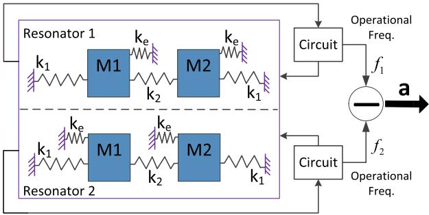  
Fig. 1. Schematic diagram of accelerometer principle ( $\mathbf{k}_1$ : effective spring of beams connected proof masses to anchor, $\mathbf{k}_2$ : effective spring of beams for proof masses connection together, $\mathbf{k}_{\mathrm{e}}$ : electrostatic softening spring).

performance and verification of proposed temperature compensation method. Final remarks are proposed in section V.

# II. STRUCTURAL DESIGN

# A. Principle of Operation

The resonant accelerometer consists of two similar silicon MEMS resonators. Each resonator consists of two proof masses for acceleration sensing and some beams for connection. Each mass includes one pair of differential inter-digitated drive combs, one pair of differential inter-digitated sense combs and turning electrode parallel plate capacitors [11]. The schematic diagram of the structure is shown in Figure 2(a). When a DC voltage (V) is applied on the parallel plates (as shown in Figure 2(b)), electrostatic softening spring will be induced for the resonator, whose stiffness is susceptible to the cube of the capacitive gap. While acceleration applied along the X-axis, the two proof masses of the resonator move in the same direction as shown in Figure 2(c) and the capacitive gap $(d_{1}, d_{2})$ changes. Consequently, stiffness of electrostatic softening spring changes, which results in the change of anti-phase resonant frequency of resonator as shown in Figure 2(d). The parallel plates of two resonators are placed on the opposite direction (see Figure 2(b)), which means the frequency of two resonators will change towards opposite direction when acceleration applied. Through the frequency difference of two resonators, the acceleration applied can be calculated. As analyzed above, the principle of accelerometer can be simplified in Figure 1.

# B. Structural Design Considerations

The anti-phase natural frequency of the resonator, computed through finite element analysis, is designed as $3666.1\mathrm{Hz}$ . While the minimum frequency of interference mode, a motion along Z-axis, is equal to $8370.1\mathrm{Hz}$ . The driving mode is the first order mode, which is beneficial to excite resonator. Large difference between the interference mode and the working mode helps to reduce its influence on the performance of the accelerometer.

Parallel plate capacitors are optimized to maximize the scale factor, which can be expressed as:

$$
S F = \frac {\omega_ {n 1} - \omega_ {n 2}}{a} \tag {1}
$$

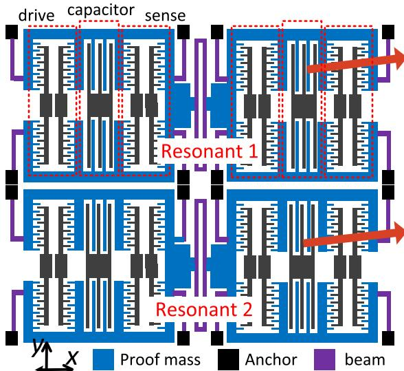  
(a)

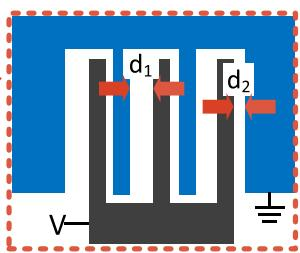

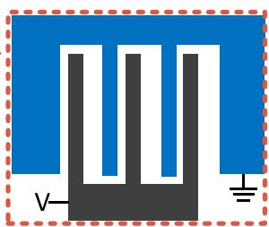  
(b)

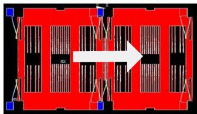  
(c)

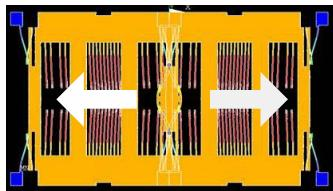  
(d)

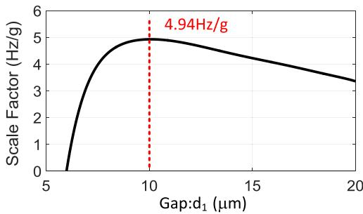  
Fig. 2. (a) Schematic diagram of structure. (b) Close-up view of turning electrode parallel plate capacitors. (c) Two proof masses moves on the same direction. (d) Anti-phase mode of resonator.   
Fig. 3. Scale factor as function of the big gap $d_{1}$ .

where $SF$ is scale factor, $\omega_{n1}$ and $\omega_{n2}$ are the frequencies of two resonators. Take electrostatic spring softening into consideration, the resonant frequency of each resonator is written as:

$$
\omega_ {n} = \sqrt {\frac {k - k _ {e}}{m}} \tag {2}
$$

where $k$ is the mechanical stiffness of resonator, $k_{e}$ is the stiffness of electrostatic softening spring, $m$ is equivalent mass. $k$ and $m$ can be obtained through finite element analysis. $k_{e}$ is defined as:

$$
k _ {e} = \frac {\partial F _ {e}}{\partial x} = 2 \times N \varepsilon_ {0} t b V ^ {2} \left[ \frac {1}{(d _ {2} + x) ^ {3}} + \frac {1}{(d _ {1} - x) ^ {3}} \right] (3)
$$

where $F_{e}$ is static electricity force, $x$ is the displacement of proof masses when acceleration applied, $N$ is the number of parallel plate capacitors, $\varepsilon_0$ is dielectric constant, $t$ is the thickness of structure, $b$ is the length of parallel plate capacitors, $V$ is the tuning voltage applied on the parallel plate capacitors, $d_{1}, d_{2}$ is the gap of parallel plate capacitors (as shown in Figure 2(b)). The displacement of proof masses $x$ can be acquired by solving the equation among beam force, static electricity force and inertial force. Among the parameters related to the stiffness of electrostatic softening spring, $t$ is

TABLEI DESIGNED PARAMETERS FOR EACH PROOF MASS   

<table><tr><td>Symbol</td><td>Definition</td><td>Value</td></tr><tr><td>ρ</td><td>density</td><td>2330kg/m3</td></tr><tr><td>t</td><td>thickness of the structure</td><td>80μm</td></tr><tr><td>M1/M2</td><td>mass of proof mass</td><td>305nkg</td></tr><tr><td>ND</td><td>number of drive combs</td><td>384</td></tr><tr><td>NS</td><td>number sense combs</td><td>384</td></tr><tr><td>b</td><td>length of parallel plate capacitors</td><td>1530μm</td></tr><tr><td>N</td><td>number of parallel plate capacitors</td><td>24</td></tr><tr><td>d1</td><td>large gap of parallel plate capacitors</td><td>10μm</td></tr><tr><td>d2</td><td>small gap of parallel plate capacitors</td><td>6μm</td></tr></table>

Dimension of comb finger: length $30\mu \mathrm{m}$ , gap $3\mu \mathrm{m}$ , overlap $20\mu \mathrm{m}$

$80\mu \mathrm{m}$ according to fabrication technique and $b$ is supposed to as bigger as possible. $N$ and $d_{1}, d_{2}$ are mutual restraint in a fixed size layout. Considering fabrication technique, the small gap $d_{2}$ is chosen to be $6\mu \mathrm{m}$ . Through multiple calculations based on the equations above built in the MATLAB, $d_{1}$ is chosen to be $10\mu \mathrm{m}$ to maximize the scaling factor as shown in Figure 3. The relevant geometric dimensions of each proof mass are reported in Table I.

# III. CONTROL CIRCUITS

The control circuits consist of analog front-end circuit, digital analog conversion circuit and digital circuit as shown in Figure 4(a). The output of the resonator is amplified by a trans-impedance amplifier and then some common errors are eliminated through differentiator in analog front-end circuit. Digital circuit includes continuous ring-down circuit and quality factor, frequency readout circuit.

# A. Continuous Ring-Down Circuit

Each resonator of accelerometer can be treated as a second order spring-mass-damping system. Quality factor is defined

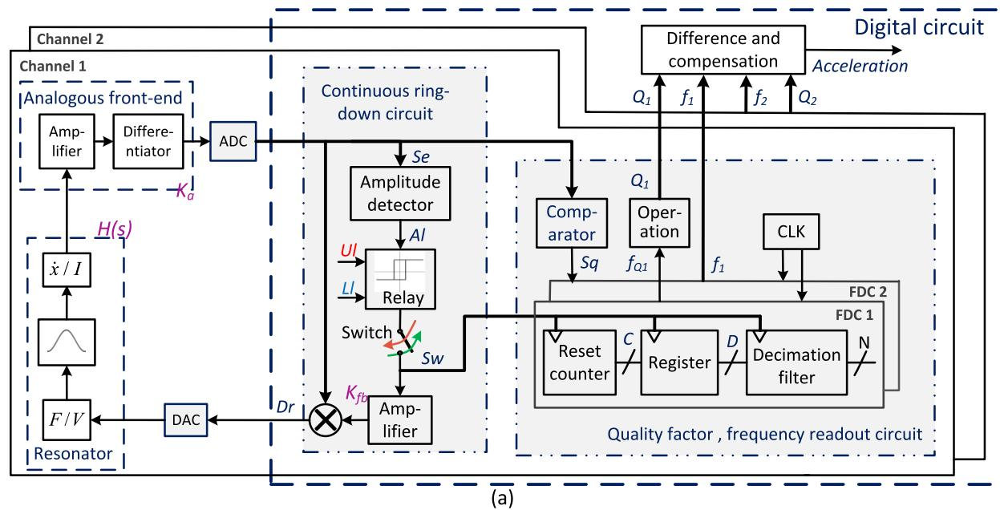

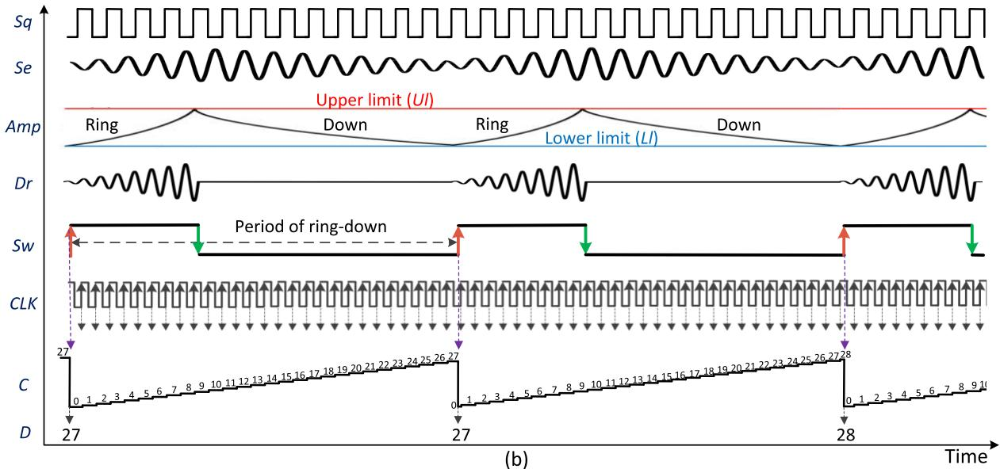  
Fig. 4. (a) Schematic the control circuits consisting of analog front-end circuit, ADC, DAC and digital circuit. (b) Signals in digital circuit.

as the energy stored in the system over the energy dissipated per radian, which represents the damping of the system. Various mechanisms contribute to the energy loss of MEMS resonators, such as thermo-elastic dissipation (TED), air-damping, and anchor loss. These mechanisms are susceptible to temperature, thus quality factor varies with temperature [27]–[29]. Consequently, quality factor is an ideal candidate as the temperature indicator for the resonator, which realizes zero-distance temperature measurement. In order to obtain the real temperature continuously and precisely, continuous ring-down technique is proposed to monitor real-time quality factor [32].

The s-domain transfer function of resonator can be expressed as:

$$
H (s) = K _ {m} \frac {1}{\frac {s ^ {2}}{\omega_ {n} ^ {2}} + \frac {s}{\omega_ {n} Q} + 1}, \quad Q = \frac {1}{2 \varsigma} \tag {4}
$$

where $K_{m}$ is amplification coefficient of resonator, $\omega_{n}$ is angular frequency, $Q$ is quality factor and $\zeta$ is damping coefficient. The amplitude function of the resonator can be simplified into [31]:

$$
H _ {A m p} (s) = K _ {m} \omega_ {n} \frac {1}{s + \frac {\omega_ {n}}{2 Q}} \tag {5}
$$

When the drive signal $(Dr)$ applies on resonator (which is called ring), the resonator begins to vibrate at its resonant frequency, which can be considered as a step response. The vibration amplitude $(Amp)$ can be written as:

$$
A m p (t) = \frac {2 K _ {f b} K _ {m} K _ {a} Q}{1 + 2 K _ {f b} K _ {m} K _ {a} Q} \left(1 - e ^ {- \left(\frac {\omega_ {n}}{2 Q} + K _ {m} K _ {a} K _ {f b} \omega_ {n}\right) t}\right) \tag {6}
$$

where $K_{a}$ is the amplification coefficient of analog front-end circuit, $K_{fb}$ is the amplification coefficient of feedback amplifier. Here two parameters are defined to expressed

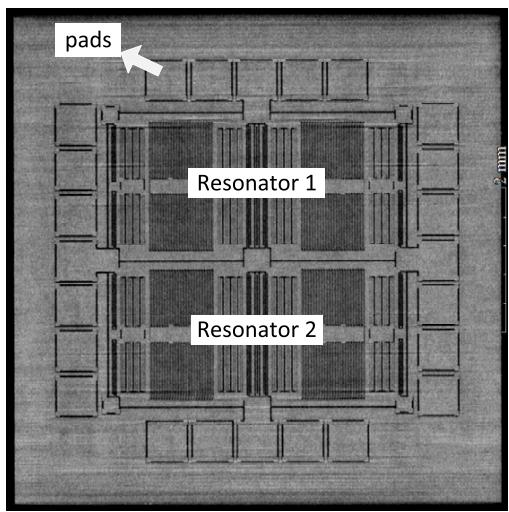  
(a)

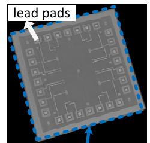  
(b)

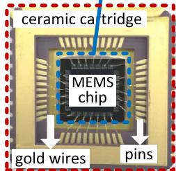  
(d)

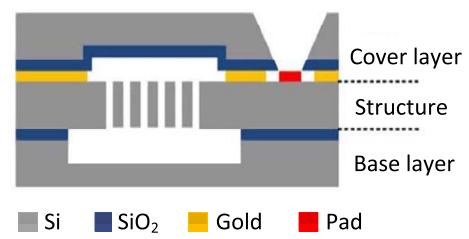  
(c)

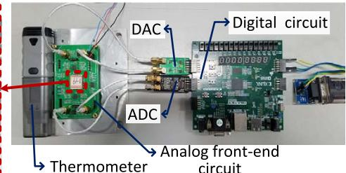  
(e)   
Fig. 5. Sensors Implementation: (a) X-ray photo of the structure. (b) Perspective drawing of the MEMS chip. (c) Process cross-section for three layers of the MEMS chip. (d) Photo of the ceramic cartridge with MEMS chip attached inside. (e) View of the readout circuit implementation.

succinctly:

$$
\alpha = \frac {2 K _ {f b} K _ {m} K _ {a} Q}{1 + 2 K _ {f b} K _ {m} K _ {a} Q} \beta = \frac {\omega_ {n}}{2 Q} + K _ {m} K _ {a} K _ {f b} \omega_ {n}
$$

Consider positive axis, make natural logarithm process and choose two fixed points. Then the period of down $t_{ring}$ can be obtained by:

$$
t _ {\text {r i n g}} = \left(t _ {2} - t _ {1}\right) = \frac {\operatorname {I n} \left(\operatorname {A m p} _ {2} - a\right) - \operatorname {I n} \left(\operatorname {A m p} _ {1} - a\right)}{\beta} \tag {7}
$$

When drive signal $(Dr)$ removes (which is called down), the free vibration of resonator decays due to damping effect. The vibration amplitude $(Amp)$ can be written as:

$$
A m p (t) = \pm \frac {e ^ {- \varsigma \omega_ {n} t}}{\sqrt {1 - \varsigma^ {2}}}, \quad \varsigma = \frac {1}{2 Q} \tag {8}
$$

Consider positive axis, make natural logarithm process and choose two fixed points. Then the period of down $t_{down}$ can be obtained by:

$$
t _ {d o w n} = \left(t _ {2} - t _ {1}\right) = \frac {2 Q}{\omega_ {n}} \left(\text {I n A m p} _ {1} - \text {I n A m p} _ {2}\right) \tag {9}
$$

Consequently, the frequency of continuous ring-down $\mathrm{f_Q}$ can be repressed as:

$$
f _ {Q} = \frac {1}{t _ {\text {d o w n}} + t _ {\text {r i n g}}} \tag {10}
$$

Since the period of ring $t_{ring}$ and period of down $t_{down}$ are both related to quality factor, frequency of continuous ring-down $f_{Q}$ can represent quality factor. The measurement of quality factor is finally translated into the measurement of the frequency of continuous ring-down. In addition, quality factor is frequency modulated with this technique, which increases the robustness against the gain variation in circuit blocks.

Continuous ring-down circuit is supposed to read the sense signal $(Se)$ from ADC and provide drive signal $(Dr)$ for DAC. It includes an amplitude detector, a relay, a switch and an

amplifier as shown in Figure 4 (a). Relay constantly compares amplitude $(Amp)$ obtained from the amplitude detector with the upper limit $(Ul)$ and lower limit $(Ll)$ and produces a control signal for the switch. The continuous ring-down driving principle works as follows: when the vibration amplitude $(Amp)$ of the resonator delays to lower limit, the switch close, switch signal $(Sw)$ turns into "1", the feedback drive signal $(Dr)$ applies on the resonator. While when the vibration amplitude $(Amp)$ of the resonator reaches to upper limit, the switch close, switch signal $(Sw)$ turns into "0", the feedback drive signal $(Dr)$ removes. This process repeats constantly and continuous ring-down driving circuits is implemented. When the switch is close, amplifier enhances amplitude of drive signal to ensure sense signal reach the upper limit quickly and steadily. The signals of continuous ring-down show in Figure 4(b). The switch signal $(Sw)$ is utilized as input of quality factor readout circuits for quality factor measurement.

# B. Quality Factor Readout Circuit

With continuous ring-down technique, quality factor consequently translated into the measurement of the switch signal's frequency. Frequency digital converter (FDC) based on the principle of reset counter is designed for quality factor measurement. Principle of this FDC shows in Figure 4(a) and signals show in Figure 4(b) [32], [33]. Reset counter continuously records the number of crystal oscillator reference clock's (CLK) rising edge. When each rising edge of the switch's signal arrives, difference $(D)$ between counter's values and previous value recorded by register will be calculated, which reflects the ratio between frequency of the switch signal and the frequency of reference clock. The frequency of reference clock is known, thus frequency of the switch can be acquired. Through a decimation filter, the digital number $(D)$ is decimated to increase resolution. The quantization noise of the FDC is first-order noise-shaped, which means noise floor will be limited in the digital output spectrum at low

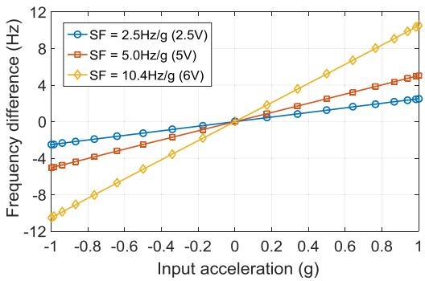  
Fig. 6. Frequency difference of the resonators for input accelerations in the range of $\pm 1\mathrm{g}$ with different tuning voltage.

frequencies. This FDC is quite suitable for quality factor readout as the frequency of switch signal (continuous ring-down) is about $0.5\mathrm{Hz}$ . When sense signal $(Se)$ goes through a zero-crossing comparator, a square wave $(Sq)$ with the same frequency of sense signal generates, which is utilized as an input of frequency readout circuit. Frequency readout circuit is the same as the quality factor readout circuit based on the principle of reset counter.

# IV. TEST AND RESULTS

# A. Sensors Implementation

The structure is manufactured using Deep Reactive Ion Etching on SOI wafer with a standard $80\mu \mathrm{m}$ SOI process, which enhances the scale factor and lower the mechanical Brownian noise level. Photo of the structure shows in Figure 5(a) including resonators in middle and pads around. The actual MEMS chip size is equal to $6.6^{*}6.6^{*}0.6~\mathrm{mm}^3$ . It is realized with three layers including the cover layer, the structure layer and the base layer, whose cross-section shows in Figure 5(c). The cover layer and the structure layer are joined by Au/Si eutectic bonding, forming a hermetic cavity. This process is named as on-wafer-level vacuum packaging technique [34], which is beneficial to maintain the vacuum for the resonator and enhance its quality factor. The MEMS chip including three layers is attached inside a ceramic cartridge with epoxy as shown in Figure 5(d). Each electrode pad is drawn to structure with lead pads on cover layer as shown in Figure 5(b) and connected to the corresponding pins of the ceramic cartridge with gold wires as shown in Figure 5(d). The control circuit is implemented in Figure 5(e). The analog front-end circuit on which packaged MEMS chip is welded and digital analog conversion circuit are printed circuit boards (PCBs). Main chips are chosen from ANALOG DEVICES. The sampling rate of analog-to-digital converter (ADC) and digital-to-analog converter (DAC) is chosen to be $700\mathrm{kHz}$ and their data is in a 16-bit word format. Digital control circuit is implemented in a Diginent Nexys4 DDR board, based on the latest Artix-7 FPGA from Xilinx.

# B. Basic Experiments

The accelerometer was mounted on a horizontal axis rotation table and the frequency differences between two

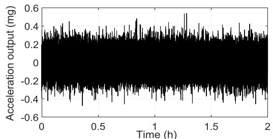

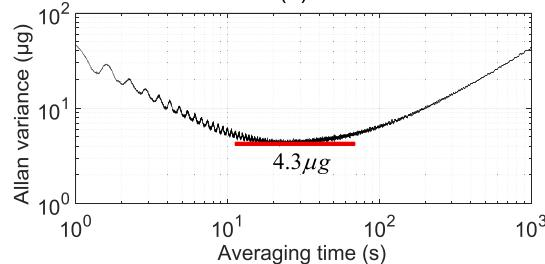  
(a)   
(b)

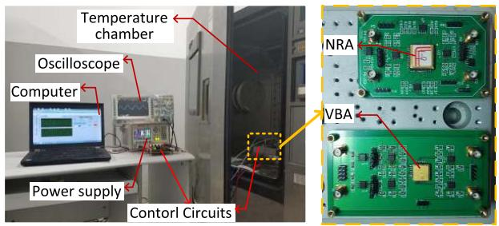  
Fig. 7. (a) Output of the accelerometer collected for two hours. (b) Allan variance of output of the accelerometer.   
Fig. 8. Set-up for temperature experiments of accelerometers.

resonators are recorded under different tilt angles. Since the scale factor can be adjusted by tuning the voltage applied on the parallel plate capacitors, this experiment was also repeated with three different tuning voltages (3.9, 5 and 6V). Experiments reveal linear response to acceleration with tunable scale factors of $2.5\mathrm{Hz / g}$ , $5\mathrm{Hz / g}$ and $10.4\mathrm{Hz / g}$ , respectively as shown in Figure 6, which corresponds to the theoretical calculation: $2.55\mathrm{Hz / g}$ , $4.94\mathrm{Hz / g}$ and $9.85\mathrm{Hz / g}$ , respectively. It should be noted that all the further experimental data was derived using a more conservative value of $5\mathrm{Hz / g}$ in order to obtain a balance between scale factor and its nonlinearity.

For evaluation of bias stability of the accelerometer at room temperature, the accelerometer was placed on a stable marble foundation with zero acceleration input and the output is collected for 120 minutes with a sampling rate of $250\mathrm{Hz}$ as shown in Figure 7(a). Then the Allan variance of the data is calculated $4.3\mu \mathrm{g}$ bias instability as shown in Figure 7(b). In the same circumstance, quality factor is 4231 and 4073 through ring-down testing for two resonators respectively. Table II summarizes the measured performance of the accelerometer and the comparison with the previously reported resonant accelerometers.

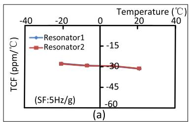

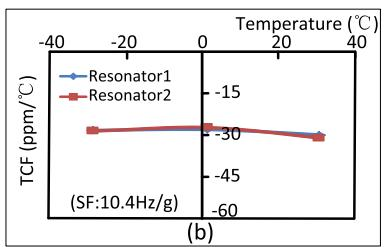

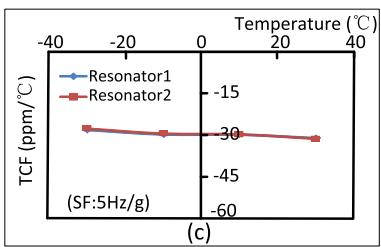

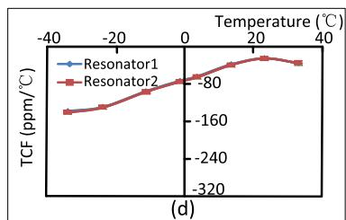

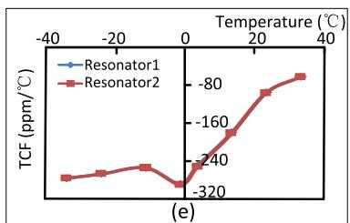

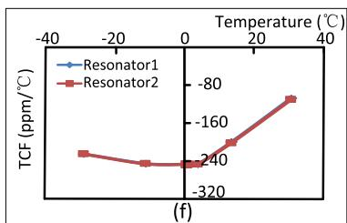  
Fig. 9. (a) TCF of NRA1 (SF: $5\mathrm{Hz / g}$ ). (b) TCF of NRA1 (SF: $10.4\mathrm{Hz / g}$ ). (c) TCF of NRA2. (d) TCF of VBA1. (e) TCF of VBA2. (f) TCF of VBA3.

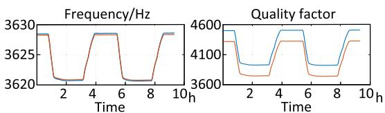

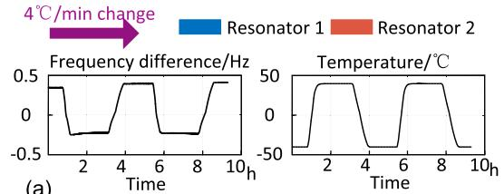

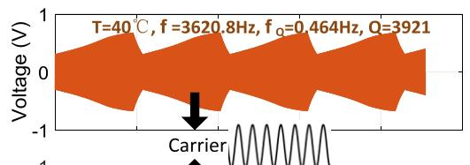

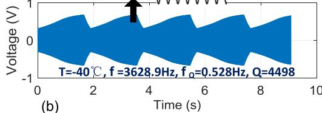

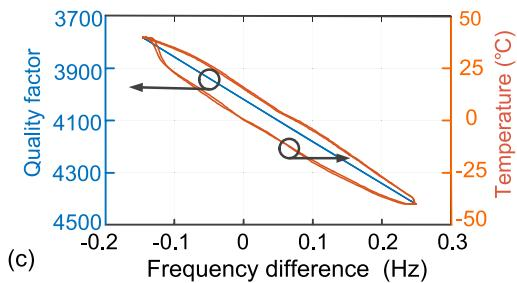

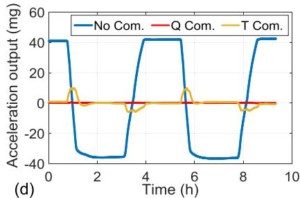  
Fig. 10. Results of temperature cycling experiments: (a) Collection of frequencies, quality factors and temperature. (b) Sense signal at $40^{\circ}\mathrm{C}$ and $-40^{\circ}\mathrm{C}$ . (c) Relationship between frequency difference, quality factor and temperature. (d) Acceleration output comparison.

# C. Temperature Experiments

In order to evaluate the performance of temperature of the accelerometer, we compare the proposed accelerometer (NRA) and a vibration beam resonant accelerometer (VBA) [11] in the following testing. The resonant frequency and scale factor of this vibration beam resonant accelerometer are $25567\mathrm{Hz}$ and $31.56\mathrm{Hz / g}$ respectively. Experimental systems are built in Figure 8. Analog front-end circuits on which packaged MEMS chips are welded and a thermometer were put in the temperature chamber and installed on a horizontal axis turntable. Temperature is set at different points and stays for two hours at each point to ensure uniformity. Frequencies of the accelerometers and temperature were recorded. Based on

the data collected, temperature coefficient of frequency (TCF) defined as frequency change over temperature change is calculated as shown in Figure 9.

The TCF of NRA is closed to the TCF of silicon resonant systems typically $-30~\mathrm{ppm} / {}^{\circ}\mathrm{C}$ as shown in Figure 9(a), (b), (c). As to VBA, TCF is deviated from $-30~\mathrm{ppm} / {}^{\circ}\mathrm{C}$ and changes drastically varying temperature as shown in Figure 9 (d), (e), (f). Besides the temperature coefficient of the silicon properties, package stress also plays a huge role, which causes the TCF of VBA changing drastically varying temperature. These two resonant accelerometers were fabricated with the same standard SOI process and packaged with the same technique. Both accelerometers have not deliberately designed to ensure package-stress isolated. It is obvious to find that

TABLE II PERFORMANCE COMPARISON BETWEEN THE PROPOSED NRA AND PREVIOUSLY REPORTED RESONANT ACCELERometers   

<table><tr><td>Reference Year</td><td>[12] 2016</td><td>[16] 2018</td><td>[8] 2012</td><td>[11] 2015</td><td>This work</td></tr><tr><td>Frequency (Hz)</td><td>25550</td><td>25567</td><td>332.1k</td><td>2600</td><td>3625</td></tr><tr><td>TCF (ppm/°C)</td><td>-29</td><td>80-300</td><td>220</td><td>-35</td><td>-28.9</td></tr><tr><td>Scale factor (Hz/g)</td><td>9.18</td><td>31.56</td><td>18.1</td><td>7.7</td><td>5.09</td></tr><tr><td>Range (g)</td><td>10</td><td>±50</td><td>±1</td><td>±1</td><td>±1</td></tr><tr><td>Quality factor</td><td>850</td><td>20836</td><td>2200</td><td>0.3M</td><td>4231</td></tr><tr><td>Bias-instability (μg)</td><td>-</td><td>3.9</td><td>-</td><td>6</td><td>4.3</td></tr><tr><td>Type</td><td>ES</td><td>VB</td><td>VB</td><td>ES</td><td>ES</td></tr></table>

- Not mentioned.

VB: vibration beams, ES: electrostatic spring.

the NRA is insensitive to stress compared with VBA thinks to its principle as mentioned in the abstract. In most cases, the frequency difference between two differential resonators reflects the input acceleration, while the common mode errors such as temperature effect can be efficiently cancelled, and scale factor can also be doubled. TCF of frequency difference is decreased to $1.4\mathrm{ppm} / {}^{\circ}\mathrm{C}$ for NRA.

# D. Temperature Compensation

For verification of temperature compensation based on real-time quality factor via continuous ring-down technique, temperature cycling experiments were conducted. The temperature of thermal chamber was set to change from $-40^{\circ}\mathrm{C}$ to $40^{\circ}\mathrm{C}$ on cycles and data is collected by upper computer as shown in Figure 10(a). The waveforms of the sense signal of Resonator 1 at two different temperatures are recorded and shows in Figure 10(b). The frequency of continuous ring-down is different at different temperature, through which quality factor can be acquired.

Figure10(c) shows that quality factor (average value of two resonators) has a better correlation with frequency difference, while the relationship between frequency difference and temperature measured by thermometer has hysteresis. Finally, frequency difference (acceleration output) is compensated with linear compensation by quality factor and temperature. The acceleration output attains high stability relatively after quality factor compensation, while acceleration output after temperature compensation is still unstable due to hysteresis as shown in Figure 10(d). The bias stability of acceleration $(1\sigma$ value) is improved from $35.2\mathrm{mg}$ to $0.08\mathrm{mg}$ after compensation over $-40^{\circ}\mathrm{C}$ to $40^{\circ}\mathrm{C}$ , which is $36\times$ better than that based on external thermometer.

# V. CONCLUSION

In this paper, a resonant MEMS accelerometer based on electrostatic spring softening effect and continuous ring-down technique has been implemented. Through electrostatic softening spring, the displacement of proof masses caused by external acceleration is modulated on the frequency of resonator's anti-phase modal without any stress transmission. In control circuit, a method of temperature compensation based on the measurement of real-time quality factor via continuous

ring-down is proposed, which attenuates measuring hysteresis and improves the precision of temperature compensation. The key specifications of this accelerometer were tested such as measuring range, scale factor, Allan variance and quality factor. Experimental results show that this accelerometer has a better performance of temperature compared with vibration beam resonant accelerometer. The stability of acceleration output was improved from $35.2\mathrm{mg}$ to $0.08\mathrm{mg}$ with quality factor compensation ranging from $-40^{\circ}\mathrm{C}$ to $+40^{\circ}\mathrm{C}$ , which is $36\times$ better than that based on external thermometer.

# REFERENCES

[1] M. W. Judy, "Evolution of integrated inertial MEMS technology," in Proc. Solid-State Sens., Actuator Microsyst. Workshop, 2004, pp. 27-32.   
[2] J. Marek, “MEMS for automotive and consumer electronics,” in IEEE Int. Conf. Solid-State Circuits Conf. (ISSCC) Dig. Tech. Papers, Feb. 2010, pp. 9–17.   
[3] M. S. Weinberg et al., "Micromachining inertial instruments," in Proc. Micromachining Microfabrication Process Technol. II, Int. Soc. Opt. Photon., vol. 2879, 1996, pp. 26-36, doi: 10.1117/12.251201.   
[4] J. Chae, H. Kulah, and K. Najafi, "An in-plane high-sensitivity, low-noise micro-g silicon accelerometer," in Proc. IEEE 16th Int. Conf. MICRO Electro Mech. Syst. (MEMS), Kyoto, Japan, Jan. 2003, pp. 466-469.   
[5] M. A. Perez and A. M. Shkel, "Design and demonstration of a bulk micromachined Fabry-Pérot $\mu$ g-resolution accelerometer," IEEE Sensors J., vol. 7, no. 12, pp. 1653-1662, Dec. 2007.   
[6] R. Hopkins, J. Miola, R. Setterlund, B. Dow, and W. Sawyer, "The silicon oscillating accelerometer: A high-performance MEMS accelerometer for precision navigation and strategic guidance applications," in Proc. Nat. Tech. Annu. Meeting Inst. Navigat., 2005, pp. 970-979.   
[7] J. Zhao et al., "A $0.23\mu \mathrm{g}$ bias instability and $1.6~\mu \mathrm{g} / \mathrm{Hz}^{1 / 2}$ resolution silicon oscillating accelerometer with build-in $\Sigma -\Delta$ frequency-to-digital converter," in Proc. IEEE VLSI Circuits, Jun. 2016, pp. 1-2.   
[8] G. Vigevani, F. T. Goericke, A. P. Pisano, I. I. Izyumin, and B. E. Boser, "Microleverage DETF aluminum nitride resonating accelerometer," in Proc. IEEE Freq. Control Symp., May 2012, pp. 1-4.   
[9] C. Comi, A. Corigliano, G. Langfelder, A. Longoni, A. Tocchio, and B. Simoni, "A resonant microaccelerometer with high sensitivity operating in an oscillating circuit," J. Microelectromech. Syst., vol. 19, no. 5, pp. 1140-1152, 2010.   
[10] Y. Zhao et al., "A sub- $\mu$ g bias-instability MEMS oscillating accelerometer with an ultra-low-noise read-out circuit in CMOS," IEEE J. Solid-State Circuits, vol. 50, no. 9, pp. 2113-2126, Sep. 2015.   
[11] A. A. Trusov, S. A. Zotov, B. R. Simon, and A. M. Shkel, "Silicon accelerometer with differential frequency modulation and continuous self-calibration," in Proc. IEEE Int. Conf. MICRO Electro Mech.Syst., Jan.2013,pp.29-32.   
[12] C. Comi, A. Corigliano, G. Langfelder, V. Zega, and S. Zerbini, "Sensitivity and temperature behavior of a novel z-axis differential resonant micro accelerometer," J. Micromech. Microeng., vol. 26, no. 3, p. 035006, 2016.   
[13] C. Comi, A. Corigliano, A. Ghisi, and S. Zerbini, “A resonant micro accelerometer based on electrostatic stiffness variation,” Meccanica, vol. 48, no. 8, pp. 1893–1900, 2013.   
[14] B.-L. Lee, C.-H. Oh, S. Lee, Y.-S. Oh, and K.-J. Chun, "A vacuum packaged differential resonant accelerometer using gap sensitive electrostatic stiffness changing effect," in Proc. 13th Int. Conf. MICRO Electro Mech. Syst., Jan. 2000, pp. 352-357.   
[15] O. Tabata and T. Yamamoto, “Two-axis detection resonant accelerometer based on rigidity change,” Sens. Actuators A, Phys., vol. 75, no. 1, pp. 53-59, 1999.   
[16] J. Zhang, Y. Wang, V. Zega, Y. Su, and A. Corigliano, "Nonlinear dynamics under varying temperature conditions of the resonating beams of a differential resonant accelerometer," J. Micromech. Microeng., vol. 28, no. 7, p. 075004, 2018.   
[17] J. H. Dong, A. P. Qiu, and R. Shi, "Temperature influence mechanism of micromechanical silicon oscillating accelerometer," in Proc. IEEE Power Eng. Automat. Conf., Sep. 2011, pp. 385-389.   
[18] R. Melamud et al., "Effects of stress on the temperature coefficient of frequency in double clamped resonators," in IEEE Int. Conf. Solid-State Sens., Actuators Microsyst. Dig. Tech. Papers (Transducers), vol. 1, Jun. 2005, pp. 392-395.

[19] G. J. Liu, T. Jiang, Q. Jiang, and A. Wang, "Characterization of a MEMS accelerometer considering environmental temperature fluctuations," Mater. Sci. Forum, vols. 697-698, pp. 801-804, Sep. 2011.   
[20] R. Yang, Z. Wang, J. Lee, K. Ladhane, D. J. Young, and P. X. L. Feng, "Temperature dependence of torsional and flexural modes in 6H-SiC microdisk resonators," in Proc. IEEE Int. Freq. Control Symp. (FCS), May 2014, pp. 1-3.   
[21] G. Xia, Q. Shi, A. Qiu, X. Yu, and Z. Pei, "An on-chip thermal stress evaluation method for silicon resonant accelerometer," in Proc. IEEE Sensors, Oct. 2016, pp. 1-3.   
[22] C. M. Jha, M. A. Hopcroft, and S. A. Chandorkar, "Thermal isolation of encapsulated MEMS resonators," J. Microelectromech. Syst., vol. 17, no. 1, pp. 175-184, 2008.   
[23] S.-H. Lee, S. W. Lee, and K. Najafi, "A generic environment-resistant packaging technology for MEMS," in Proc. IEEE Int. Solid-State Sens., Actuators Microsyst. Conf. (TRANSDUCERS), Jun. 2007, pp. 335-338.   
[24] R. Tabrizian, G. Casinovi, and F. Ayazi, "Temperature-stable silicon oxide (SiOx) micromechanical resonators," IEEE Trans. Electron Devices, vol. 60, no. 8, pp. 2656-2663, Aug. 2013.   
[25] D. R. Myers, R. G. Azevedo, L. Chen, M. Mehregany, and A. P. Pisano, "Passive substrate temperature compensation of doubly anchored double-ended tuning forks," J. Microelectromech. Syst., vol. 21, no. 6, pp. 1321-1328, 2012.   
[26] T. Kose, K. Azgin, and T. Akin, "Temperature compensation of a capacitive MEMS accelerometer by using a MEMS oscillator," in Proc. IEEE Int. Symp. Inertial Sensors Syst., Feb. 2016, pp. 33-36.   
[27] B. Kim et al., "Temperature dependence of quality factor in MEMS resonators," J. Microelectromech. Syst., vol. 17, no. 3, pp. 755-766, 2008.   
[28] M. A. Hopcroft et al., "Temperature compensation of a MEMS resonator using quality factor as a thermometer," in Proc. IEEE Int. Conf. MICRO Electro Mech. Syst. (MEMS), Istanbul, Turkey, Jan. 2006, pp. 222-225.   
[29] W. E. Newell, “Miniaturization of tuning forks,” Science, vol. 161, no. 3848, pp. 1320–1326, 1968.   
[30] Y. Wang, L. Geng, J. Zhang, Y. Su, C. Yu, and J. Zhao, "A virtual thermometer with low measuring hysteresis for high performance MEMS resonant sensors," in Proc. IEEE Sensors, Oct. 2017, pp. 1-3.   
[31] L. Aaltonen and K. A. I. Halonen, "An analog drive loop for a capacitive MEMS gyroscope," Analog Integr. Circuits Signal Process., vol. 63, no. 3, pp. 465-476, 2010.   
[32] J. V. Rethy and G. Gielen, "An energy-efficient capacitance-controlled oscillator-based sensor interface for MEMS sensors," in Proc. IEEE Solid-State Circuits Conf. (A-SSCC), Nov. 2013, pp. 405-408.   
[33] J. Kim, T.-K. Jang, Y.-G. Yoon, and S. Cho, "Analysis and design of voltage-controlled oscillator based analog-to-digital converter," IEEE Trans. Circuits Syst. I, Reg. Papers, vol. 57, no. 1, pp. 18-30, Jan. 2010.   
[34] M. M. Torunbalci, S. E. Alper, and T. Akin, "Wafer level hermetic encapsulation of MEMS inertial sensors using SOI cap wafers with vertical feedthroughs," in Proc. Int. Symp. Inertial Sensors Syst. (ISISS), Feb. 2014, pp. 1-2.

  
Yagang Wang (S'17) was born in Nantong, Jiangsu Province, China, in 1993. He received the B.S. degree from the School of Mechanical Engineering, Nanjing University of Science and Technology, in 2016, where he is currently pursuing the M.S.E. degree with the MEMS Inertial Technology Research Center. His research interests include the design of MEMS resonant accelerometer, control system analysis, and temperature characteristic of MEMS resonant accelerometer.

  
Jing Zhang was born in Bayannur, Inner Mongolia, China, in 1990. She received the B.S. degree from the School of Science, Nanjing University of Science and Technology (NJUST), in 2012, where she is currently pursuing the Ph.D. degree with the MEMS Inertial Technology Research Center. Her research interests include the analysis and design of microsystems, MEMS structure design, mechanics, and MEMS processing.

  
Zhichao Yao was born in Shuozhou, Shanxi Province, China, in 1994. He received the B.S. degree from the School of Mechanical Engineering, Nanjing University of Science and Technology, in 2015, where he is currently pursuing the Ph.D. degree with the MEMS Inertial Technology Research Center. His research interests include the design of MEMS resonant gyroscope, energy dissipation characteristics, and vibration isolation of MEMS resonators.

  
Chen Lin was born in Changzhou, Jiangsu Province, China, in 1990. He received the B.S. degree from the School of Mechanical Engineering, Nanjing University of Science and Technology, in 2013, where he is currently pursuing the Ph.D. degree with the MEMS Inertial Technology Research Center. His research interests include the design of MEMS resonant gyroscope, vibration modeling, and energy dissipation characteristics of MEMS resonators.

  
Tong Zhou (M'17) was born in Xuzhou, Jiangsu Province, China, in 1985. He received the M.S. degree in detection technology and automatic equipment from Soochow University, Suzhou, China, in 2010, and the Ph.D. degree from the School of Mechanical Engineering, Nanjing University of Science and Technology, China. Since 2016, he has been a Lecturer with the School of Mechanical Engineering, Nanjing University of Science and Technology. His research interests include analog integrated circuits and system design, mixed-signal   
integrated circuits design, and infrared readout integrated circuits design.

  
Yan Su was born in Suzhou, Jiangsu Province, China in 1967. He received the M.S.E. and Ph.D. degrees in instrumentation science and technology from Southeast University in 1996 and 2001, respectively. From 2001 to 2005, he was with Southeast University as an Associate Professor and a Professor. Since 2005, he has been a Professor with the School of Mechanical Engineering, Nanjing University of Science and Technology, China. His research interests include MEMS inertial sensors, biosensors, infrared sensors, and inertial navigation systems.

  
Jian Zhao (S'14-M'18) was born in Hanzhong, Shanxi Province, China, in 1989. He received the B.S. and Ph.D. degrees from the Nanjing University of Science and Technology, Nanjing, China, in 2011 and 2017, respectively. From 2012 to 2015, he was a Visiting Scholar with the VLSI and Signal Processing Laboratory, National University of Singapore, where he was involved in the design of CMOS readout circuits for silicon oscillating accelerometers and MEMS gyroscopes. He has been with the Department of Electronic Engineering, Tsinghua   
University, since 2017, where he is currently a Research Associate. His research interests are integrated circuits for MEMS sensors and wireless body area networks.