# A MEMS Resonant Accelerometer With High Relative Sensitivity Based on Sensing Scheme of Electrostatically Induced Stiffness Perturbation

Hong Ding $^{\text{D}}$ , Changju Wu, and Jin Xie $^{\text{D}}$ , Member, IEEE

Abstract—This paper reports a micro electromechanical system (MEMS) resonant accelerometer with high relative sensitivity based on sensing scheme of electrostatically-induced stiffness perturbation for the first time. The perturbation electrodes convert the acceleration induced displacement of proof masses to electrostatic perturbation force and cause the effective stiffness perturbation and frequency shift of the resonator. The design of structure dimensions and the application of electrostatically-induced stiffness perturbation lower the resonant frequency and improve the sensitivity, resulting in the improvement of relative sensitivity. The sensing scheme is theoretically analyzed and the device is systematically simulated by finite element analysis (FEA). The open-loop characterization demonstrates that the differential sensitivity is $297.5\mathrm{Hz / g}$ at resonant frequency of $16.061\mathrm{kHz}$ under polarization voltage of $50\mathrm{V}$ . The relative sensitivity, defined as the absolute sensitivity divided by resonant frequency, of $1.8523\%/\mathrm{g}$ is much higher than the traditional resonant accelerometers based on axial force sensing. The bias instability is $0.11\mathrm{mg}$ and noise floor is $13.2\mathrm{mg} / \sqrt{\mathrm{Hz}}$ . The performance makes the device a potentially attractive option for highly-sensitive acceleration measurements. [2020-0145]

Index Terms—Resonant accelerometers, high relative sensitivity, electrostatically-induced stiffness perturbation.

# I. INTRODUCTION

MEMS resonators have been widely employed to develop different types of sensors. As the core sensing elements, the resonators alter output frequency as a function of external physical parameters due to the axial load transformed from those parameters [1]. Based on this working principle, strain sensors [2], electrostatic charge sensors [3], pressure sensors [4] and many other resonant sensors [5], [6] have been developed. As a member of this family, resonant accelerometers have the advantages of quasi-digital output signal, strong

Manuscript received May 8, 2020; revised October 2, 2020; accepted November 10, 2020. Date of publication November 23, 2020; date of current version January 15, 2021. This work was supported in part by the National Natural Science Foundation of China under Grant 51875521, in part by the Zhejiang Provincial Natural Science Foundation of China under Grant LZ19E050002, and in part by the Science Fund for Creative Research Groups of National Natural Science Foundation of China under Grant 51821093. Subject Editor A. M. Shkel. (Corresponding author: Jin Xie.)

Hong Ding and Jin Xie are with the State Key Laboratory of Fluid Power and Mechatronic Systems, Zhejiang University, Hangzhou 310027, China (e-mail: dinghongmems@163.com; xiejin@zju.edu.cn).

Changju Wu is with the School of Aeronautics and Astronautics, Zhejiang University, Hangzhou, 310027, China (e-mail: wuchangju@zju.edu.cn).

Color versions of one or more figures in this article are available at https://doi.org/10.1109/JMEMS.2020.3037838.

Digital Object Identifier 10.1109/JMEMS.2020.3037838

anti-interference and large dynamic range, compared with the other types of accelerometers [7]–[10]. The effective stiffness of sensing resonator changes due to the inertial force of the proof mass along axial direction, leading to a frequency shift. The previously reported resonant accelerometers exhibited sensitivities from lower than $10\mathrm{Hz / g}$ to higher than $1000\mathrm{Hz / g}$ . The relative sensitivity $(\% /\mathrm{g})$ , defined as the sensitivity divided by resonant frequency, is also an important specification to compare the sensitivity of resonant accelerometers, but most of the current resonant accelerometers have low relative sensitivity (lower than $1\% /\mathrm{g}$ ).

In order to enhance the sensitivity of resonant accelerometers, various methods have been attempted. The early approach is the integration of microleverage mechanisms which amplifies the axial load of resonators. The related researches mainly focused on the optimization of microleverage dimensions to realize maximum amplification factor [11], or using multi-stage microleverage mechanisms to further intensify the amplification capability [12]-[14]. Although this approach greatly enhances the sensitivity, the global stiffness of the device becomes very high and the bandwidth requirements for different applications are difficult to be satisfied. The resonators working at higher modes can also provide higher absolute sensitivity [15], [16], but in this approach the relative sensitivity is low because the resonant frequency increases by larger ratio than the absolute sensitivity. Recently, a novel sensing scheme based on electrostatically-induced stiffness perturbation is proven to be an effective way to improve the sensitivity of resonant sensors. The resonant frequency is more sensitive to the external force applied along the lateral direction of the resonator than the axial direction, so that the perturbation force sensing is more efficient than the axial force sensing [17], [18].

In this paper, a new sensing scheme of electrostatically-induced stiffness perturbation is proposed to measure acceleration. This sensing scheme utilizes acceleration to generate variable electrostatic perturbation force to perturb the effective stiffness of resonator. The device is designed and optimized with theoretical analysis and FEA simulations, and fabricated using silicon-on-insulator (SOI) process. Open-loop characterization and close-loop self-oscillation are performed to acquire the sensitivity, bias instability and noise floor of the device. The high absolute sensitivity and relative sensitivity show great potential of the proposed resonant accelerometers.

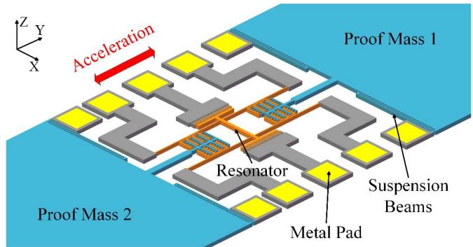

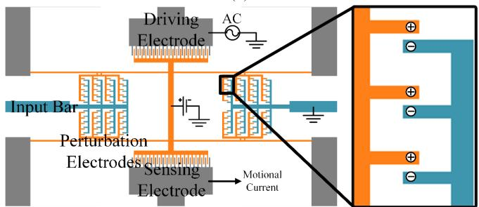  
(a)   
(b)   
Fig. 1. (a) Schematic view of resonant accelerometer based on sensing scheme of electrostatically-induced stiffness perturbation; (b) schematic view of micro resonator under the electrostatic perturbing force.

# II. DESIGN, THEORY AND SIMULATIONS

# A. Structure Design and Working Principle

The schematic view of resonant accelerometer based on sensing scheme of electrostatically-induced stiffness perturbation is shown in Fig. 1. (a). The resonator is located in the central region with comb driving/sensing electrodes. Two proof masses are suspended and symmetrically distributed in both sides, and will move in the same direction when the acceleration is applied. The schematic view of micro resonator under the electrostatic perturbing force is shown in Fig. 1. (b) in more detail. Two identical tines are physically connected at the center via a shuttle to vibrate at in-phase mode. The driving/sensing electrodes are applied to drive the resonator into resonance and sense the induced motional current, respectively. The perturbation capacitor consists of a comb electrode attached to the input bar of the proof mass and two comb electrodes attached to the tines. Under operating condition, two proof masses are both grounded and the resonator is DC polarized. The DC polarization voltage not only helps generate motional current when the AC driving voltage is applied, but also forms the electrostatic perturbing force with the grounded proof masses in the perturbation capacitor. During the resonance, the electrostatically-induced stiffness perturbation of resonator, which causes the variation of resonant frequency, is a function of the perturbation force. Under the acceleration, the proof masses move along the acceleration and cause the variation of the perturbation force, finally shift the resonant frequency of the resonator. In order to improve the sensitivity, the perturbation electrodes are designed to be multi-parallel structure. Because both proof masses will move in the same direction under acceleration,

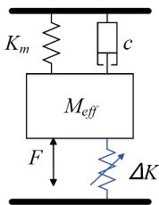  
(a)

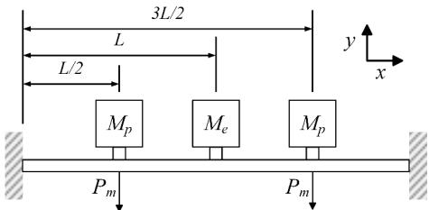  
(b)

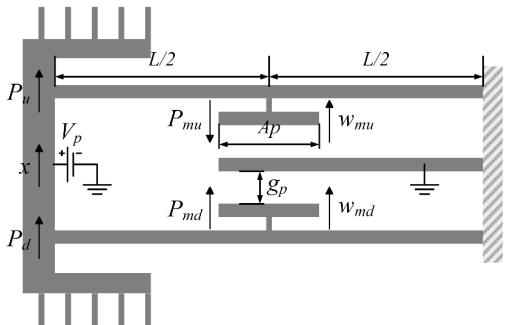  
(c)   
Fig. 2. (a) The equivalent mass-spring-damper system model of the perturbation sensitive resonator; (b) beam model used in the modal analysis; (c) mechanical analysis of the right half of the micro resonator.

the perturbation electrodes of these two masses also face to the same direction.

# B. Theoretical Analysis

The resonator of the device can be modelled as a mass-spring-damper system, as shown in Fig. 2. (a), where $M_{eff}$ is the effective mass, $K_{m}$ is the mechanical stiffness, $\Delta K$ is the perturbed stiffness, $c$ is the damping coefficient and $F$ is the axial force applied to the resonator. According to the system model, the resonant frequency $f$ of the resonator can be expressed as

$$
f = \frac {1}{2 \pi} \sqrt {\frac {K _ {e f f}}{M _ {e f f}}} = \frac {1}{2 \pi} \sqrt {\frac {K _ {m} + \Delta K}{M _ {e f f}}} \tag {1}
$$

where $K_{eff}$ is the effective stiffness.

As shown in Fig. 2. (b), the resonator tire can be viewed as a clamped-clamped beam, and the driving/sensing electrodes and the perturbation electrodes can be viewed as three attached masses placed along the tire, where $M_{e}$ is the mass of the driving/sensing electrode, $M_{p}$ is the mass of the perturbation electrode, and $P_{m}$ is the perturbation force. Under bending effect, the differential equation for this structure is

$$
E I \frac {\partial^ {4} y}{\partial x ^ {4}} + \rho S \frac {\partial^ {2} y}{\partial t ^ {2}} = - P _ {m a} \tag {2}
$$

$$
\begin{array}{l} P _ {m a} = \sum_ {j = 1} ^ {3} M _ {j} \ddot {y} (x _ {j}) \delta (x _ {j}) \\ = M _ {p} \ddot {y} \left(x _ {p 1}\right) + M _ {e} \ddot {y} \left(x _ {e}\right) + M _ {p} \ddot {y} \left(x _ {p 2}\right) \tag {3} \\ \end{array}
$$

where $y$ is the deflection of tine, $E$ is the Young's modulus of material, $I$ is the moment of inertial of tine cross-section, $\rho$ is the density of material, $S = tw$ is the cross-section area of the

tine, $t$ is the thickness, $w$ is the width, $P_{ma}$ is the inertial force generated by all the attached masses, $\delta(x_j)$ is Delta function, $x_{p1}$ and $x_{p2}$ are the location of the perturbation electrodes, $x_e$ is the location of the driving/sensing electrode, respectively. The boundary conditions for the resonator tire are

$$
y (0) = y (2 L) = 0 \quad \left. \frac {\partial y}{\partial x} \right| _ {x = 0} = \left. \frac {\partial y}{\partial x} \right| _ {x = 2 L} = 0 \tag {4}
$$

where $L$ is the length of the half tine. The solution of Equation (2) can be expressed as

$$
y (x, t) = \sum_ {i} y _ {i} (x, t) \quad y _ {i} (x, t) = \phi_ {i} (x) q _ {i} (t) \tag {5}
$$

where $\phi_i(x)$ is the $i$ th mode shape and $q_{i}(x)$ is the $i$ th modal coordinate. So, Equation (2) can be re-written as

$$
\sum_ {i} \left(E I \frac {\partial^ {4} \phi_ {i}}{\partial x ^ {4}} q _ {i} + \rho S \phi_ {i} \ddot {q} _ {i} + P _ {m a}\right) = 0 \tag {6}
$$

For the first mode, Equation (6) is multiplied by the first mode shape $\phi_1(x)$ and integrated over the length of the time. All of the cross-terms of different modes drop out and only $\phi_1(x)$ is remaining. So, Equation (6) can be re-written as

$$
\begin{array}{l} \left\{\int_ {0} ^ {2 L} \rho S \phi_ {1} ^ {2} d x + \int_ {0} ^ {2 L} \left[ \sum_ {j = 1} ^ {3} M _ {j} \phi_ {1} \left(x _ {j}\right) \delta \left(x _ {j}\right) \right] \phi_ {1} d x \right\} \ddot {q} _ {1} \\ + \int_ {0} ^ {2 L} E I \frac {\partial^ {4} \phi_ {1}}{\partial x ^ {4}} \phi_ {1} d x q _ {1} = 0 \tag {7} \\ \end{array}
$$

After the integration of the second and third items of Equation (7)

$$
\begin{array}{l} \left[ \int_ {0} ^ {2 L} \rho S \phi_ {1} ^ {2} d x + \sum_ {j = 1} ^ {3} M _ {j} \phi_ {1} ^ {2} (x _ {j}) \right] \ddot {q} _ {1} \\ + \int_ {0} ^ {2 L} E I \left(\frac {\partial^ {2} \phi_ {1}}{\partial x ^ {2}}\right) ^ {2} d x q _ {1} = 0 \tag {8} \\ \end{array}
$$

So $M_{\mathrm{eff}}$ and $K_{m}$ of the first mode can be defined as

$$
M _ {e f f} = \int_ {0} ^ {2 L} \rho S \phi_ {1} ^ {2} d x + \sum_ {j = 1} ^ {3} M _ {j} \phi_ {1} ^ {2} \left(x _ {j}\right) \tag {9}
$$

$$
K _ {m} = \int_ {0} ^ {2 L} E I \left(\frac {\partial^ {2} \phi_ {1}}{\partial x ^ {2}}\right) ^ {2} d x \tag {10}
$$

Define $\varepsilon = x / (2L)$ $(0\leq \varepsilon \leq 1)$ , then Equation (9) and (10) can be re-written as

$$
M _ {e f f} = 2 L \rho S \int_ {0} ^ {1} \phi_ {1} ^ {2} d \varepsilon + \sum_ {j = 1} ^ {3} M _ {j} \phi_ {1} ^ {2} (\varepsilon_ {j}) \tag {11}
$$

$$
K _ {m} = \frac {E I}{8 L ^ {3}} \int_ {0} ^ {1} \left(\frac {\partial^ {2} \phi_ {1}}{\partial \varepsilon^ {2}}\right) ^ {2} d \varepsilon \tag {12}
$$

The first mode of vibration is denoted by

$$
\begin{array}{l} \phi_ {1} (\varepsilon) = \kappa [ \sinh \beta \varepsilon - \sin \beta \varepsilon + \alpha (\cosh \beta \varepsilon - \cos \beta \varepsilon) ] \\ \alpha = - 1. 0 1 8 \quad \beta = 4. 7 3 \kappa = - 0. 6 1 8 \tag {13} \\ \end{array}
$$

So, the resonant frequency $f$ of the first mode without any external force is

$$
f = \frac {1}{2 \pi} \sqrt {\frac {K _ {m}}{M _ {\text {e f f}}}} = \frac {1}{2 \pi} \sqrt {\frac {K _ {m}}{0 . 3 7 5 M + M _ {e} + 0 . 5 9 4 M _ {p}}} \tag {14}
$$

where $M$ is the total mass of the resonator tine.

For the resonator under operating condition, the stiffness is perturbed by the electrostatic force in the perturbation capacitor. In order to deduce the relation between the applied acceleration and the induced perturbation in stiffness, Castigliano's second theorem and a linear approximation for electrostatic force have been used [19]. Firstly, based on Fig. 2. (c), the displacement of the upper $(w_{mu})$ and lower $(w_{md})$ perturbation electrodes are

$$
w _ {m u} = - \frac {P _ {m u} L ^ {3}}{1 9 2 E I} + \frac {x}{2} \tag {15}
$$

$$
w _ {m d} = \frac {P _ {m d} L ^ {3}}{1 9 2 E I} + \frac {x}{2} \tag {16}
$$

where $P_{mu}$ and $P_{md}$ are the induced perturbation force of the upper and lower perturbation electrodes, respectively. $x$ is the deflection at the driving/sensing electrode. Then, the reacting forces of the upper $(P_u)$ and lower $(P_d)$ driving/sensing electrodes are

$$
P _ {u} = \frac {1 2 E I x}{L ^ {3}} + \frac {P _ {m u}}{2} \tag {17}
$$

$$
P _ {d} = \frac {1 2 E I x}{L ^ {3}} - \frac {P _ {m d}}{2} \tag {18}
$$

Based on the parallel-plate capacitor, $P_{mu}$ and $P_{md}$ are

$$
P _ {m u} = \frac {\varepsilon_ {p} A _ {p} V _ {p} ^ {2}}{2 \left(g _ {p} + w _ {m u}\right) ^ {2}} \tag {19}
$$

$$
P _ {m d} = \frac {\varepsilon_ {p} A _ {p} V _ {p} ^ {2}}{2 \left(g _ {p} - w _ {m d}\right) ^ {2}} \tag {20}
$$

where $\varepsilon_{p}$ is dielectric constant, $A_{p}$ and $g_{p}$ are the effective area and the gap of the perturbation electrodes. By substituting Equations (19) and (20) in Equations (15) and (16), two cubic equations of $w_{mu}$ and $w_{md}$ are generated. By calculating $w_{mu}$ and $w_{md}$ , $P_{u}$ , $P_{d}$ , $P_{mu}$ and $P_{md}$ can be obtained using Equation (17) to (20). The total force $F_{k}$ at the driving/sensing electrode is $2(P_{u} + P_{d})$ . As the exact analytical solution for $w_{mu}$ and $w_{md}$ is difficult, in the small displacement regime, $P_{mu}$ and $P_{md}$ can be approximated as

$$
P _ {m u} \approx \frac {\varepsilon_ {p} A _ {p} V _ {p} ^ {2}}{2 g _ {p} ^ {2}} \left(1 - \frac {2 w _ {m u}}{g _ {p}}\right) \tag {21}
$$

$$
P _ {m d} \approx \frac {\varepsilon_ {p} A _ {p} V _ {p} ^ {2}}{2 g _ {p} ^ {2}} \left(1 + \frac {2 w _ {m d}}{g _ {p}}\right) \tag {22}
$$

So, Equation (15) and (16) can be simplified as

$$
w _ {m u} \approx \left(\frac {x}{2} - \frac {\alpha}{g _ {p} ^ {2}}\right) \left(1 - \frac {2 \alpha}{g _ {p} ^ {3}}\right) ^ {- 1} \tag {23}
$$

$$
w _ {m d} \approx \left(\frac {x}{2} + \frac {\alpha}{g _ {p} ^ {2}}\right) \left(1 - \frac {2 \alpha}{g _ {p} ^ {3}}\right) ^ {- 1} \tag {24}
$$

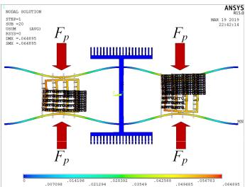  
(a)

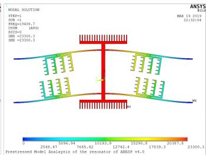  
(b)   
Fig. 3. FEA simulations of the resonant accelerometer. (a) statics analysis and (b) prestressed modal analysis of the micro resonator (ANSYS).

where $\alpha = (L_3 / 192EI)(\varepsilon_pA_pV_p^2 /2)$ . By substituting Equations (23) and (24) in Equations (21) and (22), $P_{mu}$ and $P_{md}$ can be obtained. Then by substituting $P_{mu}$ and $P_{md}$ in Equations (17) and (18), $P_u$ and $P_d$ can be obtained. So $F_{k}$ can be expressed as

$$
F _ {k} = 2 \left(P _ {u} + P _ {d}\right) \approx \frac {4 8 E I x}{L ^ {3}} - x \left(\frac {g _ {p} ^ {3}}{\varepsilon_ {p} A _ {p} V _ {p} ^ {2}} - \frac {L ^ {3}}{1 9 2 E I}\right) ^ {- 1} \tag {25}
$$

So, the effective stiffness of the resonator $K_{eff}$ is

$$
K _ {e f f} = \frac {F _ {k}}{x} \approx \frac {4 8 E I}{L ^ {3}} - \left(\frac {g _ {p} ^ {3}}{\varepsilon_ {p} A _ {p} V _ {p} ^ {2}} - \frac {L ^ {3}}{1 9 2 E I}\right) ^ {- 1} \tag {26}
$$

In the right part of Equation (26), the first item is the mechanical stiffness $K_{m}$ , while the second item is the stiffness perturbation $\Delta K$ .

$$
K _ {m} = \frac {4 8 E I}{L ^ {3}} \tag {27}
$$

$$
\Delta K \approx - \left(\frac {g _ {p} ^ {3}}{\varepsilon_ {p} A _ {p} V _ {p} ^ {2}} - \frac {L ^ {3}}{1 9 2 E I}\right) ^ {- 1} \tag {28}
$$

From Equation (28), it is clear that the resonator stiffness can be offset by the perturbation force, leading to the decrease of resonant frequency. This phenomenon is very similar to the frequency pulling effect.

# C. Finite Element Analysis (FEA) Simulations

In this work, FEA simulations are carried out in ANSYS software to obtain the resonant frequency shift induced by external acceleration through pre-stress modal analysis. Firstly, an acceleration field is applied to the proof mass to get the displacement $d_{p}$ , which is linear to $A_{p}$ . Then, as shown in Fig. 3. (a), the electric field is established in the software and the induced perturbation force $F_{p}$ is obtained. The pre-stressed modal analysis is performed to calculate the stress induced resonant frequency shift of the resonator, as shown in Fig. 3. (b). Finally, the sensitivity of the accelerometer can be obtained by extracting the resonant frequencies of the resonator with/without acceleration.

The FEA simulations are also conducted for the modal analysis of the proof mass - suspension beams system. The first four modes of the system are shown in Fig. 4 with the

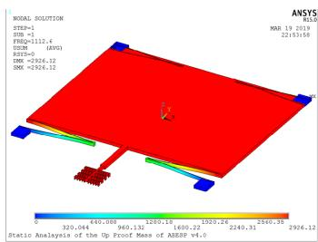  
In-plane translation in y-direction $f = 1112.6\mathrm{Hz}$

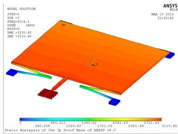  
Out-of-plane translation $f = 5334.3\mathrm{Hz}$

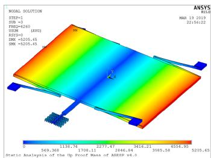  
Out-of-plane rotation around the y-axis $f = 6260.0\mathrm{Hz}$

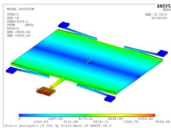  
Out-of-plane rotation around the x-axis $f = 9228.2\mathrm{Hz}$   
Fig. 4. Modal analysis of the proof mass - suspension beams system via FEA simulations.

corresponding frequencies. The mode frequency of in-plane translation in sensing axis (y-direction) is about $1.1\mathrm{kHz}$ (accelerometers for consumer applications usually have the resonant frequency between 1 and $2\mathrm{kHz}$ ). The three following modes occur around 5.3, 6.3 and $9.2\mathrm{kHz}$ , corresponding to the out-of-plane translation, out-of-plane rotation around the y-axis and out-of-plane rotation around the x-axis respectively. Frequencies of these three modes are high enough to guarantee low sensitivity in the sensing axis. Compared with the traditional resonant accelerometers based on axial force sensing, the proposed device based on perturbation force sensing using electrostatic coupling, the proof masses are not mechanically connected to the resonator and can be flexibly designed to have different resonant frequency, which is a critical factor for bandwidth requirement.

Fig. 5. (a) shows the average sensitivity of single device and resonant frequency as a function of half resonant tine length $L$ . It is obvious that the resonant frequency decreases as $L$ increases. The sensitivity increases because the stiffness gets lower as the resonator gets longer and easier to be perturbed. Therefore, the relative sensitivity becomes higher. Fig. 5. (b) shows the average sensitivity of single device and resonant frequency as a function of comb number of perturbation electrode $n$ when $V_{p}$ is $50\mathrm{V}$ . Because the perturbation force becomes larger as $n$ increases, the sensitivity gets higher and the resonant frequency gets lower, leading to higher relative sensitivity.

From the above analysis, several FEA simulations of the whole structure and the optimization are carried out to synthetically analyze the resonator frequency, frequency shift and resonant frequency of proof mass - suspension beams system. The structural strength and stability, and the minimum line widths of the fabrication process are also taken into

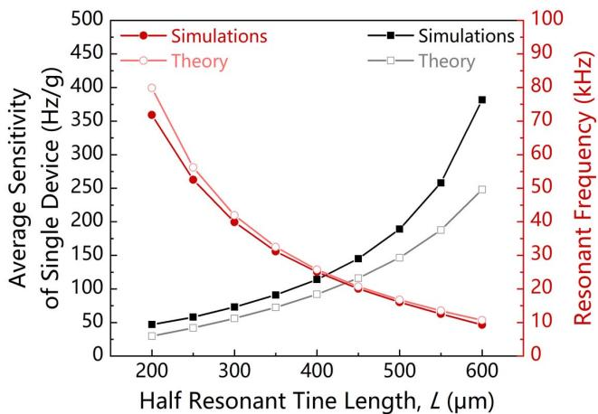  
(a)

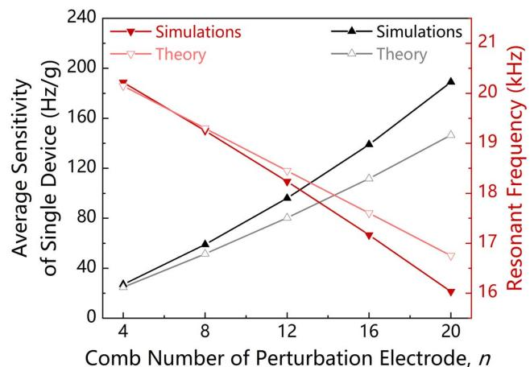  
(b)   
Fig. 5. The average sensitivity of single device and resonant frequency as a function of (a) half resonant tine length $L$ and (b) comb number of perturbation electrode $n$ when $V_{p}$ is $50\mathrm{V}$ .

TABLEI THE STRUCTURE DIMENSIONS   

<table><tr><td>Dimension</td><td>Symbol</td><td>Value</td></tr><tr><td>Young&#x27;s Modulus</td><td>E</td><td>150 GPa</td></tr><tr><td>Density</td><td>ρ</td><td>2330 kg/m3</td></tr><tr><td>Thickness</td><td>t</td><td>25 μm</td></tr><tr><td>Half Resonant Tine Length</td><td>L</td><td>500 μm</td></tr><tr><td>Resonant Tine Width</td><td>w</td><td>6 μm</td></tr><tr><td>Resonator Mass</td><td>M</td><td>7.0×10-10kg</td></tr><tr><td>Driving/Sensing Electrode Mass</td><td>Me</td><td>11.7×10-10kg</td></tr><tr><td>Perturbation Electrode Mass</td><td>Mp</td><td>5.2×10-10kg</td></tr><tr><td>Resonator Stiffness</td><td>Km</td><td>25.92 N/m</td></tr><tr><td>Gap of Perturbation Electrodes</td><td>gp</td><td>2 μm</td></tr><tr><td>Area of Perturbation Electrodes</td><td>Ap</td><td>2250 μm2</td></tr><tr><td>Comb Number of Perturbation Electrode</td><td>n</td><td>20</td></tr><tr><td>Quarter Proof Mass</td><td>Mproofq</td><td>2.8×10-8kg</td></tr><tr><td>Length of Suspension Beam</td><td>ls</td><td>570 μm</td></tr></table>

consideration. The optimized structure dimensions are listed in TABLE 1.

# III. EXPERIMENTAL RESULTS

The device was fabricated using a standard SOI process [20] including (a) backside photoresist spin-coating and patterning; (b) substrate and insulator layer etching; (c) front side

  
(a)

  
(b)

  
(c)

  
(d)

  
(e)

  
(f)

  
Fig. 6. SOI fabrication process of the device.

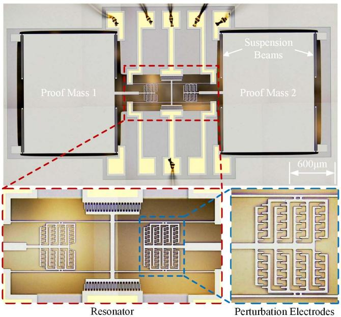  
Fig. 7. Overall and detailed optical micrograph of the resonant accelerometer based on sensing scheme of electrostatically-induced stiffness perturbation.

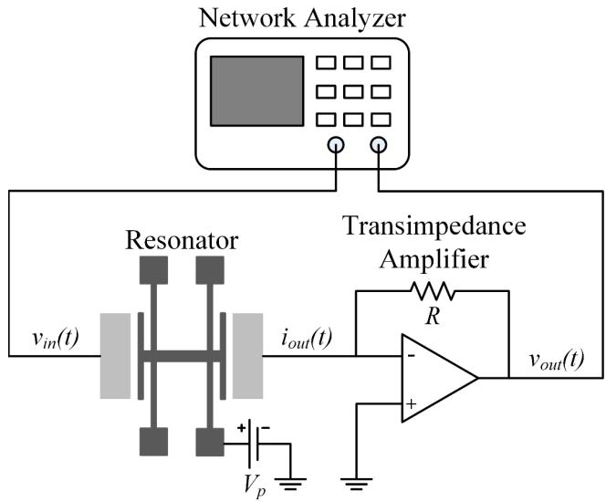  
Fig. 8. Measurement setup for evaluation of resonator open-loop spectral response.

photoresist spin-coating and patterning; (d) metal pad lift-off; (e) front side photoresist patterning and carrier wafer adhesion; (f) structure layer etching and carrier wafer removal, as shown in Fig. 6.

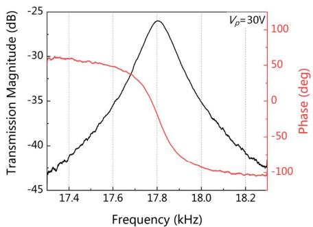  
(a)

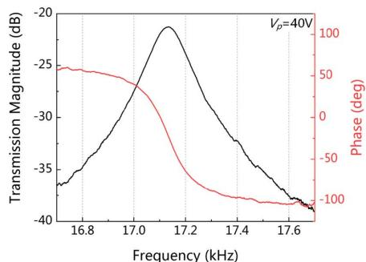  
(b)

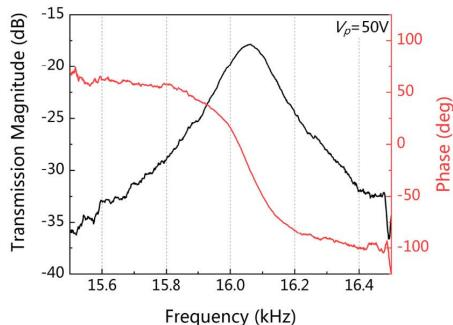  
(c)   
Fig. 9. Open-loop response of the resonator when $V_{P}$ is (a) $30\mathrm{V}$ , (b) $40\mathrm{V}$ and (c) $50\mathrm{V}$ .   
Fig. 7 shows the optical micrograph of a single fabricated device including resonator, proof masses, suspension beams and perturbation electrodes.

# A. Open-Loop Characterization

The measurement setup for evaluation of resonator open-loop spectral response is illustrated in Fig. 8. The accelerometer is mounted on a rotation table and placed in atmospheric environment with pressure level of 760 Torr at room temperature. The DC polarization voltage $V_{p}$ is applied to the resonator while the AC driving voltage $v_{in}(t)$ is applied to the driving electrode. The induced motional current $i_{out}(t)$ , which is proportional to the vibration amplitude, is converted to output voltage $v_{out}(t)$ by a commercial transimpedance amplifier (FEMTO, DLPCA-200). Finally, the open-loop spectral response is recorded by a network analyzer (Agilent E5061B).

To achieve high sensitivity, the stiffness of the resonator $K_{m}$ is optimized to be low to get low resonant frequency, which is beneficial to the amplitude magnification and signal intensify. Hence, the resonator can work in atmosphere without vacuum. Figs. 9. (a) to (c) list the open-loop response of the resonator when $V_{P}$ is $30\mathrm{V}$ , $40\mathrm{V}$ and $50\mathrm{V}$ , respectively. Because of the enhancement of the transduction factor, the peak of transmission magnitude rises as $V_{p}$ increases. Due to the two reasons, the resonant frequency decreases. Firstly, because of electrostatic spring softening effect, the equivalent electrical stiffness $k_{e}$ , which is proportional to the square of $V_{p}$ , weakens the effective stiffness of resonator. It is also called frequency pulling effect. Secondly, $\Delta K$ increases with the increase of $V_{p}$ , which also leads to the decrease of the resonator effective stiffness and resonant frequency.

The open-loop spectral response measurements as above are simply repeated for 0 and $\pm 1\mathrm{g}$ by controlling the rotation table, and two identical devices are placed in opposite direction to form differential measurement. The results under different $V_{p}$ are shown in Figs. 10. (a) - (f). These two devices have opposite frequency shifts under the accelerations. The sensitivities under different $V_{p}$ are $89.95\mathrm{Hz / g}$ ( $V_{p} = 30\mathrm{V}$ ), $167.82\mathrm{Hz / g}$ ( $V_{p} = 40\mathrm{V}$ ) and $297.5\mathrm{Hz / g}$ ( $V_{p} = 50\mathrm{V}$ ) at resonant frequencies of $17.802\mathrm{kHz}$ ( $V_{p} = 30\mathrm{V}$ ), $17.134\mathrm{kHz}$ ( $V_{p} = 40\mathrm{V}$ ) and $16.061\mathrm{kHz}$ ( $V_{p} = 50\mathrm{V}$ ), respectively.

The sensitivity increases as $V_{p}$ increases, verifying the sensing scheme of electrostatically-induced stiffness perturbation. All the results of theoretical analysis, FEA simulations and experiments are summarized in TABLE 2, the results from theoretical analysis very close to those from FEA.

In particular, the obtained results are compared to other resonant accelerometers, as listed in TABLE 3. The majority of current resonant accelerometers use sensing scheme of axial force with low relative sensitivities (lower than $1\%/\mathrm{g}$ ), the proof mass is mechanically coupled to the resonator, and the devices work in vacuum. Owing to the sensing scheme of perturbation force, the device of present work has high sensitivity $(297.5\mathrm{Hz/g})$ and relative sensitivity $(1.8523\%/\mathrm{g})$ , leading to a much larger relative sensitivity enhancement than the traditional resonant accelerometers. With the optimized parameters, the resonator works in atmosphere without vacuum package, which helps reduce the fabrication cost.

The preliminary tilt test is also conducted. Firstly, the component force generated by the gravity of proof masses is given by

$$
F _ {c} = M _ {\text {p r o o f}} g \times \sin \theta \tag {29}
$$

where $g$ is the gravitational acceleration and $\theta$ is the tilt angle. Fig. 11. (a) shows the response to multiple tilt angles for each device when $V_{p}$ is $30\mathrm{V}$ , $40\mathrm{V}$ and $50\mathrm{V}$ , respectively. The two devices in the opposite direction have opposite frequency shifts for the induced tilt angle. All the output data points match well with the sine function of the tilt angle with an angle range of $\pm 90^{\circ}$ . The differential frequency shifts are shown in Fig. 11. (b), including a sine fit of $\pm 90^{\circ}$ range and a linear fit of $\pm 45^{\circ}$ range. For the linear $\pm 45^{\circ}$ range, the sensitivities under different $V_{p}$ are $1.389\mathrm{Hz / deg}$ ( $V_{p} = 30\mathrm{V}$ ), $2.688\mathrm{Hz / deg}$ ( $V_{p} = 40\mathrm{V}$ ) and $4.848\mathrm{Hz / deg}$ ( $V_{p} = 50\mathrm{V}$ ) at linearities of $2.592\%$ ( $V_{p} = 30\mathrm{V}$ ), $2.311\%$ ( $V_{p} = 40\mathrm{V}$ ) and $1.655\%$ ( $V_{p} = 50\mathrm{V}$ ), respectively. Therefore, this device can be further developed to be a tilt sensor.

# B. Close-Loop Self-Oscillation, Bias Instability and Noise Floor

After the open-loop characterization, the close-loop self-oscillation circuit is constructed for the resonator frequency

TABLE II SUMMARY OF THEORETICAL ANALYSIS, FEA SIMULATIONS AND EXPERIMENTS OF OPEN-LOOP CHARACTERIZATION   

<table><tr><td rowspan="2"></td><td colspan="3">Resonant Frequency (kHz)</td><td colspan="3">Average Sensitivity of Single Device (Hz/g)</td><td colspan="3">Relative Sensitivity (%/g)</td></tr><tr><td>Vp=30 V</td><td>Vp=40 V</td><td>Vp=50 V</td><td>Vp=30 V</td><td>Vp=40 V</td><td>Vp=50 V</td><td>Vp=30 V</td><td>Vp=40 V</td><td>Vp=50 V</td></tr><tr><td>Theory</td><td>18.537</td><td>17.795</td><td>16.751</td><td>43.76</td><td>84.07</td><td>146.50</td><td>0.4721</td><td>0.9449</td><td>1.7491</td></tr><tr><td>Simulations</td><td>18.355</td><td>17.422</td><td>16.034</td><td>50.00</td><td>102.00</td><td>189.00</td><td>0.5448</td><td>1.1709</td><td>2.3575</td></tr><tr><td>Experiments</td><td>17.802</td><td>17.134</td><td>16.061</td><td>42.82</td><td>81.25</td><td>142.50</td><td>0.5053</td><td>0.9795</td><td>1.8523</td></tr></table>

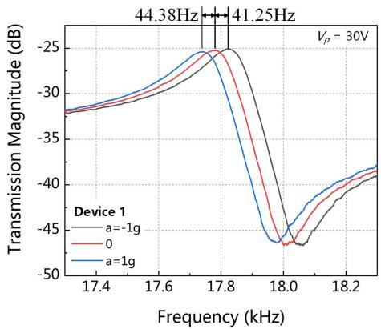  
(a)

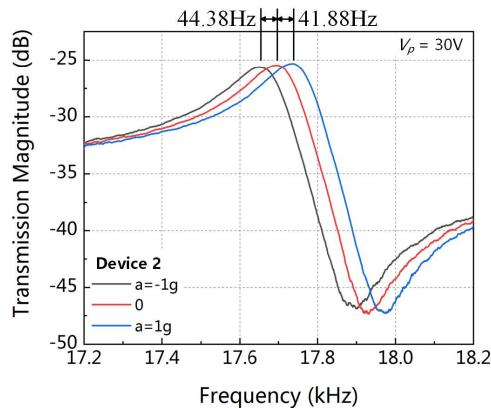  
(b)

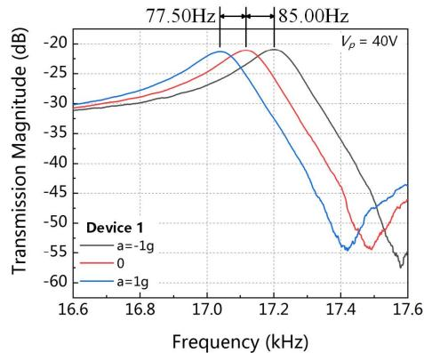  
(c)

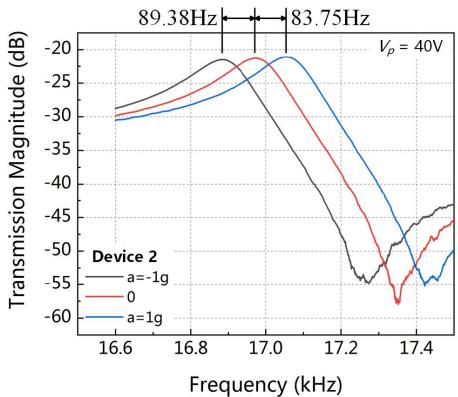  
(d)

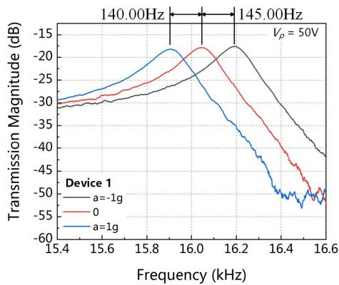  
(e)

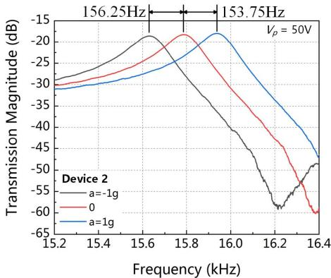  
(f)   
Fig. 10. Open-loop response of each micro resonator evaluated for applied accelerations of 0 and $\pm 1\mathrm{g}$ at different DC polarization voltage: (a) resonator of device 1, $V_{P} = 30\mathrm{V}$ ; (b) resonator of device 1, $V_{P} = 40\mathrm{V}$ ; (c) resonator of device 1, $V_{P} = 50\mathrm{V}$ ; (d) resonator of device 2, $V_{P} = 30\mathrm{V}$ ; (e) resonator of device 2, $V_{P} = 40\mathrm{V}$ and (f) resonator of device 2, $V_{P} = 50\mathrm{V}$ .

tracking. A simplified block scheme is illustrated in Fig. 12. After the motional current is converted to voltage by the transimpedance amplifier, a following second gain stage yields an amplified voltage signal. Then the signal is transmitted

to a phase shifter, which is used to adjust the signal phase properly to meet the phase requirement of self-oscillation. A following rail-to-rail comparator converts the sine wave signal to square wave signal and send it to the gain mod

TABLE III COMPARISON OF RESONANT ACCELEROMETERS' SENSITIVITIES   

<table><tr><td>Reference</td><td>Sensing Scheme</td><td>Pressure Condition</td><td>Resonant Frequency (kHz)</td><td>Sensitivity (Hz/g)</td><td>Relative Sensitivity (%/g)</td></tr><tr><td>Seshia [9]</td><td rowspan="11">Axial Force</td><td rowspan="10">Vacuum</td><td>173</td><td>17</td><td>0.0098</td></tr><tr><td>Roessig [7]</td><td>175</td><td>2.4</td><td>0.0014</td></tr><tr><td>Zhao [10]</td><td>352.2</td><td>2752</td><td>0.7814</td></tr><tr><td>Su [21]</td><td>131</td><td>158</td><td>0.1206</td></tr><tr><td>Comi [22]</td><td>58</td><td>455</td><td>0.7845</td></tr><tr><td>Caspani [23]</td><td>84</td><td>250</td><td>0.2976</td></tr><tr><td>Zou [24]</td><td>~350</td><td>~1399.4</td><td>~0.3998</td></tr><tr><td>Yang [25]</td><td>27</td><td>52</td><td>0.1926</td></tr><tr><td>Wang [26]</td><td>~135</td><td>1153.3</td><td>~0.8543</td></tr><tr><td>Pinto [27]</td><td>459</td><td>22</td><td>0.0048</td></tr><tr><td>Aikele [8]</td><td rowspan="2">Atmosphere</td><td>400</td><td>70</td><td>0.0175</td></tr><tr><td>This paper</td><td>Perturbation Force</td><td>16.061</td><td>297.5</td><td>1.8523</td></tr></table>

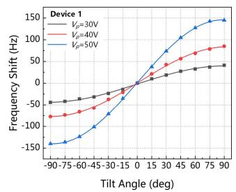

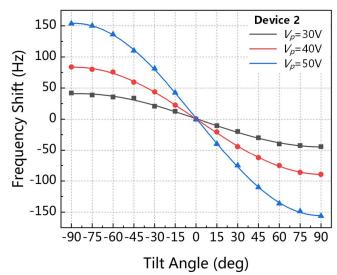

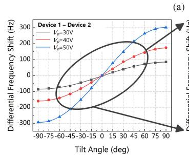

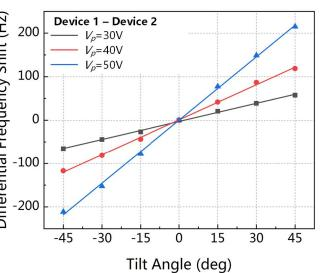  
(b)

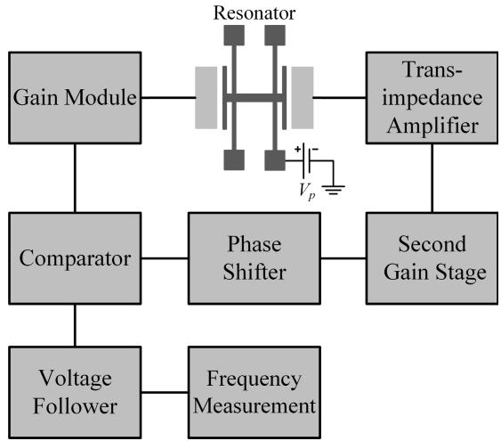  
Fig. 11. Experimental results of multi-angle tilt test: (a) frequency shifts of each single resonator when $V_{P} = 30 \mathrm{~V}$ , $40 \mathrm{~V}$ and $50 \mathrm{~V}$ , and (b) differential frequency shifts when $V_{P} = 30 \mathrm{~V}$ , $40 \mathrm{~V}$ and $50 \mathrm{~V}$ .   
Fig. 12. Block scheme of the close-loop self-oscillation circuit.

ule, which is used to tune the driving voltage to meet the gain requirement of self-oscillation and excite the resonator. For the continuous frequency measurement, a voltage

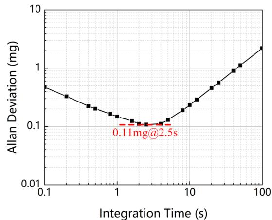

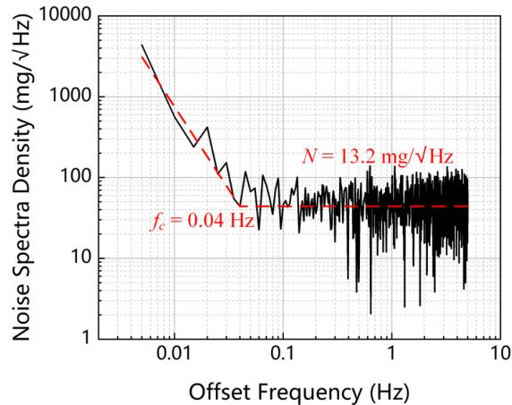  
(a)   
(b)   
Fig. 13. (a) Allan deviation and (b) noise spectral density of the micro resonator.

follower acts as a buffer to extract the square wave from the comparator.

To estimate the bias instability of the device, an Allan deviation analysis on the continuous frequency output collected by a frequency counter (Agilent 53230A) when $V_{p}$ is $50\mathrm{V}$ is conducted. As shown in Fig. 13. (a), a bias instability of $0.11\mathrm{mg}$ at an integration time of $2.5\mathrm{s}$ is obtained. As the integration time increases, the Allan deviation gets worse,

that's because of the residual temperature sensitivity of the response. For the noise floor characterization of the device, a Fast Fourier Transform (FFT) is conducted on the frequency sequence. Divided by the differential sensitivity, the FFT is then converted to input-referred noise floor. As shown in Fig. 13. (b), the noise floor is $13.2\mathrm{mg} / \sqrt{\mathrm{Hz}}$ and the corner frequency $f_{c}$ is at $0.04\mathrm{Hz}$ offset frequency.

# IV. CONCLUSION

In this paper, a resonant accelerometer with high relative sensitivity based on sensing scheme of electrostatically-induced stiffness perturbation is theoretically analyzed, FEA simulated and experimentally verified with open-loop and close-loop experiments. The proposed resonant accelerometer demonstrates a high relative sensitivity of $1.8523\%/\mathrm{g}$ , which is much higher than the traditional resonant accelerometers based on axial force sensing. This is a big improvement for resonant accelerometers. The bias instability is $0.11\mathrm{mg}$ and the noise floor is $13.2\mathrm{mg}/\sqrt{\mathrm{Hz}}$ . The resonant accelerometer shows great potential in highly-sensitive acceleration measurements.

However, the accelerometer should be improved in the aspects below. First, low resonant frequency of the resonator increases the mode complexity. The irrelevant modes can be eliminated by fabricating the device on thicker structure layer. Second, the noise suppression of the current close-loop circuit is poor, leading to high bias instability, high noise floor and low resolution. A closed-loop circuit with phase-locked loop and low noise transimpedance amplifier can be developed to stably track the resonant frequency and improve the resolution. Third, low resonant frequency of the resonator also results in high thermal noise sensing. The trade-off between sensitivity and noise suppression should be further investigated, and this compromise should be taken into consideration during the structure optimization.

# REFERENCES

[1] G. Stemme, “Resonant silicon sensors,” J. Micromech. Microeng., vol. 1, no. 2, pp. 113–125, Jun. 1991.   
[2] K. E. Wojciechowski, B. E. Boser, and A. P. Pisano, “A MEMS resonant strain sensor operated in air,” in Proc. 17th IEEE Int. Conf. Micro Electro Mech. Syst., Jan. 2004, pp. 841–845.   
[3] H. Zhang, J. Huang, W. Yuan, and H. Chang, "A high-sensitivity micromechanical electrometer based on mode localization of two degree-of-freedom weakly coupled resonators," J. Microelectromech. Syst., vol. 25, no. 5, pp. 937-946, Oct. 2016.   
[4] X. Du, L. Wang, A. Li, L. Wang, and D. Sun, "High accuracy resonant pressure sensor with balanced-mass DETF resonator and twinborn diaphragms," J. Microelectromech. Syst., vol. 26, no. 1, pp. 235-245, Feb. 2017.   
[5] H. Ding, Y. Ma, Y. Guan, B.-F. Ju, and J. Xie, "Duplex mode tilt measurements based on a MEMS biaxial resonant accelerometer," Sens. Actuators A, Phys., vol. 296, pp. 222-234, Sep. 2019.   
[6] X. Le et al., "Surface acoustic wave humidity sensors based on uniform and thickness controllable graphene oxide thin films formed by surface tension," Microsyst. Nanoeng., vol. 5, no. 1, pp. 1-10, Jul. 2019.   
[7] T. A. Roessig, R. T. Howe, A. P. Pisano, and J. H. Smith, "Surface-micromachined resonant accelerometer," in Proc. Int. Solid State Sens. Actuators Conf., Jun. 1997, pp. 859-862.   
[8] M. Aikele et al., "Resonant accelerometer with self-test," Sens. Actuators A, Phys., vol. 92, nos. 1-3, pp. 161-167, Aug. 2001.   
[9] A. A. Seshia et al., “A vacuum packaged surface micromachined resonant accelerometer,” J. Microelectromech. Syst., vol. 11, no. 6, pp. 784-793, Dec. 2002.

[10] C. Zhao et al., "A resonant MEMS accelerometer with 56ng bias stability and 98ng/Hz1/2 noise floor," J. Microelectromech. Syst., vol. 28, no. 3, pp. 324-326, Jun. 2019.   
[11] X.-P.-S. Su and H. S. Yang, "Single-stage microleverage mechanism optimization in a resonant accelerometer," Structural Multidisciplinary Optim., vol. 21, no. 3, pp. 246-252, Apr. 2001.   
[12] S. X. P. Su and H. S. Yang, "Two-stage compliant microleverage mechanism optimization in a resonant accelerometer," Struct. Multidiscipl. Optim., vol. 22, no. 4, pp. 328-334, Nov. 2001.   
[13] H. Ding, J. Zhao, B.-F. Ju, and J. Xie, "A high-sensitivity biaxial resonant accelerometer with two-stage microleverage mechanisms," J. Micromech. Microeng., vol. 26, no. 1, pp. 15-25, Dec. 2015.   
[14] Y. Wang, H. Ding, X. Le, W. Wang, and J. Xie, “A MEMS piezoelectric in-plane resonant accelerometer based on aluminum nitride with two-stage microleverage mechanism,” Sens. Actuators A, Phys., vol. 254, pp. 126–133, Feb. 2017.   
[15] T. A. Roessig, "Integrated MEMS tuning fork oscillators for sensor applications," Ph.D. dissertation, Dept. Mech. Eng., Univ. California, Berkeley, Berkeley, CA, USA, 1998.   
[16] H. Ding, X. Le, and J. Xie, “A MEMS fishbone-shaped electrostatic double-ended tuning fork resonator with selectable higher modes,” J. Microelectromech. Syst., vol. 26, no. 4, pp. 793–801, Aug. 2017.   
[17] M. Manav, G. Reynen, M. Sharma, E. Cretu, and A. S. Phani, "Ultrasensitive resonant MEMS transducers with tuneable coupling," J. Micromech. Microeng., vol. 24, no. 5, pp. 55-59, Apr. 2014.   
[18] D. Chen, J. Zhao, Y. Wang, and J. Xie, "An electrostatic charge sensor based on micro resonator with sensing scheme of effective stiffness perturbation," J. Micromech. Microeng., vol. 27, no. 6, pp. 65-73, Apr. 2017.   
[19] J. Gere and S. Timoshenko, “Mechanics of materials,” Pwskent, vol. 534, Apr. 1997, Art. no. 92174.   
[20] H. Kang, J. Yang, and H. Chang, "A closed-loop accelerometer based on three degree-of-freedom weakly coupled resonator with self-elimination of feedthrough signal," IEEE Sensors J., vol. 18, no. 10, pp. 3960-3967, May 2018.   
[21] S. X. P. Su, H. S. Yang, and A. M. Agogino, "A resonant accelerometer with two-stage microleverage mechanisms fabricated by SOI-MEMS technology," IEEE Sensors J., vol. 5, no. 6, pp. 1214-1223, Dec. 2005.   
[22] C. Comi, A. Corigliano, G. Langfelder, A. Longoni, A. Tocchio, and B. Simoni, "A resonant microaccelerometer with high sensitivity operating in an oscillating circuit," J. Microelectromech. Syst., vol. 19, no. 5, pp. 1140-1152, Oct. 2010.   
[23] Caspani, C. Comi, A. Corigliano, G. Langfelder, and A. Tocchio, "Compact biaxial micromachined resonant accelerometer," J. Micromech. Microeng., vol. 23, no. 10, pp. 105-116, Sep. 2013.   
[24] X. Zou, P. Thiruvenkatanathan, and A. A. Seshia, “A seismic-grade resonant MEMS accelerometer,” J. Microelectromech. Syst., vol. 23, no. 4, pp. 768–770, Aug. 2014.   
[25] B. Yang, H. Zhao, B. Dai, and X. Liu, “A new silicon biaxial decoupled resonant micro-accelerometer,” Microsyst. Technol., vol. 21, no. 1, pp. 109–115, Jan. 2015.   
[26] S. Wang, X. Wei, Y. Zhao, Z. Jiang, and Y. Shen, "A MEMS resonant accelerometer for low-frequency vibration detection," Sens. Actuators A, Phys., vol. 283, pp. 151-158, Nov. 2018.   
[27] D. Pinto et al., "A small and high sensitivity resonant accelerometer," *Procedia Chem.*, vol. 1, no. 1, pp. 536-539, Sep. 2009.

Hong Ding received the B.Eng. and Ph.D. degrees from the School of Mechanical Engineering, Zhejiang University, Hangzhou, China, in 2013 and 2019, respectively. In October 2016, he joined the Department of Mechanical Engineering, University of California at Berkeley (UCB), Berkeley, CA, USA, as a Visiting Student. He is currently a Post-Doctoral Researcher with the Department of Nanoengineering, University of California at San Diego (UCSD), USA. His research interests include MEMS resonators, resonant sensors, micromachined

ultrasonic transducers, and soft actuators.

Changju Wu received the M.Eng. and Ph.D. degrees from Zhejiang University, Hangzhou, China, in 2003 and 2006, respectively. In October 2006, he joined the KTH Royal Institute of Technology, Sweden, as a Post-Doctoral Researcher. In October 2007, he joined the College of Information Science and Engineering, Zhejiang University. Since December 2010, he has been an Associate Professor. His research interests include MEMS design and processes, self-adaption cooling, and active flow control.

Jin Xie (Member, IEEE) received the B.Eng. degree from Tsinghua University, Beijing, China, in 2000, the M.E. degree from Zhejiang University, Hangzhou, China, in 2003, and the Ph.D. degree from Nanyang Technological University, Singapore, in 2008. From 2007 to 2011, he worked with the Institute of Microelectronics, Singapore. In June 2011, he joined the Department of Mechanical Engineering, University of California at Berkeley, Berkeley, CA, USA, as a Post-Doctoral Researcher. In October 2012, he joined the School of

Mechanical Engineering, Zhejiang University, as a Professor. He has published more than 70 journal articles and 60 conference papers. His research interests include microelectromechanical systems (MEMS), design and manufacturing of micro sensors and actuators, and nanotechnology. He was a TPC Member of IEEE NEMS 2015, 2018, and 2020.