# A Mode-Localized Resonant Accelerometer With Self-Temperature Drift Suppression

Hao Kang, Bing Ruan, Yongcun Hao, and Honglong Chang1, Senior Member, IEEE

Abstract—This paper theoretically and experimentally demonstrates the temperature drift suppression capability of a mode-localized accelerometer based on three degree of freedom weakly coupled resonators. The theoretical model of the temperature characteristics of the amplitude ratio and frequency of the mode-localized accelerometer under the influence of Young's modulus were established. The effect of the temperature on the input conversion mechanism and weakly coupled resonators are both included in the model. The simulation results show that thermal stress is the main factor affecting the output metric of the mode-localized accelerometer with mechanical coupling beam and, consequently, a stress relief structure is proposed to suppress the

effect of stress on the output metric. Compared with the mode-localized accelerometer without stress relief structure, the temperature coefficients of sensitivity and two output metrics of the accelerometer with the stress relief structure are both suppressed by one order of magnitude via the simulation and experiment verification from $30^{\circ}\mathrm{C}$ to $60^{\circ}\mathrm{C}$ . And the temperature suppression coefficient of amplitude ratio is improved by 43.9 times than that of the frequency which shows that the mode-localized accelerometer based on amplitude ratio has an excellent temperature drift suppression capability.

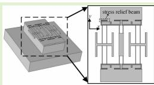

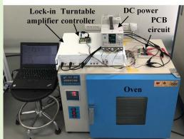

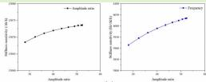

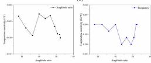

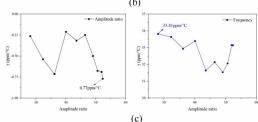

Index Terms—Mode-localized Accelerometer, amplitude ratio, frequency, temperature drift, stress relief.

# I. INTRODUCTION

T HE microelectromechanical systems (MEMS) resonant accelerometer, typically a sensor based on a silicon beam, has the advantages of small size, light weight, low power consumption, high measurement accuracy, good stability, batch production, and direct output of quasi-digital quantities. The output metric of most of current MEMS resonant accelerometers [1]-[6] is frequency. Because the Young's modulus of the silicon material is very sensitive to temperature, the MEMS resonant accelerometer is extremely susceptible to temperature change. Some measures were used to improve the temperature stability of the MEMS resonant

Manuscript received May 12, 2020; revised May 28, 2020; accepted May 31, 2020. Date of publication June 3, 2020; date of current version September 17, 2020. This work was supported in part by the National Key Research and Development Program of China under Grant 2018YFB2002600, in part by the Shaanxi Key Research and Development Program under Grant 2019ZDLGY02-06, in part by the Fundamental Research Funds for the Central Universities under Grant 3102019JC002, and in part by the Natural Science Basic Research Plan in Shaanxi Province of China under Grant 2019JQ-299. The associate editor coordinating the review of this article and approving it for publication was Dr. Qiang Wu. (Corresponding authors: Yongcun Hao; Honglong Chang.)

The authors are with the Key Laboratory of Micro and Nano Systems for Aerospace, Ministry of Education, Northwestern Polytechnical University, Xi'an 710072, China (e-mail: haoyongcun@nwpu.edu.cn; changhl@nwpu.edu.cn).

Digital Object Identifier 10.1109/JSEN.2020.2999578

accelerometers, such as the temperature control [7]–[10] or temperature compensation [11]–[15] of the device.

Over the past few years, the mode-localized sensing paradigm based on weakly coupled resonators (WCRs) has been proved to present ultra-high sensitivity [16]–[22] and the suppression of common mode noises [23]–[27] due to the output metric of the amplitude ratio. Many researchers have experimentally demonstrated the superior temperature suppression capability of WCRs [24]–[27]. It must be noted that the WCRs are not equal to the mode-localized sensors; typically, the latter need a specific mechanism to convert the measured quantity to stiffness or mass perturbation. However, up to now, there is no demonstration on temperature drift suppression of the mode-localized sensors. How the conversion mechanism affects the temperature suppression capability or the mode-localized sensors still own superior temperature drift suppression capability remains unknown.

In this paper, the temperature characteristics of the output metrics of the mode-localized accelerometer were theoretically analyzed and experimentally demonstrated for the first time. The effect of temperature on the input conversion mechanism and WCRs are both taken into account. And the theoretical model of the temperature characteristics of the amplitude ratio and frequency of the mode-localized accelerometer based on the stiffness perturbation were established. According to this model the temperature coefficient of amplitude ratio and

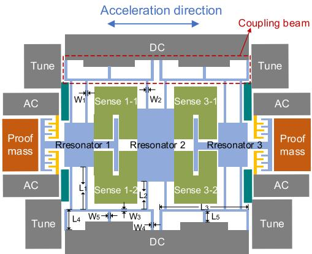  
(a)

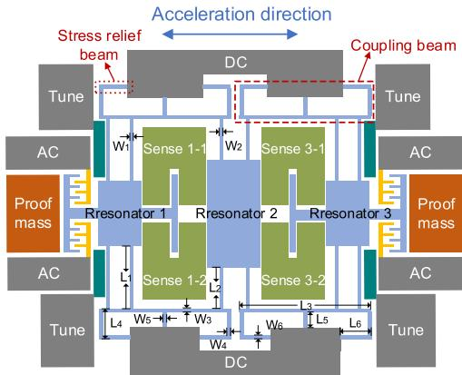  
(b）  
Fig. 1. The schematic diagram of the 3-DoF mode localized accelerometer with "E" coupling beam (a) and stress relief beam (b).

frequency can be estimated when Young's modulus changes. A stress relief structure is proposed to suppress the temperature drift of the accelerometer, and two mode-localized accelerometers without and with a stress relief structure were experimentally compared.

This paper is organized as follows: Section II presents theory analysis and simulation of the temperature characteristics of the mode-localized accelerometers with "E" type coupling beam and stress relief structure; Section III describes experimental results of acceleration responses of the amplitude ratio and frequency of the two accelerometers at different temperature; and conclusions are given in Section IV.

# II. THEORY ANALYSIS AND SIMULATION OF TEMPERATURE CHARACTERISTICS

# A. Structural Design and Acceleration Sensing Mechanism

The schematic diagrams of the two types of 3-DoF mode- localized accelerometers in this paper are shown in Figure 1(a) and 1(b) respectively. The only difference of the two accelerometers is the coupling beam structtrue. The weak coupling of two adjacent resonators in Figure 1(a) is realized by the "E" type mechanical coupling beam without stress relief while the coupling in Figure 1(b) has stress relief. The comb finger capacitors are used to drive the resonator and differential plate capacitors are used to sense the amplitude

TABLEI DIMENSIONS OF PROOF MASS AND RESONATOR   

<table><tr><td>Symbol</td><td>Quantity</td><td>Value</td></tr><tr><td>L1</td><td>Outer resonator beam length</td><td>445 μm</td></tr><tr><td>W1</td><td>Outer resonator beam width</td><td>6.2 μm</td></tr><tr><td>L2</td><td>Middle resonator beam length</td><td>195 μm</td></tr><tr><td>W2</td><td>Middle resonator beam width</td><td>5.8 μm</td></tr><tr><td>L3</td><td>“E” coupling beam length</td><td>492 μm</td></tr><tr><td>W3</td><td>“E” coupling beam width</td><td>10 μm</td></tr><tr><td>L4</td><td>“E” coupling beam length</td><td>110 μm</td></tr><tr><td>W4</td><td>“E” coupling beam width</td><td>12 μm</td></tr><tr><td>L5</td><td>“E” coupling beam length</td><td>75 μm</td></tr><tr><td>W5</td><td>“E” coupling beam width</td><td>6 μm</td></tr><tr><td>L6</td><td>Stress relief beam length</td><td>155 μm</td></tr><tr><td>W6</td><td>Stress relief beam width</td><td>8 μm</td></tr><tr><td>m</td><td>Mass of proof mass</td><td>200 μg</td></tr><tr><td>kp</td><td>Stiffness of proof mass</td><td>32.15 N/m</td></tr><tr><td>do</td><td>Initial gap of acceleration-sensitive capacitor</td><td>2.5μm</td></tr><tr><td>A</td><td>Area of acceleration-sensitive capacitor</td><td>5.44×104μm2</td></tr><tr><td>V</td><td>Potential between proof mass and WCRs</td><td>6 V</td></tr></table>

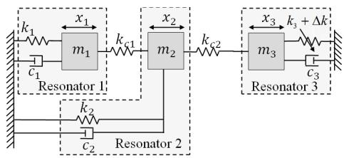  
Fig. 2. Mass-spring-damper system of the 3-DoF WCRs.

of resonator. The tuning electrodes beside the elastic beam are used to change the effective stiffness of the resonator. In addition, two proof masses at sides of two outer resonators are used to sense the acceleration. The electrostatic negative static stiffness related to the acceleration is formed when there is a potential difference between the proof mass and WCRs. The dimensions of the proof mass and resonator are shown in Table I.

AC voltage and DC bias voltage are applied to the driving electrode and WCRs respectively to make WCRs vibrate at the resonance frequency. Ideally, the amplitudes of the two outer resonators are equal. When acceleration acts on the proof mass, the proof mass will produce a displacement. Then the electrostatic negative stiffness is changed to introduce a stiffness perturbation to the WCRs, so that the WCRs produces the mode localization phenomenon and the vibration energy is no longer distributed evenly. Eventually, the amplitudes of the two outer resonators are unequal. Therefore, the acceleration can be obtained by detecting the amplitude ratio of the two resonators.

# B. Theory Analysis

In this work, the 3-DoF mode-localized accelerometers are used to investigate the temperature characteristic of output metrics. The mass-spring-damper model of the 3-DoF WCRs is shown in Figure 2. Three resonators vibrate linearly in one plane and the material of the resonators is isotropic and homogeneous single crystal silicon. The dimension of the resonator is on the order of microns. Because the accelerometer works in

a high vacuum environment, the damping of all resonators of WCRs can be neglected for simplification [28]. The dynamic equations of the 3-DoF WCRs with perturbation are given in Equation (1).

$$
\begin{array}{l} \left[ \begin{array}{c c c} m & 0 & 0 \\ 0 & m & 0 \\ 0 & 0 & m \end{array} \right] \left[ \begin{array}{c} \ddot {x} _ {1} \\ \ddot {x} _ {2} \\ \ddot {x} _ {3} \end{array} \right] \\ + \left[ \begin{array}{c c c} k + k _ {c} & - k _ {c} & 0 \\ - k _ {c} & k _ {m} + 2 k _ {c} & - k _ {c} \\ 0 & - k _ {c} & k + k _ {c} + \Delta k \end{array} \right] \left[ \begin{array}{l} x _ {1} \\ x _ {2} \\ x _ {3} \end{array} \right] = \left[ \begin{array}{l} 0 \\ 0 \\ 0 \end{array} \right] \tag {1} \\ \end{array}
$$

where $x_{\mathrm{i}}$ are the displacements of each resonator; the masses of each resonator are assumed as $m$ ; $k_{c}$ is the coupling stiffness between neighboring resonators; $k$ is the initial stiffness of resonators 1 and 3; $k_{m}$ is the stiffness of resonator 2; and $\Delta k$ is the stiffness perturbation applied to the WCRs. By solving the eigenvalues and eigenvectors of the dynamic equation (1), the frequencies and amplitude ratios of 3-DoF WCRs at first two working modes (in-phase mode where two outer resonators vibrate in-phase and out-of-phase mode where two outer resonators vibrate out-of-phase [20]) can be obtained as [29]

$$
\begin{array}{l} \omega_ {1 ^ {\prime} - 3 D o F} = \sqrt {\frac {1}{m} \left[ k + k _ {c} + \frac {1}{2} \left(\Delta k - \frac {2}{\beta} - \sqrt {\Delta k ^ {2} + \left(\frac {2}{\beta}\right) ^ {2}}\right) \right]} (2) \\ U _ {0} \approx \Delta k \cdot \frac {k _ {m} - k + k _ {c}}{k _ {c} ^ {2}} (3) \\ \end{array}
$$

When the temperature changes, the Young's modulus of the silicon material will change, which directly changes the stiffness of the elastic beam, thereby changing the resonance frequency of the accelerometer. On the other hand, the internal stress of the material of the accelerometer mainly consists of the thermal stress caused by the difference in the thermal expansion coefficient between the materials and the residual stress generated in the fabrication process. Both stresses will affect the temperature characteristic of the accelerometer. The stress is difficult to estimate and can be suppressed by special stress relief structures. Therefore, in the case where only Young's modulus of the silicon material is affected by temperature, the amplitude ratio of the 3-DoF mode-localized accelerometer can be expressed as

$$
U _ {(T)} = \Delta k _ {(T)} \cdot \frac {k _ {m (T)} - k _ {(T)} + k _ {c (T)}}{k _ {c (T)} ^ {2}} \tag {4}
$$

where $U_{(T)}$ is the amplitude ratios after the temperature change; $k_{m}$ , $k$ , and $k_{c}$ represent the stiffness without temperature change; and $k_{m(T)}$ , $k_{(T)}$ , and $k_{c(T)}$ represent the stiffness after temperature change. Thus, the relative change of amplitude ratio of the 3-DoF mode-localized accelerometer caused by temperature can be expressed as

$$
\frac {U _ {(T)} - U _ {0}}{U _ {0}} = \frac {\Delta k _ {(T)} \cdot \frac {k _ {m (T)} - k _ {(T)} + k _ {c (T)}}{k _ {c (T)} ^ {2}}}{\Delta k \cdot \frac {k _ {m} - k + k _ {c}}{k _ {c} ^ {2}}} - 1 \tag {5}
$$

where $\Delta k$ and $\Delta k_{(T)}$ represent the total stiffness perturbation applied to the accelerometer before and after being affected by temperature, respectively.

The initial gap of the acceleration-sensitive capacitor will be changed when the acceleration acts on the proof mass, then the acceleration-induced variation of the electrostatic negative stiffness $\Delta k_{\mathrm{a}}$ between proof mass and WCRs can be obtained as

$$
\Delta k _ {a} = \frac {- \varepsilon A V ^ {2}}{\left(d _ {0} - x\right) ^ {3}} - \frac {- \varepsilon A V ^ {2}}{d _ {0} ^ {3}} \tag {6}
$$

where $A, V, x$ and $d_0$ are the area, potential difference, the displacement of proof masses caused by accelerations and initial gap of the acceleration-sensitive capacitor, respectively. For the mode-localized accelerometer, the conversion mechanism is affected by the temperature because the stiffness of the proof mass will change with the temperature change. Therefore, the $x$ will change by the temperature. Finally, the $\Delta k_{\mathrm{a}}$ is affected by the temperature. The $\Delta k_{\mathrm{a}}$ after the temperature change can be expressed as

$$
\Delta k _ {a (T)} = \frac {- \varepsilon A V ^ {2}}{\left(d _ {0} - x _ {(T)}\right) ^ {3}} - \frac {- \varepsilon A V ^ {2}}{d _ {0} ^ {3}} \tag {7}
$$

where $x_{(T)}$ represents the displacement of proof masses caused by acceleration after temperature change. In measurement, a tuning voltage is applied to one of the resonators to select the initial working point. Therefore, the total stiffness perturbation $\Delta k$ includes two parts, namely, the electrostatic negative stiffness change caused by the tuning voltage $(\Delta k_{t})$ and acceleration $(\Delta k_{a})$ . Then the $\Delta k$ before and after the temperature change can be expressed as

$$
\Delta k = \Delta k _ {t} + \Delta k _ {a} = \Delta k _ {t} + \frac {- \varepsilon A V ^ {2}}{\left(d _ {0} - x\right) ^ {3}} - \frac {- \varepsilon A V ^ {2}}{d _ {0} ^ {3}} \tag {8}
$$

$$
\Delta k _ {(T)} = \Delta k _ {t} + \Delta k _ {a (T)} = \Delta k _ {t} + \frac {- \varepsilon A V ^ {2}}{\left(d _ {0} - x _ {(T)}\right) ^ {3}} - \frac {- \varepsilon A V ^ {2}}{d _ {0} ^ {3}} \tag {9}
$$

As the temperature changes, the stiffness of the elastic beam is only affected by the Young's modulus. Therefore, $E_{(T)} / E_0$ can be used to represent the temperature coefficient of the stiffness, where $E_0$ and $E_{(T)}$ are the Young's modulus before and after the temperature change, respectively. Substituting Equations (8) and (9) into Equations (5) gives

$$
\begin{array}{l} \frac {U _ {(T)} - U _ {0}}{U _ {0}} = \frac {E _ {0}}{E _ {(T)}} \cdot \frac {\left(d _ {0} - x _ {(T)}\right) ^ {3} (\Delta k _ {t} - k _ {e 0}) - \varepsilon A V ^ {2}}{\left(d _ {0} - x\right) ^ {3} (\Delta k _ {t} - k _ {e 0}) - \varepsilon A V ^ {2}} \\ \cdot \frac {\left(d _ {0} - x\right) ^ {3}}{\left(d _ {0} - x _ {(T)}\right) ^ {3}} - 1 \tag {10} \\ \end{array}
$$

Similarly, when the temperature changes, the relative change of the frequency can be obtained as (11), shown at the bottom of the next page.

Equations (10) and (11) can be used to estimate the temperature-induced variation of the amplitude ratio and frequency of the mode-localized accelerometer at different acceleration when only the Young's modulus changes with temperature. The relationship is given as [31]

$$
E _ {(T)} = E _ {0} - B T e ^ {\left(- \frac {T _ {0}}{T}\right)} \tag {12}
$$

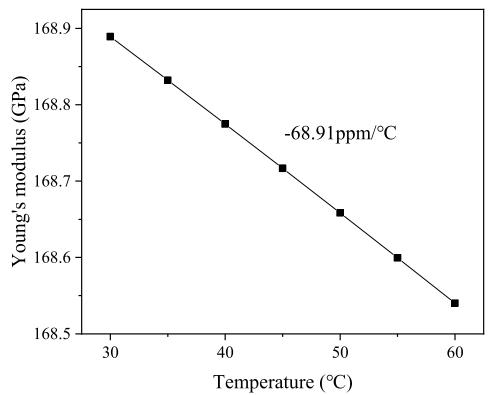  
Fig. 3. Silicon Young's modulus from $30^{\circ}\mathrm{C} - 60^{\circ}\mathrm{C}$ .

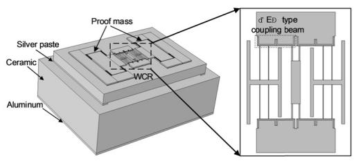

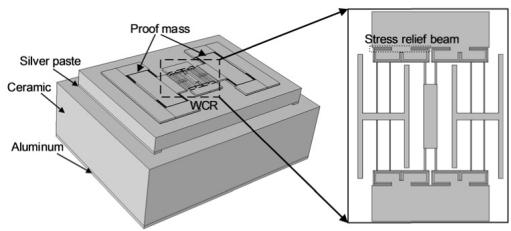  
(a)   
(b)   
Fig. 4. Simulation model of 3-DoF WCRs accelerometer with "E" coupling beam (a) and stress relief beam (b).

where $E_0 = 170.57\mathrm{GPa}$ is the Young's modulus of silicon material at absolute zero, $B = 15.8\mathrm{MPa / K}$ , $T_0 = 317\mathrm{K}$ and $T$ is from absolute zero to high temperature. According to Equation (12), the silicon Young's modulus from $30^{\circ}\mathrm{C} - 60^{\circ}\mathrm{C}$ is shown in Figure 3. The Young's modulus of the silicon decreases linearly, and the temperature coefficient of $-68.91\mathrm{ppm / }^{\circ}\mathrm{C}$ is obtained.

# C. Simulation

1) Simulation Model and Method: The temperature characteristics of the amplitude ratio and frequency of two accelerometers are simulated using COMSOL software. The accelerometer with "E" coupling beam and stress relief beam are shown in Figure 4(a) and 4(b) respectively.

TABLE II MATERIAL PROPERTIES OF THE SIMULATION MODEL  

<table><tr><td>Properties</td><td>Coefficient of thermal expansion (1/K)</td><td>Young&#x27;s modulus (GPa)</td><td>Poisson&#x27;s ratio</td><td>Density (kg/m3)</td></tr><tr><td>Silicon</td><td>2.6×10-6</td><td>Eq. (15)</td><td>0.22</td><td>2330</td></tr><tr><td>Borosilicate</td><td>3.3×10-6</td><td>63</td><td>0.2</td><td>2230</td></tr><tr><td>Silver paste</td><td>33×10-6</td><td>5.3</td><td>0.3</td><td>1000</td></tr><tr><td>Ceramic</td><td>6.5×10-6</td><td>310</td><td>0.23</td><td>3800</td></tr><tr><td>Aluminum</td><td>23.1×10-6</td><td>70</td><td>0.35</td><td>2700</td></tr></table>

The accelerometers are fixed on the ceramic substrate by conductive silver paste. There is a layer of aluminum at the bottom of the model, which is set as a fixed constraint.

The Young's modulus of silicon is set as a function of temperature from $30^{\circ}\mathrm{C} - 60^{\circ}\mathrm{C}$ according to Equation (12). The dimensions of the accelerometers and material properties of the simulation model are shown in Table I and II respectively. The thermal expansion module is used to include the effect of the thermal stress on the accelerometer. The drive comb fingers capacitors and the differential plate detection capacitors are both ignored to simplify the model. In order to ensure the accuracy of the simulation, the mass of the capacitors is added to the resonator. The mesh type of the device layer, handle layer and conductive silver paste is free triangle and sweep, and that of the ceramic substrate and aluminum are free tetrahedron.

The acceleration $a$ from $0 - 1\mathrm{g}$ is applied to both proof masses in the form of boundary load $F = ma$ in the same direction, where $m$ is the mass of the proof mass. When the acceleration acts on the proof mass, the acceleration-sensitive capacitors gap $d_{\mathrm{a}}$ at different temperature and acceleration was simulated firstly. Then the value of $\Delta k_{a}$ can be obtained according to Equation (10). In the next step the $\Delta k_{a}$ is applied to the WCRs by set the value in the spring basic module of one resonator. Finally, the mode shape of the WCRs is solved by performing the study of eigenfrequency, thus, the amplitude ratio and frequency of the accelerometer at different acceleration and temperature can be obtained.

# 2) The 3-DoF Mode-Localized Accelerometer With “E” Coupling Beam:

a) Effect of thermal stress and Young's modulus: When considering the effect of Young's modulus and thermal stress on the accelerometer, the temperature characteristics of $d_{\mathrm{a}}$ are shown in Figure 5. The displacement of the proof mass away from the WCRs is defined as negative, and the displacement close to the WCRs is positive. When the acceleration is $0\mathrm{g}$ and temperature is $60^{\circ}\mathrm{C}$ , the proof mass produces a displacement change $\Delta x_{p}$ of $0.0566\mu \mathrm{m}$ away from the WCRs due to the

$$
\frac {\omega_ {(T)} - \omega_ {0}}{\omega_ {0}} = \sqrt {\frac {\frac {E _ {(T)}}{E _ {0}} \left(k + k _ {c}\right) + \frac {1}{2} \left(\Delta k _ {t} + \Delta k _ {a (T)} - \frac {2}{\beta} \cdot \frac {E _ {(T)}}{E _ {0}} - \sqrt {\left(\Delta k _ {t} + \Delta k _ {a (T)}\right) ^ {2} + \left(\frac {2}{\beta} \cdot \frac {E _ {(T)}}{E _ {0}}\right) ^ {2}}\right)}{(k + k _ {c}) + \frac {1}{2} \left(\Delta k _ {t} + \Delta k _ {a} - \frac {2}{\beta} - \sqrt {\left(\Delta k _ {t} + \Delta k _ {a}\right) ^ {2} + \left(\frac {2}{\beta}\right) ^ {2}}\right)} - 1} \tag {11}
$$

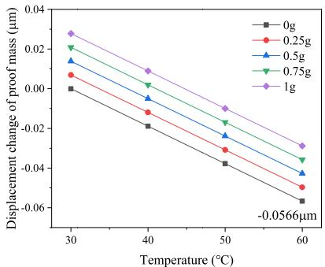  
(a)

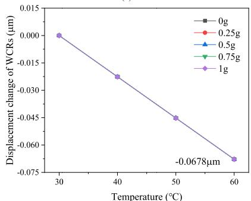  
(b)

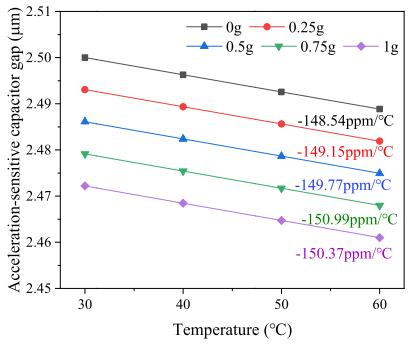  
(c)   
Fig. 5. Temperature characteristics of $\Delta x_{p}$ (a), $\Delta x_{wcr}$ (b) and $d_{\mathrm{a}}$ (c).

thermal expansion caused by the thermal stress shown in Figure 5(a). Thus, the displacement of $0.0566\mu \mathrm{m}$ away from the WCRs is superimposed on the $d_0$ at $60^{\circ}\mathrm{C}$ .

The relationship between the WCRs displacement change $\Delta x_{wcr}$ and temperature is shown in Figure 5(b). Since the acceleration is not directly applied to WCRs, $\Delta x_{wcr}$ under different accelerations is the same. When the temperature is $60^{\circ}\mathrm{C}$ , the WCRs produce a displacement of $0.0678\mu \mathrm{m}$ in the same direction as $\Delta x_{p}$ . According to the $\Delta x_{p}$ and $\Delta x_{wcr}$ , the relationship between the $d_{\mathrm{a}}$ and temperature is obtained shown in Figure 5(c). The $d_{0}$ is $2.5\mu \mathrm{m}$ . At the same temperature, the direction of $\Delta x_{p}$ is the same as that of the $\Delta x_{wcr}$ and $\Delta x_{p}$ is smaller than $\Delta x_{wcr}$ . Thus, $d_{\mathrm{a}}$ decreases as the temperature rises. The temperature coefficient of $d_{\mathrm{a}}$ varies from $-150.37\mathrm{ppm} / {}^{\circ}\mathrm{C}$ to $-148.54\mathrm{ppm} / {}^{\circ}\mathrm{C}$ when the acceleration increases from $0\mathrm{g}$ to $1\mathrm{g}$ .

Then the temperature characteristics of the output of the accelerometer withe "E" coupling beam is simulated. The acceleration response of the amplitude ratio and frequency in the range of $0 - 1\mathrm{g}$ from $30 - 60^{\circ}\mathrm{C}$ are shown in the Figure 6. It can be seen from Figure 6(a) that there is a slight difference for the amplitude ratios at different temperature.

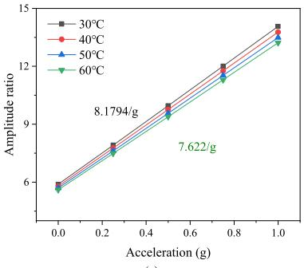

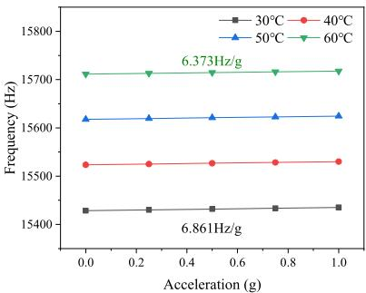

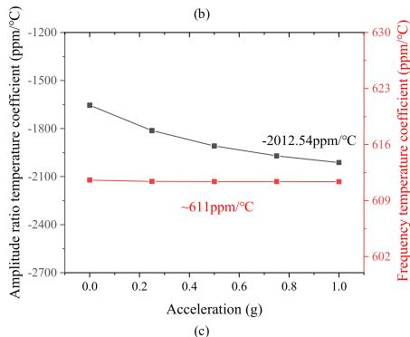  
Fig. 6. Amplitude ratio (a), frequency (b) and its temperature coefficient (c) under the influence of thermal stress and Young's modulus.

The sensitivity error is $6.81\%$ and the temperature coefficient of sensitivity is $-227.156\mathrm{ppm} / {}^{\circ}\mathrm{C}$ . According to Figure 6(b) it can be seen that the frequency increase as the temperature rises which means that the dominant factor affecting the accelerometer is the thermal stress which owns the positive temperature coefficient of frequency [33]. The sensitivity error of frequency is $7.11\%$ and the temperature coefficient of sensitivity is $-2369.97\mathrm{ppm} / {}^{\circ}\mathrm{C}$ . The temperature coefficient of the amplitude ratio and frequency at different acceleration are shown in Figure 6(c). The max temperature coefficient of the amplitude ratio output is $-2012.54\mathrm{ppm} / {}^{\circ}\mathrm{C}$ and that of the frequency is about $611\mathrm{ppm} / {}^{\circ}\mathrm{C}$ . It can be seen that under the condition that both the thermal stress and Young's modulus are affected by the temperature, the amplitude ratio is more sensitive to temperature than to frequency. This is because the stiffness of the coupling beam will change with thermal stress and the Young's modulus caused by temperature, and the coupling stiffness has a much larger impact on the amplitude ratio than on the frequency.

b) Effect of Young's modulus: When only the Young's modulus of the accelerometer is affected by temperature, the temperature characteristics of the accelerometer with "E" coupling

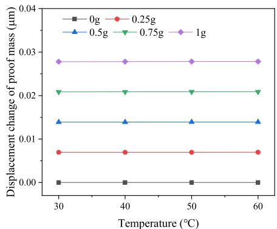  
(a)

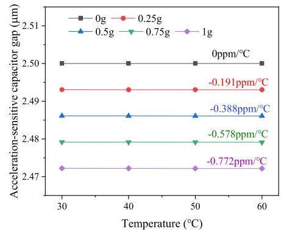  
(b)   
Fig. 7. Temperature characteristics of $\Delta x_{p}$ (a), $\Delta x_{wcr}$ (b) and $d_{\mathrm{a}}$ (c).

beam are simulated. First, the relationship between the $\Delta \mathbf{x}_p$ and temperature is simulated and the results are shown in Figure 7(a). Since the proof mass is not affected by the thermal stress, there is no offset displacement at $0\mathrm{g}$ . The stiffness of the elastic beam decreases as the temperature rises due to the negative temperature coefficient of the silicon Young's modulus, thus, the $\Delta \mathbf{x}_p$ increases as the temperature rises. The $\Delta \mathbf{x}_{wcr}$ is zero as the WCRs is not affected by thermal stress and acceleration. Therefore, the $\mathrm{d_a}$ is dependent on the $\Delta \mathbf{x}_p$ . The relationship between $\mathrm{d_a}$ and temperature are shown in Figure 7(b). The $\mathrm{d_a}$ decreases with the increase of temperature. The temperature coefficient of $\mathrm{d_a}$ is $-0.772\mathrm{ppm} / ^{\circ}\mathrm{C}$ at $1\mathrm{g}$ which is much smaller than that in Figure 5(c).

The amplitude ratio and frequency in the range of $0 - 1\mathrm{g}$ and $30^{\circ}\mathrm{C} - 60^{\circ}\mathrm{C}$ are shown in Figure 8(a). It can be seen that the response curves of the amplitude ratio are almost coincident, indicating that it is less sensitive to the temperature, i.e., the sensitivity error is only $0.43\%$ and the temperature coefficient of sensitivity is $142.64\mathrm{ppm} / {}^{\circ}\mathrm{C}$ . From Figure 8(b) it can be seen that the frequency decrease as the temperature rises due to the negative temperature coefficient of Young's modulus which reduces the stiffness of the resonator. The sensitivity error of frequency is $0.33\%$ and the temperature coefficient of sensitivity is $110.42\mathrm{ppm} / {}^{\circ}\mathrm{C}$ . These simulation results show that the effect of the temperature on the amplitude ratio and frequency are significantly weakened without considering the effects of thermal stress on the accelerometer.

The theoretical and simulated temperature characteristics of amplitude ratio and frequency at different acceleration are compared as shown in Figure 9. When the temperature is

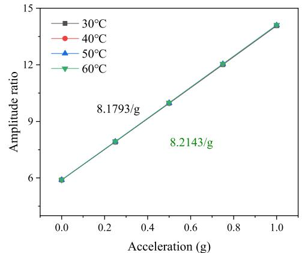  
(a)

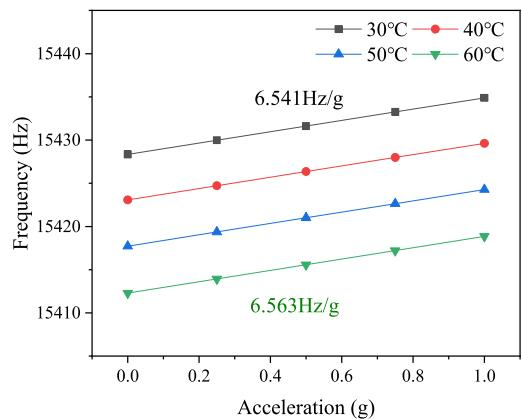  
(b)   
Fig. 8. Amplitude ratio (a) and frequency (b) under the influence of Young's modulus.

increased to $60^{\circ}\mathrm{C}$ , all the errors of amplitude ratio, frequency, and temperature coefficient increase with the acceleration. When the acceleration is $1\mathrm{g}$ , the simulated temperature coefficient of the amplitude ratio is $100.22\mathrm{ppm} / {}^{\circ}\mathrm{C}$ , and that of frequency is $-34.66\mathrm{ppm} / {}^{\circ}\mathrm{C}$ . The theoretical and simulated results are basically the same. It can be seen from Figure 7 that under the condition of being affected only by Young's modulus, the temperature coefficient of the amplitude ratio and frequency are significantly reduced. Therefore, thermal stress is the main factor affecting the output metric of the accelerometer.

3) The 3-DoF Mode-Localized Accelerometer With Stress Relief Beam:   
a) Elimination of thermal stress effect on the resonator: In order to eliminate the effect of thermal stress on the accelerometer, a stress relief structure is designed between the "E" coupling beam and anchor as shown in Figure 10. As the temperature increases, the elongation of the device layer is small than the elongation of the glass, because the coefficient of thermal expansion of silicon is small than that of glass. Thus, the thermal stress applied to the resonator is a tensile stress. When the thermal stress is applied to the accelerometer, the anchors expand to outside. For the WCRs without stress relief structure (i.e. "E" coupling beam), the stress directly acts on the connection between the coupling beam and the anchor when the anchors expand, then the stress transmitted to the elastic beam of the resonator through the coupling beam.

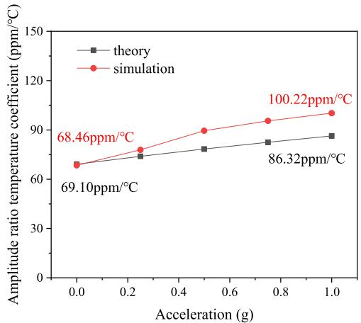

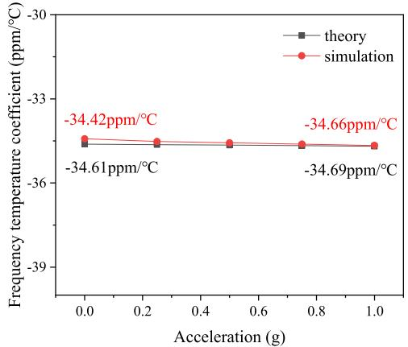  
(a)   
(b)

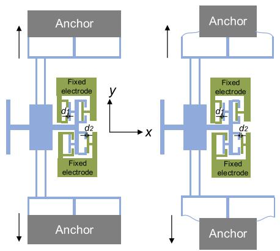  
Fig. 9. Temperature coefficient of amplitude ratio (a), and frequency (b).   
(a)   
Fig. 10. The effect of thermal stress on the resonator: (a) resonator without stress relief beam; (b) resonator with stress relief beam.

For the mode-localized accelerometer with a stress relief beam, the stress directly acts on the connection between the stress relief beam and anchor when the anchor on both sides of the resonator shrink. The stress relief beam will deform in the y direction under the action of thermal stress because of the small stiffness in the y direction, which means that the stress does not transmit to the elastic beam of the resonator, thereby driving the resonator to move in the y direction shown in Figure 10(b). Thus, the effect of thermal stress on the resonator can be weakened.

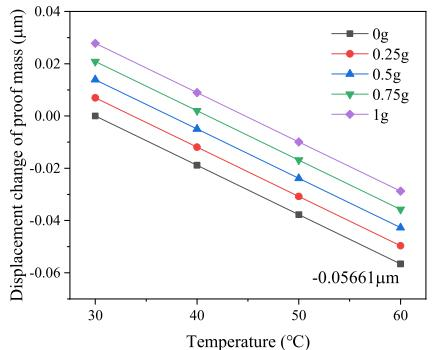

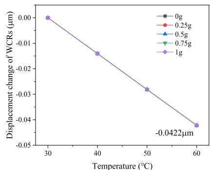  
(a)   
(b)

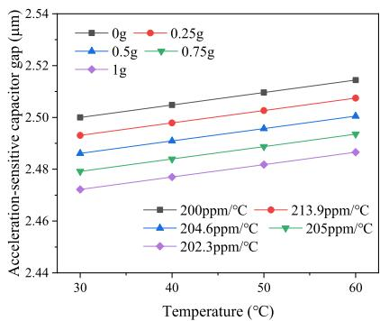  
(c)   
Fig. 11. Temperature characteristics of $\Delta x_{p}$ (a), $\Delta x_{wcr}$ (b) and $d_{\mathrm{a}}$ (c).

b) The temperature characteristics of the acceleration-sensitive capacitor gap: When the accelerometer is affected by thermal stress and Young's modulus, the temperature characteristics of the $d_{\mathrm{a}}$ are simulated firstly and the results are shown in Figure 11.

Since the dimensions of the proof mass is the same as it of the accelerometer with "E" coupling beam, the temperature-induced $\Delta x_{p}$ remains the same shown in Figure 11(a). The $\Delta x_{wcr}$ is reduced to $0.0422\mu \mathrm{m}$ at $60^{\circ}\mathrm{C}$ due to the function of the stress relief beam shown in Figure 11(b). The relationship between $\mathrm{d_a}$ and temperature is obtained shown in Figure 11(c). Although the thermal stress-induced $\Delta x_{wcr}$ is reduced, it cannot completely cancel with $\Delta x_{p}$ and is small than $\Delta x_{p}$ , thus, $\mathrm{d_a}$ increases as the temperature rises. The temperature coefficient of $\mathrm{d_a}$ changes from $192.218\mathrm{ppm} / {}^{\circ}\mathrm{C}$ to $193.607\mathrm{ppm} / {}^{\circ}\mathrm{C}$ which is slightly larger than that of the accelerometer with "E" coupling beam.

c) The temperature characteristics of output of the accelerometer with stress relief beam: The COMSOL simulation analysis of the accelerometer with stress relief beam is performed.

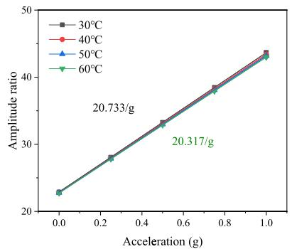

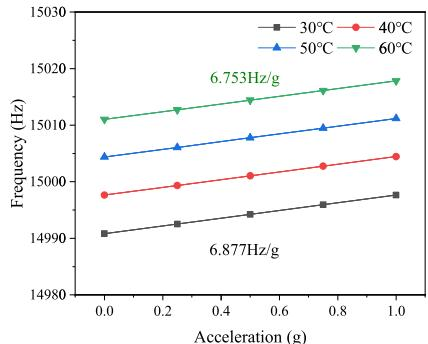  
(a)

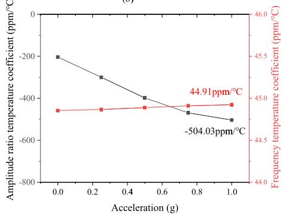  
(b)   
(c)   
Fig. 12. Simulated amplitude ratio (a), frequency (b) and temperature coefficient (c) of the accelerometer with stress relief structure.

Considering the effects of thermal stress and Young's modulus at the same time, the acceleration response and temperature coefficient of the amplitude ratio and frequency within the range of $30^{\circ}\mathrm{C} - 60^{\circ}\mathrm{C}$ and $0 - 1\mathrm{g}$ are shown in Figure 12(a) and 12(b).

Compared with the accelerometer with "E" coupling beam, the sensitivity error of amplitude ratio decreased from $13.12\%$ to $2.01\%$ and that of frequency decreased from $7.11\%$ to $1.8\%$ ; the temperature coefficient of amplitude ratio sensitivity has reduced from $-2271.56\mathrm{ppm} / {}^{\circ}\mathrm{C}$ to $-669.01\mathrm{ppm} / {}^{\circ}\mathrm{C}$ and that of frequency sensitivity decreased from $-2369.97\mathrm{ppm} / {}^{\circ}\mathrm{C}$ to $-600.02\mathrm{ppm} / {}^{\circ}\mathrm{C}$ . The temperature coefficients of the amplitude ratio and frequency under different acceleration are shown in Figure 12(c). The max temperature coefficient of the amplitude ratio is $-504.03\mathrm{ppm} / {}^{\circ}\mathrm{C}$ while that of accelerometer with "E" coupling beam is about $-2012.54\mathrm{ppm} / {}^{\circ}\mathrm{C}$ ; the temperature coefficient of the frequency reduced from $611\mathrm{ppm} / {}^{\circ}\mathrm{C}$ to $44.91\mathrm{ppm} / {}^{\circ}\mathrm{C}$ . From Figure 12(b) it can be seen that the frequency increase as the temperature rises which means that the effect of thermal stress on the accelerometer is not completely

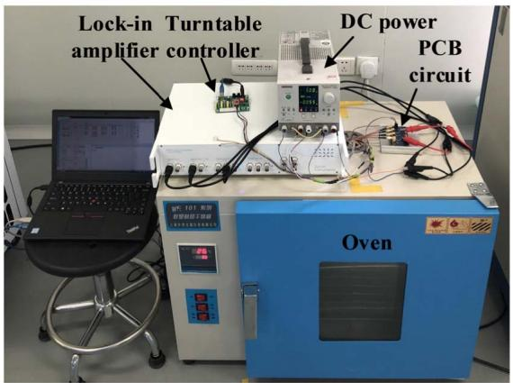  
Fig. 13. Measurement setup of the temperature characteristic.

eliminated, however, the stress relief beam still significantly weakens the effect of thermal stress on the amplitude ratio and frequency, and greatly reduces the temperature coefficient of sensitivity and output metric of the amplitude ratio and frequency.

# III. EXPERIMENTAL RESULTS AND DISCUSSION

# A. Measurement Setup

In this work, the temperature characteristics of two type of simulated mode-localized accelerometers with the dimensions in Table I are measured under the closed-loop circumstance. The measurement setup of the temperature characteristic is shown in Figure 13 and includes a DC power source, lock-in amplifier (Zurich Instruments HF2LI), PCB test circuit, turntable and oven. In order to eliminate the effect of temperature on the measurement circuit, the PCB test circuit is placed outside the oven and only the accelerometer fixed to the turntable is placed inside the oven. The accelerometer is tested in the range of $0 - 1\mathrm{g}$ and $30 - 60^{\circ}\mathrm{C}$ at intervals of $10^{\circ}\mathrm{C}$ . The accelerometer is packaged in a vacuum metal shell, thus, the oven needs to be kept for one hour at every measurement temperature point to make the temperature of the accelerometer stable.

# B. Accelerometer With "E" Coupling Beam

The amplitude ratio and frequency of the accelerometer with "E" coupling beam are shown in Figure 14(a) and 14(b). The sensitivity error of amplitude ratio is $4.39\%$ and the temperature coefficient of sensitivity based on amplitude ratio is $-1464.26\mathrm{ppm} / {}^{\circ}\mathrm{C}$ ; the sensitivity error of frequency is $8.84\%$ and the temperature coefficient of sensitivity based on frequency is $2947.84\mathrm{ppm} / {}^{\circ}\mathrm{C}$ .

According to the Figure 14(b) the frequency increase as the temperature rises indicating that the accelerometer is more seriously affected by the stress which is the same with the simulation results of the accelerometer with "E" coupling beam. The stiffness of resonator and coupling beam are both enhanced by the stress. The amplitude ratio is more affected by the coupling beam stiffness, however, the frequency is more affected by the resonator stiffness. And coupling stiffness and resonator stiffness have opposite effects on amplitude ratio and

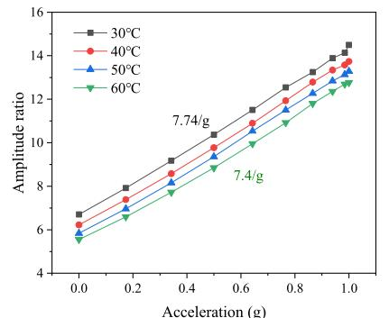  
(a)

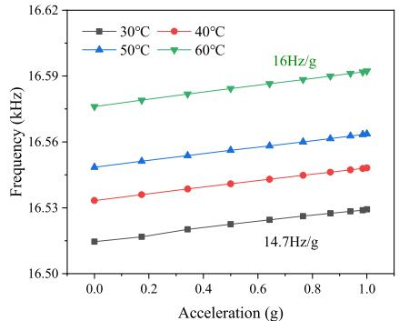

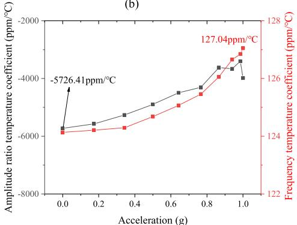  
(b)   
(c)   
Fig. 14. Amplitude ratio (a) and frequency (b) and temperature coefficient (c) of the accelerometer with "E" type coupling beam.

frequency respectively, thus, the temperature coefficient of the amplitude ratio and frequency are opposite. The temperature coefficient of amplitude ratio and frequency under different acceleration is shown in the Fig. 14(c). The maximum temperature coefficient of the amplitude ratio and frequency are $-5726.41\mathrm{ppm} / {}^{\circ}\mathrm{C}$ and $127.04\mathrm{ppm} / {}^{\circ}\mathrm{C}$ , respectively.

# C. Accelerometer With Stress Relief Beam

The amplitude ratio and frequency of the accelerometer with stress relief structure are shown in Figure 15(a) and 15(b). The sensitivity error of the amplitude ratio is $0.94\%$ , the temperature coefficient of the sensitivity based on amplitude ratio is $-314.07\mathrm{ppm} / {}^{\circ}\mathrm{C}$ ; the sensitivity error of frequency is $0.98\%$ , and the temperature coefficient of sensitivity based on frequency is $-329.62\mathrm{ppm} / {}^{\circ}\mathrm{C}$ .

The temperature coefficient of amplitude ratio and frequency under different acceleration are shown in Figure 15(c). The maximum temperature coefficient of amplitude ratio and frequency are $-405.77\mathrm{ppm} / {}^{\circ}\mathrm{C}$ and $14.24\mathrm{ppm} / {}^{\circ}\mathrm{C}$ , respectively.

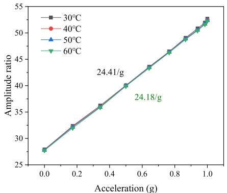  
(a)

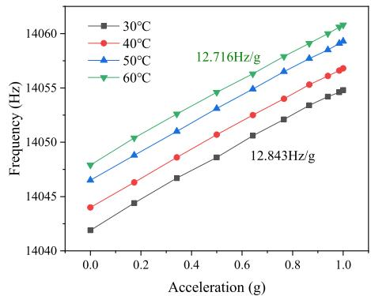

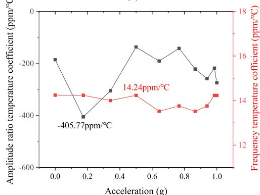  
(b)   
(c)   
Fig. 15. Amplitude ratio (a) and frequency (b) and temperature coefficient (c) of the accelerometer with stress relief structure.

Compared with the accelerometer with "E" type coupling beam the influence of temperature on the sensitivity of amplitude ratio and frequency is well suppressed, and the temperature coefficients of sensitivities based on two output metrics are reduced by $78.55\%$ and $88.81\%$ , respectively. In addition, the temperature coefficients of the output metric based on amplitude ratio and frequency are also significantly reduced. The maximum temperature coefficients of the amplitude ratio and frequency are reduced by $92.91\%$ and $88.79\%$ , respectively. It can be concluded that the thermal stress is still the main factor affecting the accelerometer with the stress relief beam according to the positive temperature coefficient of the frequency from Figure 15(c). In fact, it is difficult to completely eliminate the effect of stress for the WCRs based on the mechanical coupling, but the stress relief beam still weakens the effect of temperature on the accelerometer significantly.

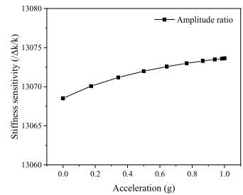

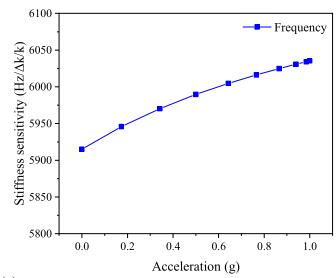

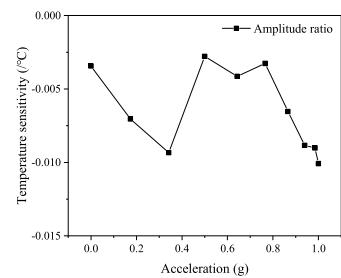

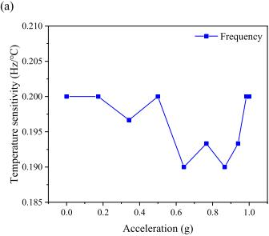

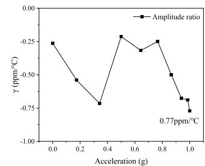

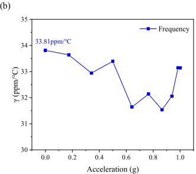  
(c)   
Fig. 16. Stiffness sensitivity (a), temperature sensitivity (b), and temperature suppression coefficient (c) of amplitude ratio and frequency.

Although the temperature coefficient of the amplitude ratio is reduced by an order of magnitude, it is still an order of magnitude higher than that of frequency. The effect of temperature on the output of mode-localized accelerometer can be considered as a stiffness perturbation caused by temperature applied to the accelerometer, and the sensitivity of amplitude ratio is much larger than that of frequency, which also leads a significant change of amplitude ratio caused by temperature change. Therefore, a temperature suppression coefficient $\gamma$ is introduced to characterize the temperature drift suppression capability of two output metrics through comprehensively considering the temperature sensitivity $(/^\circ \mathrm{C})$ and input stiffness sensitivity $(/\Delta \mathrm{k / k})$ . The temperature suppression coefficient $\gamma$ is defined as

$$
\gamma = \frac {S _ {T}}{S _ {\delta}} \tag {13}
$$

where $S_{T}$ is the temperature sensitivity and $S_{\delta}$ is the stiffness sensitivity. The input acceleration is converted to the corresponding stiffness perturbation, then the sensitivity of the output metric relative to the stiffness at different acceleration is obtained shown in Figure 16(a). It can be seen that the sensitivity of the amplitude ratio increase slightly as the acceleration increases and is stable at higher acceleration. This is due to the variation of the sensitivity of the amplitude ratio at different input [30]. The absolute sensitivity of each output metric relative to the temperature change is shown in Figure 16(b) which shows the opposite effect of the

temperature as the same with the temperature coefficient in Figure 15(c). Then the temperature suppression coefficient is obtained by dividing the absolute sensitivity of each output metric relative to the temperature by the sensitivity of the output metric relative to the stiffness shown in Figure 16(c). It can be seen that the temperature suppression coefficients of the amplitude ratio at different amplitude ratio are both less than $1\mathrm{ppm} / {}^{\circ}\mathrm{C}$ and the maximum value is only $0.77\mathrm{ppm} / {}^{\circ}\mathrm{C}$ . However, the maximum temperature suppression coefficient of frequency reaches $33.81\mathrm{ppm} / {}^{\circ}\mathrm{C}$ , which is 43.9 times higher than that of the amplitude ratio. The temperature suppression coefficient reflects the input-referred temperature-induced change of output metric and the smaller the temperature suppression coefficient the stronger the capability to suppress temperature noise. Thus, the amplitude ratio with a much lower temperature suppression coefficient has a much better temperature noise suppression capability than does the frequency.

# IV. CONCLUSIONS

In previous work, WCRs were verified to be excellent in temperature drift suppression; however, the conversion mechanism of the mode-localized sensors also affects the temperature characteristic of the mode-localized sensors. In this paper, we show for the first time that the 3-DoF mode-localized accelerometer which the resonator is weakly coupled by the mechanical beam with the function of stress relief still presents excellent temperature drift suppression capability through the simulation and experiment from $30^{\circ}\mathrm{C}$ to $60^{\circ}\mathrm{C}$ even though the conversion mechanism (acceleration to electrostatic negative stiffness) is affected by the temperature.

It should be noted that the temperature coefficient of the frequency is almost one order of magnitude lower than that of the amplitude ratio in the two accelerometers in this paper. However, sensitivity based on amplitude ratio is much higher than that based on frequency. Thus, the temperature suppression coefficient, defined as the ratio of temperature sensitivity and input sensitivity, is used to characterize the temperature drift suppression capability of the mode-localized accelerometer. In addition, the temperature suppression coefficient of the amplitude ratio is more than one order of magnitude lower than that of the frequency, indicating that the mode-localized accelerometer based on amplitude ratio has an excellent temperature drift suppression capability compared with that based on the traditional output metric of frequency.

Almost all MEMS accelerometers are temperature sensors because they are made of silicon. This paper verifies that mode-localized accelerometers have an excellent temperature drift suppression capability, which provides new options for their application in some harsh environments.

# ACKNOWLEDGMENT

Grateful acknowledgments are made to H. Zhang and W. Li for their helpful discussions in device fabrication and measurement.

# REFERENCES

[1] A. A. Seshia et al., "A vacuum packaged surface micromachined resonant accelerometer," J. Microelectromech. Syst., vol. 11, no. 6, pp. 784-793, Dec. 2002, doi: 10.1109/JMEMS.2002.805207.   
[2] S. Sung et al., "Design and performance test of an oscillation loop for a MEMS resonant accelerometer," J. Micromech. Microeng., vol. 13, no. 2, p. 246, Jan. 2003, doi: 10.1088/0960-1317/13/2/312.   
[3] L. Huang, H. Yang, Y. Gao, L. Zhao, and J. Liang, "Design and implementation of a micromechanical silicon resonant accelerometer," Sensors, vol. 13, no. 11, pp. 15785-15804, Nov. 2013, doi: 10.3390/s131115785.   
[4] J. Bernstein, S. Cho, A. T. King, A. Kourepenis, P. Maciel, and M. Weinberg, "A micromachined comb-drive tuning fork rate gyroscope," in Proc. IEEE Micro Electro Mech. Syst., Feb. 1993, pp. 143-148, doi: 10.1109/MEMSYS.1993.296932.   
[5] O. HaLevy, N. Krakover, and S. Krylov, "Feasibility study of a resonant accelerometer with bistable electrostatically actuated cantilever as a sensing element," Int. J. Non-Linear Mech., vol. 118, Jan. 2020, Art. no. 103255, doi: 10.1016/j.ijnonlinmec.2019.103255.   
[6] J. Han et al., "A triaxial accelerometer based on differential resonant beams and force-balanced capacitive plates," IEEE Sensors J., vol. 19, no. 16, pp. 6602-6609, Aug. 2019, doi: 10.1109/JSEN.2019.2911740.   
[7] T. O. Rocheleau, T. L. Naing, and C. T.-C. Nguyen, “Long-term stability of a hermetically packaged MEMS disk oscillator,” in Proc. Joint Eur. Freq. Time Forum Int. Freq. Control Symp. (EFTF/IFC), Jul. 2013, pp. 209–212, doi: 10.1109/EFTF-IFC.2013.6702095.   
[8] M.-H. Li, C.-Y. Chen, C.-S. Li, C.-H. Chin, C.-C. Chen, and S.-S. Li, "Foundry-CMOS integrated oscillator circuits based on ultra-low power ovenized CMOS-MEMS resonators," in IEDM Tech. Dig., Dec. 2013, p. 18, doi: 10.1109/IEDM.2013.6724654.   
[9] C. Liu, R. Tabrizian, and F. Ayazi, "A ±0.3 ppm oven-controlled MEMS oscillator using structural resistance-based temperature sensing," IEEE Trans. Ultrason., Ferroelectr., Freq. Control, vol. 65, no. 8, pp. 1492-1499, Aug. 2018, doi: 10.1109/TUFFC.2018.2843781.   
[10] C. M. Jha et al., "Thermal isolation of encapsulated MEMS resonators," J. Microelectromech. Syst., vol. 17, no. 1, pp. 175-184, Feb. 2008, doi: 10.1109/JMEMS.2007.904332.   
[11] R. Tabrizian, M. Pardo, and F. Ayazi, "A 27 MHz temperature compensated MEMS oscillator with sub-ppm instability," in Proc. IEEE 25th Int. Conf. Micro Electro Mech. Syst. (MEMS), Jan./Feb. 2012, pp. 23-26, doi: 10.1109/MEMSYS.2012.6170084.   
[12] E. J. Ng et al., "Localized, degenerately doped epitaxial silicon for temperature compensation of resonant MEMS systems," in Proc. Transducers Eurosensors XXVII: 17th Int. Conf. Solid-State Sensors, Actuat. Microsyst. (TRANSDUCERS EUROSENSORS XXVII), Jun. 2013, pp. 2419-2422, doi: 10.1109/Transducers.2013.6627294.   
[13] S. Z. Asl et al., "12.9 A $1.55 \times 0.85 \mathrm{~mm}^2$ 3ppm $1.0\mu \mathrm{A}$ 32.768 kHz MEMS-based oscillator," in IEEE ISSCC Dig. Tech. Papers, Feb. 2014, pp. 226-227, doi: 10.1109/ISSCC.2014.6757411.   
[14] N. Arumugam et al., “2-die wafer-level chip scale packaging enables the smallest TCXO for mobile and wearable applications,” in Proc. IEEE 65th Electron. Compon. Technol. Conf. (ECTC), May 2015, pp. 1338-1342, doi: 10.1109/ECTC.2015.7159771.   
[15] J. Lee and J. Rhim, "Temperature compensation method for the resonant frequency of a differential vibrating accelerometer using electrostatic stiffness control," J. Micromech. Microeng., vol. 22, no. 9, Jul. 2012, Art. no. 095016, doi: 10.1088/0960-1317/22/9/095016.   
[16] M. Spletzer, A. Raman, H. Sumali, and J. P. Sullivan, "Highly sensitive mass detection and identification using vibration localization in coupled microcantilever arrays," Appl. Phys. Lett., vol. 92, no. 11, Mar. 2008, Art. no. 114102, doi: 10.1063/1.2899634.   
[17] M. Manav, G. Reynen, M. Sharma, E. Cretu, and A. S. Phani, "Ultrasensitive resonant MEMS transducers with tuneable coupling," J. Micromech. Microeng., vol. 24, no. 5, May 2014, Art. no. 055005, doi: 10.1109/Transducers.2013.6626937.   
[18] C. Zhao, G. S. Wood, J. Xie, H. Chang, S. H. Pu, and M. Kraft, “A three degree-of-freedom weakly coupled resonator sensor with enhanced stiffness sensitivity,” J. Microelectromech. Syst., vol. 25, no. 1, pp. 38-51, Feb. 2016, doi: 10.1109/JMEMS.2015.2490204.   
[19] C. Zhao, G. S. Wood, J. Xie, H. Chang, S. H. Pu, and M. Kraft, "A comparative study of output metrics for an MEMS resonant sensor consisting of three weakly coupled resonators," J. Microelectromech. Syst., vol. 25, no. 4, pp. 626-636, Aug. 2016, doi: 10.1109/JMEMS.2016.2580529.

[20] H. Kang, J. Yang, and H. Chang, "A closed-loop accelerometer based on three degree-of-freedom weakly coupled resonator with self-elimination of feedthrough signal," IEEE Sensors J., vol. 18, no. 10, pp. 3960-3967, May 2018, doi: 10.1109/JSEN.2018.2817197.   
[21] H. Zhang, B. Li, W. Yuan, M. Kraft, and H. Chang, "An acceleration sensing method based on the mode localization of weakly coupled resonators," J. Microelectromech. Syst., vol. 25, no. 2, pp. 286-296, Apr. 2016, doi: 10.1109/JMEMS.2015.2514092.   
[22] B. Peng et al., "A sensitivity tunable accelerometer based on series-parallel electromechanically coupled resonators using mode localization," J. Microelectromech. Syst., vol. 29, no. 1, pp. 3-13, Feb. 2020, doi: 10.1109/JMEMS.2019.2958427.   
[23] H. Zhang, J. Zhong, W. Yuan, J. Yang, and H. Chang, "Ambient pressure drift rejection of mode-localized resonant sensors," in Proc. IEEE 30th Int. Conf. Micro Electro Mech. Syst. (MEMS), Jan. 2017, pp. 1095-1098, doi: 10.1109/MEMSYS.2017.7863604.   
[24] P. Thiruvenkatanathan, J. Yan, and A. A. Seshia, "Common mode rejection in electrically coupled MEMS resonators utilizing mode localization for sensor applications," in Proc. IEEE Int. Freq. Control Symp. Joint 22nd Eur. Freq. Time forum, Apr. 2009, pp. 358-363, doi: 10.1109/FREQ.2009.5168201.   
[25] J. Yang, J. Zhong, and H. Chang, “The temperature drift suppression of mode-localized resonant sensors,” in Proc. IEEE Micro Electro Mech. Syst. (MEMS), Jan. 2018, pp. 467-470, doi: 10.1109/MEMSYS.2018.8346590.   
[26] M. Pandit, C. Zhao, G. Sobreviela, and A. A. Seshia, "Immunity to temperature fluctuations in weakly coupled MEMS resonators," in Proc. IEEE SENSORS, Oct. 2018, pp. 1-4, doi: 10.1109/ICSENS.2018.8589869.   
[27] M. Pandit, C. Zhao, G. Sobreviela, and A. Seshia, "Practical limits to common mode rejection in mode localized weakly coupled resonators," IEEE Sensors J., early access, Jul. 24, 2019, doi: 10.1109/JSEN.2019.2930117.   
[28] W. Thomson, Theory of Vibration With Application. Boca Raton, FL, USA: CRC Press, 2018.   
[29] C. Zhao et al., "A sensor for stiffness change sensing based on three weakly coupled resonators with enhanced sensitivity," in Proc. 28th IEEE Int. Conf. Micro Electro Mech. Syst. (MEMS), Jan. 2015, pp. 881-884, doi: 10.1109/MEMSYS.2015.7051100.   
[30] H. Zhang, H. Kang, and H. Chang, "Suppression on nonlinearity of mode-localized sensors using algebraic summation of amplitude ratios as the output metric," IEEE Sensors J., vol. 18, no. 19, pp. 7802-7809, Oct. 2018, doi: 10.1109/jesn.2018.2857923.   
[31] J. B. Wachtman, W. E. Tefft, D. G. Lam, and C. S. Apstein, "Exponential temperature dependence of Young's modulus for several oxides," Phys. Rev., vol. 122, no. 6, pp. 1754-1759, Jun. 1961, doi: 10.1103/PhysRev.122.1754.   
[32] H. Kang, B. Ruan, Y. Hao, and H. Chang, "A micromachined electrometer with room temperature resolution of $0.256\mathrm{e} / \sqrt{\mathrm{Hz}}$ IEEE Sensors J., vol. 20, no. 1, pp. 95-101, Jan. 2020, doi: 10.1109/JSEN.2019.2941231.   
[33] W.-T. Hsu and C. T. Nguyen, "Stiffness-compensated temperature-insensitive micromechanical resonators," in Tech. Dig. MEMS IEEE Int. Conf. 15th IEEE Int. Conf. Micro Electro Mech. Syst., Jan. 2002, pp. 731-734.

Hao Kang received the B.S. degree in instrument and meter from the Xi'an University of Science and Technology, Xi'an, China, in 2011, and the M.S. degree in instrument science and technology from the North University of China, Taiyuan, Shanxi, in 2014. He is currently pursuing the Ph.D. degree with the MOE Key Laboratory of Micro and Nano Systems for Aerospace, Northwestern Polytechnical University. His research interest includes inertial microelectromechanical systems sensors, focusing on mode-localized sensors.

Bing Ruan received the B.Eng. degree in mechanical engineering from Northwestern Polytechnical University, Xi'an, China, in 2018, where he is currently pursuing the master's degree with the MOE Key Laboratory of Micro and Nano Systems for Aerospace. His current research interest includes MEMS mode-localized sensors.

Yongcun Hao received the B.S. and Ph.D. degrees in mechanical engineering from Northwestern Polytechnical University (NPU), Xi'an, China, in 2010 and 2017, respectively. He is currently a Research Assistant Professor with the Ministry of Education Key Laboratory of Micro and Nano Systems for Aerospace, NPU. His research interests are MEMS physical sensors and micro actuators.

Honglong Chang (Senior Member, IEEE) received the B.S., M.S., and Ph.D. degrees in mechanical engineering from Northwestern Polytechnical University (NPU), Xi'an, China, in 1999, 2002, and 2005, respectively. He is currently a Professor with the MOE Key Laboratory of Micro and Nano Systems for Aerospace, NPU, where he is also the Deputy Dean of the School of Mechanical Engineering. From October 2011 to November 2012, he was a Visiting Associate (Faculty) with the Micromachining Labora

tory, California Institute of Technology, Pasadena, USA. He has published more than 70 international peer-reviewed journal articles and more than 50 international conference papers in the MEMS field. His research interests include MEMS physical sensors and microfluidics. With his students, he was a recipient of the Transducer 2015 Outstanding Paper Finalist Award, the MEMS 2016 Outstanding Paper Award, the IEEE Sensors 2017 Best Paper, and the MEMS 2018 Outstanding Paper Finalist Award.