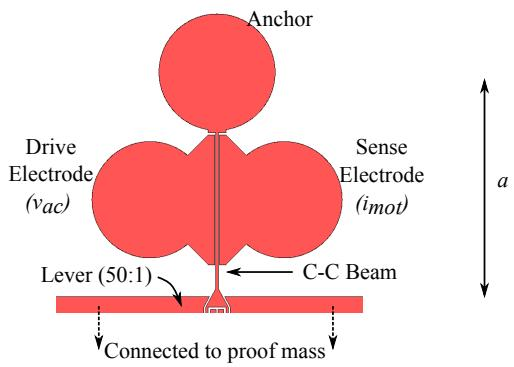
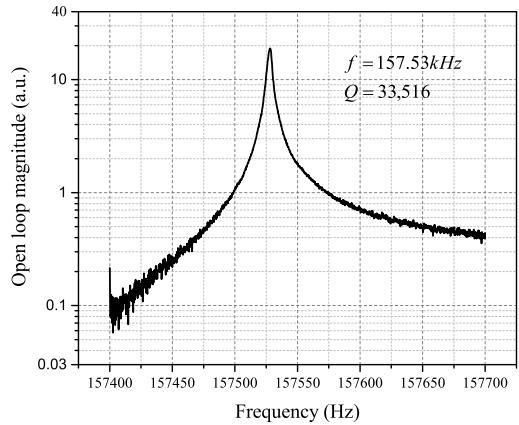
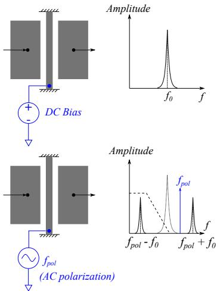
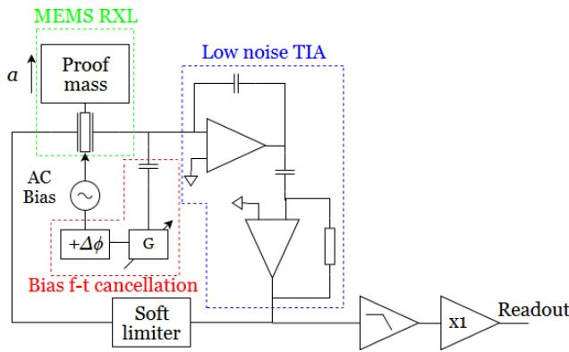
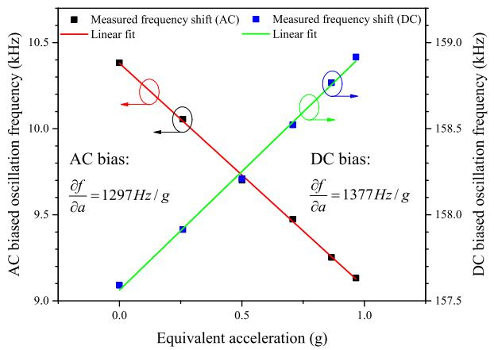
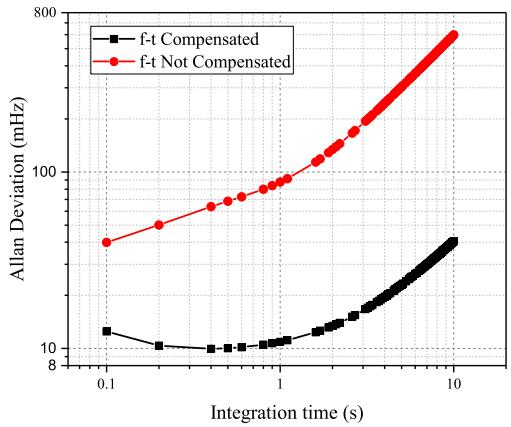
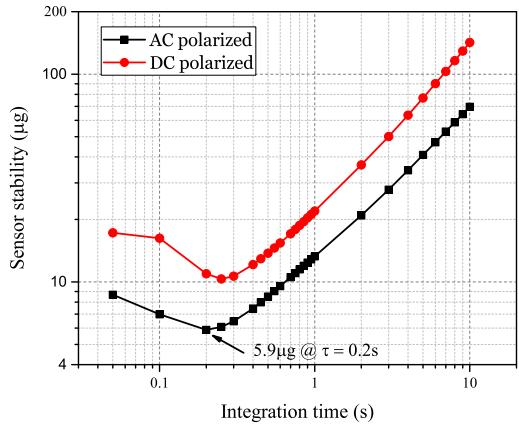
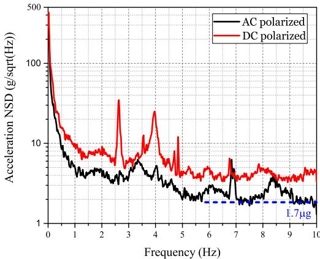

# A Resonant MEMS Accelerometer Utilizing AC Polarization

Chun Zhao*, Guillermo Sobreviela*, Milind Pandit*, Arif Mustafazade*, Sijun Du*, Xudong Zou*†‡ and Ashwin Seshia*

\*The Nanoscience Centre, Department of Engineering, University of Cambridge, Cambridge, CB3 0FF, UK

†State Key Laboratory of Transducer Technology, Institute of Electronics, Chinese Academy of Sciences, Beijing, 100190, China

$\ddagger$ School of Electronics, Electrical, and Communication Engineering,

University of Chinese Academy of Sciences, Beijing, 100190, China

Abstract-In this paper, we present a resonant MEMS accelerometer (RXL) using AC polarization voltage as an alternative to the existing DC polarization schemes. By making full use of the intrinsic frequency mixing property of a parallel plate capacitive transducer, we are able to down-convert the oscillation frequency to $10\mathrm{kHz}$ , an order of magnitude lower than the resonator's intrinsic first fundamental mode frequency of $157.5\mathrm{kHz}$ in contrast to the standard approach relying only on a DC polarization voltage. With this approach, a minimum bias stability of $5.9\mu \mathrm{g}$ has been achieved at an integration time of 0.2s, and the noise floor is $1.7\mu \mathrm{g} / \mathrm{Hz}^{1 / 2}$ . Compared to DC polarized configuration, the improvement in bias stability and noise floor is 1.7 times and 2 times respectively.

# I. INTRODUCTION

Recent developments in Micro-electro-mechanical Systems (MEMS) have seen a wide application of MEMS sensors across various industries, including automotive, consumer electronics and others. MEMS accelerometers, in particular, have seen wide application across a number of domains. There is continued interest in higher performance sensors, and resonant accelerometers [1], [2], [3], [4] have been widely researched in this regard. Resonant accelerometers, employing a vibrating element attached to a proof mass, transduce accelerations into frequency shifts, providing key benefits including increased dynamic range with high sensitivity, as well as quasi-digital output [2].

Further improvements in stability and resolution for these sensors are necessary for applications requiring high precision. The noise of the first stage amplifier, transimpedance amplifier (TIA) is crucial to the resolution of the sensor. However, there is a trade-off between the TIA bandwidth and close-to-carrier noise assuming sufficient phase margin [5]. In addition, by reducing the bandwidth, the total in-band noise can also be reduced.

One approach to alleviate the problem is to down-convert the oscillation frequency, utilizing the intrinsic mixing properties of capacitive transducers [6]. Furthermore, it has been previously reported that the AC polarization voltage reduces the frequency drift introduced by charges on the associated capacitive electrodes [7], [8]. Due to these considerations, AC polarization can be considered as an alternative approach to potentially improve the resolution as well as long term

stability. In this paper, we mainly focus on the short-term stability improvements.

# II. THEORY

  
A. Resonant accelerometer   
Fig. 1. Illustration of the clamped-clamped beam (C-C beam) used as the sensing element for the resonant accelerometer.

A MEMS resonator has been utilized as a sensing element in a resonant accelerometer (RXL), shown in Fig. 1. The resonator is a clamped-clamped beam type, and its first fundamental mode of resonance is utilized for sensing. The beam width is $6\mu \mathrm{m}$ , length is $350\mu \mathrm{m}$ and thickness is $40\mu \mathrm{m}$ . The mechanical design considerations outlined in previous work [2] The resonator, along with other parts of the accelerometer, including a proof mass and levers, are microfabricated using a bonded wafer process with wafer-level vacuum packaging. When biased with a DC polarization voltage of $10\mathrm{V}$ , the frequency response is shown in Fig. 2. The resonant frequency is $157.53\mathrm{kHz}$ , and has a quality factor of $Q = 33,516$ . The main energy loss mechanism is thermoelastic damping and anchor loss.

The proof mass transduces an acceleration into an inertial force, which is amplified by the lever. The amplified inertial force is then sensed by the resonator in the form of an axial stress. The axial stress on the resonator modulates the stiffness of the resonator, resulting in a shifted resonant frequency. This resonant frequency is directly proportional to the acceleration;

  
Fig. 2. Measured open loop response of the resonator with DC polarization in vacuum package.

therefore, by measuring the shift in the resonant frequency, the variation in acceleration can be detected.

# B. AC polarization

Consider the capacitively actuated MEMS resonator (identical to the resonator shown in Fig. 1), simply illustrated in Fig. 3, with an AC polarization voltage applied instead of a conventional DC voltage. If an AC drive voltage is applied, the force generated can be expressed by:

$$
F _ {\text {e x c}} = \frac {\partial \left(\frac {\varepsilon A}{d + x} \left[ v _ {p o l} \cos \left(2 \pi f _ {p o l} t + \phi\right) - v _ {a c} \cos \left(2 \pi f _ {a c} t\right) \right] ^ {2}\right)}{2 \times \partial x} \tag {1}
$$

Where $\varepsilon$ is the dielectric constant of air, $A$ is the cross-sectional area of the capacitive actuation, $d$ is the initial gap, $v_{pol}$ ( $v_{ac}$ ) is the amplitude of the AC polarization (drive) voltage, $f_{pol}$ ( $f_{ac}$ ) is the frequency of the AC polarization (drive) voltage, and $\phi$ is the phase difference between the two signals.

It can be shown that the excitation force has four frequency components, at the frequencies of $f_{pol}$ , $f_{ac}$ and $f_{pol} \pm f_{ac}$ are generated because of the AC polarization. The MEMS resonator is essentially a high-quality factor bandpass mixer filter. Thus, we can assume that signals at undesired frequency bands can be effectively eliminated. If the component at $f_{pol} - f_{ac} = f_0$ is used to excite the natural resonance, the motional current can be expressed by:

$$
i _ {m o t} = \frac {\partial \left(- \frac {\varepsilon A}{d + x (t)} v _ {p o l} \cos \left(2 \pi f _ {p o l} t + \phi\right)\right)}{\partial t} \tag {2}
$$

Where $x(t) = x\cos [2\pi (f_{pol} - f_{ac})t + \phi +\pi /2]$ , is the time-dependent amplitude of the mechanical motion of the resonator. It can be shown that the motional current has one component at $f_{ac}$ , and is independent of phase difference $\phi$ . The amplitude of this term is also proportional to $f_{ac}$ . The other component of the motional current is $2f_{pol} - f_{ac}$ .

  
Fig. 3. Illustration of the working principle of AC polarization, utilizing the mixing nature of capacitive transduction.

With a low-pass filter, the higher component can be filtered, leaving only the term at $f_{ac}$ . The phase transition, which does not depend on the phase difference between the drive and polarization signals, is similar to the DC polarization; therefore, the oscillator topology can be essentially identical for DC and AC polarization.

# C. Oscillator topology

To instantaneously measure the resonant frequency, an oscillator that is able to automatically track the resonant frequency is necessary. As previously shown, the oscillator topology for AC polarized resonator can be identical to the conventional DC polarized resonator. Therefore, we propose the topology shown in Fig. 4.

  
Fig. 4. Circuit diagram of the AC polarized oscillator for the MEMS RXL, showing the schematics of the low noise TIA with bias feed-through cancellation.

An AC bias voltage with high amplitude (i.e. $10\mathrm{V}_{\mathrm{p - p}}$ in this case) is selected to improve the readout signal, since the motional current is proportional to the amplitude of the AC bias voltage squared. Due to the high polarization signal level, despite low capacitive feedthrough (see Fig. 2), a residual signal at $f_{pol}$ is visible at the output. To eliminate

the feedthrough, one additional polarization feedthough cancellation path is required. The cancellation path consists of a phase shifter and a variable gain. Due to the unpredictable nature of the parasitic capacitance, the phase shifter and the variable gain need to be fine tuned to eliminate the polarization feedthrough. For this reason, the AC polarization voltage is ideally a sinusoidal signal, where the high order harmonics are negligible.

The oscillator therefore operates in a frequency range much lower than the resonant frequency, i.e. $10\mathrm{kHz}$ $(f_{pol} = 168\mathrm{kHz})$ in this work. Therefore, the noise is optimized for this region, and all the undesired high frequency components, as well as out-of-band noise, are filtered in the oscillator circuit. The oscillator circuitry consists of a low noise TIA and a soft limiter. The low noise front-end TIA includes a charge amplifier and a differentiator to ensure a flat phase response within the band. A soft limiter, constructed using a low noise and low offset op-amp is used as gain control. A fourth order low-pass filter is constructed to eliminate the undesired high frequency components.

# III. EXPERIMENT

# A. Acceleration test

To test the sensitivity of the RXL, a tilt stage is employed, and the accelerometer is characterized by measuring its response with the sensitive axis oriented between $0^{\circ}$ and $90^{\circ}$ with respect to the gravitational field. Both DC $(V_{\mathrm{DC}} = 3.54V)$ and AC $(v_{\mathrm{rms}} = 3.54V, f_{pol} = 168\mathrm{kHz})$ polarization approaches are used. The test was carried out employing the oscillator, the frequency is measured using a frequency counter (53230a, Keysight Technologies), and the sensitivity is shown in Fig. 5.

  
Fig. 5. Characterized sensitivity of the sensor using AC and DC polarized approach.

For DC polarization, the resonant frequency, $f_{0}$ , increases as the equivalent acceleration increases; thus $f_{pol} - f_{0}$ decreases accordingly. A linear frequency shift response with respect to acceleration can be observed, and a sensitivity of $1297\mathrm{Hz / g}$

and $1377\mathrm{Hz / g}$ is extracted for AC and DC polarized configurations, respectively. This demonstrates the functionality of the RXL in the AC polarized configuration, and the extracted sensitivity is very similar, with a discrepancy of $5.8\%$ .

# B. Oscillator test without polarization feedthrough cancellation

A test was carried out without the polarization feedthrough cancellation, and compared to the results obtained with feedthrough cancellation. This is shown in Fig. 6.

  
Fig. 6. Measured frequency stability with and without feedthrough compensation.

It can be observed that without polarization feedthrough cancellation, the frequency stability is approximately 3-10 times worse than feedthrough compensated oscillator. One explanation of this can be the undesired saturation of the TIA, thus leading to distorted voltage signal at the output of the TIA. In addition, because of the saturation, the soft limiter behaves differently to the design. This shows the importance of canceling the polarization feedthrough.

# C. Oscillator test

The frequency stability of AC polarization was measured with a tilt angle of $\circ$ using a frequency counter (53230A, Agilent). The stability of the RXL is measured in terms of Allan Deviation (see Fig. 7). It can be seen that the optimal bias stability of $5.9\mu \mathrm{g}$ is achieved at 0.2s. A further analysis of the power spectral density (PSD) of the measured frequency, shown in Fig. 8, revealed that the noise floor of the sensor using AC polarization is $1.7\mu \mathrm{g} / \mathrm{Hz}^{1 / 2}$ .

A DC polarized oscillator is realized by modifying the component values based on the same oscillator board. The corresponding component values are chosen to adapt and optimize the performance of the oscillator at $157.5\mathrm{kHz}$ . The first stage of the TIA remains identical; however, the bandwidth of the second stage TIA is increased, and the gain is reduced accordingly. The DC voltage applied here is $3.54\mathrm{V}_{\mathrm{DC}}$ , this is to ensure an identical transduction factor compared to AC polarization.

  
Fig. 7. Measured bias stability of the resonant accelerometer.

  
Fig. 8. Measured noise PSD of the sensor below $10\mathrm{Hz}$ , with ambient pick-up visible.

Comparing the AC polarized oscillator to a DC polarized oscillator, the sensor stability has improved by 1.7 times and the noise floor is improved by approximately 2 times. One explanation for this can be the improvement of signal to noise (total in band noise) ratio. For the two stage TIA that we are using here, the input-referred noise reduces as the gain is increased in the second stage. In addition, the total bandwidth reduces. Therefore, the total in-band noise reduces. Even though the AC polarization approach reduces the signal amplitude, the net effect is the total signal to in-band-noise ratio increases.

One additional comment is that, for the purpose of direct comparison, here we have used the same wideband opamps to construct the TIA for both DC and AC polarization. In fact, if the frequency of operation is reduced to a much lower range, e.g. below $20\mathrm{kHz}$ , there is a much wider selection of ultra-low noise and ultra-low distortion op amps for audio applications, while offering better DC performance, e.g. temperature coefficient and drift. This would enable further optimization of the

performance of the oscillator.

Furthermore, the AC polarization signal amplitude is relatively low, i.e. $3.54\mathrm{V}_{\mathrm{rms}}$ , limited by the function generator we used here. This is equivalent of using only $3.54\mathrm{V}$ as DC polarization. Utilizing polarization signals with higher amplitude can further improve the performance of the oscillator, and thus improve the resolution of the RXL.

It should be pointed out that the measured noise floor also includes the ambient ground vibrations that have been picked up in the measurements. Ambient vibration isolation can also improve the sensor resolution.

# IV. CONCLUSION

In this paper, we presented an alternative approach to improve the performance of the oscillator for MEMS resonant accelerometer. By utilizing the AC polarization, instead of conventional DC polarization, we showed that it is possible to improve the noise floor by 2 times, and the bias stability by 1.7 times. Further improvement of the performance can be achieved by selection of better low frequency components, and by increasing the polarization voltage.

# ACKNOWLEDGMENT

This work is supported by funding from Innovate UK and Natural Environment Research Council.

# REFERENCES

[1] A. A. Seshia, M. Palaniapan, T. A. Roessig, R. T. Howe, R. W. Gooch, T. R. Schimert, and S. Montague, "A vacuum packaged surface micromachined resonant accelerometer," Journal of Microelectromechanical systems, vol. 11, no. 6, pp. 784-793, 2002.   
[2] X. Zou, P. Thiruvenkatanathan, and A. A. Seshia, “A seismic-grade resonant mems accelerometer,” Journal of Microelectromechanical Systems, vol. 23, no. 4, pp. 768–770, 2014.   
[3] X. Zou and A. A. Seshia, "A high-resolution resonant mems accelerometer," in Solid-State Sensors, Actuators and Microsystems (TRANSDUCERS), 2015 Transducers-2015 18th International Conference on. IEEE, 2015, pp. 1247-1250.   
[4] D. D. Shin, Y. Chen, I. B. Flader, and T. W. Kenny, “Epitaxially encapsulated resonant accelerometer with an on-chip micro-oven,” in Solid-State Sensors, Actuators and Microsystems (TRANSDUCERS), 2017 19th International Conference on. IEEE, 2017, pp. 595–598.   
[5] Y. Zhao, J. Zhao, X. Wang, G. M. Xia, A. P. Qiu, Y. Su, and Y. P. Xu, "A sub- $\mu$ g bias-instability mems oscillating accelerometer with an ultralow-noise read-out circuit in cmos," IEEE Journal of Solid-State Circuits, vol. 50, no. 9, pp. 2113-2126, 2015.   
[6] A.-C. Wong and C.-C. Nguyen, "Micromechanical mixer-filters (" mixlers"), Journal of Microelectromechanical Systems, vol. 13, no. 1, pp. 100-112, 2004.   
[7] G. Bahl, J. C. Salvia, R. Melamud, B. Kim, R. T. Howe, and T. W. Kenny, "Ac polarization for charge-drift elimination in resonant electrostatic mems and oscillators," Journal of Microelectromechanical Systems, vol. 20, no. 2, pp. 355-364, 2011.   
[8] H. Qu, H. Yu, B. Peng, P. Peng, H. Wang, X. He, and W. Zhou, "Attenuation of the dielectric charging-induced drift in capacitive accelerometer by ac bias voltage," Journal of Micro/Nanolithography, MEMS, and MOEMS, vol. 16, no. 3, p. 035002, 2017.