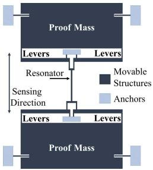
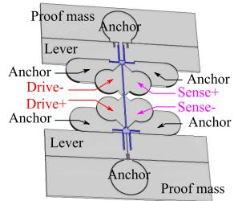
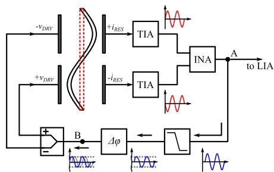
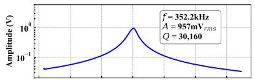
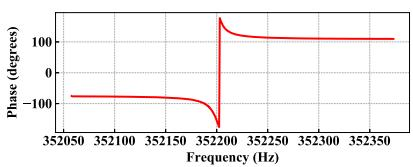
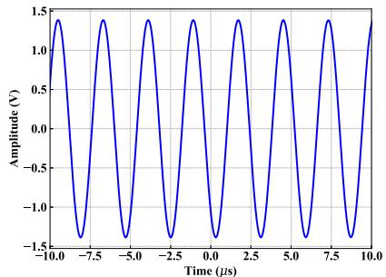
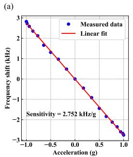
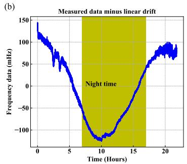
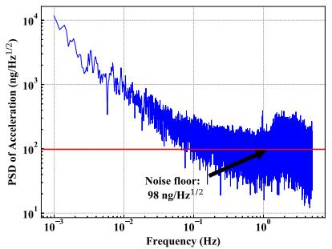
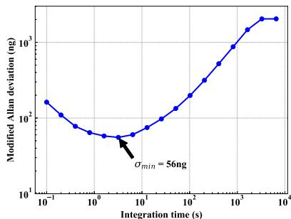

# A Resonant MEMS Accelerometer With 56ng Bias Stability and $98\mathrm{ng / Hz}^{1 / 2}$ Noise Floor

Chun Zhao, Milind Pandit, Student Member, IEEE, Guillermo Sobreviela, Philipp Steinmann, Arif Mustafazade, Xudong Zou, Member, IEEE, and Ashwin Seshia, Senior Member, IEEE

Abstract—This letter presents a high-performance resonant MEMS accelerometer comprising of a single force-sensitive vibrating beam element sandwiched between two inertial masses. The accelerometer demonstrates a noise floor of $98\mathrm{ng / Hz}^{1 / 2}$ and a bias stability of $56~\mathrm{ng}$ under ambient conditions, corresponding to a frequency noise floor of $0.77~\mathrm{ppb / Hz}^{1 / 2}$ and a frequency bias stability of $0.43~\mathrm{ppb}$ . These are the best results achieved for a MEMS accelerometer employing the resonant sensing paradigm to-date. [2018-0255]

Index Terms—MEMS resonant accelerometer, noise floor, bias stability.

# I. INTRODUCTION

HIG-HPERFORMANCE MEMS accelerometers have a number of potential applications, including inertial navigation [1], seismometry [2], and gravimetry [3]. Silicon MEMS resonant accelerometers have been researched for several decades in this context [4]–[8]. As opposed to more common capacitive techniques, resonant sensing methodologies provide the potential for excellent near-DC measurements of inertial forces, supported by the recent advances in wafer-level vacuum packaging and temperature compensation for MEMS resonators [9]. However, the reported practical performance of resonant MEMS accelerometers has not substantially advanced the stabilities reported for capacitive sensing to-date.

This letter reports a distinctive topology for a resonant MEMS accelerometer, comprising of a single resonant detector beam, sandwiched between two inertial masses. Results of measurements conducted on a vacuum-packaged MEMS device demonstrate a bias stability of $56\mathrm{ng}$ and a noise floor of $98\mathrm{ng / Hz}^{1 / 2}$ .

# II. DESIGN CONSIDERATIONS

# A. MEMS Resonator Design

A schematic view of the silicon MEMS device is shown in Fig. 1a. The device consists of two suspended silicon proof masses linked via an arrangement of force-amplifying levers to a single vibrating resonator beam. The single-beam sensing resonator (length is $700\mu \mathrm{m}$ , width is $7\mu \mathrm{m}$ , thickness is $40\mu \mathrm{m}$ ) is manufactured within the device

Manuscript received October 26, 2018; revised January 27, 2019; accepted March 30, 2019. Date of publication April 16, 2019; date of current version May 31, 2019. This work was supported in part by Innovate U.K. and in part by the Natural Environment Research Council, U.K. Subject Editor A. M. Shkel. (Corresponding author: Chun Zhao.)

C. Zhao, M. Pandit, G. Sobreviela, and A. Seshia are with The Nanoscience Centre, University of Cambridge, Cambridge CB3 0FF, U.K. (e-mail: chun_zhao@hust.edu.cn).

P. Steinmann and A. Mustafazade are with the Silicon Microgravity Ltd., Cambridge Innovation Park, Cambridge CB25 9PB, U.K.

X. Zou is with the State Key Laboratory of Transducer Technology, Institute of Electronics, Chinese Academy of Sciences, Beijing 100190, China, and also with the School of Electronics, Electrical and Communication Engineering, University of Chinese Academy of Sciences, Beijing 100190, China.

Color versions of one or more of the figures in this paper are available online at http://ieeexplore.ieee.org.

Digital Object Identifier 10.1109/JMEMS.2019.2908931

  
(a)

  
(b)

  
(c)   
Fig. 1. Overview of the MEMS accelerometer and schematics of front-end: (a) Schematics of the resonant accelerometer, (b) detailed 3D schematics of the sensing resonator (resonator beam highlighted in blue) and (c) oscillator electronics, the TIA has a gain of $4.5\mathrm{M}\Omega$ and the INA has a gain of 10.

layer of a SOI wafer [10]. The estimated thermo-mechanical noise limited resolution is approximately $50\mathrm{ng} / \sqrt{\mathrm{Hz}}$ . Two inverting and matched levers are connected to both sides of the resonator, which are designed to amplify the inertial forces, and exert equal and opposing forces axially onto the resonator beam. The beam is driven in the second lateral transverse mode, schematically illustrated in Fig. 1c. The advantages using the second mode include: (1) implementation of a differential drive/sense configuration; (2) higher sensitivity and (3) higher critical linear amplitude. However, the Q-factor of the second mode ( $\sim 30,000$ ) is lower than that of the first mode ( $\sim 45,000$ ). The entire device is vacuum packaged at the wafer-level.

A particular feature of this design is the single resonator differential sensing scheme. Typical differential designs have two resonators placed on two ends of the proof mass [10]. However, this could potentially result in the two resonators being mechanically coupled, potentially limiting operation, particularly when the resonant frequencies are very closely matched. With the single resonator design with inverting levers, this issue does not exist and hence issues relating to oscillator cross-talk or undesired locking are avoided.

# B. Low Noise Electronics Design

A differential drive/sense approach is used to optimize the signal-to-noise ratio, and suppress common mode signals. The electronics

  
Fig. 2. Measured open-loop response of the resonant sensing element, with drive signal applied at node B and output measured at node A (both nodes are shown in Fig. 1c).

  
Fig. 3. Measured steady-state closed loop response of the oscillator front-end for the resonant accelerometer, showing an amplitude of $979\mathrm{mV}_{\mathrm{rms}}$ $(2.77\mathrm{V}_{\mathrm{p - p}})$ .

for the MEMS resonant accelerometer consists of two major parts: (1) the front-end amplifier, which is a transimpedance amplifier (TIA); and (2) the feedback electronics consisting of a soft-limiter and phase shifter. The schematics is shown in Fig. 1c. A discrete-JFET-based TIA is employed here mainly because of its low noise. However, JFET-based TIA has a higher temperature dependence than integrated op-amps, which contributes to temperature induced frequency swings. The soft-limiter is employed here also because of its low noise, whereas the main disadvantage is the temperature dependence of the diodes. A phase shifter is employed to compensate the inevitable phase modifications in the previous stages.

# III. MEASUREMENT RESULTS

# A. Open-Loop Measurement

The open-loop frequency response of the sensing resonator at the output is shown in Fig. 2. The extracted Q-factor of the resonator is approximately 30, 160. With a differential drive of $10\mathrm{mV}_{\mathrm{p - p}}$ , the resonator output response is linear with a measured amplitude of $957\mathrm{mV}_{\mathrm{rms}}$ . From the open-loop response shown in Fig. 2, which can be fitted to a Lorentzian function, the resonator can be considered as operating in its linear regime. The nominal $0\mathrm{g}$ value of the resonance frequency is $352.2\mathrm{kHz}$ .

# B. Closed-Loop Measurements

1) Linear Resonator Verification: The closed-loop measurement setup is shown in Fig. 1c. The loop phase is calibrated using the phase shifter, while ensuring that the Barkhausen phase criteria is satisfied. The output waveform measured at node A using the closed-loop configuration is shown in Fig. 3, consistent with driving the resonator in the linear regime.   
2) Scale Factor: The scale factor of the SADM sensor is measured using a standard tilt test with the closed-loop configuration [11]. A scale factor of $2752\mathrm{Hz / g}$ is extracted (see Fig. 4(a)). The sensor is placed in the lab for approximately 24 hours, covering noisy day

  
Fig. 4. (a) Measured scale factor of the SADM accelerometer is $2752\mathrm{Hz / g}$ ; (b) the sensor response over approximately 24 hours, after eliminating the linear drift.

  
Fig. 5. Processed power spectral density (PSD) of the acceleration from the measurement data.

times (white areas) and relatively quieter hours in the night (yellow shaded area, from approximately 22:30 - 7:30 next day). It can be clearly seen that the ambient vibrations (e.g. human activities) are picked up during the day, showing the operation of the sensor (see Fig. 4(b)). The large frequency swings during the measurement hours is likely due to the ambient temperature fluctuations, which affect both the resonator and the electronics, and the total sensitivity to the temperature is approximately $-14.8\mathrm{Hz / K}$ $(-42\mathrm{ppm / K})$

3) Noise Floor Analysis: The signal at node A (the waveform of which is shown in Fig. 3) is measured using a Zurich Instruments lock-in amplifier (LIA). The frequency measurement is performed using the PLL function of the LIA with a measurement bandwidth of $5\mathrm{Hz}$ , filtering the undesired components outside of the measurement bandwidth. Using fast-Fourier transform (FFT), the measured data obtained overnight can be further processed, revealing an acceleration noise floor of $98\mathrm{ng / Hz}^{1 / 2}$ (equivalent to $270\mu \mathrm{Hz / Hz}^{1 / 2}$ in frequency, or $0.77\mathrm{ppb / Hz}^{1 / 2}$ in normalized frequency). This is by far the lowest noise floor reported to-date for MEMS resonant accelerometers. The bump in the PSD between $1.5 - 4\mathrm{Hz}$ is likely due to the vibration caused by the equipment in operation in a lab nearby, showing the operation of the sensor. The improvement in noise performance is mainly due to noise optimized electronics and higher scale factor of the accelerometer. Potentially the noise floor can be further improved by operating the sensor in a low ambient vibration environment.   
4) Bias Stability: Modified Allan deviation of the same data is processed, and an input bias stability of 56ng (equivalent to $153\mu \mathrm{Hz}$ , or 0.43ppb) at 3.2s integration time has been achieved. This is also by far the best bias stability reported to-date in resonant MEMS accelerometers. However, further improvement can be achieved, as it is likely that ambient environment related effects (e.g. temperature change induced Young's modulus variations, as well as its effect on the electronics) dominate the long term frequency stability. Therefore, bias drift can be further enhanced

  
Fig. 6. Modified Allan Deviation for the accelerometer for an overnight experiment.

TABLEI COMPARISONS OF NOISE FLOOR AND BIAS STABILITY   

<table><tr><td>Work</td><td>Noise floor (ng/Hz1/2)</td><td>Bias stability (ng)</td></tr><tr><td>[7]</td><td>1000</td><td>230</td></tr><tr><td>[12]</td><td>N/A</td><td>160</td></tr><tr><td>[10]</td><td>150</td><td>N/A</td></tr><tr><td>[8]</td><td>380</td><td>95</td></tr><tr><td>This work</td><td>98</td><td>56</td></tr></table>

by implementing suitable temperature control and compensation techniques.

# IV. CONCLUSION

In this work, a high performance resonant accelerometer with a single sensing element is presented. A noise floor of $98\mathrm{ng / Hz}^{1 / 2}$ and a bias stability of $56\mathrm{ng}$ is achieved, representing the best results obtained by using a MEMS resonant accelerometer. Further work should focus on designing high performance chip level and board level temperature controllers to minimize the temperature effect on the device, as well as the electronics.

# REFERENCES

[1] P. Zwahlen, A.-M. Nguyen, Y. Dong, F. Rudolf, M. Pastre, and H. Schmid, "Navigation grade MEMS accelerometer," in Proc. IEEE 23rd Int. Conf. Micro Electro Mech. Syst. (MEMS), Sep. 2010, pp. 631-634.   
[2] W. T. Pike, I. M. Standley, S. B. Calcutt, and A. G. Mukherjee, "A broadband silicon microseismometer with $0.25\mathrm{ng}$ rthz performance," in Proc. IEEE Micro Electro Mech. Syst. (MEMS), Jan. 2018, pp. 113-116.   
[3] R. Middlemiss, A. Samarelli, D. Paul, J. Hough, S. Rowan, and G. Hammond, "Measurement of the earth tides with a mems gravimeter," Nature, vol. 531, no. 7596, p. 614, Mar. 2016.   
[4] A. A. Seshia et al., "A vacuum packaged surface micromachined resonant accelerometer," J. Microelectromech. Syst., vol. 11, no. 6, pp. 784-793, Dec. 2002.   
[5] C. Comi, A. Corigliano, G. Langfelder, A. Longoni, A. Tocchio, and B. Simoni, "A resonant microaccelerometer with high sensitivity operating in an oscillating circuit," J. Microelectromech. Syst., vol. 19, no. 5, pp. 1140-1152, Oct. 2010.   
[6] X. Zou, P. Thiruvenkatanathan, and A. A. Seshia, “A seismic-grade resonant MEMS accelerometer,” J. Microelectromech. Syst., vol. 23, no. 4, pp. 768-770, Aug. 2014.   
[7] J. Zhao et al., "A $0.23\mu \mathrm{g}$ bias instability and $1\mu \mathrm{g} / \mathrm{hz}^{1} / 2$ acceleration noise density silicon oscillating accelerometer with embedded frequency-to-digital converter in pll," IEEE J. Solid-State Circuits, vol. 52, no. 4, pp. 1053-1065, Sep. 2017.   
[8] Y. Yin, Z. Fang, F. Han, B. Yan, J. Dong, and Q. Wu, "Design and test of a micromachined resonant accelerometer with high scale factor and low noise," Sens. Actuators A, Phys., vol. 268, pp. 52-60, Dec. 2017.   
[9] M. H. Roshan et al., "A mems-assisted temperature sensor with $20 - \mu k$ resolution, conversion rate of $200~\mathrm{s / s}$ , and fom of $0.04\mathrm{pjk}^2$ ," IEEE J. Solid-State Circuits, vol. 52, no. 1, pp. 185-197, Sep. 2017.   
[10] X. Zou and A. A. Seshia, “A high-resolution resonant mems accelerometer,” in Proc. 18th Int. Conf. Solid-State Sensors, Actuat. Microsyst., Jun. 2015, pp. 1247–1250.   
[11] X. Zou, P. Thiruvenkatanathan, and A. A. Seshia, “A high-resolution micro-electro-mechanical resonant tilt sensor,” Sens. Actuators A, Phys., vol. 220, pp. 168–177, Jun. 2014.   
[12] D. D. Shin, C. H. Ahn, Y. Chen, D. L. Christensen, I. B. Flader, and T. W. Kenny, "Environmentally robust differential resonant accelerometer in a wafer-scale encapsulation process," in Proc. IEEE 30th Int. Conf. Micro Electro Mech. Syst. (MEMS), Jan. 2017, pp. 17-20.