# A Resonant Microaccelerometer With High Sensitivity Operating in an Oscillating Circuit

Claudia Comi, Alberto Corigliano, Giacomo Langfelder, Antonio Longoni, Alessandro Tocchio, and Barbara Simoni

Abstract—A new micromachined uniaxial silicon resonant accelerometer characterized by a high sensitivity and very small dimensions is presented. The device's working principle is based on the frequency variations of two resonating beams coupled to a proof mass. Under an external acceleration, the movement of the proof mass causes an axial load on the beams, generating opposite stiffness variations, which, in turn, result in a differential separation of their resonance frequencies. A high level of sensitivity is obtained, owing to an innovative and optimized geometrical design of the device that guarantees a great amplification of the axial loads. The acceleration measure is obtained, owing to a properly designed oscillating circuit. In agreement with the theoretical prediction, the experimental results show a sensitivity of $455\mathrm{Hz} / g$ ( $g$ being the gravity acceleration) with a resonant frequency of about $58\mathrm{kHz}$ and a good linearity in the range of interest. [2010-0035]

Index Terms—High sensitivity, oscillating circuit, resonant accelerometers.

# I. INTRODUCTION

THIS PAPER gives a complete description of the work briefly presented in [1].

Micromachined silicon accelerometers have many applications nowadays particularly in the fields of automotive and consumer electronics [2], [3]. In its basic scheme, a microelectromechanical-system (MEMS) accelerometer is simply constituted by a suspended proof mass and by a suitable sensing system, integrated on the same silicon chip. If the frequency of the external acceleration is well below the resonance frequency of the proof mass, the mass displacement can be considered to be directly proportional to the acceleration and the sensing system can thus be implemented to measure this displacement, e.g., via a capacitance variation as in capacitive accelerometers [4].

In resonant accelerometers instead, the inertial force induced by the external acceleration on the proof mass generates axial forces in resonating parts of the sensing system coupled to the proof mass; these forces produce a shift of the resonant frequency which can be measured. As reported in the literature

Manuscript received February 11, 2010; revised July 14, 2010; accepted July 22, 2010. Date of publication September 15, 2010; date of current version October 1, 2010. Subject Editor C. Hierold.

C. Comi and A. Corigliano are with the Department of Structural Engineering, Politecnico di Milano, 20133 Milan, Italy (e-mail: alberto.corigliano@polimi.it).

G. Langfelder, A. Longoni, and A. Tocchio are with the Department of Electronics and Information Technology, Politecnico di Milano, 20133 Milan, Italy.

B. Simoni is with the MEMS, Sensors and High Performance Analog (MSH) Division, STMicroelectronics, 2010 Cornaredo, Milan, Italy.

Color versions of one or more of the figures in this paper are available online at http://ieeexplore.ieee.org.

Digital Object Identifier 10.1109/JMEMS.2010.2067437

[5]–[13], MEMS resonant accelerometers have the advantage, with respect to capacitive accelerometers, of being immune to pull-in instability caused by large external accelerations (e.g., in accidental drop events).

The sensitivity of MEMS resonant accelerometers obtained through surface micromachining reported in the literature [7], [8], [12] is of some tens of hertz per $g$ unit of acceleration up to $160\mathrm{Hz / g}$ for the quite large accelerometer proposed in [11], with nominal frequencies of the resonating part on the order of $10^{2}\mathrm{kHz}$ .

The purpose of this paper is to describe in detail the uniaxial resonant accelerometer recently presented in [14] and also discussed, together with preliminary experimental results, in [1] and [15]. The new device has been designed, realized, and coupled with an oscillating circuit conceived after the careful definition of an equivalent $RLC$ circuit for the resonating part. The inertial sensing element is a square proof mass $(400\mu \mathrm{m}\times 400\mu \mathrm{m})$ suspended by springs and linked to two beams, which constitute the resonating elements. The device has been produced through the $15 - \mu \mathrm{m}$ -thick surface micromachining ThELMA process from STMicroelectronics [16].

The design of the new device was conceived for an application range target of a few $g$ units of external acceleration; the mechanical behavior was optimized through a carefully chosen geometrical configuration in order to maximize the sensitivity by keeping the occupied surface very small (approximately $500\mu \mathrm{m}\times 500\mu \mathrm{m}$ in total). The obtained sensitivity performance is close to $455\mathrm{Hz / g}$ around a central frequency of $\sim 58\mathrm{kHz}$ at an initial packaging pressure approximately equal to 1 mbar and an initial quality factor around 200, considerably lower than values reported in less sensitive devices [7], [8]. The normalized sensitivity, defined as the ratio between the frequency variation under $1g$ of external acceleration and the resonant frequency, approaches the $1\%$ and is thus considerably larger than those in previous works.

With respect to the mentioned brief and preliminary conference presentations [1], [14], [15] of the new device, this paper contains, in addition, a more complete description of the design conception; a new discussion concerning the nonlinear regime and its consequence on the mechanical and electronic design, coupled with new experimental results obtained in the linear and nonlinear regimes; the description of the oscillating circuit used for the experimental verification of the accelerometer performances in the $\pm 1 - g$ range; and the resolution measure.

This paper is organized as follows. Section II presents the device working principle together with a complete mechanical model extended to the nonlinear range which sets the design constraints. Section III briefly describes the realized device

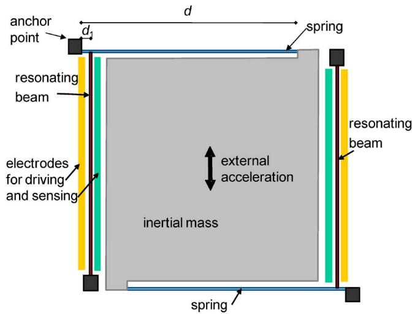  
(a)

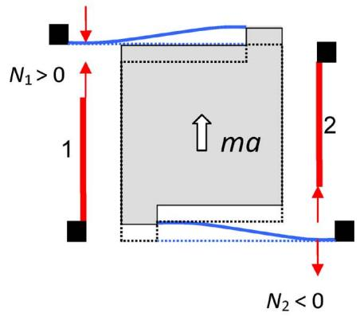  
(b)   
Fig. 1. (a) Scheme of the new resonant accelerometer. (b) Effect of external acceleration $a$ .

and the surface micromachining process. In Section IV, an equivalent electrical model for the device sensitive elements and a first mechanical characterization are presented. Section V describes the details of the implemented oscillating circuit and presents the experimental results, a comparison of the present work with previously reported resonant accelerometers, and the measured resolution data. Closing remarks and work in progress are discussed in Section VI.

# II. DEVICE DESIGN

# A. Device Architecture

The resonant uniaxial accelerometer reported in this paper is schematically shown in Fig. 1(a). It is composed of a movable inertial mass and two resonating beams. The proof mass is attached to the substrate by means of springs of length $d$ which restrain its movement to be a uniaxial translation. The resonators are very thin beams attached to the substrate at one end and to the springs at the other end at distance $d_{1}$ from the anchor point, as shown in Fig. 1(a). The electrostatic driving and sensing of each resonator can be done by means of two parallel electrodes attached to the substrate. The gap distance between the beam and the parallel plates is $2.1\mu \mathrm{m}$ .

In the absence of external acceleration, the resonators have the same nominal frequency $f_{0}$ . When the reference frame is subject to an external acceleration $a$ in the direction indicated by the arrow in Fig. 1(a), the inertial mass $m$ translates and one resonator (for example, resonator 1) is subject to a tension and the other (for example, resonator 2) to a compression of the same magnitude $N_{1} = -N_{2}$ , as shown in Fig. 1(b). The axial forces produce a change of the resonance frequency of the two beams which can be measured and related to the external acceleration. The sensitivity of this device, defined as the resonator frequency variation produced by an acceleration of $1\mathrm{g}$ , increases with the dimension of the moving mass but also strongly depends on the position of the resonating beams with respect to the anchor point of the spring. In order to reduce the device's size while keeping a high sensitivity, this position was optimized by means of an analytical approach.

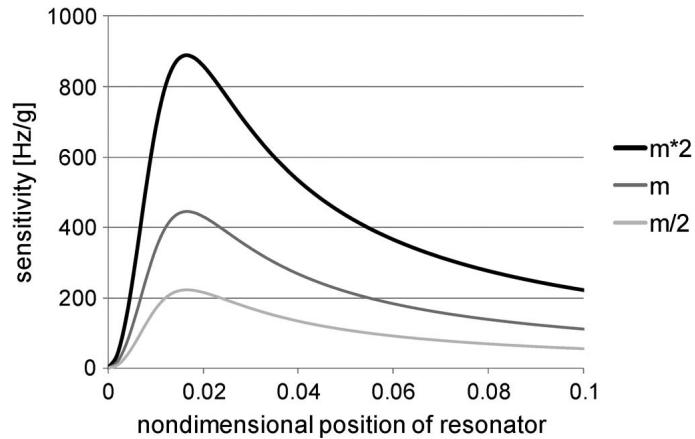  
Fig. 2. Calculated sensitivity of the accelerometer in terms of frequency variation as a function of the resonator position $d_{1} / d$ . The different curves correspond to the actual mass $m$ of the fabricated accelerometer and to twice and half of this value. The spring and resonator lengths and widths are kept to the design value.

Fig. 2 shows the sensitivity of the accelerometer [see Section II-B, (12)] as a function of the position of the resonator along the spring $[d_{1}$ in Fig. 1(a)] normalized with respect to the spring length. The plots were obtained by introducing in the sensitivity relation discussed in Section II-B the value of axial forces in the resonating beams computed by applying the inertial force due to the external acceleration as input in a mechanical scheme of the device based on beam theory. From Fig. 2, one can observe that the optimal position for the resonator is very close to the anchor point of the spring at about one-sixtieth of its length. The various curves correspond to different values of the inertial mass, the intermediate one corresponding to the mass of the fabricated accelerometer; the lengths of the resonators $(L)$ and of the springs $(d)$ are kept fixed to the design value $(L = d = 400\mu \mathrm{m})$

For the actual accelerometer response, the quantity of main interest is the normalized sensitivity, i.e., the ratio between the sensitivity and the resonator frequency $f_{0}$ . For the fabricated device $f_{0} \approx 58\mathrm{kHz}$ , therefore, a normalized sensitivity of $0.8\%$ per $g$ is expected. For comparison, devices previously presented

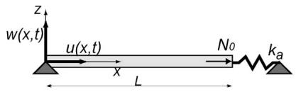  
Fig. 3. Scheme of the vibrating beam.

in the scientific literature reported normalized sensitivities lower than $0.13\%$ .

# B. Resonating-Beam Model

In this section, a mathematical model of the resonator response including nonlinear effects is developed in order to obtain the device sensitivity to external accelerations and to predict the range of linearity of the device response.

The resonator's response can be computed considering the nonlinear flexural oscillations of axially loaded slender elastic beams. Consider to this purpose a beam with cross section $A$ , area moment of inertia $I$ , length $L$ , density $\rho$ , and Young's modulus $E$ and let the transversal displacement of the beam axis be described by $w(x,t)$ , with $x$ being the coordinate along the beam axis and $t$ the time. The beam is axially constrained at both ends, possibly with elastic constraints represented by an axial spring of stiffness $k_{a}$ at one end (see Fig. 3), and is subject to an initial constant axial load $N_{0}$ , to an external damping force per unit length $bw$ , and to a transversal distributed dynamic electrical load $q$ , which is a function of the transverse displacement $w$ . As usually done for capacitive resonators, a linear approximation of this force is first assumed

$$
q (w) = \bar {q} + \bar {k} _ {e} w, \quad \text {w i t h} \bar {q} = q | _ {w = 0}; \bar {k} _ {e} = \left. \frac {d q}{d w} \right| _ {w = 0}. \tag {1}
$$

The model adopted for the description of the dynamic response of the beam is restricted by several hypotheses: 1) The beam is modeled by the Euler-Bernoulli theory; 2) variation of the cross section during vibration is neglected; 3) stretching of the beam is small but finite; and 4) inertial effects in the axial direction are neglected (see, e.g., [17] for details). With the aforementioned hypotheses, the following nonlinear equation for the transverse beam oscillation is obtained:

$$
\begin{array}{l} \rho A \ddot {w} + b \dot {w} + (E I w ^ {\prime \prime}) ^ {\prime \prime} - N _ {0} w ^ {\prime \prime} \\ - \frac {k _ {a} E A}{k _ {a} L + E A} w ^ {\prime \prime} \int_ {0} ^ {L} \frac {1}{2} \left(w ^ {\prime}\right) ^ {2} d x = q (w). \tag {2} \\ \end{array}
$$

If the axial elongation is not constrained and considering free undamped oscillations $(q = 0, b = 0)$ , the governing differential equation for the transverse displacement simplifies to

$$
\rho A \ddot {w} + \left(E I w ^ {\prime \prime}\right) ^ {\prime \prime} - N _ {0} w ^ {\prime \prime} = 0. \tag {3}
$$

This latter equation has been widely studied in the literature, and several solutions are available. The presence of a constant axial load $N_{0}$ changes the natural frequencies of the beam oscillation. For a single-span beam, frequencies increase in the case of a tensile load and decrease in the case of a compressive load.

TABLEI COEFFICIENTS $c$ AND $\alpha$ FOR SINGLE-SPAN BEAMS WITH DIFFERENT BOUNDARY CONDITIONS   

<table><tr><td></td><td>c</td><td>α</td></tr><tr><td>clamped-free</td><td>1.875</td><td>0.376</td></tr><tr><td>sliding-pinned</td><td>1.572</td><td>0.405</td></tr><tr><td>pinned-pinned</td><td>3.142</td><td>0.101</td></tr><tr><td>sliding-sliding</td><td>3.142</td><td>0.101</td></tr><tr><td>clamped-clamped</td><td>4.730</td><td>0.0246</td></tr></table>

By denoting the fundamental frequency of the beam resonating without axial load by $f_{0}$ , the resonant frequency $f$ of the axially loaded beam can be expressed as (cf., e.g., [10], [18], and [19])

$$
f = f _ {0} \sqrt {1 + \alpha \frac {N _ {0} L ^ {2}}{E I}}, \quad \text {w i t h} f _ {0} = \frac {c ^ {2}}{2 \pi L ^ {2}} \sqrt {\frac {E I}{\rho A}} \tag {4}
$$

where $c$ and $\alpha$ are coefficients depending on the boundary conditions of the resonator. Table I collects their values for several boundary conditions.

Equation (3) and, hence, (4) can also be used for axially constrained beams if transverse oscillations can be considered small with respect to the beam thickness in direction $z$ (Fig. 3). This hypothesis, which is often reasonable for structural problems at the macroscale, usually does not hold for microstructures as those of MEMS resonators. In this case, the complete equation (2) and the associated boundary conditions should be considered. Approximate solutions can be found following the Rayleigh method. For the electrical load expressed by relation (1), the solution is searched in the form

$$
w (x, t) = \psi (x) Z (t) \tag {5}
$$

with $\psi(x)$ being the eigenfunction of the same problem without second-order effects and $Z(t)$ being the generalized coordinate. Using the Hamilton's principle, one obtains the following equation of motion (see also [20] for more details):

$$
M \ddot {Z} + B \dot {Z} + k _ {1} Z + k _ {3} Z ^ {3} = F \tag {6}
$$

with

$$
M = \int_ {0} ^ {L} \rho A \psi^ {2} d x
$$

$$
B = \int_ {0} ^ {L} b \psi^ {2} d x
$$

$$
\begin{array}{l} k _ {1} = k _ {m} - k _ {e} + k _ {G}, \\ k _ {m} = \int_ {0} ^ {L} E I (\psi^ {\prime \prime}) ^ {2} d x, k _ {e} = \bar {k} _ {e} \int_ {0} ^ {L} \psi^ {2} d x; k _ {G} = N _ {0} \int_ {0} ^ {L} (\psi^ {\prime}) ^ {2} d x \\ \end{array}
$$

$$
\begin{array}{l} k _ {3} = \frac {k _ {a} E A}{2 (k _ {a} L + E A)} \int_ {0} ^ {L} (\psi^ {\prime}) ^ {2} d x \int_ {0} ^ {L} (\psi^ {\prime}) ^ {2} d x \\ F = \int_ {0} ^ {L} \bar {q} \psi d x. \tag {7} \\ \end{array}
$$

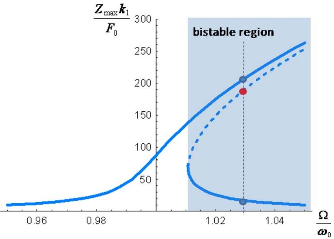  
Fig. 4. Forced frequency response of a nonlinear oscillator: normalized dynamic amplification factor versus normalized frequency.

Equation (6) is known as the Duffing's oscillator equation for a single-degree-of-freedom system, $M$ is the equivalent mass, $B$ is the equivalent damping coefficient, $k_{m}$ is the equivalent linear elastic flexural stiffness, $k_{e}$ is the equivalent electric stiffness, $k_{G}$ is the generalized geometric stiffness due to a constant initial axial load, $k_{3}$ is the cubic nonlinear constant, and $F$ is the equivalent force. For the problem under consideration, i.e., that of nonlinear oscillations of a single-span beam, the $k_{3}$ given in (7) is always positive (hard spring effect). Unlike the linear oscillator, the fundamental circular frequency of the Duffing's oscillator depends on the oscillation amplitude $Z_{\mathrm{max}}$ and is expressed by

$$
\omega = \omega_ {0} \left(1 + \frac {3}{8} \frac {k _ {3}}{k _ {1}} Z _ {\max } ^ {2}\right) \tag {8}
$$

where $\omega_0$ is the natural circular frequency of the linear oscillator.

For a harmonic driving force $F = F_{0}\cos \Omega t$ with circular frequency $\Omega$ close to the natural frequency, one obtains a relation between $F_{0},\Omega$ , and the amplitude $Z_{\mathrm{max}}$ of the beam oscillation

$$
\left(\frac {F _ {0}}{k _ {1}}\right) ^ {2} = \left(2 \left(1 - \frac {\Omega}{\omega_ {0}}\right) Z _ {\max } + \frac {3}{4} \frac {k _ {3}}{k _ {1}} Z _ {\max } ^ {3}\right) ^ {2} + \left(\frac {B}{M \omega_ {0}} Z _ {\max }\right) ^ {2}. \tag {9}
$$

With $k_{3} > 0$ , the resonance curve is bent toward the high frequencies, the response of the system to applied forces becomes a multivalued function of the frequency, and hysteresis phenomena can be observed. Fig. 4 shows the solution of (9), with $B = 0$ , in terms of the dynamic amplification factor $Z_{\mathrm{max}} / (F_0 / k_1)$ versus the ratio $\Omega /\omega_0$ .

Even though the resonators designed for the accelerometer are very thin and large displacements are expected, their peculiar geometry, and particularly the fact that they are clamped to the spring instead of clamped to the support at one end, allows one to reduce the nonlinearity considerably due to the second-order effects described previously. Indeed, unlike in the standard doubly clamped resonators [“I-shaped” resonator of Fig. 5(a)], the proposed “L-shaped” resonators of Fig. 5(b) have

a small horizontal arm which can be bent, thus reducing the axial constraint of the resonator. This effect can be included in the present formulation by a suitable value of the axial spring stiffness $k_{a}$ . Fig. 5(c) compares the resonant frequencies of the two geometries. One can observe that, for the "L-shaped" resonator, the nonlinear behavior is considerably reduced, and therefore, one could expect an almost linear behavior in a larger range of external excitations.

It should be remarked that, in the microresonators with electrostatic actuation, another source of nonlinearity is due to the electrical loading nonlinearity [21] which can reduce the value of $k_{3}$ . To account for this effect, one should consider additional terms in (1), i.e.,

$$
\begin{array}{l} q (w) = \bar {q} + \bar {k} _ {e} w + \bar {k} _ {e _ {2}} w ^ {2} + \bar {k} _ {e _ {3}} w ^ {3}, \\ \left. \bar {k} _ {e _ {2}} = \frac {1}{2} \frac {d ^ {2} q}{d w ^ {2}} \right| _ {w = 0}; \bar {k} _ {e _ {3}} = \left. \frac {1}{6} \frac {d ^ {3} q}{d w ^ {3}} \right| _ {w = 0}. \tag {10} \\ \end{array}
$$

For the present case, $\bar{k}_{e_2}$ is negligible in the considered range of actuation voltage. The last contribution depends on the polarization voltage and leads to a small correction $k_{e_3}$ to the cubic nonlinear constant of the Duffing's oscillator

$$
k _ {e _ {3}} = \bar {k} _ {e _ {3}} \int_ {0} ^ {L} \psi^ {4} (x) d x. \tag {11}
$$

However, the sensor proposed is actuated in the linear regime, where relation (4) holds. When an external acceleration is applied, combining the signal of the two resonators, from (4) linearized around $f_{0}$ , one obtains the following frequency difference:

$$
f _ {1} - f _ {2} \cong f _ {0} \left(1 + \alpha \frac {N L ^ {2}}{2 E I} - 1 - \alpha \frac {- N L ^ {2}}{2 E I}\right) = f _ {0} \alpha \frac {N L ^ {2}}{E I}. \tag {12}
$$

Since $N$ is proportional to the external acceleration, from the measure of $f_{1} - f_{2}$ , one can obtain the acceleration value. The presence of two resonators undergoing opposite axial forces has several advantages: 1) the sensitivity can be doubled by measuring the difference between the frequency of the two resonators instead of the variation of frequency of one resonator; 2) the linearity of the system is improved, i.e., the accelerometer response can be linearized in a wider range of accelerations; and 3) the skew-symmetric geometry is less sensitive to spurious effects of thermal loading; in fact, an inelastic effect causing prestress in the resonators is canceled when considering the difference between the frequencies.

# III. DEVICE FABRICATION

The designed accelerometer has been produced with the surface micromachining process ThELMA which has been developed by STMicroelectronics to realize silicon inertial sensors and actuators.

The ThELMA process permits the realization of suspended structures with a relatively large thickness $(15\mu \mathrm{m})$ anchored to the substrate through very compliant parts (springs) and,

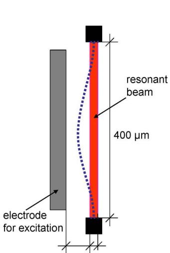  
(a)

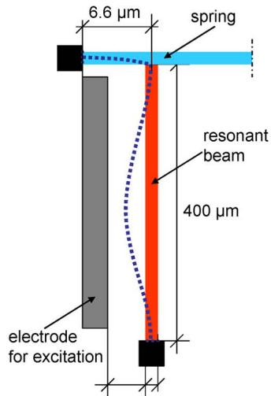  
(b)

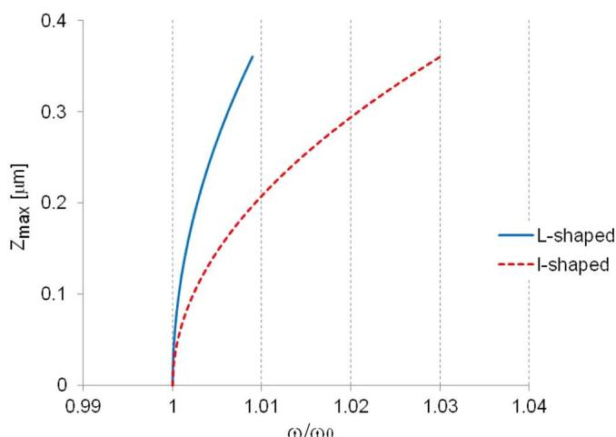  
(c)

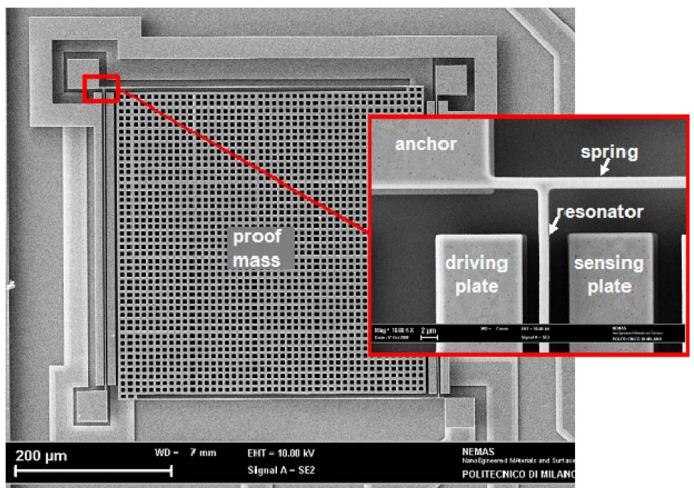  
Fig. 5. (a) Standard doubly clamped resonator (I-shaped). (b) Present resonator attached at one end to the spring (L-shaped, nominal design dimensions). (c) Second-order effects in the I- and L-shaped resonators on the frequency.   
Fig. 6. SEM image of the resonant accelerometer with a detail of the resonator end constrained to the spring suspending the seismic mass.

thus, capable of moving with respect to the underlying silicon substrate, such as the accelerometer described in Section II. The process consists of the following several phases: 1) substrate thermal oxidation; 2) deposition and patterning of horizontal interconnections; 3) deposition and patterning of a sacrificial layer; 4) epitaxial growth of the structural layer (15-μm-thick polysilicon); 5) structural layer patterning by trench etch; and 6) sacrificial oxide removal and contact metallization deposition (see [16] for more details).

The produced accelerometer is shown in the SEM micrograph in Fig. 6. The very thin resonating beams are visible on the right and left of the proof mass in the vertical direction between the sensing and excitation electrodes. The square inertial mass has holes to allow the complete oxide removal below it. The close-up in Fig. 6 shows a detailed view of the anchor point of the (horizontal) spring and the connection with the (vertical) resonator. The upper parts of the electrodes are also visible.

The accelerometers are packed at low pressure (1 mbar) with a higher velocity to maintain degassing in the MEMS cavity, thus limiting

fluid damping and ensuring a reasonably high quality factor on the order of 200.

# IV. EXPERIMENTAL CHARACTERIZATION OF THE RESONATORS

# A. Equivalent Electrical Model

In this section, an equivalent electrical model is presented, which is useful to describe the mechanical behavior of the resonating beam inside an electronic circuit. It is known from the literature [22], [23] that micromechanical resonators can be modeled through equivalent second-order $RLC$ circuits. A simple way to demonstrate this mechanical-electrical analogy is described here.

Fig. 7 shows a schematic illustration of one sensitive element of the resonant accelerometer: the L-shaped resonating beam, together with the driving and sensing electrodes [see Fig. 5(b)]. The electrodes are considered in their operating condition, with a constant polarization voltage $V_{p}$ applied to the central beam, with an ac voltage $v_{a}(t)$ of amplitude $v_{a}$ applied to the driving electrode, and with the sensing electrode held at a fixed potential by means of a virtual ground.

In this configuration, the electrostatic force per unit length acting on a generic point of the central beam is

$$
q (w) = \frac {1}{2} \frac {d C _ {a}}{d w} \left(V _ {p} - v _ {a}\right) ^ {2} + \frac {1}{2} \frac {d C _ {s}}{d w} V _ {p} ^ {2} \tag {13}
$$

where $C_a$ and $C_s$ are the parallel-plate capacitances per unit length formed by the driving and sensing electrodes with the central beam and $w = w(x, t)$ is the displacement of the moving beam. Denoting the vacuum permittivity by $\varepsilon_0$ , the out-of-plane thickness of the resonator by $s$ , and the gap between the central beam and the electrodes at the rest position by $d$ , the capacitances read

$$
C _ {a} = \frac {\varepsilon_ {0} s}{d + w} \quad C _ {s} = \frac {\varepsilon_ {0} s}{d - w}. \tag {14}
$$

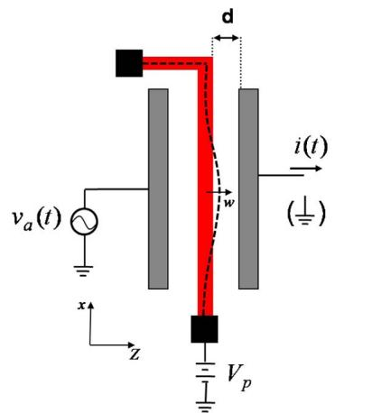  
(a)

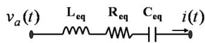  
(b)   
Fig. 7. Simplified electrical model for the resonator.

$$
L _ {e q} = \frac {M}{\eta^ {2}} \quad C _ {e q} = \frac {\eta^ {2}}{k _ {1}}
$$

$$
R _ {e q} = \frac {B}{\eta^ {2}} \quad \eta = V _ {p} \frac {\varepsilon_ {0} s}{d ^ {2}} \int_ {0} ^ {L} \psi (x) d x
$$

Using (14), under the assumptions that $Vp \gg va$ , it is possible to linearize the expression (13) of $q$ , as done in (1), in the form

$$
\begin{array}{l} q (w) = - \frac {1}{2} \varepsilon_ {0} s \left(\frac {\left(V _ {p} - v _ {a}\right) ^ {2}}{(d + w) ^ {2}} - \frac {V _ {p} ^ {2}}{(d - w) ^ {2}}\right) \\ \cong \frac {\varepsilon_ {0} s V _ {p}}{d ^ {2}} v _ {a} + 2 \frac {\varepsilon_ {0} s V _ {p} ^ {2}}{d ^ {3}} w \equiv \bar {q} + \bar {k} _ {e} w. \tag {15} \\ \end{array}
$$

When the resonator is excited through an ac voltage $v_{a}$ around its resonance frequency $f_{0}$ (4), the beam oscillates and the current at the sensing electrode is

$$
i (t) = \int_ {0} ^ {L} \left(C _ {s} \frac {d V _ {p}}{d t} + V _ {p} \frac {d C _ {s}}{d t}\right) d x. \tag {16}
$$

The first addend in (16) is null since $V_{p}$ is constant. Consequently, the current at the sensing electrode follows the movement of the central beam through the time changes of the capacitance $C_{s}$ . Therefore, the motional current can be defined as

$$
i (t) = \int_ {0} ^ {L} V _ {p} \frac {d C _ {s}}{d w} \frac {d w}{d t} d x = \int_ {0} ^ {L} V _ {p} \frac {\varepsilon_ {0} s}{(d - w) ^ {2}} \dot {w} d x \cong \int_ {0} ^ {L} V _ {p} \frac {\varepsilon_ {0} s}{d ^ {2}} \dot {w} d x. \tag {17}
$$

Using the 1-DOF approximation of (5) for the displacement $w$ , one has

$$
i (t) = V _ {p} \frac {\varepsilon_ {0} s}{d ^ {2}} \int_ {0} ^ {L} \psi (x) d x \dot {Z} \equiv \eta \dot {Z} \tag {18}
$$

where $\eta$ is the proportional term between the motional current $i(t)$ and the velocity of the central point of the oscillating beam. Substituting (15) and (18) into the motion equation (6), the following equation can be obtained:

$$
\frac {M}{\eta^ {2}} \frac {d i (t)}{d t} + \frac {B}{\eta^ {2}} i (t) + \frac {k _ {1}}{\eta^ {2}} \int_ {0} ^ {t} i (\tau) d \tau = v _ {a} (t) \tag {19}
$$

where the nonlinearities represented by $k_{3}$ in (6) have been neglected. Equation (19) can be interpreted as the equation describing an RLC circuit, where the equivalent electrical parameters are $Leq = M / \eta^{2}$ , $Ceq = \eta^{2} / k_{1}$ , and $Req = B / \eta^{2}$ , as shown in Fig. 7(b).

The obtained equivalent electrical parameters $Leq$ , $Ceq$ , and $Req$ are expressed in terms of the mechanical properties of the resonator such as the equivalent mass $M$ , the equivalent damping factor $B$ , and the equivalent elastic stiffness $k_{1}$ . These values can be computed from (7). However, due to uncertainties in material and geometrical data and to the approximation (5), in order to correctly characterize the electrical behavior of the resonator, it is important to perform an experimental mechanical characterization of each of the resonating beams in our accelerometer.

The versatile platform presented in [24] was used to perform this mechanical characterization. The platform includes a low-noise low-perturbing lock-in-based readout circuit suitable for static and dynamic real-time analyses of MEMS capacitive sensors.

The measurement setup applied to a single resonator of the presented accelerometer is shown in Fig. 8. The characterization was performed by applying a quasi-stationary voltage $V_{\mathrm{step}}$ to the driving electrode, deflecting the beam to an established perturbed position. Then, through a downward step, $V_{\mathrm{step}}$ is instantaneously set to zero. As a result, the beam starts to vibrate around its rest position. The movement of the beam can be detected through the real-time monitoring of the capacitance variation between the central beam and the sensing electrode, as shown in Fig. 8. A low-amplitude high-frequency voltage signal $v_{s}(t)$ is applied between the moving part and the sensing electrode in such a way that the current signal at the sensing electrode is shifted to higher frequency before it reaches the first electronic stage, maximizing the $S / N$ ratio. Amplified and filtered, the signal is finally demodulated, and a signal $v_{\mathrm{out}}(t)$ proportional to the capacitance variation is obtained.

By fitting the experimental results, shown in Fig. 9, with the characteristic equation describing the step response of a complex conjugate system, it is possible to measure the

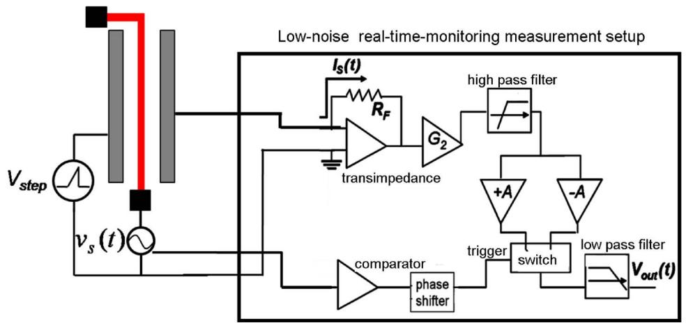  
Fig. 8. Schematic illustration of the platform used to evaluate the mechanical parameters of the resonating beams of the accelerometer.

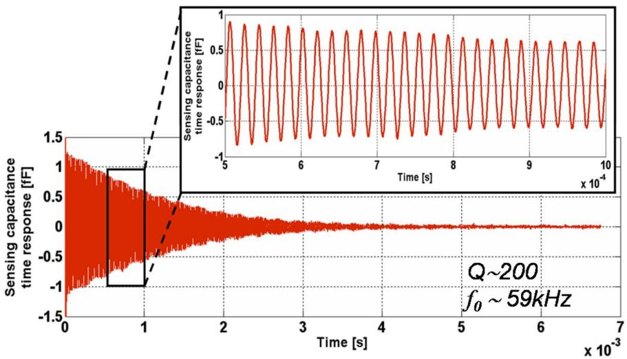  
Fig. 9. Time response of a single resonating beam to a downward step from a perturbed position to its rest position.

fundamental frequency $f_{0}$ and the quality factor $Q$ . For a group of three devices, the following values were obtained: fundamental frequencies in the range $56\mathrm{kHz} < f_0 < 59\mathrm{kHz}$ and quality factor in the range $180 < Q < 210$ .

A precise measure of the $Q$ factor is of particular importance in resonant accelerometers, as it allows one to evaluate the resistive losses which need to be compensated by a suitable electronic circuitry in order to ensure the beam oscillation. Indeed, as the damping factor $B$ can be expressed as

$$
B = 2 \pi \frac {f _ {0} M}{Q} \tag {20}
$$

the equivalent series resistance $R_{\mathrm{eq}}$ results to be

$$
R _ {\mathrm {e q}} = 2 \pi \frac {f _ {0} M}{Q \eta^ {2}} \tag {21}
$$

where the equivalent mass $M$ and the efficiency $\eta$ can be evaluated analytically, as shown in the previous sections, while $f_{0}$ and the quality factor $Q$ have been measured as reported previously.

The equivalent RLC parameters for a single resonator of the presented resonant accelerometer are reported in Table II for

TABLE II EQUIVALENT RLC PARAMETERS OF A SINGLE RESONATOR  

<table><tr><td>Parameter</td><td>Value</td><td>Units</td></tr><tr><td>Req [Vp=6V]</td><td>8.7</td><td>MΩ</td></tr><tr><td>Leq [Vp=6V]</td><td>4712</td><td>H</td></tr><tr><td>Ceq [Vp=6V]</td><td>1.55</td><td>fF</td></tr></table>

$V_{p} = 6\mathrm{V}$ , quality factor $Q = 200$ , and fundamental frequency $f_{0} = 59\mathrm{kHz}$ . Based on these values, a first electronic readout circuitry has been designed and tested, as described in the next sections.

# B. Experimental Validation of the Electromechanical RLC Model

A first transimpedance stage has been realized in order to perform an experimental electromechanical validation of the model. On one side, the board-level circuit was soldered to a further board holding a wire-bonded accelerometer. On the other side, the transimpedance circuit of resistance $R_{1}$ was connected to a spectrum analyzer, as shown in Fig. 10(a).

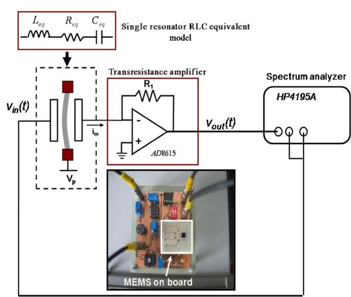  
(a)

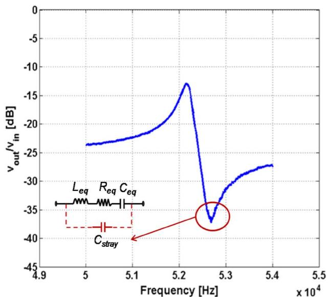  
(b)

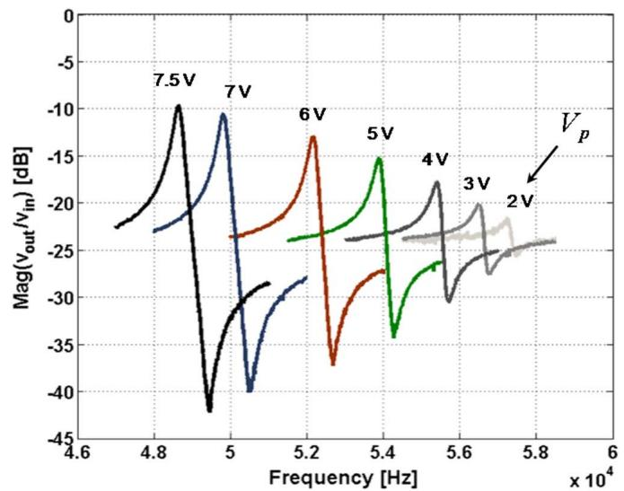  
Fig. 10. (a) Schematic illustration of the transimpedance-gain stage design to characterize the accelerometer resonating beams. (b) Spectral response magnitude of $v_{\mathrm{out}} / v_{\mathrm{in}}$ under the conditions: $V_{p} = 6\mathrm{V}$ and $v_{a} = 3.2\mathrm{mV}$ .   
(a)

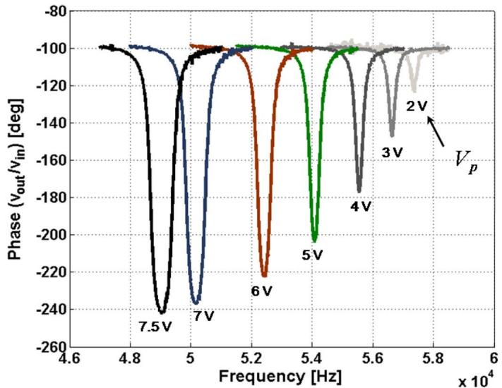  
(b)   
Fig. 11. (a) Spectral response magnitude of $v_{\mathrm{out}} / v_{\mathrm{in}}$ for different values of $V_{p}$ . (b) Phase response of $v_{\mathrm{out}} / v_{\mathrm{in}}$ for different values of $V_{p}$ .

At resonance, the output voltage is $v_{\mathrm{out}}(t) = i(t)R_1 / R_{\mathrm{eq}}$ . Due to the high equivalent series resistance $R_{\mathrm{eq}}$ of the micromechanical resonator, the design of the transimpedance stage is a challenge. A high value of $R_{1}$ is required to have both large signal and low noise at the output. However, a high value of $R_{1}$ may imply a low bandwidth as well as stability problems. As the current signal to be amplified is around 58 kHz, the bandwidth was limited at 500 kHz. A value of $R_{1} = 1.25\mathrm{M}\Omega$ was chosen (limiting the gain of the first amplifier to 0.21) to avoid stability problems. The spectral response of the ratio $v_{\mathrm{out}} / v_{\mathrm{in}}$ is shown in Fig. 10(b). The spectrum is characterized by a positive peak of resonance representing the maximum of the curve $v_{\mathrm{out}} / v_{\mathrm{in}}$ followed by a negative peak. The latter is known in the literature as the antiresonance peak, and its presence is known to be caused by stray capacitances placed in parallel to the RLC circuit representing the MEMS resonator.

From the measured data, the stray capacitance is evaluated to be around 150 fF [25] and is considered to be due mainly to the connections between the accelerometer package and the board.

The equivalent resistance $R_{\mathrm{eq}}$ is proportional to the inverse of $\eta^2$ , and from the definition (18), $\eta$ is directly proportional to $V_p$ . Consequently, in the measurement setup of Fig. 10(a), an increase of the $V_p$ causes a decrease of $R_{\mathrm{eq}}$ and hence generates a rise in the motional current $i(t)$ and in the output voltage $v_{\mathrm{out}}(t)$ . This is evidenced by the measurements of Fig. 11(a), where further spectra are plotted for different values of the parameter $V_p$ . The changes in the biasing of the moving mass also cause variations in the phase diagram of $v_{\mathrm{out}} / v_{\mathrm{in}}$ , as shown in Fig. 11(b). In particular, only for $V_p > 4.5 \mathrm{~V}$ , the phase change at the resonant frequency overcomes the value of $-180^\circ$ .

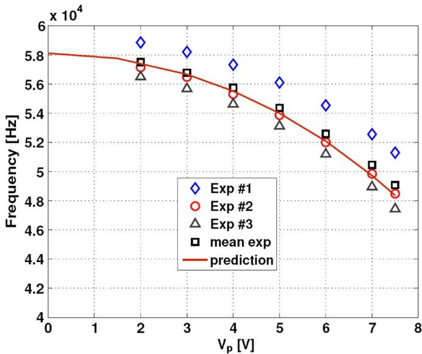  
Fig. 12. Resonant frequencies [obtained with the setup shown in Fig. 10(a)] as a function of the central beam polarization voltage $V_{p}$ : Experimental points and theoretical predictions.

From the measurements reported in Fig. 11, one can also observe a significant reduction of the resonance frequency for increasing $V_{p}$ . This frequency shift as a function of the biasing voltage is shown in Fig. 12 for the device considered in Fig. 11 and for two other resonators. The effect of $V_{p}$ on the resonance frequency is explained by the presence of the equivalent electrical stiffness $\bar{k}_{e}$ , which is directly proportional to the square of $V_{p}$ [see (15)]. The experimental points are in good agreement with the theoretical prediction obtained including $k_{e}$ (7) in the equivalent stiffness $f_{0} = 1 / 2\pi \sqrt{(k_{m} - k_{e}) / M}$ , which is represented by the curve in the figure.

The nonlinear behavior of the resonators described in Section II-B has also been experimentally studied. Fig. 13(a) shows the spectral response of a resonating beam in terms of the measured current amplitude $i(t)$ for different actuation-voltage amplitudes $v_{a}$ for $V_{p} = 3\mathrm{V}$ .

Recalling that the current is proportional to the velocity of the central point of the beam [see (18)], the current amplitude turns out to be proportional to the displacement amplitude. From Fig. 13(a), it can be observed that, as the driving voltage increases, the measured current, and hence, the displacement of the beam from the rest position, increases, leading the device out of the working conditions where the linear approximation of the elastic stiffness can be used for modeling. For $v_{a} > 56 \mathrm{mV}$ the device evidences a strong hard stiffness effect with bistable behavior around the resonance and a hysteresis cycle, as described in Section II-B (see Fig. 4). The experimental hysteresis behavior is better evidenced in Fig. 13(b), where the back-and-forth curves are shown for the case where $v_{a} = 178 \mathrm{mV}$ . The correct modeling in this condition requires one to take into account the third-order mechanical stiffness $k_{3}$ as shown by (6). However, for our purposes, it is sufficient to estimate that this hard spring effect is negligible for actuation-voltage peaks below $32 \mathrm{mV}$ . This value will thus be considered as the best one for the implementation of the oscillating circuit, as lowering the amplitude of $v_{a}(t)$ indeed causes a decrease of

the $S / N$ ratio at the circuit output and, thus, of the obtainable resolution.

# V. ACCELEROMETER RESPONSE

Considering the model developed for the resonating beams in Section IV and considering the constraints on the polarization voltage $V_{p}$ and on the driving voltage amplitude $v_{a}$ discussed in the same section, a first oscillating circuit for the resonant accelerometer has been developed and is presented in this section. A simplified block scheme of the circuit (for a single beam) is shown in Fig. 14. The core stage is a transresistance amplifier used to read the motional current from the sensing electrode of the beam resonator. A second amplifying stage follows, in order to obtain an amplified output signal $v_{s,1}(t)$ . A rail-to-rail operational amplifier is used as a limiter for the oscillation, resulting in a square waveform constituting the circuit output. Finally, an amplitude reduction stage at the end of the ring is used to tune the driving voltage $v_{a}(t)$ acting on the resonator to the optimal value found at the end of Section IV.

The conditions for the oscillation to build up are as follows, where $G_{\mathrm{loop}}$ is the loop gain of the resonating circuit.

1) $G_{\mathrm{loop}} > 1$   
2) $\Phi(G_{\mathrm{loop}}) = 0^{\circ}$ .

Condition 1) is ensured by the amplification factor $a_{v}$ reported in Table III. Condition 2) is fulfilled if a phase shift of $180^{\circ}$ between $v_{a}(t)$ and the output voltage of the transresistance stage is obtained (approximately, a zero phase shift is introduced by the LMH6624 and the AD8032 and a $180^{\circ}$ phase shift is provided by choosing an inverting configuration for the second amplifying stage). Condition 2) is thus satisfied if a biasing voltage $V_{p} \geq 4.5\mathrm{V}$ is used [see Fig. 11(b)]. Once the central beam biasing is properly selected, the circuit will start oscillating at the frequency where both conditions 1) and 2) are satisfied.

Experimental tests with applied external acceleration were performed in order to characterize the performance of the presented device. Fig. 15(a) shows different power spectra of the circuit output signal for a single resonating beam when the accelerometer is subjected to external accelerations in the range of $\pm 1g$ .

The sensitivity for a single beam turns out to be around $227.5\mathrm{Hz / g}$ , which leads to an average differential sensitivity of $455\mathrm{Hz / g}$ . These results were obtained by biasing the central beam at $V_{p} = 6\mathrm{V}$ and setting the actuation voltage $v_{a} = 30~\mathrm{mV}$ , ensuring the linear operation of the resonant accelerometer. In Fig. 15(b), experimental points and a linear fitting of the differential sensitivity, for a group of three devices, are reported. The experimental points represent the peak frequencies corresponding to different acceleration values in the range of $\pm 1g$ . A good linearity is observed in this range of operation.

The resolution of the presented MEMS resonant accelerometer is calculated through the Allan variance method, a technique used to study random frequency instabilities of oscillators (see, e.g., [6], [26], and [27]). The method consists in the evaluation of the variance associated with the oscillator output frequency for a different time interval of observation $\tau$ . For this measure,

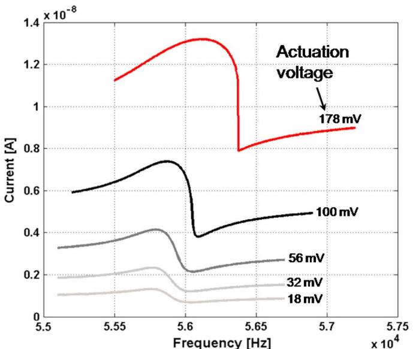  
(a)

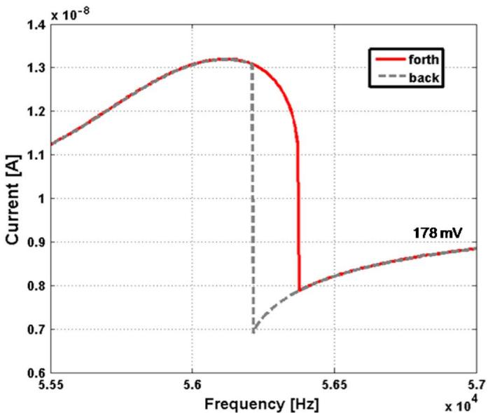  
(b)

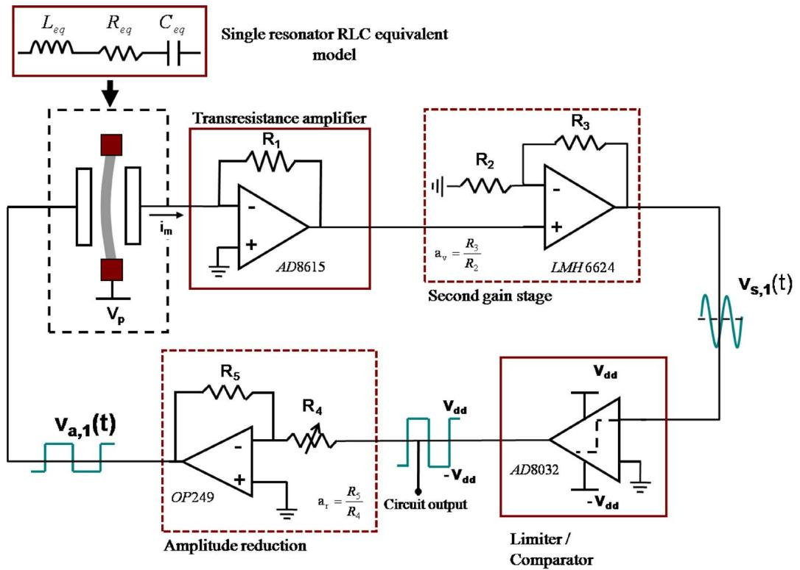  
Fig. 13. (a) Spectral response of a resonating beam at $V_{p} = 3\mathrm{V}$ for different actuation voltage $v_{a}$ . (b) Hysteresis effect evidenced by the spectral response of a beam obtained through the setup shown in Fig. 10(a). The back-and-forth curves do not overlap within the bistable region.   
Fig. 14. Block scheme of the oscillating circuit for the driving of each of the resonating beams.

TABLE III PARAMETERS OF THE OSCILLATING CIRCUIT OF FIG.14   

<table><tr><td>Parameter</td><td>Value</td><td>Units</td></tr><tr><td>Transresistance stage Gain</td><td>1.25</td><td>MΩ</td></tr><tr><td>Second stage Gain, av</td><td>100</td><td>V/V</td></tr><tr><td>AD8032 supply voltage, Vdd</td><td>2.5</td><td>V</td></tr><tr><td>Amplitude reduction factor, Ar</td><td>0.005÷1</td><td>V/V</td></tr></table>

the output signal of the oscillator circuit schematically shown in Fig. 14 has been acquired with a LeCroy 6100A digital oscilloscope at a sampling frequency of $25\mathrm{MHz}$ in order to obtain the required precision. Then, the Allan variance has been computed through a MATLAB code.

For a time interval $\tau = 0.01\mathrm{s}$ , corresponding to a $100\mathrm{-Hz}$ bandwidth, we have obtained an rms frequency variation $\Delta f_{\mathrm{rms}}(\tau)$ of $1.046\mathrm{Hz}$ . This value represents the minimum frequency shift that we are able to detect on a $100\mathrm{-Hz}$ bandwidth

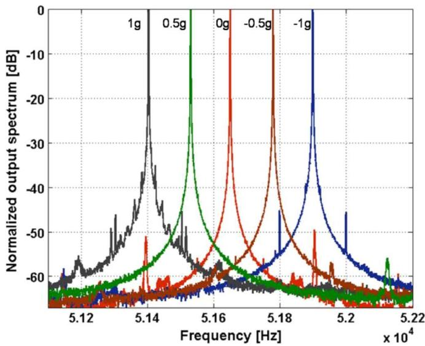

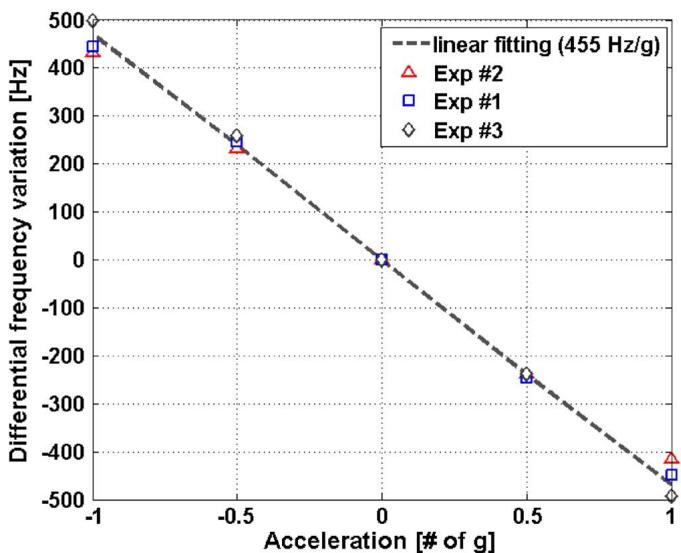  
(a)   
(b)   
Fig. 15. (a) Normalized output spectrum of the oscillating circuit for a single resonating beam evaluated for four different applied accelerations, namely, 0, $\pm 0.5$ , and $\pm 1$ g. (b) Variation of the peak frequency difference between the resonators $\Delta f - \Delta f_0$ as a function of the external acceleration in the range of $\pm 1$ g. $\Delta f_0$ corresponds to the peak frequency difference at $0g$ .

(typical of consumer electronics applications). The corresponding minimum detectable acceleration for a single resonator turns out to be

$$
a _ {\min } (1 0 0 \mathrm {H z}) = \frac {\Delta f _ {\mathrm {r m s}} (\tau)}{\text {s e n s i t i v i t y}} = \frac {1 . 0 4 6 \mathrm {H z}}{2 2 7 . 5 \mathrm {H z} / g} = 4. 6 \mathrm {m g} _ {\mathrm {r m s}}. \tag {22}
$$

Fig. 16 shows three resolution values evaluated at three different observation intervals $\tau$ , corresponding to signal bandwidth of 10, 50, and $100\mathrm{Hz}$ . The data are well fitted by a constant acceleration noise density $(460~\mu g_{\mathrm{rms}} / \sqrt{Hz})$ , which means that the dominant noise contribution is white in the observed range. This value represents the resolution of the sensor, and it is almost entirely due to the readout electronics.

Table IV compares the performances of the resonant accelerometer with previously presented devices. The device of

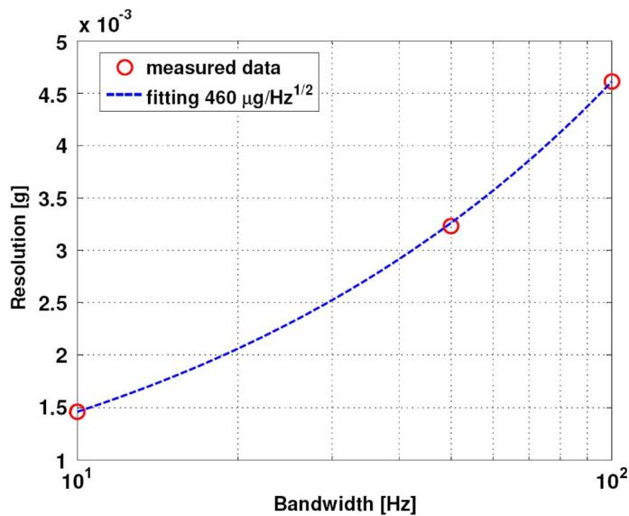  
Fig. 16. Resolution of the accelerometer evaluated for three different signal bandwidths. The measured data are fitted by an acceleration noise density of $460\mu g_{\mathrm{rms}} / \sqrt{Hz}$ .

this work stands out for its high-sensitivity performances that are obtained using a relatively small area, owing to the described geometrical optimization. The resolution of the different accelerometers is given in Table IV as acceleration noise density (acceleration units over bandwidth, in $g_{\mathrm{rms}} / \sqrt{Hz}$ ), as the noise floor always depends on the adopted filtering. The input signal bandwidth around which the value is measured is indicated in brackets.

Future works will include the realization of an integrated oscillator circuit with noise performances at least comparable with those obtained with the presented board-level circuit, which are satisfactory for consumer electronics applications.

# VI. CONCLUSION

A new uniaxial resonant accelerometer has been designed, produced, and tested together with a newly designed oscillating circuit. A detailed analysis of the mechanical behavior in the linear and nonlinear regime has been performed. New experimental results, exhibiting good agreement with the theory, have been obtained on the beam resonators operated in both regimes. Measurements of the accelerometer functioning have been obtained through a properly designed oscillating circuit. From the present study, it can be concluded that the proposed optimized design for the resonant accelerometer gives a high sensitive response with reduced dimensions, and it appears to be promising for future commercial applications. A careful study for the design of new geometrical configurations for two-axis resonant accelerometers based on the same principle is now under way.

# ACKNOWLEDGMENT

The authors would like to thank L. Domenella for the execution of the finite-element analyses, L. Valli for the experimental measurements, and the NEMAS group of the Politecnico di Milano for the execution of SEM images. Part of the experimental setup used in this work was funded by Fondazione Cariplo

TABLE IV COMPARISON OF RESONANT MICROACCELERometers   

<table><tr><td>Reference</td><td>Device overall area* [mm2]</td><td>Proof mass dimensions \( \left\lbrack  {\mu {\mathrm{m}}^{3}}\right\rbrack \)</td><td>Resonators frequency [kHz]</td><td>Sensitivity [Hz/g]</td><td>Relative sensitivity [%/g]</td><td>Relative sensitivity/ device area [%/ (g mm2)]</td><td>Resolution (frequency at which the value is measured) [mgrms/√Hz ]</td></tr><tr><td>[6] Roessig et al.</td><td>0.12</td><td>\( {120} \times  {150} \times  2 \)</td><td>175</td><td>2.4</td><td>0.0011</td><td>0.137</td><td>0.416 (10 kHz)</td></tr><tr><td>[7] Aikele et al.</td><td>0.24</td><td>\( {400} \times  {400} \times  {30} \)</td><td>400</td><td>70</td><td>0.0175</td><td>1.050</td><td>1 (10 kHz)</td></tr><tr><td>[8] Seshia et al.</td><td>0.55</td><td>\( {500} \times  {580} \times  {2.2} \)</td><td>173</td><td>17</td><td>0.0098</td><td>0.257</td><td>\( {0.035}{\left( {100}\mathrm{\;{Hz}}\right) }^{* * } \)</td></tr><tr><td>[11] Su et al.</td><td>0.85</td><td>\( {450} \times  {750} \times  {50} \)</td><td>131</td><td>158</td><td>0.1206</td><td>0.142</td><td>Not available</td></tr><tr><td>[12] Pinto et al.</td><td>0.05</td><td>\( {50} \times  {200} \times  {4.2} \)</td><td>459</td><td>22</td><td>0.0048</td><td>1.380</td><td>2.240 (DC)</td></tr><tr><td>Present work</td><td>0.25</td><td>\( {400} \times  {400} \times  {15} \)</td><td>58</td><td>455</td><td>0.7845</td><td>45.186</td><td>0.460 (10-100 Hz)</td></tr></table>

* Evaluated from micro images in the references   
** Simulated value

in 2007, within the project Dissipative and Failure Phenomena in Micro and Nano Electro Mechanical Systems.

# REFERENCES

[1] C. Comi, A. Corigliano, G. Langfelder, A. Longoni, A. Tocchio, and B. Simoni, "A high sensitivity uniaxial resonant accelerometer," in Proc. MEMS, Hong Kong, Jan. 24-28, 2010, pp. 260-263.   
[2] K. Biswas, S. Sen, and P. K. Dutta, “MEMS capacitive accelerometers,” Sens. Lett., vol. 5, no. 3/4, pp. 471–484, Sep.-Dec. 2007.   
[3] LIS244AL MEMS Motion Sensor, Product Data-Sheet Rev1, STMicroelectronics, Geneva, Switzerland, Jun. 2007.   
[4] A. Beliveau, G. T. Spencer, K. A. Thomas, and S. L. Roberson, “Evaluation of MEMS capacitive accelerometers,” IEEE Des. Test. Comput., vol. 16, no. 4, pp. 48–56, Oct. 1999.   
[5] C. Burrer and J. Esteve, “A novel resonant silicon accelerometer in bulk-micromachining technology,” Sens. Actuators A, Phys., vol. 46, no. 1–3, pp. 185–189, Jan./Feb. 1995.   
[6] T. A. Roessig, R. T. Howe, A. Pisano, and J. H. Smith, "Surface-micromachined resonant accelerometer," in Proc. Transducers, Chicago, IL, Jun. 1997, vol. 2, pp. 859-862.   
[7] M. Aikele, K. Bauer, W. Ficker, F. Neubauer, U. Prechtel, J. Schalk, and H. Seidel, "Resonant accelerometer with self-test," Sens. Actuators A, Phys., vol. 92, no. 1, pp. 161-167, Aug. 2001.   
[8] A. A. Seshia, M. Palaniapan, T. A. Roessig, R. T. Howe, R. W. Gooch, T. R. Shimert, and S. Montague, "A vacuum packaged surface micromachined resonant accelerometer," J. Microelectromech. Syst., vol. 11, no. 6, pp. 784-793, Dec. 2002.   
[9] L. He, Y.-P. Xu, and A. Qiu, "Folded silicon resonant accelerometer with temperature compensation," in Proc. IEEE Sensors, Oct. 24-27, 2004, vol. 1, pp. 512-515.   
[10] V. Ferrari, A. Ghisla, D. Marioli, and A. Taroni, "Silicon resonant accelerometer with electronic compensation of input-output cross-talk," Sens. Actuators A, Phys., vol. 123/124, pp. 258-266, 2005.   
[11] S. X. P. Su, H. S. Yang, and A. M. Agogino, “A resonant accelerometer with two-stage microleverage mechanisms fabricated by SOI-MEMS technology,” Sensors, vol. 5, no. 6, pp. 1214–1223, Dec. 2005.   
[12] D. Pinto, D. Mercier, C. Kharrat, E. Colinet, V. Nguyen, B. Reig, and S. Hentz, "A small and high sensitivity resonant accelerometer," *Procedia Chem.*, vol. 1, no. 1, pp. 536-539, Sep. 2009.   
[13] R. H. Olsson, K. E. Wojciechowski, M. S. Baker, M. R. Tuck, and J. G. Fleming, "Post-CMOS-compatible aluminum nitride resonant MEMS accelerometers," J. Microelectromech. Syst., vol. 18, no. 3, pp. 671-687, Jun. 2009.   
[14] C. Comi, A. Corigliano, A. Merassi, and B. Simoni, "A surface micromachined resonant accelerometer with high resolution," in Proc. 7th Euromech Solid Mech. Conf., Lisbon, Portugal, Sep. 7-11, 2009, [CD-ROM].   
[15] C. Comi, A. Corigliano, G. Langfelder, A. Longoni, A. Tocchio, and B. Simoni, "A new two-beam differential resonant micro accelerometer," in Proc. IEEE Sensors, Christchurch, New Zealand, Oct. 25-28, 2009, pp. 158-163.   
[16] A. Corigliano, B. De Masi, A. Frangi, C. Comi, A. Villa, and M. Marchi, "Mechanical characterization of epitaxial silicon through on

chip tensile tests," J. Microelectromech. Syst., vol. 13, no. 2, pp. 200-219, Apr. 2004.   
[17] J. A. Wickert, “Non-linear vibration of traveling tensioned beam,” Int. J. Non-Linear Mech., vol. 27, no. 3, pp. 503–517, May 1992.   
[18] W. Stokey, "Vibration of systems having distributed mass and elasticity," in Shock and Vibration Handbook, C. Harris, Ed. New York: McGraw-Hill, 1988.   
[19] A. Bokaian, "Natural frequencies of beams under tensile axial load," J. Sound Vib., vol. 142, no. 3, pp. 481-498, Nov. 1990.   
[20] C. Comi, “On geometrical effects in micro-resonators,” Latin Amer. J. Solids Struct., vol. 6, pp. 73-87, 2009.   
[21] V. Kaajakari, T. Mattila, A. Oja, and H. Seppa, "Nonlinear limits for single-crystal silicon microresonators," J. Microelectromech. Syst., vol. 13, no. 5, pp. 715-724, Oct. 2004.   
[22] C. T.-C. Nguyen and R. T. Howe, "An integrated CMOS micromechanical resonator high-Q oscillator," IEEE J. Solid-State Circuits, vol. 34, no. 4, pp. 440-445, Apr. 1999.   
[23] S. Lee, M. U. Demirci, and C. T.-C. Nguyen, "A 10-MHz micromechanical resonator pierce reference oscillator for communications," in Proc. Transducers, Munich, Germany, Jun. 10-14, 2001, pp. 1094-1097.   
[24] G. Langfelder, A. Longoni, and F. Zaraga, "Low-noise real-time measurement of the position of movable structures in MEMS," Sens. Actuators A, Phys., vol. 148, no. 2, p. 401-406, Dec. 2008.   
[25] G. Gonzalez, Foundation of Oscillator Circuit Design. Norwood, MA: Artech House, 2006.   
[26] E. S. Ferre-Pikal, J. R. Vig, J. C. Camparo, L. S. Cutler, L. Maleki, W. J. Riley, S. R. Stein, C. Thomas, F. L. Walls, and J. D. White, "Draft revision of IEEE STD 1139-1988 Standard definitions of physical quantities for fundamental frequency and time metrology—Random instabilities," in Proc. IEEE Int. Frequency Control Symp., Orlando, FL, May 28–30, 1997, pp. 338–357.   
[27] J. Rutman, “Characterization of phase and frequency instabilities in precision frequency sources: Fifteen years of progress,” Proc. IEEE, vol. 66, no. 9, pp. 1048–1075, Sep. 1978.

Claudia Comi received the M.S. degree (with honors) in structural engineering from the Politecnico di Milano, Milan, Italy, in 1988.

She is a Full Professor of Structural Engineering at the Politecnico di Milano, where she was an Assistant and Associate Professor in the Department of Structural Engineering from 1991 to 2002. She spent periods of research in the Laboratoire de Mécanique et Technologie, ENS Cachan, France, and in the Department of Mechanical Engineering, Northwestern University, Evanston, IL, as a Researcher and Invited

Professor. She is a member of the council of the Ph.D. school in structural, earthquake, and geotechnical engineering. Her main research interests concern theoretical and computational mechanics of materials and structures. She is the author of about 80 publications in refereed international journals and conference proceedings. Her research activities are focused on damage and quasi-brittle fracture modeling, on instability phenomena and nonlocal models for elastoplastic and damaging one- and two-phase materials, and on reliability and design of microelectromechanical systems.

Alberto Corigliano received the M.S. degree (with honors) in structural engineering from the Politecnico di Milano, Milan, Italy, in 1988.

He is a Full Professor of Structural Engineering at the Politecnico di Milano, where he was an Assistant and Associate Professor in the Department of Structural Engineering in the fields of material mechanics and computational structural mechanics from 1991 to 2002. He was a Visiting Professor in the Laboratoire de Mécanique et Technologie, ENS Cachan, France, and in the Department of Mechan

ical Engineering, Northwestern University, Evanston, IL. He is the author of more than 120 publications in refereed international journals and conference proceedings. His research activities are now focused on quasi-brittle and ductile fracture mechanics, damage phenomena in composite materials, and reliability and design of microelectromechanical systems.

Prof. Corigliano was the recipient of the Bruno Finzi price for Rational Mechanics from the Istituto Lombardo Accademia di Scienze e Lettere in 2006.

Giacomo Langfelder received the B.S., M.S., and Ph.D. degrees from the Politecnico di Milano, Milan, Italy, in 2003, 2005, and 2009, respectively, specializing in semiconductor radiation detectors and semiconductor microelectromechanical systems devices.

He is currently an Assistant Professor in the Department of Electronics and Information Technology, Politecnico di Milano. He is a coinventor of three patents on a newly developed color-sensitive imaging detector and on new methods for white balancing and image processing. He is the author of about

20 publications in refereed scientific journals and conference proceedings. His research involves the design and characterization of M/NEMS, with a strong focus on reliability aspects of micro- and nanostructures, and the study of M/NEMS electronic control and readout circuits.

Dr. Langfelder was the recipient of the "Premio di Laurea Accenture" for the best results obtained in his M.S. courses and thesis in 2005.

Antonio Longoni received the M.S. degree in nuclear engineering from the Politecnico di Milano, Milan, Italy in 1972.

He is a Full Professor of Electron Devices at the Politecnico di Milano, Milan, Italy. His research activity is carried out in the fields of semiconductor devices, radiation detectors, and instrumentation for the analysis of materials. He has contributed to the development of a new type of radiation detector, the "Semiconductor Drift Detector (SDD)," and of imaging detectors for X- and Gamma rays derived from

the SDD. Recently, he conceived and participated in the development of a new color-sensitive imaging detector for photographic applications. He has carried out research work concerning noise problems in semiconductor devices and the application of heterostructure devices in nuclear electronics. He has contributed to the development of new X-ray-based instrumentation for microanalyses of materials, particularly instrumentation for elemental mapping based on X-ray fluorescence techniques, and for X-ray holography of crystalline structures. He is the author of more than 100 publications in international scientific reviews and of a few patents.

Prof. Longoni was the recipient of a prize from the Italian Accademia Nazionale dei Lincei for the development of innovative instrumentation for the diagnosis of works of art and cultural heritage.

Alessandro Tocchio received the B.S. and M.S. degrees in electronic engineering from the Politecnico di Milano, Milan, Italy, in 2006 and 2008, respectively, where he is currently working toward the Ph.D. degree. His M.S. thesis was entitled "Wafer-level packaging of an optical gas sensor," and it was carried out in the Microsystem Technology Group, Royal Institute of Technology (KTH), Stockholm, Sweden.

His research interests include the design of novel microelectromechanical inertial sensors and low

noise low-power readout electronics.

Barbara Simoni received the M.S. degree in particle physics from the University of Pisa, Pisa, Italy, in 2004.

She has been with STMicroelectronics, Milan, Italy, since 2005 as a MEMS Design Engineer in the MSH Division. She is a coinventor of five patents on new design solutions for MEMS devices. Currently, her work is focused on the mechanical design of MEMS accelerometers.