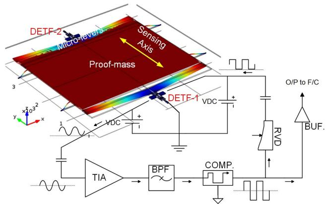
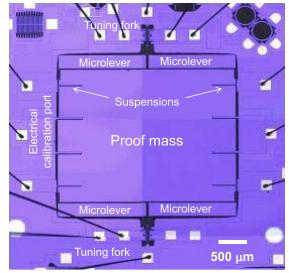
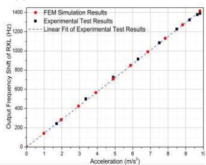
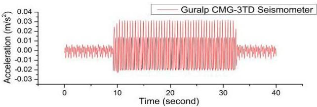
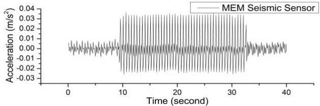
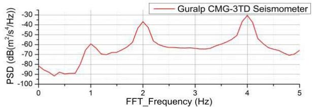
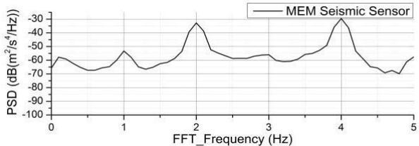
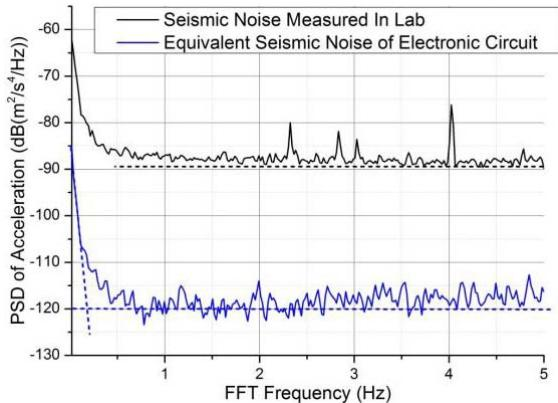

# JMEMS Letters

# A Seismic-Grade Resonant MEMS Accelerometer

Xudong Zou, Pradyumna Thiruvenkatanathan, and Ashwin A. Seshia

Abstract—We report on the characterization of a high-resolution micromachined resonant accelerometer fabricated in an SoI-microelectromechanical (MEMS) foundry process. A prototype device demonstrated scale factor of $142.8\mathrm{Hz / m / s^2}$ , dynamic range of $>140$ dB, and noise-limited resolution that is comparable with existing high-resolution macroscale seismometers. Experimental characterisation detailing the benchmarking of the MEMS prototype relative to an existing macroscale seismometer shows that the MEMS device tracks the passive ambient seismic response measured by a macroscale seismometer (Guralp systems CMG-3TD) over a measurement bandwidth extending from near dc $(0.02\mathrm{Hz})$ up to $100\mathrm{Hz}$ . [2014-0031]

Index Terms—Microelectromechanical accelerometers, seismometers, resonant sensors.

# I. INTRODUCTION

MEMS accelerometers have seen much translational success in a large spectrum of applications ranging from automotive systems, environmental and infrastructure monitoring, user interfaces for mobile and gaming devices, and in wearable healthcare. These applications have been largely limited to the low resolution end of the application spectrum and leverage advantages associated with batch manufacturability, small size, low power and CMOS integration. However, a number of emerging applications such as pedestrian navigation systems and seismology [1]–[3] require higher performance approaches to inertial measurement. In the area of seismic imaging [3]–[5], considerably larger sized geophones are regularly used to conduct seismic surveys. Typically, the signal amplitude of a geophone is linearly proportional to velocity above its resonance frequency, with a roll-off of $-40\mathrm{dB}$ /decade below resonance.

MEMS accelerometers, on the other hand, have been demonstrated to provide a relatively flat amplitude and phase frequency response over bandwidths ranging from a few Hz up to $100\mathrm{Hz}$ . Recent work on the optimisation of capacitive [3]–[5] and optical MEMS accelerometers [6] have also resulted in devices that offer acceptable resolution, making them potentially attractive for seismic imaging. However, these high resolution MEMS accelerometers are still limited by their inability to operate over a large dynamic range. Furthermore, the 1/f noise in these devices often limits their low frequency measurement capability with typical measurement frequencies

Manuscript received January 26, 2014; revised March 19, 2014; accepted April 9, 2014. Date of publication May 9, 2014; date of current version July 29, 2014. This work was supported by the Technology Strategy Board under Grant TP11/CAT/6/I/BP110G. Subject Editor R. T. Howe.

The authors are with the Department of Engineering, University of Cambridge, Cambridge CB2 1PZ, U.K. (e-mail: xz280@cam.ac.uk; pradyu77@googlemail.com; aas41@cam.ac.uk).

Color versions of one or more of the figures in this letter are available online at http://ieeexplore.ieee.org.

Digital Object Identifier 10.1109/JMEMS.2014.2319196

extending down to a few Hz. This has been due to the inherent relationship between sensitivity and natural frequency in these devices. Larger sensitivities usually require the implementation of a large proof mass supported by rather compliant suspension consequently imposing limitations not only on the bandwidth of operation but also on the robustness and dynamic range of such devices.

This letter introduces results on the characterization of a MEMS resonant accelerometer (RXL) that offers the advantage of improved electronic noise limited resolution without sacrificing on the dynamic range and bandwidth of operation. The operational principle and design of this device builds upon previous work [7]-[9]. As opposed to capacitive principles, resonant accelerometers convert the input acceleration to an inertial force that is sensed by resonant strain gauges coupled to a suspended proof mass. This results in a frequency modulated output response, providing for the possibility of increased immunity to parametric noise and also eliminating the more severe trade-off between bandwidth and sensitivity inherent in open-loop capacitive or optical readout schemes. The scale factor of the resonant accelerometer remains constant over a large input acceleration range without any additional feedback control in contrast to accelerometers based on displacement measurement principles. The measured acceleration data can be readily demodulated from the quasi-digital output signal by frequency counting techniques for acceleration frequencies up to several hundred hertz.

# II. DESIGN AND FABRICATION

The device topology is similar to that reported in previous work. The micro-mechanical structure consists of a suspended inertial mass connected to double-ended tuning fork sensors through a leverage mechanism. When external acceleration is applied to the proof mass along the sensitive axis, it results in a push-pull force axially coupled onto the two DETFs enabling differential measurement. The axial force on the DETFs results in a shift in the resonant frequency which can be tracked by an electro-mechanical oscillator circuit and recorded by a frequency counter. The scale factor of the resonant MEMS accelerometer is given by Equation 1 [10].

$$
\frac {\Delta f _ {o u t}}{a _ {i n}} = S _ {R e s} \times E A _ {L v r} \times M _ {p r o o f} \tag {1}
$$

where $S_{Res}$ is the scale factor of DETF resonant sensor in the unit of 'Hz/N', $EA_{L\mathrm{vr}}$ is the effective amplification factor of micro levers, $M_{proof}$ is the mass of proof-mass, $a_{in}$ is the input acceleration and $\Delta f_{out}$ is the frequency shift of accelerometer. The designs here have been optimized to achieve high sensitivity by optimizing the parameters on the right side of Eq. 1 for constraints imposed by the fabrication process and simultaneously considering metrics such as dynamic range, bandwidth and robustness to shock [10]. For instance, a specific fabrication process restricts the minimum beam and gap

  
(a)

  
(b)

  
(c)   
Fig. 1. (a) Schematic of the resonant accelerometer with interface electronics, (b) optical micrograph of the fabricated prototype and, (c) simulated and measured output response for static loading in the range $0 - 1\mathrm{g}$ .

dimensions, overall proof mass dimensions and the thickness of the device whereas the dynamic range is limited by nonlinearities inherent in the device and considerations for device robustness include beam buckling or fragility of the structure due to shock. In addition to considerations on the mechanical sensitivity, the tuning fork oscillator circuits are optimised to minimize the injected electronic noise.

# III. EXPERIMENTAL RESULTS

Figure 1(a) provides a device schematic and Fig. 1(b) shows an optical micrograph of the prototype MEMS resonant accelerometer. The device chip was fabricated using the SOIMUMPS foundry process offered by MEMSCAP Inc., USA, with the critical device features created in a $25\mu \mathrm{m}$ thick silicon device layer. The device was then wire bonded to a 44-pin LCC and vacuum packaged using a customized process. The interface electronics for the sensor was implemented at a board-level and consists of a square-wave oscillator circuit for each tuning fork with the buffered oscillator output captured by a frequency counter.

Three sets of experiments were conducted - static acceleration measurements, dynamic acceleration testing and noise floor estimation. First, to calibrate the scale factor, the sensor was mounted on a high precision rotary/tilt stage and the responses for static acceleration in the range from 0 to $1\mathrm{g}$ $(\sim 9.8\mathrm{m / s}^2)$ were recorded. This test indicated that the MEMS resonant accelerometer had an approximately linear response throughout the range $0 - 1\mathrm{g}$ with a measured scale factor of $142.8\mathrm{Hz / m / s}^2$ (Figure 1(c)), in agreement with FE simulation (COMSOL® 4.3a) where a scale factor of $143.5\mathrm{Hz / m / s}^2$ was predicted with a linearity range ( $< 1\%$ linearity error)

  
(a)

  
(b)   
Fig. 2. (a) Time-domain and (b) frequency-domain responses for the resonant MEMS accelerometer and the Guralp CMG-3TD Seismometer for the same input excitation.

of greater than $+ / - 3\mathrm{\;g}$ . The resonant frequency of first inplane mode of the device is about ${950}\mathrm{\;{Hz}}$ and hence the resonant accelerometer is expected to provide a relatively linear response from near DC upto ${100}\mathrm{\;{Hz}}$ .

Following static tilt measurements, the resonant accelerometer was mounted on a shaker to perform dynamic measurements and its response to dynamic acceleration was recorded on a spectrum analyzer over a range of frequencies from $1 - 10\mathrm{Hz}$ demonstrating frequency modulated output response. Next, to calibrate and benchmark its performance relative to existing 'macro-scale' seismometers, the resonant accelerometer was placed next to a high performance, low noise, broadband weak motion seismometer (the Guralp CMG-3TD seismometer) on an air-suspended table. A shaker was then used to supply a base excitation to the table with excitation frequencies in the range between $1 - 5\mathrm{Hz}$ . A representative snapshot of the response of the MEMS resonant accelerometer and that of the CMG-3TD seismometer is shown in Fig. 2. The time domain and frequency domain results demonstrate a striking co-relation for most part apart from the behavior at low frequencies $< 1\mathrm{Hz}$ . This is hypothesized to be due to the roll-off in frequency response for the Guralp CMG-3TD seismometer and aspects associated with low frequency drift and high frequency noise aliasing for the MEMS accelerometer.

The source of high frequency noise aliasing is dictated by the frequency counting technique adopted here which is

  
Fig. 3. PSD analysis of the seismic noise limited response and estimation of the electronic-noise limited response.

limited to a sample rate of 10 pts/sec. This, in turn, limits the Nyquist frequency of characterization to $5\mathrm{Hz}$ for the experiments conducted here. However, it is important to note that the mechanical high frequency response of the device is not limited to this frequency and extends to over $100\mathrm{Hz}$ . This high bandwidth capability consequently results in higher frequency background accelerations (at frequencies above $5\mathrm{Hz}$ ) aliasing into the measurements as low frequency noise in the absence of external signal processing.

Finally, in order to estimate the intrinsic sensor noise floor, the measurements from both the prototype device and the seismometer were logged in the absence of any shaker input. This was to ensure that there were no other source of external vibrations contributing to the output response of either device with the intent of reducing the background seismic vibration noise level to values lower than the intrinsic noise floor of the sensor. However, it was observed that the measured ambient vibration noise $(\sim -90\mathrm{dB}(\mathrm{m}^2 /\mathrm{s}^4 /\mathrm{Hz})$ was still much larger than the intrinsic sensor noise - a result confirmed by measurements from the macro-scale seismometer. Thus, in an attempt to quantify an upper bound on the electronic noise limited resolution of the sensor, the MEMS accelerometer unit, embedded within the oscillator electronics, was replaced with a vibration-insensitive quartz crystal resonator of nearly identical operating frequency. The measured frequency output frequency fluctuations produced by the oscillator unit were then captured and demodulated into acceleration units using the previously calibrated device scale factor to provide for an indication of the acceleration noise contributed by the oscillator electronics. The results are shown in Fig. 3 where the noise floor of the circuit is compared before and after the replacement of the MEMS device with the vibration-insensitive quartz crystal resonator with no other changes in the circuit parameters. The peaks in the measured seismic noise PSD for the MEMS device correspond to the specific vibration modes of the vibration isolation table which are excited by ambient background seismic noise. The estimated noise floor of the circuit alone is seen to be smaller than $1\mu \mathrm{m} / \mathrm{s}^{2} / \sqrt{\mathrm{Hz}}$ with a noise corner frequency at about $20~\mathrm{mHz}$ . It should be noted that this figure is only indicative of the electronic noise injected by the oscillator circuit and not limitations associated with motional signal transduction, power handling and non-linear noise up-conversion that may be operative

TABLEI SUMMARY SPECIFICATIONS FOR THE MEMS RXL   

<table><tr><td>Specification</td><td>Value</td><td>Unit</td></tr><tr><td>Scale factor</td><td>142.8</td><td>\( \mathrm{{Hz}}/\mathrm{m}/{\mathrm{s}}^{2} \)</td></tr><tr><td>Linear Range (&lt; 1%)</td><td>+/- 30</td><td>\( \mathrm{m}/{\mathrm{s}}^{2} \)</td></tr><tr><td>Dynamic Range</td><td>140</td><td>dB</td></tr><tr><td>Bandwidth</td><td>0.02-100</td><td>Hz</td></tr><tr><td>Proof-mass</td><td>557.1</td><td>μg</td></tr><tr><td>Lever amplification</td><td>25</td><td>N/N</td></tr></table>

in DETF resonators. Nevertheless, this figure is significantly higher than the thermo-mechanical noise floor for this device indicating the potential for further noise optimization by redesigning the oscillator architecture and pursuing alternative methods for frequency counting to minimize aliasing of high-frequency noise.

# IV. CONCLUSION

This letter introduces a high performance MEMS resonant accelerometer which meets seismic-grade application requirements. The design for an existing topology is optimized for a SOI-MEMS fabrication process. The prototype exhibits a relatively linear response up to $+/-30\mathrm{m/s}^2$ with a scale factor of approximately $142.8\mathrm{Hz/m/s}^2$ . Initial characterization shows an environmental noise limited resolution of approximately $31.6\mu\mathrm{m/s}^2/\sqrt{\mathrm{Hz}}$ over frequencies upto $5\mathrm{Hz}$ and a noise corner frequency of $\sim 20\mathrm{MHz}$ . Summary specifications shown in Table I compare favourably with respect to the state-of-the-art for capacitive and optical accelerometers for device volumes reduced by between a factor 15 and 300 relative to previously reported capacitive designs of similar resolution.

# REFERENCES

[1] T. Aizawa, T. Kimura, T. Matsuoka, T. Takeda, and Y. Asano, "Application of MEMS accelerometer to geophysics," Int. J. JCRM, vol. 4, no. 2, pp. 33-36, 2008.   
[2] J. Bernstein, R. Miller, W. Kelley, and P. Ward, "Low-noise MEMS vibration sensor for geophysical applications," J. Microelectromech. Syst., vol. 8, no. 4, pp. 433-438, Dec. 1999.   
[3] J. Laine and D. Mougenot, “Benefits of MEMS based seismic accelerometers for oil exploration,” in Proc. Solid-State Sens., Actuators, Microsyst. Conf., TRANSDUCERS, 2007, pp. 1473–1477.   
[4] D. J. Milligan, B. D. Homeijer, and R. G. Walmsley, "An ultra-low noise MEMS accelerometer for seismic imaging," in Proc. 2011 IEEE Sensors, Oct., pp. 1281-1284.   
[5] B. Homeijer et al., "Hewlett packard's seismic grade MEMS accelerometer," in Proc. 2011 IEEE 24th Int. Conf. MEMS, Jan., pp. 585-588.   
[6] U. Krishnamoorthy et al., "In-plane MEMS-based nano-g accelerometer with sub-wavelength optical resonant sensor," Sens. Actuator A, Phys., vols. 145-146, pp. 283-290, Jul./Aug. 2008.   
[7] T. A. Roessig, R. T. Howe, A. P. Pisano, and J. H. Smith, "Surface-micromachined resonant accelerometer," in Proc. 1997 Int. Conf. Solid State Sens. Actuators, TRANSDUCERS, Chicago, IL, USA, pp. 859-862.   
[8] A. A. Seshia et al., "A vacuum packaged surface micromachined resonant accelerometer," J. Microelectromech. Syst., vol. 11, no. 6, pp. 784-793, Dec. 2002.   
[9] A. A. Seshia, "Integrated micromechanical resonant sensors for inertial measurement systems," Ph.D. dissertation, Dept. Elect. Eng. Comput. Sci., Univ. California, Berkeley, CA, USA, 2002.   
[10] X. Zou, P. Thiruvenkatanathan, and A. A. Seshia, "Micro-electromechanical resonant tilt sensor," in Proc. 2012 IEEE Frequency Control Symp., Baltimore, MD, USA, May, pp. 1-4.