# 19.4: A High Performance Mixed Micromachined Differential Resonant Accelerometer

# Seonho Seok

SOEE. Seoul National Univ., Seoul, Korea email:ssh@mintl ab.snu.ac.kr

# Sangkyung Seong

SOEE. Seoul National Univ., Seoul, Korea email:ssk@asrign c3.snu.ac.kr

# Byeungleul Lee

Microsystems Lab. SAIT, Suwon, Korea email:bllee@sam sung.co.kr

# Jeongheon Kim

SOEE. Seoul National Univ., Seoul, Korea email: frankman @mintlab.snu.ac.

# Kukjin Chun

SOEE. Seoul National Univ., Seoul, Korea email:kchun@mi ntlab.snu.ac.kr

# Abstract

The vacuum packaged differential resonant accelerometer(DRXL) using gap sensitive electrostatic change effect is proposed by using the reverse surface micromachining(RSM) process based on the single crystal silicon. The differential frequency output is achieved by subtracting the resonant frequency between the two independent resonators, which has advantages with the wide input range and the good linearity. But the resonant accelerometer is fabricated using the epi-polysilicon surface micromachining process in the previous work. The residual and shear stress of the polysilicon result in the mismatch of the mechanical resonant frequency. The mismatch of the resonant frequency may demolish the advantages of the differential scheme because of the mechanical resonance characteristics. So, the single-crystal silicon was chosen for the accelerometer structure material because it has more excellent mechanical properties than the polysilicon. The fabricated resonant accelerometer shows the nominal frequency of $6928\mathrm{Hz}$ and the sensitivity is about $10\mathrm{Hz}$ in the $\pm 10\mathrm{G}$ range. The bandwidth is more than $100\mathrm{Hz}$ .

# Keywords

Resonant, accelerometer, differential, vacuum packaging

# INTRODUCTION

A resonant sensors have many advantages over the conventional capacitive type: wide dynamic range, quasi-digital nature of the output signal, and the inherent continuous self-test capability. The quartz-based resonant accelerometers have been used for navigation-grade sensing [1], and recently, some research groups have announced several kinds of MEMS (Micro Electro Mechanical Systems)-based resonant accelerometers [2, 3].

The MEMS-based resonant accelerometer can be classified by a fabrication method or operational principle. The principle that is commonly used for the resonant sensors is the resonant frequency shift induced by a change in resonator stress or mass change. The majority of the conventional resonant sensors have feature of force sensing, so it is prone to be affected by an internal residual

stress and fabrication error, especially for the case of the ploysilicon vibrating structures.

Some recent works have focused on bulk or mixed (bulk and surface) micro-machining process to implement the resonant accelerometer. In the viewpoint of fabrication process, the surface micro-machining has already proven itself as a manufacturable technology. To increase the performance of the surface micro-machined accelerometer, it is advantageous to use thick ploysilicon as structural layer. However, the thick ploysilicon process has problems of mechanical stress and poor repeatability. Another important issue on fabrication of resonant sensor is a vacuum packaging. And from a commercial point of view, it is desirable to package hermetically in wafer level. Because the conventional method of individual packaging is so complicated, it is difficult to miniaturize the device and to reduce the fabrication cost.

A gap sensitive electrostatic change effect as the new sensing principle was presented [4]. Mechanical stiffness of the spring is reduced by the electrostatic force, which result in the change of the output frequency. In the previous work, the accelerometer was fabricated by the epipolsilicon process. The residual and shear stress of the polysilicon may result in the degrade of the performance of the accelerometer. The mismatch of the resonant frequency may demolish the advantages of the differential scheme because of the mechanical resonance characteristics. The differential scheme has inherently the advantages with a wide dynamic range and a good linearity, which is essential to make the high performance accelerometer. So, a single-crystal silicon as the structure material was chosen and the mixed micromachining process is developed to implement the device.

In this study, a single-crystal silicon structure was applied to the proposed resonant accelerometer and its wafer level vacuum packaging. The sensor structure, mechanical design, fabrication process, and characterization of the proposed device are reported.

# SENSOR STRUCTURE

A resonant accelerometer, which utilizes an electrostatic stiffness changing effect, has special features of high sensitivity, electrical tunability, and mixed micromachining fabrication process. But this kind of parallel plate resonant structure has some drawbacks of non-linearity, and difficulty in controlling the resonant vibration mode within the stable region, because the vibrating mode is parallel to the input acceleration axis.

De-coupled the G-sensitive structure and gap sensitive resonator using separate torsion beams is proposed as shown in fig. 1. The two identical torsional resonators are connected to the outer gimbals, which have asymmetric mass distribution.

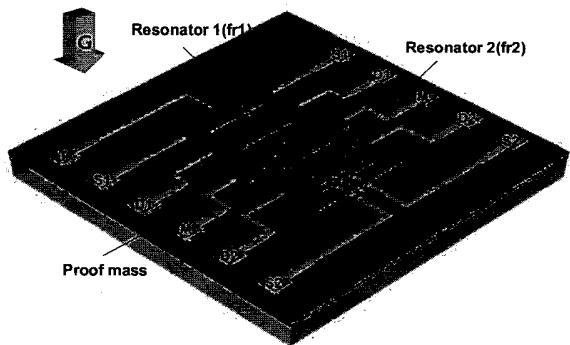  
Fig. 1. The schematic of the proposed differential resonant accelerometer(DRXL)

# VACUUM PACKAGING

For MEMS based resonant accelerometer, the vacuum packaging is definitely necessary to reduce the air damping for sustaining the resonant vibration mode. Because it is very difficult and expensive process, some research groups have announced several kinds of wafer level vacuum packaging processes until now.

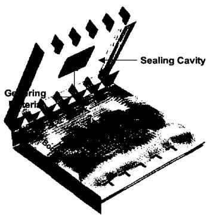  
Fig. 2. Conceptual illustration of the proposed vacuum packaging (sealing cap : pyrex glass #7740)

For the wafer level vacuum packaging of surface micromachined devices, we adapted anodic bonding with glass sealing cap wafer. But there should be some step change and roughness on the single-crystal silicon surface, and these could affect the hermetic sealing level of the anodic bonding. So CMP process for smoothing the surface of the single-crystal silicon structures is adopted. The sealing structure and bonding area around the suspended structures are shown in fig. 2. And the gettering material(Ti metal) is used to enhance the long term stability of the vacuum packaging.

# SENSING PRINCIPLE

The conceptual operating principle of the proposed DRXL is illustrated in figure 3. The basic idea is based on a fact that the effective stiffness (keffx) of this electromechanically-biased resonator can be changed by a variable gap (dx).

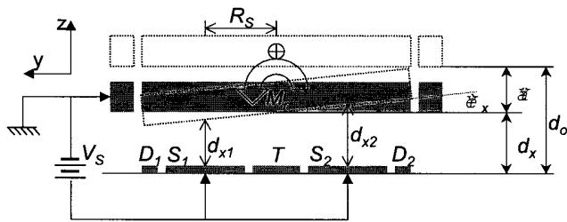

$$
f _ {r _ {x}} = \frac {1}{2 \pi} \cdot \sqrt {\frac {k _ {e f f _ {x}}}{I _ {x}}}, \tau_ {m _ {x}} = \theta_ {x} \cdot k _ {m _ {x}}, \tau_ {e _ {x}} = R _ {s} \cdot \left(F _ {e _ {s 1}} - F _ {e _ {s 2}} \right.
$$

$$
k _ {e f f _ {x}} = \frac {\partial \tau_ {e f f _ {x}}}{\partial \theta_ {x}} = \frac {\partial \left(\tau_ {m _ {x}} - \tau_ {e _ {x}}\right)}{\partial \theta_ {x}} = k _ {m _ {x}} - \frac {2 R _ {S} ^ {2} \cdot \varepsilon \cdot A _ {S} \cdot V _ {S} ^ {2}}{d _ {x} ^ {3}}
$$

(a) inner resonator structure

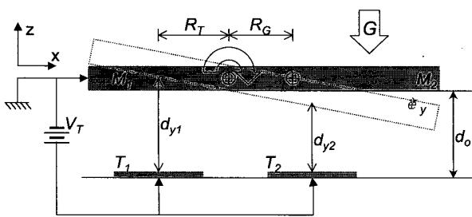  
Fig. 3. Operating principle of the proposed differential resonant accelerometer(DRXL)

$$
\tau_ {G} = F _ {G} \cdot R _ {G} = \left(M _ {1} + M _ {2}\right) \cdot G \cdot R _ {G}
$$

$$
\theta_ {y} = \frac {\tau_ {G}}{k _ {e f f _ {y}}} = \frac {(M _ {1} + M _ {2}) \cdot G \cdot R _ {G}}{k _ {m _ {y}} - \frac {2 R _ {T} ^ {2} \cdot \varepsilon \cdot A _ {T} \cdot V _ {T} ^ {2}}{d _ {o} ^ {3}}}
$$

(b) outer gimbal sturcture

In this scheme, the external acceleration(G) produces the average gap variation(δ) between the resonant vibrating mass(Mr) and the bottom electrodes because of the asymmetric mass(M1, M2) distribution. And these gap variation (dx) changes the effective stiffness (keffx) of the resonator and the resultant resonant frequency (frx) as well. Because of the complementary gap variations(δ) of the two resonators, the resultant resonant frequency outputs are differential.

# STRUCTURE DESIGN

In previous work, the torsional mode resonator was proposed for the higher Q compared with the vertical mode resonator at the same ambient pressure level [4]. The torsional mode resonator is also adopted because of the high Q characteristic.

ANSYS simulaiton was performed to estimate the resonant mode and the frequency. The simulation results is shown in Fig. 4.

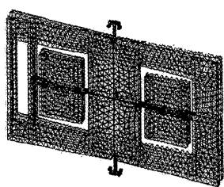  
(a) $\mathrm{fr} = 2.2\mathrm{kHz}$

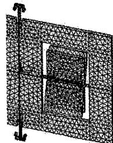  
(b) $\mathrm{fr} = 13.5\mathrm{kHz}$   
Fig. 4. The ANSYS simulation result : modal simulation

Table 1. Design parameters of the proposed DRXL   

<table><tr><td rowspan="7">Outer Glimb</td><td rowspan="4">Mass</td><td>M1</td><td>1000a1200a40[S]/0.84a107[S]</td></tr><tr><td>M2</td><td>1000a1200a40[S]/1.12a107[S]</td></tr><tr><td>Ir</td><td>7.09a10-14[S S]</td></tr><tr><td>R</td><td>RG=473[S]/Rr=500[S]</td></tr><tr><td rowspan="2">Beam</td><td>LWT</td><td>80a8a40[S]</td></tr><tr><td>Kmy</td><td>6.4a10-6[Nm]</td></tr><tr><td colspan="2">fY</td><td>2.48 [MHz]</td></tr><tr><td rowspan="6">Inner Resonator</td><td rowspan="3">Mass</td><td>M</td><td>400a600a40[S]/2.24a10-6[S]</td></tr><tr><td>Ix</td><td>Ix=6.74a10-16[S S]</td></tr><tr><td>RS</td><td>Rs=150[S].</td></tr><tr><td rowspan="2">Beam</td><td>LWT</td><td>80a6a40[S]</td></tr><tr><td>Knx</td><td>2.61a10-6[Nm]</td></tr><tr><td colspan="2">fX</td><td>[Si(S)Ir]</td></tr><tr><td rowspan="3" colspan="2">Electrode</td><td>Sensing</td><td>400a250[a]/As=1.00a10-7[m2]</td></tr><tr><td>Tuning</td><td>860a100[a]/At=8.6a10-6[m2]</td></tr><tr><td>Gap</td><td>2.5[a]</td></tr></table>

The design parameter of the differential resonant accelerometer(DRXL) is summarized in Table. 1. As mentioned above, the proposed accelerometer is composed of two inner resonators and one outer gimbal. The resonant frequency of the outer gimbal is related with the sensitivity of the accelerometer and the frequency of the inner resoantor is related with the bandwidth and the resolution of the accelerometer. So, the accelerometer is designed to increase the sensitivity and the bandwidth making the resonant frequency of the outer gimbal lower and making the resonant frequency of the inner resonator higher. The

The matlab simulation was performed to predict the sensitivity of the gravity. The simulation result is shown in Fig. 5. As shown below, the characteristic of the single resoantor becomes non-linear in high gravity range. But the differential characteristic of the accelerometer is linearized in that range. This electrostatic stiffness changing effect has a merit of an electrical tunability, so we can finely adjust the sensitivity of the resonant accelerometer at the final stage. And this is a very useful method for removing the effect of the fabrication error.

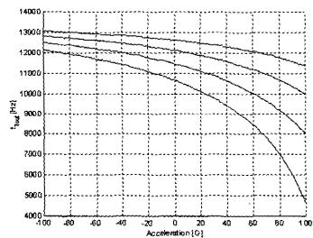  
(a) Resonant frequency vs. applied acceleration

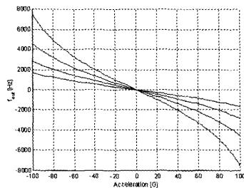  
(b) Differential output vs. applied acceleration   
Fig. 5. Differential resonant accelerometer output characteristics

# FABRICATION

The designed accelerometer is fabricated using mixed micromachining process which is composed of a silicon-glass bonding process and conventional surface micromachining process. The thickness of the structure is designed with $40~\mathrm{um}$ to increase the sensitivity of the accelerometer. The fabrication process flow is shown in Fig. 6.

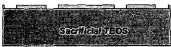

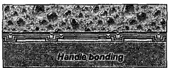

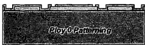

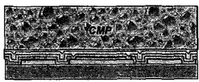

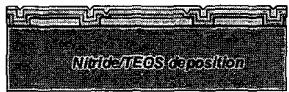

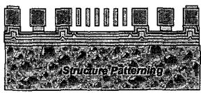

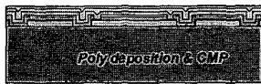

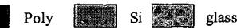

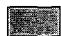

TEOS

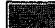

Nitride

Poly

si

glass

Fig. 6. The fabrication process flow: mixed micromachining process

The 1um-thick sacrificial TEOS(tetra-ethyl-ortho-silicate) is deposited and patterned on $<111>$ single crystal silicon wafer. To protect the bottom electrode, a 3000 Å LPCVD nitide is deposited and patterned. A 5000 Å LPCVD polysilicon for bottom electrode is deposited and POCL3 doping is performed. The passivation layers which are composed of 5000 Å LPCVD nitide and 1 um TEOS is continuously deposited to isolate the bottom electrode from the substrate. The 6 um-thick LPCVD polysilicon is deposited as a bonding layer with the pyrex #7740 glass. To smoth the surface of the polysillicon for the silicon-glass bonding, CMP(Chemical Mechanical Polishing) process is performed and then the pyrex substrate is bonded with the wafer. The CMP process is also performed to make the 40 um-thick single-crystal silicon for the accelerometer structure. And then, Cr/Au metal pad is defined by lift-off process. The silicon structure is etched by Deep silicon etching. Finally, the accelerometer is released by HF wet etching and DDMS(dichlorodimethylsilane) coating is done to prevent the stiction of the structtrue[5]. The SEM picture of the fabricated DRXL is shown in Fig. 7. To make the DRXL vacuum sealed, a pyrex #7740 glass is fabricated using the HF wet etching with 1000 Å polysilicon etch mask. The glass wet etching to make sealing cavity and pad feedthrough is performed is simultaneously to reduce the process time and cost.

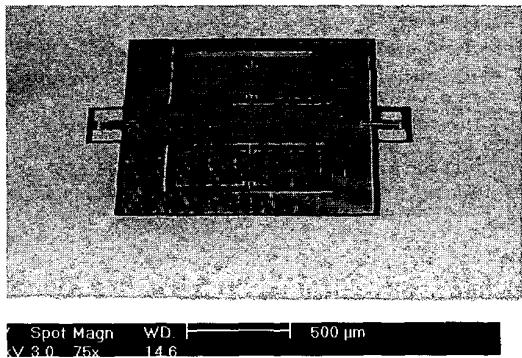  
Fig. 7. The SEM picture of the fabricated differential resonant accelerometer(DRXL)

For the vacuum sealing of the fabricated DRXL, the silicon wafer and a glass sealing cap is anodically bonded in 350 $^\circ \mathrm{C}$ , 650 V condition. The wafer level bonded DRXL and a enlarged view of the DRXL are shown in Fig. 8.

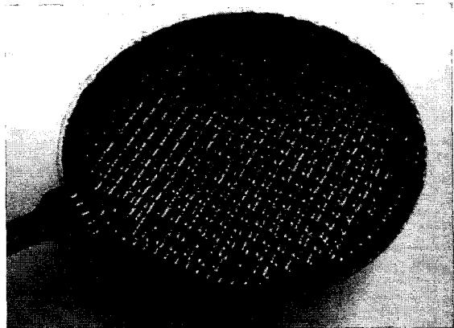

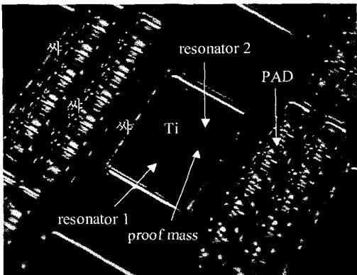  
(a) Wafer level vacuum packaged DRXL   
(b) The enlarged view of the vacuum packaged DRXL   
Fig. 8. The vacuum packaged DRXL

# MEASUREMENT

After dicing the bonded wafer, each vacuum packaged DRXL is mounted on the 12 pin PCB and then bonded Au wire. The charge amplifier circuit was used to convert the change of a capacitance to the voltage. The DRXL mounted on the PCB is shown in Fig. 9.

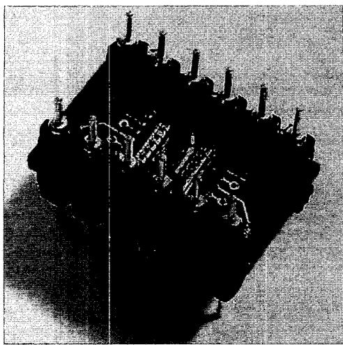  
Fig. 9. The DRXL mounted on the PCB

The overall block diagram to estimate the performance of the DRXL is shown in Fig. 10. For a self-start and a self-sustained oscillation of the resonator, the driving circuit and the resonator form a feedback control loop. The resonant frequency change of the accelerometer can be precisely measured by using an over frequency sampling technique.

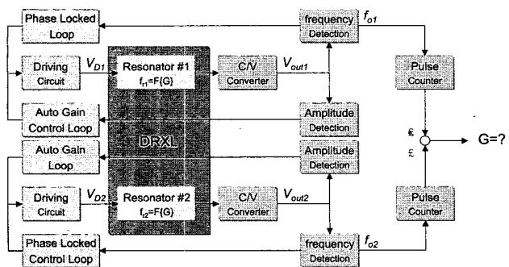  
Fig. 10. The overall block diagram to estimate the performance of the DRXL

The DRXL with self-sustained oscillator loop is tested for the input gravity of $\pm 10\mathrm{G}$ range. The DRXL shows the $8.125\mathrm{Hz} / 1\mathrm{G}$ at the $6928\mathrm{Hz}$ resonant frequency. The sensitivity can be increased to $16.7\mathrm{Hz}/\mathrm{G}$ making the nominal frequency $6508\mathrm{Hz}$ . The output frequency

characteristics according to the input gravity is shown in Fig. 11.

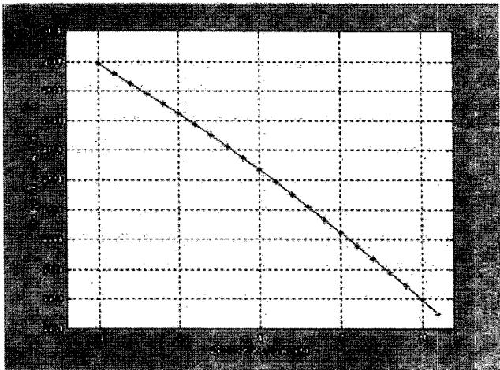  
Fig. 11. The output characteristics of the DRXL at the nominal frequency of $6928\mathrm{Hz}$

The bandwidth of the DRXL is measured applying to the input of the accelerometer with the unit step signal. The estimated bandwidth is more than $112\mathrm{Hz}$ . The measured result is shown in Fig. 12.

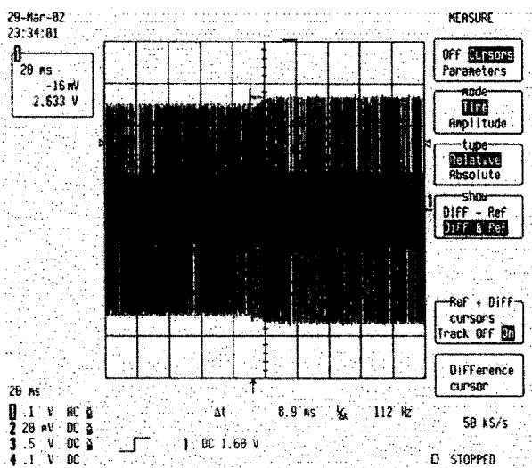  
Fig. 12. The measured bandwidth of the DRXL

The repeatability is also estimated. The output frequency is measured and the power is off for $50\mathrm{min}$ and then the output frequency is measured. This measurement sequence is repeated in several times. The measured result is shown in Fig. 13. The equivalent gravity for the repeatability is $14.4\mathrm{mG}$ .

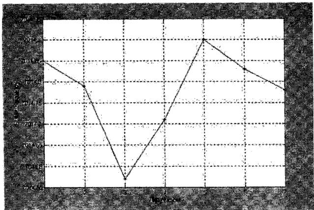  
Fig. 13. The measured repeatability of the DRXL

[4]B. L. Lee, et al., “A Novel Resonant Accelerometer : Electrostatic Stiffness Type”, International Conference on Solid State Sensors and Actuators(Transducer '99), pp.1546-1549   
[5]B. H. Kim, et al., “A New Class of Surface Modifier for Stiction Reduction,” Twelfth International Conference on Micro Electro Mechanical System (MEMS '99), 1995, pp.189-193   
[6]M. A. Meldrum, "Application of vibration beam technology to digital acceleration measurement," Sensor and Actuators, Vol. A21-A23, 1990, pp377-380   
[7]T. V. Rozhart, et al., "An inertial-grade, micromachined vibrating beam accelerometer," Eighth International Conference on Solid-State Transducers and Actuators (Transducers '95), 1995, pp.659-662   
[8]Yoshiteru Omura, et al., "New Resonant Accelerometer Based on Rigidity Change," International Conference on Solid State Sensors and Actuators (Transducers '97), pp.855-858

# CONCLUSION

A differential resonant accelerometer, which utilizes the electrostatic stiffness changing effect of an electrostatic torsional actuator, was proposed using $<111>$ single-crystal silicon as the structure material. The mixed-micromachining process is developed using pyrex glass substrate and 40 um-thick single crystal silicon with glass cap.

The fabricated differential resonant accelerometer(DRXL) shows the about sensitivity of $8\mathrm{Hz / G}$ in the range of $\pm 10\mathrm{G}$ , bandwidth of $100\mathrm{Hz}$ , repeatability of $14.4\mathrm{mG}$ and bias stability of $2.76\mathrm{mG}$ .

The performance of the DRXL can be enhanced if the footing effect of the Deep RIE, which results in the mass reduction and the spring constant. These side effects make the performance of the accelerometer degraded. The research are undergone to reduce the these side effects and the estimation of the accelerometer is under way.

# Acknowledgements

The authors sincerely appreciate that the device was fabricated by Microsystems Technology Center in Seoul National University, and would like to special thanks to Samsung Electronics Co. and Samsung Advanced Institute of Technology for their contribution.

This work was supported by ADD (Agency for Defense Development) through ACRC (Automatic Control Research Center) under Grant AC-041.

# References

[1]B. L. Norling, "Superflex: a synergitic combination of vibrating beam and quartz flexure accelerometer," Journal of the Institute of Navigation, Vol.34, No.4, 1988, pp. 337-353   
[2]D. W. Burns, et al., "Resonant microbeam accelerometer," International Conference on Solid-State Sensors and Actuators (Transducers '95), pp.659-662   
[3]Trey A. Rossig, et al., "Surface-Micromachined Resonant Accelerometer," International Conference on Solid State Sensors and Actuators (Transducers '97), pp.869-862