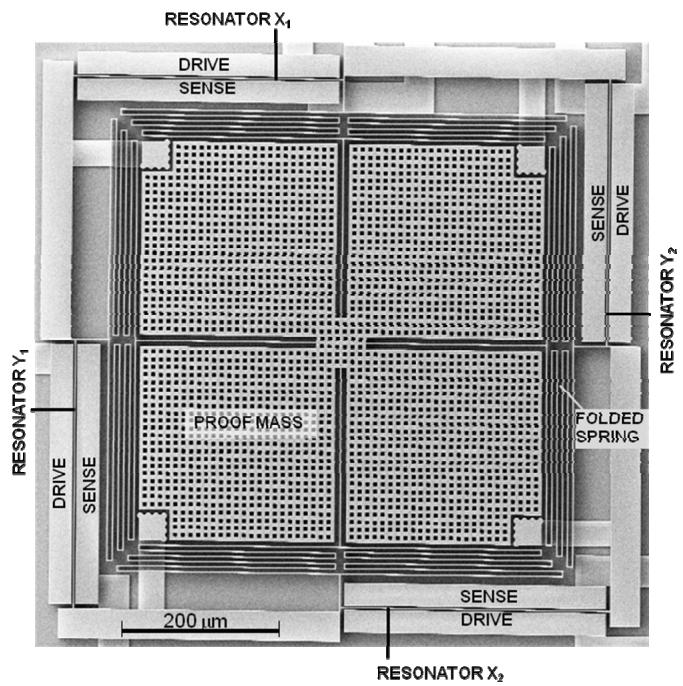
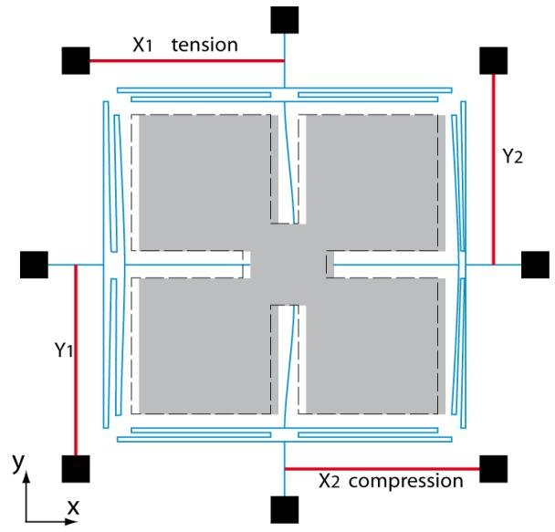
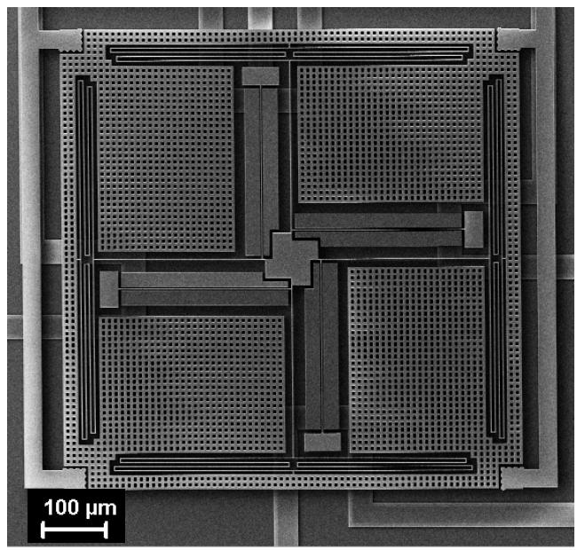
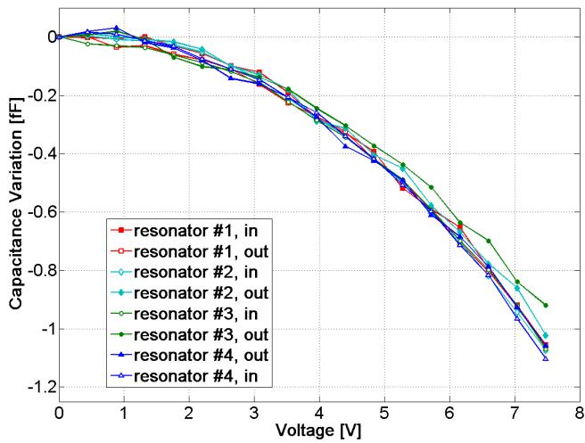
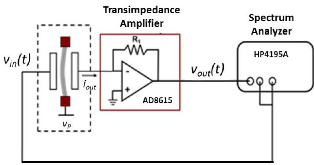
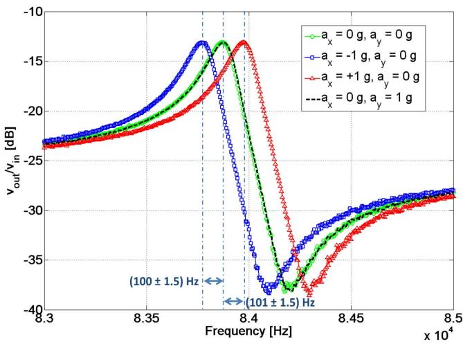
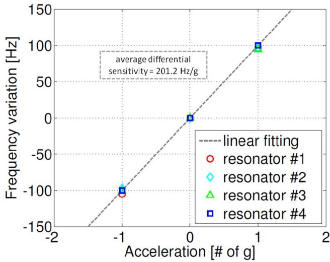

# A NEW BIAXIAL SILICON RESONANT MICRO ACCELEROMETER

C. Comi1, A. Corigliano1, G. Langfelder1, A. Longoni1, A. Tocchio1, B. Simoni2

$^{1}$ Politecnico di Milano, Italy

$^{2}$ STMicroelectronics, Italy

# ABSTRACT

A new biaxial silicon resonant accelerometer characterized by a high sensitivity and a low cross-axis sensitivity is presented in this paper. The device allows for the simultaneous measure of acceleration acting along two different axes using two couples of resonating slender beams linked to two couples of flexible beams and to a proof mass. The conceptual scheme used for the biaxial resonant accelerometer is similar to the one applied for the uniaxial resonant accelerometer reported in [1]-[3]. Experimental results demonstrate a differential sensitivity of $201\mathrm{Hz / g}$ around a resonance frequency of $84\mathrm{kHz}$ .

# INTRODUCTION

As an alternative to parallel-plate capacitive accelerometers, in which the possibility of pull-in represents a limit to the device scaling, several MEMS uniaxial resonant accelerometers have been proposed in the scientific literature (see e.g. the early contributions in [4], [5] and the recent ones [6]-[8]). In general terms, a resonant accelerometer is a device containing one or more resonating beams; the external acceleration is computed from the measurement of the change in the frequency of the resonating beams caused by the device acceleration. The change in the resonating frequency can in turn be generated by a variation in the axial force of the resonators, by a variation in the flexural inertia or by a variation in the electric stiffness. The new scheme presented in [1]-[3] was based on the variation of axial forces and was characterized by reduced dimensions, high sensitivity and a good resolution, obtained at a relatively low quality factor.

To the authors' knowledge, few proposals have been published concerning biaxial resonant accelerometers; early contributions are e.g. those discussed in [9]-[11]. In [9] the authors proposed a two-axis resonant accelerometer based on a square proof mass linked to resonant bridges on its four sides; the in-plane acceleration causes differential axial forces in the micro-bridges, thus causing a change in their frequency. The device proposed in [10] is based on coupled parallel plate resonators in which the variation of flexural stiffness caused by an external acceleration is linked to a frequency change. A discussion on various possible geometrical configurations was given in [11].

The purpose of the present paper is to present new results of an ongoing research focused on the design and fabrication of innovative resonant micro-accelerometers.

A biaxial resonant accelerometer with a single proof mass has been designed, fabricated and tested, based on the same conceptual scheme used for the uniaxial resonant accelerometer reported in [1]-[3]. An optimization of the

geometry allows to obtain reduced dimensions (proof mass of $525 \times 525 \, \mu \mathrm{m}^2$ ), and an high sensitivity of $201 \, \mathrm{Hz/g}$ for each axis at a packaging pressure around $1 \, \mathrm{mbar}$ with an initial resonant $Q$ factor around $200$ .

The paper is organized as follows: the Design and Fabrication Section contains a description of the new biaxial accelerometer and a discussion on its mechanical behavior; in the third Section a mechanical characterization of the device is presented, followed by a Section containing the main experimental results obtained so far; concluding remarks are finally given in the last Section.

# DESIGN AND FABRICATION OF THE BIAXIAL RESONANT ACCELEROMETER

Figure 1 shows a SEM image of the new biaxial accelerometer, fabricated using the $\mathrm{THELMA}^{(\mathrm{C})}$ surface micromachining process of STMicroelectronics. The device features a monolithic inertial mass suspended by four folded springs, connected to four resonating slender beams. The resonators are located outside the proof mass between a pair of sensing and driving plates and they are anchored to the substrate at one end and attached to the folded springs at the other end. The position of the resonator, very close to the anchor points of the springs has been optimized in order to maximize the axial force in the resonators caused by an external acceleration (see [3]), thus obtaining a high sensitivity with reduced dimensions. The peculiar spring configuration allows the mass to translate in both in-plane directions and to rotate around a central axis perpendicular to the substrate. The first three modes of the device corresponding to these three rigid body motions have frequencies of about $1\mathrm{kHz}$ . The nominal frequency of the resonators is $80\mathrm{kHz}$ , considering the resonating beams with $1.2\mu \mathrm{m}$ thickness and $352\mu \mathrm{m}$ length.

An external acceleration in the $x$ direction (see Fig. 2), makes the seismic mass translate so that one pair of the resonating beams $(\mathrm{X}_1, \mathrm{X}_2$ in Figs. 1 and 2) is subject to axial forces $N$ and $-N$ of opposite sign, proportional to the external inertia force (one resonator is compressed, the other one is stretched). The frequency $f$ of the axially loaded beam can be expressed as:

$$
f = f _ {0} \sqrt {1 + \alpha \frac {N L ^ {2}}{E I}} \quad \text {w i t h} \quad f _ {0} = \frac {c ^ {2}}{2 \pi L ^ {2}} \sqrt {\frac {E I}{\rho A}}, \tag {1}
$$

where: $L$ = resonator length, $I$ = moment of inertia, $A$ = cross area, $E$ = Young's modulus, $\rho$ = mass density and $c$ = 4.730 and $\alpha$ = 0.0246 for a doubly clamped resonator.

  
Figure 1: SEM picture of the biaxial resonant accelerometer. The proof mass area is $(525 \times 525) \mu m^2$ .   
Figure 2: Schematic view of the device working principle: effect of an external acceleration $a$ in the $x$ -direction

The stiffness change is of opposite sign for the two beams thus resulting in a separation of their resonance frequencies.

An alternative geometric configuration, based on the same principle, in which the resonators are located inside the proof mass, has been designed and fabricated; a SEM image is shown in Fig. 3. This second geometry allows for a further reduction of the device size at fixed sensitivity (or for a higher sensitivity at equal size); its characterization is currently under study.

  
Figure 3: SEM picture of a second configuration for the biaxial resonant accelerometer, currently under study.

# MECHANICAL CHARACTERIZATION OF RESONATORS

Each resonator can be electrically excited through a first driving parallel-plate and its displacement can be measured through a second capacitive sensing plate (see Fig. 1). These stators are symmetrically designed aside the resonators with the same nominal gap space in between.

Capacitance versus voltage (C-V) measurements were initially performed in order to check this symmetry and the performance repeatability of the resonators. Measurements were performed using the characterization platform for M/NEMS previously described in [12].

Figure 4 shows the experimental results of these tests: given the symmetrical design of the stators, two C-V curves per resonator can be measured by deflecting the beam in both directions, alternatively using the two stators for sensing and driving. A total of eight measurements belonging to the same device is reported in the figure, from which a good repeatability among the different resonators can be appreciated. This good repeatability is the result of an increased width of the resonating beams with respect to previous works related to uniaxial resonant accelerometers [1]-[3], [13]. As a consequence, the process random variations mainly in the over-etching phase, during the release of suspended parts, afflict the device mechanical performance with a lower impact. In other words the elastic stiffness and the resonance frequency have less dispersed values. This widening of the minimum beam dimension that improves the repeatability comes at the cost of a reduced displacement of the beam ( $\sim$ 0.5 fF of capacitance variation @ 5.5 V of applied voltage, with respect to $\sim$ 1.4 fF obtained in the same conditions in previous productions

of uniaxial accelerometers).

  
Figure 4: Capacitance variation vs. voltage measured on the four resonators, using the drive and sense electrodes in both directions.

# EXPERIMENTAL RESULTS

The device was connected to a spectrum analyser (HP4195A) through a low-noise transimpedance amplifier (TIA) readout board, as shown in Fig. 5. The implemented low-noise TIA front-end is based on the commercial component AD8615, with a feedback resistor $R_{I}$ of $1.2\mathrm{M}\Omega$ . The circuit provides a voltage output $\nu_{out}(t)$ , proportional to the motional current $i_{out}(t)$ which is linearly dependent on the beam displacement and in turn on the external acceleration.

  
Figure 5: Readout setup for evaluation of resonators spectral response. The beam is excited through $\nu_{in}(t)$ ; the current generated at the sensing electrode is converted into voltage $\nu_{out}(t)$ through a transimpedance stage. Its output is fed to the spectrum analyzer. $V_{P} = 4V$ .

The resonators were excited, using the signal from the spectrum analyser, in a range of frequencies between $83\mathrm{kHz}$ and $85\mathrm{kHz}$ - near to the resonance frequency predicted by FEM mechanical simulations equal to $80\mathrm{kHz}$ . The central light curve marked with circles in Fig. 6 reports the spectral response when the device is subject to zero

external acceleration along the sensing axes $x$ and $y$ . The curve shows a peak resonance frequency at $83.8\mathrm{kHz}$ , with the typical anti-resonance peak caused by the presence of a cross-talk parasitic capacitance. This frequency is higher than the predicted one since the etching process produced a over-etch slightly smaller than the expected one, leading to a resonator thickness of $1.26\mu \mathrm{m}$ .

  
Figure 6: Spectral response magnitude of $\nu_{out} / \nu_{in}$ for the resonator $X_{1}$ , for an acceleration of $\pm 1 \, \text{g}$ in the $x$ -direction and for $1 \, \text{g}$ in the $y$ -direction (dashed curve).

  
Figure 7: Shift in the peak frequency for the four resonators as a function of the external acceleration applied in their sensing direction.

The same measurement was then repeated for different combinations of acceleration in the $x$ and $y$ directions. Curves with square and triangle markers in Fig. 6 report the effect of an acceleration of $-1\mathrm{g}$ and $+1\mathrm{g}$ respectively, acting in the $x$ direction for the resonator $\mathrm{X}_1$ . Leftward and rightward shifts in the resonance frequency of $\sim 100\mathrm{Hz}$ per resonator can be observed. The difference observed in the

two shifts is within the measurement resolution $(\pm 1.5\mathrm{Hz})$   
Finally, the black dashed curve is obtained for a null acceleration in the $x$ direction and an acceleration of $+1\mathrm{g}$ in the $y$ direction, again for the resonator $\mathrm{X}_1$ . The fact that no peak shift is experimentally observed confirms that the cross sensitivity is at least lower than the measurement resolution set by the spectrum analyser.   
Figure 7 finally summarizes the sensitivity performance for the 4 resonators $(\mathrm{X}_1, \mathrm{X}_2, \mathrm{Y}_1, \mathrm{Y}_2)$ showing an average differential sensitivity of $201.2\mathrm{Hz / g}$ in both the sensing directions and again a good repeatability of performances across the different resonators.   
In the final operating conditions each beam will be the resonating element of an oscillating readout circuit similar to the one described in [3]. By means of a comparison with the experimental results obtained for the uniaxial version of the resonant accelerometer, the resolution of the biaxial accelerometer coupled to a board level circuit is foreseen to be around few hundreds of $\mu \mathrm{g} / \sqrt{\mathrm{Hz}}$ .

# CONCLUSIONS

An innovative biaxial resonant accelerometer has been designed and realized. The final device has extremely reduced dimensions and high sensitivity. A readout circuit that allows a careful determination of the frequency shift due to the external acceleration is under development.

A second geometrical configurations for the biaxial resonant accelerometer has been designed and realized, the relevant experimental results and a comparison of the performances of the two proposed configurations will be published in forthcoming papers.

Work in progress concerns the study of the biaxial accelerometer response under a wider spectrum of external accelerations input, the careful examination of cross-sensitivities and possible thermal drift effects.

# ACKNOWLEDGEMENTS

The contribution of Ing. Livio Domenella during the design phase is gratefully acknowledged. Part of the experimental setup used in this work was funded by Fondazione Cariplo in 2009, within the project "Surface Interactions in Micro and Nano Devices".

# REFERENCES

[1] C. Comi, A. Corigliano, A. Merassi, B. Simoni. "A surface micromachined resonant accelerometer with high resolution". Proc. 7th European Solid Mechanics Conference, Lisbon, 7-11 September, CD-Rom, 2009.   
[2] C. Comi, A. Corigliano, G. Langfelder, A. Longoni, A. Tocchio, B. Simoni, “A high sensitivity uniaxial resonant accelerometer”. Proc. MEMS2010, pp. 260-263.   
[3] C.Comi, A. Corigliano, G. Langfelder, A. Longoni, A. Tocchio, B. Simoni. "A resonant microaccelerometer

with high sensitivity operating in an oscillating circuit". J. Microelectromech. Syst., vol. 19, $\mathfrak{n}^{\circ}5$ pp. 1140-1152.   
[4] T. A. Roessig, R. T. Howe, A. Pisano, and J. H. Smith, "Surface-micromachined resonant accelerometer". Proc. Transducers '97, Chicago, vol. 2, pp. 859-862, 1997.   
[5] M. Aikele, K. Bauer, W. Ficker, F. Neubauer, U. Prechtel, J. Schalk and H. Seidel, "Resonant accelerometer with self-test". Sensors and Actuators A, vol. 92, pp. 161-167, 2001.   
[6] R.H. Olsson, K.E. Wojciechowski, M.S. Baker, M.R. Tuck and J.G. Fleming, "Post-CMOS-compatible aluminum nitride resonant MEMS accelerometers". J. Microelectromech. Syst., vol. 18, pp. 671-687, 2009.   
[7] D. Pinto, D. Mercier, C. Kharrat, E. Colinet, V. Nguyen, B. Reig, S. Hentz, “A small and high sensitivity resonant accelerometer”. Proc. Chemistry, vol. 1, pp. 536-539, 2009.   
[8] D. Chen, Z. Wu, Lei, Liu, X. Shi, J. Wang. "An Electromagnetically Excited Silicon Nitride Beam Resonant Accelerometer". Sensors, vol. 9, pp. 1330-1338, 2009.   
[9] S.C. Chang, M.W. Putty, D.B. Hicks, C.H. Li. "Resonant-bridge two-axis microaccelerometer". Sensors and Actuators, A21-A23, pp. 342-345, 1990.   
[10] O. Tabata, T. Yamamoto, “Two-axis detection resonant accelerometer based on rigidity change”. Sensors and Actuators A, vol. 75, pp. 53-59, 1999.   
[11] D.H. Hwang, Y.C. Lo, K. Chin, "Design considerations of the biaxial frequency-shifted microaccelerometer". Proc. SPIE, vol. 4593, pp. 62-71, 2001.   
[12] G. Langfelder, A. Longoni, F. Zaraga, "Low-noise real-time measurement of the position of movable structures in MEMS", Sensors and Actuators A 148 (2008) 401-406.   
[13] C. Comi, A. Corigliano, G. Langfelder, A. Longoni, A. Tocchio, B. Simoni, “A new two-beam differential resonant micro accelerometer”, IEEE Sensors Conference 2009, 158—163.