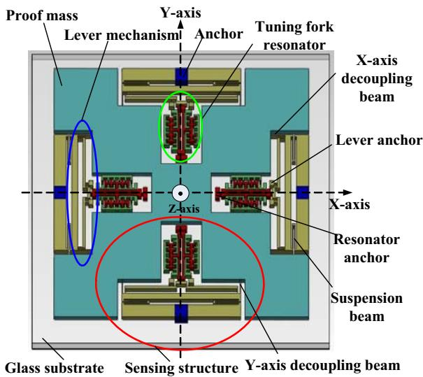
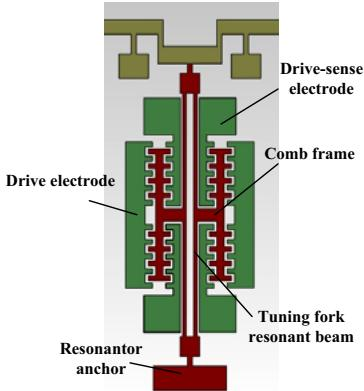
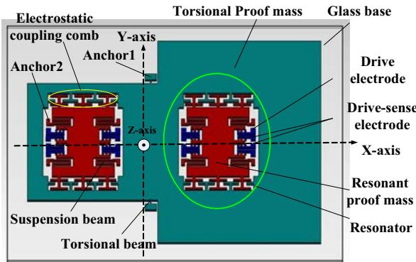
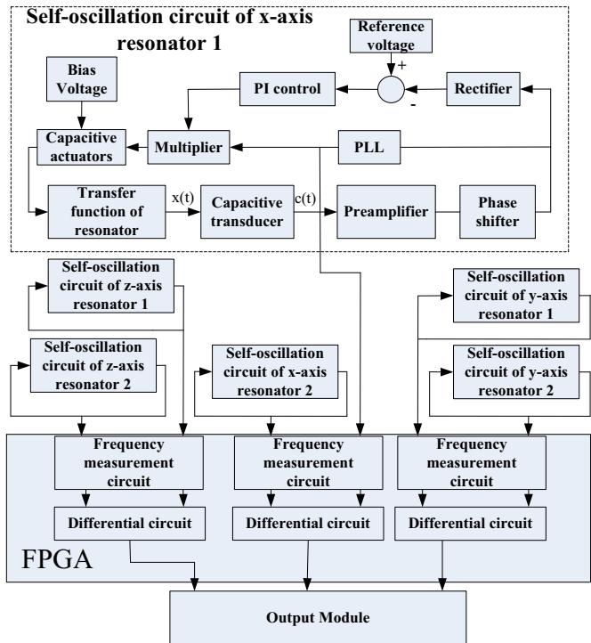
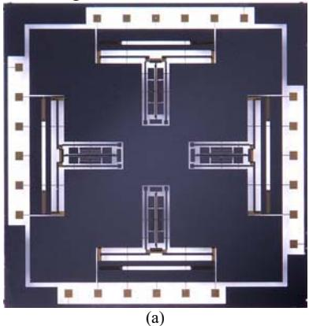
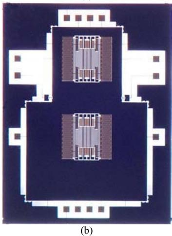
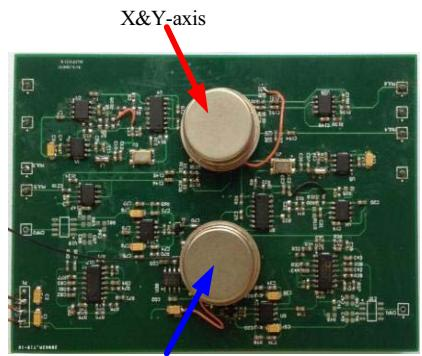
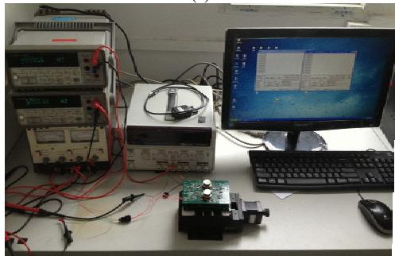

# A New Silicon Triaxial Resonant Micro-accelerometer

Bo Yang $^{1,2*}$ Bo Dai $^{1,2}$

1. School of Instrument Science & Engineering, Southeast University   
2. Key laboratory of Micro-Inertial Instrument and Advanced Navigation Technology, Ministry of Education Nanjing, P.R. China *yangbo20022002@163.com

Hui Zhao $^{1,3}$ and Xiaojun Liu $^{1,4}$

3. College of Automation, Nanjing University of Science and Technology

4.School of Information and Control, Nanjing University of Information Science&Technology Nanjing, P.R. China

Abstract-We present the design, fabrication, and testing of a new silicon triaxial resonant micro-accelerometer. It is characterized by a biaxial planar resonant micro-accelerometer and a vertical resonant micro-accelerometer based on electrostatic stiffness. The biaxial resonant micro-accelerometer, which is decoupled in two sensitive directions by four pairs of decoupling beams, senses the acceleration by two pairs of tuning fork resonators with an excellent linearity and uniformity. The vertical resonant micro-accelerometer, where the sensing movement of the accelerometer is decoupled with oscillation of the plane resonators, senses the acceleration by electrostatic stiffness. Six analog self-oscillation circuits and a digital frequency measurement circuit based on FPGA are designed to control the triaxial resonant micro-accelerometer. The standard three-mask Deep Dry Silicon on Glass (DDSOG) process is used for fabrication of the triaxial decoupled resonant micro-accelerometer. Experimental results demonstrate a mechanical sensitivity of $52.57\mathrm{Hz / g(x - axis)}$ $51.64~\mathrm{Hz / g(y - axis)}$ and 31.65 $\mathrm{Hz / g(z - axis)}$ and a bias stability of $0.294\mathrm{mg(x - axis)}$ $0.278\mathrm{mg(y - }$ axis) and $0.727\mathrm{mg(z - axis)}$

Keywords—triaxial resonant micro-accelerometer; self-oscillation circuit; Deep Dry Silicon on Glass (DDSOG) process; bias stability

# I. INTRODUCTION

Based on sensing principle, MEMS accelerometers are categorized into piezoresistive accelerometers, capacitive accelerometers and resonant accelerometers. In resonant accelerometers, the external acceleration produces a recordable shift of the device resonance frequency or of some part of it. Due to the merits of the good linearity, the high accuracy and the process compatible with conventional silicon micromachining technology, a variety of resonant micro-accelerometers have been developed[1-3]. However, most of the previous micro-accelerometers using the frequency shift principle were only capable of measuring 1-D acceleration. Only few proposals have been published concerning biaxial or triaxial resonant accelerometers[4-7]. The device proposed by [4] is a two-axis detection resonant accelerometer based on coupled parallel plate resonators on

which the variation of flexural stiffness are caused by an external acceleration. Nevertheless, the four resonators have different sensitivities. A two-axis resonant accelerometer is proposed by literature [5], however, the input acceleration in a direction will cause the distortion of resonant microbeam in the vertical direction. Literature [6] introduces a new biaxial silicon resonant micro-accelerometer which could successfully decouple a two-axis signal.

Similarly, most of the resonant micro-accelerometers studied are currently used to measure the planar acceleration. Only a few resonant accelerometers with out-of-plane resonators that can measure the acceleration in the vertical plane are investigated [8-11]. A resonant accelerometer with a single Z-axis resonator is researched in the literature [8-9]. However, the out-of-plane resonators have a large nonlinearity and are susceptible to the influence of the electrostatic pull-in effect. An alternative proposal [10] makes use of a tilting proof mass and two torsional resonators. Nevertheless, the sensing movement is still coupled with the oscillation of torsional resonators. In addition, a resonant accelerometer based on the electromagnetically excitation [11] has a poor process compatibility and bulky volume.

This paper reports a new silicon triaxial resonant micro-accelerometer which consists of a new biaxial decoupled resonant micro-accelerometer (X-axis and Y-axis) and a new Z-axis resonant micro-accelerometer based on electrostatic stiffness. Presented in this paper are the structure design, the measurement and control circuit, the fabrication and the experiment of the new silicon triaxial resonant micro-accelerometer.

# II. STRUCTURE DESIGN

The structure of the new triaxial resonant micro-resonator is shown in Fig.1. The new biaxial decoupled resonant micro-accelerometer shown in Fig.1(a) consists of four same sensing structures and a proof mass. The sensing structure is constituted by decoupling beams, the lever mechanism and

the tuning fork resonator (shown in Fig.1(b)). When the X-axis acceleration is input, the proof mass will be driven to move along the X-axis by the inertial force. Due to the rigid stiffness of the X-axis decoupling beam along the X-axis, the lever mechanism in the X-axis is spurred to move with the proof mass together along the X-axis. However, the lever mechanism and the resonator in the Y-axis remain stationary owing to soft stiffness of the Y-axis decoupling beam along the X-axis, which realizes decoupling between two orthogonal axes. The inertial force amplified by the lever mechanism is applied to the resonant beam, which will bring the change in the natural frequency of resonators in the X-axis. By measuring the frequency change in the closed-loop self-oscillation system, the acceleration can be detected. The situations are similar in the input acceleration of y-axis.

The frequency change in $\mathbf{x}$ -axis input acceleration $\mathrm{a}_{\mathrm{x}}$ is

$$
\Delta f _ {x} = S _ {x} a _ {x} + \frac {1}{8} f _ {0 x} \left(\frac {\lambda L _ {x} ^ {2} m D _ {x} A _ {x}}{E h w ^ {3}} a _ {x}\right) ^ {3} \tag {1}
$$

$$
D _ {x} = D _ {y} \approx \frac {k _ {L}}{2 \left(k _ {D} + k _ {S} + k _ {L}\right)} \tag {2}
$$

Where $S_{\mathrm{x}}$ is the scale factor of x-axis, $S_{\mathrm{x}} = B_{\mathrm{x}} m A_{\mathrm{x}} D_{\mathrm{x}}$ and $B_{\mathrm{x}} = \lambda L_{\mathrm{x}}^{2} f_{0\mathrm{x}} / (\mathrm{Ehw}^{3})$ , $A_{\mathrm{x}}$ is the amplification factor of lever mechanism, $k_{\mathrm{D}}$ is the stiffness of decoupling beam, $k_{\mathrm{S}}$ is the stiffness of suspension beam, $k_{\mathrm{L}}$ is equivalent stiffness of lever mechanism.

The structure of the new Z-axis resonant micro-accelerometer is shown in Fig.1(c). The bias voltage is applied on the electrostatic coupling combs between the torsional proof mass and the resonant proof mass. The electrostatic force and electrostatic stiffness are generated. When the Z-axis acceleration is input, due to the imbalance of the torsional proof mass in the left and the right, the torsional proof mass will be rotated through the torsional beam around the Y-axis. The overlapping area of the electrostatic coupling combs will be changed, which will cause the change in the electrostatic force and electrostatic stiffness. Therefore, the natural frequency of the resonator is altered as a result of the change in the electrostatic stiffness. By measuring the frequency changes in the closed-loop self-oscillation system, the acceleration can be detected.

The frequency in $Z$ -axis input acceleration $\mathbf{a}_{\mathrm{z}}$

$$
f \approx f _ {0} + S _ {z} a _ {z} \tag {3}
$$

Where $f_{0} = (\sqrt{(k - k_{e}h) / m}) / (2\pi)$ , $S_{z}$ is the scale factor, and $S_{z} = n\varepsilon LV^{2}Bk_{a} / (4\pi^{2}f_{0}d^{3}mk_{o})$ , $k$ is the stiffness coefficient of the suspension beam, $V$ is the bias voltage of the electrostatic coupling beam, $k_{e} = 2n\varepsilon LV^{2} / d^{3}$ , $k_{o}$ is the torsional stiffness, $k_{a}$ is torque coefficient, $m$ is the resonant proof mass, $B$ is the equivalent distance from the electrostatic coupling combs to Y-axis.

  
(a)

  
(b)   
(c)   
Fig.1.The scheme of the triaxial resonant micro-accelerometer. (a) The biaxial decoupled resonant micro-accelerometer(X-axis and Y-axis). (b) Partial view of tuning fork resonator.(c)The Z-axis resonant micro-accelerometer based on electrostatic stiffness.

# III. MEASUREMENT AND CONTROL CIRCUIT

The scheme of the measurement and control circuit of the triaxial resonant micro-accelerometer is shown in Fig.2. The entire circuit consists of six self-oscillation circuits and a frequency measurement circuit based on FPGA. The self-oscillation circuit is used to drive the resonator and track the natural frequency of the resonator. In the self-oscillation

circuit, the displacement of resonator is converted into capacitance by capacitive transducer. The change in the capacitance is detected by the preamplifier. In order to achieve the self-oscillation system, the phase is adjusted by the phase shifter module. Then the signal is divided into two branches: one branch which is input to Phase-Locked Loop(PLL) is used to track the natural frequency of the resonator. The other branch which constitutes an Auto Gain Control(AGC) is used to control the vibration amplitude of the resonator at a stable value. The amplitude is obtained by the rectifier module and compared with the reference voltage. The error is utilized to control the output of the PI control module. The output of the PI control module is modulated onto the output of the PLL. Finally, the voltage is applied to the capacitive actuator of the resonator and the self-oscillation is implemented.

A digital circuit based on FPGA is designed to measure the frequency of the self-oscillation system by the multi-cycle frequency measurement method. A common gate signal with a known cycle is set. In the cycle, one counter is used to calculate the number of cycles of the self-oscillation system. The other counter is used to calculate the number of cycles of a known clock signal. Then the frequency of the self-oscillation system can be gained by the arithmetic. Finally, the signal output of every axis can be obtained by the differential circuit.

  
Fig.2.The scheme of measurement and control circuit of the triaxial resonant micro-accelerometer.

# IV. EXPERIMENTS

The standard three-mask Deep Dry Silicon on Glass (DDSOG) process is used for fabrication of the triaxial decoupled resonant micro-accelerometer. A single 4-inch crystalline silicon wafer is adopted. The standard Deep

Reactive Ion Etching (DRIE) process with 20:1 aspect ratio is used to etch the resonant micro-accelerometer. The fabricated mechanical structure is shown in Fig.3. According to the scheme of measurement and control circuit shown in Fig.2, the hardware circuit is designed, processed and debugged. The prototype of the triaxial resonant micro-accelerometer is shown in Fig.4. The triaxial resonant accelerometer is tested, the test result is shown in Table I. The mechanical sensitivity of triaxial is $52.57\mathrm{Hz / g}$ , $51.64\mathrm{Hz / g}$ and $31.65\mathrm{Hz / g}$ respectively. The bias stability of triaxial is $0.294\mathrm{mg}$ , $0.278\mathrm{mg}$ and $0.727\mathrm{mg}$ .

  
Fig.3. Picture of the fabricated mechanical structure. (a) Picture of the biaxial resonant micro-accelerometer(X-axis and Y-axis).(b) Picture of the Z-axis resonant micro-accelerometer

TABLE I. THE SYSTEM PERFORMANCE EXPERIMENT RESULTS   

<table><tr><td>Test parameter( units )</td><td>X-axis</td><td>Y-axis</td><td>Z-axis</td></tr><tr><td>Dynamic range ( g )</td><td>±10</td><td>±10</td><td>±10</td></tr><tr><td>Resonance frequency(kHz)</td><td>24.940</td><td>28.325</td><td>10.045</td></tr><tr><td>Scale factor ( Hz/g )</td><td>52.57</td><td>51.64</td><td>31.65</td></tr><tr><td>Scale factor repeatability (%)</td><td>0.20</td><td>0.040</td><td>0.85</td></tr><tr><td>Scale factor non-linearity (%)</td><td>0.95</td><td>0.95</td><td>4.49</td></tr><tr><td>Scale factor asymmetry</td><td>3.53</td><td>3.49</td><td>23.29</td></tr><tr><td>Zero bias stability ( mg)</td><td>0.294</td><td>0.278</td><td>0.727</td></tr><tr><td>Bandwidth(Hz)</td><td>50</td><td>50</td><td>50</td></tr></table>

  
Z-axis

  
(a)   
(b)   
Fig.4.(a)The prototype of the triaxial resonant micro-accelerometer. (b) Scale factor test in the protractor

# V. CONCLUSION

In this work, a new silicon triaxial resonant micro-accelerometer characterized by a biaxial planar resonant micro-accelerometer and a vertical resonant micro-accelerometer based on electrostatic stiffness is presented. The working principle and sensitive equation of the triaxial resonant micro-accelerometer is illustrated. The standard three-mask Deep Dry Silicon on Glass (DDSOG) process is used for fabrication of the triaxial decoupled resonant micro-accelerometer. Six analog self-oscillation circuits and a digital frequency measurement circuit based on FPGA are designed, processed and debugged. The prototype of the triaxial resonant micro-accelerometer is implemented. Experimental results demonstrate a mechanical sensitivity of $52.57\mathrm{Hz / g(x - axis)}$ $51.64\mathrm{Hz / g(y - axis)}$ and $31.65\mathrm{Hz / g(z - axis)}$ and a bias stability of $0.294\mathrm{mg(x - axis)}$ $0.278\mathrm{mg(y - axis)}$ and $0.727\mathrm{mg(z - axis)}$

# ACKNOWLEDGMENT

The authors thank Prof. Guizhen Yan in the Peking University for her hard work on the MEMS processes to achieve the sensors chips. And this work is supported by National Natural Science Foundation of China (Contract number: 61104217)

# REFERENCES

[1] Claudia Comi, Alberto Corigliano, Giacomo Langfelder, Antonio Longoni, Alessandro Tocchio, and Barbara Simoni, "A Resonant Microaccelerometer With High Sensitivity Operating in an Oscillating Circuit Sensitivity Operating in an Oscillating Circuit," Journal of microelectromechanical systems, vol.19, no.5, pp.1140-1152, October 2010.   
[2] V. Ferrari, A. Ghisla, D. Marioli and A. Taroni, "Silicon resonant accelerometer with electronic compensation of input-output cross-talk," Sensors and Actuators A, vol.123-124, pp.258-266, 2005.   
[3] Ashwin A. Seshia, Moorthi Palaniapan, Trey A. Roessig, Roger T. Howe, Roland W. Gooch, Thomas R. Schimert, and Stephen Montague, "A Vacuum Packaged Surface Micromachined Resonant Accelerometer," Journal of microelectromechanical systems vol.11,no. 6, pp.784-793, December 2002.   
[4] Osamu Tabata, Takeshi Yamamoto, “Two-axis detection resonant accelerometer based on rigidity change,” Sensors and Actuators, vol.75, pp.53-59, 1999.   
[5] Deng-Huei Hwang, Kan-Ping Chin, Yi-Chung Lo, "Structure design of a 2-D high-aspect-ratio resonant microbeam accelerometer," J. Microlith., Microfab., Microsyst. vol.4,no.3, pp.033009, July 2005.   
[6] C. Comi, A. Corigliano, G. Langfelder, G. Langfelder, A. Longoni, A. Tocchio, B. Simoni, “A NEW BIAXIAL SILICON RESONANT MICRO ACCELEROMETER,” MEMS 2011, pp.529-532.   
[7] Hyeon Cheol Kim, Seonho Seok, Ilwhan Kim, Soon-Don Choi, and Kukjin Chun, "Inertial-Grade Out-of-Plane and In-Plane Differential Resonant Silicon Accelerometers (DRXLs)," in Proc. 13th International Conference on Solid-state Sensors, Actuators and Microsystems, pp.172-175, 2005.   
[8] Sangkyung Sung, Jang Gyu Lee and Byeungleu Lee, "Design and performance test of an oscillation loop for a MEMS resonant accelerometer," J. Micromech. Microeng. vol.13, pp.246-253, 2003.   
[9] Sangkyung Sung, Jang Gyu Lee and Taesam Kang, "Development and test of MEMS accelerometer with self-sustained oscillation loop" Sensors and Actuators A, vol.109, pp.1-8, 2003.   
[10] Sang Kyung Sung, Chul Hyun and Jang Gyu Lee, "Resonant Loop Design and Performance Test for a Torsional MEMS Accelerometer with Differential Pickoff," in Proc. International Journal of Control, Automation, and Systems, vol. 5, pp. 35-42, 2007.   
[11] Yanlong Shang, Junbo Wang and Sheng Tu, “Z-axis differential silicon-on-insulator resonant accelerometer with high sensitivity,” Micro & Nano Letters, vol. 6, pp. 519-522, 2011.