# A Vacuum Packaged Surface Micromachined Resonant Accelerometer

Ashwin A. Seshia, Member, IEEE, Moorthi Palaniapan, Trey A. Roessig, Roger T. Howe, Fellow, IEEE, Roland W. Gooch, Thomas R. Schimert, and Stephen Montague

Abstract—This paper describes the operation of a vacuum packaged resonant accelerometer subjected to static and dynamic acceleration testing. The device response is in broad agreement with a new analytical model of its behavior under an applied time-varying acceleration. Measurements include tests of the scale factor of the sensor and the dependence of the output sideband power and the noise floor of the double-ended tuning fork oscillators as a function of the applied acceleration frequency. The resolution of resonant accelerometers is shown to degrade 20 dB/decade beyond a certain characteristic acceleration corner frequency. A prototype device was fabricated at Sandia National Laboratories and exhibits a noise floor of $40~\mu \mathrm{g} / \sqrt{\mathrm{Hz}}$ for an input acceleration frequency of $300\mathrm{Hz}$ [863]

Index Terms—MEMS accelerometers, resonant sensing, surface micromachining.

# I. INTRODUCTION

A CCELEROMETERS are used for a variety of motion sensing applications ranging from inertial navigation to vibration monitoring. A wide variety of accelerometers have been designed and implemented based on a number of different techniques [1]. These techniques can be categorized as force sensing and displacement sensing based on the principle used to detect accelerations. Displacement sensing accelerometers operate by transducing the acceleration to be measured into a displacement of movable mass. This displacement can then be picked up by optical, capacitive, piezoresistive or tunneling principles. Accelerometers based on force sensing operate by directly detecting the force applied on a proof mass as a result of the measurand. Resonant sensing of accelerations can be classified under the category of an accelerometer based on force sensing. Here, the input acceleration is detected in terms of a shift in the resonant characteristics of a sensing device coupled to the proof mass. In this paper, we focus on the application of the resonant sensing technique for detection of accelerations in the audio frequency range.

Resonant sensing has been implemented successfully not only in micromechanical devices for measuring acceleration

Manuscript received May 7, 2002; revised August 6, 2002. This work was supported by DARPA Grant F30602-97-C-0127. Subject Editor E. Obermeier.

A. A. Seshia, M. Palaniapan, and R. T. Howe are with the Berkeley Sensor and Actuator Center, Department of Electrical Engineering and Computer Sciences, University of California, Berkeley, CA 94720 USA (e-mail: aseshia@eecs.berkeley.edu).

T. A. Roessig is with Analog Devices Inc., Berkeley, CA 94704 USA.  
R. W. Gooch and T. R. Schimert are with Raytheon Systems Company, Dallas, TX 75266 USA.

S. Montague was with Sandia National Laboratories, Albuquerque, NM 87185 USA. He is now with MEMX, Albuquerque, NM 87109 USA.

Digital Object Identifier 10.1109/JMEMS.2002.805207

[2], [3] but also in pressure sensors [4], in micromechanical cantilevers for atomic force microscopes [5] and immunosensors [6]. Quartz crystal-based resonant accelerometers have been used for a wide variety of applications in the navigation sector. Resonant sensing benefits from a direct frequency output, high resolution and large dynamic range. MEMS resonant accelerometers have been previously demonstrated [2], [3]. This work builds upon that of Roessig et al. [2], [3], which demonstrated a polysilicon surface micromachined accelerometer with a $45\mathrm{-Hz / g}$ scale factor and a noise floor of $89~\mu \mathrm{g}$ for an averaging time of 2 s. Single-crystal silicon resonant accelerometers with scale factors of greater than 1 $\mathrm{kHz / g}$ [7] and noise floors of $2\mu \mathrm{g}$ have been reported [8].

Many of the applications for resonant accelerometers have been for sensing accelerations that are slowly time varying. One of the primary reasons for this limitation is related to the main advantage of the resonant sensing principle in lending itself to a quasidigital output. This allows for the acceleration signal to be easily demodulated by frequency counting techniques but this mechanism does not scale to the measurement of acceleration frequencies higher than several hundred Hertz, as described in [9]. Earlier work by Howe [10] showed that the expected scale factor remains constant over a large input frequency range. However, a systematic analysis of noise and the variation of the resolution of the sensor as a function of input acceleration frequency have not been reported to date. This paper describes the operation of a surface-micromachined resonant accelerometer in response to input accelerations at relatively high frequency ( $>1\mathrm{kHz}$ ). Wide-band applications of accelerometers include monitoring machine or structural vibrations. Both theoretical as well as experimental results are presented for a second-generation surface-micromachined MEMS resonant accelerometer.

# II. DEVICE DESCRIPTION

The mechanical structure is similar to the one described in [3] and a schematic depicting the principle of operation of the device is shown in Fig. 1. The device consists of a proof mass attached to two double-ended tuning fork (DETF) resonators via a force amplifier such as a mechanical lever. In this particular implementation, each of the tuning forks is electrostatically actuated at resonance using lateral comb drives [11]. Resonance is sustained by embedding the mechanical structure in the feedback loop of an oscillator circuit. An external acceleration that is applied to the proof mass along the sensitive axis of the device, results in a force communicated axially onto the double-ended tuning fork sensors. The applied axial force results in a shift in the resonant frequency of the DETF resonant

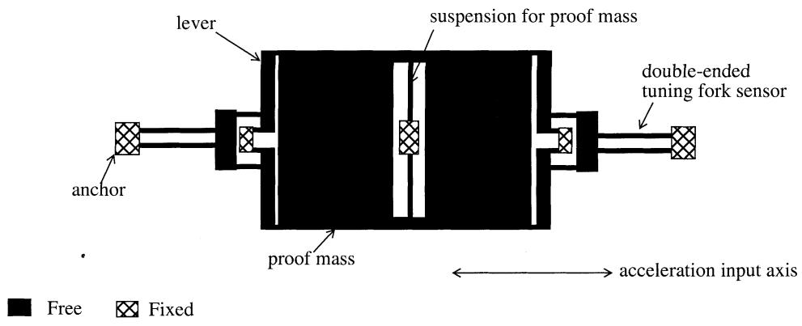  
Fig. 1. Schematic of a resonant accelerometer.

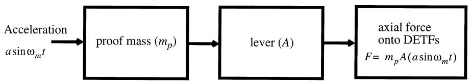  
(a)

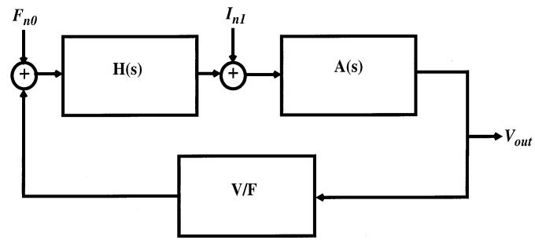  
(b)   
Fig. 2. (a) Equivalent block diagram of the system to be analyzed to obtain the accelerometer scale factor and to evaluate the audio frequency response. (b) Equivalent block diagram of the oscillator circuit comprising of the mechanical element $(\mathbf{H}(\mathbf{s}))$ , an electronic gain element $(\mathbf{A}(\mathbf{s}))$ and a voltage to force transducer $(\mathrm{V} / \mathrm{F})$ . $I_{n1}$ represents the equivalent current noise injected at the input of the sustaining amplifier and $\mathbf{F}_{n0}$ is the noise equivalent force that the mechanical element is subjected to as a result of the Brownian motion of the gas particles in the surrounding ambient.

sensors due to a change in the nominal stored potential energy of the system. This effect is identical to that of tuning a guitar string to resonate at different frequencies by varying the tension in the string. The output of the device is the difference in the output frequency of the two oscillators. The two double-ended tuning forks provide for a differential output, with common-mode effects such as temperature variations in frequency, being cancelled to first order for perfectly matched tuning fork resonators. A double-ended tuning fork implementation is preferred as opposed to a single clamped-clamped beam as the out-of-phase motion of the two tines serves to cancel out the stresses at the anchor, thereby enhancing the overall quality factor of the system, which is a key determinant in the resolution of the device.

# III. AUDIO FREQUENCY RESPONSE AND THE SIGNAL-TO-NOISE RATIO (SNR)

In this section, we analyze the response of the DETF in the presence of a time-varying applied axial force. Starting with the relationship between the natural frequency and the applied axial force, we derive the scale factor of the device. Next, we find the signal-to-noise ratio (SNR) and examine its behavior when the

applied acceleration is not constant but has spectral components below the natural frequency of the resonant sensor.

The nominal natural frequency $(f_0)$ of a clamped-clamped beam subjected to a concentrated load applied to the center of the beam and forced into oscillation in its primary mode of operation can be written as a function of geometrical and material parameters [12]

$$
f _ {0} = \frac {7}{\pi} \cdot \sqrt {\frac {E t}{1 2} \left(\frac {w}{L}\right) ^ {3} \frac {1}{(m + 0 . 3 7 5 m _ {b})}}. \tag {1}
$$

Here $w, L, t$ refer to the width, length and thickness of the beam, $E$ is the Young's modulus of the material of the beam, $m$ is the mass attached to the center of the beam and $m_b$ is the mass of the tire itself.

The mode of interest is when the two tines comprising the DETF are moving anti-phase to each other. The nominal frequency for this mode can be approximated by the above expression for a clamped-clamped beam under the assumption that the coupling stiffness between the two tines is small compared to the nominal stiffness for each of the tines.

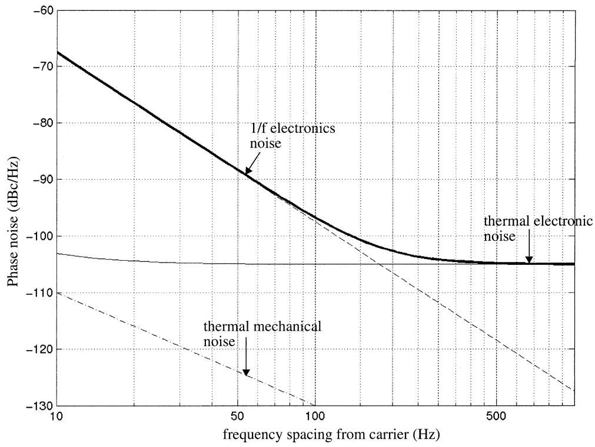  
Fig. 3. Simulated noise spectrum of a micromechanical resonator oscillator for typical process and design parameters. The independent variable is the frequency offset from the carrier. The dark line indicates the overall noise power, which is dominated by $1/f$ electronics noise close to the carrier and thermal electronics noise away from the carrier.

The expression for the variation of the natural frequency as a function of an applied axial force, $F$ , has been derived for a clamped-clamped beam [13] and is given by

$$
f = F _ {0} [ 1 + F S ] ^ {1 / 2} \tag {2}
$$

where: $S = 0.293(L^2 /Etw^3)$ for the fundamental mode of a singly clamped vibrating beam. In the case for a double-ended tuning fork, since there are two equally matched tines, the axial force on each tine is halved as compared to the case for a single clamped beam. The rest of the analysis is identical. If we assume that the frequency shift $(\delta f_0)$ due to the applied force $(F)$ is small as compared to the center frequency $(f_0)$ , then we can write an expression for the frequency shift $(\delta f_0)$ for the DETF as:

$$
\frac {\delta f _ {0}}{f _ {0}} \cong \frac {F S}{4}. \qquad (3)
$$

Note that this force $(F)$ is different from the inertial force on the proof mass $(m_{p}a)$ due to the applied acceleration $(a)$ , since the latter is increased by the lever amplification factor $A$ [see Fig. 2(a)]:

$$
F = A \cdot m _ {p} \cdot a. \tag {4}
$$

The lever force amplification factor can be expressed as a ratio of lengths. During the design process, it is important to ensure that any mode associated with the independent torsion of the lever about the pivot point is designed to have a higher resonant frequency than the accelerations to be detected, so that the frequency response of the lever element does not degrade the scale factor. This frequency is dependent on the geometry of the

beams comprising the lever and can be typically placed in the several hundred kilohertz regime.

The scale factor of the device can be written as a ratio of the nominal differential frequency shift between the two resonant force sensors $(\Delta f_{0} = (\delta f_{0})_{1} - (\delta f_{0})_{2})$ to the applied acceleration $(a)$

$$
\frac {\Delta f _ {0}}{a} = \frac {A m _ {p} S f _ {0}}{4}. \tag {5}
$$

An analysis of the behavior of the double-ended tuning fork resonator subjected to a time varying axial force $(m_{p}a / 2)$ begins with the equation of motion for each tine

$$
\ddot {x} + \frac {\omega_ {0}}{Q} \dot {x} \left(\omega_ {0} ^ {2} + c _ {m o d e} \frac {A m _ {p} a}{4 m L} \sin (\omega_ {m} t)\right) x = \frac {F _ {d}}{m} (6)
$$

where $Q$ is the quality factor of the resonant mode of interest, $F_{d}$ is the force applied to sustain motion at resonance and $a(t) = a\sin (\omega_{m}t)$ is the applied input acceleration. In the analysis to follow, it is assumed that positive input acceleration results in the tuning fork being subjected to a tensile force. This assumption is simply based upon the placement of the resonator relative to the proof mass and the choice of coordinates. The analysis below will carry over exactly (with a change in the sign of $a$ ) for the case of the resonator placed on the opposite side of the mass. Resonance is sustained by embedding the electromechanical resonator in the feedback loop of an oscillator circuit. The resonant motion is subjected to amplitude control. It is also assumed that the perturbation in the natural frequency due to the applied acceleration is small relative to the modulating acceleration frequency and nominal frequency of the tuning fork

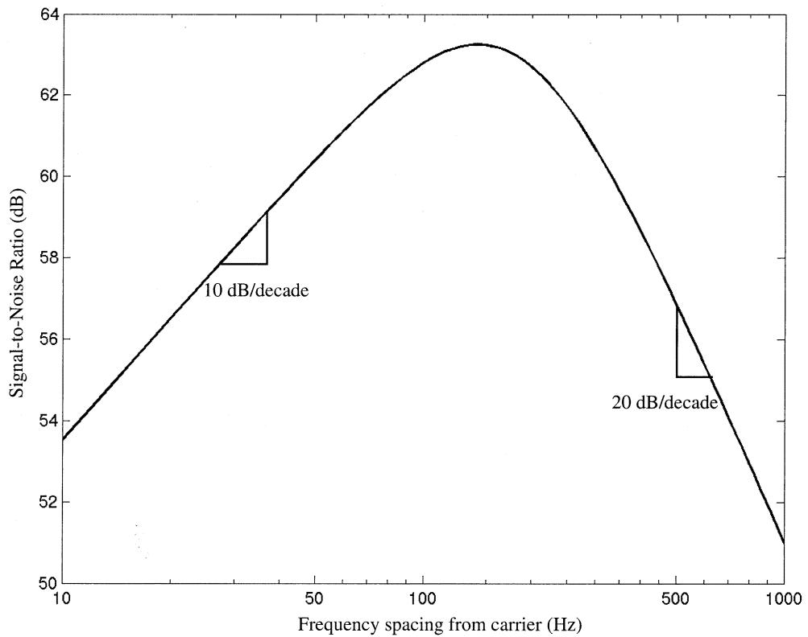

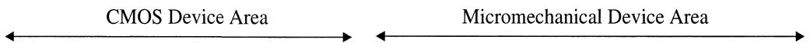  
Fig. 4. Simulated plot of the variation of the SNR for a $0.05\mathrm{g}$ input acceleration and a measurement bandwidth of $1\mathrm{Hz}$ . Oscillator noise values from Fig. 3 are used in this plot. It can be clearly seen that the resolution of the device degrades beyond a certain corner frequency.

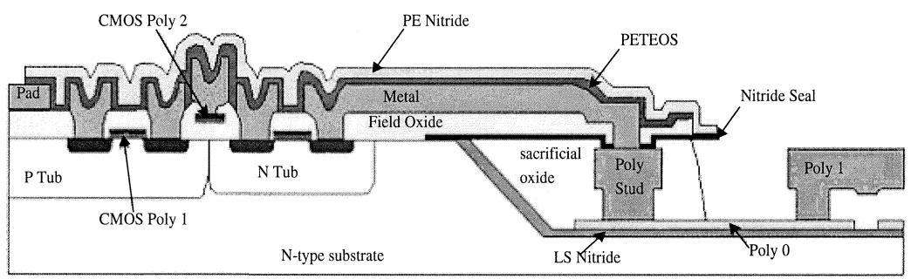  
Fig. 5. Cross section depicting the integration of CMOS and micromechanical structures in the Sandia Integrated MEMS process.

$(\delta f_0 \ll f_m, f_0)$ . Under such conditions, the displacement can be written as a solution to the Mathieu equation (6) [14]

$$
x = x _ {0} \sin \left(\omega_ {0} t - \beta \cos \left(\omega_ {m} t\right) + \phi\right). \tag {7}
$$

The displacement of the device exhibits classical narrowband frequency modulation ( $\beta \ll 1$ ). The instantaneous frequency $(f)$ can be written as

$$
f = f _ {0} + \beta f _ {m} \sin (\omega_ {m} t) \tag {8}
$$

where $\beta = (\delta f_0) / f_m$ is the modulation index. In terms of the applied acceleration, the modulation index can be expressed as:

$$
\beta = \frac {a}{f _ {m}} \cdot \frac {A m _ {p} S f _ {0}}{8} \tag {9}
$$

where $S$ has the same expression as in (2). Note that the modulation index $(\beta)$ , varies inversely as the modulation frequency

$(f_{m})$ and is proportional to the applied acceleration $(a)$ . From (8), the scale factor $(\Delta f_0 / a)$ can be written as the ratio of the peak frequency shift difference between the two resonant force sensors to the applied acceleration $(a)$ in terms of modulation index $(\beta)$

$$
\frac {\Delta f _ {0}}{a} = 2 \beta f _ {m}. \tag {10}
$$

The output frequency spectrum of each oscillator comprises of the carrier peak and two FM sidebands. The ratio of the power of each sideband $(P_{SB})$ to that of the carrier $(P_{c})$ is proportional to the square of the modulation index and is given by

$$
\frac {P _ {S B}}{P _ {c}} = \left(\frac {\beta}{2}\right) ^ {2}. \tag {11}
$$

DISPLACEMENT

STEP=1

SUB $= 2$

FREQ=173255

DMX =272098

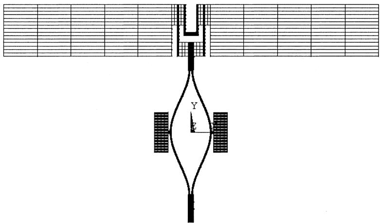  
(a)

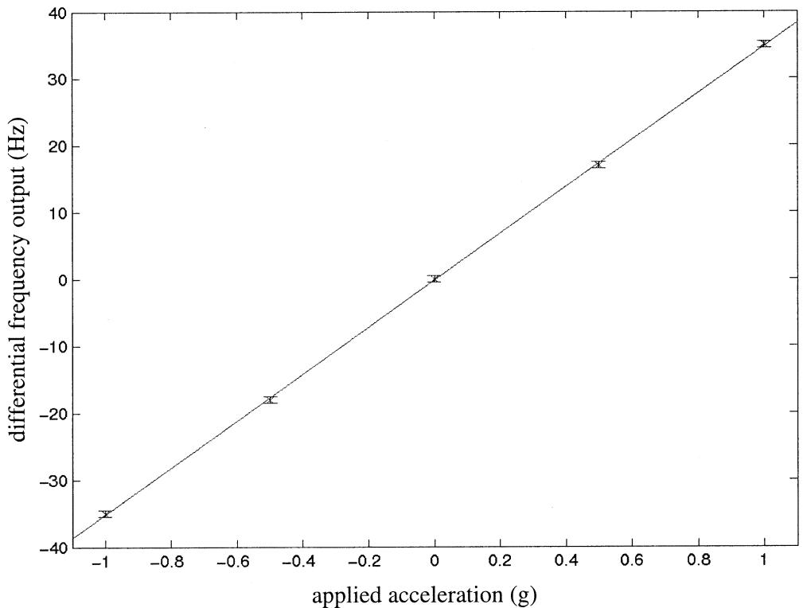  
(b)   
Fig. 6. (a) Mode shape of the double-ended tuning fork resonator. The simulated modal frequency is $173255\mathrm{Hz}$ . (b) Simulated plot of the output differential frequency shift versus applied acceleration obtained from ANSYS FEA. The device scale factor from this plot is $35\mathrm{Hz / g}$ .

Note that from equations (9) and (11), the sideband power decreases steadily as a function of the frequency offset from the carrier. However, the scale factor [see (10)] remains constant.

We will now examine one of the key parameters of interest for this sensor, namely the noise equivalent acceleration resolution. The fundamental noise performance of this device is set by the oscillator that sustains motion in the tuning fork force sensing

elements. A detailed analysis of oscillator noise has been carried out in [15]. The approximate noise equations are derived by constructing a linear model of the oscillator and ignoring the nonlinearities in the mechanical, transduction and gain elements. A block diagram of this model is shown in Fig. 2(b). The derivation considers the mechanical noise of the vibrating tuning fork [16] and the electronic noise from the amplifier (both thermal as

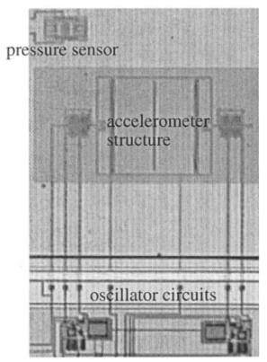

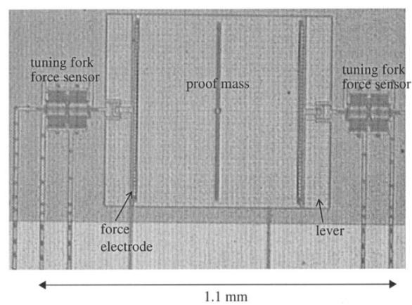

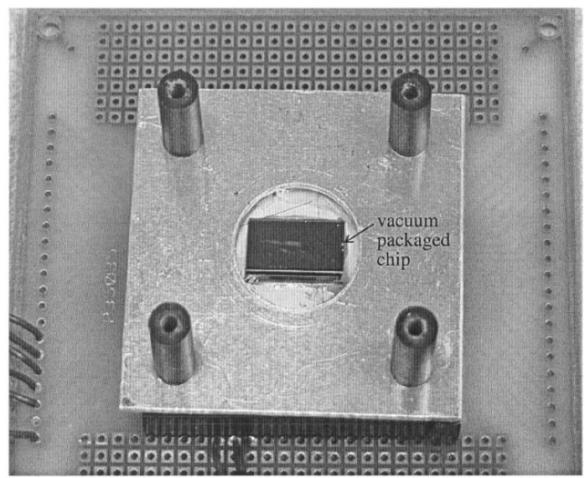  
(a)   
(b)   
Fig. 7. (a) Die photo of the RXL (left—structure + electronics; right—structure only). (b) Test board containing the vacuum packaged resonant accelerometer.

well as $1/f$ noise components). We will simply state the results here for purposes of completeness. The following expressions are written separately for each of the three noise components in terms of the phase noise density $(\mathcal{L}(f_m))$ of the oscillator output as a function of the frequency spacing from the carrier $(f_m)$ .

$$
\mathcal {L} \left(f _ {m}\right) = 1 0 \log \left(\left(\frac {f _ {0}}{2 Q V _ {p}}\right) ^ {2} \frac {K _ {f}}{W L C _ {o x} f _ {m} ^ {3}}\right) \tag {12}
$$

$$
\mathcal {L} \left(f _ {m}\right) = 1 0 \log \left(\frac {4 k _ {B} T A _ {v} ^ {2}}{\overline {{v _ {o} ^ {2}}}} \frac {2}{3 g _ {m t}} \cdot \left(1 + \left(\frac {f _ {0}}{2 Q f _ {m}}\right) ^ {2}\right)\right) \tag {13}
$$

$$
\mathcal {L} \left(f _ {m}\right) = 1 0 \log \left(\frac {\left(\eta A\right) ^ {2}}{\bar {v _ {o} ^ {2}}} \left(\frac {k _ {B} T f _ {0}}{2 \pi Q m} \cdot \frac {1}{f _ {m} ^ {2}}\right)\right). \tag {14}
$$

Equation (12) represents the $1/f$ noise of the amplifier mixed onto the carrier frequency, (13) represents the thermal electronic noise contribution of the amplifier and (14) represents the mechanical noise of the resonating element. We can use the linear superposition of noise power, assuming that the noise sources are uncorrelated, to express the overall noise power as a sum of these three components. Fig. 3 is a plot of the simulated noise power as a function of the frequency spacing from the carrier for typical process and design parameters. Beyond a certain corner frequency, the voltage noise power is white and is representative of the thermal electronic noise of the amplifier that is not fully shaped by the mechanical transfer function. Note that the

TABLEI DESIGN PARAMETERS   

<table><tr><td>Parameter</td><td>Symbol</td><td>Design Value</td></tr><tr><td>DETF tire length</td><td>L</td><td>180 μm</td></tr><tr><td>DETF natural frequency</td><td>f0</td><td>173 kHz</td></tr><tr><td>DETF beam width</td><td>w</td><td>2.2 μm</td></tr><tr><td>Number of comb finger gaps for sensing motion</td><td>Ns</td><td>80</td></tr><tr><td>Number of comb finger gaps for drive per tire</td><td>Nd</td><td>40</td></tr><tr><td>Comb finger gap</td><td>g</td><td>1.2 μm</td></tr><tr><td>Proof mass</td><td>mp</td><td>1.33 μg</td></tr><tr><td>DETF mass</td><td>m</td><td>6.54 ng</td></tr><tr><td>Lever amplification</td><td>A</td><td>26</td></tr><tr><td>Scale factor</td><td>Δf0/a</td><td>30 Hz/g</td></tr></table>

signal power also decreases inversely as a function of frequency and as a result, the device has the best acceleration resolution at the noise corner frequency. For the case, where the $1/f$ noise of the amplifier far exceeds the Brownian noise of the structure (as was the case for the device under test), the exact expression of the noise corner frequency $(\Delta f_{c})$ is given by

$$
\Delta f _ {c} = \sqrt [ 3 ]{\left(\frac {f _ {o} \bar {v _ {o}}}{4 Q A _ {v} V _ {p}}\right) ^ {2} \frac {3 K _ {f} g _ {m t}}{2 k _ {B} T W L C _ {o x}}}. \tag {15}
$$

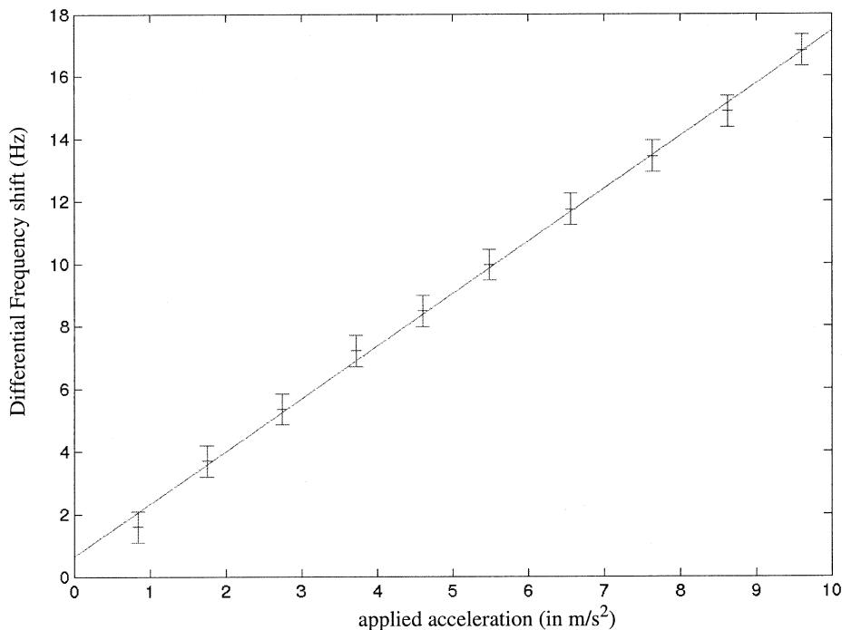  
Fig. 8. Frequency shift output as a function of applied acceleration for the device.

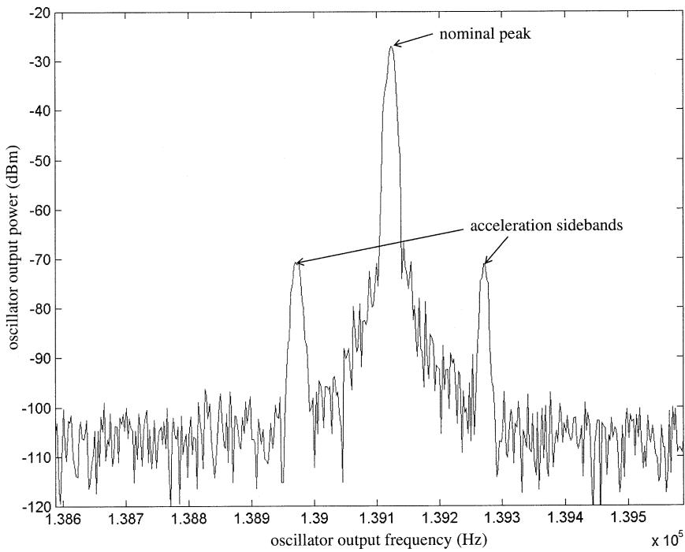  
Fig. 9. Experimentally measured output spectrum of a double-ended tuning fork resonator in response to an externally applied acceleration $(0.2\mathrm{g})$ at $150\mathrm{Hz}$

Note that, the phase noise power density approaches a constant as the frequency separation from the carrier increases (see Fig. 3). However, as noted from (9) and (11), the signal power decreases quadratically as a function of the spacing from the carrier. As a result, the SNR of the sensor is degraded for high frequency force sensing applications as shown in Fig. 4.

The noise corner frequency represents the optimal frequency at which the device can be operated. Beyond this limit, the SNR decreases by 20 dB/frequency decade. Below the noise corner frequency, device performance is limited by $1/f$ noise from the sustaining amplifier and the signal-to-noise ratio reduces by 10

dB/decade. This corner frequency can be made design dependent to a certain extent. For the particular device under the test, the noise corner is predicted to be around $300\mathrm{Hz}$ .

# IV. DESIGN, FABRICATION AND EXPERIMENT

The device was designed and fabricated in the Sandia National Laboratories Integrated MEMS process [17]. In this MEMS-first surface micromachining technology, MEMS devices and structural interconnect to CMOS (studs) are fabricated in a $5.5 - 6\mu \mathrm{m}$ trench etched in the surface of the wafer.

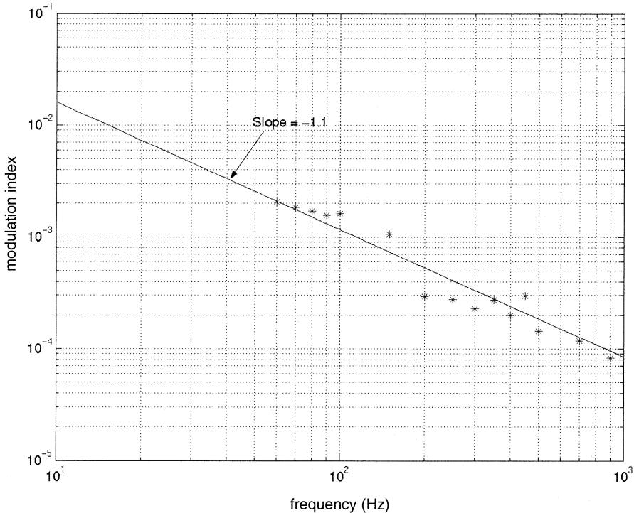  
Fig. 10. Plot of the modulation index $(\beta)$ as a function of the applied acceleration frequency for an input acceleration of $16\mathrm{mg}$ . Note the near inverse relationship between the modulation index $(\beta)$ and the input acceleration frequency $(f_{m})$ as expected.

Fig. 5 is a cross-sectional depiction of a device fabricated in this process. The MEMS devices are fabricated on top of a $3000\text{-}\mathring{\mathrm{A}}$ low-stress nitride layer and are comprised of a $3000\text{-}\mathring{\mathrm{A}}$ ground plane polysilicon layer and $2.25\mu \mathrm{m}$ structural polysilicon layer. After the devices are fabricated, the trench is refilled with oxide, planarized using chemical mechanical polishing (CMP), and sealed with a nitride membrane. The wafer with the embedded MEMS devices and studs is then passed through standard CMOS processing. The CMOS process is a standard 5 V, twin-tub process with a minimum $2\mu \mathrm{m}$ NMOS and PMOS gate length. As part of the CMOS processing, interconnect to the MEMS devices are achieved through the CMOS metal to the polysilicon studs. At the end of the CMOS processing, additional steps expose and release the embedded MEMS devices. Vacuum sealing was achieved by solder bonding a silicon lid in a vacuum ambient [18]. A Pierce oscillator circuit was used to sustain oscillation in the double-ended tuning fork structures in the desired resonant mode [15]. Table I is a list of the implemented design parameters. The double-ended tuning fork resonators are actuated in the antiphase mode. The ANSYS finite element analysis (FEA) plot, shown in Fig. 6(a), depicts the mode shape of interest. This ANSYS model was used to corroborate the experimental evidence depicting the relationship between the force applied to the proof mass and the frequency shift in the double-ended tuning fork force sensor [see Fig. 6(b)]. The scale factor obtained from FEA matches well with that obtained analytically.

# A. Experimental

A die shot of the fabricated device is shown in Fig. 7(a) and a picture of the vacuum packaged chip is shown in Fig. 7(b). The chip was bonded up to a 84-pin LCC for testing purposes.

TABLE II TYPICAL OBSERVED EXPERIMENTAL PARAMETERS   

<table><tr><td>Parameter</td><td>Value</td></tr><tr><td>Proof mass bias voltage</td><td>16 V</td></tr><tr><td>Oscillator output frequency</td><td>145 kHz</td></tr><tr><td>In-circuit quality factor</td><td>10000</td></tr><tr><td>Oscillator output voltage ampli-tude</td><td>150 mV peak-peak</td></tr><tr><td>Oscillator noise power</td><td>-100 dBc/Hz at 300 Hz</td></tr><tr><td>Noise equivalent signal level</td><td>40 μg/√Hz at 300 Hz</td></tr></table>

The circuits operate off a $5\mathrm{V}$ supply, while a bias of $\sim 16\mathrm{V}$ is applied to the proof mass to reduce the motional resistance of the resonators to a value where oscillation can be sustained by the Pierce amplifier. Observed in-circuit quality factors ranged from 2500 to greater than 30000 for varying vacuum ambient with pressures ranging from 300 mtorr to 10 mtorr. A list of typical observed and measured experimental parameters is listed in Table II. Initially, a constant force testing of the resonant accelerometer was conducted. Embedded test electrodes were used to apply an electrostatic force to the structure, thereby simulating the effect on an applied external acceleration. Subsequently, acceleration testing of the device was conducted on a vibration exciter (Bruel and Kjaer, type 4808). Calibration of the device was conducted with a reference quartz accelerometer. The experimentally measured scale factor is about $17\mathrm{Hz / g}$ (see Fig. 8) for an acceleration range of approximately $\pm 1\mathrm{g}$ . Fig. 9 shows the output spectrum of the oscillator in the presence of applied sinusoidal forces along the sensitive axis of the resonant accelerometer. The FM sidebands spaced away from the carrier correspond to the response of the device to the ap

plied force. A measurement of the sideband power was made as a function of the frequency of the applied modulating force enabling calculation of the modulation index from Eqn. (11). A plot of the modulation index $(\beta)$ as a function of the frequency $(f_{m})$ of the applied force indicates an inverse relationship as was predicted by the theory (Fig. 10) for input frequencies up to $1\mathrm{kHz}$ . Hence, the scale factor $(2\beta f_{m})$ is expected to be constant. Oscillator noise trends as described by equations (12)-(14) have been experimentally verified in [15]. These two results taken together indicate a decreasing signal-to-noise ratio (Fig. 4) beyond a certain corner frequency as predicted by our theory. There is a discrepancy between the measured and theoretical values of the scale factor $(17\mathrm{Hz / g}$ as compared to $30\mathrm{Hz / g})$ . This is to be expected to a certain extent as the effects of the actuation mass and the nonidealities of the lever [2] are not accounted for by the theory. The acceleration testing accuracy was limited by resonance characteristics of the package and the test board mounted on the vibration exciter for frequencies greater than $3\mathrm{kHz}$ .

# V. CONCLUSION

The paper models the performance of a micromechanical resonant accelerometer subjected to accelerations in the audio frequency spectrum and is accompanied by supporting test results. The noise-limited acceleration level is $40\mu \mathrm{g} / \sqrt{\mathrm{Hz}}$ for a $300\mathrm{-Hz}$ applied acceleration. Dynamic acceleration testing was conducted up to a frequency of $3\mathrm{kHz}$ , but the vibrations to the board containing the RXL were decoupled considerably at higher frequencies because of the nature of the attachment. Reliable acceleration test data is reported for acceleration input frequencies up to $1\mathrm{kHz}$ . The measured scale factor of this device is about $17\mathrm{Hz / g}$ , a factor of 1.75 below the analytical prediction. The resolution of the device is dependent on the applied acceleration frequency and the SNR of the device degrades 20 dB/decade above a certain noise corner frequency, making resonant sensing unsuitable for force and acceleration sensing applications at frequencies much higher than the corner frequency of the device. For the device under consideration, this corner frequency was measured to be about $300\mathrm{Hz}$ . The degradation of the device SNR at high input acceleration frequency is independent of the frequency measurement scheme that is utilized.

# REFERENCES

[1] N. Yazdi, F. Ayazi, and K. Najafi, "Micromachined inertial sensors," Proc. IEEE, pp. 1640-1659, Aug. 1998.   
[2] T. Roessig, "Integrated MEMS tuning fork oscillators for sensor applications," Ph.D. dissertation, Department of Mechanical Engineering, University of California, Berkeley, 1998.   
[3] T. Roessig, R. Howe, A. Pisano, and J. Smith, "Surface-micromachined resonant accelerometer," in Proc. Ninth International Conference on Solid-State Sensors and Actuators, Transducers, Chicago, IL, June 16-19, 1997, pp. 859-862.   
[4] M. Esashi, “Resonant sensors by silicon micromachining,” in Proc. 1996 IEEE International Frequency Control Symposium, pp. 609-614.   
[5] T. Albrecht, P. Grutter, D. Horne, and D. Rugar, "Frequency modulation detection using high-Q cantilevers for enhanced force microscope sensitivity," J. Appl. Phys., vol. 69, no. 2, pp. 668-673, Jan. 15, 1991.

[6] B. Ilic, D. Czaplewski, M. Zalalutdinov, H. Craighead, H. Neuzil, C. Campagnolo, and C. Batt, "Single cell detection with micromechanical oscillators," J. Vacuum Sci. Technol. B (Microelectron. Nanometer Struct.), vol. 19, no. 6, pp. 2825-2828, Nov. 2001.   
[7] S. Kim, J. Go, and Y. Cho, "Design, fabrication and static test of a resonant accelerometer," in Proc. 1997 ASME Symposium on Microelectromechanical Systems, pp. 21-26.   
[8] T. Roszhart, H. Jerman, J. Drake, and C. de Cotis, "An inertial grade micromachined vibrating beam accelerometer," in Tech. Dig. Transducers'95, pp. 656-658.   
[9] C. Burrer, J. Esteve, and E. Lora-Tomayo, "Resonant silicon accelerometers in bulk micromachining technology," J. Microelectromech. Syst., vol. 5, no. 2, pp. 122-130, June 1996.   
[10] R. Howe, "Resonant microsensors," in Proceedings of the Fourth International Conference on Solid-State Sensors and Actuators, Transducers 1987, pp. 843-848.   
[11] W. Tang, C. Nguyen, and R. Howe, "Laterally driven polysilicon resonant microstructures," Sens. Actuators, Phys. A, vol. 20, pp. 25-32, 1989.   
[12] C. Harris and C. Crede, Shock and Vibration Handbook, 2nd ed: McGraw Hill, 1976, pp. 1-13.   
[13] W. Albert, “Vibrating quartz crystal beam accelerometer,” in Proc. 28th ISA Instrumentation Symposium, 1982, pp. 33–44.   
[14] N. McLachlan, Theory and Application of Mathieu Functions: Oxford University Press, 1947, pp. 93-97.   
[15] A. Seshia, W. Low, S. Bhave, R. Howe, and S. Montague, "Micromechanical Pierce oscillators for resonant sensing applications," in Proc. Fifth Int. Conf. on Modeling and Simulation of Microsystems, April 22-25, 2002, pp. 162-165.   
[16] T. Gabrielson, "Mechanical-thermal noise in micromachined acoustic and vibration sensors," IEEE Trans. Electron Devices, vol. 40, no. 5, pp. 903-909, May 1993.   
[17] J. Smith, S. Montague, J. J. Sniegowski, J. R. Murray, and P. J. McWhorter, "Embedded micromechanical devices for the monolithic integration of MEMS with CMOS," in Int. Electron Devices Meeting Tech. Dig., Dec. 1995, pp. 609-612.   
[18] T. Schimert, D. Ratcliff, R. Gooch, B. Ritchey, P. McCardel, J. Brady, K. Rachels, S. Ropson, M. Wand, M. Weinstein, and J. Wynn, "Low cost, low power uncooled a-Si-based micro infrared camera," Proc. SPIE—The International Society for Optical Engineering, vol. 3577, pp. 96–105, 1999.

Ashwin A. Seshia (M'02) received the B.Tech. degree in engineering physics from the Indian Institute of Technology, Bombay, in 1996 and the M.S. degree in electrical engineering and computer sciences from the University of California, Berkeley, in 1999. He is currently working toward the Ph.D. degree in electrical engineering and computer science at the University of California, Berkeley, and is attached to the Berkeley Sensor and Actuator Center.

His research interests include microelectromechanical systems (biomedical, RF, inertial

applications), Integrated Circuits, Computational Biology and Sensor Networks. He is a Student Member of the AAAS.

Mооtrighti Palaniapan received the B.Eng. (First Class honors) and M.Eng. degrees in electrical engineering from National University of Singapore in 1995 and 1997, respectively. He is currently pursuing the Ph.D. degree in the Department of Electrical Engineering and Computer Sciences at University of California, Berkeley.

His research interests include integrated microelectromechanical inertial sensors, actuators, resonator designs and power electronic circuits.

Trey A. Roessig received the B.S. degree in mechanical engineering and materials science from the University of California, Berkeley, in 1993 and the M.S. and Ph.D. degrees in mechanical engineering from the University of California, Berkeley, in 1995 and 1998, respectively.

From 1993 to 1998, he was a Research Assistant with the Berkeley Sensor and Actuator Center, developing micromachined oscillators and resonant sensors. In 1998, he cofounded Integrated Micro Instruments, Inc., to develop high-precision, CMOS-com

patible inertial sensors. This group later became part of Analog Devices' Micromachined Products Division, where he was involved in developing all-optical switches. He is currently with Analog Devices' Power Management Division. His research interests include mixed-signal IC design, MEMS interface circuit design, and MEMS technology and applications. He has published numerous papers and currently holds six patents.

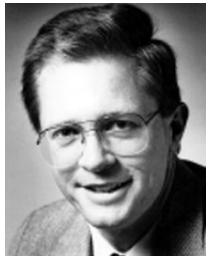

Roger T. Howe (S'79-M'84-SM'93-F'96) received the B.S. degree in physics from Harvey Mudd College, Claremont, CA, in 1979 and the M.S. and Ph.D. degrees in electrical engineering from the University of California at Berkeley in 1981 and 1984, respectively.

He was a member of the Faculty of Carnegie-Mellon University, Pittsburgh, PA, during the 1984-1985 academic year and was an Assistant Professor at the Massachusetts Institute of Technology, Cambridge, from 1985 to 1987. In 1987,

he joined the Department of Electrical Engineering and Computer Sciences at the University of California at Berkeley, where he is now a Professor as well as a Director of the Berkeley Sensor and Actuator Center. In 1997, he became a Professor in the Department of Mechanical Engineering. His research interests include microelectromechanical system design, micromachining processes, and massively parallel assembly processes. He is a coauthor (with C. G. Sodini) of Microelectronics: An Integrated Approach (Englewood Cliffs, NJ: Prentice-Hall, 1997).

Prof. Howe was Co-General Chairman of the 1990 IEEE Micro Electro Mechanical Systems Workshop (MEMS'90) and General Chairman of the 1996 Solid-State Sensor and Actuator Workshop, Hilton Head, SC. He was a co-recipient (with R. S. Muller) of the 1998 IEEE Cledo Brunetti Award "for leadership and pioneering contributions to the field of microelectromechanical systems." He is an Editor Emeritus of the JOURNAL OF MICROELECTROMECHANICAL SYSTEMS.

Roland W. Gooch received the B.S. and M.S. degrees from Baylor University.

He is a Senior Principal Engineer at Raytheon Commercial Infrared, Dallas, TX, working with development of silicon bolometer IR detectors and wafer level vacuum packaging. From 1967 to 1998, he was employed by Texas Instruments, Inc., where he was involved with a variety of R&D activities, including development of IC fabrication processes, thin-film magnetic memory disks, flat CRT displays, thin-film IR polarizers, and CCD visible and infrared imager development, with emphasis on thin-film deposition and vacuum technology. He has authored several publications and holds several patents.

Thomas R. Schimert received the Ph.D. degree in physics from the University of Texas at Austin in 1985.

He joined Raytheon (formerly Texas Instruments) in 1995. Since that time, he has led the a-Si microbolometer development and transition to production efforts. These include the $120\times 160$ FPA for the low cost, low-power IR cameras, and nonimaging detectors for nondispersive IR-based systems for gas monitoring and medical applications. He also led the development of low cost wafer-level vacuum packaging. From 1985 to 1995, he worked at Loral Vought Systems, where he worked on cooled detector development including $\mathrm{HgCdTe}$ photodiodes, QWIPs, and InGaAs-InP heterojunction photodiodes. He has over 17 years of experience in infrared technology including uncooled and cooled detector development using silicon, III-V, and II-VI materials; nonlinear switchable filter development; diffractive structures for infrared applications; and wafer-level vacuum packaging. He has numerous papers and patents in the area of infrared technology.

Stephen Montague received the B.S. degree in electrical engineering from New Mexico State University and the M.S. degree in electrical engineering from the University of New Mexico in 1984 and 1992, respectively.

He is a Principal Engineer at MEMX, Inc., working on MEMS-based optical components. Previously, he was a Principal Member of the Technical Staff in the Intelligent Micromachine Department at Sandia National Laboratories, Albuquerque, NM. He is the co-inventor of a monolithic integration process

for surface-micromachined mechanisms and CMOS circuitry (IMEMS). He has considerable experience in the fabrication MEMS, and radiation-hardened, nonvolatile memories. He has published numerous papers and holds four patents in the MEMS area. His current interests include high-aspect-ratio IMEMS technologies, RF-MEMS, and MEMS for optical applications.