# Accurate Identification of the Evolution of MEMS Resonant Accelerometer Residual Stresses at the Wafer-Die-Chip Level

Jinyang Huang, Yang Zhao, Guoming Xia, Qin Shi, and An Ping Qiu

Abstract-In this work, the processing error including the overetching error and residual stresses in the manufacturing process of a microelectromechanical system (MEMS) resonant accelerometer is identified. The performance of the accelerometer is affected by the processing error, especially the residual stress due to the multiple temperature loads in the manufacturing process. Thus, it is essential to identify the processing error for a high-precision MEMS resonant accelerometer. The overetching error is assessed using the sensitivity of the accelerometer resonator. With the multi-step measurement of the resonator frequency variation in the packaging process, the residual stresses of the MEMS accelerometer at different stages are decomposed and identified, combined with surface morphology measurement and finite element analysis simulations. The results of the analysis demonstrate that: 1) The processing error distribution of the accelerometer at the wafer level is related to the morphology of the wafer, which is decided by the low-order main vibrating modes. 2) The residual stress is distributed from high to low from the center to the edge in the wafer. 3) The residual stress at the wafer level is the main part of the MEMS accelerometer when low-stress packaging technology is adopted at the chip level. 4) The variation of the residual stresses in the manufacturing process is a non-monotonic process. The accurate identification of the processing error provides an effective foundation for the improvement and optimization of the MEMS resonant accelerometer. [2022-0041]

Index Terms—MEMS resonant accelerometer, overetching error, residual stresses, wafer level, wafer dicing, chip level.

# I. INTRODUCTION

THE pre-design of microelectromechanical system (MEMS) resonant accelerometer is closely related to the manufacturing process. The processing error of the manufacturing process not only affects the device performance but also determines the reliability and full-life stability of the accelerometer [1], [2]. The processing error for a MEMS resonant accelerometer includes the overetching error and the residual stress that occur for the wafer level and the chip level. The packaging for an accelerometer generally consists

Manuscript received 11 March 2022; revised 6 April 2022; accepted 16 April 2022. Date of publication 25 April 2022; date of current version 2 August 2022. This work was supported by the National Natural Science Foundation of China under Grant 62074078. Subject Editor G. Langfelder. (Corresponding author: Jinyang Huang.)

The authors are with the School of Mechanical Engineering, Nanjing University of Science and Technology, Nanjing 210094, China (e-mail: jinyanghuang@njust.edu.cn; zhaoyang0216@yeah.net; xiaguoming@njust.edu.cn; sqinhy@njust.edu.cn; apqiu@njust.edu.cn).

Color versions of one or more figures in this article are available at https://doi.org/10.1109/JMEMS.2022.3168703.

Digital Object Identifier 10.1109/JMEMS.2022.3168703

of various materials that have different coefficients of thermal expansion (CTE) and elastic moduli [3]–[5]. Therefore, the temperature change around the packaging during the manufacturing process induces thermo-mechanical stress, which causes structural deformation and hence greatly drifts the bias, thus drastically reducing the reliability of a MEMS resonant accelerometer [2], [6]. It is therefore important to be able to fully characterize the processing error and predict the mechanical properties of the accelerometer with confidence.

The overetching error of MEMS structure is usually estimated with a scanning electron microscope [7], and several methods for measuring and characterizing the residual stress of MEMS devices have been proposed. The high-resolution X-ray diffraction method was used for the analysis of the packaging-induced strain in a MEMS resonator [8]. MicroRaman spectroscopy was applied to measure the distribution of residual stress of polysilicon doubly clamped MEMS resonators with different widths [7]. Various micro test structures were designed to probe the residual stress and stress gradient induced by the manufacturing process in the wafer [9]–[12]. The deformation behavior of a MEMS package subjected to temperature change was investigated with Moiré interferometry in [13], and the package-induced stress was interactively analyzed with measurement and a finite element analysis (FEA) [5], [14].

In summary, foundries have expressed their particular interest in monitoring the development of stress in a wafer during the fabrication process, while other researchers have primarily concentrated on the die attachment and assembly process-induced stress. However, for designers, the predictive design of MEMS devices and the performance evaluation require the measurement of the processing error in the entire process.

In this work, we investigate the processing error during the manufacturing process of a MEMS resonant accelerometer in detail, especially the evolution of residual stresses at the wafer, die, and chip levels. Due to the high stress sensitivity of the accelerometer resonator, the frequency change of the resonator is an effective characterization method for the residual stress of the manufacturing process. Combined with the surface morphology measurement and FEA simulations, this effort enables the quantitative identification of the residual stresses at different stages of the manufacturing process, which provides effective guidelines for the optimization of the fabrication, packaging, and design of a MEMS resonant accelerometer.

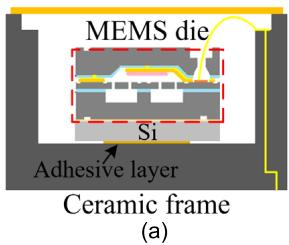

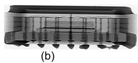

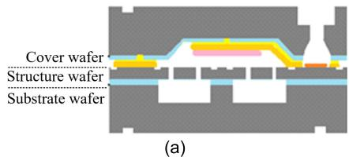  
Fig. 1. MEMS resonant accelerometer (a) Section diagram of the LCCC package. (b) X-ray cross-sectional view of the accelerometer.

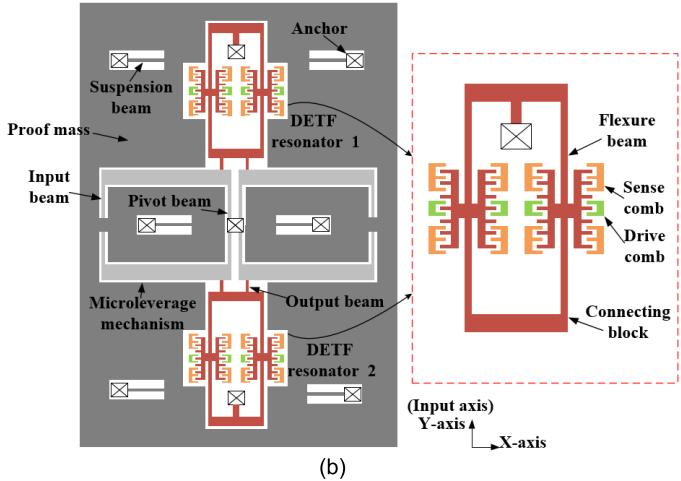  
Fig. 2. (a) Three wafers of MEMS resonant accelerometer. (b) Schematic drawing of the MEMS resonant accelerometer in the structure wafer.

# II. DESIGN AND MANUFACTURING PROCESS

Figure 1 shows the packaged MEMS resonant accelerometer in the leadless ceramic chip carrier (LCCC) used for this study. The package is composed of the MEMS die, ceramic frame, Si interlayer, adhesive layer, and wire bonds.

The MEMS accelerometer wafer is composed of three wafers: cover wafer, structure wafer, and substrate wafer, as shown in Figure 2(a). The central wafer is the MEMS accelerometer moveable sensitive structure, in which two double-ended tuning fork (DETF) resonators acting as the force-frequency converters are symmetrically arranged at both sides of the proof mass as depicted in Figure 2(b). The differential variation of the DETF resonators frequencies in the accelerometer is detected to characterize the external input acceleration [15].

Figure 3 shows the detailed manufacturing process with multiple temperature loads of the MEMS resonant accelerometer. Wafer level vacuum packaging is used to protect the moveable MEMS structure that is fabricated with the silicon on insulator (SOI) technique. The structure wafer and the cover wafer of the accelerometer are bonded with $\mathrm{Au / Si}$ eutectic welding at the temperature of $400^{\circ}\mathrm{C}$ . Then the bonded wafer is cooled down to ambient temperature. It is well known that residual stress is produced at the interface between the

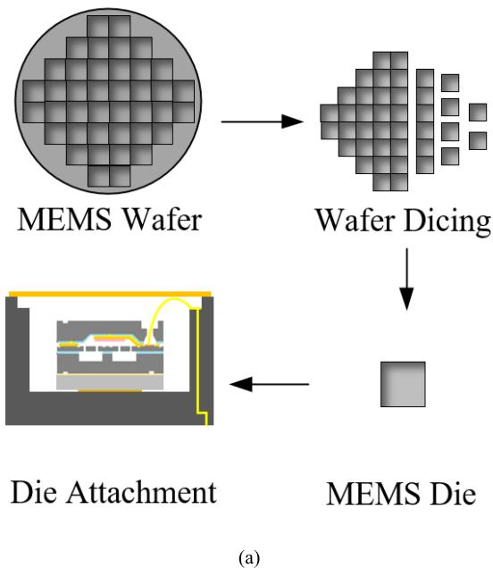

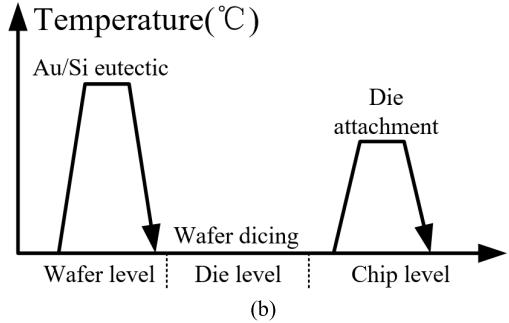  
Fig. 3. (a) The manufacturing process of MEMS resonant accelerometer. (b) Thermal loading history in the manufacturing process.

structure layer and the cover layer due to the mismatched material CTE, whereas the surface morphology of the wafer is changed. The warpage of the wafer bowing is measured and the total magnitude is approximately $100\mu \mathrm{m}$ . When the wafer is diced into individual dies, there is a residual stress release, and the warpage of the MEMS dies is slightly changed. After dicing, the MEMS die is attached to the ceramic substrate through the Si interlayer by the electrically conductive adhesive, and it is post-cured for 3 hours at $150^{\circ}\mathrm{C}$ , followed by cooling to ambient temperature. Then standard wire-bonding and parallel sealing are sequentially conducted. As mentioned earlier, the packaging residual stress is also produced in the die attachment due to the temperature load. The MEMS chips are finally assembled on the printed circuit board (PCB) with reflow soldering.

According to the above discussion, the processing error of a MEMS resonant accelerometer consists of the overetching error for the SOI technique and the residual stress during the entire manufacturing process. The overetching error of the MEMS structure is characterized first. During the manufacturing process of the accelerometer, the overetching error is a constant value that is only decided by the SOI technique at the wafer level. Residual stress can be classified into the wafer level, die level, and chip level categories. To accurately evaluate the packaging residual stress in the MEMS resonator accelerometer, an iterative measurement and modeling effort is

undertaken. The frequencies of the accelerometer resonators at different stages of the entire process are measured to calculate the internal packaging residual stress of the MEMS structure. In addition, the surface morphologies of the accelerometers are measured with a 3D white-light interferometry and loaded into the FEA model as the boundary condition. Using the measured surface morphology, the FEA packaging model is fine-tuned and validated iteratively for the detailed analysis of the internal MEMS structure residual stress distribution, which is compared with the calculated stress from the resonator frequency change for verification. The identification of residual stress evolution in the MEMS resonant accelerometer was divided into the following three steps:

1) The overetching error is characterized using the sensitivity of the accelerometer resonator.   
2) The residual stresses variations in the MEMS accelerometer manufacturing process are characterized by measuring the frequencies of the resonators at different stages.   
3) The deformation behavior of the accelerometer is analyzed using the surface morphology measurement and the FEA simulations for verification.

Throughout this effort, the frequencies of the resonators are measured to derive the residual stresses of the MEMS resonant accelerometer. Additionally, to verify the derived residual stress, it is essential to establish a comparison model of the accelerometer with the measured surface morphology as the load. In other words, the surface morphology measurement is used as a means of validating the FEA prediction for the internal residual stress distribution.

# III. OVERETCHING ERROR ANALYSIS

The overetching error of a MEMS structure can be identified using the sensitivity of a MEMS accelerometer resonator.

The natural frequency of a MEMS resonator can be expressed as follows [15]:

$$
f _ {0} = \frac {1}{2 \pi} \sqrt {\frac {K _ {e f f}}{M _ {e f f}}} = \frac {1}{2 \pi} \sqrt {\frac {1 6 . 5 5 E h \frac {w ^ {3}}{L _ {f} ^ {3}}}{0 . 3 9 7 \rho w h L _ {f} + m}}, \tag {1}
$$

where $K_{eff}$ is the effective stiffness, $M_{eff}$ is the effective mass, $E$ is the Young's modulus, $\rho$ is the density of the structure material, $w$ is the flexure beam width, $L_{f}$ is the length of flexure beam, $h$ is the thickness of the MEMS structure, and $m$ is the equivalent mass of the resonator comb.

In reality, the frequency of the resonator under loading is

$$
f _ {a} = \frac {1}{2 \pi} \sqrt {\frac {1 6 . 5 5 E h \frac {w ^ {3}}{L _ {f} ^ {3}} + 4 . 8 5 E w h \frac {\Delta d}{L _ {f} ^ {2}}}{0 . 3 9 7 \rho w h L _ {f} + m}}, \tag {2}
$$

where $\Delta d$ is the relative axial deformation of the flexure beam under loading. In this study, we adopt the axial deformation $\Delta d$ rather than the stress $\sigma$ in Equation (2), according to the stress-strain relationship $\varepsilon = \sigma / E$ . Because the stress is distributed, it is difficult to describe the stress in a flexure beam with an accurate value. However, for the flexure beam under loading, the axial deformation is unambiguous.

After being squared and divided by $h$ , Equation (2) can be rewritten as

$$
\begin{array}{l} f _ {a} ^ {2} = f _ {0} ^ {2} + \frac {1}{4 \pi^ {2}} \frac {4 . 8 5 E}{\rho (0 . 3 9 7 L _ {f} + S / w) L _ {f} ^ {2}} \Delta d \\ = f _ {0} ^ {2} + \lambda \Delta d, \tag {3} \\ \end{array}
$$

where $S$ is the area of resonator comb, and $\lambda$ is defined as a coefficient that is only related to the dimension of the resonator structure.

The square of the resonator frequency is used to eliminate the nonlinear error caused by the square root. Then Equation (3) can be rewritten as

$$
f _ {a} ^ {2} = f _ {0} ^ {2} + \lambda \Delta d _ {s} + \lambda \Delta d _ {a}. \tag {4}
$$

Equation (4) indicates that the actual resonator frequency can be divided into three parts: 1) The first part $(f_0^2)$ only depends on the fabricated structure dimension (Equation 1), which is related to the overetching error. 2) The second part $(\lambda \Delta d_s)$ depends on both the fabricated structure dimension and the axial deformation of the flexure beam caused by residual stress. The overetching error and the packaging residual stress are coupled together. 3) The third part $(\lambda \Delta d_a)$ depends on both the fabricated structure dimension and the axial deformation of the flexure beam caused by the external input acceleration. The overetching error and the external acceleration that is sensed by the proof mass in the accelerometer are coupled together.

In fact, residual stress is complex to identify because the MEMS resonant accelerometer has gone through multiple temperature cycles during the manufacturing process. Thus, the second part $(\lambda \Delta d_{s})$ is set aside temporarily. However, the acceleration input into the accelerometer can be controlled. Hence, we calculate the overetching error based on the third part $(\lambda \Delta d_{a})$ . When the gravity acceleration $g$ is loaded into the accelerometer sensitive direction, according to the accurate systematic model method of a MEMS resonant accelerometer we proposed previously [15], the resonator frequency variation can be calculated as

$$
\begin{array}{l} \lambda \Delta d _ {a} = f _ {a} ^ {2} - \left(f _ {0} ^ {2} + \lambda \Delta d _ {s}\right) = f _ {a} ^ {2} - f _ {n} ^ {2}, \\ \Delta f ^ {2} = \lambda \frac {y _ {o}}{y _ {i}} \frac {\gamma g}{(2 \pi f _ {M}) ^ {2}} \frac {k _ {o}}{k _ {o} + k _ {f}} \\ \approx \lambda \frac {1}{A} \frac {k _ {p}}{k _ {o f} + k _ {p}} \frac {\gamma M g}{k _ {m} + k _ {a x}} \frac {k _ {o}}{k _ {o} + k _ {f}}, \tag {5} \\ \end{array}
$$

where $f_{n}$ is the actual resonator frequency without acceleration loading, $y_{o}$ and $y_{i}$ represent the vertical displacements of different joints in the microleverage arm, $M$ is the effective mass of the proof mass, $k_{m}$ is the bending stiffness of the suspension beam of the proof mass, $k_{ax}$ is the axial effective stiffness of the entire leverage and the output system, $k_{o}$ is the axial stiffness of the output beam, $k_{p}$ is the axial stiffness of the pivot beam, $k_{of}$ is the series axial stiffness of the output system in the accelerometer, $A$ is the ideal amplification factor of the microleverage mechanism, and $\gamma$ is the attenuation coefficient caused by the connection block.

Equation (5) demonstrates that the sensitivity of the accelerometer resonator is only affected by the geometry of the MEMS structure, especially the beam width, which is related

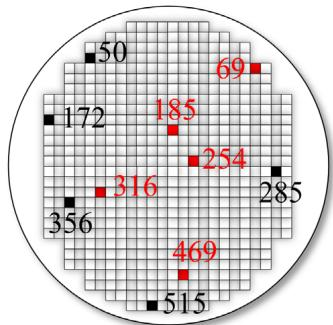  
(a)

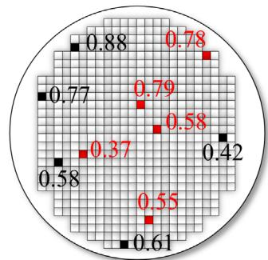  
(b)   
Fig. 4. (a) The selected accelerometers location distribution in the wafer. (b) Overetching error $(\mu \mathrm{m})$ distribution in the wafer.

TABLEI THEDESIGNSTRUCTUREDIMENSIONS   

<table><tr><td>Dimension</td><td>Symbol</td><td>Value</td></tr><tr><td>Young&#x27;s Modulus</td><td>E</td><td>169 GPa</td></tr><tr><td>Density</td><td>ρ</td><td>2330 kg/m3</td></tr><tr><td>Thickness</td><td>h</td><td>80 μm</td></tr><tr><td>Beam Width</td><td>w</td><td>5 μm</td></tr><tr><td>Resonant Beam Length</td><td>Lf</td><td>808 μm</td></tr><tr><td>Input Beam Length</td><td>Li</td><td>78 μm</td></tr><tr><td>Pivot Beam Length</td><td>Lp</td><td>68 μm</td></tr><tr><td>Output Beam Length</td><td>Lo</td><td>63 μm</td></tr><tr><td>Suspension Beam Length</td><td>Ls</td><td>425 μm</td></tr><tr><td>Comb Electrode Mass</td><td>m</td><td>3.19×10-9kg</td></tr><tr><td>Proof Mass</td><td>M</td><td>1.14×10-6kg</td></tr><tr><td>Microleverage Width</td><td>wl</td><td>136 μm</td></tr><tr><td>Microleverage Power Arm</td><td>L</td><td>1220 μm</td></tr><tr><td>Microleverage Resisting Arm</td><td>l</td><td>52.5 μm</td></tr></table>

to the overetching error of the SOI technique. To make the beam width error caused by the overetching error relatively uniform, the widths of key beams in the accelerometer are designed to be the same. The designed geometry dimensions of the accelerometer are shown in Table I. By substituting the experimental $f_{n}$ and $f_{a}$ into Equation (5), the beam width error of the accelerometer can be calculated, while the overetching error of the beam length and mass can be ignored.

The resonator sensitivity experiments are carried out at four positions in the gravitational field under ambient temperature. By solving Equation (5), the overetching error and the flexure beam width are calculated, as listed in Table II. It should be emphasized that the compensating dimensions added in the design layout of the accelerometer to offset the overetching error are not taken consideration enough in this fabrication process. A batch of ten accelerometers (Nos. 50, 69, 172, 185, 254, 285, 316, 356, 469, and 515) in the same wafer is selected for the experiment. The location distribution in the wafer is depicted in Figure 4(a). Nos. 316 and 469 are the designed large-range accelerometers that increase the base frequency of the MEMS resonant accelerometer, and the others are the large-sensitivity accelerometers. Figure 4(b) shows the distribution of the overetching error in the wafer, from the top left to the bottom right; the overetching error is distributed from high to low. The distribution is influenced by the initial deformation of the wafer structure before deep-reactive-ion-etching (DRIE), which is related to the etching verticality error in the thickness direction of the wafer structure and leads to the beam width error.

TABLE II THE EXPERIMENTAL RESONATOR PARAMETERS   

<table><tr><td>No.</td><td>fn[Hz]</td><td>SFone[Hz/g]</td><td>Overetching error [μm]</td><td>Calculated Beam width [μm]</td></tr><tr><td rowspan="2">50</td><td>18483.61</td><td>64.57</td><td>0.88</td><td>4.12</td></tr><tr><td>17947.25</td><td>64.76</td><td>0.89</td><td>4.11</td></tr><tr><td rowspan="2">69</td><td>18567.64</td><td>61.00</td><td>0.78</td><td>4.22</td></tr><tr><td>18440.63</td><td>61.17</td><td>0.79</td><td>4.21</td></tr><tr><td rowspan="2">172</td><td>19112.85</td><td>60.59</td><td>0.77</td><td>4.23</td></tr><tr><td>19052.56</td><td>60.28</td><td>0.75</td><td>4.25</td></tr><tr><td rowspan="2">185</td><td>20553.19</td><td>61.52</td><td>0.80</td><td>4.20</td></tr><tr><td>20351.62</td><td>60.98</td><td>0.78</td><td>4.22</td></tr><tr><td rowspan="2">254</td><td>21116.50</td><td>54.97</td><td>0.59</td><td>4.41</td></tr><tr><td>21296.60</td><td>54.35</td><td>0.57</td><td>4.43</td></tr><tr><td rowspan="2">285</td><td>20674.30</td><td>50.95</td><td>0.44</td><td>4.56</td></tr><tr><td>20693.54</td><td>49.79</td><td>0.40</td><td>4.60</td></tr><tr><td rowspan="2">316</td><td>20125.48</td><td>27.75</td><td>0.39</td><td>4.61</td></tr><tr><td>20147.71</td><td>27.06</td><td>0.35</td><td>4.65</td></tr><tr><td rowspan="2">356</td><td>19699.12</td><td>52.52</td><td>0.50</td><td>4.50</td></tr><tr><td>18777.77</td><td>52.32</td><td>0.49</td><td>4.51</td></tr><tr><td rowspan="2">469</td><td>18592.58</td><td>31.21</td><td>0.57</td><td>4.43</td></tr><tr><td>18685.33</td><td>30.47</td><td>0.53</td><td>4.47</td></tr><tr><td rowspan="2">515</td><td>19699.21</td><td>55.66</td><td>0.61</td><td>4.39</td></tr><tr><td>19989.49</td><td>55.76</td><td>0.61</td><td>4.39</td></tr></table>

# IV. RESIDUAL STRESS ANALYSIS AND VERIFICATION

# A. Residual Stress Decompose

According to Equations (2), (4), and (5), the residual stress at different stages of the MEMS accelerometer manufacturing process can be obtained by subtracting the calculated resonator frequency of the real beam width from the measured frequency at different stages without the acceleration loading,

$$
\sigma = \frac {L _ {f}}{4 . 8 5 w h} \left[ (0. 3 9 7 \rho w h L _ {f} + m) (2 \pi f) ^ {2} - 1 6. 5 5 E h \frac {w ^ {3}}{L _ {f} ^ {3}} \right], \tag {6}
$$

$$
d = \frac {\sigma L _ {f}}{E}, \tag {7}
$$

where $f$ is the measured resonator frequency of the accelerometer at different stages, and $d$ is the axial deformation of the flexure beam calculated from the residual stress $\sigma$ .

For the residual stress identity at the wafer level, the resonator frequencies $f_{w}$ are measured using a wafer probe station at ambient temperature. The wafer probe station is composed of a microscope, a PCB with a probe, and a wafer fixed disc (Figure 5). The MEMS accelerometer wafer is affixed to the circular disc by the gas pressure absorption. To search for and locate the MEMS disc in the wafer by a high-power microscope, the accelerometer resonator vibrates at the natural frequency when connected with the PCB through probes, and the peripheral closed-loop self-oscillation circuit on the PCB is used to track the natural frequency.

By substituting the calculated beam width and the measured resonator frequencies in the wafer into Equations (6) and (7), the residual stress at the wafer level can be obtained, as listed in Table III. The distributions of the residual

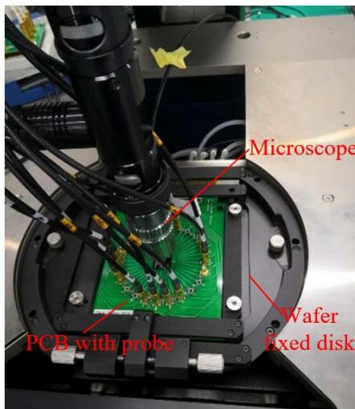  
Wafer Probe Station   
Fig. 5. The wafer probe station of MEM resonant accelerometer.

TABLE III THE RESIDUAL STRESS DISTRIBUTION IN WAFER LEVEL   

<table><tr><td>No.</td><td>fw[Hz]</td><td>Residual stress in the wafer σ [MPa]</td><td>Calculated axial deformation d [nm]</td></tr><tr><td rowspan="2">50</td><td>17859</td><td>1.63</td><td>12.51</td></tr><tr><td>17761</td><td>1.52</td><td>11.95</td></tr><tr><td rowspan="2">69</td><td>18346</td><td>1.70</td><td>13.08</td></tr><tr><td>18335</td><td>1.78</td><td>13.41</td></tr><tr><td rowspan="2">172</td><td>18713</td><td>2.41</td><td>16.49</td></tr><tr><td>18725</td><td>2.24</td><td>15.71</td></tr><tr><td rowspan="2">185</td><td>19979</td><td>5.63</td><td>31.80</td></tr><tr><td>20116</td><td>5.75</td><td>32.44</td></tr><tr><td rowspan="2">254</td><td>20973</td><td>5.87</td><td>33.44</td></tr><tr><td>21120</td><td>6.02</td><td>34.22</td></tr><tr><td rowspan="2">285</td><td>19567</td><td>0.95</td><td>10.30</td></tr><tr><td>19688</td><td>0.80</td><td>9.70</td></tr><tr><td rowspan="2">316</td><td>20342</td><td>2.22</td><td>16.50</td></tr><tr><td>20471</td><td>2.09</td><td>16.01</td></tr><tr><td rowspan="2">356</td><td>18962</td><td>0.21</td><td>6.64</td></tr><tr><td>19048</td><td>0.30</td><td>7.08</td></tr><tr><td rowspan="2">469</td><td>18851</td><td>0.69</td><td>8.75</td></tr><tr><td>18954</td><td>0.51</td><td>7.96</td></tr><tr><td rowspan="2">515</td><td>18824</td><td>1.04</td><td>10.32</td></tr><tr><td>18741</td><td>0.86</td><td>9.44</td></tr></table>

stress and the axial deformation in the wafer are plotted in Figures 6(a) and 6(b). It can be found that the residual stress is distributed from high to low from the center of the wafer to the edge of the wafer.

To analyze the effect of the wafer dicing on the residual stress, several separated MEMS dies (Nos.69, 185, 254, 316, and 469) are selected to measure the frequency variation by also using the wafer probe station. In addition, the resonator frequencies of the selected dies are tested after the die attachment process to identify the chip-scale packaging residual stress. The selected accelerometer resonator frequencies at the wafer level $f_{w}$ , die level $f_{d}$ , and chip level $f_{c}$ , as well as the overetching error, are listed in Table IV. According to

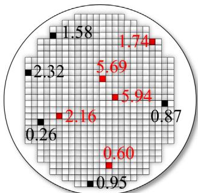  
(a)

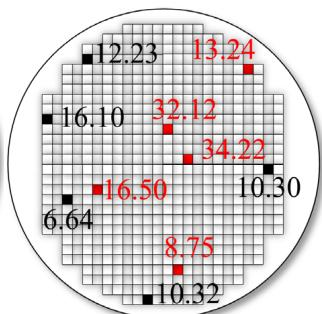  
(b)

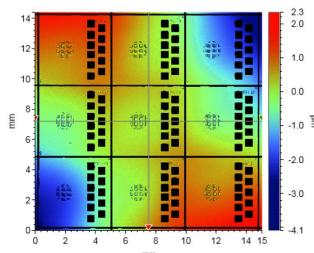  
Fig. 6. (a) The packaging residual stress (MPa) distribution in the wafer. (b) The axial deformation of resonator (nm) due to the packaging residual stress.   
(a)

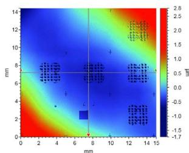  
(b)

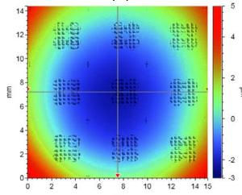  
(c)

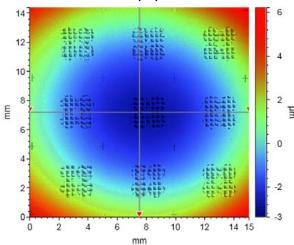  
(d)

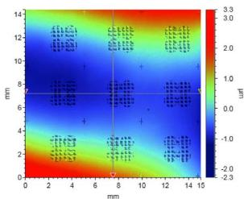  
(e)

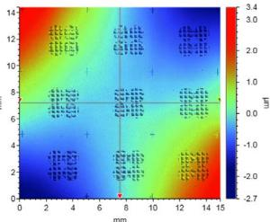  
(f)   
Fig. 7. (a) The top side surface morphology surrounding No. 69 (nine-patch view range) in the wafer from the top view. (b) The bottom side surface morphology surrounding No. 69 in the wafer from the bottom view, corresponding to the top side. (c)-(f) The bottom side surface morphology surrounding Nos. 185, 254, 316, and 469 in the wafer from the bottom view.

Equations (6) and (7), the axial deformation of the resonator $(d_w / d_d / d_c)$ equivalent to the residual stress at different stages of the manufacturing process can be obtained, as listed in Table V. The residual stress at the wafer level is as a base value. By subtracting $d_w$ from $d_d$ and $d_d$ from $d_c$ , the residual stress due to the wafer packaging $\Delta d_w$ , the wafer dicing $\Delta d_d$ , and the chip packaging $\Delta d_c$ is clearly identified.

The processing error decomposition of the MEMS resonant accelerometer manufacturing process is listed in Table VI (a positive value represents an increase in the stress, whereas a negative value represents a decrease). We observe that the wafer packaging residual stress plays a main role in the MEMS accelerometer packaging process; it is under tensile stress. The packaging residual stress generated by the wafer

TABLE IV THE MEASURED RESONATOR FREQUENCY AT DIFFERENT STAGES OF MEMS PACKAGING PROCESS   

<table><tr><td>No.</td><td>Overetching error [μm]</td><td>Calculated Beam width [μm]</td><td>Measured resonator frequencyfw in wafer [Hz]</td><td>Measured resonator frequencyfd after dicing [Hz]</td><td>Measured resonator frequencyfc after die attach [Hz]</td></tr><tr><td rowspan="2">69</td><td>0.78</td><td>4.22</td><td>18346</td><td>18184</td><td>18567.64</td></tr><tr><td>0.79</td><td>4.21</td><td>18335</td><td>18157</td><td>18440.63</td></tr><tr><td rowspan="2">185</td><td>0.80</td><td>4.20</td><td>19979</td><td>19891</td><td>20553.19</td></tr><tr><td>0.78</td><td>4.22</td><td>20116</td><td>19625</td><td>20351.62</td></tr><tr><td rowspan="2">254</td><td>0.59</td><td>4.41</td><td>20973</td><td>21048</td><td>21116.50</td></tr><tr><td>0.57</td><td>4.43</td><td>20983</td><td>21088</td><td>21296.60</td></tr><tr><td rowspan="2">316</td><td>0.39</td><td>4.61</td><td>20342</td><td>20391</td><td>20125.48</td></tr><tr><td>0.35</td><td>4.65</td><td>20471</td><td>20569</td><td>20147.71</td></tr><tr><td rowspan="2">469</td><td>0.57</td><td>4.43</td><td>18851</td><td>18781</td><td>18592.58</td></tr><tr><td>0.53</td><td>4.47</td><td>18954</td><td>18754</td><td>18685.33</td></tr></table>

TABLEV THE CALCULATED AXIAL DEFORMATION AT DIFFERENT STAGES OF MEMS PACKAGING PROCESS   

<table><tr><td>No.</td><td>Overetching error [μm]</td><td>Calculated Beam width [μm]</td><td>Calculated axial deformation \( {d}_{w} \) in wafer level [nm]</td><td>Calculated axial deformation \( {d}_{d} \) after dicing [nm]</td><td>Calculated axial deformation \( {d}_{c} \) after die attach [nm]</td></tr><tr><td rowspan="2">69</td><td>0.78</td><td>4.22</td><td>13.08</td><td>11.39</td><td>15.40</td></tr><tr><td>0.79</td><td>4.21</td><td>13.41</td><td>11.56</td><td>14.52</td></tr><tr><td rowspan="2">185</td><td>0.80</td><td>4.20</td><td>33.36</td><td>30.80</td><td>38.42</td></tr><tr><td>0.78</td><td>4.22</td><td>30.87</td><td>26.89</td><td>35.15</td></tr><tr><td rowspan="2">254</td><td>0.59</td><td>4.41</td><td>33.44</td><td>34.33</td><td>35.14</td></tr><tr><td>0.57</td><td>4.43</td><td>34.22</td><td>33.84</td><td>36.33</td></tr><tr><td rowspan="2">316</td><td>0.39</td><td>4.61</td><td>16.50</td><td>17.05</td><td>14.06</td></tr><tr><td>0.35</td><td>4.65</td><td>16.01</td><td>17.12</td><td>12.36</td></tr><tr><td rowspan="2">469</td><td>0.57</td><td>4.43</td><td>8.75</td><td>7.34</td><td>9.83</td></tr><tr><td>0.53</td><td>4.47</td><td>7.96</td><td>5.85</td><td>5.13</td></tr></table>

dicing and chip-scale packaging is of the same order of magnitude and the axial deformation is below $10\mathrm{nm}$ because the low packaging stress encapsulation has been adopted in the MEMS accelerometer chip-scale die attachment, which will be covered in a future paper.

There is a stress release for the MEMS accelerometer due to the wafer dicing, except for No. 316 and one resonator of No. 254, because the morphology of the die deforms approaching its low order vibrating modes after wafer dicing, rather than be constrained by the deformation of the wafer and related to the position of the die in the wafer. The packaging tensile stress generally increases after the die attachment process, except for No. 316 and No. 469, because the deformation of the individual die is submitted to the morphology of the ceramic frame during the die attachment, which is the inverted bowl shape as we measure.

# B. Surface Morphology Measurement and FEA Simulations

The surface morphology measurement is conducted on the MEMS accelerometers (Nos. 69, 185, 254, 316, and 469) in the wafer and after the wafer dicing by a 3D white-light interferometry to verify the residual stress evolution.

As shown in Figure. 7, the deformation behavior at different locations in the wafer is obviously different. In the center of the wafer, the deformation of the MEMS dies (Nos. 185 and 254) is similar to a regularly inverted bowl, while the others (Nos. 69, 316, and 469) at the edge of the wafer bulge along

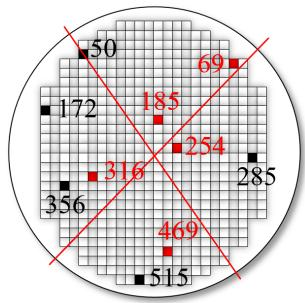  
(a)

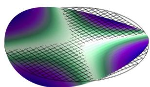  
(b)

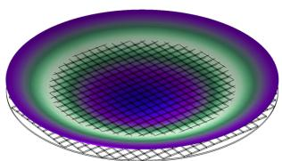  
(c)   
Fig. 8. (a) The two cross diagonals of the MEMS wafer. (b) The saddle shape mode at $266.95\mathrm{Hz}$ . (c) The bowl shape mode at $441.36\mathrm{Hz}$ .

the diagonal. It is worth noting that the bulge diagonal is in the opposite direction between Nos. 69 and 316 and No. 469 because they are located on two cross diagonals of the accelerometer wafer (Figure 8(a)).

The initial deformation of the accelerometer wafer is basically determined by the low-order main vibration modes of the wafer (Figure 8(b-c)). Thus, the shape of the MEMS accelerometer wafer after wafer level vacuum packaging is

TABLE VI THE PROCESSING ERROR DECOMPOSITION OF MEMS RESONANT ACCELEROMETER   

<table><tr><td>No.</td><td>Overetching error [μm]</td><td>Calculated Beam width [μm]</td><td>Calculated axial deformation in wafer level Δdw [nm]</td><td>Calculated axial deformation Δdw due to dicing [nm]</td><td>Calculated axial deformation Δdw due to die attach [nm]</td></tr><tr><td rowspan="2">69</td><td>0.78</td><td>4.22</td><td>13.08</td><td>-1.68</td><td>4.01</td></tr><tr><td>0.79</td><td>4.21</td><td>13.41</td><td>-1.85</td><td>2.96</td></tr><tr><td rowspan="2">185</td><td>0.80</td><td>4.20</td><td>33.36</td><td>-2.56</td><td>7.63</td></tr><tr><td>0.78</td><td>4.22</td><td>30.87</td><td>-3.99</td><td>8.26</td></tr><tr><td rowspan="2">254</td><td>0.59</td><td>4.41</td><td>33.44</td><td>0.89</td><td>0.81</td></tr><tr><td>0.57</td><td>4.43</td><td>34.22</td><td>-0.38</td><td>2.48</td></tr><tr><td rowspan="2">316</td><td>0.39</td><td>4.61</td><td>16.50</td><td>0.56</td><td>-2.99</td></tr><tr><td>0.35</td><td>4.65</td><td>16.01</td><td>1.12</td><td>-4.76</td></tr><tr><td rowspan="2">469</td><td>0.57</td><td>4.43</td><td>8.75</td><td>-1.40</td><td>2.48</td></tr><tr><td>0.53</td><td>4.47</td><td>7.96</td><td>-2.11</td><td>-0.72</td></tr></table>

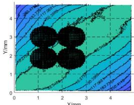

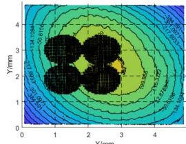

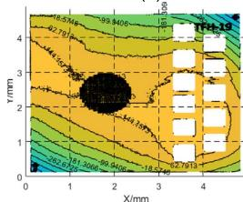  
(a)

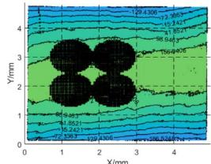  
(c)   
(e)

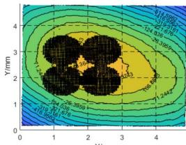

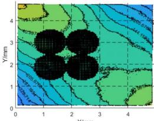  
(d)   
(f)   
Fig. 9. (a)-(b) and (d)-(f) The contour map of the bottom side surface topography of Nos. 69, 185, 254, 316, and 469 from top view after dicing. (c) The contour map of the top side surface topography of No. 254 from the top view after dicing.

an inverted bowl shape and raised diagonally, in keeping with the low-order main vibrating modes [16].

After wafer dicing, the MEMS dies are separated from the wafer. The surface morphology of the dies changes slightly due to the stress release. The contour map of the surface morphology of the separated dies is plotted in Figure 9.

FEA is an effective way to analyze the residual stress of the MEMS resonant accelerometer. The accurate FEA model of the MEMS accelerometer is built with the design geometry dimensions in COMSOL Multiphysics 5.4 software. As plotted in Figure 10, the measured bottom deformation at the wafer level and the die level (Figures 7 and 9) is loaded into the bottom surface of the FEA model as the Z-direction boundary condition while the degrees of freedom in the X and Y directions are limited, then a static analysis is done. Figure 11 shows the warpage at the resonator axial direction inside the MEMS structure of the selected accelerometer dies

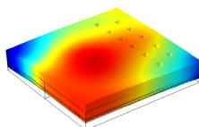

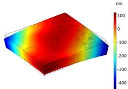  
(a)

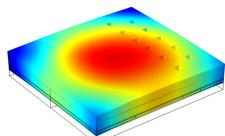

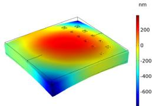  
(b)

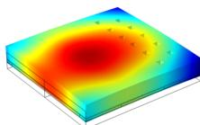

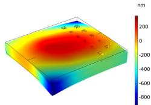

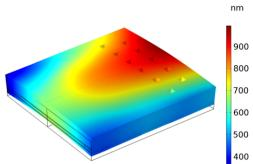  
(c)

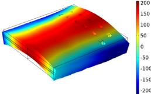  
(d)

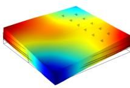

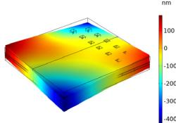  
(e)   
Fig. 10. (a)-(e) The deformation FEA model with the measured bottom surface morphology of Nos. 69, 185, 254, 316, and 469 in the wafer and after wafer dicing.

in the wafer and after wafer dicing. The warpage is defined by the max difference of the out-of-plane displacement between the die center and the edge. Corresponding to the previous analysis, the warpages of Nos. 185 and 254, which are greater than $400\mathrm{nm}$ , are greater than those of Nos. 69, 316, and 469,

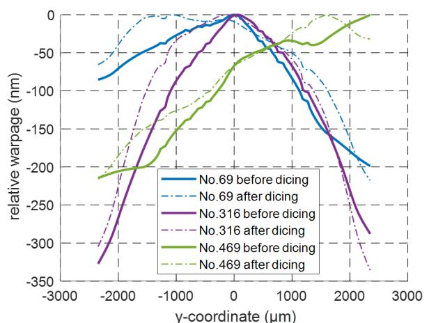  
(a)

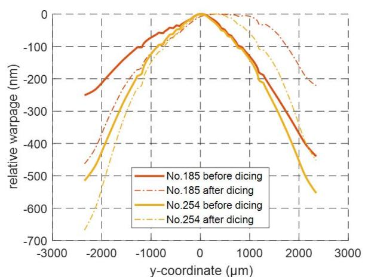  
(b)   
Fig. 11. (a) Warpage before and after wafer dicing along the axial direction of the resonator for Nos. 69, 316, and 469. (b) Warpage before and after wafer dicing along the axial direction of the resonator for Nos. 185 and 254.

TABLE VII THE COMPARISON OF AXIAL DEFORMATION DUE TO WAFER DICING   

<table><tr><td>No.</td><td>Calculated axial deformation of the resonator [nm]</td><td>Axial deformation from FEA model [nm]</td></tr><tr><td rowspan="2">69</td><td>-1.68</td><td>-1.40</td></tr><tr><td>-1.85</td><td>-2.21</td></tr><tr><td rowspan="2">185</td><td>-2.56</td><td>-2.06</td></tr><tr><td>-3.99</td><td>-3.65</td></tr><tr><td rowspan="2">254</td><td>0.89</td><td>1.03</td></tr><tr><td>-0.38</td><td>-0.39</td></tr><tr><td rowspan="2">316</td><td>0.56</td><td>0.76</td></tr><tr><td>1.12</td><td>1.03</td></tr><tr><td rowspan="2">469</td><td>-1.40</td><td>-1.69</td></tr><tr><td>-2.11</td><td>-1.98</td></tr></table>

which are less than $350~\mathrm{nm}$ , because Nos.185 and 254 are in the center of the MEMS wafer, whereas Nos. 69, 316, and 469 are on the edge. Moreover, the warpages of Nos. 185 and 254 are symmetric about the centerline of the structure, while the symmetries of Nos. 69, 316, and 469 produce a large deviation, especially No. 469. Then, after the wafer dicing, for the warpage of the MEMS dies, both the value and the symmetry are changed due to the stress release. By comparing the deformation of the MEMS accelerometer die FEA model in the wafer and after dicing, the FEA axial deformation of the accelerometer resonator due to the wafer dicing can be obtained, as listed in Table VII, which can verify the FEA simulations. In fact, for the stack structure of the MEMS resonant accelerometer packaging, the residual stress and the warpage are essentially the same [17], [18].

# V. CONCLUSION

To identify the processing error in the MEMS resonant accelerometer manufacturing process and to accurately evaluate the effect proportion on the residual stresses due to different packaging processes, multi-step decomposition methods integrating measurement techniques and FEA modeling are used in this study. The measured sensitivity of an accelerometer resonator is used to calculate overetching error, and the

residual stresses at different stages are identified using the measured frequencies of the resonators.

The processing error distribution at the wafer level illustrates the facts that: 1) The deformation of the unetched wafer determines the distribution of the overetching error. 2) The packaging residual stress is distributed from high to low from the center to the edge of the wafer. 3) The morphology of the MEMS resonant accelerometer wafer is combined with the low-order main vibrating modes—the saddle shape and the bowl shape. Thus, in order to improve robustness of the MEMS resonant accelerometer, the wafer warpage is reduced by adjusting the longitudinal size ratio MEMS wafers and effectively distributing the anchor in the accelerometer cell. The etching uniformity in the wafer is improved with the wafer warpage reducing, the overetching error and the packaging stress also reduce.

The deformation behaviors of MEMS dies are related to the change of the packaging residual stress. FEA modeling of the packaging using the measured surface morphology of selected dies before and after wafer dicing is used to predict the stress distribution and warpage at the inner MEMS structure, which demonstrates the effect of wafer dicing on the packaging residual stress release.

As a result of this study, we find that residual stress at the wafer level is the main component of the MEMS resonant accelerometer packaging stress. The stress due to wafer dicing and die attachment is of the same order of magnitude because the low-stress packaging technology has been adopted at the chip level.

# ACKNOWLEDGMENT

The authors would like to thank the staff of the CETC 13 for their technical support.

# REFERENCES

[1] G. Langfelder, M. Bestetti, and M. Gadola, "Silicon MEMS inertial sensors evolution over a quarter century," J. Micromech. Microeng., vol. 31, no. 8, Jul. 2021, Art. no. 084002, doi: 10.1088/1361-6439/ac0fbf.   
[2] G. Wu et al., "MEMS resonators for frequency reference and timing applications," J. Microelectromech. Syst., vol. 29, no. 5, pp. 1137-1166, Feb. 2020, doi: 10.1109/JMEMS.2020.3020787.

[3] E. Tatar, T. Mukherjee, and G. K. Fedder, "Stress effects and compensation of bias drift in a MEMS vibratory-rate gyroscope," J. Microelectromech. Syst., vol. 26, no. 3, pp. 569-579, Jun. 2017, doi: 10.1109/JMEMS.2017.2675452.   
[4] S. Schroder et al., "Stress-minimized packaging of inertial sensors by double-sided bond wire attachment," J. Microelectromech. Syst., vol. 24, no. 4, pp. 781-789, Aug. 2015, doi: 10.1109/JMEMS.2015.2439042.   
[5] X. Zhang, S. Park, and M. W. Judy, "Accurate assessment of packaging stress effects on MEMS sensors by measurement and sensor-package interaction simulations," J. Microelectromech. Syst., vol. 16, no. 3, pp. 639-649, Jun. 2007, doi: 10.1109/JMEMS.2007.897088.   
[6] P. Li, S. Gao, H. Liu, J. Liu, and Y. Shi, "Effects of package on the performance of MEMS piezoresistive accelerometers," Microsyst. Technol., vol. 19, no. 8, pp. 1137-1144, 2013, doi: 10.1007/s00542-012-1711-x.   
[7] C. Zhao, M. Li, Y. Ming, and Z. Liu, "Micro-Raman spectroscopy analysis of residual stress in polysilicon MEMS resonators," in Proc. IEEE Int. Conf. Nano/Micro Eng. Mol. Syst., Apr. 2013, pp. 570-573.   
[8] T. Bandi, A. Dommann, and A. Neels, "Analysis of stress in silicon-based microsystems by X-ray diffraction techniques," in Proc. Microelectron. Packag. Conf. (EMPC), Sep. 2013, pp. 1-4.   
[9] A. R. Behera, H. Shaik, G. M. Rao, and R. Pratap, "A technique for estimation of residual stress and Young's modulus of compressively stressed thin films using microfabricated beams," J. Microelectromech. Syst., vol. 28, no. 6, pp. 1039-1054, Dec. 2019, doi: 10.1109/JMEMS.2019.2948016.   
[10] G. Schiavone, J. Murray, S. Smith, M. P. Y. Desmulliez, A. R. Mount, and A. J. Walton, "A wafer mapping technique for residual stress in surface micromachined films," J. Micromech. Microeng., vol. 26, no. 9, p. 95013, 2016, doi: 10.1088/0960-1317/26/9/095013.   
[11] R. Anzalone, G. D'Arrigo, M. Camarda, C. Locke, S. E. Saddow, and F. La Via, "Advanced residual stress analysis and FEM simulation on heteroepitaxial 3C-SiC for MEMS application," J. Microelectromech. Syst., vol. 20, no. 3, pp. 745-752, Jun. 2011, doi: 10.1109/JMEMS.2011.2127451.   
[12] L. Lin, A. P. Pisano, and R. T. Howe, "A micro strain gauge with mechanical amplifier," J. Microelectromech. Syst., vol. 6, no. 4, pp. 313-321, Dec. 1997, doi: 10.1109/84.650128.   
[13] J.-W. Joo and S.-H. Choa, "Deformation behavior of MEMS gyroscope sensor package subjected to temperature change," IEEE Trans. Compon. Packag. Technol., vol. 30, no. 2, pp. 346-354, Jun. 2007, doi: 10.1109/TCAPT.2007.897948.   
[14] M. Lishchynska, C. O'Mahony, O. Slattery, O. Wittler, and H. Walter, "Evaluation of packaging effect on MEMS performance: Simulation and experimental study," IEEE Trans. Adv. Packag., vol. 30, no. 4, pp. 629-635, Nov. 2007, doi: 10.1109/TADVP.2007.908026.   
[15] J. Huang, Y. Zhao, G. M. Xia, Q. Shi, and A. P. Qiu, "Systematic modeling of a MEMS resonant accelerometer based on displacement coordination," IEEE Sensors J., vol. 22, no. 7, pp. 6454-6465, Apr. 2022, doi: 10.1109/JSEN.2022.3155605.   
[16] A. H. Abdelnaby, G. P. Potirniche, F. Barlow, A. Elshabini, S. Groothuis, and R. Parker, "Numerical simulation of silicon wafer warpage due to thin film residual stresses," in Proc. IEEE Workshop Microelectron. Electron Devices (WMED), Apr. 2013, pp. 9-12.   
[17] M. Y. Tsai, C. H. Hsu, and C. N. Han, “A note on Suhir's solution of thermal stresses for a die-substrate assembly,” ASME J. Electron. Packag., vol. 126, no. 1, pp. 115–119, Mar. 2004.   
[18] E. Suhir, "An approximate analysis of stresses in multilayered elastic thin films," J. Appl. Mech., vol. 55, no. 1, pp. 143-148, Mar. 1988, doi: 10.1115/1.3173620.

Jinyang Huang was born in Jinhua, Zhejiang, China, in 1993. He received the B.S. degree in mechanical engineering from the Nanjing University of Science and Technology, Nanjing, China, in 2015, where he is currently pursuing the Ph.D. degree in instrumentation science and technology. His current research interest includes the design and fabrication of micromechanical resonant accelerometers.

Yang Zhao was born in Luoyang, Henan, China, in 1988. He received the Ph.D. degree in measuring and control technology and instrumentations from the Nanjing University of Science and Technology, Nanjing, China, in 2016. From 2012 to 2014, he was a Visiting Scholar with the VLSI and Signal Processing Laboratory, National University of Singapore, Singapore. He was involved in the design of CMOS readout circuits for MEMS silicon resonant accelerometer and capacitive gyroscope. Since 2016, he has been with the MEMS Inertial Technology

Research Center, Nanjing. He is currently an Associate Research Fellow with the Nanjing University of Science and Technology. His current research interests include the readout circuit design for MEMS inertial sensors and their self-calibration and self-compensation technologies.

Guoming Xia was born in Jizhou, Hebei, China, in 1983. He received the Ph.D. degree in instrumentation science and technology from Southeast University, Nanjing, China, in 2011. He is currently an Associate Research Fellow with the School of Mechanical Engineering, Nanjing University of Science and Technology, Nanjing. His current research interests include measurement, control, and test technology of silicon MEMS tuning fork gyroscopes and silicon vibration beam accelerometer.

Qin Shi was born in Dongtai, Jiangsu, China, in 1977. She received the B.S. degree from the Jilin University of Technology, Changchun, China, in 2000, and the M.E. and Ph.D. degrees in instrumentation science and technology from Southeast University, Nanjing, China, in 2003 and 2006, respectively. From 2006 to 2010, she was a Lecturer with the Nanjing University of Science and Technology, Nanjing, where she has been an Associate Research Fellow since 2010. She has been involved in the research of micromechanical inertial sensors.

Her current research interests include the design and development of micromechanical gyroscopes and resonant accelerometers.

An Ping Qiu was born in Ningbo, Zhejiang, China, in 1971. She received the B.S. degree from the Hefei University of Science and Technology, Hefei, China, in 1993, and the M.E. and Ph.D. degrees in instrumentation science and technology from Southeast University, Nanjing, China, in 1998 and 2001, respectively. From 2001 to 2005, she was an Associate Professor with Southeast University. Since 2005, she has been a Professor with the School of Mechanical Engineering, Nanjing University of Science and Technology, Nanjing. She has been

involved in the research of micromechanical inertial sensors. She holds 12 patents. Her current research interests include the design and development of micromechanical gyroscopes and resonant accelerometer.