# An Inertial-grade laterally-driven MEMS Differential Resonant Accelerometer

Seonho Seok, Hak Kim, and Kukjin Chun

Seoul National University, Korea, ssh@mintlab.snu.ac.kr

Seoul National University, Korea, kchun@mintlab.snu.ac.kr

# Abstract

Inertial-grade laterally-driven differential resonant accelerometer (DRXL) using gap sensitive electrostatic stiffness change effect is designed, fabricated and tested by using the mixed micromachining process based on (111) single crystalline silicon. Resonant accelerometer consists of double ended tuning fork (DETF) and two proof masses in same plane, so it can detect in-plane acceleration. The each pair with a proof mass and resonator is completely isolated, so the coupling of mechanical vibration between them is protected. The fabricated accelerometer shows a sensitivity of $64\mathrm{Hz / g}$ per resonator at nominal frequency of $24,888\mathrm{Hz}$ , bandwidth of $110\mathrm{Hz}$ , and a bias stability of 5.2 ug.

# Keywords

Accelerometer, resonant, laterally, inertial

# INTRODUCTION

Resonant sensors have many advantages over the conventional capacitive type: wide dynamic range, quasi-digital nature of the output signal, and the inherent continuous self-test capability. The quartz-based resonant accelerometers have been used for navigation-grade sensing, and recently, some research groups have announced several kinds of MEMS (Micro Electro Mechanical Systems)-based resonant accelerometers [1-3]. The MEMS-based resonant accelerometer can be classified by a fabrication method or operational principle. The principle that is commonly used for the resonant sensors is the resonant frequency shift induced by a change in resonator stress or mass change. The majority of the conventional resonant sensors have feature of force sensing, so it is prone to be affected by an internal residual stress and fabrication error, especially for the case of the polysilicon vibrating structures.

Some recent works have focused on bulk or mixed (bulk and surface) micro-machining process to implement the resonant accelerometer. In the viewpoint of fabrication process, the surface micromachining has already proven itself as a manufacturable technology. To increase the performance of the surface micromachined accelerometer, it is advantageous to use thick polysilicon as structural layer. However, the thick polysilicon process has problems of mechanical stress and poor repeatability. Another

important issue on fabrication of resonant sensor is a vacuum packaging. And from a commercial point of view, it is desirable to package hermetically in wafer level. Because the conventional method of individual packaging is so complicated, it is difficult to miniaturize the device and to reduce the fabrication cost. A gap sensitive electrostatic change effect as the new sensing principle was presented [4]. Mechanical stiffness of the spring is reduced by the electrostatic force, which result in the change of the output frequency. In the previous work, the accelerometer was fabricated by the epi-polysilicon process. The residual and shear stress of the polysilicon may result in the degrade of the performance of the accelerometer. The mismatch of the resonant frequency may demolish the advantages of the differential scheme because of the mechanical resonance characteristics. The differential scheme has inherently the advantages with a wide dynamic range and a good linearity, which is essential to make the high performance accelerometer. So, single-crystal silicon as the structure material was chosen and the micromachining process to use that is developed to implement the device. The process called as a mixed micromachining process makes it possible to use single crystalline silicon as structure layer with a bottom polysilicon layer. In this study, a single-crystal silicon structure was adopted to implement the proposed resonant accelerometer and its wafer level vacuum packaging. The fabricated resonant accelerometer shows $128\mathrm{Hz / g}$ of sensitivity, $5.2\mathrm{uG}$ of a bias stability at nominal frequency of $24.9\mathrm{kHz}$ , and $110\mathrm{Hz}$ of bandwidth.

# DESIGN

The concept of the proposed x-axis accelerometer is shown in Fig. 2. The DETF resonator is vibrating to the parallel direction of the surface with its natural frequency without external acceleration. The DETF resonator is placed at the center of the two identical proof masses. If acceleration is applied to this accelerometer, the proof masses move to same direction while the DETF resonator is vibrating. The sensing electrodes attached to each clamped-clamped beam of DETF are located in opposite side of proof mass. Therefore, the distance of one sensing gap is narrower and that of the other sensing gap is wider than initial gap. Such a different distance in gaps between resonators and sensing electrodes causes different electrostatic forces generating electrostatic stiffness. So, the one resonant frequency is

higher and the other resonant frequency is lower. The output of the x-axis resonant frequency is taken as subtracted value between output frequencies in each resonator. Differential frequency output scheme between two resonators has advantages of a good linearity, high signal-to-noise (SNR) compared with single frequency output scheme.

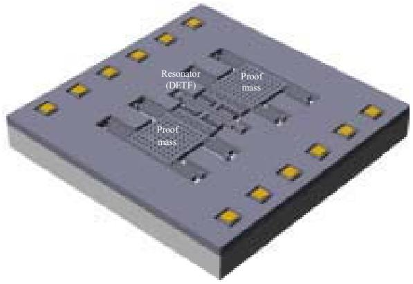  
Fig. 1. Conceptual Drawing of Laterally-Driven Resonant Silicon Accelerometer

Using governing equation based on electrostatic stiffness changing effect, output characteristic of the proposed accelerometer is estimated. The simulation result is shown in Fig. 2.

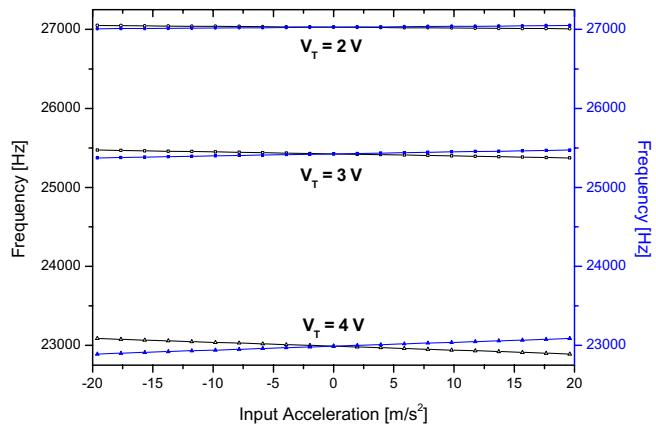

# FABRICATION

A novel micromachining process is developed to use single crystalline silicon as structure layer because it has better mechanical properties than polysilicon. The process is called mixed micromachining process because it uses surface micromachining process and bulk micromachining process partially. The mixed micromachining process is shown in Fig. 2.

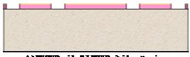

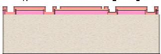

  
  
TEOS   
Nitride

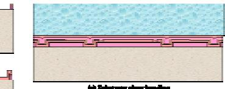

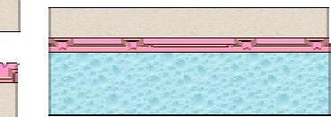  
(1)Unite for tneurment htp   
Fig. 2 Process sequences for the fabrication of DRXLs. (a) 2 um-thick PECVD oxide & 0.2 um-thick LPCVD nitride patterning, (b) 0.5 um-thick bottom polysilicon patterning, (c) Nitride $(0.2\mathrm{um})$ & PECVD oxide $(1\mathrm{um})$ deposition, (d) Intermediate polysilicon deposition & CMP, (e) Substrate glass bonding, (f) CMP for structure layer $(40\mathrm{um})$ , and (g) Structure layer patterning & Release

The SEM pictures of the fabricated DRXL are shown in Fig.3.

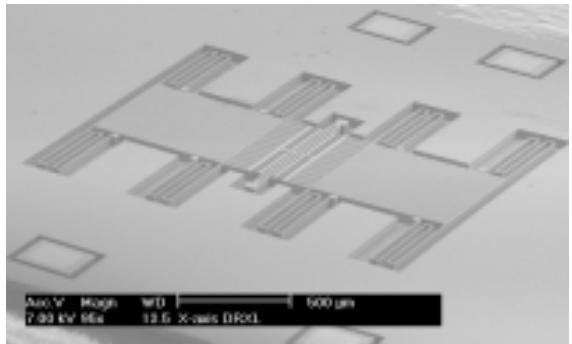

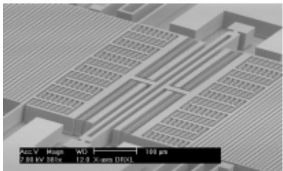  
(a) DRXL   
(b) Resonator (DETF)   
Fig. 3. The SEM pictures of the fabricated laterally-driven DRXL

# MEASUREMENTS

Signal processing unit for DRXLs consists of sensing parts (charge amplifier, high pass filter, amplifier) and driving parts (phase shifter, rectifier, comparator, amplifier) as shown in Fig. 4.

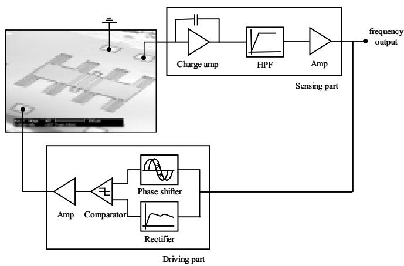  
Fig. 4. Signal-processing unit for DRXL

In sensing parts, the minute signal from the accelerometer is detected and amplified by charge amplifier, the unwanted signal such as $60\mathrm{Hz}$ noise is rejected in high pass filter and output signal is generated by amplifying the resultant signal. For driving resonator of DRXL, the output signal in sensing parts is used to generate driving signal. The phase shifter and rectifier are adopted for self-oscillation and dc voltage respectively, the comparator is used to make square-wave signal and the amplifier is used to adjust the amplitude of driving signal.

The fabricated accelerometer is tested by applying the gravitational force of $-1\mathrm{g}$ , $0\mathrm{g}$ , $1\mathrm{g}$ . One resonator shows sensitivity of $64\mathrm{Hz / g}$ at nominal frequency of $23.4\mathrm{kHz}$ and the other resonator shows sensitivity of $64\mathrm{Hz / g}$ at nominal frequency of $33.4\mathrm{kHz}$ as shown in Fig. 5. Therefore, the differential output between two resonators shows $128\mathrm{Hz / g}$ . The mechanical quality factor is about 200.

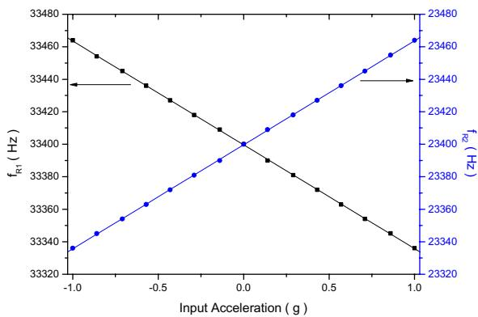  
Fig. 5. Tumble test result

The output frequency fluctuation is important factor to determine the resolution of DRXL, so the Allan variance is measured using SR(Stanford Research)620 frequency counter. The measured result is shown in Fig. 6. The resonant frequency is measured at a different sampling time; 0.01 sec, 0.1 sec, 1 sec, 10 sec. At each sampling time, the frequency is measured 5 times repetitively and averaged. As the sampling time larger, the Allan variance converges a certain value as shown in Fig. 6.

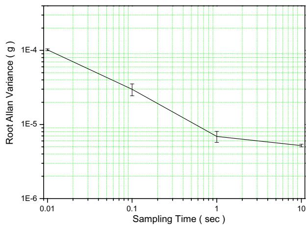  
Fig. 6. Measured Allan variance

The bandwidth of DRXL is also important parameter, so it is measured by applying a step function electrically to proof mass of the accelerometer. The measured output signal for fabricated accelerometer is shown in Fig. 7. The estimated bandwidth is about $110\mathrm{Hz}$ .

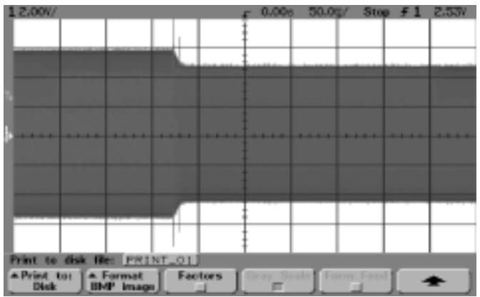  
Fig. 7. Measured Bandwidth

<table><tr><td>Performance Parameter</td><td>Value</td></tr><tr><td>Sensitivity [Hz/G]</td><td>128</td></tr><tr><td>Bias Stability [uG]</td><td>5.2</td></tr><tr><td>Bandwidth [Hz]</td><td>110</td></tr><tr><td>Resonant Frequency [kHz]</td><td>24.9</td></tr><tr><td>Frequency Stability [ppb]</td><td>290</td></tr></table>

# CONCLUSIONS

A differential resonant accelerometer, which utilizes the electrostatic stiffness changing effect of an electrostatic torsional actuator, was proposed and fabricated using $<111>$ single-crystal silicon as the structure material. The mixed-micromachining process was developed using pyrex glass substrate and 40 um-thick single crystal silicon with glass cap for wafer level vacuum packaging. The fabricated accelerometer showed the sensitivity of $64\mathrm{Hz / G}$ per resonator. The measured bias stability estimated by Allan Variance of accelerometer output showed $5.2~\mathrm{uG}$ . Therefore, the developed accelerometer is suitable for navigational application.

# ACKNOWLEDGMENTS

The authors sincerely appreciate that the device was fabricated by ISRC(Inter-university Semiconductor Center) and MTEC(Microsystems Technology Center) in Seoul National University, and would like to special thanks to Samsung Electronics Co. and Samsung Advanced Institute of Technology for their contribution.

# REFERENCES

[1] D. W. Burns, R. D. Horning, W. R. Herb, J. D. Zook, and H. Guckel, “Resonant microbeam accelerometer,” The 8th International Conference on Solid-State Sensors and Actuators, and Eurosensors IX (Transducers '95), Stockholm, Sweden, June 25-29, 1995, pp.659-662.   
[2] T. V. Rozhart, H. Jerman, J. Drake, and C. de Cotiis, "An inertial-grade, micromachined vibrating beam accelerometer," "The 8th International Conference on Solid-State Transducers and Actuators, and Eurosensors IX (Transducers '95), Stockholm, Sweden, June 25-29, 1995, pp.656-658.   
[3] M. Helsel, G. Gassner, M. Robinson and J. Woodruff, "A Navigation Grade Micro-Machined Silicon Accelerometer," IEEE Position Location and Navigation Symposium, April 11-15, 1994, pp.51-58.   
[4] B. L. Lee, C. H. Oh, Y. S. Oh, and K. Chun, “A Novel Resonant Accelerometer: Electrostatic Stiffness Type”, The 10th International Conference on Solid State Sensors and Actuators (Transducer '99), Sendai, Japan, June 7-10, 1999, pp.1546-1549.   
[5] A. A. Seshia, M. Palaniapan, T. A. Roessig, R. T. Howe, R. W. Gooch, T. R. Schimert, and S. Montague, "A Vacuum Packaged Surface Micromachined Resonant Accelerometer," Journal of Microelectromechanical systems, Vol. 11, No. 6, Dec. 2002, pp.784-793.   
[6] K. H. Han and Y. H. Cho, "Self-balanced High-resolution Capacitive Microaccelerometers using Branched Finger Electrodes with High-amplitude Sense Voltage," IEEE the 5th Annual International Conference on Micro Electro Mechanical System (MEMS '02), Las Vegas, Nevada, USA, Jan. 20-24, 2002, pp.714-717.