# Bulk-Micromachined Silicon Resonant Accelerometer

Anping Qiu,Yan Su, Xinhua Zhu,Qin Shi

Research Center of MEMS Inertial Technology

Nanjing University of Science and Technology

Nanjing, P.R.Cjina, 210094

Email:apqiu@mail.njust.edu.cn

Abstract—A micromechanical silicon resonant accelerometer (SRA) with micro leverage mechanism amplifying the inertial force is presented. SRA consists of a pair of double-ended tuning forks (DETF), a proof mass and a micro lever mechanism. Firstly, the relation between frequency shift and applied force of DETF is modeled with the classical Bernoulli-Euler beams theory and then simulated by the finite element analysis (FEA). The conclusion is that analytical analysis results are very close to simulation results. Secondly micro leverage mechanism is presented, and the equations for calculating the amplification factor are derived. The effect of pivot spring and output system constants on the amplification factor is analyzed. According to the analytical results, the SRA is designed and fabricated. Comparison of the obtained experimental results and analytical results shows good agreement.

# I. INTRODUCTION

A resonant accelerometer is an oscillator whose frequency is a function of the quantity being measured. The output of the sensor is the value of the output frequency [1]. These devices have been considered attractive for a number of reasons, including simpler dynamics and control, improved stability, large dynamic range, high resolution, and a quasidigital FM output [2]. In contrast to those currently available commercial silicon accelerometers that translate acceleration into quasi-DC quantities as capacitance or resistance, silicon resonant accelerometer translates acceleration into a change of mechanical vibration and is less susceptible to the power supply and temperature fluctuations [3].

A number of researchers and research groups have worked on silicon resonant accelerometers. Draper Laboratory developed the silicon oscillating accelerometer (SOA) (Fig.1). The goal of the SOA design is to achieve a high SF, high Q resonator to meet the $1 - \mu \mathrm{g} / 1$ -ppm strategic-grade performance requirements. Performance data acquired approach the levels needed for strategic guidance mission [4]. Analog Devices, Inc. demonstrated the feasibility of resonant accelerometers in a surface-micromachining technology, and

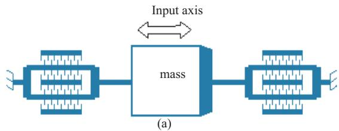

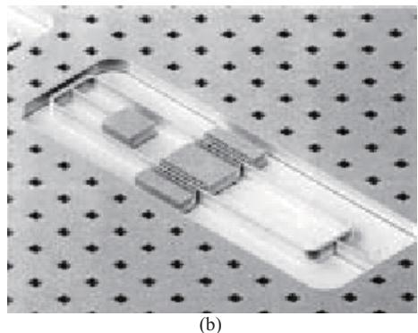  
Figure 1 CSDL SOA (a) schematic, (b) detail

a prototype device has been fabricated in the BiMEMS foundry process (Fig.2). Here the SRA consisted of double-ended tuning fork (DETF) resonators whose natural frequencies are a function of an applied force. Force is transferred to the forks from the proof mass by leverage mechanism [2]. A summary of the basic working principle of the SRA is also provided below in section II.

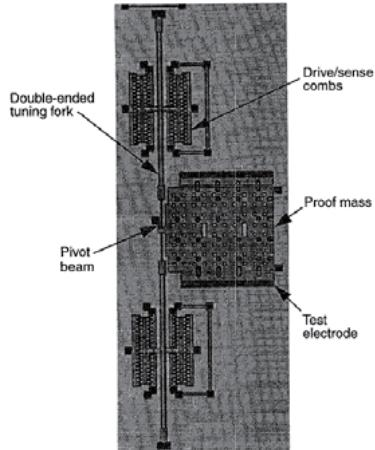  
Figure 2. Microphotograph of fabricated accelerometer

# II. SRA BASICS

Figure 3 shows a schematic of the SRA. Figure 4 shows a SEM image of the accelerometer. The device uses a proof mass leveraged between DETFs. Mechanical structures of the accelerometer is $15\mu \mathrm{m}$ thick, the tuning fork are $6\mu \mathrm{m} \times 650\mu \mathrm{m}$ , and the proof mass is approximately $1\mathrm{mm} \times 1\mathrm{mm}$ . The forks are resonated at their natural frequencies by the sustaining circuitry, and when acceleration is applied to the device, the proof mass hinges about the pivot beam and applies forces to the two DETFs. One of these forks is subject to a tensile force which raises its natural frequency. The other experiences a compressive force, lowering its frequency. The output of the sensor is a change in frequency of the DETF, a quantity that is easily measured using digital techniques [2].

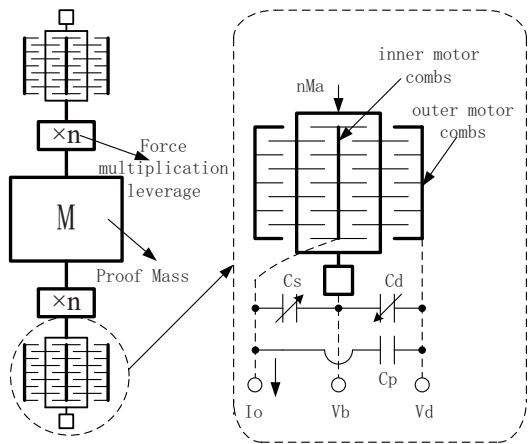  
Figure 3. SRA schematic

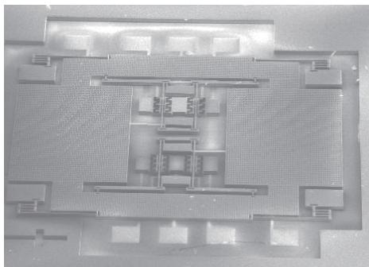  
Figure 4 SEM of silicon resonant accelerometer

# III. DETF RESONATORS DESIGN

The mechanical element of the DETF resonator comprises the two tines, each of which is anchored to the substrate on one end. Each tine has drive comb, a set of electrostatic comb is used to sustain oscillation. One set of combs is used to drive the tines, and the other is used to sense the vibrating of the tines. Assuming plane cross-section of the tines remains plane after deformation (slender beams) and elastic material behavior is linear, the function

of the vibration mode shape of the tine may be derived from a classical theory for Bernoulli-Euler beams. So the equation of motion of the tine can be written [5]

$$
E I \frac {\partial^ {4} y (x , t)}{\partial x ^ {4}} + \rho A \frac {\partial^ {2} y (x , t)}{\partial t ^ {2}} = F (x, t) \tag {1}
$$

where $E$ is the Young's modulus of the material, $I$ is the area moment of inertia of the sine cross section, $\rho$ is the density, $A$ is the beam cross-sectional area, $F$ is the applied axial force.

The Raleigh's energy method is used to obtain the natural frequencies of the tuning forks. The nominal natural frequency $(f_{n,l})$ clamped-clamped beam before loading is given by [7]

$$
f _ {n, 1} = \frac {\omega_ {n , 1}}{2 \pi} = \frac {1}{2 \pi} \sqrt {\frac {1 9 3 . 5 9 E I}{[ 0 . 3 9 2 6 m _ {T} + M ] L ^ {3}}} \tag {2}
$$

When the DETFs are applied the inertial force, the nominal natural frequency after loading is given by [7]

$$
f _ {n, 1} ^ {\prime} = \frac {\omega_ {n , 1} ^ {\prime}}{2 \pi} = \frac {1}{2 \pi} \sqrt {\frac {1 9 3 . 5 9 E I + 4 . 3 6 n M _ {a} a L ^ {2}}{\left[ 0 . 3 9 2 6 m _ {T} + M \right] L ^ {3}}} \tag {3}
$$

Therefore, the natural frequency versus acceleration is given by

$$
\Delta f = f _ {n, 1} ^ {\prime} - f _ {n, 1} \approx 0. 0 6 8 \frac {n M _ {a} L ^ {2} f _ {n , 1}}{E W ^ {3} h} a \tag {4}
$$

We simulate the natural frequency of DETF and the relation between the applied force and the frequency shift by FEA to validate the analytical analysis result. Figure.5 (a) and (b) shows the difference of the analytical analysis and the simulation, and the first vibration mode shape respectively. The relative error of natural frequency of DETF of the analytical analysis and the simulation is less than $0.6\%$ . Figure 6 shows that the frequency shift is proportional to the applied force. The relative error of the frequency shift of the analytical analysis and the simulation is less than $10\%$ .

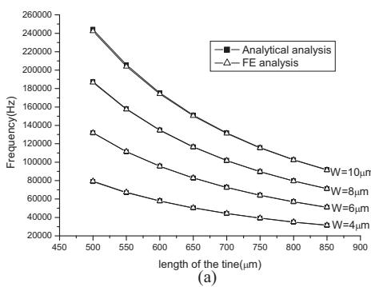

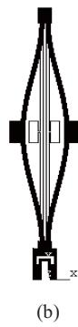  
Figure 5. (a) DETF frequency vs DETF dimension;   
(b) First vibration mode of DETF

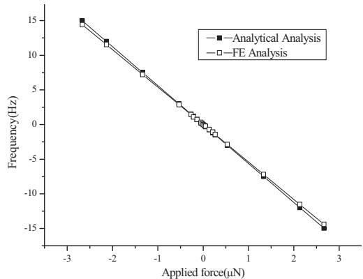  
Figure 6 Frequency shift vs applied force

# IV. MICRO LEVERAGE DESIGN

In order to maximize the scale factor available from the small inertial mass, a leverage system is used to magnify the force applied to the two DETFs [2]. Mechanical transformation in a micro leverage mechanism is achieved by elastic deformation of its component flexure beams. The design of micro leverage mechanisms is different from that of the conventional levers in the macro-world. A pivot structure in the macro-world can be formed by a pin-joint or bearing which permits free rotation and rigid support. With fabrication technology constraints, it is very difficult to achieve free rotation and rigid support in a micro leverage mechanism. The micro leverage mechanism is mainly formed by co-planar flexures. The most commonly used pivot in MEMS is a flexure beam with one side anchored to the substrate as a pseudo-pivot [6]. The geometry of the beam is designed to have a relatively small rotational spring constant allowing easy rotation. A single-stage micro-leverage mechanism is used to magnify the inertial force, which consists of four major parts: lever arm, pivot, the input system and output system, as schematic shown in Figure 7 [6]. Figure 8 shows the deformation schematic of the micro lever.

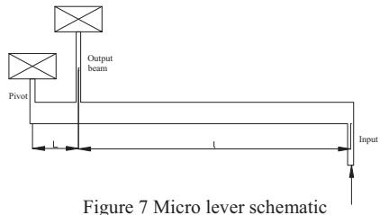

Applying the force and moment equilibrium condition to the lever arm leads to the following equations:

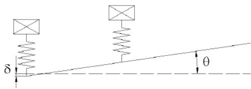  
Figure 8. The micro-leverage under loading

$$
F _ {i n} = k _ {o v} (L \theta + \delta) + k _ {p v} \delta \tag {5}
$$

$$
F _ {i n} l = k _ {o v} (L \theta + \delta) L + k _ {o \theta} \theta + k _ {p \theta} \theta \tag {6}
$$

$$
F _ {o u t} = k _ {o v} (L \theta + \delta) \tag {7}
$$

where $k_{ov}$ and $k_{o\theta}$ are the axial spring constant and the bending spring constant at the output of the micro-lever stage, $k_{pv}$ and $k_{p\theta}$ are the bending spring constant and the axial spring constant of the pivot, $L$ is the length between the pivot and input, and $l$ is the length between the input and output.

Then, the amplification factor $n$ of the micro lever is

$$
n = \frac {F _ {\text {o u t}}}{F _ {\text {i n}}} = \frac {\frac {1}{k _ {p v}} \left(k _ {o \theta} + k _ {p \theta}\right) + l L}{\left(\frac {1}{k _ {o v}} + \frac {1}{k _ {p v}}\right) \left(k _ {o \theta} + k _ {p \theta}\right) + L ^ {2}} \tag {8}
$$

For an ideal lever, $k_{pv} \Rightarrow \infty$ , $k_{p\theta} \Rightarrow 0$ , $k_{o\theta} \Rightarrow 0$ and the amplification factor approaches the lever ratio $n_0$

$$
n _ {0} = \frac {l}{L} \tag {9}
$$

Therefore, for a single-stage micro lever to have the maximum amplification factor, both $k_{ov}$ and $k_{pv}$ should be as large as possible and both $k_{o\theta}$ and $k_{p\theta}$ as small as possible. In other words, the pivot and output system need to be axially stiff, but easy to rotate [6].

In order to validate the analytical analysis result, the amplification factor of the micro lever is simulated by FEA. Table I lists the calculated amplification factor $n_{c}$ and simulated $n_{s}$ . The error between the analytical result and simulation result is less than $1.5\%$ .

Table I. Comparison between the ${n}_{c}$ and ${n}_{s}$   
V. FABRICATION AND TESTS   

<table><tr><td colspan="2">Pivot (length × width) (μm)</td><td>40×6</td></tr><tr><td colspan="2">Lever arm (length × width)(μm)</td><td>461×40</td></tr><tr><td colspan="2">Output beam (length × width)(μm)</td><td>650×6</td></tr><tr><td rowspan="2">Amplification factor</td><td>nc</td><td>18.2</td></tr><tr><td>ns</td><td>17.95</td></tr></table>

The resonant accelerometer described above was fabricated by the dissolved wafer process (DWP). Figure 9 illustrates the fabrication process flow including heavily boron doping, RIE etching, ICP etching, Ti-Pt-Au depositing, electrostatic bonding and EPW release etching, and so on.

Table II lists the experimental results. The resonant frequencies of DETF I and DETF II are about $88.65\mathrm{kHz}$

and $88.89\mathrm{kHz}$ , a mismatch of $0.27\%$ . The scale factor of DETF I as measured with $\pm 1\mathrm{g}$ test is $14.35\mathrm{Hz / g}$ , and DETF II $13.95\mathrm{Hz / g}$ , a mismatch of $2.8\%$ . The micro lever amplification is about 14-15. The relative error of the micro lever amplification of the analytical analysis and the experiment value is less than $20\%$ .

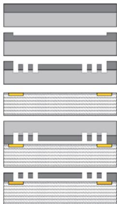  
A. heavily boron diffused   
B. RIE etch bonding contacts   
C. ICP deep etch structure   
D. Ti-Pt-Au deposit   
E. Silicon/glass electrostatic bonding   
F. EPR Release etch   
Figure 9. Fabrication process flow for the SRA

Table II output of the DETF under $\pm 1\mathrm{g}$ loading   

<table><tr><td rowspan="2">DETF</td><td colspan="3">Resonant frequency(kHz)</td></tr><tr><td>0g</td><td>-1g</td><td>+1g</td></tr><tr><td>I</td><td>88.6525</td><td>88.6693</td><td>88.6406</td></tr><tr><td>II</td><td>88.8920</td><td>88.8771</td><td>88.9050</td></tr></table>

# VI. CONCLUSION

The SRA consists of a pair of DETF, a proof mass and a micro lever mechanism. The frequency shift is proportional to the applied acceleration. The SRA was fabricated by the dissolved wafer process. Under static measurements with $\pm 1\mathrm{g}$ , the scale factor of DEFT I is $14.35\mathrm{Hz / g}$ , and DETF II

$13.95\mathrm{Hz / g}$ . The slight mismatch may be caused by fabrication error and residual stress. Future work is focused on increasing the SRA sensitivity and adopting silicon-on-glass (SOG) process in replace of DWP.

# ACKNOWLEDGMENT

The authors are grateful to Dr.Yang Yongjun and his colleagues of Heibei Semiconductor Research institute for fabrication the devices. This work is supported by the foundation for the National Natural Science Foundation of China under No.10572039.

# REFERENCES

[1] Trey A. Roessig, "Integrated MEMS Tuning Fork Oscillators for Sensor Applications," Ph.D. dissertation, Univ. California, Berkeley, CA, 1998.   
[2] Trey A. Roessig, Roger T. Howe, Albert P. Pisano, and James H. Simuth, "Surface-Micromachined resonant accelerometer," International Conference on Solid-State Sensors and Actuators, Chicago, 1997, pp 859-862.   
[3] Lin He, Yong-ping Xu, and Anping Qiu. "Folded Silicon Resonant Accelerometer with Temperature Compensation," The $3^{\mathrm{rd}}$ IEEE Conference on Sensors, 24-27 Oct 2004, Vienna University of Technology, Vienna, Austria.   
[4] Ralph E. Hopkins, et al., "The Silicon Oscillating Accelerometer: A MEMS Inertial Instrument for Strategic Missile", Guidance Missile Sciences Conference, Monterey, CA, November 7-9, 2000.   
[5] Xu Benying et al., "Elements of mechanical vibration and modal analysis," Publishing House of Mechanical Industry, 1998.   
[6] Xiao-Ping Susan Su, "Compliant leverage mechanism design for MEMS applications," Ph.D. dissertation, Univ. California, Berkeley, CA, 2001.   
[7] Anping Qiu Shourong Wang and Bailing Zhou. "A Micromachined resonant gyroscope," The 5th International Symposium on Instrument and Control Technology., 24-27 Oct 2004, Beijing, China.