PAPER

# Sensitivity and temperature behavior of a novel $z$ -axis differential resonant micro accelerometer

To cite this article: C Comi et al 2016 J. Micromech. Microeng. 26 035006

View the article online for updates and enhancements.

# You may also like

Investigation of electrode pitch on resonant and capacitive characteristics in X-cut $\mathrm{LiNbO_3}$ membrane-based laterally-excited bulk acoustic resonator Jie Zhou, Yuchen Fan, Xin Tong et al.   
- Precise identification of $<100>$ directions on Si(0 0 1) wafer using a novel self-alignment pre-etched technique  
S S Singh, S Veerla, V Sharma et al.   
- An automatic contour propagation method to follow parotid gland deformation during head-and-neck cancer tomotherapy  
E Faggiano, C Fiorino, E Scalco et al.

# Sensitivity and temperature behavior of a novel z-axis differential resonant micro accelerometer

C Comi1, A Corigliano1, G Langfelder2, V Zega1 and S Zerbini3

$^{1}$ Department of Civil and Environmental Engineering, Politecnico di Milano, 20133 Milan, Italy   
$^{2}$ Department of Electronics, Information and Bioengineering, Politecnico di Milano, 20133 Milan, Italy   
3 AMS group, STMicroelectronics, 2010 Cornaredo, Milan, Italy

E-mail: claudia.comi@polimi.it

Received 19 November 2015

Accepted for publication 11 December 2015

Published 2 February 2016

  
CrossMark

# Abstract

The present work concerns the operating principle and a thorough experimental characterization of a new polysilicon resonant micro accelerometer for out-of-plane measurements, fabricated using an industrial surface micromachining technique. This device is characterized by differential resonant sensing, obtained from the variation of the electrostatic stiffness of two torsional resonators under the application of an external acceleration. The sensitivity, defined as the differential shift in resonance frequencies per gravity unit $(\lg = 9.8\mathrm{ms}^{-2})$ , is of about $10\mathrm{Hzg}^{-1}$ when operated at a DC bias of $1.5\mathrm{V}$ only. Over an acceleration range larger than $10\mathrm{g}$ , the deviation from linearity is lower than $1\%$ and the cross-axis rejection is larger than $34\mathrm{dB}$ . The resonators temperature coefficients of frequency, in the order of $-29\mathrm{ppm}^{\circ}\mathrm{C}^{-1}$ , are matched within about $0.1\%$ , resulting in linear offset drifts against temperature lower than $5\mathrm{mg}$ up to $95^{\circ}\mathrm{C}$ in absence of any digital compensation.

Keywords: MEMS, resonant accelerometer, torsional resonators

(Some figures may appear in colour only in the online journal)

# 1. Introduction

Micro-Electro-Mechanical Systems (MEMS) are nowadays largely used for inertial measurements in the consumer and automotive market. Many transduction principles are employed for their operation; among them, capacitive sensing is the most popular and consolidated one. For several kinds of MEMS (see e.g. [1, 2]), resonant sensing has recently been proposed as an alternative way to improve the long-term performance.

Also in the case of accelerometers, an alternative to capacitive sensing is represented by resonant micro-devices, which measure the external acceleration through the frequency variation of resonating elements. With respect to capacitive accelerometers, MEMS resonant accelerometers have the advantage of the direct frequency to digital conversion (see [3]).

Further, they show a large dynamic range [4] and they are void of 1/f noise issues related to operation without signal

modulation. Finally, for similar target performance, the overall area can be smaller than in capacitive solutions [5] where most of the space is usually occupied by parallel-plate stators. One critical issue of resonant accelerometers, often neglected in the literature, is the simultaneous need for a relatively large quality (Q) factor (e.g. several hundred) of the resonating elements, and a small Q factor of the proof mass, to avoid long ring-down times in case of shocks. These ring-down signals occur at the resonance frequency of the proof mass and have a duration directly proportional to the quality factor. They can be electronically filtered, but at the cost of a reduced system bandwidth.

Different operating principles can be exploited to induce a frequency variation in suitable mechanical elements under an external acceleration: in the devices proposed in [4, 6-14], the frequency variation is caused by the presence of axial stresses in resonating elements. In [15] the frequency change of parallel beam resonators is due to the variation of the momentum

of inertia. In [16-18] the effect of the variation of electrostatic stiffness due to the gap change is used. The in-plane accelerometer proposed in [18] has two masses connected by tuning fork resonators; the anti-phase mode of the coupled tuning fork resonators is modulated by the in-phase displacement of the two masses, which induces an electrostatic softening. A discussion on the relevance of the difference between the Q factor of the in-plane mode of the proof masses and of the resonant mode is also given, yet the value of the proof mass Q factor is not computed. Most of mentioned works relates to in-plane devices, while only a few examples of out-of-plane sensing devices are presented [12, 14-19]: these latter are characterized by proof masses ranging from $60 \cdot 10^{-9} \mathrm{~kg}$ to $35 \cdot 10^{-7} \mathrm{~kg}$ .

In this work we study and experiment in detail a novel out-of-plane accelerometer, derived after previous works [20, 21]. The device makes use of the gap sensitive variation of the electrostatic stiffness of two torsional resonators and allows for differential sensing. The proof mass mode occurs at about $2.5\mathrm{kHz}$ , with the torsional resonators mode occurring one order of magnitude above, at about $25\mathrm{kHz}$ . The mass of the device is of about $7.56 \cdot 10^{-9}\mathrm{kg}$ only, very compact with respect to the aforementioned literature. In this work, we give a complete description of the analytical and experimental characterization of this device, showing simultaneously a Q factor of the resonators of about 850, and a Q factor of the proof mass of about 70, compatible (at the given resonance frequency) with applications requiring bandwidths in the order of $100\mathrm{Hz}$ . Tests performed up to $14\mathrm{g}$ reveal a differential sensitivity of about $10\mathrm{Hz}\mathrm{g}^{-1}$ , with a $1\%$ deviation from linear full-scale-range up to $10\mathrm{g}$ after which an unavoidable non-linearity arises because of the nonlinear dependence of the electrostatic softening on the gap distance in parallel plates. Further, the good matching of the resonators frequencies results in almost identical temperature coefficients of frequency for the two resonators, which gives a matched (within about $0.1\%$ up to $95^{\circ}\mathrm{C}$ ) frequency shift under temperature variations, which is thus rejected by the differential readout.

The paper is organized as follows: section 2 describes the operation principle and the design of the resonant accelerometer, with particular focus on the effects of the external acceleration on the resonating parts. Section 3 is dedicated to the description of the novel polysilicon micro-accelerometer fabricated through the ThELMA (thick epipoly layer for micro-actuators and accelerometers) surface micromachining technique from ST Microelectronics. Section 4 presents the experimental results and their comparison with the theoretical predictions. Closing remarks and perspectives of coupling with integrated circuits are presented in section 5.

# 2. Device design

# 2.1. Operating principle

The proposed accelerometer, schematically shown in figure 1, is composed by a suspended, planar, perforated proof mass $m$ of thickness $s$ , connected to the substrate via a pair of 5-fold torsional springs, and by two torsional resonators. These

resonators, labeled A and B in figure 1, consist of a plate of in-plane dimensions $L \times 2b$ and of two folded torsional springs attached to the proof mass.

The two torsional elements can be kept in resonant oscillation according to their torsional natural mode by the driving electrodes located below them on the substrate. Two further independent electrodes placed on the substrate allow for motional current detection, see figure 1(b). When in the rest position, the mass is nominally at distance $g_{0}$ from both the electrodes and the torsional resonators have the same nominal frequency $f_{0}$ :

$$
f _ {0} = \frac {1}{2 \pi} \sqrt {\frac {K _ {m} - K _ {e}}{\rho J _ {\mathrm {m a s s}}}} \tag {1}
$$

where $\rho J_{\mathrm{mass}}$ is the centroidal mass moment of inertia of the rigid mass of the resonators, $\rho$ is the mass density, $K_{m}$ is the rotational mechanical stiffness and $K_{e}$ is the rotational electrostatic stiffness. The mechanical stiffness is provided by the two folded suspension springs and reads

$$
K _ {m} = \frac {2 G J}{l} f _ {c} \tag {2}
$$

where $J$ is the torsional momentum of inertia of the springs, $l$ is the total length of one of the folded torsional springs, $G$ is the equivalent shear elastic modulus of polysilicon, assumed here as linear elastic, homogeneous and isotropic, and $f_{c}$ is the corrective factor which takes into account the folds of the beams. The corrective factor is computed through finite element analysis in Comsol Multiphysics and its value is 1.13 for the fabricated device later considered in sections 3 and 4.

The electrostatic contribution to the stiffness depends on the actuation scheme, which is shown in figure 2 for resonator B. Both the driving and the sensing electrodes are kept at the constant polarization voltage $V_{p}$ , while the mass is connected to ground (the opposite situation with a biased mass and grounded or virtually-grounded electrodes would lead to identical results). By applying a variable AC voltage $\nu_{a}(t)$ to each resonator driving electrode, the resonator plate is electrostatically actuated and can dynamically vibrate. The rotation $\theta(t)$ of the resonating plate causes a variation of the gap and hence a variation of the electrostatic force. The resulting torque (positive clockwise) acting on the resonator labeled B is:

$$
\begin{array}{l} T _ {e} = \int_ {c} ^ {b} \frac {1}{2} \frac {\epsilon_ {0} L}{\left(g _ {0} - \theta x\right) ^ {2}} \left(V _ {p} + v _ {a}\right) ^ {2} x d x \\ + \int_ {- b} ^ {- c} \frac {1}{2} \frac {\epsilon_ {0} L}{\left(g _ {0} - \theta x\right) ^ {2}} V _ {p} ^ {2} x d x \tag {3} \\ \end{array}
$$

where $\epsilon_0$ is the vacuum dielectric constant and $2c$ is the distance between the sensing and driving electrodes as shown in figure 2.

Under the assumption of (i) small rotation $\theta(t)$ and (ii) small actuation voltage $v_{a}(t)$ with respect to $V_{p}$ , developing (3) up to the first order gives:

$$
T _ {e} \approx T _ {e 0} + K _ {e} \theta \quad \text {w i t h} \quad K _ {e} = \frac {2 \epsilon_ {0} L}{3 g _ {0} ^ {3}} V _ {p} ^ {2} \left(b ^ {3} - c ^ {3}\right) \tag {4}
$$

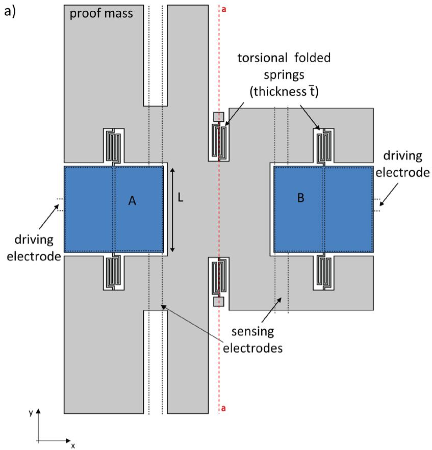

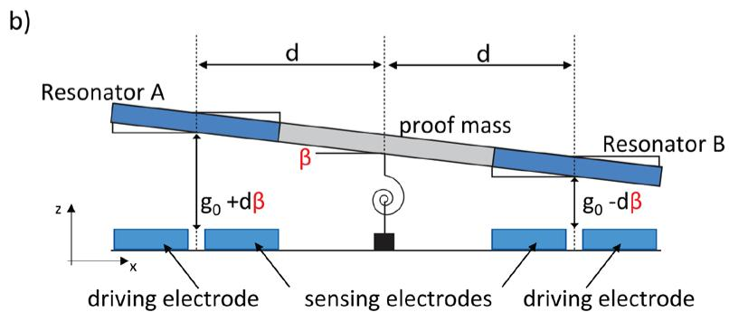  
Figure 1. (a) Schematic in-plane view of the proposed resonant accelerometer. (b) Schematic side view of the electrostatically actuated accelerometer, tilted under an external acceleration.

where the electrostatic stiffness $K_{e}$ contribution appears. Note that this term quadratically increases with the polarization voltage. We also note here that the resonators will be operated in their linear mechanical regime: for a further description of the behavior of the resonator also in this nonlinear regime, the reader can refer to [22].

When an external out-of-plane acceleration $a_{z}$ is applied, the proof mass rotates around the axis $a - a$ in figure 1, and the gap between the resonators and the electrodes changes as shown in figure 1(b). The angle of rotation is proportional to the acceleration and it is expressed as:

$$
\beta = - \frac {3}{2} \frac {m a _ {z} R _ {\mathrm {G}}}{G s \bar {t} ^ {3}} \bar {l} \tag {5}
$$

where $R_{\mathrm{G}}$ is the distance between the $a - a$ axis of rotation of a proof mass and the center of gravity of the same mass, $\bar{l}$ is the total length of one folded torsional spring attaching the mass

to the substrate and $\bar{t}$ is its in-plane thickness. In particular, a first resonator element approaches the substrate and its gap reduces to $g_0 - d\beta$ while the other resonator element moves away from the same substrate and its gap increases to $g_0 + d\beta$ , $d$ being the distance between the $a$ - $a$ axis and the rotation axis of the torsional resonator (see figure 1(b)). Therefore, the electrostatic stiffness for resonators A and B changes from equation (4) into, respectively:

$$
K _ {e A} = \frac {2 \epsilon_ {0} L}{3 (g _ {0} + d \beta) ^ {3}} V _ {p} ^ {2} \left(b ^ {3} - c ^ {3}\right)
$$

$$
K _ {e B} = \frac {2 \epsilon_ {0} L}{3 (g _ {0} - d \beta) ^ {3}} V _ {p} ^ {2} \left(b ^ {3} - c ^ {3}\right) \tag {6}
$$

and their resonance frequency obtained by replacing in (1) $K_{e}$ with $K_{eA}$ and $K_{eB}$ respectively, changes in a differential way. Combining the readout $f_{\mathrm{A}}$ and $f_{\mathrm{B}}$ of the two torsional resonators after the application of the external acceleration $a_{z}$ ,

linearized around the natural frequency $f_{0}$ expressed in (1), the following expression is finally obtained:

$$
f _ {\mathrm {B}} - f _ {\mathrm {A}} \approx - 3 f _ {0} \frac {K _ {e}}{K _ {m} - K _ {e}} \frac {\mathrm {d} \beta}{g _ {0}} = \frac {9}{2} f _ {0} \frac {K _ {e}}{K _ {m} - K _ {e}} \frac {d m R _ {\mathrm {G}} \bar {l}}{g _ {0} G s \bar {t} ^ {3}} a _ {z} \tag {7}
$$

where $K_{e}$ is the electrostatic stiffness defined in (4). Note that the sensitivity of the accelerometer increases with the applied polarization voltage and strongly depends on the mechanical design. The latter can be optimized at fixed overall mass $m$ , for given technological constraints, by changing (i) the resonator distance $d$ from the rotation axis and (ii) the gravity center distance of the mass $(R_{\mathrm{G}})$ from the rotation axis. It should be noted, however, that the rotation angle $\beta$ and hence $R_{\mathrm{G}}$ through equation (5) is limited by the maximum out of plane displacement allowed by the gap $g_{0}$ .

# 2.2. Electrostatic response of the proof mass

The bias voltage appears in the expression of the sensitivity. However, as in operation this voltage is applied between the torsional proof mass and the resonators drive and sense electrodes, pull-in issues should be avoided and a trade-off in the choice of $V_{p}$ arises. It is therefore relevant to analyze the electrostatic behavior of the proof mass, by writing the expression of the nominal limit voltage in these conditions, which can be easily derived by solving the torque balance between the applied electrostatic forces and the mechanical reaction forces. In quasi-stationary conditions it reads:

$$
\begin{array}{l} V _ {p} (\beta) = \left[ (2 \bar {K} _ {m} \beta^ {3}) / \left(\epsilon_ {0} L \left(- \frac {g _ {0}}{g _ {0} - \beta (c + d)} + \frac {g _ {0}}{g _ {0} - \beta (d + b)} \right. \right. \right. \\ - \frac {g _ {0}}{g _ {0} - \beta (d - b)} + \frac {g _ {0}}{g _ {0} + \beta (c - d)} - \frac {g _ {0}}{g _ {0} - \beta (b - d)} \\ + \frac {g _ {0}}{g _ {0} + \beta (d - c)} + \frac {g _ {0}}{g _ {0} + \beta (d + b)} - \frac {g _ {0}}{g _ {0} + \beta (d + c)} \\ \left. \left. + \log \left(\frac {\left(g _ {0} ^ {2} - \beta^ {2} (d + b) ^ {2}\right) \left(g _ {0} ^ {2} - \beta^ {2} (c - d) ^ {2}\right)}{\left(g _ {0} ^ {2} - \beta^ {2} (b - d) ^ {2}\right) \left(g _ {0} ^ {2} - \beta^ {2} (c + d) ^ {2}\right)}\right)\right)\right) \Bigg ] ^ {\frac {1}{2}} \tag {8} \\ \end{array}
$$

where $\overline{K}_m = 2G\overline{J} f_c / \bar{l}$ is the mechanical stiffness provided by the two folded torsional springs that attach the proof mass to the substrate. Note that $\bar{l}$ is the length of these torsional springs and $\overline{J}$ is the torsional momentum of inertia. As discussed in [20], the pull-in voltage and the pull-in angle can be analytically computed by computing the maximum of $V_{p}(\beta)$ in equation (8).

# 3. Fabricated device

The device is fabricated using the THELMA® surface micromachining process developed by STMicroelectronics [23], with an out of plane thickness $s = 22 \mu \mathrm{m}$ . SEM images of the fabricated resonant accelerometer and of one of the two torsional resonators are shown in figure 3. The shape of the proof mass is optimized, with respect to [20], in order to obtain a

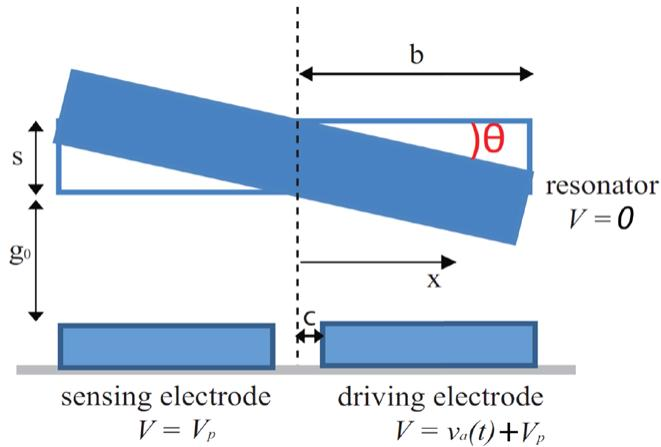  
Figure 2. Side-view scheme of the torsional resonator, labeled B in figure 1, with electrostatic actuation; $V_{p} =$ fixed polarization voltage, $\nu_{a}(t) =$ oscillating driving voltage.

high sensitivity while simultaneously limiting the out-of-plane displacement of the edge points of the proof mass (see [24] for details concerning optimization). A large out-of-plane displacement of the edge points of the proof mass, in fact, could compromise the operation of the device if stiction problems arise between the mass itself and the substrate.

The T-shaped proof mass and the square mass of the two resonators A and B have holes to allow for the complete oxide removal below them. The stopper angular blocks of thick epitaxial polysilicon and parts of the thinner electrodes below the proof mass are also visible.

Finite-element-method simulations are used to assist the device design: the proof mass is designed to oscillate at about $2.5\mathrm{kHz}$ (see figure 4(a)), which is compatible with an accelerometer bandwidth of a few hundred $\mathrm{Hz}$ after proper electronic filtering. This is a value within common consumer application specifications. The resonators are designed to operate in torsional mode (see figure 4(b)) one order of magnitude above $(25\mathrm{kHz})$ , to maximize the decoupling between the resonator motion and the mass.

The values of the material and geometrical data are reported in table 1; note that the in-plane dimensions account for a nominal over etch of $0.35\mu \mathrm{m}$ with respect to the designed mask of the suspended parts.

With the given parameters and under the hypothesis of full symmetry, the nominal pull-in voltage turns out to be $V_{pi} = 3.43\mathrm{V}$ , a value which is experimentally verified in section 4.3. To safely avoid critical pull-in instability, the device is therefore biased at $V_{p} = 1.5\mathrm{V}$ in operation.

The accelerometers are packaged at low pressure (1 mbar) with a wafer-to-wafer bonding technique and with the use of a getter to compensate degassing in the MEMS cavity, thus limiting fluid damping. In particular, predictions on the resonators quality factor $Q$ were done by accounting that (i) at the given package pressure the mean free path of gas molecules equals about $63\mu \mathrm{m}$ , and that (ii) the characteristic length of the flow equals the gap $g_{0} = 1.8\mu \mathrm{m}$ . Under this assumptions, the Knudsen number is larger than 10, and consequently the free molecule flow regime is entered. In this regime, the quality factor of the resonators can be estimated as proposed

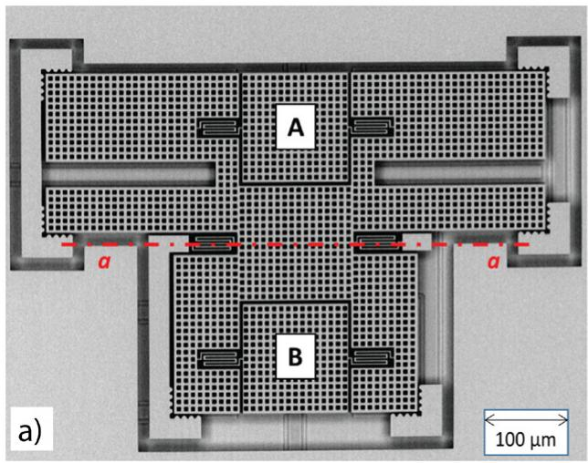

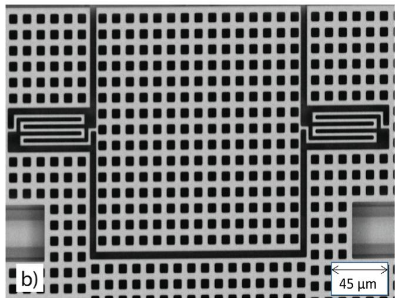  
Figure 3. (a) SEM image of the fabricated $z$ -axis T-shaped accelerometer with two torsional resonators (A and B), with the $a - a$ axis of rotation shown in red; (b) close up view of one of the two torsional resonators.

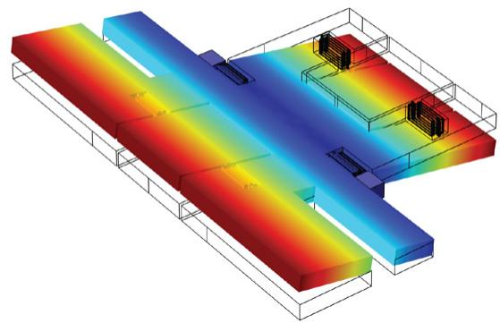  
a)

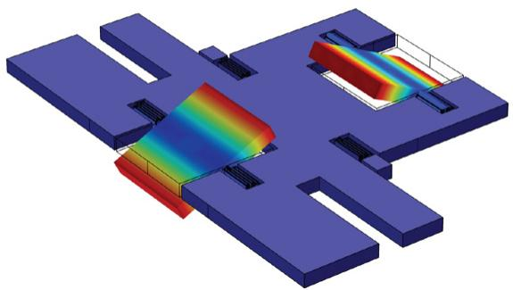  
b)   
Figure 4. Modal analysis of the T-shaped resonant accelerometer, colors represent the contour plot of displacements module. (a) First mode of the proof mass; (b) first mode of the resonators.

in [25, 26] for an oscillating rectangular plate without holes. For the actual geometric parameters one obtains $Q = 530$ . The presence of holes however reduces the dissipation, and results in a higher quality factor.

For a more accurate estimation a numerical analysis is required, as discussed in [27].

# 4. Results

# 4.1. Experimental set-up

Several experimental measurements have been carried out on the proposed resonant accelerometer to characterize first the electrostatic behavior and the dynamics of the resonating parts, then the sensitivity, linearity and cross-axis rejection, and finally the temperature-dependent behavior.

For this purpose, the MEMS is wire-bonded onto a ceramic carrier (figure 5(a)). Characterization is fully done by using a MEMS Characterization Platform (MCP-G by ITmems s.r.l.) for pull-in, step-response and spectral measurements shown in the following. In particular, for the latter measurements (the most frequent ones in the following), the excitation AC voltage signal amplitude is set to $40\mathrm{mV}$ . The biasing DC

Table 1. Key parameters of the device.   

<table><tr><td>Parameter</td><td>Value</td><td>Units</td></tr><tr><td>G</td><td>6.15</td><td>GPa</td></tr><tr><td>L</td><td>143.90</td><td>μm</td></tr><tr><td>RG</td><td>43.53</td><td>μm</td></tr><tr><td>m</td><td>7.55·10-9</td><td>Kg</td></tr><tr><td>d</td><td>162.5</td><td>μm</td></tr><tr><td>l</td><td>262</td><td>μm</td></tr><tr><td>t</td><td>2.1</td><td>μm</td></tr><tr><td>b</td><td>77.65</td><td>μm</td></tr></table>

voltage is set to $1.5\mathrm{V}$ , unless otherwise specified. For the sensitivity measurements, the device is mounted at one edge of the turning plate of an Acutronic rate table (figure 5(b)), to exploit the centrifugal DC acceleration obtained during a DC rotation. Coupling between the device and the MCP-G occurs in this case through the rate table connectors.

Finally, for measurements at different temperature the device is placed inside a climatic chamber from Angelantonis.r.l., (figure 5(c)) and again directly coupled to the MCP-G. As no nitrogen control is available inside the chamber,

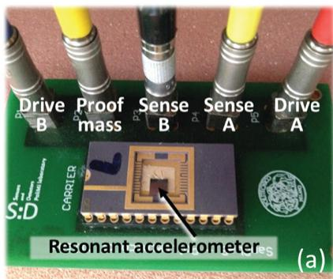

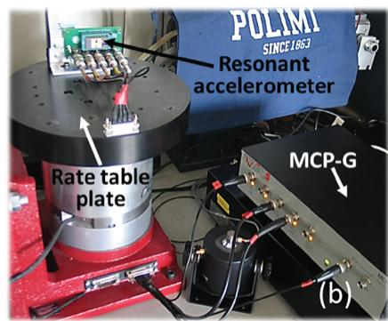

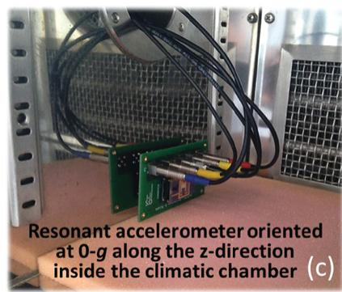

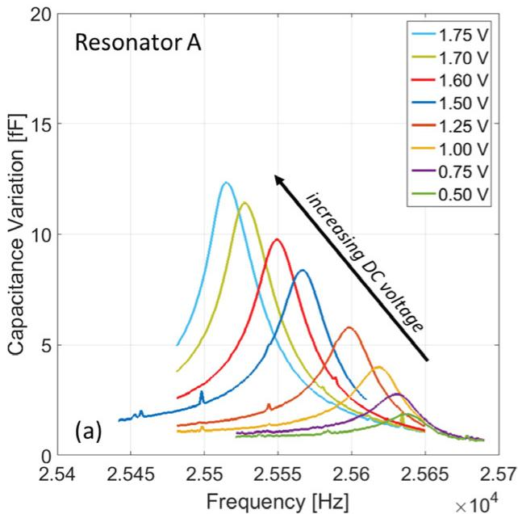  
Figure 5. Overview of the setups used in this work for the device characterization: (a) detail of the MEMS die, glued and wire bonded to a ceramic carrier, plugged into a socket board. The board can be either mounted on the rate table to apply centrifugal accelerations (b), or put inside the climatic chamber for temperature measurements (C), coupled to the same actuation and readout instrumentation.

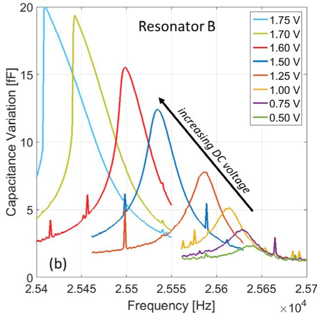  
Figure 6. Resonance spectra as a function of the oscillation frequency for the torsional resonators labeled A (a) and B (b) in figure 1. Different curves refer to different DC voltages, increasing as indicated by the arrow.

measurements are not performed below $5^{\circ}\mathrm{C}$ to avoid water vapor condensation on the exposed electrical parts (pads and wire bonding), which may cause short circuits. Note that the device only, and no electronics, is positioned inside the chamber, so that the pure thermo-mechanical behavior is captured.

# 4.2. Preliminary characterization of torsional resonators

The frequency response of the resonators was first investigated to accurately identify those parameters that may be subject to process spread during fabrication. These are the actual over-etch (nominally $0.35\mu \mathrm{m}$ for this process and this value was taken into account during the design), the initial possible offset inclination of the accelerometer proof mass $\beta_0$ due to fabrication imperfections and/or residual stresses (it is nominally zero), and the Q-factor value.

To obtain the frequency response of the torsional resonators, the small, sweeping, oscillating AC voltage was applied at one driving electrode and a constant DC voltage $V_{p}$ was

applied to both the driving and sensing electrodes as already discussed in figure 2. Different tests at increasing polarization voltage between $0.5\mathrm{V}$ and $1.75\mathrm{V}$ were performed. The resonant frequency was considered as the peak of the output signal, measured as the corresponding rms capacitance variation of the resonator sense electrode.

Figures 6(a)-(b) show the measured spectra for the resonators (the visible spikes and noise, in particular for resonator B, are due to the complicated connections that couple to disturbances, as the device was already mounted on the rate table). From such measurements, the quality factor of the resonators was estimated from the full width at $1 / \sqrt{2}$ of the peak value. The resulting values are $Q_{\mathrm{A}} = 842$ and $Q_{\mathrm{B}} = 837$ for resonators A and B respectively. The small difference is within the estimation accuracy.

Figure 7 summarizes the results: dots represent the experimental resonance frequency values as a function of the applied DC voltage up to $1.6\mathrm{V}$ : note that above this value the response for resonator B begins showing pronounced electrostatic nonlinearity.

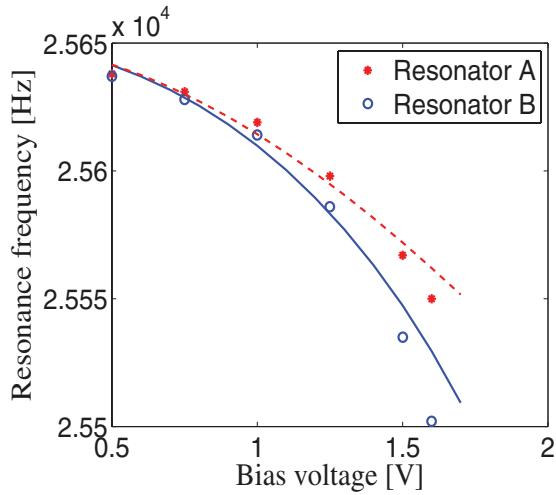  
Figure 7. Resonance frequency as a function of the applied DC voltage for the two torsional resonators, as inferred from the measurements of figure 6. A theoretical prediction is superimposed and the values of the over etch and of the initial offset of the proof mass are computed.

It is evident that frequencies and amplitudes of the two resonators tend to match under no applied voltage and tend to separate under large voltages. This suggests a gradual tilt of the suspended mass under the applied bias, which in turn indicates a non-zero initial offset angle $\beta_0$ .

The initial inclination, together with the over etch due to the fabrication process, can be estimated through comparison between experimental data and theoretical prediction. Minimizing the rms error between the theoretical prediction and the experimental values, a value of over etch and of the initial inclination of the proof mass are computed. For this purpose in figure 7(a) theoretical prediction of the frequency variation due to the bias voltage, computed considering the real actuation scheme used during measurements, is superimposed to the experimental data allowing the estimation of the initial offset of the proof mass $(\beta_0 = 0.0019\mathrm{rad} = 0.11^{\circ})$ together with the over etch $(oe = 0.30\mu \mathrm{m})$ .

The presence of the initial inclination of the proof mass $(\beta_0)$ of the accelerometer therefore justifies the different trend of the frequency variation with bias voltage amplitudes.

# 4.3. Static and dynamic electromechanical characterization of the proof mass

After the characterization of the torsional resonators, other experimental measurements were performed to characterize the electromechanical behavior of the whole proof mass. In particular, it is of interest to verify the pull-in limit, which represents another possible limitation to $V_{P}$ increase, in addition to nonlinearities discussed in the previous section.

For the electrostatic characterization, the mass of the accelerometer was swept with a constant incremental voltage $V_{p}$ until pull-in occurs. The drive electrodes and the sense electrodes of both resonators were short circuited to a virtual ground for the capacitance measurements between them and the proof mass. The experimental results in terms of capacitance variation versus polarization voltage are shown

in figure 8(a), the measurements being repeated 8 times. The reader can note a first region where the differential capacitance has a negligible variation with respect to the proof mass voltage, as expected for an ideally symmetrically actuated and sensed differential capacitance. The instability pull-in voltage occurs at about $2.2\mathrm{V}$ , slightly anticipated by a small parabolic variation, which is caused by the native tilt angle $\beta_0$ measured above. Thanks to the relatively large stiffness of the suspended mass, pull-out always occurs quite close to the pull-in point, and stiction is never observed. Note that the pull-in value computed under the hypothesis of ideal device through (8) is slightly higher than the experimental one because of the presence of the initial offset of the proof mass $\beta_0$ which was not considered in the theoretical prediction.

Following the presented pull-in measurements, the value used for in-operation tests under accelerations was selected to be $V_{p} = 1.5\mathrm{V}$ , safely far from the instability conditions.

A second interesting point is the proof mass dynamic characterization, performed by applying a quasi-stationary voltage to the short-circuited drive and sense electrodes of resonator A up to a value $V_{\mathrm{step}}$ , while the proof mass is kept to ground. In this way the mass is slowly rotated up to an established perturbed position. Then, through a downward voltage step, $V_{\mathrm{step}}$ , the mass is instantaneously released. As a result, it starts to vibrate around its rest position and its motion can be detected through the real-time monitoring of the capacitance variation measured at the short-circuited drive and sense electrodes of resonator B.

Figure 8(b) shows the time response of the device: by fitting the experimental results, it is possible to measure the fundamental natural frequency $f_0 = 2.44\mathrm{kHz}$ and the quality factor $Q = 69$ . Note that the quality factor of the proof mass is more than one order of magnitude lower than that of the resonators, thus complying with one of the requirements underlined in the introduction of this work (the corresponding ring-down constant $\tau_{\mathrm{rd}} = Q / (\pi \cdot f_0)$ is compatible with approximately a $100\mathrm{Hz}$ bandwidth).

Finally, figure 8(c) shows the obtained capacitance variation when the suspended mass is kept biased at $V_{p} = 0\mathrm{V}$ , and it is excited in the electrical configuration described by figure 2 with an AC amplitude of $100\mathrm{mV}$ . The measured peak frequency drops to about $2.15\mathrm{kHz}$ as a consequence of the electrostatic tuning which unavoidably occurs in operation.

The results on the resonance frequency are in line both with the modal finite element analysis in Comsol Multiphysics and with the fundamental frequency estimated through the analytical expression (1) substituting $K_{m}$ with $\overline{K}_{m}$ and $\rho J_{\mathrm{mass}}$ with the centroidal mass moment of inertia of the rigid proof mass of the device $\rho J_{\mathrm{proofmass}}$ , which is $f_{0} = 2.46\mathrm{kHz}$ .

# 4.4. Accelerometer sensitivity

After the full electro-mechanical characterization of the device, experimental tests with applied external acceleration were performed. As mentioned above, the accelerometer is positioned at a radial distance $r_{\mathrm{d}} = 7.8$ cm from the rotation center of a rate table. Angular rates up to 2400 dps are applied, which result in centrifugal accelerations up to $136.8$ m s $^{-2}$ ,

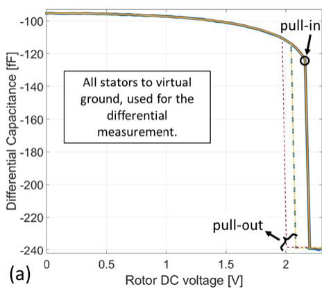

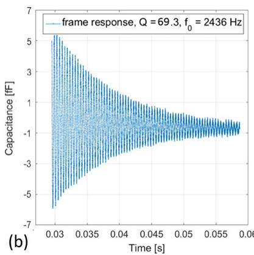

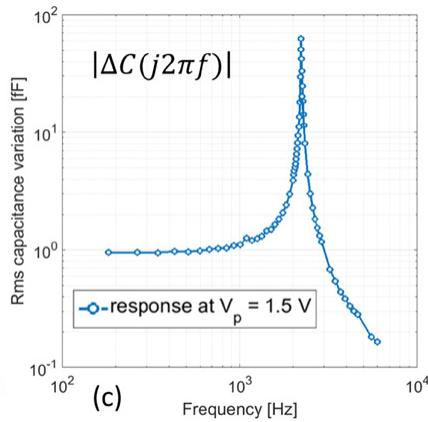  
Figure 8. Quasi static C-V curve to evaluate the pull-in voltage (a) and dynamic characterization of the proof mass to evaluate (b) the natural frequency under no applied bias (time response of the proof mass to a downward step from a perturbed position to its rest position) and the frequency in operation with a DC bias voltage of $1.5\mathrm{V}$ (c).

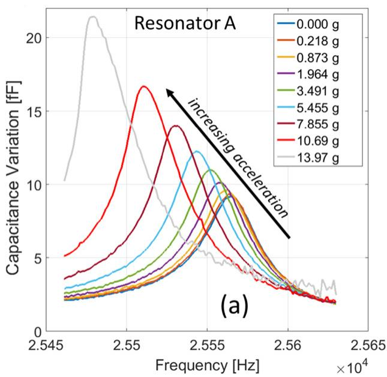

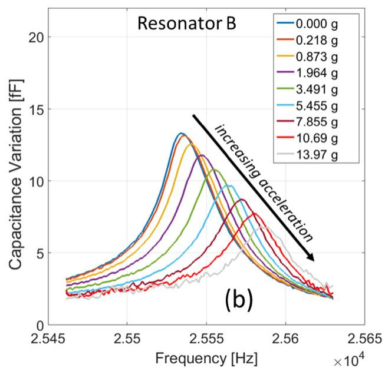  
Figure 9. Resonance spectra as a function of the applied acceleration for the torsional resonators labeled A (a) and B (b) in figure 1. Different curves refer to different acceleration values, increasing as indicated by the arrow.

i.e. 13.97 gravity units (g). Figures 9(a)-(b) show the different output spectra for the two torsional resonators labeled A and B as in figure 1 when the accelerometer is subject to accelerations in the given range.

In figure 10 the differential response of the two resonators under external acceleration is shown. One can note the efficacy of the differential readout, which turns into a linearity error lower than $1\%$ of the full-scale-range (FSR) up to $10\mathrm{g}$ of acceleration, which becomes of about $4\%$ at $14\mathrm{g}$ . The so measured differential sensitivity turns out to be around $9.2\mathrm{Hz~g}^{-1}$ , in reasonable agreement with the theoretical predictions (7) for a DC biasing voltage of $1.5\mathrm{V}$ , though the initial tilt of the suspended mass. An offset of $29\mathrm{Hz}$ can be seen for no applied accelerations in agreement with the measurements shown in figure 7.

The measured differential frequency variation under cross-axis accelerations along $x$ - and $y$ -directions is lower than $1\mathrm{Hz}$ for $5.46\mathrm{g}$ of applied acceleration; the corresponding cross-axis

rejection is thus larger than 34 dB (note that the accuracy in this kind of measurement is limited by the horizontal alignment precision of the board on the rate table).

# 4.5. Temperature behavior

As a consequence of the initial tilt of the suspended mass, coupled to the unavoidable applied bias voltage $V_{p}$ , the $0\mathrm{g}$ value of the resonators frequencies differs by about $29\mathrm{Hz}$ . As a matter of fact, this results in an offset of about $3\mathrm{g}$ . The offset can be compensated through suitable calibration circuits or in the digital domain, provided that it is stable over time and environmental conditions. As offset stability is a key issue for the performance of inertial sensors [28], this subsection analyzes the offset behavior of the presented device as a function of temperature.

The device is placed inside the climatic chamber shown in figure 5(c), and operated in the same working conditions as

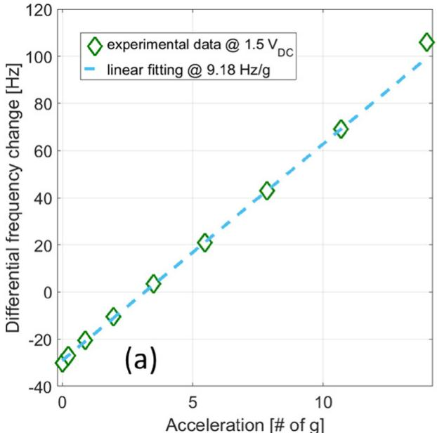

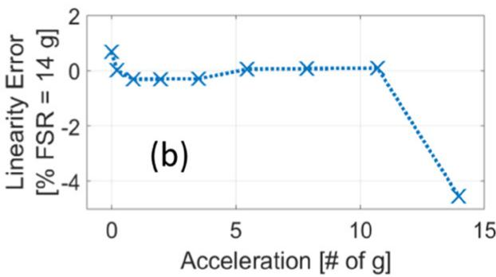

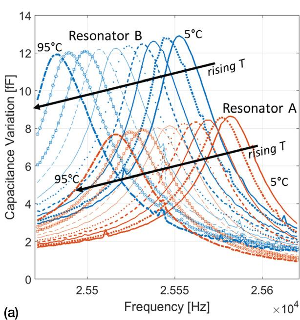  
Figure 10. Differential variation of the resonance frequencies of the two resonators (a) as a function of the acceleration, with best linear fitting within $10\mathrm{g}$ (b).

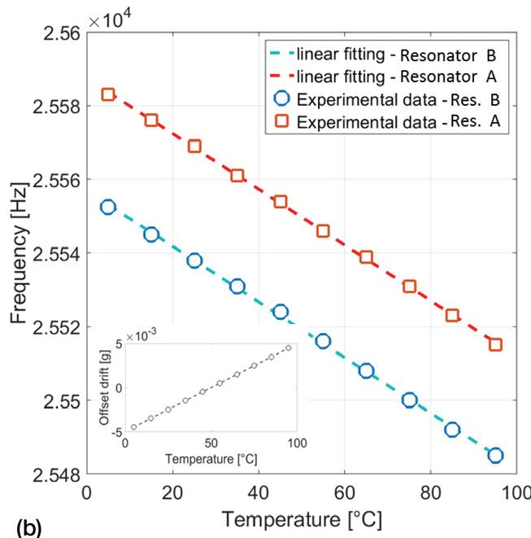  
Figure 11. Effects of temperature variations on the spectra of the two resonators in operating conditions (a). The derived TCF (b) is well matched and the resulting offset drift (shown in the inset) is linear and lower than $5\mathrm{mg}$ up to $90^{\circ}\mathrm{C}$ .

in the previous subsection. The temperature is initially set to $5^{\circ}\mathrm{C}$ , and then swept by increasing steps of $10^{\circ}\mathrm{C}$ up to $95^{\circ}\mathrm{C}$ . After the climatic chamber reaches the target temperature, an interval of $3\mathrm{min}$ is left before starting the measurements, in order to let the thermal transient of the polysilicon parts occur. Then a spectral response is captured consecutively for the two resonators, with the same methodology used in section 4.4.

Figure 11(a) reports the obtained results. As expected from the preliminary characterization of section 4.2, as the natural frequency of the two resonators is quite matched, similarly their temperature behavior is quite close and the difference

between the frequencies, i.e. the offset, is almost constant against temperature changes. This is shown by figure 11(b), which reports the values of the measured peak frequencies as a function of the temperature. The linear fitting of the measured data leads to a temperature coefficient of the frequency (TCf) in the order of $-29~\mathrm{ppm} / {}^{\circ}\mathrm{C}$ for both resonators. Such value is typical for polysilicon MEMS (see e.g. [29] and [30]) and the behavior is thus ascribed to the changes of the Young's modulus with temperature [31]. From the linear fittings, the matching of the two resonators TCf is within $0.13\%$ . Taking into account the measured sensitivity, over the measured

temperature range, this matching results in a offset drift lower than $5\mathrm{mg}$ . This small residual value can be even compensated as the offset drift is linear with the temperature, as highlighted in the inset.

# 5. Conclusion

A new out-of-plane resonant accelerometer has been studied, fabricated and experimentally characterized. The experimental results concerning the electromechanical response of the proof mass and of the resonating elements exhibit good agreement with the theory. The measured sensitivity of the considered devices operated at $1.5\mathrm{V}$ is of about $10\mathrm{Hz~g}^{-1}$ . The differential readout linearizes the response and enables the correct detection of the external acceleration even in the presence of eigenstresses due e.g. to temperature variations. The new MEMS resonant accelerometer exhibits a sensitive linear response within reduced dimensions, and it appears to be promising for consumer applications. The process compatibility with in-plane single-axis and two-axis resonant accelerometers enables the possibility to design three-axis accelerometers based on resonant sensing.

After this first phase of characterization of the device working principle, a phase of characterization of the device in operation within an oscillating circuit will be implemented to estimate the achievable resolution. Both ultra-low-power oscillators (see e.g. [32]) and ultra-low-power frequency-to-output converters (see e.g. the frequency to digital converter presented in [3]) will be considered as possible solutions to guarantee a resolution in the order of few hundred $\mu \mathrm{g} / \sqrt{\mathrm{Hz}}$ , as generally required by consumer applications.

# Acknowledgments

This work has been partially funded by Eniac project Lab4MEMS 2, grant no. 621176-2.

# References

[1] Kline M H, Yeh Y-C, Eminoglu B, Najar H, Daneman M, Horsley D A and Boser B E 2013 Quadrature FM gyroscope MEMS 2013 (Taipei, Taiwan) pp 604-8   
[2] Li M, Nitzan S and Horsley D A 2015 Frequency-modulated lorentz force magnetometer with enhanced sensitivity via mechanical amplification IEEE Electron Device Lett. 36 62-4   
[3] Izyumin I, Kline M H, Yeh Y-C, Eminoglu B and Boser B E 2014 $50~\mu \mathrm{W}$ , 2.1 mdeg/s/pHz frequency to-digital converter for frequency-output MEMS gyroscopes 40th European Solid State Circuits Conf. (22-26 September 2014)   
[4] Zou X, Thiruvenkatanathan P and Seshia A A 2014 A seismic-grade resonant MEMS accelerometer J. Microelectromech. Syst. 23 768-70   
[5] Briffa A, Gatt E, Micallef J, Grech I, Casha O and Darmanin J M 2012 Area minimization of a three-axis separate mass capacitive accelerometer using the ThELMA process EuroCon 2013 (Zagreb, Croatia, 1-4 July 2013) pp 2094-9   
[6] Comi C, Corigliano A, Langfelder G, Longoni A, Tocchio A and Simoni B 2010 A resonant micro-accelerometer with

high sensitivity operating in an oscillating circuit J.Microelectromech.Syst.19 1140-115   
[7] Caspani A, Comi C, Corigliano A, Langfelder G and Tocchio A 2013 Compact biaxial micromachined resonant accelerometer J. Micromech. Microeng. 23 105012   
[8] Pinto D, Mercier D, Kharrat C, Colinet E, Nguyen V, Reig B and Hentz S 2009 A small and high sensitivity resonant accelerometer Proc. Chem. 1 536-9   
[9] Su S X P, Yang H S and Agogino A M 2005 A resonant accelerometer with two-stage microleverage mechanisms fabricated by SOI-MEMS technology Sensors 5 1214-23   
[10] Seshia A A, Palaniapan M, Roessig T A, Howe R T, Gooch R W, Shimert T R, Montague S 2002 A vacuum packaged surface micromachined resonant accelerometer J. Microelectromech. Syst. 11 784-93   
[11] Aikele M, Bauer K, Ficker W, Neubauer F, Prechtel U, Schalk J and Seidel H 2001 Resonant accelerometer with self-test Sens. Actuators Phys. A 92 161-7   
[12] Wang J, Shang Y, Chen J, Sun Z and Chen D 2012 Micromachined resonant out-of-plane accelerometer with a differential structure fabricated by silicon-on-insulator MEMS technology Micro Nano Lett. 7 1230-3   
[13] Park U, Rhim J, Up J J and Kim J 2014 A micromachined differential resonant accelerometer based on robust structural design Microelectron. Eng. 129 5-11   
[14] Zhu R, Zhang G and Chen G 2010 A novel resonant accelerometer based on nanoelectromechanical oscillator Proc. IEEE Int. Conf. on Micro Electro Mechanical Systems pp 440-3   
[15] Tabata O and Yamamoto T 1999 Two-axis detection resonant accelerometer based on rigidity change Sensors Actuators 75 53-9   
[16] Kim H C, Seok S, Kim I, Choi S-D and Chun K 2005 Inertial-grade out-of-plane and in-plane differential resonant silicon accelerometers (DRXLs) Proc. Transducers '05 (Seoul, Korea, 5-9 June 2005) pp 172-5   
[17] Lee B, Oh C, Lee S, Oh Y and Chun K 2000 A vacuum packaged differential resonant accelerometer using gap sensitive electrostatic stiffness changing effect Proc. MEMS 2000 Miyazaki (Japan, 23-27 January 2000) pp 352-7   
[18] Trusov A A, Zotov S A, Simon B R and Shkel A M 2013 Silicon accelerometer with differential frequency modulation and continuous self-calibration MEMS 2013 (Taipei, Taiwan) pp 29-32   
[19] Sung S, Lee J G and Kang T 2003 Development and test of MEMS accelerometer with self-sustained oscillation loop Sensors Actuators 109 1-8   
[20] Comi C, Corigliano A, Ghisi A and Zerbini S 2013 A resonant micro accelerometer based on electrostatic stiffness variation Meccanica 48 1893-900   
[21] Caspani A, Comi C, Corigliano A, Langfelder G, Zega V and Zerbini S 2014 A differential resonant micro accelerometer for out-of-plane measurements Proc. Eurosensor (Brescia, Italy, September 2014)   
[22] Caspani A, Comi C, Corigliano A, Langfelder G, Zega V and Zerbini S 2014 Dynamic nonlinear behavior of torsional resonators in MEMS J. Micromech. Microeng. 24 095025   
[23] Corigliano A, Masi B D, Frangi A, Comi C, Villa A and Marchi M 2004 Mechanical characterization of polysilicon through on chip tensile tests J. Microelectromech. Syst. 13 200-19   
[24] Comi C, Corigliano A, Zega V and Zerbini S 2015 Optimal design and nonlinearities in a $z$ -axis resonant accelerometer. Eurosome 2015, Budapest, Hungary (19-22 April 2015)   
[25] Minikes A, Bucher I and Avivi G 2005 Damping of a microresonator torsion mirror in rarefied gas ambient J. Micromech. Microeng. 15 1762-9

[26] Bao M, Yang H, Yin H and Sun Y 2002 Energy transfer model for squeeze-film air damping in low vacuum J. Micromech. Microeng. 12 341-6   
[27] Frangi A, Ghisi A and Coronato L 2009 On deterministic approach for the evaluation of gas damping in inertial MEMS in the free-molecule regime Sensors Actuators A: Phys. 149 21-8   
[28] Park M and Gao Y 2008 Error and Performance Analysis of MEMS-based Inertial Sensors with a Low-cost GPS receiver Sensors 8 2240-61   
[29] Kline M H 2013 Frequency modulated gyroscopes PhD Thesis University of California, Berkeley

[30] Hsu W-T and Nguyen T-C 2002 Stiffness-compensated temperature-insensitive micromechanical resonators MEMS 2002 (Las Vegas, USA) pp 731-4   
[31] Melamud R, Hopcroft M, Jha C, Kim B, Chandorkar S, Candler R and Kenny T K 2005 Effects of stress on the temperature coefficient of frequency in double clamped resonators Int. Conf. of Solid-State Sensors, Actuators and Microsystems (Seoul, Korea, 5-9 June 2005) pp 392-5   
[32] Mekky R H, Cicek P-V and El-Gamal M N 2013 Ultra low-power low-noise transimpedance amplifier for MEMS-based reference oscillators IEEE 20th Int. Conf. Electronics, Circuits, and Systems pp 345-8