PAPER

# A high-sensitivity biaxial resonant accelerometer with two-stage microleverage mechanisms

To cite this article: Hong Ding et al 2016 J. Micromech. Microeng. 26 015011

View the article online for updates and enhancements.

# You may also like

- A new improved vertical comb type differential capacitive sensing micro accelerometer using silicon-on-insulator wafer technology

Manoj Kumar Dounkal, R K Bhan and Navin Kumar

SPICE compatible behavioural modelling of resistive sensors

Prajit Nandi, Debashis Sahu, Anindya Sundar Dhar et al.

- A piezoresistive micro-accelerometer with high frequency response and low transverse effect

Peng Wang, Yulong Zhao, Bian Tian et al.

# A high-sensitivity biaxial resonant accelerometer with two-stage microleverage mechanisms

Hong Ding, Jiaxuan Zhao, Bing-Feng Ju and Jin Xie

The State Key Laboratory of Fluid Power Transmission and Control, Zhejiang University, Hangzhou 310027, People's Republic of China

E-mail: xiejin@zju.edu.cn

Received 11 September 2015, revised 4 November 2015  
Accepted for publication 17 November 2015  
Published 11 December 2015

# Abstract

This paper presents a design and experimental evaluation of a micro-electro-mechanical system biaxial resonant accelerometer with two-stage microleverage mechanisms. The device incorporates two pairs of double-ended tuning fork resonators coupled to a single proof mass. The two-stage microleverage mechanisms possess a higher amplification factor than single-stage microleverage mechanisms, so that the proposed accelerometer has a high level of sensitivity. In addition, a low level of cross-axis sensitivity is realized because of the decoupling beams. The accelerometer is theoretically analyzed and then simulated in the system level by the finite element method. The device is fabricated in a silicon-on-insulator wafer. The experimental results demonstrate that the average differential sensitivity of the resonant accelerometer is $275\mathrm{Hzg}^{-1}$ at a resonant frequency of $290\mathrm{kHz}$ under a polarization voltage of $5\mathrm{V}$ . The measured cross-axis sensitivity is lower than $3.4\%$ .

Keywords: resonant accelerometer, MEMS, microleverage, frequency shift

(Some figures may appear in colour only in the online journal)

# 1. Introduction

Resonant sensors have been a hot area of research for several years. As the core element of a resonant sensor, the resonator changes its output frequency as a function of a physical parameter. Because the sensor output is 'digital' in the sense that the resonant sensor is basically independent on analog levels and can be coupled to digital circuitry, it can minimize the inaccuracies arising in analog signal generation and transformation to digital form. Therefore, the resonant sensors possess higher accuracy and anti-interference in comparison with traditional analog transducers [1]. Moreover, the resonant sensors are able to avoid the pull-in instability issues of proof mass [2]. Perhaps these issues still exist in resonators to a certain degree, but the resonant sensors can work in a safe range avoiding pull-in by proper design [3]. In addition, the resonant sensors based on frequency shift caused by the stress change have the potential for higher sensitivity than other types of sensors [1, 4]. Based on the principle of

resonant sensing, many kinds of sensors such as the electrostatic charge sensor [5], the magnetometer [6], and the gyroscope [7] have been developed.

The microresonant accelerometer is a resonant inertial device with many potential applications due to its frequency output, high sensitivity, and large dynamic range [8-10]. A resonant accelerometer consists of a proof mass, one or more resonators, and microleverages. The resonant frequency of the resonator has a shift due to the axial stress generated by the proof mass under external acceleration [11-13]. Therefore, the value of acceleration can be computed from the shift of resonant frequency by a readout circuit [12, 14]. Previous studies have found that the resonant accelerometers integrating with leverage mechanisms possess higher sensitivity. The microleverage can be used to amplify the inertial force generated by the proof mass and improve sensitivity by one order of magnitude [5, 11-13]. Decoupling beams are essential structures in a biaxial resonant accelerometer with a single proof mass. Signals along the $X$ and $Y$ axes are

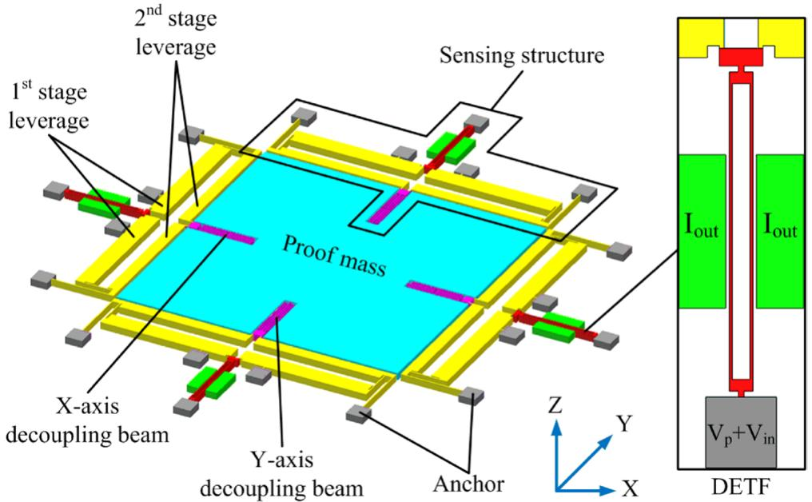  
Figure 1. Scheme of the biaxial resonant accelerometer with two-stage microleverage mechanisms.

decoupled due to the great difference of stiffness between the decoupling beams along these two orthogonal axes [3, 15, 16].

Uniaxial resonant accelerometers have been widely studied [11-14, 17]. Orthogonally placing two identical uniaxial accelerometers is a way to achieve biaxial sensing, but this method decreases the integration and increases the size of the device [18]. The earlier biaxial resonant accelerometer did not integrate with microleverage mechanisms so that the sensitivity was a little low [19]. Recently, biaxial resonant accelerometers integrating with single-stage microleverages have been demonstrated to possess higher sensitivity [3, 15, 16], but there still is room for improvement in the amplification factor of the microleverage mechanism. According to the previous studies, a two-stage microleverage mechanism is an ideal option in consideration of a trade-off between the force amplification factor, structure compliance, and device size [20-22]. Therefore, a biaxial resonant accelerometer with two-stage microleverage mechanisms is expected to have better performance, but so far no such kind of resonant accelerometer has been reported.

In this paper, a novel biaxial resonant accelerometer with two-stage microleverage mechanisms is presented. The proposed resonant accelerometer incorporates four double-ended tuning fork (DETF) resonant sensing elements, four pairs of two-stage microleverage mechanisms, and four decoupling beams. The device is fabricated in a silicon-on-insulator (SOI) wafer by micro-electro-mechanical system (MEMS) technology and has an overall area of $1900\mu \mathrm{m}\times 1900\mu \mathrm{m}$ . The biaxial resonant accelerometer shows an average sensitivity of $275\mathrm{Hzg}^{-1}$ at a resonant frequency of $290\mathrm{kHz}$ under a polarization voltage of $5\mathrm{V}$ . In the previously reported biaxial resonant accelerometers integrating with single-stage microleverage mechanisms, the sensitivity is about $201\mathrm{Hzg}^{-1}$ in [15] and $52\mathrm{Hzg}^{-1}$ in [16]. The present biaxial resonant accelerometer possesses higher sensitivity due to the use of two-stage microleverage mechanisms. The measured

cross-axis sensitivity is lower than $3.4\%$ , which is limited by the positioning accuracy of the experimental setup.

This paper is organized as follows. Section 2 introduces the device design, the mechanical characterization of the device, and the finite element method (FEM) simulations of the whole structure. The fabrication process is demonstrated in section 3. In section 4, electromechanical characterization and acceleration measurements are carried out to evaluate the performance of the fabricated biaxial resonant accelerometer.

# 2. Design, analysis, and simulation

# 2.1. Design of the device

The design of the biaxial resonant accelerometer with two-stage microleverage mechanisms is shown in figure 1. This accelerometer consists of a proof mass and four identical sensing structures. Each sensing structure is composed of a decoupling beam, a pair of two-stage microleverages, and a DETF resonator. The DETF resonator has two important low vibration modes: In-phase mode and out-of-phase mode. The out-of-phase mode has higher stability and quality factor $(Q)$ than the in-phase mode because the mutual cancellation of the opposing stress waves in the coupling-end of tines leads to lower anchor loss. Capacitive sensing and excitation are used for the frequency response measurement of the resonator. When the $x$ -axis acceleration is input, the proof mass will move along the $x$ -axis under the action of inertial force. Because of the rigid stiffness of the decoupling beam along the $x$ -axis, the $x$ -axis leverages will move together with the proof mass and amplify the inertial force, while the $y$ -axis leverages remain stationary because the stiffness of the $y$ -axis decoupling beam along the $x$ -axis is soft. Therefore, the decoupling effect is realized due to the great difference of stiffness between the decoupling beams along the $X$ and $Y$ axes. The amplified inertial force is applied to the resonators,

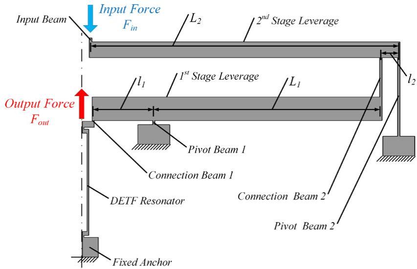  
Figure 2. Schematic view of the two-stage microleverage mechanism.

and the tensile or compressive stress will cause a shift of the resonant frequency of the resonators, and thus the acceleration can be detected by measuring the frequency shift.

# 2.2. Amplification factor of the microleverage mechanism

Two-stage microleverage mechanisms are used to amplify the inertial force communicated onto the DETF resonators to enhance the sensitivity. As shown in figure 2, the mechanism consists of an input beam, a DETF resonator, stacked two microleverage stages and their respective pivot beam, a connection beam, and fixed anchors. The microleverage stage connected to the output system (DETF resonator) is called the first stage, and the other one connected to the proof mass is the second stage, so the upstream stage is the output system of the downstream stage. The input beam couples the inertial force of proof mass onto the second stage microleverage. According to the previous theory [22], the first stage and the second stage microleverages are designed to be a first-kind and a second-kind leverage, respectively.

The amplification factor $A$ of the microleverage mechanism is defined as the ratio of the output force $F_{\mathrm{out}}$ (the axial loading on the resonator) to the input force $F_{\mathrm{in}}$ . Using the expression for the amplification factor of a two-stage microleverage mechanism [22], the total amplification factor can be written as the multiplication of the two amplification factors of each stage

$$
A = \frac {F _ {\text {o u t}}}{F _ {\text {i n}}} = A _ {1} A _ {2} \tag {1}
$$

$$
A _ {1} = \frac {\frac {1}{k _ {\mathrm {v p} , 1}} \left(k _ {\theta \mathrm {o} , 1} + k _ {\theta \mathrm {p} , 1}\right) - l _ {1} L _ {1}}{\left(\frac {1}{k _ {\mathrm {v o} , 1}} + \frac {1}{k _ {\mathrm {v p} , 1}}\right) \left(k _ {\theta \mathrm {o} , 1} + k _ {\theta \mathrm {p} , 1}\right) + l _ {1} ^ {2}} \tag {2}
$$

$$
A _ {2} = \frac {\frac {1}{k _ {\mathrm {v p} , 2}} \left(k _ {\theta \mathrm {o} , 2} + k _ {\theta \mathrm {p} , 2}\right) + l _ {2} L _ {2}}{\left(\frac {1}{k _ {\mathrm {v o} , 2}} + \frac {1}{k _ {\mathrm {v p} , 2}}\right) \left(k _ {\theta \mathrm {o} , 2} + k _ {\theta \mathrm {p} , 2}\right) + l _ {2} ^ {2}} \tag {3}
$$

where $A_{1}$ and $A_{2}$ are the amplification factors of the first and the second stage microleverages, respectively; $k_{\mathrm{vp},i}$ and $k_{\theta \mathrm{p},i}$ $(i = 1,2)$ are the axial and rotational spring constants of the pivot beam for the ith stage microleverage, respectively; $k_{\mathrm{vo},i}$ and $k_{\theta \mathrm{o},i}$ are the output axial and output rotational spring constants of the ith stage microleverage, respectively; $l_{i}$ is the length between the pivot beam and output system for the ith stage microleverage (resisting arm length); and $L_{i}$ is the length between the pivot beam and input system of the ith stage microleverage (power arm length).

For a resonant accelerometer with single-stage microleverage to achieve a high amplification factor, the lever ratio $(L / l)$ needs to be large, and thus the leverage has to be very long, which increases the size of the device. The amplification factor of the single-stage microleverage can also be enlarged by narrowing down some certain beams such as the pivot beam, connection beam, and resonator, but such designs affect the structural strength and stability negatively. As a solution, multistage microleverage mechanisms can be used to realize the high amplification factor for a given size of device. However, this does not mean that the higher the stage number of the microleverage, the higher the sensitivity, because for the given device size, increasing the stage number of the microleverage normally causes a smaller proof mass and thus lower sensitivity. Obviously, there is a trade-off between the stage number of the microleverage and device area. Furthermore, regarding the multistage microleverage mechanism as a spring, the increase in the stage number of the microleverage will reduce the spring constant. This is because when the $i$ th-stage microleverage is added at the input of the $(i - 1)$ th-stage microleverage, the output axial spring constant of the $i$ th-stage microleverage $(k_{\mathrm{vo},i})$ decreases, and thus the amplification factor and sensitivity decrease according to the equations (2) and (3). Therefore, there is another trade-off between the number of the microleverage stage and the amplification factor. Theoretical analysis shows that the two-stage microleverage mechanism is an ideal option for the overall optimization of the force amplification factor, structure

compliance, and device area in the design of the resonant accelerometer.

# 2.3. Sensitivity analysis of the resonant accelerometer

The sensitivity of the accelerometer can be calculated from the frequency shift of the DETF resonator due to the axial loading. The variation of resonant frequency can be evaluated by an energy analysis as

$$
f = f _ {0} \sqrt {1 \pm \frac {0 . 3 l ^ {2}}{E t w ^ {3}} F _ {\text {o u t}}} \tag {4}
$$

and

$$
f _ {0} = \frac {3 . 5 7}{l ^ {2}} \sqrt {\frac {E I}{\rho t w}} \tag {5}
$$

where $l$ , $w$ and $t$ are the length, width, and structural thickness of the vibrating tire of the DETF, $E$ is the modulus of elasticity of the material, $\rho$ is the density of the material, $I = tw^3 /12$ is the moment of inertia of the DETF, and $f_0$ is the resonant frequency of the DETF without axial loading [4].

As shown in figure 1, the proof mass is supported by the decoupling beams with non-zero flexural stiffness on the sensing axis. As a result, the decoupling beams partially offset the inertial force transmitted to the microleverages so that the axial loading on the resonator becomes lower. According to the previous research [17], the effective amplification factor $EA$ of microleverage is put forward and is given by the equation below

$$
E A = \frac {F _ {\text {o u t}}}{M _ {\text {p r o o f}} g} = \frac {A F _ {\text {i n}}}{M _ {\text {p r o o f}} g} \tag {6}
$$

where $M_{\mathrm{proof}}$ is the proof mass, and $g$ is the gravitational acceleration $(9.8\mathrm{ms}^{-2})$ . The input force $F_{\mathrm{in}}$ can be expressed by

$$
F _ {\mathrm {i n}} = k _ {\mathrm {v I}, 2} \delta_ {\mathrm {I}, 2} \tag {7}
$$

where $k_{\mathrm{vI,2}}$ is the input axial spring constant at the second stage microleverage and $\delta_{\mathrm{I,2}}$ is the axial displacement at the input of the second stage microleverage. Based on the mechanical relationship, we have

$$
M _ {\text {p r o o f}} g = \left(k _ {\mathrm {d}} + k _ {\mathrm {v I}, 2}\right) \delta_ {\mathrm {I}, 2} \tag {8}
$$

where $k_{\mathrm{d}}$ is the stiffness of decoupling beam. Substituting equations (7) and (8) into equation (6) gives

$$
E A = \frac {A k _ {\mathrm {v I} , 2}}{k _ {\mathrm {d}} + k _ {\mathrm {v I} , 2}}. \tag {9}
$$

The input axial spring constant at the second stage microleverage can be expressed by

$$
k _ {\mathrm {v I}, 2} \approx \frac {k _ {\mathrm {v o} , 1}}{A ^ {2}} = \frac {k _ {r}}{A ^ {2}} \tag {10}
$$

where $k_{r}$ is the axial spring constant of the resonator tine. After substitution of equation (10) into (9), the effective amplification factor can be written as

$$
E A = \frac {k _ {r} A}{k _ {\mathrm {d}} A ^ {2} + k _ {r}} \tag {11}
$$

Table 1. The structure parameters.   

<table><tr><td>Parameter</td><td>Symbol</td><td>Value</td></tr><tr><td>Structure thickness</td><td>t</td><td>25 μm</td></tr><tr><td>Resonant sine length</td><td>L</td><td>250 μm</td></tr><tr><td>Resonant sine width</td><td>w</td><td>2.5 μm</td></tr><tr><td>Connection beam 1 length</td><td>lcl</td><td>2 μm</td></tr><tr><td>Connection beam 1 width</td><td>wc1</td><td>3 μm</td></tr><tr><td>Pivot beam 1 length</td><td>lp1</td><td>10.5 μm</td></tr><tr><td>Pivot beam 1 width</td><td>wp1</td><td>3 μm</td></tr><tr><td>Power arm 1 length</td><td>L1</td><td>359 μm</td></tr><tr><td>Resisting arm 1 length</td><td>l1</td><td>95 μm</td></tr><tr><td>Connection beam 2 length</td><td>lc2</td><td>100 μm</td></tr><tr><td>Connection beam 2 width</td><td>wc2</td><td>3.5 μm</td></tr><tr><td>Pivot beam 2 length</td><td>lp2</td><td>200 μm</td></tr><tr><td>Pivot beam 2 width</td><td>wp2</td><td>3.5 μm</td></tr><tr><td>Power arm 2 length</td><td>L2</td><td>482.5 μm</td></tr><tr><td>Resisting arm 2 length</td><td>l2</td><td>28 μm</td></tr><tr><td>Proof mass</td><td>Mproof</td><td>5.825 × 10-8kg</td></tr></table>

The effective amplification factor equals the amplification factor in an idealized scenario, where the inertial force is fully transmitted to the microleverage $(k_{\mathrm{d}} = 0)$ . Therefore, the axial loading on the resonator is expressed by

$$
F _ {\text {o u t}} = E A \times M _ {\text {p r o o f}} g. \tag {12}
$$

# 2.4. Finite element simulations

In this work, the FEM simulation was carried out in ANSYS software to simulate the resonant frequency shift induced by external acceleration. The interaction between the acceleration and resonant frequency of the mechanical structure was realized through pre-stress modal analysis. In the simulation, an acceleration field was constructed to generate the inertial force. Static analysis with the pre-stress option was performed to calculate the amount of axial stress induced along the resonators. Modal analysis was performed afterwards to calculate the shift of the resonant frequency. In summary, a system-level simulation of the resonant accelerometer was conducted to optimize the design to achieve the maximum shift of the resonant frequency. Meanwhile, the structural strength and stability and the minimum line width of the fabrication capability were also taken into consideration. The optimized structure parameters are summarized in table 1.

As shown in figure 3, the enormous difference in stiffness between decoupling beams along $X$ and $Y$ axes leads to their different deformation, and thus the decoupling effect is realized. The simulation results show that for the two pairs of decoupled resonators, the resonant frequency in out-of-phase mode are 325.111, 325.196, and 325.196, 325.280kHz, respectively. Based on these simulation results, the resonant accelerometer possesses a differential sensitivity of $169\mathrm{Hzg}^{-1}$ around resonant frequency of $325.196\mathrm{kHz}$ . With equations from (1)-(12) and the structure parameters listed in table 1, a differential sensitivity of $160\mathrm{Hzg}^{-1}$ around resonant frequency of $330.3\mathrm{kHz}$ can be calculated. As we can see,

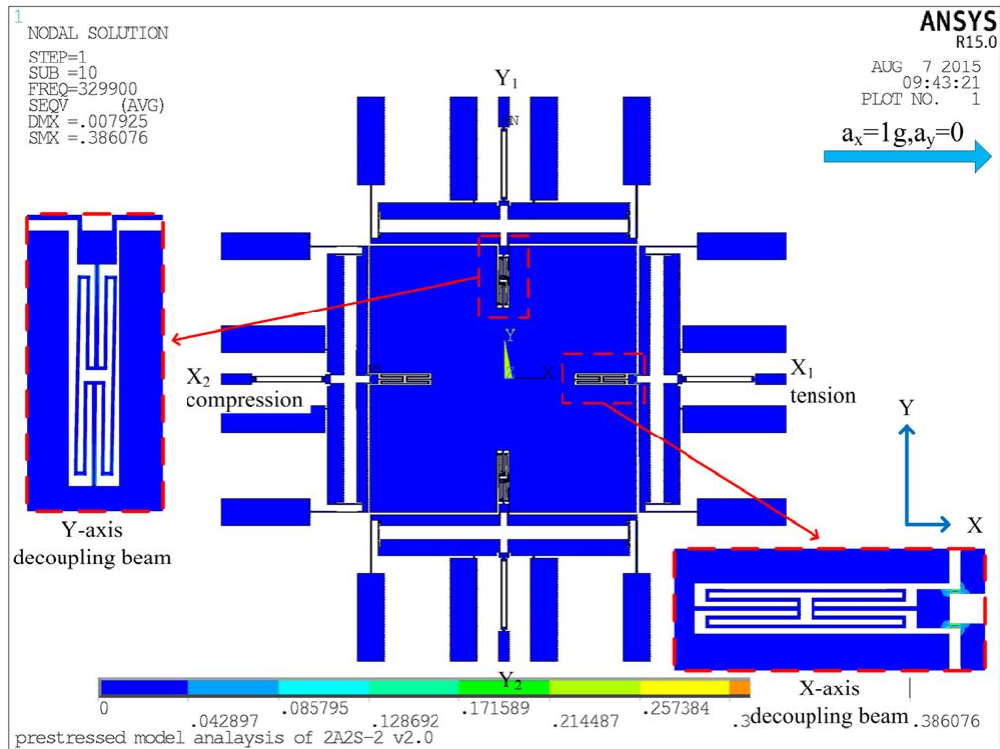

  
Figure 3. FEM simulation of stress and deflection of the $X\& Y$ decoupling beams with $1\mathrm{g}$ acceleration applied along the $X$ axis.   
(a)

  
(b)

  
(c)

  
(d)

  
(e)

  
(f)

  
Figure 4. SOIMUMPS process flow: (a) Starting wafer, (b) $p$ -type doping of top silicon layer, (c) pad metal lift-off, (d) front side DRIE, (e) trench formation and removal of buried oxide, (f) releasing of the protection layer and oxide layer.

the results from the theoretical analysis are very close to the ones from the FEM simulation.

# 3. Fabrication

The commercial SOIMUMPs process [23] was chosen to fabricate the device. The SOIMUMPs process starts with an SOI wafer consisting of a $25\mu \mathrm{m}$ device layer, a $1\mu \mathrm{m}$ buried oxide

layer, a thick substrate layer and a bottom side oxide layer (figure 4(a)). The top surface of the silicon layer is doped by depositing a phosphosilicate glass (PSG) and annealing in argon to enhance the conductivity of silicon layer. Then the PSG is removed by wet chemical etching (figure 4(b)). A metal stack of $20\mathrm{nm}$ of chrome and $500\mathrm{nm}$ of gold is patterned as pad metals through a lift-off process (figure 4(c)). The pad metal is applied to bond with the golden wire for testing. The

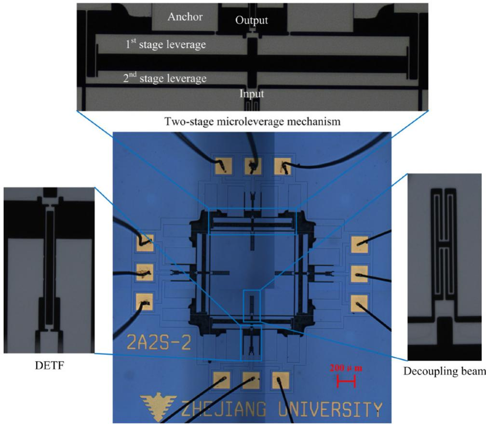

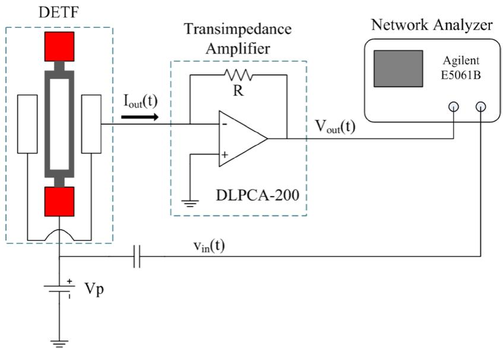  
Figure 5. Optical micrograph of the biaxial resonant accelerometer fabricated by the SOIMUMPs process.   
Figure 6. Schematic illustration of the platform used to evaluate the resonator spectral response.

device layer is lithographically patterned and etched via deep reactive ion etching (DRIE) to define the mechanical structures (figure 4(d)). Next, the top surface of the silicon layer is covered with a protection material. The substrate layer is lithographically patterned from the bottom side, and trenches are etched via reactive ion etching (RIE) (figure 4(e)). A wet oxide etch process is then applied to remove the oxide layer in the regions defined by the trench to release the movable structures in the top silicon layer, and the remaining bare oxide

layer is removed from the top surface using a vapor hydrogen fluoride (HF) process (figure 4(f)). The fabricated biaxial resonant accelerometer has a size of $1900\mu \mathrm{m}\times 1900\mu \mathrm{m}$ , as shown in figure 5.

# 4. Experiments

After fabrication, the device is connected to a testing PC board by wire bonding. The device is tested in a custom vacuum

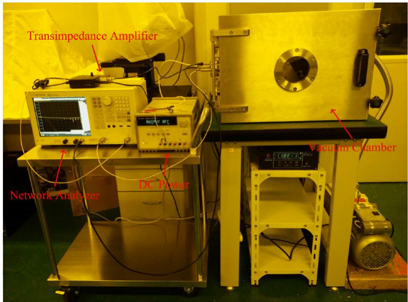  
Figure 7. Measurement setup for evaluation of the resonator spectral response.

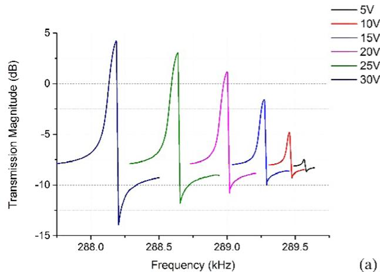

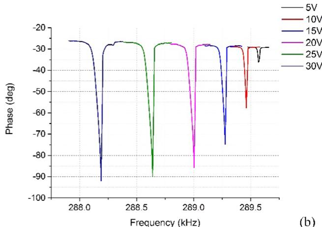  
Figure 8. (a) Magnitude responses and (b) phase responses of the DETF resonator $\mathrm{X}_{1}$ under different polarization voltages $V_{\mathrm{p}}$

chamber with a pressure level of $7.5\mathrm{mTorr}$ at room temperature. A schematic illustration of the measurement setup is shown in figure 6. The open-loop frequency response of the resonator is recorded by a network analyzer (Agilent E5061B). The motional current $I_{\mathrm{out}}(t)$ , which is proportional to the vibration amplitude of the resonator, is converted to voltage $V_{\mathrm{out}}(t)$ through a low noise transimpedance amplifier (FEMTO, DLPCA-200) with a gain of $10^{6}\mathrm{VA}^{-1}$ . A dc polarization voltage $V_{\mathrm{p}}$ is applied to the anchor of the resonator, and the dc power is decoupled from the ac actuation voltage $\nu_{\mathrm{in}}(t)$ by an isolation capacitor. The whole measurement setup for evaluation of resonator spectral response is shown in figure 7.

# 4.1. Electromechanical characterization

The spectral responses are measured under different polarization voltages $V_{\mathrm{p}}$ when the actuation voltage $\nu_{\mathrm{in}}$ is fixed at $1.27\mathrm{mV}$ , as shown in figure 8(a). The magnitude of the resonator $X_{1}$ peak increases with the increase in polarization voltage since the transduction factor is enhanced. In the meantime, a

reduction in the resonant frequency is a function of the polarization voltage across the electrodes due to electrostatic spring softening. Because of the amplitude-stiffening, as the amplitude of vibration increases, the resonator tines are forced to extend. This extension causes the additional axial force to enhance the structure stiffness. Therefore, the mechanical nonlinearity becomes more obvious in cases of high polarization voltage. The negative peak following the positive peak of resonance is known as the anti-resonance peak, and is caused by feedthrough capacitance placed in parallel to the equivalent RLC circuit representing the DETF resonator. The changes in the polarization voltage also cause variations in the phase response of the resonator $X_{1}$ , as shown in figure 8(b). The anti-resonance could be observed and the phase shift is not $-180^{\circ}$ at resonance due to the feedthrough capacitance.

From the measurement results shown in figure 8, a significant reduction in the resonant frequency for increasing $V_{\mathrm{p}}$ can be observed. Figure 9 plots the frequency shift as a function of the polarization voltage for each DETF resonator in the resonant accelerometer. Due to the fabrication tolerances, these

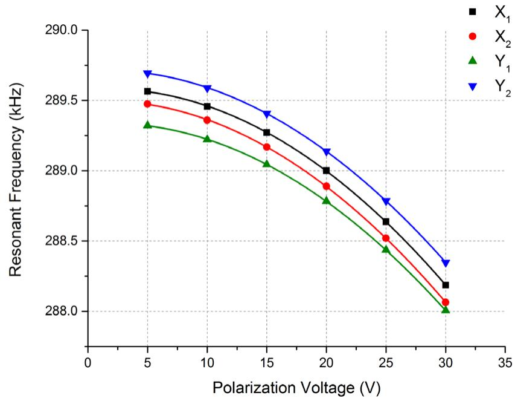  
Figure 9. Resonant frequencies of DETF resonators $X_{1}, X_{2}, Y_{1}$ , and $Y_{2}$ as a function of the polarization voltage $V_{\mathrm{p}}$ .

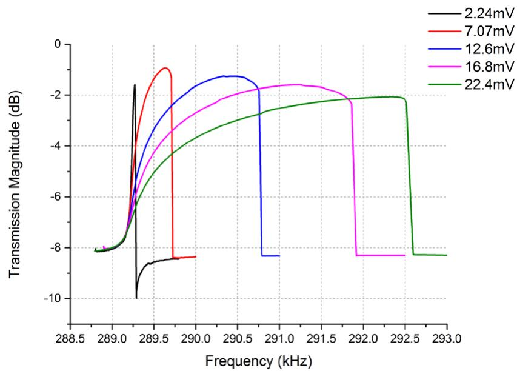  
Figure 10. Spectral responses of the DETF resonator $X_{1}$ at $V_{\mathrm{p}} = 15\mathrm{V}$ under different actuation voltage $\nu_{\mathrm{in}}$

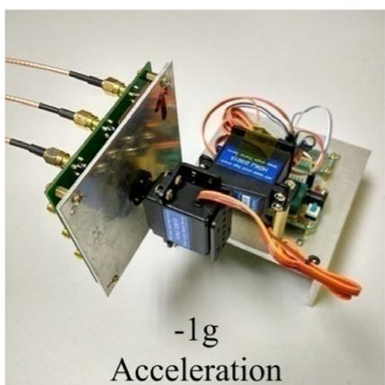

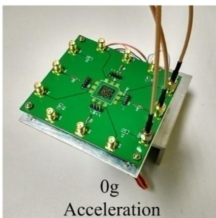

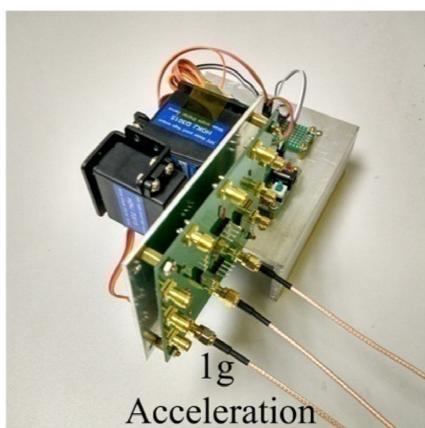  
Figure 11. The rotation table allowing the accelerometer to be subjected to the action of the force of gravity.

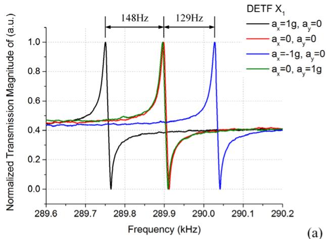

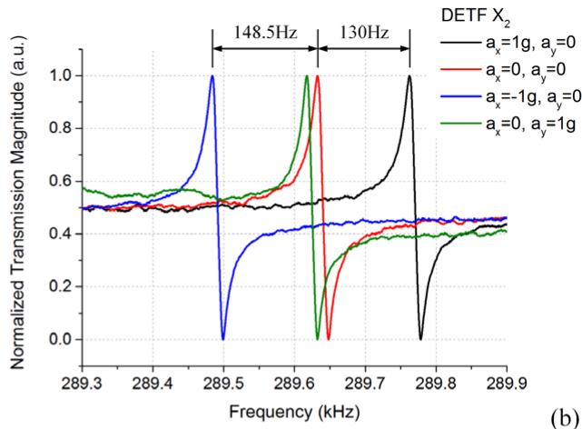

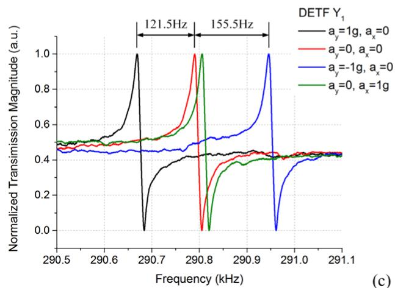

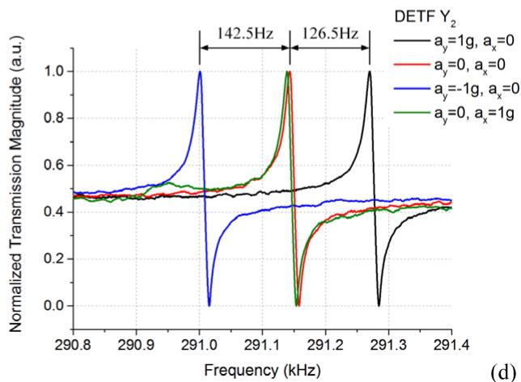  
Figure 12. Normalized spectrum response of each single DETF resonator evaluated for applied accelerations of $\pm 1\mathrm{g}$ along the two axes.

DETF resonators are not exactly identical, so their resonant frequencies are slightly different. However, this error may be treated as a bias in the sensitivity and consequently calibrated out by appropriate data processing techniques. The effect of $V_{\mathrm{p}}$ on the resonant frequency is explained by the presence of the equivalent electrical stiffness $k_{\mathrm{e}}$ , which is directly proportional to the square of $V_{\mathrm{p}}$ .

The effect of the actuation voltage $\nu_{\mathrm{in}}$ on the spectral response is shown in figure 10 when $V_{\mathrm{p}}$ is fixed at $15\mathrm{V}$ . As $\nu_{\mathrm{in}}$ increases, the measured current and thus the dynamic displacement of the beam increase. Therefore, the impact of the nonlinear restoring force on the resonant frequency becomes more serious, and leads the resonator out of the working conditions where the linear approximation of the elastic stiffness can be used for modeling.

# 4.2. Acceleration measurements

The setup for the acceleration measurement is the same as the one for the electromechanical characterization, with the exception that the device is mounted on a custom remote-control rotation table to test the accelerometer under gravity force, as shown in figure 11. The remote controllable rotation table consists of a rotary plate, a servo-motor, and a control circuit. The rotary plate is driven by the servo-motor and controlled by the microcontrol unit (MCU) in the control circuit.

Table 2. Comparison of the results from the theoretical analysis, simulation, and experiment.   

<table><tr><td></td><td>Theoretical results</td><td>Simulation results</td><td>Experimental results</td></tr><tr><td>Resonator frequency (kHz)</td><td>330.3</td><td>325.196</td><td>290</td></tr><tr><td>Sensitivity (Hz g-1)</td><td>160</td><td>169</td><td>275</td></tr></table>

In addition, there is an infrared controller emitting an infrared signal that is received by the MCU to activate the servo-motor with an angle accuracy of $1^{\circ}$ . During testing, the accelerometer and the rotation table are together put in the vacuum chamber to enable stable operation of the DETF resonators with high quality factor, without the necessity of frequently pumping and venting the chamber for multiple testing of the same device.

The resonant frequency measurement as above is repeated for 0 and $\pm 1\mathrm{g}$ acceleration on one axis, and $1\mathrm{g}$ acceleration on the other orthogonal axis by simply controlling the position of the rotation table. The frequency measurement results for all the resonators are plotted in figures 12(a)-(d). It is clear that the two DETFs on the same axis incur an opposite frequency shift for the induced accelerations consequently, validating the differential operation of the resonant accelerometer. At a polarization voltage of $5\mathrm{V}$ , an average differential mechanical

Table 3. Comparison of the performance of the biaxial resonant micro-accelerometers.   

<table><tr><td>Reference</td><td>Device overall area (mm2)</td><td>Proof mass dimensions (μm3)</td><td>Resonators frequency (kHz)</td><td>Sensitivity (Hz g-1)</td></tr><tr><td>[17] Tabata et al</td><td>2.56</td><td>1414 × 1414 × 10</td><td>25</td><td>76</td></tr><tr><td>[14] Caspani et al</td><td>0.6</td><td>525 × 525 × 15</td><td>84</td><td>201</td></tr><tr><td>[15] Yang et ala</td><td>56.25</td><td>5500 × 5500 × 70</td><td>27</td><td>52</td></tr><tr><td>Present work</td><td>3.61</td><td>1000 × 1000 × 25</td><td>290</td><td>275</td></tr></table>

${}^{a}$ Evaluated from the micrograph in the reference.

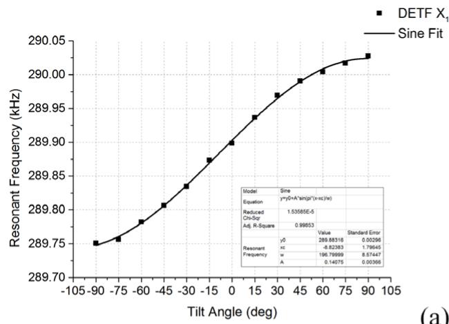  
(a)

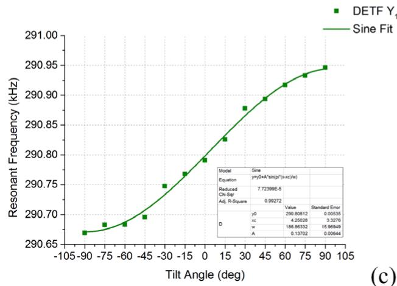

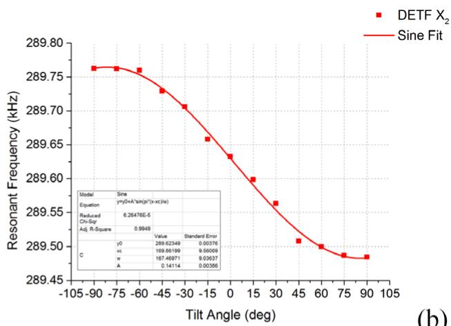

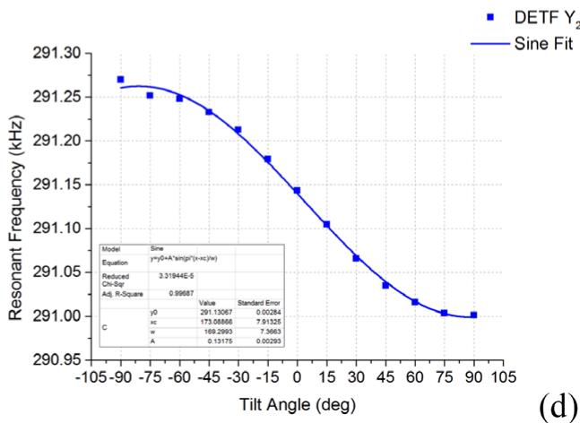  
Figure 13. Multi-angle tilt testing results of each single DETF resonator.

sensitivity of $275\mathrm{Hzg}^{-1}$ can be estimated around an average resonant frequency of $290\mathrm{kHz}$ . The sensitivity differences are within $10\mathrm{Hzg}^{-1}$ and can be easily compensated using an initial calibration. As expected in section 2, the average cross-axis sensitivity between the different axes is lower than $3.4\%$ , which is limited by the positioning accuracy of the experimental setup. The residual cross-axis sensitivity can be compensated in the sensor data processing. The results from theoretical calculation, FEM simulation and experiment are summarized in table 2, from which it is found that the experimental results differ a lot from the theoretical calculation and FEM simulation results. The differences can be explained for three reasons. First, the length of the pivot beams may be different from the values used in calculation and simulation, because there is an 'edge-to-edge' bias between the bottom side opening and the fixed boundary of the pivot beams, which causes uncertainty of the effective length of the pivot beams

[23]. Second, a certain degree of under-cut or notching effect in the DRIE from the front side will result in narrowing down some beams such as pivot beams, connection beams, and resonators, and accordingly result in a smaller resonant frequency but a higher amplification factor and sensitivity. Finally, material properties such as Young's modulus of silicon used in the calculation and simulation may slightly differ from the real values.

This performance is compared with other biaxial resonant accelerometers reported in the literature, as shown in table 3. Owing to the use of the two-stage microleverage mechanisms, the device in the present work possesses greater sensitivity than the other biaxial devices, which integrate with or without the single-stage microleverage mechanisms. In our device, certain beams such as pivot beams and connection beams are designed conservatively for consideration of their structural strength and stability, which will reduce the amplification

factor and the sensitivity. However, the introduced two-stage microleverage mechanism offsets this impact and leads to the good performance of the device. The oscillating circuits can be used in the future, so that the device can be operated with relatively low power consumption and is much simpler to use.

Figure 13 shows the device responses to multiple tilt angles for each resonator. It is seen that the two DETFs on the same axis consequently incur an opposite frequency shift for the induced tilt angle. The axial loading is given by

$$
F _ {\text {o u t}} = E A \times M _ {\text {p r o o f}} g \times \sin \theta \tag {13}
$$

where $\theta$ is the tilt angle. The output responses of each resonator match well with the sine function of the tilt angle as expected. The error mainly lies within the positioning accuracy of the rotation table.

# 5. Conclusions

A novel biaxial resonant accelerometer with two-stage microleverage mechanisms has been designed, fabricated, and tested. A theoretical model has been used to analyze the device, taking into account the stiffness of the decoupling beams. The theoretical analysis shows that the two-stage microleverage mechanism is an ideal option for overall optimization of the force amplification factor, structure compliance, and device area in the design of the resonant accelerometer. The structural dimensions of the accelerometer are optimized by FEM simulation. The resonant accelerometer is fabricated in an SOI wafer with a device area of $1900\mu \mathrm{m}\times 1900\mu \mathrm{m}$ . The experimental results show the fabricated resonant accelerometer has a high differential sensitivity of $275\mathrm{Hzg^{-1}}$ . The measured cross-axis sensitivity is lower than $3.4\%$ . Compared with the previous research, the present biaxial resonant accelerometer has greater sensitivity due to the use of two-stage microleverage mechanisms. The two-stage microleverage mechanisms can also be used in the designs of other resonant sensors to amplify axial loading and improve sensitivity. Further work will focus on a combination of the present biaxial resonant accelerometer with a frequency readout circuit to build a complete two-axis in-plane acceleration measurement system.

# Acknowledgments

This work is supported by the National Natural Science Foundation of China (No. 51475423), the Zhejiang Provincial Natural Science Foundation of China (No. LY14E050018) and the Science Fund for Creative Research Groups of National Natural Science Foundation of China (No. 51221004).

# References

[1] Stemme G 1991 Resonant silicon sensors J. Micromech. Microeng. 1 113-25   
[2] Nielson G N and Barbastathis G 2006 Dynamic pull-in of parallel-plate and torsional electrostatic MEMS actuators J Microelectromech. Syst. 15 811-21

[3] Caspani A, Comi C, Corigliano A, Langfelder G and Tocchio A 2013 Compact biaxial micromachined resonant accelerometer J. Micromech. Microeng. 23 105012   
[4] Bokaian A 1990 Natural frequencies of beams under tensile axial loads J. Sound Vib. 142 481-98   
[5] Zhao J, Ding H and Xie J 2015 Electrostatic charge sensor based on a micromachined resonator with dual micro-levers Appl. Phys. Lett. 106 233505   
[6] Thompson M J and Horsley D 2009 Resonant MEMS magnetometer with capacitive read-out IEEE Sensors pp 992-5   
[7] Seshia A A, Howe R T and Montague S 2002 An integrated microelectromechanical resonant output gyroscope 15th IEEE Int. Conf. on Micro Electro Mechanical Systems pp 722-6   
[8] Roessig T A, Howe R T, Pisano A P and Smith J H 1997 Surface-micromachined resonant accelerometer Int. Conf. on Solid State Sensors and Actuators TRANSDUCERS'97 (Chicago) pp 859-62   
[9] Aikele M, Bauer K, Ficker W, Neubauer F, Prechtel U, Schalk J and Seidel H 2001 Resonant accelerometer with self-test Sensors and Actuators A 92 161-7   
[10] Seshia A A, Palaniapan M, Roessig T A, Howe R T, Gooch R W, Schimert T R and Montague S 2002 A vacuum packaged surface micromachined resonant accelerometer J Microelectromech. Syst. 11 784-93   
[11] Su S X, Yang H S and Agogino A M 2005 A resonant accelerometer with two-stage microleverage mechanisms fabricated by SOI-MEMS technology IEEE Sens. J. 5 1214-23   
[12] Comi C, Corigliano A, Langfelder G, Longoni A, Tocchio A and Simoni B 2010 A resonant microaccelerometer with high sensitivity operating in an oscillating circuit J Microelectromech. Syst. 19 1140-52   
[13] Zou X, Thiruvenkatanathan P and Seshia A A 2014 A seismic-grade resonant MEMS accelerometer J Microelectromech. Syst. 23 768-70   
[14] He L, Xu Y P and Palaniapan M 2008 A CMOS readout circuit for SOI resonant accelerometer with $4\mu \mathrm{g}$ Bias stability and 20 $\mu \mathrm{g} / \sqrt{\mathrm{Hz}}$ resolution IEEE J. Solid-State Circuits 43 1480-90   
[15] Comi C, Corigliano A, Langfelder G, Longoni A, Tocchio A and Simoni B 2011 A new biaxial silicon resonant micro accelerometer 24th IEEE Int. Conf. on Micro Electro Mechanical Systems pp 529-32   
[16] Yang B, Zhao H, Dai B and Liu X 2015 A new silicon biaxial decoupled resonant micro-accelerometer Microsyst. Technol. 21 109-15   
[17] Zou X, Thiruvenkatanathan P and Seshia A A 2014 A high-resolution micro-electro-mechanical resonant tilt sensor Sensors Actuators A 220 168-77   
[18] Xie J, Agarwal R, Liu Y, Tsai J M, Ranganathan N and Singh J 2011 Compact electrode design for an in-plane accelerometer on SOI with refilled isolation trench J. Micromech. Microeng. 21 095005   
[19] Tabata O and Yamamoto T 1999 Two-axis detection resonant accelerometer based on rigidity change Sensors Actuators A 75 53-9   
[20] Su S X and Yang H S 2001 Single-stage microleverage mechanism optimization in a resonant accelerometer Struct. Multidiscipl. Optim. 21 246-52   
[21] Su S X and Yang H S 2001 Two-stage compliant microleverage mechanism optimization in a resonant accelerometer Struct. Multidiscipl. Optim. 22 328-34   
[22] Su S X 2001 Compliant Leverage Mechanism Design for MEMS Applications PhD Thesis University of California, Berkeley, CA   
[23] Cowen A, Hames G, Monk D, Wilcenski S and Hardy B 2011 SOIMUMPs Design Handbook (Durham, NC: MEMSCAP Inc)