PAPER

# A MEMS resonant accelerometer with sensitivity enhancement and adjustment mechanisms

To cite this article: Hong Ding et al 2017 J. Micromech. Microeng. 27 115010

View the article online for updates and enhancements.

# You may also like

Silicon MEMS inertial sensors evolution over a quarter century  
G Langfelder, M Bestetti and M Gadola   
- ALMA Survey of Orion Planck Galactic Cold Clumps (ALMASOP): Molecular Jets and Episodic Accretion in Protostars Somnath Dutta, Chin-Fei Lee, Doug Johnstone et al.   
- A high-sensitivity biaxial resonant accelerometer with two-stage microleverage mechanisms  
Hong Ding, Jiumuan Zhao, Bing-Feng Ju et al.

# A MEMS resonant accelerometer with sensitivity enhancement and adjustment mechanisms

Hong Ding $^{1}$ , Wen Wang $^{2}$ , Bing-Feng Ju $^{1}$ and Jin Xie $^{1}$

1 The State Key Laboratory of Fluid Power and Mechatronic Systems, Zhejiang University, Hangzhou 310027, People's Republic of China   
$^{2}$ School of Mechanical Engineering, Hangzhou Dianzi University, Hangzhou 310018, People's Republic of China

E-mail: xiejin@zju.edu.cn (J Xie)

Received 4 June 2017, revised 4 September 2017  
Accepted for publication 19 September 2017  
Published 16 October 2017

# Abstract

This paper proposes a resonant accelerometer with sensitivity enhancement and adjustment mechanisms based on microelectromechanical systems (MEMS). Different from conventional resonant accelerometers with sensitivity only enhanced by microleverage mechanisms, the proposed accelerometer utilizes a fishbone-shaped resonator as sensing element to enhance and adjust sensitivity. The fishbone-shaped resonator can realize the mode selection and frequency-tuning function according to the configuration of sensing and driving electrodes, so then different modes yields different sensitivities. Experimental results demonstrate that the mean differential sensitivities span from $12.44 - 61.00\mathrm{Hzg}^{-1}$ (Mode 1: $12.44\mathrm{Hzg}^{-1}$ ; Mode 2: $36.94\mathrm{Hzg}^{-1}$ ; Mode 3: $61.00\mathrm{Hzg}^{-1}$ ) and the average resonant frequencies are $116.47\mathrm{kHz}$ , $299.87\mathrm{kHz}$ and $548.35\mathrm{kHz}$ , respectively. Moreover, the preliminary tilt experiment verifies that this prototype has potential usage in tilt measurement.

Keywords: resonant accelerometer, MEMS, fishbone-shaped resonator, micro sensor

(Some figures may appear in colour only in the online journal)

# 1. Introduction

MEMS resonators have a lot of applications, such as timing [1, 2], measurements [3, 4], signal processing [5], and wireless communication [6] etc. Among these applications, resonant sensing holds a unique position [7]. Because of the effect of axial load on the resonant frequency, the resonators alter output frequency as a function of external physical parameters [8]. Based on the principle of resonant sensing, strain sensors [9], electrostatic charge sensors [10], pressure sensors [11] and many other sensors have been developed.

As one of the resonant sensors, resonant accelerometers possess various advantages, such as quasi-digital output signal, high sensitivity, strong anti-interference and large dynamic range, compared with the traditional capacitive accelerometers [12, 13]. The resonant frequency of beam resonator changes with the external acceleration because of the effect

of inertial force on the equivalent stiffness. In order to yield higher frequency sensitivity, previous research only focused on the utilization and optimization of microleverage mechanism which amplifies the axial load of resonator [14-18]. From another point of view, because a sensor always acts as the feedback of a closed-loop control system, the output will be the most accurate if it is in the middle of the measurement range which has the best linearity. So a sensitivity-adjustable sensor can work more effectively in different operating conditions. But for the given conditions of material, dimension and fabrication process, the force amplification factor of an optimized microleverage is limited and invariable. That is the key restriction on the sensitivity enhancement and adjustment of the state-of-the-art resonant accelerometers.

Previous research has found that by increasing the vibration mode, the absolute frequency sensitivity of resonator will be raised [19]. That is a new approach to improve the sensitivity

of resonant accelerometers, but the conventional architecture of resonator, including actuation topology and the structure of driving and sensing electrodes, only determines the low vibration mode. For beam resonators, a great deal of work has been done to realize tunable higher mode vibration. By using the support beams placed at several flexural-mode node points, the resonant beam can only vibrate at a specific mode and is not tunable [20-23]. By placing the driving electrodes at suitable positions near the vibrating beam, the first and third modes are achieved, but the resonator cannot vibrate at any other higher modes [24]. For frequency tuning and mode selection function of more modes, a fishbone-shaped clamped-clamped beam resonator has been demonstrated. This device can vibrate from low modes to high modes by setting the configuration of the electrodes [25, 26]. Consequently, the integration of resonant accelerometer and fishbone-shaped beam resonator will realize the sensitivity enhancement and adjustment function.

In this paper, a MEMS resonant accelerometer with sensitivity enhancement and adjustment mechanisms is presented. This prototype incorporates a pair of fishbone-shaped clamped-clamped beam as the resonant sensing elements, a pair of single-stage microleverage mechanisms amplifying the inertial force, and a proof mass. Different collocations of sensing and driving electrodes correspond to different vibration modes of the resonator. The measurement results show the average differential sensitivities spanning from 12.44 Hz $\mathrm{g}^{-1}$ to $61.00\mathrm{Hzg}^{-1}$ (Mode 1: $12.44\mathrm{Hzg}^{-1}$ ; Mode 2: $36.94\mathrm{Hzg}^{-1}$ ; Mode 3: $61.00\mathrm{Hzg}^{-1}$ ) at the average resonant frequencies of $116.47\mathrm{kHz}$ , $299.87\mathrm{kHz}$ and $548.35\mathrm{kHz}$ respectively. Different from the previously reported resonant accelerometers, this is the first time to apply tunable higher-order vibrating resonator in a resonant accelerometer to realize sensitivity enhancement and adjustment. In addition, a preliminary tilt test in detection range of $\pm 45^{\circ}$ is conducted to verify the potential usage in tilt measurement. The tilt sensitivities are $0.12\mathrm{Hz / deg}$ (mode 1), $0.60\mathrm{Hz / deg}$ (mode 2) and $0.98\mathrm{Hz / deg}$ (mode 3) respectively.

This paper is divided into six sections. Following the introduction, section 2 introduces the force sensitivity enhancement and adjustment principle of beam resonator; the device design and analysis, including device architecture, operation mechanism of the fishbone-shaped resonator, finite element method (FEM) modal analysis and frequency response of the resonator, and single-stage microleverage mechanisms are elaborated in section 3. The fabrication process is demonstrated in section 4. In section 5, the experimental measurements, in terms of electromechanical characterization and acceleration measurements are carried out respectively. The final section offers the conclusions and suggests the future work.

# 2. Force sensitivity enhancement and adjustment principle

Figure 1 shows the theoretical model used to determine the resonant frequencies of the clamed-clamed beam resonator. Under bending effect, the dynamic differential equation is [27]

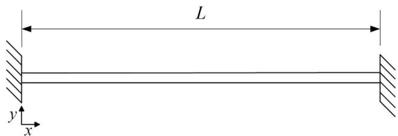  
Figure 1. Theoretical model of clamed-clamed beam resonator.

Table 1. Resonant frequencies and impact factors of modes 1-3.   

<table><tr><td>Mode</td><td>1</td><td>2</td><td>3</td></tr><tr><td>Resonant frequency fi</td><td>f1</td><td>2.76f1</td><td>5.40f1</td></tr><tr><td>Impact factor IFi</td><td>IF1</td><td>1.36IF1</td><td>1.49IF1</td></tr><tr><td>Force sensitivity Si</td><td>S1</td><td>1.36S1</td><td>1.49S1</td></tr></table>

$$
E I \frac {\partial^ {4} y}{\partial x ^ {4}} + F _ {a} \frac {\partial^ {2} y}{\partial x ^ {2}} + \rho S \frac {\partial^ {2} y}{\partial t ^ {2}} = 0 \tag {1}
$$

where $y$ is the beam deflection, $E$ is the Young's modulus, $I$ is the moment of inertial of the beam cross-section, $\rho$ is the density, $S$ is the cross-section area of the beam, $F_{\mathrm{a}}$ is the axial tension applied to the resonator.

The boundary conditions of the clamped-clamped beam are

$$
y (0) = y (L) = 0
$$

$$
\left. \frac {\partial y}{\partial x} \right| _ {x = 0} = \left. \frac {\partial y}{\partial x} \right| _ {x = L} = 0. \tag {2}
$$

The ordinary single-degree-of-freedom (SDOF) equations can represent each mode respectively, and each SDOF equation is independent from the others. An SDOF can be expressed as a product of a time-dependent term (the 'modal coordinate') and a position-dependent term (the 'mode shape'). So in equation (1) $y$ is always expressed as the total of several SDOFs.

$$
y (x, t) = \sum_ {i} y _ {i} (x, t) = \sum_ {i} \phi_ {i} (x) q _ {i} (t) \tag {3}
$$

where $\phi_i(x)$ is the $i$ th mode shape and $q_i(t)$ is the $i$ th modal coordinate. By setting $\omega_i$ as the resonant angular frequency of each mode, the $i$ th mode shape is expressed as

$$
\phi_ {i} (x) = \cos \beta_ {i} x - \cosh \beta_ {i} x + \eta_ {i} (\sin \beta_ {i} x - \sinh \beta_ {i} x)
$$

$$
\text {w h e r e} \beta_ {i} ^ {4} = \frac {\omega_ {i} ^ {2} \rho S}{E I}, \eta_ {i} = \frac {\cosh \beta_ {i} L - \cos \beta_ {i} L}{\sin \beta_ {i} L - \sinh \beta_ {i} L}, \text {a n d} \beta_ {i} L \approx \left\{ \begin{array}{c c} 4. 7 3 & i = 1 \\ (i + \frac {1}{2}) \pi & i \geqslant 2 \end{array} . \right. \tag {4}
$$

So equation (1) can be re-expressed as

$$
\sum_ {i} \left(E I \frac {\partial^ {4} \phi_ {i}}{\partial x ^ {4}} q _ {i} + F _ {a} \frac {\partial^ {2} \phi_ {i}}{\partial x ^ {2}} q _ {i} + \rho S \phi_ {i} \ddot {q} _ {i}\right) = 0. \tag {5}
$$

After equation (5) is multiplied by the analyzed mode shape and integrated over the beam length, all of the cross-terms of different modes drop out and only the analyzed mode is remaining

$$
\int_ {0} ^ {L} \rho S \phi_ {i} ^ {2} \mathrm {d} x \ddot {q} _ {i} + \left(\int_ {0} ^ {L} E I \frac {\partial^ {4} \phi_ {i}}{\partial x ^ {4}} \phi_ {i} \mathrm {d} x + \int_ {0} ^ {L} F _ {\mathrm {a}} \frac {\partial^ {2} \phi_ {i}}{\partial x ^ {2}} \phi_ {i} \mathrm {d} x\right) q _ {i} = 0. \tag {6}
$$

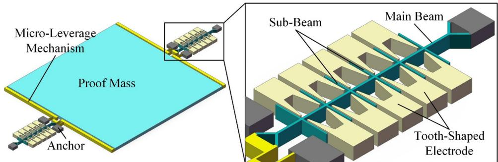  
(a)   
(b)

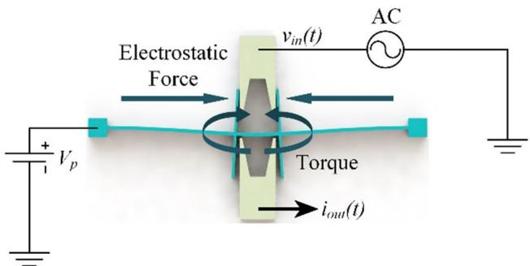  
Figure 2. Scheme of (a) the resonant accelerometer with fishbone-shaped resonators and (b) fishbone-shaped resonator.

(a)

(b)   
Figure 3. (a) Working principle of the fishbone-shaped resonator and (b) mode selectable principle and electrodes configurations of the resonator.   
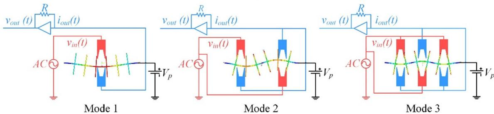  
Driving Electrode Sensing Electrode

Equation (6) can be further simplified by integrating the second and third terms by parts and then

$$
\int_ {0} ^ {L} \rho S \phi_ {i} ^ {2} \mathrm {d} x \ddot {q} _ {i} + \left[ \int_ {0} ^ {L} E I \left(\frac {\partial^ {2} \phi_ {i}}{\partial x ^ {2}}\right) ^ {2} \mathrm {d} x + \int_ {0} ^ {L} F _ {\mathrm {a}} \left(\frac {\partial \phi_ {i}}{\partial x}\right) ^ {2} \mathrm {d} x \right] q _ {i} = 0. \tag {7}
$$

The first term in equation (7) can be treated as the inertial term and the second one can be treated as the stiffness term. Commonly, the resonant frequency can be derived from the kinetic and potential energies of vibration beam. So the effective mass $M_{\mathrm{eff},i}$ and stiffness $K_{\mathrm{eff},i}$ can be defined as

$$
M _ {\text {e f f}, i} = \int_ {0} ^ {L} \rho S \phi_ {i} ^ {2} d x
$$

$$
K _ {\text {e f f}, i} = \int_ {0} ^ {L} E I \left(\frac {\partial^ {2} \phi_ {i}}{\partial x ^ {2}}\right) ^ {2} d x + \int_ {0} ^ {L} F _ {\mathrm {a}} \left(\frac {\partial \phi_ {i}}{\partial x}\right) ^ {2} d x. \tag {8}
$$

For removing the beam length $L$ from the integral symbol, we define a variable $\varepsilon$ as $\varepsilon = x / L$ (ranges from 0 to 1), so $M_{\mathrm{eff},i}$ and $K_{\mathrm{eff},i}$ can be rewritten as

Table 2. Designed dimensions of the fishbone-shaped resonator.   

<table><tr><td></td><td>Length</td><td>Width</td><td>Thickness</td><td>Pitch</td></tr><tr><td>Main beam (μm)</td><td>350</td><td>3.5</td><td>25</td><td>N/A</td></tr><tr><td>Sub-beam (μm)</td><td>100</td><td>2.5</td><td>25</td><td>50</td></tr></table>

$$
M _ {\text {e f f}, i} = \int_ {0} ^ {1} \rho S L \phi_ {i} ^ {2} (\varepsilon) \mathrm {d} \varepsilon
$$

$$
K _ {\text {e f f}, i} = \int_ {0} ^ {1} \frac {E I}{L ^ {3}} \left(\frac {\partial^ {2} \phi_ {i} (\varepsilon)}{\partial \varepsilon^ {2}}\right) ^ {2} \mathrm {d} \varepsilon + \int_ {0} ^ {1} \frac {F _ {\mathrm {a}}}{L} \left(\frac {\partial \phi_ {i} (\varepsilon)}{\partial \varepsilon}\right) ^ {2} \mathrm {d} \varepsilon . \tag {9}
$$

According to equation (9), equation (7) can be rewritten as

$$
M _ {\text {e f f}, i} \ddot {q} _ {i} + K _ {\text {e f f}, i} q _ {i} = 0. \tag {10}
$$

It is generally known that equation (10) refers to simple harmonic motion and the resonant frequency $f_{i}$ of each mode is

$$
f _ {i} = \frac {\omega_ {i}}{2 \pi} = \frac {1}{2 \pi} \sqrt {\frac {K _ {\text {e f f} , i}}{M _ {\text {e f f} , i}}}. \tag {11}
$$

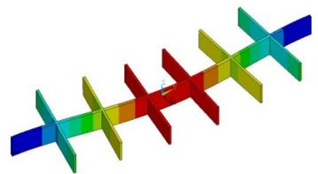  
Mode 1 $f_{l} = 152.086\mathrm{kHz}$

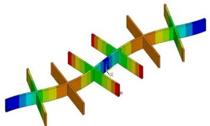  
Mode 2 $f_{2} = 391.723\mathrm{kHz}$

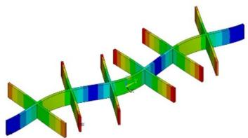  
Mode 3 $f_{3} = 675.868\mathrm{kHz}$

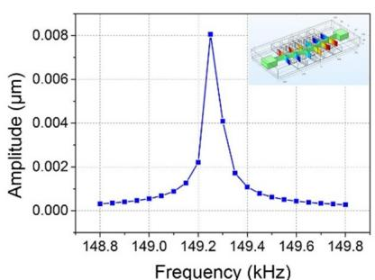  
Figure 4. FEM modal analysis of modes 1-3 of the fishbone-shaped resonator.   
Mode1 $f_{l} = 149.25\mathrm{kHz}$

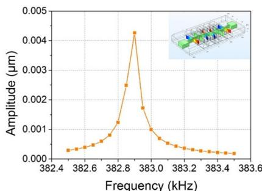  
Mode 2 $f_{2} = 382.9\mathrm{kHz}$

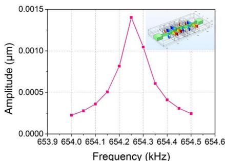  
Mode 3 $f_{3} = 654.25\mathrm{kHz}$

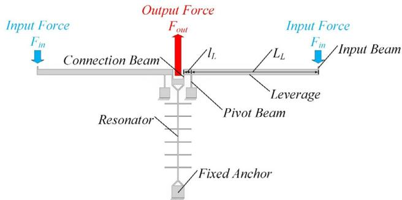  
Figure 5. FEM simulated frequency response of modes 1-3 of the fishbone-shaped resonator.   
Figure 6. Schematic view of single-stage microleverage mechanism.

To seek the effect of vibration mode on the force sensitivity, we take the derivatives of Equations (11) with respect to the axial tension $F_{\mathrm{a}}$ , and obtain

$$
\frac {\partial f _ {i}}{\partial F _ {\mathrm {a}}} = \frac {1}{4 \pi \sqrt {K _ {\mathrm {e f f} , i} M _ {\mathrm {e f f} , i}}} \frac {\partial K _ {\mathrm {e f f} , i}}{\partial F _ {\mathrm {a}}}. \tag {12}
$$

At the initial state, there is neither external acceleration nor inertial force, so $F_{\mathrm{a}} = 0$ and then we substitute equation (9) into equation (12)

$$
\frac {\partial f _ {i}}{\partial F _ {\mathrm {a}}} = \frac {1}{4 \pi \sqrt {E I \rho S}} \frac {\int_ {0} ^ {1} \left(\frac {\mathrm {d} \phi_ {i}}{\mathrm {d} \varepsilon}\right) ^ {2} \mathrm {d} \varepsilon}{\sqrt {\int_ {0} ^ {1} \left(\frac {\mathrm {d} ^ {2} \phi_ {i}}{\mathrm {d} \varepsilon^ {2}}\right) ^ {2} \mathrm {d} \varepsilon \times \int_ {0} ^ {1} \phi_ {i} ^ {2} \mathrm {d} \varepsilon}}. \tag {13}
$$

The first multiplication item in equation (13) is constant and it is determined by the material property and structure

Table 3. The structure parameters.   

<table><tr><td>Parameter</td><td>Symbol</td><td>Value</td></tr><tr><td>Young&#x27;s Modulus</td><td>E</td><td>150 GPa</td></tr><tr><td>Density</td><td>ρ</td><td>2330 kg m-3</td></tr><tr><td>Thickness</td><td>t</td><td>25 μm</td></tr><tr><td>Resonant tine length</td><td>L</td><td>350 μm</td></tr><tr><td>Resonant tine width</td><td>w</td><td>3.5 μm</td></tr><tr><td>Connection beam length</td><td>Lc</td><td>16 μm</td></tr><tr><td>Connection beam width</td><td>wc</td><td>3 μm</td></tr><tr><td>Pivot beam length</td><td>lp</td><td>50 μm</td></tr><tr><td>Pivot beam width</td><td>wp</td><td>3 μm</td></tr><tr><td>Power arm length</td><td>Ll</td><td>498 μm</td></tr><tr><td>Resisting arm length</td><td>lL</td><td>30 μm</td></tr><tr><td>Proof mass</td><td>Mproof</td><td>3.65 × 10-8kg</td></tr></table>

dimension. Here, we define the second multiplication item in equation (13) as the impact factor $\mathrm{IF}_i$ of force sensitivity [19] and have

$$
\frac {\partial f _ {i}}{\partial F _ {\mathrm {a}}} \propto \mathrm {I F} _ {i} = \frac {\int_ {0} ^ {1} \left(\frac {\mathrm {d} \phi_ {i}}{\mathrm {d} \varepsilon}\right) ^ {2} \mathrm {d} \varepsilon}{\sqrt {\int_ {0} ^ {1} \left(\frac {\mathrm {d} ^ {2} \phi_ {i}}{\mathrm {d} \varepsilon^ {2}}\right) ^ {2} \mathrm {d} \varepsilon \times \int_ {0} ^ {1} \phi_ {i} ^ {2} \mathrm {d} \varepsilon}}. \tag {14}
$$

So after calculating equations (11) and (14) for modes 1-3, we can obtain the resonant frequencies and impact factors as listed in table 1 [19]

It is clear that force sensitivity of the resonator increases as the increase of vibration mode. But higher vibration modes are usually more difficult to excite.

  
(a)

  
(b)

  
(c)

  
(d)

  
(e)

  
(f)

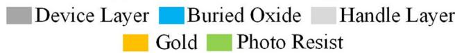  
Figure 7. SOI fabrication process of the device: (a) original wafer, (b) lift-off of pad, (c) lithography, (d) DRIE, (e) photo-resist strip and (f) releasing of the moving structures.

# 3. Device design and analysis

# 3.1. Device architecture

The architecture of resonant accelerometer with fishbone-shaped resonators is shown in figure 2(a). This device is composed of a proof mass, generating inertial force, a pair of single-stage micro-leverage mechanisms, amplifying inertial force, and a pair of fishbone-shaped resonators, sensing the axial load. With the action of external acceleration and inertial force, the proof mass will move together with the leverages so the inertial force will be amplified. The amplified force is applied to the resonators, then the tensile or compressive stress will increase or decrease their resonant frequencies. Consequently, the acceleration can be detected by measuring the differential frequency shift. The symmetrical layout and differential structure can effectively eliminate disturbance and temperature influence.

The detailed scheme of fishbone-shaped resonator is shown in figure 2(b). This resonator consists of a main beam and six sub-beams along it. One end of the resonator is fixed to the anchor and the other is connected to the output port of microleverage. Five pairs of tooth-shaped electrodes are placed facing to the sub-beams. The specific vibration mode depends on the combination of driving and sensing electrodes. The mode selection function will be discussed below.

# 3.2. Operation mechanism of fishbone-shaped resonator

For the conventional parallel-plate or comb transduction beam resonators, the beams are driven by the distributed electrostatic force applied on the beam or the comb electrode. As shown in figure 3(a), for the fishbone-shaped resonator, after applying DC polarization voltage $V_{\mathrm{p}}$ and AC actuation voltage $\nu_{\mathrm{in}}(t)$ , the electrostatic force is exerted on the sub-beams and causes its bend. The bend of sub-beams generates a torque on the main beam, which will result in the in-plane vibration of main beam. On the other hand, the vibration of main beam causes the shake of the sub-beams, the subsequent variation of the gap between the sub-beams and electrodes produces the motional current $i_{\mathrm{out}}(t)$ which is the output current signal. Figure 3(b) indicates

the electrodes configurations corresponding to modes 1-3. The driving and sensing electrodes are opposite and each electrode-pair is placed at the specific flexural-mode node point then the mode selection function is realized. The transimpedance amplifier converts $i_{\mathrm{out}}(t)$ to voltage signal $\nu_{\mathrm{out}}(t)$ , so that each vibration mode can be actuated and detected.

# 3.3. Finite element simulations of fishbone-shaped resonator

In this part, the FEM simulations are firstly carried out to calculate the resonant frequencies of three modes. The designed structure dimensions are listed in table 2. By the modal analysis of ANSYS software, three resonant modes are analyzed and shown in figure 4. To verify the feasibility of mode selection function, a 3D FEM model in COMSOL Multiphysics predicts the frequency response of the resonator in figure 5. In the simulation, the DC polarization voltage is applied to the main beam and the AC excitation is applied to the specific electrodes depending on the configurations of modes. Close agreement is observed both for modal analysis and frequency response analysis. Due to the electrostatic spring softening, the results of frequency response are lower than modal analysis.

# 3.4. Sensitivity enhancement and adjustment mechanisms

Besides the selectable higher mode resonator, we still use single-stage microleverage mechanisms to amplify the inertial force communicated onto the resonators. As shown in figure 6, the whole mechanism is symmetric and consists of input beams, fishbone-shaped resonator, microleverages and their pivot beams, connection beams and fixed anchors. The amplification factor $A$ is defined as the ratio of the output force $F_{\mathrm{out}}$ to the input force $F_{\mathrm{in}}$ . The expression for the amplification factor of a single-stage microleverage mechanism and the output force of $1\mathrm{g}$ acceleration are [28]

$$
A = \frac {F _ {\text {o u t}}}{F _ {\text {i n}}} = \frac {\frac {1}{k _ {v p}} \left(k _ {\theta o} + k _ {\theta p}\right) - l _ {\mathrm {L}} L _ {\mathrm {L}}}{\left(\frac {1}{k _ {v o}} + \frac {1}{k _ {v p}}\right) \left(k _ {\theta o} + k _ {\theta p}\right) + l _ {\mathrm {L}} ^ {2}} \tag {15}
$$

$$
F _ {\text {o u t}} = A \times M _ {\text {p r o o f}} g = F _ {\mathrm {a}} \tag {16}
$$

where $k_{vp}$ and $k_{\theta p}$ are the axial and rotational stiffness of the pivot beam respectively; $k_{vo}$ and $k_{\theta o}$ are the output axial and output rotational stiffness respectively; $l_{\mathrm{L}}$ is the resisting arm length, which is the length between the pivot beam and connection beam; and $L_{\mathrm{L}}$ is the power arm length, which is the length between the pivot beam and input beam. Obviously, $F_{\mathrm{out}} = F_{\mathrm{a}}$ , positive means tension and negative means compression. Based on the structure parameters listed in table 3 and after calculated by MATLAB, $A$ is 14.08 and $F_{\mathrm{out}}$ is $2.51~\mu \mathrm{N}$ .

# 4. Fabrication process

Our device is fabricated by a silicon-on-insulator (SOI) process with a device layer thickness of $25\mu \mathrm{m}$ . The SOI wafer consists of a device layer, which is the main mechanical structure, a buried oxide layer, which will be etched later, and a thick handle layer, which is the substrate (figure 7(a)). Firstly,

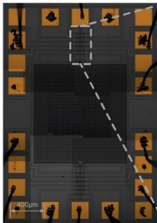

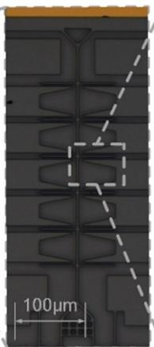

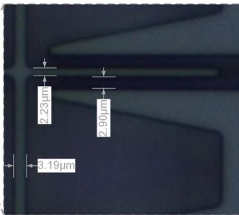

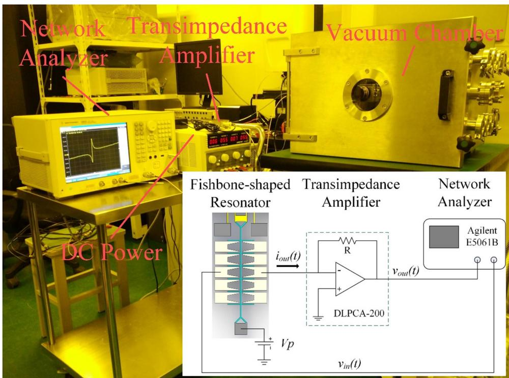  
Figure 8. Overall and detailed optical microscope photograph of the device.   
Figure 9. Experiment setup for resonator open-loop spectral response.

the gold metal stack is patterned as conductive electrodes for wire bonding by a lift-off process (figure 7(b)). Then, the lithographic process and the following deep reactive ion etching (DRIE) form the mechanical structures in the device layer and the releasing holes on the proof mass appear (figures 7(c) and (d)). After the photo-resist is removed (figure 7(e)), the bare oxide layer is etched from the top surface by the process of vapor hydrogen fluoride (HF) so that the moving parts of mechanical structures is released (figure 7(f)). The fabricated resonant accelerometer with fishbone-shaped resonators is shown in figure 8.

# 5. Experiments

After fabrication and wire bonding, the device is fixed on a remote-control rotation platform and tested in a custom vacuum chamber with pressure level of $7.5\mathrm{mTorr}$ at room

temperature. The measurement setup for resonator open-loop spectral response is schematically illustrated in figure 9. The network analyzer (Agilent E5061B) swept the frequency and recorded the open-loop frequency response of resonator. The AC actuation voltage $\nu_{\mathrm{in}}(t)$ placed at the driving electrode attracts the sub-beams and leads to the vibration of resonator. The DC polarization voltage $V_{\mathrm{p}}$ is applied on the vibration beam, and the motional current $i_{\mathrm{out}}(t)$ , which is proportional to the vibration amplitude of the resonator, can be converted to voltage signal $\nu_{\mathrm{out}}(t)$ through a low noise transimpedance amplifier (FEMTO, DLPCA-200). So the transmission magnitude $S_{dB}$ can be expressed as

$$
S _ {\mathrm {d B}} = 2 0 \log \left(\left| \frac {v _ {\text {o u t}} (t)}{v _ {\text {i n}} (t)} \right|\right). \tag {17}
$$

For different modes, the setup of $V_{\mathrm{p}}$ and $\nu_{\mathrm{in}}(t)$ are different according to the consideration of noise and nonlinearity.

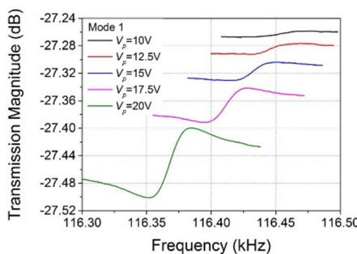  
(a)

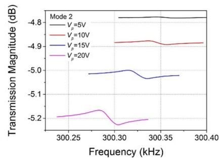  
(b)

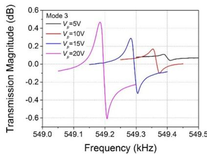  
(c)

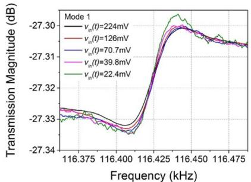  
Figure 10. Magnitude responses of resonator under different DC polarization voltages: (a) mode 1, (b) mode 2 and (c) mode 3.   
(a)

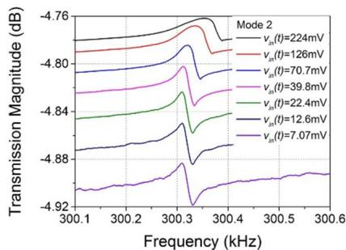  
(b)

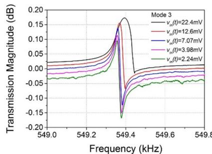  
(c)   
Figure 11. Magnitude responses of resonator under different AC actuation voltages: (a) mode 1, (b) mode 2 and (c) mode 3.

# 5.1. Electromechanical characterization

As shown in figures 10(a)-(c), electromechanical characterization measurements of different modes are performed for different $V_{\mathrm{p}}$ when $\nu_{\mathrm{in}}(t)$ is fixed at $70.7~\mathrm{mV}$ (mode 1), $22.4~\mathrm{mV}$ (mode 2) and $3.98~\mathrm{mV}$ (mode 3). It is clear that the reductions in resonant frequencies of each mode appear and there is function relationship between resonant frequency and $V_{\mathrm{p}}$ . Because of electrostatic spring softening, the resonant frequency decrease as $V_{\mathrm{p}}$ increases. The difference between the transmission magnitudes of series resonance and parallel resonance increases with the increasing of $V_{\mathrm{p}}$ since the transduction factor is enhanced. In the meantime, the negative peak resonance is known as the anti-resonance peak, and is caused by feedthrough capacitance parallel to the equivalent RLC circuit of resonator. Because of the low transduction factor, the anti-resonance peaks cannot be easily observed when $V_{\mathrm{p}}$ is low (mode 1, $V_{\mathrm{p}} = 10\mathrm{V}$ and $12.5\mathrm{V}$ ; mode 2, $V_{\mathrm{p}} = 5\mathrm{V}$ and $10\mathrm{V}$ ). In addition, the transmission magnitudes of each mode are different, and the magnitudes of mode 3 are much higher than modes 1 and 2. This is because the mode 3 is actuated and sensed by more electrodes, so the driving force and motional current are stronger.

The effect of AC actuation voltage $\nu_{\mathrm{in}}(t)$ on the spectral response of different modes are shown in figures 11(a)-(c) when $V_{\mathrm{p}}$ is fixed at $15\mathrm{V}$ (modes 1 and 2) and $20\mathrm{V}$ (mode 3). As $\nu_{\mathrm{in}}(t)$ increases, because the electrostatic driving force is strengthened, the noise disturbance is reduced and the curve is getting more and more smooth. Meanwhile, the dynamic displacement of the beam from the rest position increases so that the impact of the nonlinear restoring force on the resonant frequency becomes more and more significant, leading

to the enhancement of structure stiffness and the nonlinear vibration. This phenomenon can be observed especially at figure 11(c).

# 5.2. Acceleration measurements

For allowing the accelerometer to be subjected to the action of gravity, multiple testing with high quality factor but without frequently pumping and venting chamber, the device is mounted on a custom remote-control rotation platform. So the open-loop frequency response measurements as above are simply repeated for 0 and $\pm 1\mathrm{g}$ . By setting the configuration of the electrodes like figure 3(b), the resonant modes 1-3 can be selected. The results are reported in figures 12(a)-(f). These two fishbone-shaped resonators are on the same axis and incur opposite frequency shifts for the induced accelerations. Consequently, the differential operation of the resonant accelerometer is validated. The obtained performance are summarized in table 4, and the mean sensitivities of modes 1-3 are $12.44\mathrm{Hz~g}^{-1}$ , $36.94\mathrm{Hz~g}^{-1}$ and $61.00\mathrm{Hz~g}^{-1}$ at resonant frequencies of $116.47\mathrm{kHz}$ , $299.87\mathrm{kHz}$ and $548.35\mathrm{kHz}$ respectively. It is clear that the sensitivity has risen as the vibration mode increases. Owing to the use of fishbone-shaped resonator, the present device has higher sensitivity at higher mode and can adjust the sensitivity.

The measured resonant frequencies and the sensitivity difference among the three modes are different with the results from the theoretical analysis in table 1. This issue can be explained by two reasons. First, the sub-beams placed along the main beam affect the effective mass $M_{\mathrm{eff},i}$ and stiffness $K_{\mathrm{eff},i}$ of resonator. For example, the mass and rotational inertia of sub-beam will affect $M_{\mathrm{eff},i}$ and the stiffness of sub-beam will

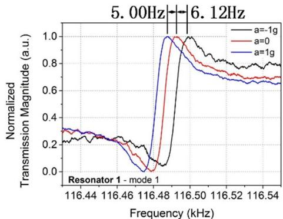  
(a)

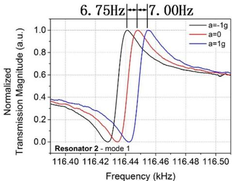  
(b)

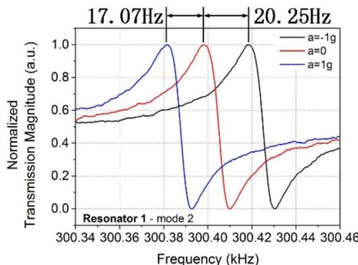  
(c)

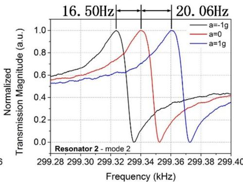  
(d)

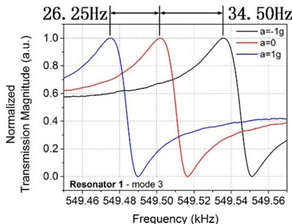  
(e)

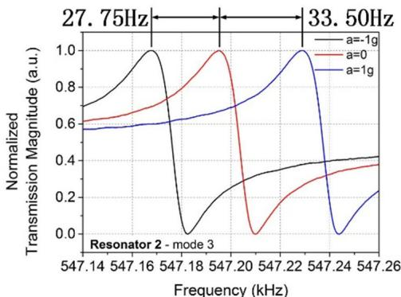  
(f)   
Figure 12. Normalized spectrum response of each single fishbone-shaped resonator evaluated for applied accelerations of 0 and $\pm 1\mathrm{g}$ at modes 1-3: (a) resonator 1, mode 1; (b) resonator 2, mode 1; (c) resonator 1, mode 2; (d) resonator 2, mode 2; (e) resonator 1, mode 3 and (f) resonator 2, mode 3.

Table 4. Experimental frequency and sensitivity for the resonators at modes 1-3.   

<table><tr><td rowspan="2">Mode Resonator</td><td colspan="2">1</td><td colspan="2">2</td><td colspan="2">3</td></tr><tr><td>1</td><td>2</td><td>1</td><td>2</td><td>1</td><td>2</td></tr><tr><td>Resonant frequency (kHz)</td><td>116.49</td><td>116.448</td><td>300.40</td><td>299.34</td><td>549.50</td><td>547.20</td></tr><tr><td>Sensitivity (Hz g-1)</td><td>5.56</td><td>6.88</td><td>18.66</td><td>18.28</td><td>30.38</td><td>30.63</td></tr><tr><td>Differential sensitivity (Hz g-1)</td><td>12.44</td><td></td><td>36.94</td><td></td><td>61.00</td><td></td></tr></table>

affect $K_{\mathrm{eff},i}$ . Secondly, the fabrication error and the residual stress will also affect the measurement results.

Table 5 compares the present work with other resonant accelerometers reported in the literatures. Owing to the use of fishbone-shaped resonator, the proposed accelerometer possesses capability of sensitivity adjustment. Because the proof

mass of our device is smaller than those devices in [17, 29, 30], and our structure dimensions have not been optimized, the sensitivity of this work is a little low. But our present work focuses on the feasibility of sensitivity enhancement and adjustment via the mode selectable resonators. After verification of the fishbone-shaped resonant sensing element, we will

Table 5. Comparison of the MEMS resonant accelerometers.   

<table><tr><td>Reference</td><td>Mass Size (μm3)</td><td>Resonator</td><td>Vibration mode</td><td>Sensitivity (Hz g-1)</td><td>Sensitivity adjustable (yes/no)</td></tr><tr><td>Roessig et al [12]</td><td>120 × 150 × 2</td><td>DETF</td><td>2</td><td>2.4</td><td>No</td></tr><tr><td>Su et al [15]</td><td>450 × 750 × 50</td><td>DETF</td><td>2</td><td>158</td><td></td></tr><tr><td>Comi et al [16]</td><td>400 × 400 × 15</td><td>Clamed-clamped beam</td><td>1</td><td>455</td><td></td></tr><tr><td>Zou et al [17]</td><td>3000 × 2250 × 25</td><td>DETF</td><td>2</td><td>1399.4</td><td></td></tr><tr><td rowspan="2">Yang et al [29]</td><td rowspan="2">7500 × 7500 × 70a</td><td rowspan="2">DETF</td><td rowspan="2">2</td><td>52.57 (X-axis)</td><td></td></tr><tr><td>51.64 (Y-axis)</td><td></td></tr><tr><td>Zhao et al [30]</td><td>2900 × 2900 × 80a</td><td>DETF</td><td>2</td><td>140</td><td></td></tr><tr><td rowspan="3">Present work</td><td rowspan="3">1100 × 1100 × 25</td><td rowspan="3">Fishbone-shaped resonator</td><td rowspan="3">1–3</td><td>12.44 (mode 1)</td><td>Yes</td></tr><tr><td>36.94 (mode 2)</td><td></td></tr><tr><td>61.00 (mode 3)</td><td></td></tr></table>

${}^{a}$ Estimated from micro images in the references.

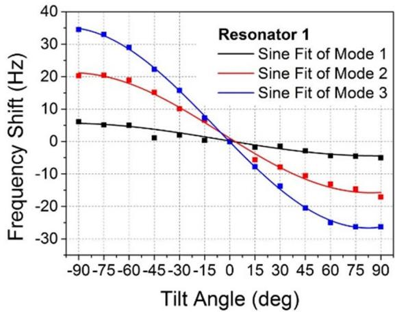

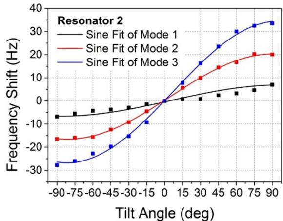  
(a)

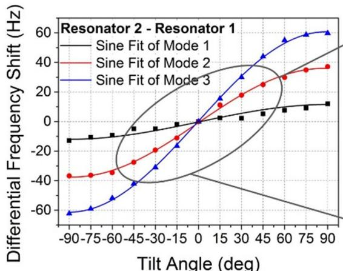

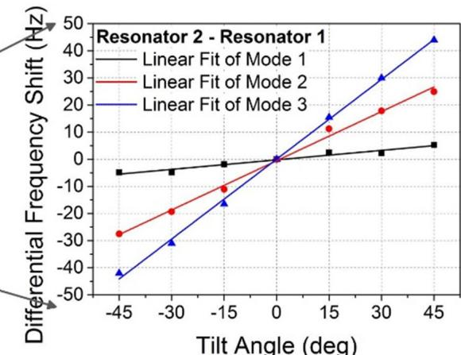  
(b)   
Figure 13. Multi-angle tilt test experimental results: (a) frequency shifts of each single fishbone-shaped resonator at modes 1-3 and (b) differential frequency shifts at modes 1-3.

further carry out the dimension optimization and improve the performance.

The preliminary tilt test has been carried out. Firstly, the weight component force generated by the proof mass is given by:

$$
F _ {\mathrm {c}} = M _ {\text {p r o o f}} g \times \sin \theta \tag {18}
$$

where $g$ is the gravitational acceleration and $\theta$ is the tilt angle. Figure 13(a) shows the response to multiple tilt angles for each resonator at modes 1-3. The two resonators on the same axis incur opposite frequency shift for the induced tilt angle. It is clear that all the output responses match well with the expected sine function of the tilt angle with a measurement range of $\pm 90^{\circ}$ . After difference calculation, the differential

frequency shifts are shown in figure 13(b), including a sine fit for a $\pm 90^{\circ}$ range and a linear fit for a $\pm 45^{\circ}$ range. For a $\pm 45^{\circ}$ range, the sensitivities of the first to third vibration modes are found to be $0.12\mathrm{Hz / deg}$ , $0.60\mathrm{Hz / deg}$ and $0.98\mathrm{Hz / deg}$ respectively, estimated after fitting the experimental results to a linear fit. Therefore, this device has potential usage in the tilt measurement with higher and adjustable sensitivity.

# 6. Conclusions

For the purpose of sensitivity enhancement and adjustment, a resonant accelerometer with fishbone-shaped resonators of higher vibration modes has been designed, fabricated and tested. The theoretical analysis and FEM simulation preliminarily validate the feasibility. The experimental results show this new resonant accelerometer has mean differential sensitivities from $12.44 - 61.00\mathrm{Hz~g}^{-1}$ (Mode 1: $12.44\mathrm{Hz~g}^{-1}$ ; Mode 2: $36.94\mathrm{Hz~g}^{-1}$ ; Mode 3: $61.00\mathrm{Hz~g}^{-1}$ ) and the average resonant frequencies are $116.47\mathrm{kHz}$ (mode 1), $299.87\mathrm{kHz}$ (mode 2) and $548.35\mathrm{kHz}$ (mode 3). Preliminary tilt tests find that the tilt sensitivities are $0.12\mathrm{Hz / deg}$ , $0.60\mathrm{Hz / deg}$ and $0.98\mathrm{Hz / deg}$ , respectively, so this device can be further employed as a higher and adjustable sensitivity resonant tilt sensor. Compared with the previous research, the present resonant accelerometer firstly realizes higher and adjustable sensitivity due to the use of fishbone-shaped clamped-clamped beam resonator. Our future work will focus on further structure optimization, mode switch and frequency readout circuit to build a complete acceleration measurement system.

# Acknowledgments

This work is supported by the 'National Natural Science Foundation of China (51475423, 51275465)', the 'Fundamental Research Funds for the Central Universities' and the 'Science Fund for Creative Research Groups of National Natural Science Foundation of China (51521064)'.

# ORCID iDs

Wen Wang https://orcid.org/0000-0002-0084-0910

Jin Xie https://orcid.org/0000-0003-3942-3046

# References

[1] Nguyen C T-C 2005 MEMS technology for timing and frequency control IEEE Transactions on Ultrasonics, Ferroelectrics, and Frequency Control 54 251-70   
[2] Nguyen C T-C and Howe R T 1999 An integrated CMOS micromechanical resonator high-Q oscillator IEEE J. Solid-State Circuits 34 440-55   
[3] Chan M L, Fonda P, Reyes C, Xie J, Najar H, Lin L and Horsley D A 2012 Micromachining 3D hemispherical features in silicon via micro-EDM IEEE 25th Int. Conf. on Micro Electro Mechanical Systems pp 289–92

[4] Zhang H, Li B, Yuan W, Kraft M and Chang H 2016 An acceleration sensing method based on the mode localization of weakly coupled resonators J. Microelectromech. Syst. 25 286-96   
[5] Wang K and Nguyen C T-C 1999 High-order medium frequency micromechanical electronic filters J. Microelectromech. Syst. 8 534-56   
[6] Liu R, Nilchi J N, Li W C and Nguyen C T-C 2016 Soft-impacting micromechanical resoswitch zero-quiescent power AM receiver IEEE 29th Int. Conf. Micro Electro Mechanical Systems pp 51-4   
[7] Stemme G 1991 Resonant silicon sensors J. Micromech. Microeng. 1 113-25   
[8] Bokaian A A 1990 Natural frequencies of beams under tensile axial loads J. Sound Vib. 142 481-98   
[9] Wojciechowski K E, Boser B E and Pisano A P 2004 A MEMS resonant strain sensor operated in air IEEE 17th Int. Conf. on Micro Electro Mechanical Systems pp 841-5   
[10] Zhao J, Ding H and Xie J 2015 Electrostatic charge sensor based on a micromachined resonator with dual micro-levers Appl. Phys. Lett. 106 233505   
[11] Du X, Wang L, Li A, Wang L and Sun D 2017 High accuracy resonant pressure sensor with balanced-mass DETF resonator and twinborn diaphragms J. Microelectromech. Syst. 26 235-45   
[12] Roessig T A W, Howe R T, Pisano A P and Smith J H 1997 Surface-micromachined resonant accelerometer Int. Solid State Sensors and Actuators Conf. pp 859-62   
[13] Aikele M, Bauer K, Ficker W, Neubauer F, Prechtel U, Schalk J and Seidel H 2001 Resonant accelerometer with self-test Sensors Actuators A 92 161-7   
[14] Su X-S and Yang H S 2001 Two-stage compliant microleverage mechanism optimization in a resonant accelerometer Struct. Multidiscip. Optim. 22 328-34   
[15] Su S-X, Yang H S and Agogino A M 2005 A resonant accelerometer with two-stage microleverage mechanisms fabricated by SOI-MEMS technology IEEE Sens. J. 5 1214-23   
[16] Comi C, Corigliano A, Langfelder G, Longoni A, Tocchio A and Simoni B 2010 A resonant microaccelerometer with high sensitivity operating in an oscillating circuit J. Microelectromech. Syst. 19 1140-52   
[17] Zou X, Thiruvenkatanathan P and Seshia A A 2014 A seismic-grade resonant mems accelerometer J. Microelectromech. Syst. 23 768-70   
[18] Ding H, Zhao J, Ju B-F and Xie J 2016 A high-sensitivity biaxial resonant accelerometer with two-stage microleverage mechanisms J. Micromech. Microeng. 26 15-25   
[19] Roessig T A W 1998 Integrated MEMS tuning fork oscillators for sensor applications PhD Dissertation University of California, Berkeley   
[20] Wang K, Wong A C and Nguyen C T-C 2000 VHF free-free beam high-Q micromechanical resonators J. Microelectromech. Syst. 9 347-60   
[21] Demirci M U and Nguyen C T-C 2003 Higher-mode free-free beam micromechanical resonators IEEE Int. Frequency Control Symp. and PDA Exhibition Jointly with the 17th European Frequency and Time Forum pp 810-8   
[22] Hsu W T, Clark J R and Nguyen C T-C 2001 Q-optimized lateral free-free beam micromechanical resonators Transducers' 01 Eurosensors XV pp 1082-5   
[23] Shao L C, Palaniapan M, Tan W W and Khine L 2008 Nonlinearity in micromechanical free-free beam resonators: modeling and experimental verification J. Micromech. Microeng. 18 25-41

[24] Okada M, Nagasaki H, Tamano1 A, Niki K, Tanigawa H and Suzuki K 2009 Silicon beam resonator utilizing the third-order bending mode Japan. J. Appl. Phys. 48 06FK03   
[25] Kuroda S, Suzuki N, Tanigawa H and Suzuki K 2013 Variable resonance frequency selection for fishbone-shaped microelectromechanical system resonator based on multi-physics simulation Japan. J. Appl. Phys. 52 06GL14-1-6   
[26] Suzuki N, Tanigawa H and Suzuki K 2013 Higher-order vibrational mode frequency tuning utilizing fishbone-shaped microelectromechanical systems resonator $J$ . Micromech. Microeng. 23 45-62

[27] Rao S S 2011 Mechanical Vibrations 5th edn (Englewood Cliffs, NJ: Prentice-Hall)   
[28] Su X-S and Yang H S 2002 Analytical modeling and FEM simulations of single-stage microleverage mechanism Int. J. Mech. Sci. 44 2217-38   
[29] Yang B, Zhao H, Dai B and Liu X 2015 A new silicon biaxial decoupled resonant micro-accelerometer Microsyst. Technol. 21 109-15   
[30] Zhao Y, Zhao J, Wang X, Xia G M, Qiu A P, Su Y and Xu Y P 2015 A sub- $\mu$ g bias-instability MEMS oscillating accelerometer with an ultra-low-noise read-out circuit in CMOS IEEE J. Solid-State Circuits 50 2113-26