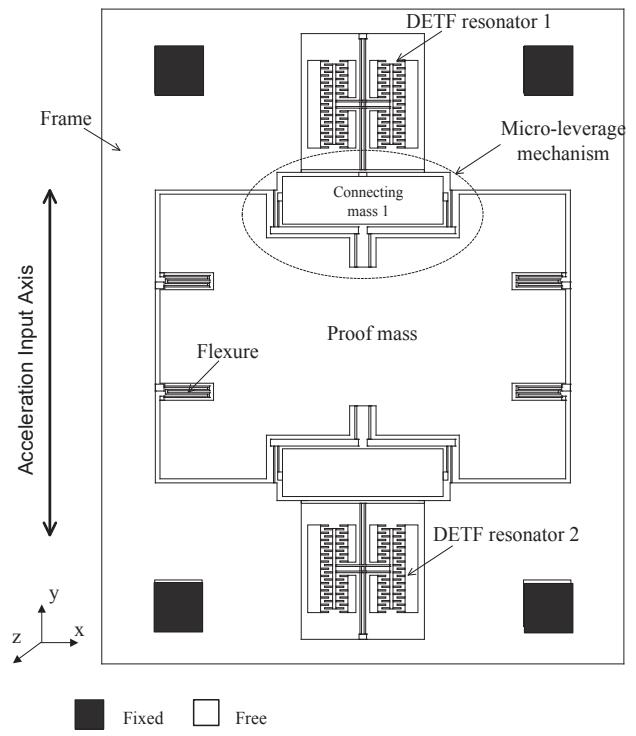
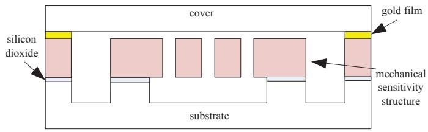
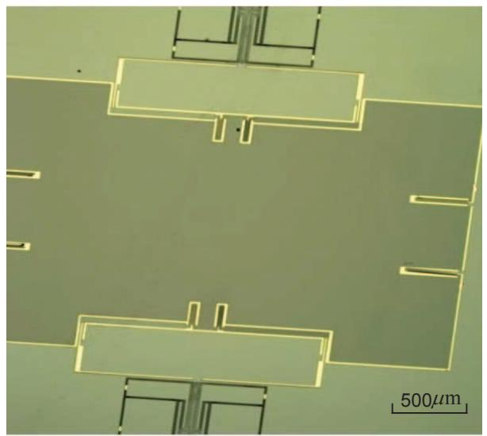
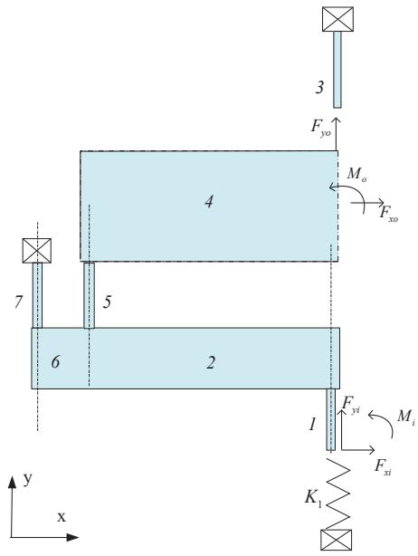
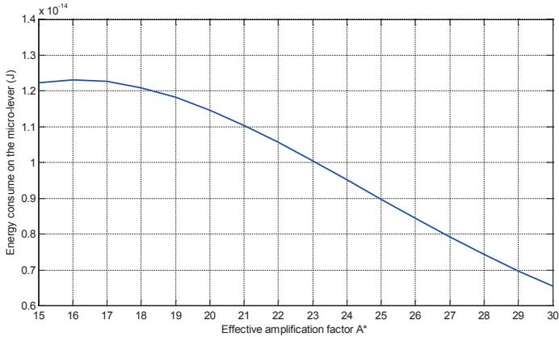
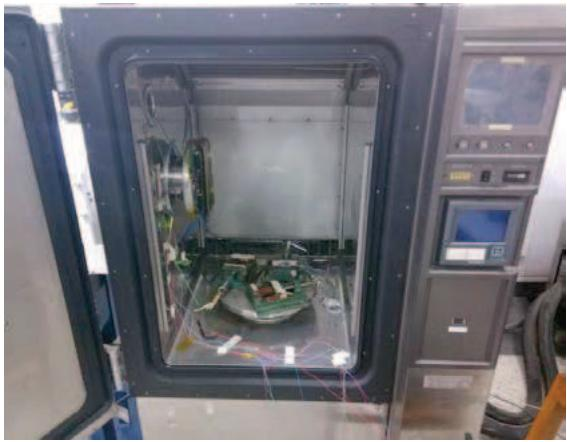
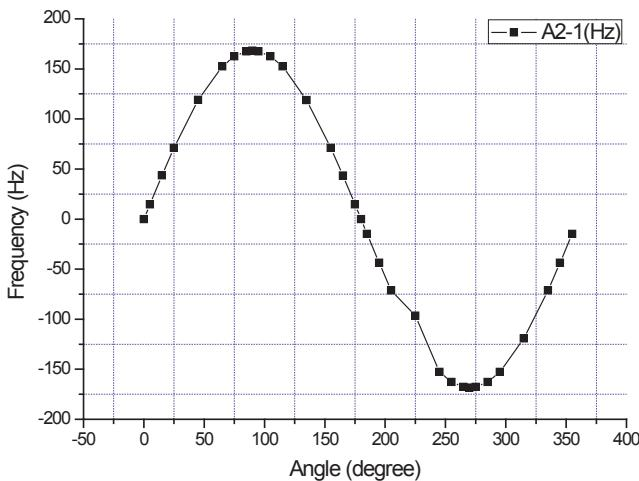
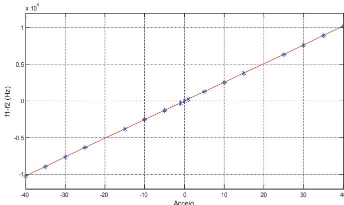
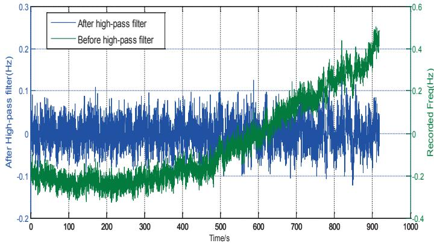
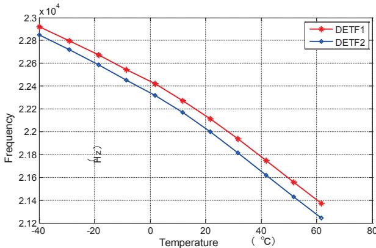

# Energy method for the optimization of a silicon resonant accelerometer

Jing Zhang, Qin Shi, Yan Su, An-Ping Qiu

School of Mechanical Engineering, Nanjing University of Science and Technology

Nanjing 210094, P.R. China

appiu@mail.njust.edu.cn

Abstract—This study investigated the application of energy-consume concept on a silicon resonant accelerometer (SRA) to address design issues. Constrained by micro-fabrication technology, structure of the SRA is formed by resonators, microlever mechanisms, proof mass and multi flexures. They are referred to as compliant mechanisms. Based on the energy conservation law, an energy theoretical model on the structure of the sensor has been built and structural parameters were obtained using this novel method. Sensitivity of the structure after optimization has been increased from $127\mathrm{Hz / g}$ to $157.4\mathrm{Hz / g}$ , while the energy transmitted to the force resonators has been increased from $24.33\%$ to nearly $60\%$ . Results of closed-form and tests exhibited in good agreement. The bias stability $(1\sigma)$ removing the start time was $13.7\mu \mathrm{g}$ . The sensitivity nonlinearity within $\pm 40\mathrm{g}$ was $136.6\mathrm{ppm}$ . The SRA showed very good properties after optimization. This indicates that this energy-consume method has a good potential on MEMS sensors geometrical design.

Keywords—SRA; energy method; optimization; MEMS

# I. INTRODUCTION

The SRA belongs to the generic category of accelerometers known as Vibrating Beam Accelerometers(VBA), which senses acceleration by measuring the change in the resonant frequency of beam oscillators under the inertial loading of a proof mass [1]. SRA is very attractive for high-precision measurement. It can be found in numerous applications such as inertial navigation systems, gaming, smartphones and mobile devices [2]. Compared with traditional accelerometers, SRA is considered attractively for its wide dynamic range and high sensitivity, as well as for its ease of integration into digital systems. The dies of SRA are fabricated using silicon-on-insulator(SOI) processing and wafer-level vacuum packaging, which offer higher aspect ratio MEMS structure, reduce cross-axis sensitivity and increase the robustness of the sensors. These benefits have drawn researchers' extensive attention. In recent years, many mechanical resonant accelerometers have been reported on their design and fabrication [2-5]. Sandia National Laboratories have focused on the mass and the spring constant of an optical resonant accelerometer [6]. Xudong Zou et al. have optimized tilt accelerometer to get a design trade-off between sensitivity, resolution and robustness [7, 8]. Susan X. P. Su et al. have provided the theory for a two-stage microleverage mechanism amplification factor [9]. These studies mainly optimized separate parts or physical parameters

of resonant accelerometers. However, they did not treat the separate parts as an integral energy transmit system, and did not analyzed boundary conditions of the micro-lever which closely related to the amplification factor of SRA structure.

In this paper, the structure of SRA is regarded as an energy transmission system, and each part consumes and transmits energy. This study is aim at optimizing the SRA structure to operate at a high energy transmission efficiency from proof mass to resonators. Based on the energy conservation law, an energy theoretical model on the structure of the sensor has been built by calculating forces and moments on each sensitive part. Micro-lever mechanisms were optimized with low energy loss, and it also addressed the boundary condition issue. This energy method is very important for the design of resonant accelerometers, because it can help the designers to avoid unnecessary energy loss of the structure and to preserve the high quality factor of the resonator. Currently this part of the work has not been reported.

Moreover, it provides insight into modeling of some other performance parameters like cross-axis sensitivity, environmental vibration output, temperature shift and output with residual stress. These will be reported in future.

# II. DEVICE DESIGN

The SRA reported in this work uses a pair of structurally symmetric double-ended tuning fork (DETF) resonant sensing element, the resonant frequencies of which shift proportionally with the applied axial force resulting from any axial acceleration applied on the resonant sensor. The sensitive structure of SRA is shown as a schematic in Fig. 1. Additionally, the DETFs are joined via four single-stage microlevers to the proof mass. The proof mass is supported by four flexures which are linked to the frame mounted on the silicon substrate by four anchors. These flexures restrain the proof mass to move along the input axis.

When the sensor is subjected to acceleration about the input axis, the suspended proof mass displaces, inducing either tension or compression in the DETFs, which produces a measurable natural frequency shift of the two resonators by equal magnitudes but in opposite directions. This differential arrangement enables a first-order cancellation of common parasitic sensitivities such as temperature.

  
Fig. 1. Schematic view of the SRA with a frame structure

  
Fig. 2. Schematic view of the SRA wafer level packaging

  
Fig. 3. SEM photo of the mechanical sensitive structure and its surface area is around $110\mathrm{mm}^2$

The SRA has been fabricated with SOI processing and wafer-level vacuum packaging. The main characteristic of SOI process is using the silicon-to-silicon direct bonding (SSDB) and high-aspect ratio ICP (Inductively Coupled Plasma) etching technology [10, 11]. This process offers $80\mu \mathrm{m}$ -thick high-aspect ratio MEMS structure, which will reduce cross-axis sensitivity and increase the robustness of the sensors. The process cross-section is schematically represented in Fig. 2 and the SEM photo of the mechanical sensitive structure of SRA is shown in Fig. 3.

# Energy method

In the structure of SRA, the proof mass can be regarded as rigid, ignoring its energy consumption. Bending stiffness of the connecting mass in fig. 1 is apparently much higher than other beams, so its stiffness can also be ignored. Since the connecting mass is symmetrical to the y axis, bending moment and horizontal force transferred from output beams will counteract through it. As a result, only axial force can be transferred to the DETFs and cause vertical displacements. In order to simplify the calculation, the flexure is hence regarded as a vertical spring $K_{1}$ . Since the structure is symmetrical to both x axis and y axis, one quarter of the structure has been analyzed as the study object. The simplified schematic diagram about inertial forces which applied to the SRA is shown in Fig. 4.

It can be shown (see Appendix A Eq. (A.4)) that sensitivity of the SRA is closely related to the natural frequency of the DETF, the effective amplification factor and the proof mass. When inertial forces are transmitting in the sensor, the consumption of energy is

$$
U _ {\text {l o s s}} = 4 \left(U _ {1} + U _ {2} + \sum_ {j = 4} ^ {7} U _ {j} + U _ {K _ {1}}\right) \tag {2.1}
$$

where $U_{\mathrm{i}}$ has been shown in Appendix A.

  
Fig. 4. the equivalent micro-lever model under loading

TABLE I. SENSITIVE STRUCTURE DIMENSIONS OF THE SRA COMPARED TO THE EARLIER STRUCTURE   

<table><tr><td>Variableb</td><td>lr(μm)</td><td>wr(μm)</td><td>li(μm)</td><td>wi(μm)</td><td>lo(μm)</td><td>wo(μm)</td><td>lp(μm)</td><td>wp(μm)</td><td>lin(μm)</td><td>Iout(μm)</td><td>wb(μm)</td><td>lb(μm)</td><td>Sg(Hz/g)</td></tr><tr><td>Size range</td><td>100-1500</td><td>5-6</td><td>50-480</td><td>4-10</td><td>20-350</td><td>4.5-10</td><td>10-350</td><td>4-10</td><td>200-1650</td><td>&gt;(wo+wp)/2</td><td>lin/10&lt;wc&lt;lin/2</td><td>2lin-10</td><td></td></tr><tr><td>Optimal value</td><td>805</td><td>5</td><td>200</td><td>4</td><td>33</td><td>4</td><td>35</td><td>4</td><td>1093</td><td>28</td><td>1220</td><td>2172</td><td>157.4</td></tr><tr><td>Earlier structure</td><td>1000</td><td>8</td><td>300</td><td>6</td><td>60</td><td>4</td><td>270</td><td>6</td><td>644</td><td>19</td><td>500</td><td>1696</td><td>127.33</td></tr></table>

a. $l$ and $w$ respectively represents length and width. $r, i, o$ and $p$ respectively represents length of the resonant beam, the input beam, the output system and the pivot beam.

During the energy transmission, the maximum sensitivity of SRA can be obtained when minimizes the consumption of energy in the system. Therefore, the consumption of energy $U_{loss}$ is used as an objective function to obtain the optimized geometry of the structure. The Nelder-Mead method is used as the algorithm [12]. The SRA geometry dimensions after optimization are shown in Table I. Limited by the layout size and processing level and based on the energy-transmit concept, several dimensions has been corrected slightly. The final sensitivity is increased to $157.4\mathrm{Hz / g}$ .

Substituting the geometry parameters of SRA into Eq. (A.3), (A.5) and (2.1); then, the physical relations between the energy consume of the micro-lever mechanism $U_{\mathrm{loss}}$ and the effective amplification factor $A^{*}$ can be obtained as

$$
U _ {\text {l o s s}} = \frac {(1 7 4 4 3 1 - 4 2 6 2 8 1 A ^ {*} + 2 9 4 2 2 A ^ {* 2} - 7 2 4 A ^ {* 3} + 6 . 0 6 A ^ {* 4}) \times 1 0 ^ {- 2 0}}{0 . 0 2 9 - 0 . 0 7 A ^ {*} + 0 . 0 0 1 3 A ^ {* 2}} \tag {2.2}
$$

Fig.5 shows the increase of the effective amplification factor $A^{*}$ can help to cut the energy consume of the micro-lever mechanism $U_{\mathrm{loss}}$ , so that can improve the sensitivity of SRA and increased energy preserved in the DETF.

The energy consumed in each component of this sensitive structure and the comparison with the earlier structure are shown in Table II. The DETF resonators consume $59.6\%$ of the total energy, more than twice over the earlier structure. This means that micro-lever mechanisms with boundary conditions are optimized with low energy loss and show high force transmission efficiency from proof mass to resonators, which contributes to the high quality factor preservation of the resonator.

TABLE II. ENERGY CONSUMED IN EACH COMPONENT OF THE SRA   

<table><tr><td>Component</td><td>Earlier structure (%)</td><td>This work (%)</td></tr><tr><td>DETF</td><td>24.33</td><td>59.6</td></tr><tr><td>Flexure</td><td>9.5</td><td>15.8</td></tr><tr><td>Input beam</td><td>22.16</td><td>5.3</td></tr><tr><td>Output beam</td><td>3.93</td><td>2.6</td></tr><tr><td>Pivot beam</td><td>8.5</td><td>2.5</td></tr><tr><td>Lever arm(in)</td><td>1.1</td><td>6.2</td></tr><tr><td>Lever arm(out)</td><td>0.04</td><td>0.2</td></tr><tr><td>Connecting mass</td><td>30.47</td><td>7.9</td></tr></table>

  
Fig. 5. The physical relations between the energy consume of the micro-lever mechanism Uloss and the effective amplification factor $\mathrm{A}^*$

# III. EXPERIMENTS FOR THE SRA

The tests were performed in air in the Nanjing University of Sci&Tech Micro Inertial Technology Lab. One SRA prototype (A2-1) has been chosen to test. This prototype was adopted self-excited oscillation loop with automatic gain control (AGC) as drive circuit, and the packaged SRA dies were finally placed in a ceramic cartridge. The ceramic cartridge package was put on a socket which was wire-connected to the off-chip circuit on a PC board. The output was connected to the oscilloscope during our tests. In the laboratory, the PC board was mounted in a temperature controller which has a $360^{\circ}$ position turntable (see fig. 6). $20\mathrm{min}$ after power-preheated, adjust the position of the turntable to none acceleration input in A2-1. In this working state, the output data of this prototype was recorded at a $1\mathrm{Hz}$ sampling rate and the measurement data for each point of time did not exceed 30s, and then calculated the mean value. One resonant frequency was measured $22119.2\mathrm{Hz}$ and the other was $22124.5\mathrm{Hz}$ . The gaps between the normalize frequency own to the thermal stress and residual stress during process.

Substituting the measured frequency into Eq. (A.4), the theoretical sensitivity turns out to be $160.7\mathrm{Hz / g}$ . The PC board of A2-1 was then adjusted vertically on the rotating platform of the temperature controller. It was subjected to $1\mathrm{g}$ , the resonant frequency for the pull resonator was found to be $22197.8\mathrm{Hz}$ while the push resonator was $22045.7\mathrm{Hz}$ . The increased frequency of the pull resonator was $78.6\mathrm{Hz}$ and the decreased frequency of the push resonator was $78.8\mathrm{Hz}$ . The total

frequency shift was hence translated to a sensitivity of $157.4\mathrm{Hz / g}$ , only $2.1\%$ lower than the calculation of $160.7\mathrm{Hz / g}$ .

Fig. 7 shows experimental points and a linear fitting of the measured differential frequency for the acceleration of $\sin (\theta)g$ . We did this test making reference to [13]. The rotating angle $\theta$ was adjusted to be $0^{\circ}$ , $5^{\circ}$ , $15^{\circ}$ , $25^{\circ}$ , $45^{\circ}$ , $65^{\circ}$ , $75^{\circ}$ , $85^{\circ}$ , $90^{\circ}$ , $95^{\circ}$ , $105^{\circ}$ , $115^{\circ}$ , $135^{\circ}$ , $155^{\circ}$ , $165^{\circ}$ , $175^{\circ}$ , $180^{\circ}$ , $185^{\circ}$ , $195^{\circ}$ , $205^{\circ}$ , $225^{\circ}$ , $245^{\circ}$ , $255^{\circ}$ , $265^{\circ}$ , $270^{\circ}$ , $275^{\circ}$ , $285^{\circ}$ , $295^{\circ}$ , $315^{\circ}$ , $335^{\circ}$ , $345^{\circ}$ , $355^{\circ}$ respectively. A good linearity is observed in this range of operation. By fitting the 32 sets of the differential frequency, the sensitivity turns out to be $167.51\mathrm{Hz / g}$ . All of these above have helped to confirm the theory we reported.

The prototype was then mounted on a precision centrifuge, making sure its sensitive axis parallel to the load axis of the centrifuge and slip ring was connected to the power supply and data acquisition system. After started the centrifuge, the whole accelerometer was kept powered for $20\mathrm{min}$ and its output was recorded each $5\mathrm{g}$ interval. The testing results were shown in Fig. 8, and the nonlinearity of the datum within $\pm 40\mathrm{g}$ was $136.6\mathrm{ppm}$ .

  
Fig. 6. The PC board was mounted in the temperature controller with a $360^{\circ}$ position turntable

  
Fig. 7. Variation of the differential resonant frequency for A2-1 at the 32 positions.

  
Fig. 8. Tested resonant frequency output for A2-1 versus input acceleration within $\pm 40\mathrm{g}$ .

  
Fig. 9. A sample of measured frequency versus elapsed time and its compensated result.   
Fig. 10. A sample of measured output frequency versus temperature shift.

The short-time bias of A2-1 has been measured on the rotating platform within 16min as shown in Fig. 9. There is a frequency drift which is believed to be caused by the temperature drift. The bias stability is obtained to be $13.7\mu \mathrm{g}$ after high-pass filter. In order to avoid temperature influence, the sample have been put on the rotating platform under $20^{\circ}\mathrm{C}$ constantly. The A2-1's input axis was kept horizontal to insure that the input accelerometer was $0\mathrm{g}$ and then the whole accelerometer was kept on power for $20\mathrm{min}$ . In the working

state, the output data of this prototype was recorded at 1Hz sampling rate for $60\mathrm{min}$ . Fig.10. shows measured output frequency versus temperature shift. It should be noted that the testing results are prone to temperature shifts. Therefore, how temperature and residual stresses influence the SRA's performance remains to be elucidated, which and this will be explored in the future work.

# IV. CONCLUSIONS

In this paper we apply energy-transmit concept in a silicon resonant accelerometer (SRA) to address design issues. The structure of SRA is regarded as an energy transmission system, and each part consumes and transmits energy. Based on the energy conservation law, micro-lever mechanisms with boundary conditions are optimized to consume low energy and show high force transmission efficiency from proof mass to resonators. Using this energy method, the sensitivity of the structure after optimization has been increased from $127\mathrm{Hz / g}$ to $157.4\mathrm{Hz / g}$ , while the energy transmitted to the force resonators has been increased from $24.33\%$ to nearly $60\%$ . Results of closed-form and tests exhibited in good agreement. The bias stability $(1\sigma)$ removing the start time was $13.7\mu \mathrm{g}$ . The sensitivity nolinarity within $\pm 40\mathrm{g}$ was $136.6\mathrm{ppm}$ .

In order to avoid any energy loss and to preserve the high quality factor of the resonator, building the energy transmission mechanism of the SRA shows great significance. Table III shows the comparison of the previous accelerometers with this work. The SRA reported stands out for its high-sensitivity and a much higher dynamic range, owing to the geometrical optimization.

# V. APPENDIX A

For each DETF, the natural frequency of the basic lateral vibration mode is expressed as [14]

$$
f _ {0} = \frac {1}{2 \pi} \sqrt {\frac {1 6 . 5 5 E t \left(\frac {w}{l}\right) ^ {3}}{0 . 3 9 7 \rho w t l + \rho m _ {s}}} \tag {A.1}
$$

where $E$ is the Young's modulus, $\rho$ is the density of single-crystal silicon, and $l, w, t$ is the length, width and thickness of resonant beam respectively. $m_{\mathrm{s}}$ is the mass of the comb-drive structure.

When acceleration $a$ along the input axis is applied to the device, the force from the proof mass is magnified by microlever and then transferred to the DETFs. The effective amplification factor $A^{*}$ is hence defined as the ratio of axial force for DETF beam to axial force for input beam. Therefore, the resonant beam frequency $f$ under acceleration can be found by energy analysis [15] as

$$
f = \frac {1}{2 \pi} \sqrt {\frac {K _ {\text {e f f}}}{M _ {\text {e f f}}}} = \frac {1}{2 \pi} \sqrt {\frac {1 6 . 5 5 E t \left(\frac {w}{l}\right) ^ {3} \pm 4 . 8 5 \frac {A ^ {*} m _ {1} a}{4 l}}{0 . 3 9 7 \rho w t l + m _ {s}}} = f _ {0} \sqrt {1 \pm \frac {C _ {1} A ^ {*} m _ {1} \rho a l ^ {2}}{E w ^ {3} t}} \tag {A.2}
$$

TABLE III. COMPARISON OF RESONANT ACCELERometers   

<table><tr><td>Reference</td><td>[3]</td><td>[6]</td><td>[7, 8]</td><td>[9]</td><td>This work</td></tr><tr><td>Proof-mass (μg)</td><td>1.33</td><td>33600</td><td>408.1</td><td>12.84</td><td>1271.4</td></tr><tr><td>Resonant frequency (kHz)</td><td>173</td><td>0.036</td><td>135.25</td><td>131</td><td>26</td></tr><tr><td>Sensitivity (Hz/g)</td><td>30</td><td>590V/g</td><td>8.7Hz/ deg</td><td>158</td><td>157.4</td></tr><tr><td>Effective amplification factor</td><td>26</td><td>N-A</td><td>17</td><td>80</td><td>26.7</td></tr><tr><td>Input range (g)</td><td>±10</td><td>N-A</td><td>±20°</td><td>±1</td><td>±40</td></tr></table>

where $M_{\text{eff}}$ is the effective mass and $K_{\text{eff}}$ is the axial effective stiffness of the DETF, $m_1$ is the mass of the proof mass, $A^*$ is the amplification factor of the sensitive structure (recalled effective amplification factor) and $C_1$ represents a constant algebra.

Since the structure is symmetrical to both $x$ axis and $y$ axis, one quarter of the structure has been analyzed. Fig. 4 shows the equivalent model of a quarter of structure. The effective amplification factor can be obtained as

$$
A ^ {*} = \frac {F _ {y o}}{m _ {1} a / 4} \tag {A.3}
$$

where $F_{\gamma o}$ is the vertical force at the end of DETF.

Substituting $a = ng$ ( $n$ is the applied acceleration in number of g) into Equation (A.3) and taking the derivative of the frequency shift $\Delta f$ with respect to $n$ , the sensitivity can be expressed in terms of frequency (unit in Hz/g)

$$
S _ {g} = \frac {d \Delta f}{d n} \approx f _ {0} \frac {C _ {1} A ^ {*} m _ {1} \rho l ^ {2}}{E w ^ {3} t} \mathrm {g} \tag {A.4}
$$

Supposing an inertial load $a$ is applied to the SRA, the ends of the input beam and output beam are loaded with vertical force $F_{yi}$ (at input), $F_{yo}$ (at output), the horizontal force $F_{xi}$ (at input), $F_{xo}$ (at output), and the bending moment $M_{i}$ (at input), $M_{o}$ (at output). The axial force and moment of each beam on the micro-lever in Fig. 4 are shown in Table IV, the energy of each part includes axial deformation energy and bending deformation energy, the energy model of this quarter structure (excluding the flexures) is

$$
U _ {0} = \sum_ {j = 1} ^ {7} U _ {j} = \sum_ {j = 1} ^ {7} \left(\frac {1}{2} \int_ {0} ^ {t _ {j}} \frac {F _ {j} ^ {2}}{E A _ {j}} d x + \int_ {0} ^ {t _ {j}} \frac {M _ {j} ^ {2}}{2 E I _ {j}} d x\right) \tag {A.5}
$$

where $U_{j}$ is the energy of each part of this quarter structure, $I_{\mathrm{j}}$ and $A_{\mathrm{j}}$ are the beam inertia moment bending in the x-y plane of each portion and the cross-sectional area of each portion respectively. According to the theory of Castigliano's method [16], the displacements and the rotation angle of the input beam and of the end of the resonant beam can be expressed as

$$
d _ {\xi i, o} = \sum_ {j = 1} ^ {7} \left(\int_ {0} ^ {l _ {i}} \frac {F _ {j}}{E A _ {j}} \frac {\partial F _ {j}}{\partial F _ {\xi i , o}} d x + \int_ {0} ^ {l _ {i}} \frac {M _ {j}}{E I _ {j}} \frac {\partial M _ {j}}{\partial F _ {\xi i , o}} d x\right) \tag {A.6}
$$

$$
\theta_ {i, \mathrm {o}} = \sum_ {j = 1} ^ {7} \left(\int_ {0} ^ {l _ {i}} \frac {F _ {j}}{E A _ {j}} \frac {\partial F _ {j}}{\partial M _ {i , \mathrm {o}}} d x + \int_ {0} ^ {l _ {i}} \frac {M _ {j}}{E I _ {j}} \frac {\partial M _ {j}}{\partial M _ {i , \mathrm {o}}} d x\right) \tag {A.7}
$$

where subscript $i$ , $o$ represent the input beam and the resonant beam respectively, and $\xi$ represents the coordinate axis x or y.

TABLE IV. THE AXIAL FORCE AND MOMENT OF EACH BEAM ON THE QUARTER STRUCTURE   

<table><tr><td>\( \mathbf{Be}\mathbf{a}\mathbf{m}^{\mathbf{a}} \)</td><td>Axial force \( F_j \)</td><td>Moment \( M_j (j=1~7) \)</td></tr><tr><td>1</td><td>\( F_1=-F_{yi} \)</td><td>\( M_1(x)=M_i+F_{xi}x \)</td></tr><tr><td>2</td><td>\( F_2=F_{xi} \)</td><td>\( M_2(x)=M_1(l_1)+F_{xi}w_{lever}/2+F_{yi}x \)</td></tr><tr><td>3</td><td>\( F_3=F_{yo} \)</td><td>\( M_3(x)=0 \)</td></tr><tr><td>4</td><td>\( F_4=F_{xo} \)</td><td>\( M_4(x)=M_o+F_{yo}x \)</td></tr><tr><td>5</td><td>\( F_5=F_{yo} \)</td><td>\( M_5(x)=M_4(l_4/2)-F_{xo}(x+w_4/2) \)</td></tr><tr><td>6</td><td>\( F_6=F_{xi}+F_{xo} \)</td><td>\( M_6(x)=M_5(l_5)+M_2(L_{in}-L_{out})-F_{xR}w_{lever}/2+(F_{yin}+F_{yo})x \)</td></tr><tr><td>7</td><td>\( F_7=(F_{yi}+F_{yo}) \)</td><td>\( M_7(x)=M_6(L_{out})+(F_{xi}+F_{xo})w_{lever}/2+(F_{xi}+F_{xo})x \)</td></tr></table>

b. $l$ and $w$ respectively represents length and width, subscript $1 \sim 7$ correspond to $j$ , lever represents the lever arm with in and out represent the input arm and output arm respectively.

Applying the force to the proof leads to the following equation:

$$
\frac {m _ {1} a}{4} = F _ {y i} + K _ {1} d _ {y i} \tag {A.8}
$$

Because the proof mass can be regarded as rigid, boundary conditions at the end of input beam and output beam can be expressed as

$$
d _ {x i} = d _ {z i} = 0 \tag {A.9}
$$

$$
d _ {y i} = \left(m _ {1} a - 4 F _ {y i}\right) / 4 K _ {1} \tag {A.10}
$$

$$
d _ {x o} = d _ {y o} = d _ {z o} = 0 \tag {A.11}
$$

According to the Eq. (A.5)~(A.8) and the boundary conditions Eq. (A.9)~(A.11), the parameters $F_{\mathrm{xi}}$ , $F_{\mathrm{yi}}$ , $M_i$ , $F_{\mathrm{yo}}$ , $F_{\mathrm{x0}}$ , $M_o$ can be solved; then, the effective amplification factor can be obtained by substituting $F_{\mathrm{yo}}$ into Eq. (A.3).

When inertial forces are transmitting in the sensor, the consumption of energy is

$$
U _ {\text {l o s s}} = 4 \left(U _ {1} + U _ {2} + \sum_ {j = 4} ^ {7} U _ {j} + U _ {K _ {1}}\right) \tag {A.12}
$$

where the energy of one flexure is $U_{K_1} = \frac{1}{2} K_1 d_{yi}^2$ .

# ACKNOWLEDGMENT

The authors would like to thank Prof. An-Ping Qiu for invaluable advice on the research and initial suggestion for the temperature sensors, Prof. Qin Shi for the mechanical structure

design, and the $13^{\text{th}}$ Research Institute of China Electronics Technology Group Corporation for the SOI-MEMS process. They would also like to thank Dr. Shao-dong Jiang for discussions on the FEA software simulation, Dr. Guo-ming Xia and Dr. Ran Shi for discussions on the experimental testing.

# REFERENCES

[1] R. Hopkins, et al., "The silicon oscillating accelerometer: A high-performance MEMS accelerometer for precision navigation and strategic guidance applications," Technology Digest, p. 4, 2006.   
[2] J. Marek and U. M. Gómez, "MEMS (Micro-Electro-Mechanical Systems) for Automotive and Consumer Electronics," Chips A Guide to the Future of Nanoelectronics the Frontiers Collection, p. 293, 2012.   
[3] A. A. Seshia, et al., "A vacuum packaged surface micromachined resonant accelerometer," Microelectromechanical Systems, Journal of, vol. 11, pp. 784-793, 2002.   
[4] J. Chae, et al., "A CMOS-compatible high aspect ratio silicon-on-glass in-plane micro-accelerometer," Journal of Micromechanics and Microengineering, vol. 15, p. 336, 2005.   
[5] K. Fan, et al., "A silicon micromachined high-shock accelerometer with a bonded hinge structure," Journal of Micromechanics & Microengineering, vol. 17, pp. 1206-1210, 2007.   
[6] U. Krishnamoorthy, et al., "In-plane MEMS-based nano-g accelerometer with sub-wavelength optical resonant sensor," Sensors and Actuators A: Physical, vol. 145, pp. 283-290, 2008.   
[7] X. Zou, et al., "JMEMS Letters-A Seismic-Grade Resonant MEMS Accelerometer," 2014.   
[8] X. Zou, et al., "Micro-electro-mechanical resonant tilt sensor," in Frequency Control Symposium (FCS), 2012 IEEE International, 2012, pp. 1-4.   
[9] S. X. Su, et al., "A resonant accelerometer with two-stage microleverage mechanisms fabricated by SOI-MEMS technology," Sensors Journal, IEEE, vol. 5, pp. 1214-1223, 2005.   
[10] T. J. Brosnihan, et al., "Embedded interconnect and electrical isolation for high-aspect-ratio, SOI inertial instruments," in Solid State Sensors and Actuators, 1997. TRANSDUCERS'97 Chicago., 1997 International Conference on, 1997, pp. 637-640.   
[11] S. Renard, "SOI micromachining technologies for MEMS," in Micromachining and Microfabrication, 2000, pp. 193-199.   
[12] J. A. Nelder and R. Mead, "A simplex method for function minimization," The computer journal, vol. 7, pp. 308-313, 1965.   
[13] IEEE, "1293-1998 - IEEE Standard Specification Format Guide and Test Procedure for Linear, Single-Axis, Non-Gyroscopic Accelerometers," IEEE, 1999.   
[14] C. M. Harris, et al., Harris' shock and vibration handbook vol. 5: McGraw-Hill New York, 2002.   
[15] T.-A. W. Roessig, "Integrated MEMS tuning fork oscillators for sensor applications," University of California, Berkeley, 1998.   
[16] J. H. Argyris and S. Kelsey, Energy theorems and structural analysis vol. 960: Springer, 1960.