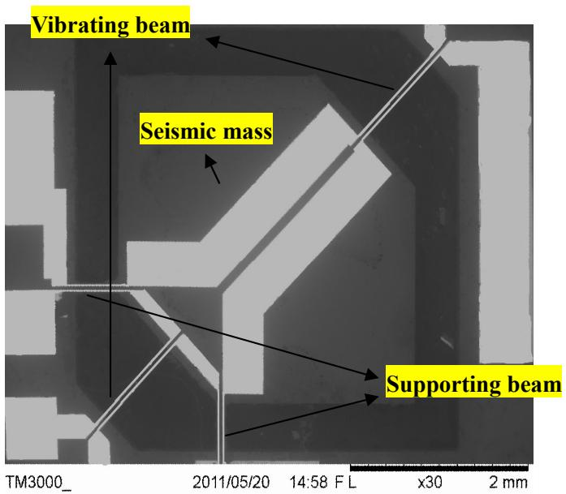
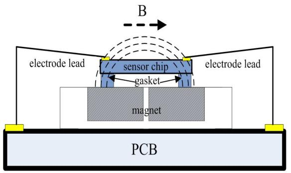
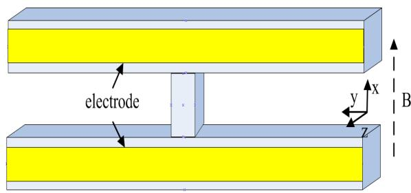
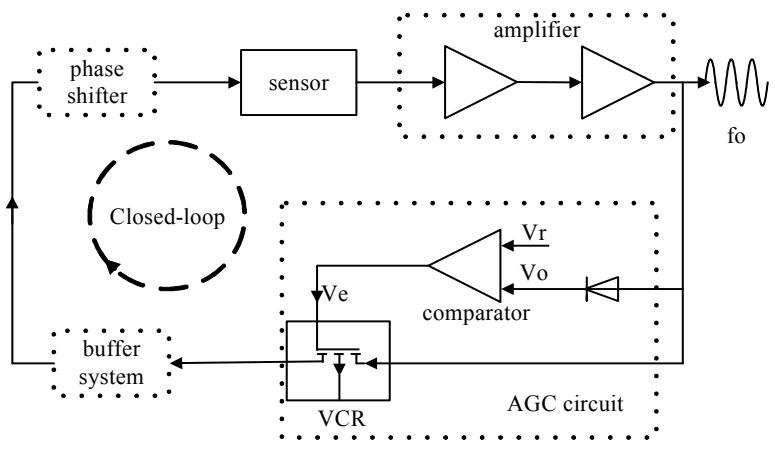
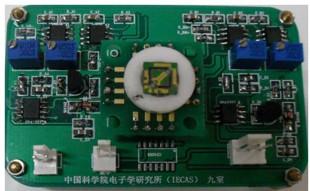
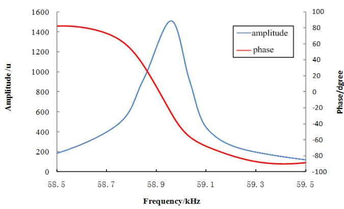
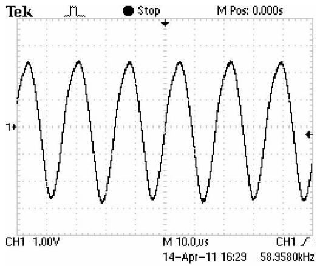

# Closed-loop Control of a SOI-MEMS Resonant Accelerometer with Electromagnetic Excitation

Yanlong Shang $^{1, a}$ , Junbo Wang $^{1, b}$ , Deyong Chen $^{1, c}$

Qiang Shi $^{1,d}$ and Guangbei Li $^{1,e}$

$^{1}$ State Key Laboratory of Transducer Technology, Institute of Electronics, Chinese Academy of Sciences, No. 19 Beisihuanxi Road, Beijing, China. 100190

$^{a}$ Shangyanlong09@mails.gucas.ac.cn $^{b}$ jbwang@mail.ie.ac.cn $^{c}$ dychen@mail.ie.ac.cn $^{d}$ Shq_victory@163.com $^{e}$ Liguangbei09@mails.gucas.ac.cn

Keywords: Closed-loop control; SOI-MEMS; Resonant accelerometer; Electromagnetic excitation

Abstract. A closed-loop control system designed for a SOI-MEMS resonant accelerometer is proposed in this paper. The sensor chip was developed by silicon-direct-bonding SOI wafer $(10 + 2 + 290\mathrm{um})$ with MEMS fabrication technology. Z-axis acceleration is differentially detected by using two H-style vibrating beams through a frequency shift caused by the inertial force acting as bending stress loading. The electromagnetically excitation and detection is adopted to make the closed-loop control of the sensor easier. The whole closed-loop control system designed for the accelerometer mainly consists of amplifier, automatic gain control (AGC) circuit, buffer and phase shifter. Testing results show that the accelerometer with the closed-loop system can work stable at the frequency of $58.958\mathrm{kHz}$ when $1\mathrm{g}$ z-axis acceleration is applied which is consistent with the open-loop testing.

# Introduction

After years of rapid development, Micro-Electro-Mechanical Systems (MEMS) represent the emerging technology for the production of low-cost inertial sensors. Resonant sensing technique has many unique advantages such as highly sensitive, potential for large dynamic range, good linearity, low noise and potentially low power. The detection principle is based on frequency change which is induced by rigidity changes in the resonator [1]. In recent years, increasing attention has been paid for silicon-based micro-machined resonant sensors for high-precision measurement applications due to their high sensitivity, frequency output, and large dynamic range [2-7].

In the present paper, a novel structure of micro-machined resonant accelerometer chip with electromagnetic excitation based on simple SOI (silicon-on-insulator)-MEMS technology is proposed. Package for the sensor and a closed-loop control system are mainly introduced. Operation of the accelerometer in the closed-loop circuit with an automatic gain control circuit was successfully verified in the detection experiment.

# Principle of the Sensor

The structure of the accelerometer with amplifying mechanism and differential detection is fabricated by SOI-MEMS technology (see Fig. 1). In the middle of the sensor, a big seismic mass is supported by two supporting beams and two H-style vibrating beams, all the beams are double-clamped to the seismic mass and the anchor. The seismic mass and the supporting beams

formed a micro-cantilever, the seismic mass and the anchor formed a micro leverage force amplifying mechanism to improve the transformation efficiency between z-axis acceleration and the resonant frequency shift of the vibrating beams.

  
Fig. 1 SEM view of a SOI-MEMS resonant accelerometer

In our designed, the thicknesses of the vibrating beam, supporting beam and seismic-mass are fabricated as $10\mathrm{um}$ , $30\mathrm{um}$ and $300\mathrm{um}$ respectively. Two arms of the H-style beam are of same length as $1500\mathrm{um}$ and $30\mathrm{um}$ in width. The supporting beam has the size of $800\mathrm{um}$ (in length) $\times$ $100\mathrm{um}$ (in width). The whole sensing area is $6.5\mathrm{mm} \times 6.5\mathrm{mm}$ and the angle between the supporting beam and the vibrating beam is $45^{\circ}$ . Due to the different thickness of supporting beams and vibrating beams, compressive stress will only occur on the vibrating beam which is near the supporting beams while tensile stress on the other one when acceleration along z-direction is applied to the seismic-mass. Two vibrating beams formed the differential structure, which can make the sensor immune to the in-plan acceleration and the environmental factors such as temperature, shock and so on. The sensor adopts the electromagnetically excitation and detection to make the closed-loop control easily.

# Package for the Accelerometer

Package of the resonant accelerometers mainly faces to solve how to reduce the package stress which is difficult but important, because the package stress directly affects the performance of the sensor. Besides, in order to achieve electromagnetically excitation and detection, how to provide a stable external magnetic field at horizontal direction for the H-style resonators is also a key issue.

Fig. 2 shows the schematic diagram of the package. Two bar magnets are fixed in a white ceramic ring to supply the horizontal magnetic field. The ceramic ring is glued to the circuit board using epoxy glue. In order to minimize the impact of the package stress, we added an intermediate gasket between the sensor chip and the magnet, which is called stress isolation gasket. Generally the gasket material is typically silicon itself, for the coefficient of thermal expansion is the same to the silicon substrate. Therefore, the two bonds almost produce no stress when using the adhesive bond the sensor chip and magnet. The thermal stress generated by the bonding interface will be buffering by the isolation gasket. The thermal stress that can be transferred to the sensor chip would be very small.

  
Fig. 2 Schematic diagram of the package

  
Fig. 3 The structure of H-style vibrating beam

# Electromagnetically Excitation and Detection

The sensor uses electromagnetically excitation and detection to drive the vibrating beams into expected resonant mode automatically. Excitation electrode and detection electrode are laid out on the vibrating beams. To avoid current and voltage signals crosstalk occur between two electrodes, the vibrating beam is designed as "H" style in which two single beams are connected by a middle block (see Fig. 3). Two single beams exactly have the same size so that ensure the two beams would vibrate at the same frequency.

When alternating voltage $U$ is applied to the excitation electrode on the resonant beam, the Lorentz force $F$ will be induced:

$$
F = B I l = B \frac {u _ {0} \cos \omega t}{R} l \tag {1}
$$

Where, $B$ is determined by the applied magnetic field, $R$ is the resistance of the electrodes.

The direction of Lorentz force $F$ varies along with the alternating voltage. So the excitation beam is equivalently encountered a distributed load $q$ :

$$
q = \frac {F}{l} = B \frac {U _ {0} \cos \omega t}{R} \tag {2}
$$

According to the elastic theory, the deflection curve equation of the resonant beam under distributed load can be expressed by:

$$
v (x) = - \frac {B x u _ {0} \cos \omega t}{2 4 E I R} \left(l ^ {3} - 2 l x ^ {2} + x ^ {3}\right) \tag {3}
$$

Where, $E$ is the Young's Models, $I$ is rigidity which determined by the structural parameters of the vibrating beams. At the same time, the induced voltage $u$ on the detection electrode of the vibrating beams will occur. It can be expressed by:

$$
u = \frac {d \Phi}{d t} = \frac {B ^ {2} l ^ {5} u _ {0} \omega}{1 2 0 E I R} \cdot \sin \omega t \tag {4}
$$

Where, $\Phi = BS$ , $S = \int_0^l\nu (x)dx$ . Compared with the excitation voltage $U$ , the induced voltage $u$ has the same frequency with the excitation voltage $U$ but there is $90^{\circ}$ phase shift between two signals.

# Closed-loop Circuit System

The closed-loop control system mainly consists of two amplifiers, automatic gain control (AGC) circuit, buffer system and a phase shifter as shown in Fig. 4. The signal transferred from the sensor is firstly amplified by two-class amplifiers and then divided into three lines, the output frequency $\mathbf{f}_0$ ,

the detection signal of the AGC circuit and of the voltage-controlled resistor (VCR) which is part of the AGC. After regulated by the AGC, the frequency signal transfers through the buffer system back to the sensor so that the accelerometer can achieve self-control and excited. A phase shifter is used to adjust the sensor to work at the expected vibrating modal.

  
Fig. 4 Overall block diagram of the closed-loop circuit

  
Fig. 5 Photograph of the sensor (in the middle) with control circuit

As the core of the whole control system, the AGC mainly consists of an error amplifier which is based on voltage-controlled resistor (VCR). After traveling across the amplifier, the signal from the sensor then changes into DC voltage $V_{o}$ through a detector. A reference voltage $V_{r}$ is pre-set to compare with $V_{o}$ using a comparator and then a error voltage $V_{e}$ is obtained, which is used as control voltage to regulate the output of the VCR. Therefore, $V_{o}$ can be regulated basic equal to $V_{r}$ . By regulating the $V_{r}$ , the resonator's output can be maintained at the appropriate range. It is very helpful to avoid the resonator into the non-linear state and ensure the sensor work stable. Fig. 5 shows the circuit board we used in the closed-loop detection experiment.

# Testing Results

The open-loop tests for the sensor were carried out in air through Dynamic Signal Analyzer (HP4195A, HP Co. USA), which are shown in Fig.6. The excitation single is $50\mathrm{mV}$ , the natural frequency of the vibrating beam is $58.951\mathrm{kHz}$ and the amplitude is about $1.6\mathrm{m}$ when $1\mathrm{g}$ z-axis acceleration applied. The phase changed from about $+90^{\circ}$ to $-90^{\circ}$ through a complete wave, which was consistent with the theoretical analysis before.

  
Fig. 6. Natural frequency and phase change in the Open-loop tests

  
Fig. 7. The closed-loop wave of the sensor

In the closed-loop detection experiment, the accelerometer could achieve at a stable frequency of $58.958\mathrm{kHz}$ with the control-loop circuit, the test wave was shown in Fig.7, which was almost same with the open-loop testing results. The operation of the accelerometer in the closed-loop circuit designed was successfully verified.

# Summery

A simple in principle but effective closed-loop control system for a SOI-MEMS resonant accelerometer is proposed, with which the accelerometer can work stable at the expected modal and achieve self-control and excited. A novel package method for the accelerometer is used to reduce the package stress and supply a stable external magnetic field. The closed-loop testing shows the accelerometer with the control circuit could work stable at frequency of $58.958\mathrm{kHz}$ when $1\mathrm{g}$ z-axis acceleration is applied which is consistent with the open-loop tests.

# Acknowledgment

This work is sponsored by NSFC (Natural Science Foundation of China) with project No. 60772018.

# Reference

[1] D. Pinto, D. Mercier, C. Kharrat, E. Colinet, V. Nguyen, B. Reig, S. Hentz: Proceedings of the Eurosensors XXIII conference (2009), p.536-539   
[2] Susan X. P. Su, Henry S. Yang, Alice M. Agogino: IEEE SENSORS JOURNAL. Vol. 5 (2005), p. 1214-1223   
[3] Burrer.C, Esteve. J: Sensor. Actuator. A, Vol.46-47(1995), p.185-189   
[4] Deyong Chen, Zhengwei Wu, Lei Liu, Xiaojing Shi and Junbo Wang: Sensors Journal, Vol.9 (2009) p.1330-1338   
[5] V. Claudia Comil, Alberto Corigliano1, Giacomo Langfelder: The 23rd IEEE Conference on Micro Electro Mechanical Systems (2010), p.260-263   
[6] Seshia A.A, Palaninpan M., Roessig T.A., Howe R.T., Gooch R.W., Schimert, T.R. and Motague S: J. Microelectromech. Syst, Vol.23(2002), p.784-793   
[7] T. Roessig, R. Howe, A. Pisano: Transducers'97(1997), p.859-862