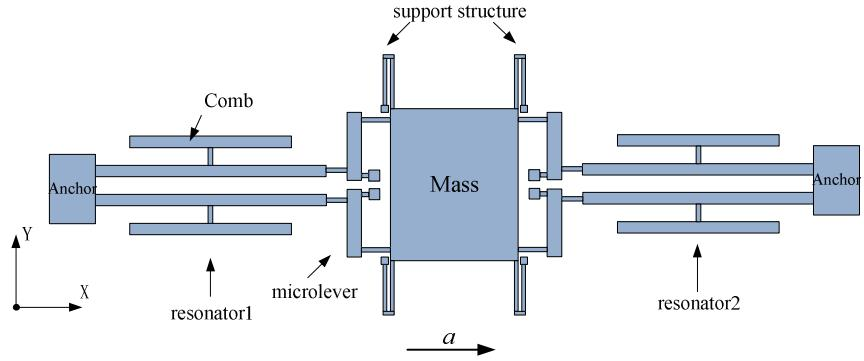
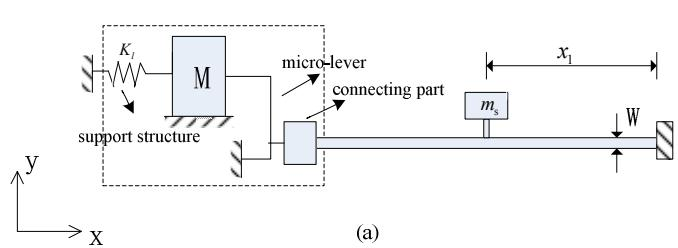
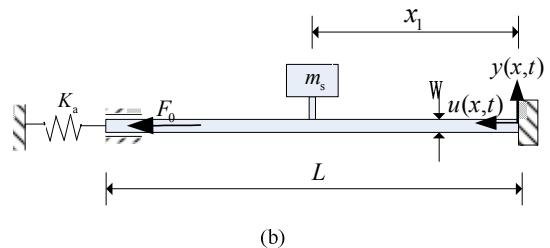
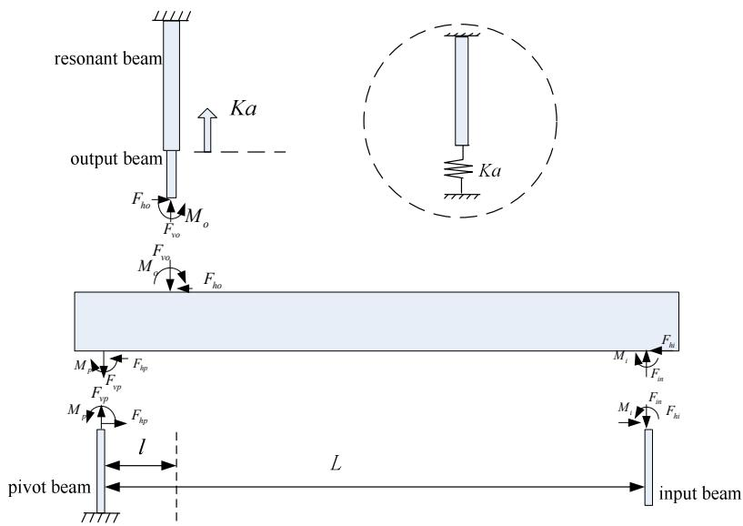
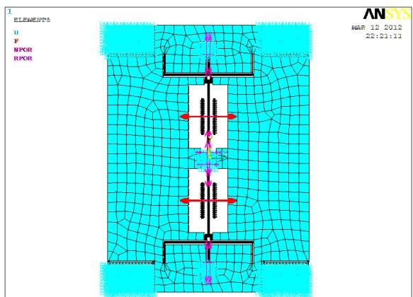
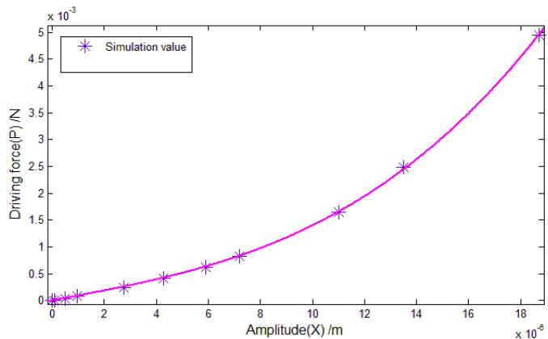
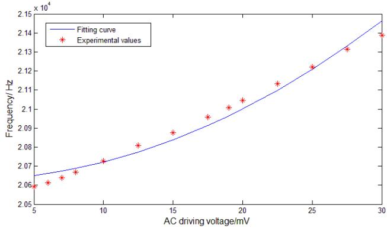
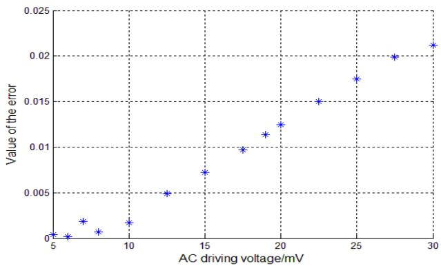

# Modeling of nonlinear stiffness of micro-resonator in silicon resonant accelerometer

JING Zhang $^{1, a}$ , SHAO-DONG Jiang $^{1, b}$ and AN-PING Qiu $^{1, c}$

1 School of Mechanical Engineering, Nanjing University of Science and Technology, Nanjing 210094, China

a zhangjing3701@126.com, bshdjiang_njust@163.com, capqiu@mail.njust.edu.cn

Keywords: Silicon Resonant Accelerometer, nonlinear vibration, nonlinear stiffness

Abstract. Nonlinearities of the resonator in silicon resonant accelerometer (SRA) limit the ultimate short term frequency stability. In SRA, this stability is a measure of the achievable resolution. This paper discusses the nonlinear vibration phenomenon of micro-resonator considering the impact of the entire structure of SRA and builds a model to calculate the micro-resonator nonlinear stiffness $K_{3,eff}$ of the SRA prototype. The dies of SRA were fabricated by Silicon on Insulator (SOI) process. The equivalent model of the micro-resonator is built and the analytical value of the elastic constraint stiffness $K_{a}$ of micro-resonator is derived as $8.91 \times 10^{4} \mathrm{~N/m}$ . It is calculated that $K_{3,eff}$ is equal to $5 \times 10^{11} \mathrm{~N/m}^3$ , and as a comparison, the simulation result is $5.026 \times 10^{11} \mathrm{~N/m}^3$ . The error between them is $0.52\%$ . The nonlinear vibration experiments show that the maximum error between the theoretical and experimental value of resonance frequency is $2.1\%$ . The prediction for the nonlinear stiffness contributes to further research on nonlinear vibration of the resonant beam. The model in this paper could also provide guidance and reference for optimal design of SRA.

# Introduction

The SRA belongs to the generic category of accelerometers known as Vibrating Beam Accelerometers(VBA), which sense acceleration by measuring the change in the resonant frequency of beam oscillators under the inertial loading of a proof mass[1]. Compared with traditional accelerometers, SRA is considered attractively for its wide dynamic range and high sensitivity, as well as for its ease of integration into digital systems. It has been applied in many engineering fields and its output is a frequency shift. SRA obtains acceleration utilizing the force-frequency characteristic of the resonant beam. However, when the vibration amplitude increases, the tuning fork tone is forced to extend. This extension causes additional axial force, and increases the trend of the output frequency. Namely produce nonlinear vibration. Nonlinear effects can lead to super and subharmonic resonances which can also limit the fundamental mode amplitude [2]. Thus, the nonlinear vibration directly affects accuracy and sensitivity of the output frequency.

Nonlinear characterization of micro-resonator was researched in [2]-[4]. Ville expounded that nonlinearities in setting the limit for vibration energy storage are demonstrated in oscillator applications [2]. Roessig proposed that the sources of nonlinearity in micro-resonator are mechanical structure and electrostatic actuation and shows that low-frequency voltage drift in the sustaining amplifier is directly converted into a frequency shift in the oscillator output in [3]. Claudia established the geometric model of resonator and obtained the nonlinear dynamic response of micro-resonators in [4]. Researches mentioned above only consider the nonlinearity caused by micro-resonator itself. In SRA, the stiffness characteristics of micro-lever connected with micro-resonator will also affect the nonlinear vibration characteristics of micro-resonator. Therefore, this paper discusses the nonlinear vibration phenomenon of micro-resonator considering the impact of the entire structure of SRA.

This paper establishes the nonlinear vibration models of the micro-resonator and gives the calculation for the elastic constraint stiffness $K_{a}$ and the nonlinear stiffness $K_{3,eff}$ . The theoretical value of $K_{3,eff}$ is verified by the simulations and the experiments. The models could provide guidance and reference for the SRA structure optimization.

# 2. Nonlinear vibration model of the micro-resonator

# 2.1 Equivalent model of the resonant beam

Fig. 1 is the a schematic representation of the SRA sensor, showing a pair of double-ended tuning forks(DETF) resonators connected to a proof mass via micro-levers. The SRA input axis lies in plane as indicated in Fig.1. Under acceleration, the inertial force of the proof mass is amplified by micro-levers and then loads the two resonators pairs. One resonator is placed in tension whose frequency increases, the other in compression whose frequency decreases. This differential design doubles the sensitivity or scale factor of the accelerometer and furnishes a cancellation of error sources common to both resonators.[1]

  
Fig. 1 SRA schematic

Due to the symmetry of the SRA, $1/4$ of the overall structure is studied (see in Fig. 2(a)). The beam is simplified axially constrained at both ends, with elastic constraints represented by an axial spring of stiffness $K_{a}$ in the x-direction and fixed in the y-direction at one end (see in Fig. 2(b)).

  
Fig. 2 Mechanical model of the micro-resonator

Therefore, the transverse boundary conditions of the resonant beam are

$$
y (0, t) = y (L, t) = 0
$$

$$
\frac {\partial}{\partial x} y (0, t) = \frac {\partial}{\partial x} y (L, t) = 0 \tag {1}
$$

and the axial boundary conditions are

$$
u (0, t) = 0 \tag {2}
$$

$$
u (L, t) = - \frac {E A \varepsilon}{K _ {a}}
$$

The axial force applied in the resonant beam can be expressed according to Eq. 2 [3].

$$
F = F _ {0} + \frac {K _ {a} E A}{K _ {a} L + E A} \int_ {0} ^ {L} \frac {1}{2} \left(\frac {d y}{d x}\right) ^ {2} d x \tag {3}
$$

where $F_{0}$ is the inertial force, $E$ is the Young's modulus, $A$ is the cross-sectional area, $L$ is the entire length of the resonant beam, and $y$ is the bending deflection.

According to Eq. 1, the vibration mode shapes of the resonant beam can be obtained as

$$
\phi (x) = 0. 6 3 \left[ c h \beta x - \cos \beta x - \frac {c h \beta L - \cos \beta L}{s h \beta L - \sin \beta L} \left(s h \beta x - \sin \beta x\right) \right] \tag {4}
$$

where the value of $\beta$ can be determined based on the boundary conditions of the beam.

# 2.2 Energy method analysis of nonlinear vibration

Reference the Hamilton's principle [4] described, the following nonlinear equation of the resonant beam oscillation is obtained by energy method and the Lagrange equations as

$$
M _ {e f f} \ddot {q} + K _ {e f f} q + K _ {3, e f f} q ^ {3} = P \tag {5}
$$

with

$$
M _ {e f f} = \rho A L \int_ {0} ^ {1} \phi^ {2} d \varepsilon + m _ {s} \tag {6}
$$

$$
K _ {e f f} = \frac {E I}{L ^ {3}} \int_ {0} ^ {1} \left(\frac {d ^ {2} \phi}{d \varepsilon^ {2}}\right) ^ {2} d \varepsilon + \frac {F _ {0}}{L} \int_ {0} ^ {1} \left(\frac {d \phi}{d \varepsilon}\right) ^ {2} d \varepsilon
$$

$$
K _ {3, \text {e f f}} = \frac {1}{2} \frac {1}{L ^ {2}} \frac {K _ {a} E A}{K _ {a} L + E A} \left(\int_ {0} ^ {1} \left(\frac {d \phi}{d \varepsilon}\right) ^ {2} d \varepsilon\right) ^ {2}
$$

where $\rho$ is the density of silicon material, $I$ is the inertia moment of the beam cross-section, $\mathrm{m_s}$ is the comb mass, $M_{\mathrm{eff}}$ is the equivalent mass, $K_{\mathrm{eff}}$ is the linear stiffness including the linear elastic flexural stiffness and the generalized geometric stiffness due to the axial load, and $K_{3,\mathrm{eff}}$ is the cubic nonlinear constant (namely the nonlinear stiffness), $P$ is the driving force applied in the comb.

Substituting Eq. 4 into Eq. 6

$$
K _ {\text {e f f}} = 1 9 8. 6 \frac {E I}{L ^ {3}} \mathrm {N} / \mathrm {m} \tag {7}
$$

$$
K _ {3, e f f} = 1 1. 7 6 \frac {1}{L ^ {2}} \frac {K _ {a} E A}{K _ {a} L + E A} \mathrm {N} / \mathrm {m} ^ {3} \tag {8}
$$

According to Eq. 8, The equivalent stiffness $K_{a}$ is the key point of $K_{3,\text{eff}}$ . $K_{a}$ is decided by the micro-lever mechanism of SRA. For double-clamped resonant beam, $K_{a}$ tends to infinity

$$
K _ {3, e f f} = 1 1. 7 6 \frac {E A}{L ^ {3}} \tag {9}
$$

and the nonlinear stiffness is only related to the dimension of the resonant beam.

# 2.3 The model of equivalent stiffness

The schematic of micro-lever of the differential SRA prototype is shown in Fig. 3. In the figure, $l$ is the length between pivot and output, and $L$ is the length between pivot and input of the lever arm. $M_{i}$ , $M_{p}$ , $M_{o}$ respectively represents bending moments at the input, pivot and output. $F_{in}$ , $F_{vp}$ and $F_{vo}$ are the input, pivot and output axial forces. $F_{hi}$ , $F_{ho}$ and $F_{hp}$ are the input, output and pivot shear forces. One can know from material mechanics that the value of $K_{a}$ is equal to the force divided by the displacement at the output beam.

Under loading, suppose the vertical displacement at the output system is $\delta$ , the rotation angle at the lever arm is $\theta$ , the actual displacement at the input beam is $\tau$ , the input stiffness of the lever is $K$ , the force amplification factor is $A$ . Then, the output force $F_{o}$ of the lever is equal to $AK\tau$ and the displacement $x_{o}$ at the output terminal is equal to $(\delta + l\theta)\tau / (\delta + L\theta)$ . So $K_{a}$ could be obtained as

$$
K _ {a} = \frac {F _ {o}}{x _ {o}} = \frac {A K \tau}{\frac {\delta + l \theta}{\delta + L \theta} \tau} = \frac {A K \left(L + \frac {\delta}{\theta}\right)}{l + \frac {\delta}{\theta}} \tag {10}
$$

Ref. [5] gives the formula to the input stiffness $K$ of the micro-lever

$$
K = \frac {F _ {\text {i n}}}{(L \theta + \delta)} = \frac {\left(k _ {v v o} + k _ {v v p}\right) \left(f _ {o} k _ {\theta m o} + f _ {p} k _ {\theta m p} + f _ {i} k _ {\theta m i}\right) + k _ {v v o} k _ {v v p} l ^ {2}}{\left(f _ {o} k _ {\theta m o} + f _ {p} k _ {\theta m p} + f _ {i} k _ {\theta m i}\right) + k _ {v v o} (L - l) ^ {2} + k _ {v v p} L ^ {2}} \tag {11}
$$

where $k_{vvp}$ , $k_{vvo}$ respectively represents the axial spring constants of the pivot beam and the resonant beam in series with the output beam, when applied by a vertical force. $k_{\theta mi}$ , $k_{\theta mo}$ , $k_{\theta mp}$ respectively represents rotational spring constant of the output system and the pivot, when loaded with a bending moment. $f_o$ , $f_p$ , $f_i$ are the correct factors for the apparent rotational spring constants of the output beam, the pivot beam and the input beam respectively.

  
Fig. 3 Free-body diagram of microlever and the resonant beam under loading

Note that $K_{a}$ is the micro-lever stiffness, the resonant beam should not be considered when solve the force amplification $A$ . Analyze the micro-lever separately, according to the force balance and moment balance, we can get

$$
F _ {i n} = F _ {v o} + F _ {v p} \tag {12}
$$

$$
F _ {i n} L = F _ {v o} l + M _ {o} + M _ {p} + M _ {i} \tag {13}
$$

$$
F _ {h o} + F _ {h p} + F _ {h i} = 0 \tag {14}
$$

In the balance equations above, $F_{vp} = k_{vvp}\delta$ , $F_{vo} = k_{vvo}'(l\theta + \delta)$ , $M_o = k_{\theta m o}f_o\theta$ , $M_p = k_{\theta m p}f_p\theta$ , $M_i = k_{\theta m i}f_i\theta$ where $k_{vvo}'$ is the axial spring constant of the output beam.

The amplification factor of the micro-lever $A$ , $\delta$ and $\theta$ can be solved by Eq. 12-14.

$$
A = \frac {F _ {\mathrm {v o}}}{F _ {\mathrm {i n}}} = \frac {k _ {\mathrm {v v o}} ^ {\prime} (l \theta + \delta)}{F _ {\mathrm {i n}}} \tag {15}
$$

$$
\theta = \frac {L - \frac {k _ {v v o} ^ {\prime}}{k _ {v v o} ^ {\prime} + k _ {v p}} l}{k _ {v v o} ^ {\prime} l ^ {2} + k _ {\theta m o} f _ {o} + k _ {\theta m p} f _ {p} + k _ {\theta m i} f _ {i} - \frac {k _ {v v o} ^ {\prime 2} l ^ {2}}{k _ {v v o} ^ {\prime} + k _ {v p}}} F _ {i n} \tag {16}
$$

$$
\delta = \frac {F _ {i n} - k _ {v v o} ^ {\prime} l \theta}{k _ {v v o} ^ {\prime} + k _ {v v p}} \tag {17}
$$

where $k_{\nu \nu p} = \frac{Ebh_p}{l_p}, \quad k_{\nu \nu o}^{\prime} = \frac{Ebh_o}{l_o}, \quad k_{\theta m o} = \frac{Ebh_o^3}{12l_o}, \quad k_{\theta m p} = \frac{Ebh_p^3}{12l_p}, \quad k_{\theta m i} = \frac{Ebh_i^3}{12l_i},$ while $k_{\nu \nu O}$ is expressed as $\frac{Eb}{\frac{l_o}{h_o} + \frac{l_f}{h_f}}$ in

Eq. 11. $l, h, b$ is length, width, thickness of each beam with subscript $i$ , $o, f, p$ representing the input beam, the output beam, the resonant beam, and the pivot beam respectively.

Table.1 Designed parameter of microlever   

<table><tr><td colspan="2"></td><td>L [μm]</td><td>h [μm]</td><td>b [μm]</td></tr><tr><td colspan="2">Input arm</td><td>644</td><td>30</td><td>60</td></tr><tr><td colspan="2">Output arm</td><td>19</td><td>30</td><td>60</td></tr><tr><td colspan="2">Input beam</td><td>300</td><td>6</td><td>60</td></tr><tr><td colspan="2">Pivot beam</td><td>270</td><td>6</td><td>60</td></tr><tr><td rowspan="2">Output system</td><td>Output beam</td><td>60</td><td>4</td><td>60</td></tr><tr><td>Resonant beam</td><td>1000</td><td>8</td><td>60</td></tr></table>

Substituting the parameters of the microlever (see Table 1) into Eq. 11 and Eq. 15-17, the value of $K$ , $A$ and $\delta/\theta$ can be obtained as $66.74\mathrm{N / m}$ , 30.26 and $-4.5\times 10^{-6}\mathrm{m}$ respectively. $K_{a}$ is $8.91\times 10^{4}\mathrm{N / m}$ . Then we can get the theoretical value of $K_{3,\text{eff}}$ is $5\times 10^{11}\mathrm{N / m^3}$ .

# 3. Simulation and experimental verification

# 3.1 Simulation for nonlinear stiffness of the resonant beam

Under no acceleration, Eq. 5 can be rewritten as

$$
P = K _ {\text {e f f}} X _ {m} + K _ {3, \text {e f f}} X _ {m} ^ {3} \tag {18}
$$

The nonlinear static analysis for nonlinear stiffness of the resonant beam subjected to various driving force is simulated by FEA software (see Fig. 4). By fitting the 11 sets of the amplitude of resonant beam(see Fig. 5) according to Eq. 18, we get the fitting value of $K_{3,\text{eff}}$ is equal to $5.026 \times 10^{11}$ N/m $^3$ . The error of the analytical value compared to the simulation result is $0.52\%$ .

  
Fig. 4 Simulation for the SRA

  
Fig. 5 The fitting curve of the amplitude and driving force

# 3.2 Nonlinear vibration experiments of SRA

For small AC driving voltage $|\nu_{m}|\sin \omega t$ , the driving force applied in the comb of the resonator can be expressed as [6]

$$
P _ {v} = 2 n \varepsilon \frac {h}{d} V _ {P} | v _ {m} | \sin \omega t \tag {19}
$$

where $n$ is the number of the driving comb gap, $\varepsilon$ is the vacuum permittivity, $h$ is the comb thickness, $d$ is the distance between the comb gaps, $V_{p}$ is the DC bias voltage.

The relation between the vibration amplitude of the resonator and the driving force is

$$
X _ {m} = \frac {Q \left| P _ {v} \right|}{K _ {\text {e f f}}} \tag {20}
$$

where $Q$ is the parameter associated with the damping.

Substituting Eq. 19 into Eq. 20, the vibration amplitude could also be expressed as

$$
X _ {m} = Q \frac {2 n \varepsilon \frac {h}{d} V _ {P} | v _ {m} |}{K _ {\text {e f f}}} \tag {21}
$$

Substituting Eq. 21 into the relation between the frequency and the vibration amplitude of the resonant beam, the resonant frequency can be expressed as

$$
\omega = \omega_ {0} \left(1 + \frac {3}{8} \frac {K _ {3 , e f f}}{K _ {e f f}} X _ {m} ^ {2}\right) = \omega_ {0} \left[ 1 + \frac {3}{2} \frac {K _ {3 , e f f}}{K _ {e f f} ^ {3}} \left(Q n \varepsilon \frac {h}{d} V _ {P}\right) ^ {2} | v _ {m} | ^ {2} \right] \tag {22}
$$

where $\omega_0$ is the natural frequency of the resonant beam.

Q value of the prototype A11008 is about 138343. It is also known that $V_{p} = 10\mathrm{V}$ , $n = 24$ , $h = 60\mu \mathrm{m}$ , $d = 5\mu \mathrm{m}$ , $\varepsilon = 8.854\times 10^{-12}$ . Thus, substituting the value of $K_{3,\text{eff}}$ into Eq. 22

$$
\omega = \omega_ {0} \left(1 + 1 4. 8 \left| v _ {m} \right| ^ {2}\right) \tag {23}
$$

The natural frequency of the prototype A11008 is about $2.066 \times 10^{4} \mathrm{~Hz}$ . Adjust the AC driving voltage of the open loop using a signal generator, and record the output frequency of the resonator. Fitting curve between the voltage and the frequency is shown in Fig. 6. Within normal operate range of the resonator, error between the theoretical and the experimental value of resonance frequency is shown in Fig. 7. The maximum error is about $2.1\%$ .

  
Fig. 6 Driving voltage and the frequency

  
Fig. 7 The error between theoretical and experimental results

# 4. Summary

The die of SRA is fabricated by SOI process, and the equivalent models of the micro-resonator are built. The nonlinear stiffness $K_{3,\text{eff}}$ of the micro resonator is obtained and the elastic constraint stiffness $K_{a}$ of micro-resonator is derived. The nonlinear stiffness $K_{3,\text{eff}}$ is equal to $5 \times 10^{11} \mathrm{~N/m}^3$ . By comparing to the analytical value, the simulation value of $K_{3,\text{eff}}$ is $5.026 \times 10^{11} \mathrm{~N/m}^3$ and the error is $0.52\%$ . The nonlinear vibration experiments of SRA show that the maximum error between the theoretical and experimental value of resonance frequency is $2.1\%$ . This implies the feasibility of the prediction for $K_{3,\text{eff}}$ . The derivation this paper presented is useful for further research on nonlinear vibration of resonant beam and optimal design of SRA.

# References

[1] The Silicon Oscillating Accelerometer: A High-Performance MEMS Accelerometer for Precision Navigation and Strategic Guidance Applications   
[2] V. Kaajakari, T. Mattila, A. Oja, and H.Seppa, Nonlinear limits for single-crystal silicon microresonators, J. MEMS. 5,13 (2004) 715-724.   
[3] T. A. Roessig, Integrated MEMS Tuning Fork Oscillators for Sensor Applications, D. Ph.D. dissertation, Univ. California, Berkeley, CA, 1998.   
[4] C. Comi, On geometrical effects in micro-resonators, J. Latin American Journal of Solids and Structures. 6 (2009) 73-87.   
[5] S. Ran, J. S. Dong, Q. A. Ping, S. Yan, Application of microlever to micromechanical silicon resonant accelerometers, J. Optics and Precision Engineering. 4,19 (2011) 805-811.   
[6] Q. A. Ping, S. Yan, Z. X. Hua, S. Qin, Bulk-Micromachined Silicon Resonant Accelerometer, C. 2009 IEEE International conference on information and automation, Zhuhai, China, June. 22-25 (2009) 1289-1292.