PAPER

# Phase noise modelling of MEMS resonant accelerometer with non-AGC-driven circuit

To cite this article: Dong Li et al 2022 J. Micromech. Microeng. 32 064001

View the article online for updates and enhancements.

# You may also like

- Galaxy Properties at the Faint End of the Hi Mass Function

Kristen B. W. McQuinn, Anjana K.

Telidevara, Jackson Fuson et al.

- Fitting the Shadows: Star Formation

Scaling Relations in the Low Surface Brightness Regime

Hannah S. Christie, Pauline Barmby and

Jason E. Young

- Making the US national forest inventory spatially contiguous and temporally consistent

Yifan Yu, Sassan Saatchi, Grant M Domke et al.

# Phase noise modelling of MEMS resonant accelerometer with non-AGC-driven circuit

Dong Li, Mengxia Liu, QianCheng Zhao and Jian Cui*

National Key Laboratory of Science and Technology on Micro/Nano Fabrication, School of Integrated Circuits, Peking University, Beijing 100871, People's Republic of China

E-mail: eric.cuijian@pku.edu.cn

Received 6 December 2021, revised 24 March 2022

Accepted for publication 30 March 2022

Published 13 April 2022

  
CrossMark

# Abstract

Phase noise is an essential performance indicator for microelectromechanical system (MEMS) resonant accelerometers. The optimal resolution achievable is limited by the close-to-the carrier phase noise resulting from the modulation of noise sources by the mechanical resonator and driving circuit. Compared with the frequently used automatic gain control (AGC) circuit, the non-AGC scheme is more concise and can avoid the additional frequency flicker noise and $1/f^5$ phase noise introduced by the AGC module. Although the mechanisms of these two kinds of control loops are well-known by the communities, the phase noise modelling study on the non-AGC loop, especially compared with that of AGC loop is insufficient. This paper established a phase noise model for the AGC and non-AGC closed loop circuit of MEMS resonant accelerometer. The model includes the effects of resonator thermal noise, random loading noise of proof masses, front-circuit noise, comparator noise, AGC noise and amplitude stiffness coupling on the output noise spectrum of the resonant accelerometer. This paper carries the noise analysis through a behaviour level simulation with Simulink. The measured frequency power spectral density and Allan variance are very close to the theoretical predictions, which verifies the effectiveness of the phase noise model. The test results show that the white noise and the bias instability of the silicon resonant accelerometer are $837\mathrm{ng}(\sqrt{\mathrm{Hz}})^{-1}$ and $140\mathrm{ng}$ respectively, which are in good agreement with the model prediction results.

Keywords: MEMS, resonant accelerometer, non-AGC-driven, phase noise modelling

(Some figures may appear in colour only in the online journal)

# 1. Introduction

Microelectromechanical system (MEMS) resonant accelerometer [1-8] is widely used in ballistic missile guidance, unmanned air vehicle (UAV) navigation, autopilot etc due to its high precision, wide dynamic range and quasi-digital output characteristics. Phase noise is an essential performance indicator for MEMS resonant accelerometers. The optimal resolution achievable is limited by the close-to-the-carrier phase noise resulting from the modulation of noise sources by the mechanical resonator and driving circuit. Automatic

gain control (AGC) and non-AGC schemes are two common methods to drive MEMS resonant accelerometers. AGC driving can keep the vibrating amplitude of the resonator constant [1, 2, 9, 10] even if the quality factor of the device changes due to the temperature variations. However, AGC control requires at least five circuit modules such as a preamplifier, a full wave rectifier, a low-pass filter, a proportional-integral (PI) controller and a modulator, which make the circuit complex and increase the power consumption. Moreover, it inevitably introduces additional flicker noise by modulation [11]. Compared with the AGC loop, the non-AGC scheme is highly concise in that it only needs a preamplifier and a comparator to achieve the closed-loop driving [4]. It can also avoid the

additional frequency flicker noise and $1/f^5$ phase noise introduced by the AGC module. Noting that the AGC and non-AGC schemes mentioned above refer to the self-oscillating loop but not include a phase locked loop. Although AGC plus phase locked loop (PLL) control is currently a standard configuration for MEMS gyroscopes [12], it seems to be more complex and expensive in the design. In addition, thanks to the high vacuum packaging technology [13], the structural damping has become the main factor of the energy loss mechanism of a micro resonators. The thermal induced quality factor variation of a ultra-high vacuum-sealed resonator is less than that of the low quality factor devices [14]. Therefore, selecting an appropriate driving voltage can achieve the normal operation of the resonant accelerometer without AGC control under varied temperature conditions. The non-AGC has been successfully adopted in the resonant accelerometer development [4, 9, 15–17]. Although the mechanisms of these two control loops are well-known by the communities, there is no previous work on the phase noise model for a non-AGC resonant accelerometer to the authors' knowledge. In this paper, system level phase noise models are established for the non-AGC and AGC driving circuits of the resonant accelerometer. The simulation results indicate that noise performance of the non-AGC driving is superior to the that of the AGC driving. The models show the contribution of each noise source and can predict the noise performance accurately, which enables a quantitative noise analysis and optimization for the non-AGC scheme.

# 2. Establishment of system level phase noise model for non-AGC scheme

The working principle of a resonant accelerometer driven by non-AGC scheme is shown in figure 1. The variation capacitance signal of the accelerometer is transformed into voltage signal by a C/V converter. The amplified voltage signal is compensated by a phase shifter to meet the phase condition of oscillation. Then, the signal is converted into a square wave signal with a fixed amplitude through a comparator. The counting method is used to measure the frequency of the square wave signal. At the same time, the differential square wave signal is used to drive the resonant accelerometer to realize closed-loop control.

Figure 2 shows the block diagram of the non-AGC scheme. $G(s), H_{\mathrm{amp}}(s), H_{\mathrm{ps}}(s)$ and $H_{\mathrm{cmp}}(s)$ represent the transfer functions of the accelerometer, the preamplifier, the phase shifter and the comparator in the loop respectively. $K_{\mathrm{div}}$ represents the coefficient of amplitude reduction. $V_{\mathrm{drv}}, I, V_{\mathrm{amp}}$ and $V_{\mathrm{ps}}$ are the driving voltage, the output current signal, the preamplifier output voltage and the phase shifter output voltage. $\overline{V_{\mathrm{n\_mach}}^2}$ , $\overline{V_{\mathrm{n\_amp}}^2}, \overline{V_{\mathrm{n\_ps}}^2}$ and $\overline{V_{\mathrm{n\_cmp}}^2}$ are the equivalent voltage noise of mechanical noise, the preamplifier, the phase shifter and the comparator respectively.

According to the Leeson model [18], the influences of the noise introduced by different modules on the phase noise of the output signal can be calculated separately. Considering the preamplifier alone, the noise transfer function from

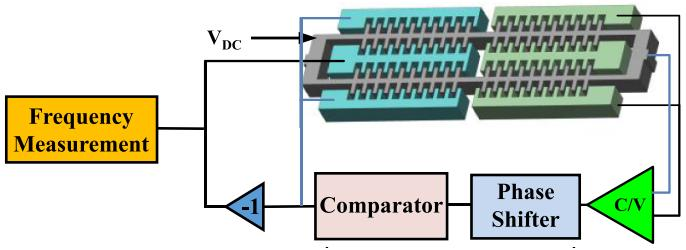  
Figure 1. Working principle of resonant accelerometer driven by non-AGC scheme.

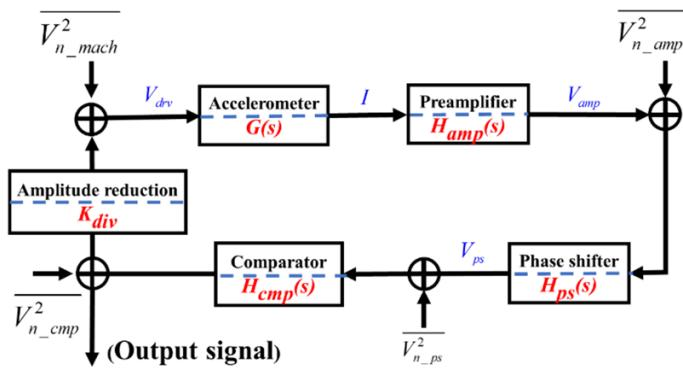  
Figure 2. Block diagram of the non-AGC loop of the resonant accelerometer.

the amplifier noise to the output in the resonant loop can be obtained as,

$$
N _ {\text {n o u t} \_ \text {a m p}} (s) = \left| \frac {H _ {\mathrm {p s}} (s) H _ {\mathrm {c m p}} (s)}{1 - G (s) H _ {\mathrm {a m p}} (s) H _ {\mathrm {p s}} (s) H _ {\mathrm {c m p}} (s) K _ {\mathrm {d i v}}} \right| ^ {2} \overline {{V _ {\mathrm {n} \_ \text {a m p}} ^ {2}}}. \tag {1}
$$

The resonator $G(s)$ can be viewed as a second-order mass-spring-damping system

$$
G (s) = \frac {K _ {\mathrm {V F}} K _ {\mathrm {X I}}}{m} \frac {s}{s ^ {2} + (\omega_ {0} / Q) s + \omega_ {0} ^ {2}}. \tag {2}
$$

where $m$ , $\omega_0$ , $Q$ are the mass, resonant frequency and quality factor of one double-ended tuning forks (DETF). $K_{\mathrm{VF}}$ and $K_{\mathrm{XI}}$ are the gain from the driving voltage to the force and from the displacement to the current, respectively. Substituting $G(s)$ to the noise transfer function above and noting that the loop gain is 1 when the loop is in resonance, we can get,

$$
N _ {\text {n o u t} \text {a m p}} (\omega) = \left| H _ {\mathrm {p s}} (j \omega) H _ {\mathrm {c m p}} (j \omega) \right| ^ {2} \left| 1 + \frac {\left(j \frac {\omega_ {0} \omega}{Q}\right)}{\omega_ {0} ^ {2} - \omega^ {2}} \right| ^ {2} \overline {{V _ {\mathrm {n} \text {a m p}} ^ {2}}}. \tag {3}
$$

Let $\omega = \Delta \omega +\omega_0$ , then the phase noise can be written as follows,

$$
\begin{array}{l} S _ {\text {n o u t} \_ \text {a m p}} (\Delta \omega) = \frac {\left| H _ {\mathrm {p s}} (j \omega_ {0}) H _ {\mathrm {c m p}} (j \omega_ {0}) \right| ^ {2}}{C} \\ \left[ 1 + \left(\frac {\omega_ {0}}{2 Q \Delta \omega}\right) ^ {2} \right] \overline {{V _ {\mathrm {n} _ {-} \mathrm {a m p}} ^ {2}}} \tag {4} \\ \end{array}
$$

Table 1. Expressions of phase noise coefficients for non-AGC driving scheme.   

<table><tr><td>Coefficient</td><td>Expression</td><td>Source</td></tr><tr><td>b0</td><td>|Hps(jω0)Hcmp(jω0)|2C/Vn_amp</td><td>Amplifier</td></tr><tr><td rowspan="2">b-2</td><td>144k32ω02(QnεhVAC)d44VDC2|Hps(jω0)|2(Kcmp)2√n_amp2CKdiv2</td><td rowspan="2">Resonator, Amplifier, Comparator, Proof mass, A-S effect</td></tr><tr><td>+ (4kTReq/K2div + VN_cmp + |Hps(jω0)|2(Kcmp)2VN_cmp)f024Q2C + amSF</td></tr><tr><td>b-3</td><td>144k32ω02(QnεhVAC)d44VDC2|Hps(jω0)|2(Kcmp)2fc1 VN_amp2CKdiv2</td><td>A-S effect</td></tr></table>

where, $C$ is the carrier power, $\omega_0$ is the resonant frequency of the resonator and $\Delta \omega$ is the offset from the resonant frequency. $H_{\mathrm{ps}}(j\omega_0)$ and $H_{\mathrm{cmp}}(j\omega_0)$ represent the transfer functions of the phase shifter and the comparator at resonant frequency respectively. Similarly, the effect of resonator thermal noise on the phase noise of the output signal can be derived as (5)

$$
S _ {\text {n o u t} \text {m a c h}} (\Delta \omega) = \frac {\overline {{V _ {\mathrm {n} \text {m a c h}} ^ {2}}} ^ {2}}{C K _ {\mathrm {d i v}} ^ {2}} \left(\frac {\omega_ {0}}{2 Q \Delta \omega}\right) ^ {2}. \tag {5}
$$

The noise introduced by the phase shifter can be ignored since the first-stage amplifier has the largest noise contribution in the signal chain. The noise of the comparator can be approximated as linear transmission [19], and its influence on the phase noise of the output signal is written as (6)

$$
S _ {\text {n o u t} \_ \text {c m p}} (s) = \frac {\overline {{V _ {\mathrm {n} \_ \text {c m p}} ^ {2}}} ^ {2}}{C} \left(\frac {\omega_ {0}}{2 Q \Delta \omega}\right) ^ {2}. \tag {6}
$$

Due to the coupling effect between the amplitude and stiffness (A-S effect) of the resonator [20], the amplitude noise of the resonator also affects the phase noise in that the resonant frequency of the DETF that operating in the nonlinear region is determined by the vibration amplitude. Based on the nonlinear phase noise analysis [11], the amplitude stiffness coupling effect on the phase noise of the output signal can be obtained as (7)

$$
\begin{array}{l} S _ {\varphi_ {\text {n o u t} \mathrm {A} - \mathrm {S}}} (f) \\ = \frac {1 4 4 k _ {3} ^ {2}}{k _ {1} ^ {6}} \frac {\omega_ {0} ^ {2} (Q n \varepsilon h V _ {\mathrm {A C}})}{d ^ {4}} ^ {4} V _ {\mathrm {D C}} ^ {2} \frac {\left| H _ {\mathrm {p s}} (j \omega_ {0}) \right| ^ {2} \left(K _ {\mathrm {c m p}}\right) ^ {2} \overline {{V _ {\mathrm {n} _ {\mathrm {a m p}}} ^ {2}}}}{C K _ {\mathrm {d i v}} ^ {2} f ^ {2}} \\ + \frac {1 4 4 k _ {3} ^ {2}}{k _ {1} ^ {6}} \frac {\omega_ {0} ^ {2} (Q n \varepsilon h V _ {\mathrm {A C}}) ^ {4}}{d ^ {4}} V _ {\mathrm {D C}} ^ {2} \frac {\left| H _ {\mathrm {p s}} (j \omega_ {0}) \right| ^ {2} \left(K _ {\mathrm {c m p}}\right) ^ {2} f _ {\mathrm {c l}} \overline {{V _ {\mathrm {n} - \mathrm {a m p}} ^ {2}}} ^ {2}}{C K _ {\mathrm {d i v}} ^ {2} f ^ {3}}. \tag {7} \\ \end{array}
$$

where, $k_{l}$ is the equivalent stiffness of the resonator. $k_{3}$ is the third-order nonlinear stiffness coefficient. $n$ , $h$ , $d$ are the number of combs fingers, combs height and gap. $\varepsilon$ is the vacuum dielectric constant. $V_{\mathrm{AC}}$ is the AC voltage applied to the fixed combs. $V_{\mathrm{DC}}$ is the DC bias voltage applied to the proof mass of the resonator. $f_{c1}$ is the corner

frequency of white noise and flicker noise introduced by the preamplifier. $K_{\mathrm{cmp}}$ is the noise transfer coefficient of the comparator.

Considering the four kinds of noise above and the random loading noise of the proof mass $a_{m}$ , the phase noise spectral density of the output signal can be expressed by equation (8)

$$
S _ {\varphi_ {-} \text {n o u t}} (f) = b _ {0} + b _ {- 2} \frac {1}{f ^ {2}} + b _ {- 3} \frac {1}{f ^ {3}}. \tag {8}
$$

where, $b_{0}, b_{-2}$ and $b_{-3}$ represent the white phase noise coefficient, white frequency noise coefficient $(1/f^{2})$ phase noise coefficient) and flicker frequency noise coefficient $(1/f^{3})$ phase noise coefficient) respectively. The expressions and sources of the coefficients are listed in table 1. $S_{F}$ is the scale factor.

# 3. Establishment of system level phase noise model for AGC scheme

An AGC module is utilized to stabilize the vibration amplitude of the resonant accelerometer in a closed loop when the external temperature changes. It can prevent the resonator from entering the nonlinear region or ceasing vibrating. However, compared to the comparator driving scheme, the AGC closed-loop control scheme introduces additional flicker frequency noise, which deteriorates the bias instability of the accelerometer. The simplified model of the AGC controlled resonant accelerometer loop is shown in figure 3.

$H_{\mathrm{agc}}(s)$ represent the transfer function of the AGC module. The symbols of the equivalent noise of mechanical noise, the preamplifier, the phase shifter and the comparator are the same as those of the non-AGC control scheme. The noise analysis of the AGC loop is almost the same as the non-AGC loop except for adding an AGC module which usually consists of a full-wave rectifier, a low-pass filter and a PI controller to adjust the high level of the comparator output to maintain the vibration displacement of the resonator constant. Here we just give the complex expression of the overall phase noise for the brevity according to the AGC scheme as shown in figure 3. The lengthy deduction of the phase noise of the AGC loop can be seen in [11]. The phase noise of the AGC module at the output is obtained as follows

$$
\begin{array}{l} S _ {\mathrm {n} \_ \text {o u t} \_ \mathrm {A G C}} (\triangle \omega) \\ = \frac {\left| H _ {\mathrm {c m p}} \left(j \omega_ {0}\right) \right| ^ {2}}{\mathbf {C}} \left[ 1 + \left(\frac {\omega_ {0}}{2 \mathrm {Q} \Delta \omega}\right) ^ {2} \right] \frac {I ^ {2} f _ {c 3} \overline {{V _ {\text {n a g c w h i t e}} ^ {2}}} ^ {2}}{f ^ {3}} \cdot | V _ {p s} | ^ {2}. \tag {9} \\ \end{array}
$$

where, $\overline{V_{\mathrm{nagc\_white}}^2}$ is the white noise of the PI controller. $f_{c3}$ is the corner point frequency of the white noise and flicker noise. $I$ is the integral coefficient. For the AGC controlled resonant loop, due to the addition of the AGC module, the power spectral density of the preamplifier noise at the output can be rewritten as equation (10)

$$
\begin{array}{l} S _ {\mathrm {n o u t}} (\Delta \omega) \\ = \frac {\left| H _ {\mathrm {p s}} \left(j \omega_ {0}\right) H _ {\mathrm {c m p}} \left(j \omega_ {0}\right) \right| ^ {2}}{\mathrm {C}} \overline {{V _ {\mathrm {n} _ {\text {a m p} _ {\text {w h i t e}}} ^ {2}}}} + \frac {\left(\frac {4 k T R _ {\mathrm {e q}}}{K _ {\mathrm {d i v}} {} ^ {2}} + \overline {{V _ {\mathrm {n} _ {\text {c m p}}} ^ {2}}} + \left| H _ {\mathrm {p s}} \left(j \omega_ {0}\right) H _ {\mathrm {c m p}} \left(j \omega_ {0}\right) \right| ^ {2} \overline {{V _ {\mathrm {n} _ {\text {a m p} _ {\text {w h i t e}}} ^ {2}}}}\right)}{\mathrm {C}} \left(\frac {\omega_ {0}}{2 Q \Delta \omega}\right) ^ {2} \\ + \frac {\left| H _ {\mathrm {c m p}} \left(j \omega_ {0}\right) \right| ^ {2}}{\mathbf {C}} \frac {I ^ {2} f _ {\mathrm {c} 3} \overline {{V _ {\mathrm {n} _ {\text {a g c} _ {\text {w h i t e}}}} ^ {2}}}}{(2 \pi) ^ {3}} \left| V _ {\mathrm {p s}} \right| ^ {2} \cdot \frac {1}{(\Delta \omega) ^ {3}} + \frac {\left| H _ {\mathrm {c m p}} \left(j \omega_ {0}\right) \right| ^ {2}}{\mathbf {C}} \frac {I ^ {2} f _ {\mathrm {c} 3} \overline {{V _ {\mathrm {n} _ {\text {a g c} _ {\text {w h i t e}}}} ^ {2}}}}{(2 \pi) ^ {3} \cdot} \cdot \left| V _ {\mathrm {p s}} \right| ^ {2} \left(\frac {\omega_ {0}}{2 \mathbf {Q}}\right) ^ {2} \cdot \frac {1}{(\Delta \omega) ^ {5}}. \tag {10} \\ \end{array}
$$

$$
\begin{array}{l} S _ {\varphi_ {\text {n o u t} \text {a g c}}} (f) \\ = \frac {\left| H _ {\mathrm {p s}} \left(j \omega_ {0}\right) H _ {\mathrm {c m p}} \left(j \omega_ {0}\right) \right| ^ {2}}{\mathbf {C}} \overline {{V _ {\mathrm {n} _ {\text {a m p} _ {\text {w h i t e}}} ^ {2}}}} + \left( \begin{array}{l} \frac {1 4 4 k _ {3} ^ {2}}{k _ {1} ^ {6}} \frac {\omega_ {0} ^ {2} \left(Q n \varepsilon h V _ {\mathrm {A C}}\right) ^ {4}}{d ^ {4}} V _ {\mathrm {D C}} ^ {2} \frac {\left| H _ {\mathrm {p s}} \left(j \omega_ {0}\right) \right| ^ {2} \left(K _ {\mathrm {c m p}}\right) ^ {2} \overline {{V _ {\mathrm {n} _ {\text {a m p} _ {\text {w h i t e}}} ^ {2}}}}}{C K _ {\mathrm {d i v}} ^ {2}} + \\ \frac {\left(\frac {4 k T R _ {\mathrm {e q}}}{K _ {\mathrm {d i v}} ^ {2}} + \overline {{V _ {\mathrm {n} _ {\text {c m p}}} ^ {2}}} + \left| H _ {\mathrm {p s}} \left(j \omega_ {0}\right) H _ {\mathrm {c m p}} \left(j \omega_ {0}\right) \right| ^ {2} \overline {{V _ {\mathrm {n} _ {\text {a m p} _ {\text {w h i t e}}} ^ {2}}}}\right) f _ {0} ^ {2}}{4 Q ^ {2} C} + a _ {\mathrm {m}} S _ {\mathrm {F}} \end{array} \right) \frac {1}{f ^ {2}} \\ + \left( \begin{array}{c} \frac {1 4 4 k _ {3} ^ {2}}{k _ {1} ^ {6}} \frac {\omega_ {0} ^ {2} (Q n \varepsilon h V _ {\mathrm {A C}})}{d ^ {4}} ^ {4} V _ {\mathrm {D C}} ^ {2} \frac {\left| H _ {\mathrm {p s}} (j \omega_ {0}) \right| ^ {2} \left(K _ {\mathrm {c m p}}\right) ^ {2} f _ {\mathrm {c l}} \overline {{V _ {\mathrm {n} _ {\text {a m p}}} ^ {2} \text {w h i t e}}} ^ {2}}{C K _ {\mathrm {d i v}} ^ {2}} \\ + \frac {\left| H _ {\mathrm {c m p}} (j \omega_ {0}) \right| ^ {2} I ^ {2} f _ {\mathrm {c 3}} \overline {{V _ {\mathrm {n} _ {\text {a g c}}} ^ {2} \text {w h i t e}}} ^ {2}}{\mathbf {C}} | V _ {\mathrm {p s}} | ^ {2} \end{array} \right) \frac {1}{f ^ {3}} \\ + \frac {\left| H _ {\mathrm {c m p}} \left(j \omega_ {0}\right) \right| ^ {2}}{\mathbf {C}} \frac {I ^ {2} f _ {\mathrm {c} 3} \overline {{V _ {\mathrm {n} _ {\mathrm {a g c} _ {\mathrm {w h i t e}}} ^ {2}}}}}{\left(2 \pi\right) ^ {3}} \cdot \left| V _ {\mathrm {p s}} \right| ^ {2} \left(\frac {f _ {0}}{2 \mathbf {Q}}\right) ^ {2} \frac {1}{f ^ {5}}. \tag {11} \\ \end{array}
$$

Considering the noise caused by A-S effect, the total noise can be given as equation (11). The phase noise spectral density of the AGC scheme output signal can be expressed by equation (12)

$$
\begin{array}{l} S _ {\varphi_ {-} \text {n o u t} \_ \mathrm {A G C}} (f) = b _ {0 \_ \mathrm {A G C}} + b _ {- 2 \_ \mathrm {A G C}} \frac {1}{f ^ {2}} + b _ {- 3 \_ \mathrm {A G C}} \frac {1}{f ^ {3}} \\ + b _ {- 5 \_ \mathrm {A G C}} \frac {1}{f ^ {5}}. \tag {12} \\ \end{array}
$$

where $b_{0\_ \mathrm{AGC}}$ , $b_{-2\_ \mathrm{AGC}}$ , $b_{-3\_ \mathrm{AGC}}$ and $b_{-5\_ \mathrm{AGC}}$ are the coefficients of white phase noise, white frequency noise $(1/f^2$ phase noise), flicker frequency noise $(1/f^3$ phase noise) and $1/f^5$ phase noise at the output of the AGC control scheme. These coefficients are listed in table 2.

Equation (4) indicates that white phase noise, white frequency noise $(1/f^{2}$ phase noise), and flicker frequency noise $(1/f^{3}$ phase noise) are existed in the non-AGC control scheme. Among them, the white phase noise is mainly introduced by the preamplifier. The white frequency noise $(1/f^{2}$ phase noise) is caused by the resonator thermal noise, preamplifier noise, comparator noise, and amplitude stiffness coupling. The flicker frequency noise $(1/f^{3}$ phase noise) results from the coupling effect of amplitude stiffness.

For the AGC control scheme, in addition to white phase noise, white frequency noise $(1 / f^2$ phase noise) and flicker frequency noise $(1 / f^{3}$ phase noise), $1 / f^{5}$ phase noise appears at the output. In terms of noise composition, the white phase noise and white frequency noise $(1 / f^{2}$ phase noise) of the AGC control scheme are basically the same as those of the non-AGC

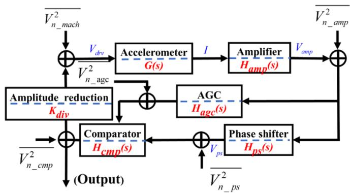  
Figure 3. Working principle of resonant accelerometer driven by AGC scheme.

Table 2. Expressions of phase noise coefficients for AGC driving scheme.   

<table><tr><td>Coefficient</td><td>Expression</td><td>Source</td></tr><tr><td>b0_AGC</td><td>Hps(jω0)Hcmp(jω0)2C Vn_amp_white</td><td>Amplifier</td></tr><tr><td rowspan="2">b-2_AGC</td><td>144k32ω02(QnεhVAC)4VDC2|Hps(jω0)|2(Kcmp)2Vn_amp_white+CKdiv2</td><td rowspan="2">Resonator, Amplifier, Comparator, Proof mass, A-S effect, AGC</td></tr><tr><td>(4kTReq/K2div + VN_cmp + |Hps(jω0)Hage_cmp(jω0)|2VN_amp_white)f024Q2C + amSF</td></tr><tr><td rowspan="2">b-3_AGC</td><td>144k32ω02(QnεhVAC)4VDC2|Hps(jω0)|2(Kcmp)2fc1VN_amp_white+CKdiv2</td><td rowspan="2">A-S effect, AGC</td></tr><tr><td>|Hage_cmp(jω0)|2I2fc3VN_age_white|Vps|2</td></tr><tr><td>b-5_AGC</td><td>|Hage_cmp(jω0)|2I2fc3VN_age_white/(2π)3·|Vps|2(f0/2Q)2</td><td>AGC</td></tr></table>

control scheme. In the AGC control scheme, the flicker frequency noise $(1/f^3$ phase noise) is caused by the amplitude stiffness coupling effect and the AGC module. The $1/f^5$ phase noise is led by the AGC module noise alone. Therefore, compared with the non-AGC control scheme, the AGC control scheme additionally introduces flicker frequency noise $(1/f^3$ phase noise) and $1/f^5$ phase noise.

# 4. Simulation

Simulink is used to perform the behaviour-level simulations of the non-AGC drive circuit and the AGC amplitude control circuit respectively to verify the above mentioned system-level phase noise model. Through the power spectral density of the simulated waveform, the noise composition of the non-AGC and the AGC loop are analysed and compared with the theoretical equations in sections 2 and 3. The parameters in the simulations are listed in table 3. Noting that these parameters are determined by experiments. For example, the mechanical parameters including nonlinear parameters can be characterized by frequency swept testing. The different circuit noise sources are measured by noise spectrum analysis. The driving

Table 3. Parameters of resonant accelerometer and circuit.   

<table><tr><td>Parameters</td><td>Value</td><td>Unit</td></tr><tr><td>k1</td><td>186.9</td><td>N m-1</td></tr><tr><td>k3</td><td>3.9 × 1010</td><td>N m-3</td></tr><tr><td>ω0</td><td>2.539 × 105</td><td>rad s-1</td></tr><tr><td>Q</td><td>12 000</td><td>—</td></tr><tr><td>Kdiv</td><td>1/2500</td><td>—</td></tr><tr><td>VDC</td><td>24</td><td>V</td></tr><tr><td>VAC</td><td>0.5</td><td>mV</td></tr><tr><td>C</td><td>6.25</td><td>—</td></tr><tr><td>V2n_mach</td><td>4.2248 × 10-15</td><td>V2 Hz-1</td></tr><tr><td>V2n_amp</td><td>2.5 × 10-11</td><td>V2 Hz-1</td></tr><tr><td>V2n_cmp</td><td>1 × 10-8</td><td>V2 Hz-1</td></tr><tr><td>V2n_aging_white</td><td>2.5 × 10-11</td><td>V2 Hz-1</td></tr><tr><td>am</td><td>3.72 × 10-14</td><td>g2 Hz-1</td></tr><tr><td>SF</td><td>180</td><td>Hz g-1</td></tr></table>

voltage should be determined by the nonlinear characteristics of a specific structure and the circuit configurations.

Figure 4 shows the simulated phase noise of the resonant accelerometer with non-AGC and the AGC loop. It can be seen

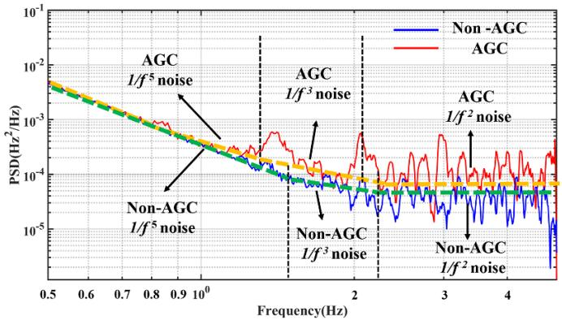  
Figure 4. Comparison of simulation results of phase noise distribution between AGC and non-AGC schemes.

that the $1/f^5$ phase noise is introduced by the AGC module in the AGC loop. As the frequency continues to increase, both the flicker frequency noise of the AGC and non-AGC appear. According to equations (4) and (8), the flicker noise of the non-AGC loop is caused by the A-S effect. However, for the AGC loop, the AGC module also introduces the flicker noise in addition to the amplitude stiffness coupling. Therefore, the flicker noise of the AGC loop is larger than that of the non-AGC loop. As the frequency further increases, white frequency noise both dominate the noise spectrum.

The simulated noise distribution of the non-AGC scheme and the AGC drive scheme basically conforms to the prediction of the formula in sections 2 and 3. Because the AGC scheme additionally introduces the flicker frequency noise, the bias instability of the accelerometer is deteriorated. Consequently, the non-AGC drive circuit is the priority selection for the silicon resonant accelerometer in this work. It should be noted that to save the simulation time under the limitation of computing hardware resources, the simulation step is set to be $1\mu \mathrm{s}$ , which indicates the delay inversion time of the comparator is greater than or equal to $1\mu \mathrm{s}$ . The actual comparator noise delay time is only $7.6~\mathrm{ns}$ , which is far less than $1\mu \mathrm{s}$ in the simulation. We found that the longer the delay time, the greater the noise introduced by the comparator in the simulation. Therefore, the simulated $1 / f^3$ and $1 / f^5$ phase noise will be much larger than the actual measured values, which results in a non-negligible effect of these noise sources within the simulation frequency range. Considering the actual noise curve is plotted by superimposing the different noise sources and the AGC control scheme introduced extra $1 / f^3$ and $1 / f^5$ phase noise, the white frequency noise of the AGC control scheme seems to be a bit larger than that of the non-AGC loop. However, we think the white frequency noises of these two schemes are at the same level based on the equations of tables 1 and 2.

To investigate the compositions of the white frequency noise, we make statistics on the contribution of each noise source according to the noise model as shown in figure 5. The result indicates that the first two dominant noise sources are resonator thermal noise and preamplifier noise. The resonator thermal noise can be effectively decreased by enhancing the quality factor. The preamplifier noise reduction is realized

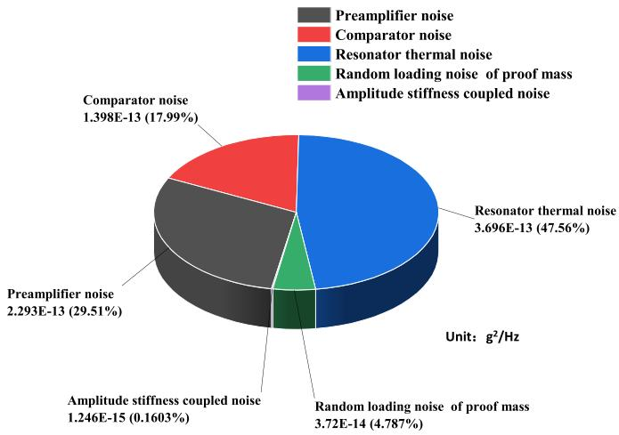  
Figure 5. Statistics on the contribution of each noise source to the overall the frequency white noise.

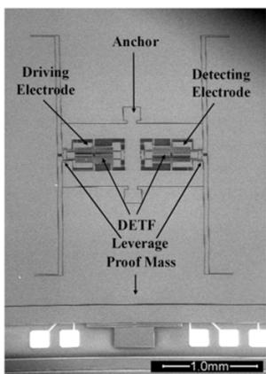

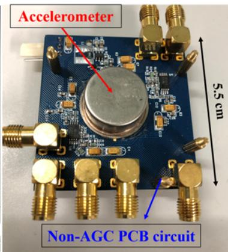  
Figure 6. The SEM picture of a resonant accelerometer and control circuit of non-AGC driving scheme.

by increasing the carrier power and optimizing the noise performance of the amplifier itself [12] as illustrated in equation (1). Noting that this noise model calculating is based on the practical parameters, which ensures good consistency with the measured results.

# 5. Experimental results and discussion

The non-AGC driving circuit is applied to a custom-designed silicon resonant accelerometer [21]. The structure of accelerometer utilizes a proof mass and a pair of double-ended tuning forks (DETF) to sense the external acceleration input. A micro-leverage is utilized to further enhance the sensitivity of the accelerometer. To improve the frequency stability, the DETFs are embedded in an isolation frame with stress insensitive anchor. The device is fabricated with the simple 3 masks silicon-on-glass processing and is vacuum-sealed in a metal packaging. The SEM picture of the silicon resonant accelerometer and non-AGC driving circuit used in this paper are shown in figure 6. The non-AGC circuit is rather simple

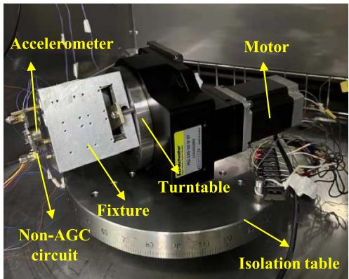  
Figure 7. Test setup for the scale factor.

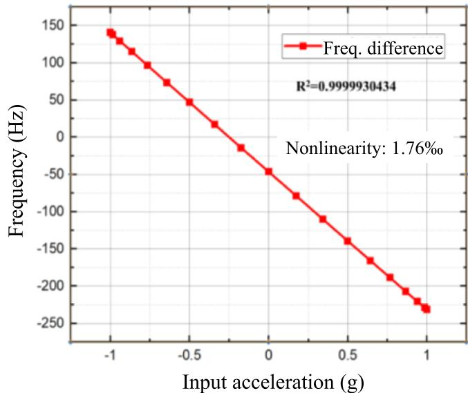  
Figure 8. The relationship between the frequency difference and the input acceleration.

that only includes a quad-operational amplifier and a comparator. The measured nominal resonant frequency and the quality factor of the device are $\sim 38.7\mathrm{kHz}$ and $14.4\mathrm{k}$ .

The scale factor should be first determined to demonstrate the functionality of the resonant accelerometer. A precise motor-controlled rotating platform is designed to hold the fixture and the accelerometer. The testing setup is installed on a rate table to isolate the environmental vibration disturbances as shown in figure 7. By rotating the device with the stepper motor from $0^{\circ}$ to $180^{\circ}$ (corresponding to $-1\mathrm{g}$ to $1\mathrm{g}$ acceleration), the scale factor can be obtained. All the frequency measurements in the experiments are obtained by the counting method implemented with a custom designed FPGA circuit [22]. The scale factor of the resonant accelerometer is $\sim 186\mathrm{Hz~g}^{-1}$ with the nonlinearity $1.76\%$ as shown in figure 8, which is very close to the $186.2\mathrm{Hz~g}^{-1}$ measured by FFT method using NI USB-6366. Thus, the relative sensitivity is calculated to be $\sim 4806\mathrm{ppm~g}^{-1}$ .

The repeatability of the scale factor is also tested for three times with power-off intervals for $30\mathrm{min}$ . The measurement data time at each point is $30~\mathrm{s}$ , and the average value is taken

Table 4. The repeatability test of the scale factor.   

<table><tr><td>No.</td><td>Scale factor (Hz g-1)</td></tr><tr><td>1</td><td>186.063</td></tr><tr><td>2</td><td>186.047</td></tr><tr><td>3</td><td>186.051</td></tr></table>

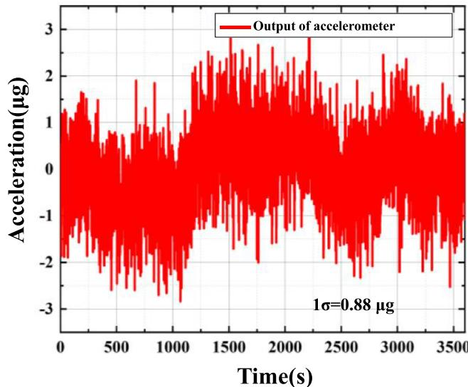  
Figure 9. Tested bias output of the resonant accelerometer for an hour time.

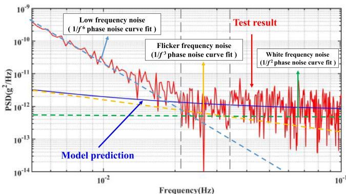  
Figure 10. Power spectral density of the bias output of the accelerometer.

as listed in table 4. Then, the repeatability of the scale factor is calculated to be $\sim 43$ ppm.

The resonant accelerometer driven by non-AGC scheme is sampled for $1\mathrm{h}$ with $1\mathrm{Hz}$ sampling rate as shown in figure 9. The test results show that the peak to peak acceleration of $1\mathrm{h}$ is less than $6\mu \mathrm{g}$ and the bias stability is $0.88\mu \mathrm{g}(1\sigma)$ . Due to the limit our vibration platform, the sensor bandwidth is tested up to only $50\mathrm{Hz}$ . We think the actual bandwidth of our device can beyond $100\mathrm{Hz}$ .

The power spectral density is calculated as shown in figure 10 based on the adopted data. The results predicted by the model are also plotted. At low frequencies, due to the influence of low frequency noise $(1 / f^6$ phase noise), the actual test results are far greater than the theoretical predictions. As

Table 5. Comparison of the measured results with the model predicted.   

<table><tr><td>Noise</td><td>Model predicted</td><td>Measured</td></tr><tr><td>Flick noise</td><td>1.26 × 10-14g2</td><td>1.4 × 10-14g2</td></tr><tr><td>White noise</td><td>7.4 × 10-13g2 Hz-1</td><td>7 × 10-13g2 Hz-1</td></tr></table>

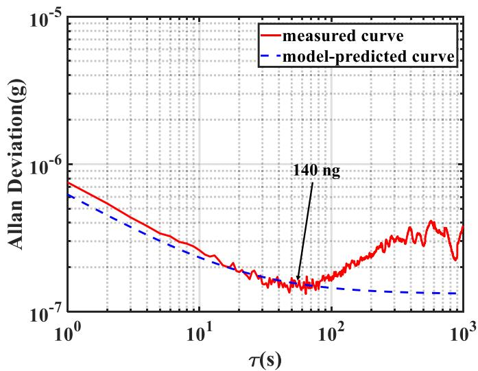  
Figure 11. Allan variance analysis of acceleration.

Table 6. Performance comparison with previous work.   

<table><tr><td>Work</td><td>Year</td><td>Control scheme</td><td>Noise density</td><td>Bias instability</td></tr><tr><td>[3]</td><td>2017</td><td>AGC</td><td>1000 ng (√Hz)−1</td><td>230 ng</td></tr><tr><td>[14]</td><td>2018</td><td>AGC</td><td>380 ng (√Hz)−1</td><td>95 ng</td></tr><tr><td>[15]</td><td>2017</td><td>Non-AGC</td><td>5400 ng (√Hz)−1</td><td>4300 ng</td></tr><tr><td>[23]</td><td>2017</td><td>AGC</td><td>—</td><td>160 ng</td></tr><tr><td>[16]</td><td>2021</td><td>Non-AGC</td><td>13.2 mg (√Hz)−1</td><td>110 ng</td></tr><tr><td>This work</td><td>2021</td><td>Non-AGC</td><td>837 ng (√Hz)−1</td><td>140 ng</td></tr></table>

the frequency value increases, the noise effect of $1/f^6$ phase noise decreases, and flicker frequency noise ( $1/f^3$ phase noise) and white frequency noise ( $1/f^2$ ) appear successively. The theoretical and measured values of flicker frequency noise and white frequency noise are very consistent. The accelerometer noise values predicted by the proposed model and actually measured are listed in table 5. The white noise density of the silicon resonant accelerometer is $\sim 837 \, \mathrm{ng}(\sqrt{\mathrm{Hz}})^{-1}$ within $0.5 \, \mathrm{Hz}$ measurement bandwidth. Since the noise figure of the actual comparator is smaller, the corresponding introduced $1/f^3$ and $1/f^5$ noises are at a low level, which is the reason that the measurement results are different from the simulation results.

The measured Allan variance and the model prediction results calculated using the parameters in table 3 of the bias output are exhibited in figure 11. It shows that when average time $\tau$ is small, the prediction curve is basically consistent with the actual measurement curve. The bias instability of the accelerometer is $\sim 140\mathrm{ng}$ . As the cluster time beyond $100\mathrm{s}$ , the tested curve shows an obvious deviation from the theoretical

one. It is believed that bias output is affected by the environmental temperature variation which is not included in our current model.

Table 6 gives the summary of the comparison with previously reported works, which indicates a competitive result is achieved in this paper in terms of the noise and bias instability.

# 6. Conclusion

In this paper, the phase noise model of resonant accelerometer loop driven by non-AGC and AGC scheme are established, and the influence of noise introduced by different modules on the output phase noise is analysed. The prediction results of the model are in good agreement with the actual test results, which verifies the accuracy of the model. The accelerometer performance test results show that the bias stability is $0.88\mu \mathrm{g}$ . The bias instability is $\sim 140\mathrm{ng}$ with the noise density $\sim 837\mathrm{ng}(\sqrt{\mathrm{Hz}})^{-1}$ . Future work will focus on the evaluation of the temperature performance of the silicon resonant accelerometer with non-AGC driving loop.

# Data availability statement

All data that support the findings of this study are included within the article (and any supplementary files).

# Acknowledgments

This work was supported by the National Key R&D Program of China (Grants No. 2018YFB2002500). The authors want to thank the technicians from the National Key Laboratory of Science and Technology on micro/nano fabrication for helping with the fabrication assistance.

# ORCID iD

Jian Cui https://orcid.org/0000-0001-7853-5951

# References

[1] Hopkins R, Miola J and Setterlund R 2006 The silicon oscillating accelerometer: a high-performance MEMS accelerometer for precision navigation and strategic guidance applications Proc. 61st Annual Meeting of the Institute of Navigation (2005) (Cambridge, MA, 27-29 June 2005) pp 1043-52   
[2] Wang X et al 2017 A $0.4\mu \mathrm{g}$ bias instability and $1.2\mu \mathrm{g} / \sqrt{\mathrm{Hz}}$ noise floor MEMS silicon oscillating accelerometer with CMOS readout circuit IEEE J. Solid State Circuits 52, 472-82   
[3] Zhao J et al 2017 A $0.23 - \mu \mathrm{g}$ bias instability and $1 - \mu \mathrm{g} / \sqrt{\mathrm{Hz}}$ acceleration noise density silicon oscillating accelerometer with embedded frequency-to-digital converter in PLL IEEE J. Solid State Circuits 52 1053-65   
[4] Comi C, Corigliano A, Langfelder G, Longoni A, Tocchio A and Simoni B 2010 A resonant microaccelerometer with high sensitivity operating in an oscillating circuit $J$ . Microelectromech. Syst. 19 1140-52   
[5] Pandit M et al 2019 An ultra-high resolution resonant MEMS accelerometer 2019 IEEE 32nd Int. Conf. Micro Electro Mechanical Systems (MEMS) (Seoul, Korea (South), 27-31 January 2019) pp 664-7   
[6] Wojciechowski K E, Boser B E and Pisano A P 2004 A MEMS resonant strain sensor operated in air Proc. 17th IEEE Int. Conf. Micro Electro Mechanical Systems (Maastricht, Netherlands, 25-29 January 2004) pp 841-5   
[7] Pinto D et al 2009 A small and high sensitivity resonant accelerometer Proc. Chem. 1 536-9

[8] Zhao C et al 2019 A resonant MEMS accelerometer with 56ng bias stability and $98\mathrm{ng / Hz}1 / 2$ noise floor $J$ . Microelectromech. Syst. 28 324-6   
[9] Wang S et al 2018 A MEMS resonant accelerometer for low-frequency vibration detection Sens. Actuators A 283 151-8   
[10] Yang B et al 2015 A new silicon biaxial decoupled resonant micro-accelerometer Microsyst. Technol. 21 109-15   
[11] Ran S et al 2013 Phase noise analysis of micromechanical silicon resonant accelerometer Sens. Actuators A 197 15-24   
[12] Saukoski M 2008 System and circuit design for a capacitive MEMS gyroscope PhD Dissertation   
[13] Seshia A A et al 2002 A vacuum packaged surface micromachined resonant accelerometer $J$ . Microelectromech. Syst. 11 784-93   
[14] Yin Y, Fang Z, Han F, Yan B, Dong J and Wu Q 2017 Design and test of a micromachined resonant accelerometer with high scale factor and low noise Sens. Actuators A 268 52-60   
[15] Zhang J, Qiu A, Qin S, Xia G and Yang Z 2017 A compact low-power oscillation circuit for the high performance silicon oscillating accelerometer 2nd Int. Conf. Materials Science, Resource and Environmental Engineering (MSREE 2017) (American Institute of Physics Conference Series) 1890 040068   
[16] Ding H, Wu C and Xie J 2020 A MEMS resonant accelerometer with high relative sensitivity based on sensing scheme of electrostatically induced stiffness perturbation J. Microelectromech. Syst. 30 32-41   
[17] Zou X, Thiruvenkatanathan P and Seshia A A 2014 A seismic-grade resonant MEMS accelerometer J. Microelectromech. Syst. 23.4 768-70   
[18] Leeson D B 1966 A simple model of feedback oscillator noise spectrum Proc. IEEE 54 329-30   
[19] Li D, Zhao Q and Cui J 2021 Velocity random walk modelling of a silicon MEMS resonant accelerometer based on non-AGC control loop IEEE 16th Int. Conf. Nano/Micro Engineered and Molecular Systems (NEMS) pp 1461-4   
[20] Zhao J et al 2016 A system decomposition model for phase noise in silicon oscillating accelerometers IEEE Sens. J. 16 5259-69   
[21] Cui J, Yang H, Li D, Song Z and Zhao Q 2019 A silicon resonant accelerometer embedded in an isolation frame with stress relief anchor Micromachines 10 571   
[22] Li D, Zhao Q and Cui J 2021 High-precision frequency measurement for microresonant sensors based on improved modified multi-phase clock method Rev. Sci. Instrum. 92 015004   
[23] Shin D D, Ahn C H, Chen Y, Christensen D L, Flader I B and Kenny T W 2017 Environmentally robust differential resonant accelerometer in a wafer-scale encapsulation process IEEE 30th Int. Conf. Micro Electro Mechanical Systems (MEMS) pp 17-20