# Post-CMOS-Compatible Aluminum Nitride Resonant MEMS Accelerometers

Roy H. Olsson, III, Member, IEEE, Kenneth E. Wojciechowski, Member, IEEE, Michael S. Baker, Melanie R. Tuck, and James G. Fleming

Abstract—This paper describes the development of aluminum nitride (AlN) resonant accelerometers that can be integrated directly over foundry CMOS circuitry. Acceleration is measured by a change in resonant frequency of AlN double-ended tuning-fork (DETF) resonators. The DETF resonators and an attached proof mass are composed of a $1 - \mu \mathrm{m}$ -thick piezoelectric AlN layer. Utilizing piezoelectric coupling for the resonator drive and sense, DETFs at $890\mathrm{kHz}$ have been realized with quality factors $(Q)$ of 5090 and a maximum power handling of $1\mu \mathrm{W}$ . The linear drive of the piezoelectric coupling reduces upconversion of $1 / f$ amplifier noise into $1 / f^3$ phase noise close to the oscillator carrier. This results in lower oscillator phase noise, $-96\mathrm{dBc} / \mathrm{Hz}$ at $100\mathrm{-Hz}$ offset from the carrier, and improved sensor resolution when the DETF resonators are oscillated by the readout electronics. Attached to a 110-ng proof mass, the accelerometer microsystem has a measured sensitivity of $3.4\mathrm{Hz} / \mathrm{G}$ and a resolution of $0.9\mathrm{mG} / \sqrt{\mathrm{Hz}}$ from 10 to $200\mathrm{Hz}$ , where the accelerometer bandwidth is limited by the measurement setup. Theoretical calculations predict an upper limit on the accelerometer bandwidth of $1.4\mathrm{kHz}$ . [2008-0190]

Index Terms—Acceleration measurement, acoustic devices, acoustic oscillators, acoustic resonators, acoustic transducers, beams.

# I. INTRODUCTION

MINIATURIZATION is of great interest in the area of sensors. Integration of readout electronics with sensors on the same substrate not only reduces size but generally improves performance and reduces power consumption. Further size reductions can be obtained through the integration of sensors with radio-frequency (RF) communication circuitry and devices. When integrating MEMS sensors (inertial, chemical, and biological) with CMOS circuitry, it is highly desirable to have the MEMS devices processed post-CMOS. In this way, MEMS sensors can be realized directly on top of the most advanced CMOS circuitry. To date, many MEMS accelerometers have been implemented either as a two-chip solution [1], [2], with the mechanical components and readout electronics realized on separate substrates, or as a single-chip solution [3]-[5], with the MEMS devices processed first followed by the readout circuits on the same substrate. This MEMS first approach is necessary because the device layer used to realize the mechanical elements, typically polycrystalline silicon, requires high

Manuscript received July 25, 2008; revised January 6, 2009 and March 9, 2009. First published May 12, 2009; current version published June 3, 2009. This work was supported by Laboratory Directed Research and Development, Sandia National Laboratories, U.S. Department of Energy, under Contract DEAC04-94AL85000. Subject Editor R. T. Howe. The authors are with the Advanced MEMS Department, Sandia National Laboratories, Albuquerque, NM 87123 USA (e-mail: rholsso@sandia.gov). Digital Object Identifier 10.1109/JMEMS.2009.2020374

temperature anneals to reduce film stress. While this approach has been used to commercially deploy accelerometers for automotive and consumer applications [5], scaling the circuitry in a MEMS first process to keep pace with the advances in CMOS is expensive due to process incompatibilities between fine-line CMOS and MEMS fabrication. As a result, MEMS first CMOS is often run with large feature sizes and few metal interconnect layers.

Previous work on post-CMOS-compatible accelerometers [6] has focused on capacitive accelerometers built in the Al and oxide layers already available in a CMOS process. While some encouraging results have been reported, stress in the Al and oxide layers can be problematic in capacitive readout schemes. Because the layers already present in a CMOS process are used to realize the mechanical structures, it requires significant development to implement after different CMOS processes due to the subsequent changes in the number of layers, layer thicknesses, and layer stresses. Post-CMOS-compatible accelerometers based on thermal transduction [7] have been recently reported. While thermal transduction allows a three-axis accelerometer to be realized using a single proof mass, the CMOS Si area directly below the accelerometer is consumed during the release and cannot be used to realize electronics. This wasted circuit area can become expensive in fine-line CMOS processes. Yet, another approach for realizing post-CMOS-compatible inertial sensors is to utilize polysilicon germanium (poly-SiGe), which can be deposited at low temperature as the structural layer [8]. By using this approach, many designs implemented in poly-Si using MEMS first processing or a two-chip solution can be made post-CMOS compatible. Monolithic accelerometers have also been realized using silicon-on-insulator wafers [9]. Here, CMOS interface circuitry is fabricated first in a $10 - \mu \mathrm{m}$ -thick epitaxial top silicon layer, prior to realization of the accelerometer proof mass and supports in the top Si layer by removing the buried oxide.

Aluminum nitride is a post-CMOS-compatible piezoelectric material used to realize film bulk acoustic resonators [10] for cellular phones and other post-CMOS-compatible RF filters [11], [12]. Since high-quality-factor $(Q)$ low-impedance high-power-handling resonators can be realized using AlN thin films, AlN should also be a good material for realizing resonant-based sensors. Resonant-based accelerometers are different from capacitive [1], [2], piezoresistive [13], optical [14], or tunneling accelerometers [15] in that they measure change in resonant frequency induced by strain rather than a direct measurement of displacement. A resonant accelerometer is schematically shown in Fig. 1. The double-ended tuning-fork (DETF) beam

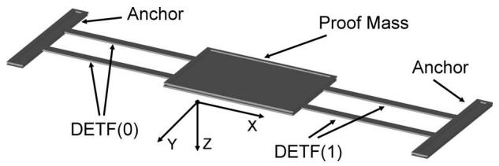  
Fig. 1. Resonant accelerometer structural diagram.

resonators are placed in a positive feedback loop to form an oscillator. An acceleration in the positive $x$ -direction places DETF(0) in tension, increasing its resonant frequency and, thus, the output frequency of a readout oscillator circuit where the frequency is set by DETF(0). Since frequency can be precisely measured for oscillators where the frequency is set by a high- $Q$ resonator, high acceleration resolution can be obtained.

# II. RESONANT ACCELEROMETER OPERATION

The sensitivity $\varGamma$ of the DETF sensing beams to acceleration $G$ is [16]

$$
\vec {\Gamma} = \frac {\frac {\Delta f}{f _ {0}}}{G} = \frac {0 . 7 2 \mathrm {m l} ^ {2}}{E t w ^ {3}} \tag {1}
$$

where $m$ is the weight of the proof mass and $l, w, t,$ and $E$ are the beam length, width, thickness, and modulus, respectively. An acceleration $G$ produces a phase-noise sideband $L_{v}$ at the frequency of vibration $f_{v}$ offset from the carrier equal to [17]

$$
L _ {v} \left(f _ {v}\right) = \left(\frac {\left| \vec {\Gamma} \right| f _ {0} \vec {G}}{2 f _ {v}}\right) ^ {2}. \tag {2}
$$

Thus, the phase-noise power due to vibration goes as $1 / f_v^2$ . The phase noise of an oscillator is limited over a range of frequencies close to the carrier by the quality factor $Q$ and the electrical power handling $P_{\mathrm{sig}}$ of the resonator on which the oscillation frequency is based [18]

$$
L _ {\mathrm {o s c}} (\Delta f) = \frac {2 K T}{P _ {\mathrm {s i g}}} \left(\frac {f _ {0}}{2 Q \Delta f}\right) ^ {2}. \tag {3}
$$

The oscillator phase noise in this region of operation also goes as $1 / \Delta f^2$ , yielding an accelerometer resolution that is constant versus acceleration frequency

$$
\frac {G _ {\operatorname* {m i n}}}{\sqrt {H z}} = \frac {2 f _ {v} \sqrt {L _ {\mathrm {o s c}} (f _ {v})}}{\vec {\Gamma} f _ {0}} = \frac {\sqrt {\frac {2 K T}{P _ {\mathrm {s i g}}}}}{Q \vec {\Gamma}}. \tag {4}
$$

It can be seen from (3) that in order to obtain low oscillator phase noise and thus high sensor resolution, both high $Q$ and high power handling are required from the resonator. From (2) and (3), the sensor resolution is constant over the bandwidth of the $1/f^2$ phase-noise region of the oscillator. While previous work on capacitively driven MEMS resonant accelerometers [16] obtained high $Q$ , the nonlinear electrostatic transduction force, that is a function of the square of the drive voltage, results in upconversion of $1/f$ amplifier noise into $1/f^3$ oscillator phase noise close to the carrier. In [16], the

$1 / f^{3}$ noise completely suppresses the desired $1 / f^{2}$ phase-noise region of constant sensor resolution, resulting in a narrow-bandwidth accelerometer. Automatic-level-control techniques for suppressing $1 / f^{3}$ noise in electrostatically driven MEMS beam oscillators are presented in [19]. Automatic level control, however, reduces the power through the resonator, which degrades the phase-noise performance in accordance with (3), and reduces the upper limit of the resonant sensor bandwidth [19] which occurs where the $1 / f^{2}$ phase-noise region intersects the white phase-noise region. The transduction force for piezoelectric drive is linear with voltage. For this reason, it is expected that the upconversion of $1 / f$ amplifier noise into $1 / f^{3}$ oscillator phase noise will be significantly reduced, resulting in decreased oscillator phase noise, improved sensor resolution, and a much wider sensor bandwidth.

The frequency resolution of an oscillator such as that described earlier is limited over long time scales, i.e., in seconds, by temperature variations and drift in the beam resonant frequency. The differential accelerometer structure in Fig. 1 allows for some cancellation of these effects and extends the low-frequency bandwidth of the sensor. As discussed previously, an acceleration in the positive $x$ -direction places DETF(0) in tension and increases its resonant frequency. The same positive $x$ acceleration places DETF(1) in compression and lowers its resonant frequency. Since all other acceleration directions, temperature, and drift ideally induce the same frequency shifts in both DETF sensors, the subtraction of $f_{\mathrm{DETF}(1)}$ from $f_{\mathrm{DETF}(0)}$ removes cross-axis accelerations, temperature, and drift from the measurement, leaving only frequency shifts due to the desired acceleration axis. This frequency subtraction can be performed with a mixer or more complex analog or digital circuitry. In practice, the rejection of temperature, drift, and cross-axis accelerations is limited by the frequency mismatch between the two beams induced from lithographic and material property variations. For the narrow DETFs in this paper that are in close proximity, lithographic variations are the dominant source of frequency mismatch. If the beams can be matched to within 1000 ppm, then the undesired temperature, drift, and cross-axis acceleration effects can be reduced by a factor of $10^{3}$ . The axial stiffness of the beam resonators can also be sensitive to temperature, making the acceleration sensitivity or scale factor, $\Gamma$ from (1), a function of temperature. It is possible through passive compensation to significantly reduce the temperature coefficient of DETF resonators [20], [21] to realize an accelerometer with a temperature-independent scale factor, although no attempt to do this has been made in this paper.

# III. POST-CMOS-COMPATIBLE ALUMINUM NITRIDE MEMS PROCESS

The process flow used to fabricate the AlN resonant sensors is shown in Fig. 2. The process replaces the platinum bottom electrode in [11] with standard CMOS metals, titanium (Ti), titanium nitride (TiN), and tungsten (W). (a) The process begins with an anisotropic silicon (Si) etch and the deposition of a $500\mathrm{-nm}$ silicon dioxide $(\mathrm{SiO}_2)$ layer to isolate the bottom electrode from the substrate. Tungsten is then deposited by

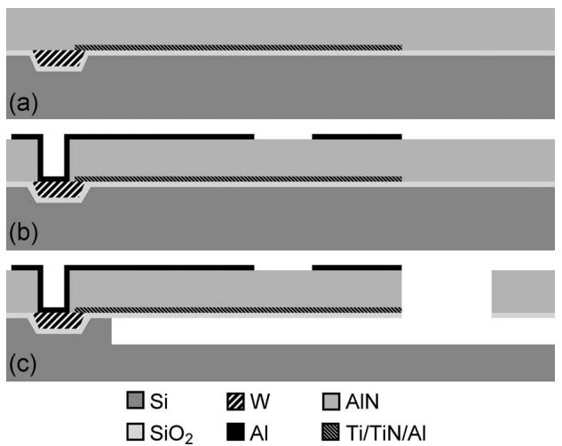  
Fig. 2. Process flow for fabricating the AlN resonant accelerometers.

chemical vapor deposition and chemically mechanically polished until it remains only where Si was etched. An oxide touch polish is then performed to further smooth the wafer surface prior to the sputter deposition and patterning of the $\mathrm{Ti}(20\mathrm{nm})/$ TiN(50 nm)/Al(50 nm) bottom electrode. Next, $1\mu \mathrm{m}$ of AlN is sputter deposited at $350^{\circ}\mathrm{C}$ . Optimization of the sputtering conditions and the bottom electrode material results in a highly $c$ -axis-oriented AlN film with a rocking curve full-width halfmaximum measured using X-ray diffraction of $1^{\circ}$ . (b) Contacts to the W areas are etched in the AlN, and a 100-nm-thick Al top electrode is deposited and patterned. (c) Finally, the resonant sensor is lithographically defined by etching trenches in the AlN and $\mathrm{SiO}_2$ to bulk Si, and the devices are released using an isotropic etch in $\mathrm{XeF_2}$ . The maximum temperature in this process is $350^{\circ}\mathrm{C}$ , and all of the materials are post-CMOS compatible and can be deposited and dry etched using standard CMOS tools. A slight modification to the fabrication process in Fig. 2 that incorporates a low-temperature $(400 - ^{\circ}\mathrm{C})$ amorphous Si release layer is reported in [22]. This process modification allows the AlN resonant accelerometer device reported here to be integrated directly over foundry CMOS circuitry without consuming any CMOS Si area during the release process.

# IV. RESONANT ACCELEROMETER DESIGN

A photograph and scanning electron microscope (SEM) image of an AlN resonant accelerometer are shown in Figs. 3 and 4, respectively. The DETF beams are $300\mu \mathrm{m}$ long and $6\mu \mathrm{m}$ wide, while the proof mass is $150\times 200\mu \mathrm{m}$ and the accelerometer structure is $1.62\mu \mathrm{m}$ thick. As can be seen in Fig. 4, the AlN film exhibits a high $300\mathrm{-MPa}$ tensile stress, while the stress in the underlying oxide film is mildly compressive. The overall stress in the structure is tensile, causing the accelerometer to pull flat in the direction of the anchoring DETF beams and to curl up in other areas. The major implications of this stress are to slightly increase the resonant frequency of the DEFT beams and to limit the maximum achievable proof-mass size. Table I summarizes the dimensions of the resonant accelerometer.

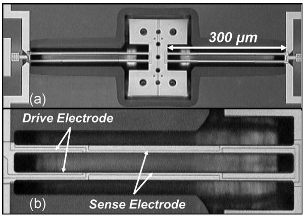  
Fig. 3. (a) AlN resonant accelerometer photograph. (b) Close-up of the DETF electrode configuration. The drive electrode covers only one quarter of the beams' length, while the sense electrode covers the entire length of the two tines.

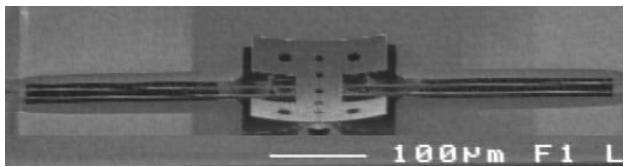  
Fig. 4. SEM image of the AlN resonant accelerometer.

TABLE I RESONANT ACCELEROMETER DIMENSIONS   

<table><tr><td>Accelerometer Parameter</td><td>Symbol</td><td>Value</td></tr><tr><td>DETF Length</td><td>l</td><td>300 μm</td></tr><tr><td>DETF Width</td><td>w</td><td>6 μm</td></tr><tr><td>Device Thickness</td><td>t</td><td>1.62 μm</td></tr><tr><td>Proof Mass</td><td>m</td><td>110 ng</td></tr></table>

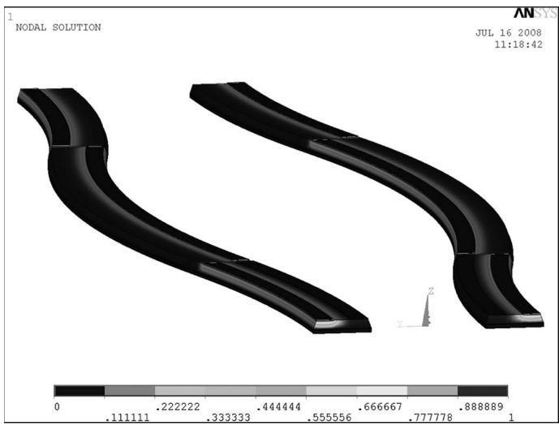  
Fig. 5. Mode shape resulting from a coupled electromechanical finite-element simulation of the DETF beam tines showing the sense electrode from Fig. 3.

The $2 - \mu \mathrm{m}$ wide Al electrodes on top of the accelerometer are patterned to selectively drive the DETF mode shape shown in Fig. 5, which is the output of a 3-D coupled electromechanical finite-element simulation of the DETF beams utilizing piezoelectric elements to induce the mode shape from an applied voltage on the top electrodes (the bottom electrode under

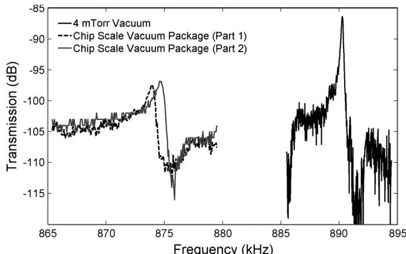  
Fig. 6. DETF sensor transmission in different vacuum environments. $Q$ is reduced by a factor of five when the device is packaged in a chip-scale vacuum package, which results in higher impedance resonators and reduced transmission. The two responses from the chip-scale vacuum package are from two different DETF resonators attached to the same accelerometer proof mass, with a difference in frequency between the two resonators of $375\mathrm{Hz}$ or $430\mathrm{ppm}$ .

the AlN is grounded). The two DETF tines are designed to vibrate out of phase to reduce anchor losses. Due to routing considerations, only a quarter of DETF length is covered by the drive electrode, while the sense electrode spans the entire beam length as shown in Fig. 3(b). The sense electrode runs along the outside of the DETF beams for the first quarter length of the beams and then switches to the insides of the tines for the center half of the beam length before returning to the outside of the beams for the last quarter wavelength. In this way, the displacement-induced strain in the beams can be transduced by the sense electrode across the entire DETF length by electrically connecting areas of the DETF resonator that undergo the same strain orientation, i.e., tensile or compressive. The motional impedance of the DETF resonator is identical, irrespective of which electrode is used to drive and sense the beams. A voltage placed on the sense electrode, however, will displace the DETF beams four times as far as an equivalent voltage placed on the shorter drive electrode. Since the DETF power handling is limited by displacement-induced Duffing spring stiffening, placing the readout oscillator output voltage on the shorter drive electrode and sensing the output current on the longer sense electrode results in 16 times higher electrical power handling for the chosen DETF resonator electrode configuration (as opposed to driving a voltage on the longer electrode and sensing current on the shorter electrode). This increase in resonator power handling leads to a 12-dB reduction in oscillator phase noise and a factor of four improvement in the accelerometer resolution.

# V. DETF RESONATOR TESTING

The transmission responses of the DETF resonator operated in a 4-mtorr vacuum and in a chip-scale vacuum package [23] are shown in Fig. 6, with the performance in each vacuum environment summarized in Table II. The difference in the measured resonant frequency between the chip-scale vacuum-packaged DETF resonators and the DETF resonator in a

TABLE II DETF RESONATOR PERFORMANCE IN DIFFERENT VACUUM ENVIRONMENTS   

<table><tr><td>Packaging</td><td>DETFQ</td><td>Motional Impedance</td></tr><tr><td>4 mTorr Vacuum</td><td>5090</td><td>2 MΩ</td></tr><tr><td>Chip Scale Vacuum (Setter)</td><td>1000</td><td>7 MΩ</td></tr></table>

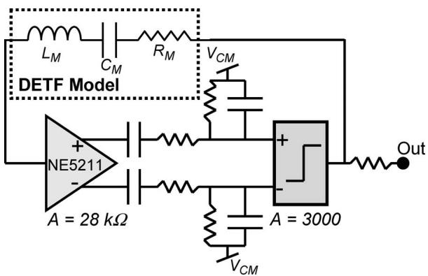  
Fig. 7. DETF oscillator and readout circuitry.

4-mtorr vacuum chamber is due to frequency mismatch across a 6-in wafer, as these measurements are taken from two separate dies from the same wafer. In the case of the chip-scale vacuum-packaged results, the resonant accelerometer dies were mounted in the package using JM7000 low outgassing epoxy, prebaked, and lid sealed under a $100 - \mu$ torr vacuum at $300^{\circ}\mathrm{C}$ . The DETF $Q$ is five times higher in a 4-mtorr vacuum chamber, $Q = 5090$ , than in the chip-scale vacuum package, $Q = 1000$ . This indicates a pressure increase in the chip-scale vacuum package despite the use of getters deposited on the package lids, as the DETF $Q$ 's are still ten times higher than for DETFs measured in air. The maximum power handling of the DETF resonators under 4 mtorr of vacuum measured by the 1-dB compression point of the resonator transmission response (S21) was $1\mu \mathrm{W}$ corresponding to a drive voltage of $1.4~\mathrm{V}_{\mathrm{RMS}}$ . The power handling of the piezoelectrically driven DETF resonators is limited by nonlinear mechanical spring stiffening. The temperature sensitivity of the DETF beams in this paper is $-25~\mathrm{ppm / C}$ which can be significantly reduced by thickening the underlying oxide in Fig. 2 as demonstrated in [21]. The two responses shown in Fig. 6 from the chip-scale vacuum package are from two different DETF resonators attached to the same accelerometer proof mass as shown in Figs. 3 and 4, with a difference in frequency between the two resonators of $375~\mathrm{Hz}$ or $430~\mathrm{ppm}$ . With this level of matching between resonators on the same die, the effects of temperature, drift, and cross-axis accelerations can be theoretically reduced by a factor of 2300 utilizing the differential approach outlined earlier.

# VI. OSCILLATOR READOUT CIRCUITRY DESIGN AND TESTING

The readout circuitry used to oscillate the DETF beam resonators was adapted from [24] and is shown in Fig. 7. The first stage is a low-current-noise transimpedance amplifier with a gain of $28\mathrm{k}\Omega$ followed by a comparator with a gain of 3000. The nonlinear transfer function of the comparator separates the

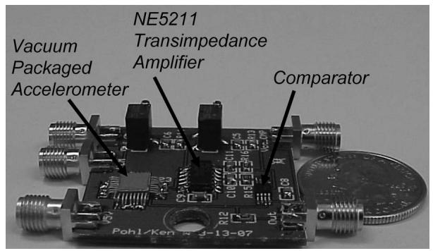  
Fig. 8. Accelerometer microsystem PCB.

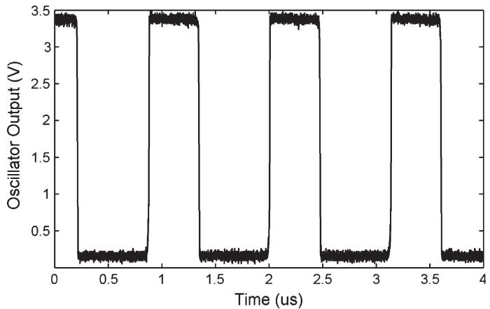  
Fig. 9. DETF oscillator output waveform.

high- $Q$ resonance of the DETF from any parasitic feedthrough [24] and allows sustained oscillation even when the feedthrough completely obscures the resonator peak. This is helpful given the relatively low resonator peak heights shown in Fig. 6 for the chip-scale vacuum-packaged parts. A photograph of the printed circuit board (PCB) oscillator circuitry with a chip-scale vacuum-packaged accelerometer, next to a U.S. quarter, is shown in Fig. 8.

The output waveform of the DETF beam oscillator under a 4-mtorr vacuum is shown in Fig. 9, with a power spectral density (PSD) of the oscillator waveform shown in Fig. 10. Due to the large output signal, attenuation was needed prior to connecting to the spectrum analyzer. From the PSD, a single-sideband phase noise can be derived as shown in Fig. 11. The $1/f^2$ phase-noise region extends down to below $10\mathrm{Hz}$ , where the measurement becomes limited by the $1\mathrm{-Hz}$ integration bandwidth of the spectrum analyzer used to acquire the data. Non-level-controlled electrostatically driven MEMS beam and DETF oscillators typically exhibit a $1/f^3$ phase-noise profile below $1\mathrm{-kHz}$ offset from the carrier [16], [19], limiting the low-frequency performance of these oscillators particularly in sensor applications. The $1/f^2$ phase-noise profile extends up to $200\mathrm{Hz}$ where the measurement is limited by the noise floor of the spectrum analyzer. The white phase-noise floor of the oscillator, which sets the upper bound on the $1/f^2$ phase-noise region, can be calculated from the output voltage of the oscillator $V_{\mathrm{RMS}}$ , the motional impedance of the DETF resonator $R_{X}$ , and the $1.8\mathrm{-pA}/\sqrt{\mathrm{Hz}}$ input-referred current noise of the

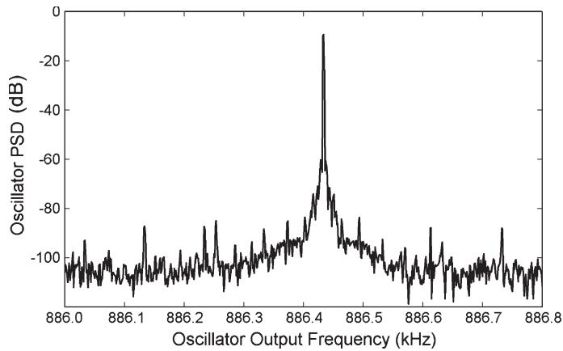  
Fig. 10. Oscillator output frequency spectrum.

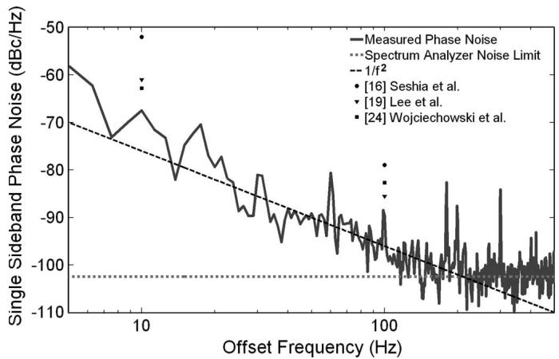  
Fig. 11. DETF oscillator phase noise measured under a 4-mtorr vacuum compared to previously reported resonant beam oscillators for sensor and communication applications. All oscillator phase noise has been converted to $886.5\mathrm{kHz}$ for direct comparison.

transimpedance amplifier $i_n$ in Fig. 7

$$
L _ {\text {W h i t e}} = 2 0 \log \left(\frac {2 V _ {\mathrm {R M S}}}{R _ {X} i _ {n}}\right) \tag {5}
$$

yielding a white phase-noise floor of $-119\mathrm{dBc / Hz}$ . From the intersection of the calculated white phase-noise floor and the measured $1 / f^2$ noise profile in Fig. 11, an upper limit on the sensor bandwidth of $1.4\mathrm{kHz}$ can be found. Also shown in Fig. 11 is the phase noise of previously reported MEMS beam and resonant sensor oscillators normalized to $886.5\mathrm{kHz}$ for comparison. Due to the high $Q$ and power handling of the DETF resonator and the $1 / f^2$ phase-noise profile resulting from linear piezoelectric transduction, the phase-noise performance of the AlN DETF oscillator exceeds that of previously reported surface-micromachined resonant sensors [16], [24] and MEMS beam oscillators targeted for quartz crystal replacement [19].

# VII. ACCELEROMETER SHAKER TESTING

The accelerometer microsystem in Fig. 8 was tested by measuring the output spectrum of an oscillator based on a single DETF resonator on a shaker table under an $x$ -axis 0.5-G 200-Hz sinusoidal vibration, as shown in Fig. 12. The amplitude of the

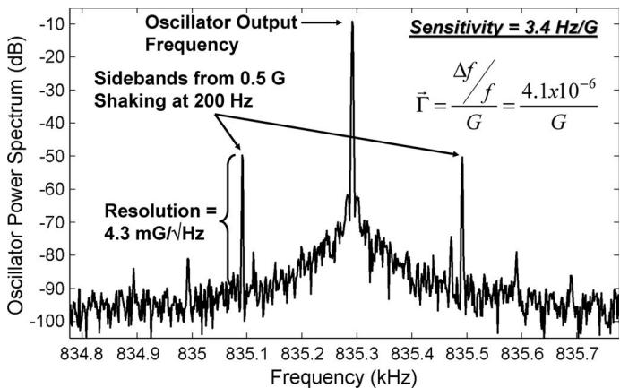  
Fig. 12. Output spectrum of the resonant accelerometer in a chip-scale vacuum package under an $x$ -axis 0.5-G sinusoidal acceleration at $200\mathrm{Hz}$ .

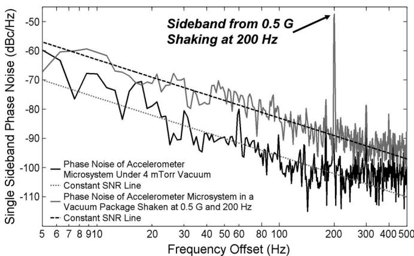  
Fig. 13. Phase noise of the resonant accelerometer in a chip-scale vacuum package under 0.5-G vibration at $200\mathrm{Hz}$ compared to the phase noise under a 4-mtorr vacuum. The accelerometer resolution is $4\mathrm{mG} / \sqrt{\mathrm{Hz}}$ in a chip-scale package and is $0.9\mathrm{mG} / \sqrt{\mathrm{Hz}}$ under a 4-mtorr vacuum.

vibration was measured with a commercial accelerometer and a laser-based interferometer. The sensitivity of the accelerometer was found to be $3.4\mathrm{Hz / G}$ corresponding to a vibration sensitivity parameter, $\Gamma$ from (1), of $4.1\times 10^{-6}\Delta \mathrm{f / f / G}$ . Shaking at numerous frequencies and amplitudes confirmed the acceleration sensitivity. The acceleration sensitivity was found to be equivalent in both the $x$ -axis from Fig. 1 and the $z$ -axis normal to the substrate. In the future, the differential cancellation technique outlined previously will be required to reduce cross-axis sensitivity in the $z$ -axis direction. Based on the height of the sidebands produced by the vibration, an accelerometer resolution of $4.3\mathrm{mG} / \sqrt{\mathrm{Hz}}$ can be determined. The shaker results in Fig. 12 were taken using an accelerometer in a chip-scale vacuum package with DETF performance shown in Fig. 6. The phase noise of the DETF oscillator in a chip-scale vacuum package under an $x$ -axis 0.5-G 200-Hz sinusoidal vibration and the phase noise of the DETF oscillator in a 4-mtorr vacuum are shown in Fig. 13. The degradation of the phase noise due to the reduced $Q$ in the chip-scale vacuum package is evident in Fig. 13. Under a 4-mtorr vacuum, the accelerometer resolution is improved to $0.9\mathrm{mG} / \sqrt{\mathrm{Hz}}$ . This relatively high accelerometer resolution, given the small proof mass, is due to the high sensitivity of resonant detection. For the resonant accelerometer

TABLE III ACCELEROMETER PERFORMANCE FOR DIFFERENT MASS SIZES AND PACKAGING. THE PERFORMANCE FOR THE $4\mathrm{-mm}^2$ PROOF-MASS ACCELEROMETER IS EXTRAPOLATED FROM MEASUREMENTS ON SMALLER PROOF-MASS DEVICES   

<table><tr><td>Package</td><td>Mass Area</td><td>Mass Thickness</td><td>Mass</td><td>Resolution</td></tr><tr><td>Chip Scale</td><td>0.03 mm²</td><td>1.62 μm</td><td>110 ng</td><td>4 mG/√Hz</td></tr><tr><td>4 mTorr</td><td>0.03 mm²</td><td>1.62 μm</td><td>110 ng</td><td>0.9 mG/√Hz</td></tr><tr><td>4 mTorr</td><td>4 mm²</td><td>1.62 μm</td><td>14.3 μg</td><td>7 μG/√Hz</td></tr></table>

shown in Fig. 3 with a proof mass of $110\mathrm{ng}$ and a spring constant in the $x$ -axis given by

$$
k _ {X} = \frac {4 E w t}{l} \tag {6}
$$

the estimated displacement under the applied 0.5-G acceleration is $19\mathrm{fm}$ , resulting in a minimum detectable displacement in a 4-mtorr vacuum of $0.16\mathrm{fm} / \sqrt{\mathrm{Hz}}$ , surpassing the displacement sensitivity of even subwavelength optical gratings [14], [25], [26]. The performance of the accelerometer under both vacuum conditions is summarized in Table III along with the theoretical effects on performance of increasing the proof-mass size.

# VIII. CONCLUSION

A post-CMOS-compatible AlN resonant accelerometer with a 110-ng proof mass has been developed with a measured resolution of $0.9\mathrm{mG} / \sqrt{\mathrm{Hz}}$ over a $200\mathrm{-Hz}$ bandwidth that is limited by the measurement setup and has a predicted bandwidth of $1.4\mathrm{kHz}$ . The accelerometer is fabricated in a five-mask process that has been optimized for the creation of highly oriented piezoelectric AlN thin films with rocking curve full-width half-maximum of $1^{\circ}$ . The process flow is post-CMOS compatible using all CMOS-compatible materials and a maximum temperature of $350~^\circ \mathrm{C}$ . DETF resonant beam sensors have been developed in this process with quality factors of 5090 and power handling limits of $1\mu \mathrm{W}$ . Oscillators based on these resonators have the lowest phase noise reported for DETF resonant sensors due to the high- $Q$ and linear piezoelectric transduction of AlN thin films. The lower oscillator phase noise translates directly into better sensor resolution. A modest increase in the size of the proof mass reported here to $14.3\mu \mathrm{g}$ can theoretically improve the accelerometer resolution to $7\mu \mathrm{G} / \sqrt{\mathrm{Hz}}$ .

# ACKNOWLEDGMENT

The authors would like to acknowledge the memory of their late colleague and friend James (Jim) G. Fleming. Jim's enthusiastic and innovative contributions to microsystems and his kind humble demeanor are sorely missed. The authors would like to thank the MDL staff at Sandia National Laboratories, including J. Stevens, M. Olewine, and P. Nelson, for their work on developing the AlN film and also C. Nakakura for his work on AlN etching. The authors would also like to thank K. Pohl for his contributions in the areas of PCB layout and assembly.

# REFERENCES

[1] B. V. Amini and F. Ayazi, "Micro-gravity capacitive silicon-on-insulator accelerometers," J. Micromech. Microeng., vol. 15, no. 11, pp. 2113-2120, Sep. 2005.   
[2] J. Chae, H. Kulah, and K. Najafi, "A monolithic three-axis micro-g micromachined silicon capacitive accelerometer," J. Microelectromech. Syst., vol. 14, no. 2, pp. 235-242, Apr. 2005.   
[3] M. Lemkin and B. E. Boser, "A three-axis micromachined accelerometer with a CMOS position-sense interface and digital offset-trim electronics," IEEE J. Solid-State Circuits, vol. 34, no. 4, pp. 456-468, Apr. 1999.   
[4] X. Jiang, F. Wang, M. Kraft, and B. E. Boser, "An integrated surface micromachined capacitive lateral accelerometer with $2\mu \mathrm{G} / \sqrt{\mathrm{Hz}}$ resolution," in Tech. Dig. Solid-State Sens., Actuator Microsyst. Workshop, Jun. 2002, pp. 202-205.   
[5] ADXL103 Data Sheet. [Online]. Available: http://www.analog.com   
[6] J. Wu, G. K. Fedder, and L. R. Carley, "A low-noise low-offset capacitive sensing amplifier for a $50 - \mu \mathrm{g} / \sqrt{\mathrm{Hz}}$ monolithic CMOS MEMS accelerometer," IEEE J. Solid-State Circuits, vol. 39, no. 5, pp. 722-730, May 2004.   
[7] Y. Cai, M. Varghese, A. Dribinsky, Y. Hua, F. Lu, H. Gu, M. Meng, W. Zhang, L. Jiang, G. Pucci, H. Liu, A. Leung, Y. Zhao, and G. O'Brien, "A CMOS monolithically-integrated three-axis accelerometer based on thermal convection," in Tech. Dig. Solid-State Sens., Actuators, Microsyst. Workshop, Jun. 2008, pp. 84-85.   
[8] A. Witvrouw, A. Mehta, A. Verbist, B. Du Bois, S. Van Aerde, J. Ramos-Martos, J. Ceballos, A. Ragel, J. M. Mora, M. A. Lagos, A. Arias, J. M. Hinoiosa, J. Spengler, C. Leinenbach, T. Fuchs, and S. Kronmuller, "Processing of MEMS gyroscopes on top of CMOS ICs," in Tech. Dig. Int. Solid-State Circuits Conf., Feb. 2005, pp. 88-89.   
[9] B. S. Davis, T. Denison, and J. Kuang, "A monolithic high-g SOI-MEMS accelerometer for measuring projectile launch and flight accelerations," Shock Vib., vol. 13, no. 2, pp. 127-135, 2006.   
[10] R. Ruby, P. Bradly, J. D. Larson, III, and Y. Oshmyansky, "PCS 1900 MHz duplexer using thin film bulk acoustic resonators (FBARs)," *Electron. Lett.*, vol. 35, no. 10, pp. 794-795, May 1999.   
[11] G. Piazza, P. J. Stephanou, and A. P. Pisano, "Single-chip multiple frequency ALN MEMS filters based on contour-mode piezoelectric resonators," J. Microelectromech. Syst., vol. 16, no. 2, pp. 319-328, Apr. 2007.   
[12] R. H. Olsson, III, J. G. Fleming, K. E. Wojciechowski, M. S. Baker, and M. R. Tuck, "Post-CMOS compatible aluminum nitride MEMS filters and resonant sensors," in Tech. Dig. IEEE Int. Freq. Control Symp., Jun. 2007, pp. 412-419.   
[13] A. Partridge, J. K. Reynolds, B. W. Chui, E. M. Chow, A. M. Fitzgerald, L. Zhang, N. I. Maluf, and T. W. Kenny, "A high-performance planar piezoresistive accelerometer," J. Microelectromech. Syst., vol. 9, no. 1, pp. 58-66, Mar. 2000.   
[14] U. Krishnamoorthy, R. H. Olsson, III, G. R. Bogart, M. S. Baker, D. W. Carr, T. P. Swiler, and P. J. Clews, "In-plane MEMS-based nanoG accelerometer with sub-wavelength optical resonant sensor," Sens. Actuators A, Phys., vol. 145/146, pp. 283-290, Jul./Aug. 2008.   
[15] C.-H. Liu and T. W. Kenny, "A high-precision, wide-bandwidth micromachined tunneling accelerometer," J. Microelectromech. Syst., vol. 10, no. 3, pp. 425-433, Sep. 2001.   
[16] A. A. Seshia, M. Palaniapan, T. A. Roessig, R. T. Howe, R. W. Gooch, T. R. Schimert, and S. Montague, "A vacuum packaged surface micromachined resonant accelerometer," J. Microelectromech. Syst., vol. 11, no. 6, pp. 784-793, Dec. 2002.   
[17] R. L. Filler, “The acceleration sensitivity of quartz crystal oscillators: A review,” IEEE Trans. Ultrason., Ferroelectr., Freq. Control, vol. 35, no. 3, pp. 297–305, May 1988.   
[18] T. H. Lee and A. Hajimiri, "Oscillator phase noise: A tutorial," IEEE J. Solid-State Circuits, vol. 35, no. 3, pp. 326-336, Mar. 2000.   
[19] S. Lee and C. T.-C. Nguyen, "Influence of automatic level control on micromechanical oscillator phase noise," in Tech. Dig. IEEE Int. Freq. Control Symp., May 2003, pp. 341-349.   
[20] B. Kim, R. Melamud, M. A. Hopcroft, S. A. Chandorkar, G. Bahl, M. Messana, R. N. Candler, G. Yama, and T. Kenny, "Si-SiO2 composite MEMS resonators in CMOS compatible wafer-scale thin-film encapsulation," in Tech. Dig. IEEE Int. Freq. Control Symp., Jun. 2007, pp. 1214-1219.   
[21] R. H. Olsson, III and M. R. Tuck, "VHF and UHF mechanically coupled aluminum nitride MEMS filters," in Tech. Dig. IEEE Int. Freq. Control Symp., May 2008, pp. 634-639.   
[22] K. E. Wojciechowski, R. H. Olsson, III, M. R. Tuck, E. Roherty-Osmun, and T. A. Hill, "Single-chip precision oscillators

based on multi-frequency, high-Q aluminum nitride MEMS resonators," in Proc. IEEE Int. Conf. Solid-State Sens., Actuators, Microsyst., Jun. 2009, pp. 2126-2130.   
[23] G2121M-7 Data Sheet. [Online]. Available: http://www.stratedge.com/pdf/G2121M-7.pdf   
[24] K. E. Wojciechowski, B. E. Boser, and A. P. Pisano, “A MEMS resonant strain sensor operated in air,” in Proc. 17th Int. IEEE Micro Electro Mech. Syst. Conf., Jan. 2004, pp. 841–845.   
[25] D. W. Carr, G. R. Bogart, and B. E. N. Keeler, "Femto-photonics: Optical transducers utilizing novel sub-wavelength dual layer grating structure," in Tech. Dig. Solid-State Sens., Actuators, Microsyst. Workshop, Jun. 2004, pp. 91-92.   
[26] R. H. Olsson, III, B. E. N. Keeler, D. A. Czaplewski, and D. W. Carr, "Circuit techniques for reducing low frequency noise in optical MEMS position and inertial sensors," in Proc. IEEE Int. Circuits Syst. Conf., May 2007, pp. 2391-2394.

Roy H. Olsson, III (S'99-M'05) received the B.S. degree (summa cum laude) in electrical engineering and computer engineering from West Virginia University, Morgantown, in 1999, and the M.S. and Ph.D. degrees in electrical engineering from the University of Michigan, Ann Arbor, in 2001 and 2004, respectively.

From 1999 to 2004, he was a Research Assistant with the Center for Wireless Integrated MicroSystems (WIMS), University of Michigan, where his doctoral research was in the development of im

plantable electronics for neural recording applications, including amplification, multiplexing, and data compression circuitry. Since July 2004, he has been with the Advanced MEMS Group, Sandia National Laboratories, Albuquerque, NM, where he is currently a Principal Member of the Technical Staff. He has authored over 20 journal and conference papers. He is the holder of three patents in the area of MEMS and microelectronics. His current research interests include RF microresonators, oscillators, and filters, MEMS resonant inertial sensors, microscale phononic crystal devices, low-noise optical readout circuits for inertial sensing, and wireless neural interfaces.

Dr. Olsson was the recipient of the First Prize in the conceptual category and the Best Overall Paper Award at the 2002 Design Automation Conference Student Design Contest for his paper entitled "A microsystem for near-patient accelerated clotting time blood tests." He is a member of the IEEE Solid State Circuits, IEEE Ultrasonics, Ferroelectrics, and Frequency Control, and IEEE Engineering in Medicine and Biology Societies, Etta Kappa Nu, and Tau Beta Pi.

Kenneth E. Wojciechowski (M'00) received the B.S. degree in electrical engineering from Drexel University, Philadelphia, PA, in 1991, the M.S. degree in electrical engineering from Georgia Institute of Technology, Atlanta, in 1992, and the Ph.D. degree in electrical engineering from the University of California, Berkeley, in 2005.

From 1992 to 1999, he was a Senior Engineer with Intel Corporation, where he worked on the development of its multilevel cell NOR-Flash technology. Since November 2005, he has been with Sandia

National Laboratories, Albuquerque, NM, where he is working on RF MEMS, resonant inertial sensors, and low-noise/power sensor electronics for focal plane arrays. He is currently a Principal Member of the Technical Staff, working in the Advanced MEMS and Advanced Microelectronics and Radiation Effects Departments at Sandia National Laboratories. He has authored over nine conference and journal papers. He is the holder of nine patents in the areas of MEMS and microelectronics.

Dr. Wojciechowski is a member of the IEEE Solid State Circuits, IEEE Ultrasonics, Ferroelectrics and Frequency Control, IEEE Circuits and Systems, and IEEE Electron Devices Societies.

Michael S. Baker received the B.S. and M.S. degrees in mechanical engineering from Brigham Young University, Provo, UT, in 1999 and 2002, respectively. His research efforts were in the area of on-chip actuation of MEMS bistable mechanisms.

He is currently a Senior Member of the Technical Staff in the Advanced MEMS Department, Sandia National Laboratories, Albuquerque NM. His research interests include compliant mechanism design and methods of actuation in MEMS.

Melanie R. Tuck received the B.S. degree in biology from the University of New Mexico, Albuquerque, in 1973.

She is currently an Engineer with the Microelectronics Development Laboratory, Sandia National Laboratories, Albuquerque. Her current research interests include process development for RF MEMS devices and micromachined photonic and acoustic crystals.

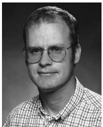

James G. Fleming received the M.S. and Ph.D. degrees in materials science and engineering from Stanford University, Stanford, CA, in 1984 and 1987, respectively.

During his graduate work, he was an Office of Naval Research Fellow. From 1986 to 1988, after graduation, he was awarded an Alexander von Humboldt Fellowship, working on the development of $\mathrm{FeS}_2$ and $\mathrm{CuInS}_2$ for solar energy conversion at the Hahn-Meitner Institut, Berlin, Germany. Since 1988, he has been with Sandia Na

tional Laboratories, Albuquerque, NM, where he is currently a Distinguished Member of the Technical Staff. His research at Sandia involves micromachining process development, chemical vapor deposition processes, CMOS process integration, and photonic crystal design and fabrication. He has authored or coauthored over 25 refereed publications, including two in Nature. He is the holder of 19 patents in the areas of field emitter design, chemical vapor deposition, MEMS processing, and photonic crystals.

Dr. Fleming was the recipient of two R&D 100 Awards, an Industry Week 25 Award, and a Lockheed Martin Nova Award.