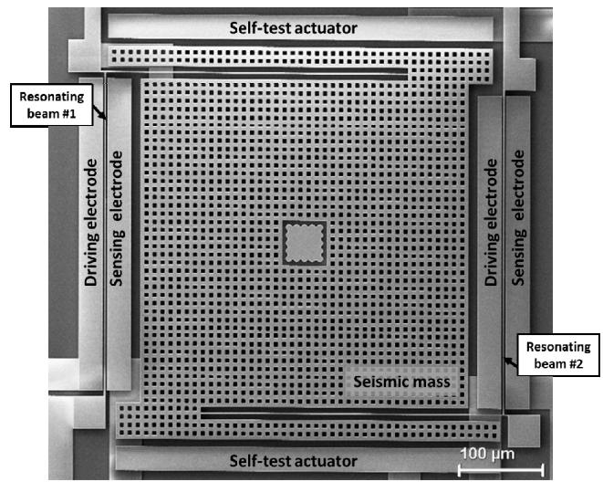
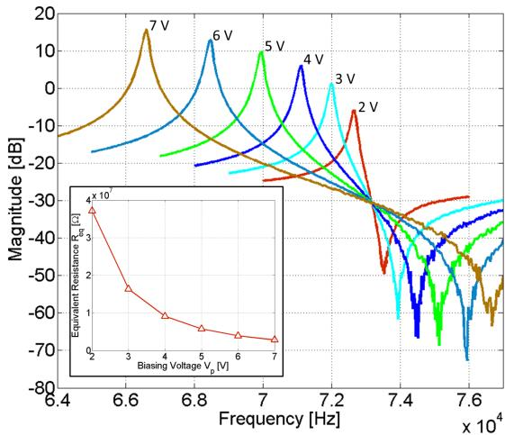
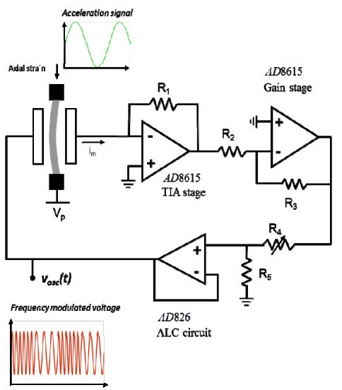
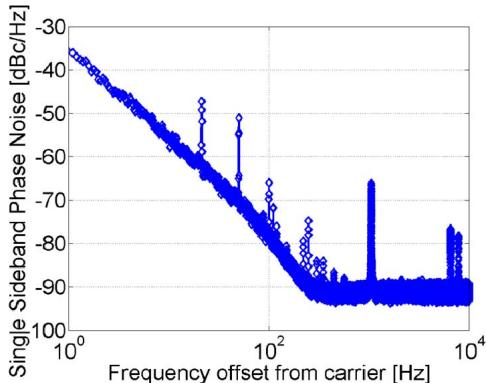
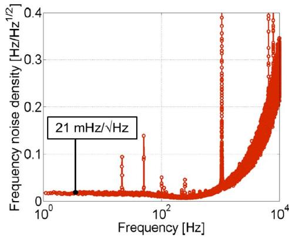
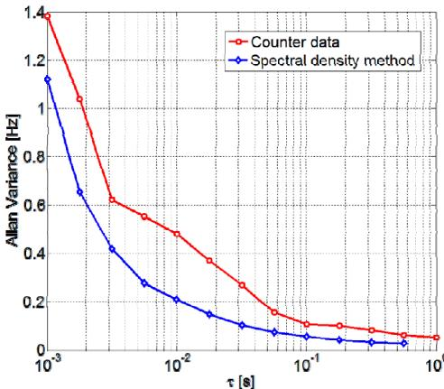
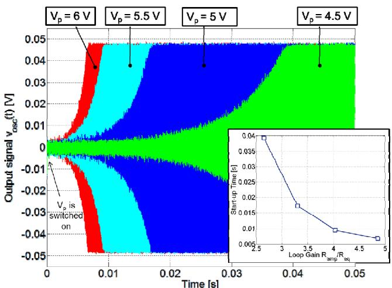

# Resolution and Start-up Dynamics of MEMS Resonant Accelerometers

A. Tocchio, A. Caspani, G. Langfelder, A. Longoni

Electronics and Information Technology Department

Politecnico di Milano

via G. Ponzio 34/5, 20133, Milano, Italy

tocchio@elet.polimi.it

E. Lasalandra

MSH Division

STMicroelectronics

via Tolomeo 1, Cornaredo - Milano

Abstract-In this paper it is presented a study on two key parameters of MEMS resonant accelerometers, resolution and start-up dynamics. A uniaxial differential accelerometer, built in the surface micromachining ThELMA process of ST Microelectronics, is used in the tests together with a discrete components readout circuit. The implemented circuit is an oscillator constituted by a Transimpedance stage (TIA) followed by a gain stage and an amplitude-limiting circuit (ALC). In the present work, it is shown how the sensor resolution can be related to the phase noise of the oscillator output signal and how the start-up dynamics depends on the biasing voltage of the resonator. A sensing resolution of $98\mu \mathrm{g} / \sqrt{\mathrm{Hz}}$ is demonstrated through experimental measurements and a well-defined relationship between the resonators biasing voltage and the start-up time is observed.

# I. INTRODUCTION

In the last decade, MEMS resonant accelerometers have been proposed as an alternative to their state-of-the-art capacitive counterparts [1]. In resonant accelerometers, micromechanical resonators, showing a resonance frequency dependent on the applied acceleration, are suitably integrated as frequency selective filters inside oscillating circuits. The resulting output signal turns out to be frequency modulated by the acceleration amplitude. Therefore, the measurement of acceleration turns into the measurement of a frequency variation. In order to design such a complex system it is necessary to correctly model the electrical behavior of the resonators. In the literature it is known that MEMS resonators can be modeled by equivalent RLC network, where the equivalent parameters $R_{eq}$ , $L_{eq}$ , $C_{eq}$ are strictly related to the mechanical properties of the resonator. In particular, the equivalent resistance $R_{eq}$ electrically models the dissipative losses that the circuit has to compensate in order to maintain the resonator in oscillation. Different circuit topologies have been implemented to compensate these losses, some examples can be found in [2], [3]. The study of the system resolution coincides with the study of noise propagation at the oscillator output. In the literature on resonant sensing, the Allan deviation is often used to characterize the sensing performance of a fabricated resonant device coupled to its readout circuit [4]. In this paper, the measurement of phase noise is proposed as an alternative method to evaluate the system resolution. In

detail, the phase noise $S_{\phi}$ is related to the frequency noise density $S_{f}$ affecting the oscillator output signal, which if integrated on the bandwidth of observance defines the minimum detectable change of the signal frequency $\Delta f_{rms}$ . Thus, given the sensor sensitivity expressed in $\mathrm{Hz / g}$ , the minimum measurable acceleration in $g_{rms}$ can be evaluated.

Another crucial point in the design of the readout interface for MEMS accelerometers, especially when tailored for the consumer market, is their low-power operation. A possible strategy is the introduction of an on/off switching technique, which allows a reduction of power consumption [5]. As a consequence, the study of the start-up behavior and recovery time after circuit ignition becomes of paramount importance.

The present work is motivated by the importance of the correct modeling of the device resolution and the circuit startup time, and by the strong relation of these two parameters with the circuit power consumption. The paper is organized as follows: in Section II the resonant accelerometer used during the tests is described and its resonating beams are characterized. In Section III, the discrete component oscillator is presented; section IV reports the experimental results. Finally, in section V the conclusions are discussed.

# II. THE RESONANT ACCELEROMETER

In the experimental tests a uniaxial resonant accelerometer has been coupled to a discrete component oscillator in order to study the resolution and start-up dynamics of the device. The device, wafer-level packaged at nominal pressure of 1mbar, has been attached and connected through wirebonding to the PCB hosting the electronic circuitry.

# A. Description of the device

An improved version of a recently presented [6] uniaxial resonant accelerometer has been used for the experimental measurements. A SEM image of the fabricated sensor is reported in Fig. 1. The device is constituted by a central seismic mass anchored to the substrate by means of two springs and by two resonating beams anchored at one side to the substrate and at the other side to one of the spring. Under external acceleration, the movement of the seismic mass

  
Figure 1. SEM image of the resonant accelerometer used during the experimental measurements.

causes a compressive stress on one beam and a tensile stress on the other one depending on the acceleration direction. This stress results in a differential shift of the beams resonance frequencies. Each resonator is constituted by a central beam and by two electrodes used for driving and sensing.

# B. Electrical Model of the Resonator

The two resonators embedded in the resonant device can be modeled by an RLC circuit. In particular the equivalent resistance for a clamped-clamped beam resonator can be expressed as [6]:

$$
R _ {e q} = 2 \pi \frac {f _ {0} m _ {\text {e f f}}}{Q \left(V _ {p} \frac {d C}{d x}\right) ^ {2}} \tag {2}
$$

where $m_{\text{eff}}$ is the effective beam mass, $Q$ is the quality factor of the resonator, $V_p$ is the biasing voltage applied between the central beam and the driving/sensing electrodes and $dC/dx$ is the capacitance variation between the central beam and the sensing electrode. Due to the strong dependency of the quality factor to process spreads and on pressure inside the package, a precise prediction of the equivalent resistance is not trivial. Therefore, the device resonators have been first characterized through spectral measurements using a HP4195 Network Analyzer. A biasing voltage $V_p$ has been applied to one resonator central beam, the exciting signal of the network analyzer $v_{drive}$ has been applied to the driving electrode, while the current at the sensing electrode has been read by a transimpedance amplifier. The measured spectral responses $v_{out}/v_{drive}$ , obtained for biasing voltage $V_p$ ranging from 2V to 7V are reported in Fig. 2, where $v_{out}$ is the output of the amplifier. The equivalent resistances of the resonator for each biasing condition have been evaluated by calculating $R_{eq} = (v_{drive}/v_{out})R_1$ , $R_1$ being the feedback resistance of the amplifier. The obtained values are reported in the close-up of Fig. 2.

# III. THE OSCILLATOR CIRCUIT

Determined the effective values of equivalent resistance of the resonator, a discrete component oscillator based on a transimpedance amplifier stage was designed in order to study: (i) the relation between phase noise and the system resolution and (ii) the start-up dynamics of the system.

# A. Description of the Oscillator Readout Circuit

The discrete component readout circuit is a transimpedance based oscillator constituted by a transimpedance gain, a gain stage and by a amplitude reduction stage. The total resistive gain provided by the electronic circuit can be defined as $R_{amp} = R_1 \cdot R_3 / R_2 \cdot R_5 / (R_4 + R_5)$ . Based on the data of Fig. 2, $R_{amp}$ has been chosen to be variable, from $1\mathrm{M}\Omega$ to $30\mathrm{M}\Omega$ in order to ensure a safe start-up of the oscillator. Once the circuit is switched on, the oscillation builds-up from noise until the gain stage saturates between its supply voltages $\pm V_{DD}$ and the third stage reduces the oscillation amplitude at the resonator driving electrode to a value $v_{osc,peak} = V_{DD} \cdot R_5 / (R_4 + R_5)$ . This value was set to $50\mathrm{mV}$ during the experiments in order to operate the resonator in its linear working region, thus avoiding chaotic behavior due to mechanical nonlinearities of the resonator [7].

# B. Phase Noise and Acceleration Resolution

Once a stable oscillation is reached, one can measure the applied acceleration through the monitoring of its frequency variation. In order to study the resolution of such a measuring system, it is important to study how noise affects the frequency of the output signal. Considering a sinusoidal signal at the oscillator output $\nu_{out}(t) = A_{o} \sin (\omega_{o} t + \varphi(t))$ , from its definition the instantaneous frequency $f(t)$ is the time derivative with respect to time of the phase:

$$
f (t) = \frac {\omega_ {0}}{2 \pi} + \frac {1}{2 \pi} \frac {d \varphi (t)}{d t} \tag {4}
$$

The second term of (4) can be also written as:

  
Figure 2. Spectral responses of the resonator obtained for different biasing voltages $V_{p}$ . In the close-up are reported the equivalent resistances $R_{eq}$ evaluated from the corresponding spectral response.

  
Figure 3. Schematic illustration of the implemented transimpedance readout circuit.

$$
\Delta f (t) = \frac {1}{2 \pi} \frac {d \varphi (t)}{d t} \tag {5}
$$

where $\Delta f(t)$ is a random process modeling the frequency noise [8]. Therefore, the relation between the phase noise and the frequency noise density can be written in the Laplace domain as:

$$
S _ {f} = f ^ {2} S _ {\phi} \tag {6}
$$

The important result is that, by measuring the phase noise at the oscillator output, it is possible to evaluate through a simple analytical relation the frequency noise density expressed in $\mathrm{Hz} / \sqrt{\mathrm{Hz}}$ . Finally, dividing $S_{f}$ by the sensitivity of the device expressed in $\mathrm{Hz} / \mathrm{g}$ it is straightforward to obtain the acceleration noise density of the whole system formed by the resonant accelerometer and the oscillator circuit.

# IV. EXPERIMENTAL RESULTS

In the experimental tests, wafer-level packaged devices have been attached and connected through wire-bonding to the PCB hosting the discrete component oscillator. The circuit output signal has been acquired with a PCI-DAS4020/12 data acquisition board and elaborated through a LABVIEW program.

# A. Noise Measurements

The oscillator has been coupled to a single MEMS resonator. The biasing voltage was set to $V_{p} = 6\mathrm{V}$ and the electronic gain $R_{amp}$ was set to $18\mathrm{M}\Omega$ in order to ensure the circuit start-up. The circuit output signal has been acquired and its spectrum has been evaluated through an FFT algorithm. The phase noise at the oscillator output has been analytically evaluated from the voltage spectrum and the obtained result is reported in Fig. 4a. Using (6), the frequency noise density has been computed and reported in Fig. 4b. The spectral density presents a white behavior at low frequencies

from $1\mathrm{Hz}$ to $\sim 200\mathrm{Hz}$ , while it diverges for higher frequencies. In the white region a frequency noise density of $21\mathrm{mHz} / \sqrt{\mathrm{Hz}}$ is obtained, which, given a sensitivity of the single resonator to acceleration of $220\mathrm{Hz / g}$ (measured with the method reported in [6]), results in an acceleration noise density of $98\mu \mathrm{g} / \sqrt{\mathrm{Hz}}$ . In order to verify the goodness of the proposed method, the obtained results are compared with the resolution measured by computing the Allan deviation. In particular, the Allan deviation evaluated by the integration of the obtained frequency noise density $S_{f}$ reported in Fig. 4b with the following relation [4]:

$$
\sigma^ {2} (\tau) = \int_ {f _ {1}} ^ {\infty} S _ {f} \frac {2 \sin^ {4} (\pi f)}{(\pi f) ^ {2}} d f \tag {7}
$$

has been compared with the Allan deviation computed by the acquisition of the oscillator output signal with an Agilent 53131A counter. The result of this comparison is reported in Fig. 5, showing good agreement between the two methods.

# B. Start-up Time

A common strategy to reduce the power-consumption of MEMS inertial sensors, is to implement a power-cycling technique which continuously switch the circuit on/off. Given a maximum bandwidth BW of the acceleration signals to be

  
(a)

  
(b)   
Figure 4. (a) Phase noise measurement of the oscillator output signal $\nu_{osc}(t)$ . (b) Frequency noise density obtained analytically through the derivative, in the Laplace domain, of the measured phase noise.

measured, the switching procedure has to be performed fast enough to ensure a correct sampling of the acceleration. Thus, from the Nyquist criterion the acceleration sampling has to be performed at least at 2-BW. This means, for the circuit under test in the present work, that the oscillator has to start-up and reach a stable oscillation in less than $1/(2\cdot \mathrm{BW})$ . In order to verify the start-up time of the implemented circuit, the oscillation ignition has been controlled through LABVIEW libraries by varying the value of the resonator biasing voltage $V_{p}$ and the results are reported in Fig. 6. At the beginning, $V_{p}$ is set close to 0V, thus the equivalent resistance of the resonator is extremely high, and the oscillator gain $R_{amp}$ , set to $18\mathrm{M}\Omega$ , is not sufficient to start the oscillation. At the time instant $t = 0$ , the biasing voltage is set to a positive value ranging from $4.5\mathrm{V}$ to $6\mathrm{V}$ . The oscillation builds up from noise increasing until the saturation of the gain stage stabilize the oscillation to $50\mathrm{mV}$ . It is observed that for increasing values of the biasing voltage $V_{p}$ , decreasing start-up times are obtained. This result can be explained by observing that equivalent resistance of the resonator is in inverse proportion to the square of $V_{p}$ as shown in (2) and in Fig. 2. A decrease of the equivalent resistance corresponds to increase of the loop gain $R_{amp} / R_{eq}$ . Therefore, starting from the same noise level, a smaller number of periods are required to reach the regime value of $50\mathrm{mV}$ . At $V_{p} = 6V$ , the circuit is ready for acceleration measurement in about 7ms, meaning that power cycling is possible for acceleration signals with frequencies lower than $70\mathrm{Hz}$ .

# V. CONCLUSIONS

An alternative measuring technique to measure the acceleration noise density of a resonant accelerometer coupled to an oscillator readout circuit. This new method relates between the phase noise measured at the oscillator output to the frequency noise density affecting the acceleration measurement. A discrete component circuit was

  
Figure. 5 Comparison between the Allan Deviation obtained through the Agilent 53131A Counter and the Allan Deviation obtained through the integration of the frequency noise density.

  
Figure. 6 Experimental results showing that different start-up times are obtained varying the biasing voltage $V_{p}$ . In the close-up the start-up time is reported as a function of the loop gain $R_{amp} / R_{eq}$ .

developed to demonstrate the effectiveness of the proposed method and an acceleration noise density of $98\mu \mathrm{g} / \sqrt{\mathrm{Hz}}$ was obtained coupling the oscillator to a uniaxial resonant accelerometer. Finally, the feasibility of implementing a power-cycling technique was performed on the same circuit, showing the relation between the start-up time and the oscillator loop gain.

# ACKNOWLEDGMENT

The authors wish to thank Fondazione Cariplo for the support in the realization of the test instrumentation within the project Surface Interactions in micro and nano devices.

# REFERENCES

[1] A. A. Seshia, M. Palaniapan, T. A. Roessig, R. W. Gooch, T. R. Shimert, S. Montague, "A Vacuum Packaged Surface Micromachined Resonant Accelerometer," J. Microelectromech. Syst., vol. 11, no. 6, pp. 784-793, 2002.   
[2] T. A. Roessig, R. T. Howe, A. P. Pisano, J. H. Smith, “Surface-Micromachined Resonant Accelerometers,” IEEE Transducers '97 Chicago, pp. 859-862, 16-19 Jun. 1997.   
[3] C. T.-C. Nguyen, and R. T. Howe, “An integrated CMOS micromechanical resonator high-Q oscillator,” IEEE J. Solid-State Circuits, vol. 34, no. 4, pp. 440-445, Apr. 1999.   
[4] J. Rutman, “Characterization of phase and frequency instabilities in precision frequency sources: Fifteen years of progress,” Proc. IEEE, vol. 66, no. 9, pp. 1048-1075, Sep. 1978.   
[5] M. Looney, "Power Cycling 101: Optimizing Energy Use in Advanced Sensor Products," Application note, Analog Dev., 8/3/2010.   
[6] C. Comi, A. Corigliano, G. Langfelder, A. Longoni, A. Tocchio, and B. Simoni, "A Resonant Microaccelerometer With High Sensitivity Operating in an Oscillating Circuit," J. Microelectromech. Syst., vol. 19, no. 5, pp. 1140-1152, Oct. 2010.   
[7] S. Lee, C. T.-C. Nguyen, "Influence of automatic level control on micromechanical resonator oscillator phase noise," in Proc. of the 2003 IEEE International Frequency Control Symposium and PDA Exhibition Jointly with the 17th European Frequency and Time Forum, pp. 341-349, 4-8. May 2003.