# Resonant Loop Design and Performance Test for a Torsional MEMS Accelerometer with Differential Pickoff

Sang Kyung Sung, Chul Hyun*, and Jang Gyu Lee

Abstract: This paper presents an INS (Inertial Navigation System) grade, surface micromachined differential resonant accelerometer (DRXL) manufactured by an epitaxially grown thick polysilicon process. The proposed DRXL system generates a differential digital output upon an applied acceleration, in which frequency transition is measured due to gap dependent electrical stiffness change. To facilitate the resonance dynamics of the electromechanical system, the micromachined DRXL device is packaged by using the wafer level vacuum sealing process. To test the DRXL performance, a nonlinear self-oscillation loop is designed based on the extended describing function technique. The oscillation loop is implemented using discrete electronic elements including precision charge amplifier and hard feedback nonlinearity. The performance test of the DRXL system shows that the sensitivity of the accelerometer is $24\mathrm{Hz / g}$ and its long term bias stability is about $2\mathrm{mg}(1\sigma)$ with dynamic range of $\sigma 70\mathrm{g}$ .

Keywords: Accelerometer, describing function, DRXL, INS, oscillation loop, surface micromachined.

# 1. INTRODUCTION

With the help of advanced MEMS technology, various types of micromachined accelerometers have been developed with novel structure and detection principle, and some of them are reported to achieve promising performance. For instance, a resonant accelerometer having navigation-graded performance, named ACRC-RXL, has been recently developed using the mixed micromachining process [1-3].

Among a number of detection mechanisms, resonant sensor has many advantages over the conventional capacitive or piezoelectric type sensors. This advantage includes wide dynamic range, quasi-digital nature of the output signal, and the inherent self-sustaining capability enabling system diagnosis.

Manuscript received July 27, 2005; revised August 5, 2006; accepted September 19, 2006. Recommended by Editorial Board member Moon Ki Kim under the direction of past Editor Keum-Shik Hong. This work was supported by Agency for Defense Development through Automatic Control Research Center in Seoul National University. The authors sincerely appreciate that the device was fabricated by Microsystems and Nano Technology lab in Seoul National University.

Sang Kyung Sung is with the Department of Aerospace Information System Engineering, Konkuk University, Hwayang-dong, Gwangjin-Gu, Seoul 143-701, Korea (e-mail: sksung@konkuk.ac.kr).

Chul Hyun and Jang Gyu Lee are with the School of Electrical Engineering and Computer Science, Seoul National University, San 56-1, Shillim-dong, Gwanak-gu, Seoul 151-742, Korea (e-mails: hyun@asrignc3.snu.ac.kr, jgl@snu.ac.kr).

* Corresponding author.

For several decades, the quartz-based resonant accelerometer has been the main paradigm of navigation-graded inertial sensor [4,8]. Presently, some research groups have announced emerging technology using MEMS (Micro Electro Mechanical Systems) based resonant accelerometers [5-7,9].

The MEMS-based resonant accelerometer can be classified by a fabrication method or operation principle. One common measuring principle used for the resonant sensor is to detect a frequency transition induced by the change of electromechanical stiffness or proof mass. Since most resonant inertial sensors have the feature of force sensing, it is easily affected by an internal residual stress and fabrication error, especially for the case of the polysilicon vibrating structures. Therefore cancelling the frequency deviation caused by fabrication error or mechanical abnormality is considered as an essential design factor for the resonant sensor performance.

In this aspect, the DRXL accommodates two complementary resonators to detect the frequency variation in a differential pick-off mode, whereas basic working principle of each internal resonator is the same as conventional resonant accelerometer. As a result, the output sensitivity is two times larger than that of single resonant sensor according to its differential characteristics, since the output frequency deviation caused by the fabrication errors is effectively cancelled out.

This paper also addresses oscillation loop design and analysis for the resonant inertial sensors. Many research works involving oscillation loop for resonant

sensors do not regularly provide theoretical background regarding the nonlinear feedback loop construction. Mostly those works either utilize vibrating dynamics due to the inherent material characteristics or only construct a simple feedback loop having an infinite loop gain. However to achieve a stable and optimal resonance characteristics, a systematic approach to analyze and design the nonlinear feedback system is highly required. For this purpose, the describing function technique is investigated as an efficient methodology to manipulate the oscillation loop of the DRXL. Besides the simple applicability to oscillation system and its limit cycle prediction, the analytic development can provide an extensible design tool for a general nonlinear feedback loop construction.

This paper is organized with the following 6 sections. Section 2 and Section 3 present the DRXL structure, operation, and dynamics. Section 4 shows the analysis and design of the oscillation loop for the resonator. Section 5 illustrates and summarizes the performance test results of the DRXL, and finally Section 6 concludes this work.

# 2. TORSIONAL-TYPE MEMS ACCELEROMETER STRUCTURE

MEMS resonant accelerometer, which utilizes an electromechanical stiffness changing effect, has special features of high sensitivity, electrical tunability, and very simple fabrication process. But this kind of parallel plate resonant structure has certain drawbacks of non-linearity and difficulty in controlling the resonant vibration mode within the stable region, since the axis of vibrating mode is parallel to that of input acceleration. In this paper, we isolated the G-sensitive structure from the gap sensitive resonator using separate torsion beams as shown in Fig. 1.

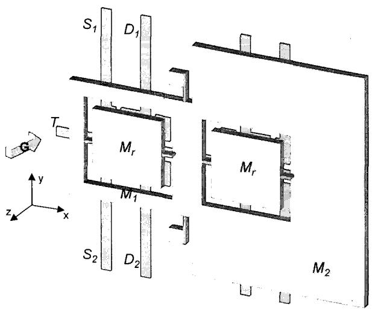  
Fig. 1. Schematic diagram of the differential resonant accelerometer (DRXL).

Using this scheme, the external acceleration $(G)$ produces the average gap variation $(\delta)$ between the resonant vibrating mass $(M_r)$ and the bottom electrodes because of the asymmetric mass $(M1, M2)$ distribution. And the gap variation $(d_x)$ in each resonator changes the effective stiffness $(k_{effx})$ of the resonator and also resonant frequency $(f_{rx})$ consequently. Because of the complementary gap variations, the resultant resonant frequency outputs are mutually differential.

# 3. OPERATIONAL PRINCIPLES AND DYNAMICS SIMULATION

The schematic diagram for the inner resonator of one side is given in Fig. 2. Note that the resonator parameter for the other side is the same one except that the average gap between the upper resonator plate and the bottom plate is different when external acceleration is applied.

The plant dynamics of the resonator is given as

$$
\tau_ {e f f _ {x}} = I _ {x} \ddot {\theta} _ {x} + D _ {x} \dot {\theta} _ {x} + k _ {e f f _ {x}} \theta_ {x}, \qquad (1)
$$

where $\tau_{\text{eff}_x}$ is the torque applied to the resonator and $I_x, \theta_x, D_x,$ and $k_{\text{eff}_x}$ represent inertia, tilt angle, damping coefficient, and net elastic coefficient of the resonator, respectively. The $\tau_{\text{eff}_x}$ is given as the difference between the electrical torque and the applied mechanical torque,

$$
\begin{array}{l} \tau_ {e f f _ {x}} = \tau_ {m _ {x}} - \tau_ {e _ {x}} = \theta_ {x} \cdot k _ {e f f _ {x}} \\ = \theta_ {x} \cdot \left(k _ {m _ {x}} - \frac {2 R _ {S} ^ {2} \cdot \varepsilon \cdot A _ {S} \cdot V _ {S} ^ {2}}{d _ {x} ^ {3}}\right), \tag {2} \\ \end{array}
$$

where $k_{m_x}, R_S, \varepsilon, A_S, V_S,$ and $d_x$ represent mechanical elastic coefficient, the distance between center of resonator and that of sensing electrode, dielectric constant, the area of the sensing electrode, the applied bias voltage, and the gap between upper resonator plate and bottom plate, respectively.

Then the resonance frequency is approximately given as

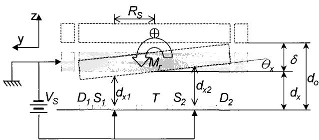  
Fig. 2. Schematic for inner resonator.

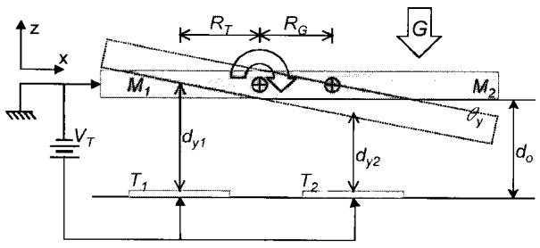  
Fig. 3. Schematic for outer gimbals.

$$
\begin{array}{l} f _ {r _ {x}} = \frac {1}{2 \pi} \cdot \sqrt {\frac {k _ {\text {e f f} _ {x}}}{I _ {x}}} \tag {3} \\ = \frac {1}{2 \pi} \cdot \sqrt {\frac {1}{I _ {x}} \left(k _ {m _ {x}} - \frac {2 R _ {S} ^ {2} \cdot \varepsilon \cdot A _ {S} \cdot V _ {S} ^ {2}}{d _ {x} ^ {3}}\right)}. \\ \end{array}
$$

Note that the effective stiffness $(k_{\text{eff}})$ of this electromechanically-biased resonator can be changed by a variable gap $(d_x)$ .

When the external acceleration is applied to the DRXL as shown in the Fig. 3, the outer mass $(M1,M2)$ is tilted due to the asymmetric mass distribution as follows

$$
\theta_ {y} = \frac {\tau_ {G}}{k _ {e f f _ {y}}} = \frac {\left(M _ {1} + M _ {2}\right) \cdot G \cdot R _ {G}}{k _ {m _ {y}} - \frac {2 R _ {T} ^ {2} \cdot \varepsilon \cdot A _ {T} \cdot V _ {T} ^ {2}}{d _ {0} ^ {3}}}, \tag {4}
$$

where $\theta_y, \tau_G, k_{m_y}, k_{eff_y}, R_G, R_T, A_T, V_T,$ and $d_0$ represent tilt angle of the outer mass, the applied torque due to the external acceleration and mass asymmetry, the mechanical elastic stiffness of the supporting spring of the outer gimbals, the difference of $k_{m_y}$ and the electrical stiffness of the outer gimbals, the distance between rotation axis and the mass center of the outer gimbals, the distance between rotation axis and the center of the inner resonator plate, the area of the tuning electrode, the applied tuning voltage, and the nominal gap between outer mass plate and bottom plate, respectively.

Fig. 4 shows the MATLAB simulation results. As shown clearly in the figure, the G sensitive resonant frequency of each resonator has a large non-linearity but the resultant linearity is fairly improved by taking the frequency differences as the output. Since the electrostatic stiffness changing effect of the proposed accelerometer has a merit that its nominal resonant frequency can be tuned electrically, we can finely adjust the sensitivity of the resonant accelerometer at the final stage. Furthermore the electrical tuning effectively compensates for the performance deviation due to the fabrication error.

For the fabrication of the structure, we used $40\mu \mathrm{m}$

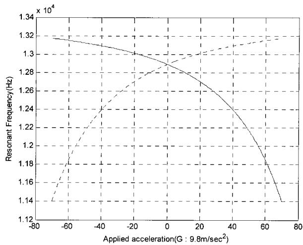

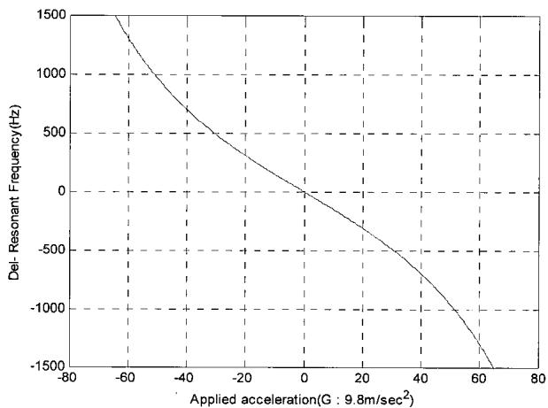  
(a) Resonant frequency vs. applied acceleration(G).   
(b) Frequency differences vs. applied acceleration(G).   
Fig. 4. Matlab simulation results.

thick epitaxially grown polysilicon as structural layer and sealing area. With the exception of the CMP process, which is required for smoothing the bonding area, most processes are simple as the conventional surface micromachining process.

By the way, the well-known squeeze film effect can cause a nonlinear damping coefficient. To avoid the nonlinear dynamics of damping term, we introduced three ideas. First, using the vacuum packaged device, we obtained a low ambient pressure about $200 \times 10^{-3}$ Torr and a high quality factor for the mechanical resonant characteristics. The low pressure in the vacuum packaged device also results in a reduced noise floor caused by Brownian motion. Next, the etch holes over the entire surface of mass reduces the squeeze film effect on the vertical movement of mass. Finally, the vertical amplitude of electrostatic vibration is designed to be less than $10\%$ of the nominal gap. With these techniques, we greatly reduced the squeeze film effect and could regard the damping coefficient as a first order model, which can be calculated by the quality factor.

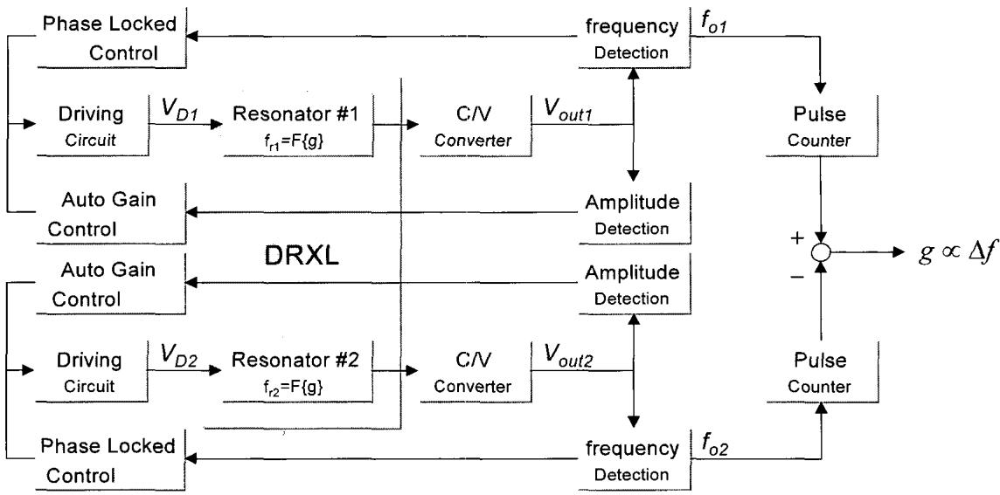  
Fig. 5. Block diagram of the self-sustained oscillation loop for DRXL.

# 4. OSCILLATION LOOP ANALYSIS AND DESIGN

In this section, a nonlinear feedback system is analyzed to provide fundamental design methodology for each internal resonator in the DRXL structure. Since the DRXL system, in principle, requires separate dynamics for internal resonators, each feedback loop for self-sustained oscillation is constructed to generate acceleration dependent output frequency. For this, each internal resonator having the same dynamical characteristics is designed, and then hybrid configuration to combine respective output is devised. The former part of this section illustrates the schematic diagram to complete the differential pickoff strategy for the DRXL system, and the latter part shows basic modeling and loop analysis of the oscillation loop in detail.

Fig. 5 shows the devised pick-off principle of the complete DRXL system. The schematic diagram shows signal sensing part and actuator driving part of DRXL in conceptual blocks, where each feedback loop is composed of gain and phase component for self-generated and sustained oscillation.

The oscillation loop is designed using an analytical result based on the describing function method, since the fundamental principle of harmonic balance equation fairly simplifies the nonlinear system analysis. Furthermore, the quasi-linearized describing function method provides stability analysis methodology and error bound analysis due to quasi-linearization through the strict theoretical development. Therefore the describing function technique can be further used to provide optimality criterion for uncertainty minimization in the limit cycle by using an operator theoretic approach.

To utilize the efficient analysis methodology, a

general assumption is adopted, e.g., odd-symmetric hard nonlinearity in the loop which is a feasible condition for DRXL system. The plant dynamics is referred by Section 3 and the equation development follows the operator-theoretic result.

The configuration for the nonlinear feedback system is given in the Fig. 6. In the figure, $G(s)$ is the transfer function of plant given in (1) and the $\psi$ is a nonlinearity to be designed in the feedback connection. Particularly, the phase delay block $\psi_d(\cdot)$ is included to make a complex-valued describing function and used as a design parameter. Now assuming the existence of a periodic signal in the loop, the nonlinearity $\psi (\cdot)$ is supposed to be a memoryless, odd-symmetric, and slope bounded nonlinearity such that

$$
c _ {1} \left(x _ {A} - x _ {B}\right) \leq \left[ \psi \left(x _ {A}\right) - \psi \left(x _ {B}\right) \right] \leq c _ {2} \left(x _ {A} - x _ {B}\right) \tag {5}
$$

for all real variables $x_{A}$ and $x_{B}$ , where $x_{A} \geq x_{B}$ for slope bounds $c_{1}$ and $c_{2}$ . The previous conditions on $\psi(\cdot)$ bring on a simpler representation at the quasi-linearization, since its describing function becomes a single-valued, real and frequency independent function. Now the loop equation in Fig. 6

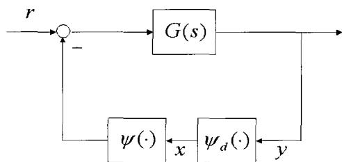  
Fig. 6. Nonlinear feedback system for DRXL inner resonator.

is given as

$$
- G \psi \left(\psi_ {d} (y)\right) = y. \tag {6}
$$

Also, due to the nonlinearity conditions, the loop solution of (6) can be assumed to be half-wave symmetric, i.e., represented by

$$
y (t) = a \cdot \sin \omega t (= y _ {1} (t)) + \sum_ {k > 1, o d d} ^ {\infty} a _ {k} \sin k \omega t (= \eta (t)), (7)
$$

where the right-hand side is sum of a dominant sinusoid denoted by $y_{1}(t)$ and its higher-order harmonics term, $\eta (t)$ . Using the assumed solution for the loop and disregarding the higher-order harmonic term, then the describing function technique simplifies the loop equation in equation (6) into the first-order harmonic balance, namely

$$
1 + G (j \omega) \Psi_ {N} (a) \cdot e ^ {j \phi} = 0, \tag {8}
$$

where $\Psi_N(\cdot)$ denotes the describing function of $\psi(x)$ and phase delay appears as a complex-valued term. Note that the nominal limit cycle point is achieved as the solution pair $(a_0, \omega_0)$ of (8), and the phase delay $\phi$ is used to define the expected limit cycle point. The sector higher bounded $c_2$ is set to $5 \times 10^6$ so that (8) has a nontrivial solution, i.e., a limit cycle to exist, and $c_1$ is set to zero for convenience, usually.

With the predefined parameters, the oscillation loop can be further elaborated to obtain the design factor of optimally undistorted sinusoid. This can be shown by deriving the inequality that the ratio between the magnitude of higher order terms and the amplitude of dominant sinusoid is given by

$$
\left\| \eta \left(x _ {1}\right) \right\| \leq \frac {\frac {c _ {2} - c _ {1}}{2}}{\left| \frac {c _ {1} + c _ {2}}{2} + G ^ {- 1} (j 3 \omega) \right| - \frac {c _ {2} - c _ {1}}{2}} \cdot \left\| x _ {1} \right\|, \tag {9}
$$

which is referred to [10,11]. Since the higher-order solution is regarded as a perturbation from the viewpoint of principal sinusoid, it should be minimized to reduce the uncertainty of output frequency. With this loop design criterion, the phase shift $\phi$ is used to minimize the bound of $\| \eta (x_1)\|$ in (9), since the uncertainty bound is determined by the nominal solution of (8). The minimal higher order terms with regards to principal amplitude is numerically obtained when $\phi$ is near $3\pi /2$ . Therefore the derived nonlinearity in the feedback connection of Fig. 6 is sector bounded saturator with

phase delay. Amplifier with saturation and phase shifter is used for the nonlinearity implementation. The gain of the amplifier and the phase shift are chosen so that the higher bound of the sector equals $5 \times 10^{6}$ and $\phi$ is near $1.5 \times \pi$ .

Finally regarding the stability of the oscillation loop, since points, which are near the limit cycle solution $(a_0,\omega_0)$ and along the increasing- $a$ side of the curve $-1 / \Psi_N(a)$ , are not encircled by the curve $G(j\omega)\cdot \mathrm{e}^{j\phi}$ , thus the corresponding limit cycle is quasi-statically stable, as given in [12].

# 5. PERFORMANCE TEST

# 5.1. Open loop characteristics of DRXL

The surface micromachined sensor is fabricated by epitaxially grown and polished thick polysilicon process. To implement system in an ambient environment, the vacuum packaging process by the anodic bonding of sensor and glass cap wafer is applied. And the hermetic sealing cap structure is made of Pyrex #7740 glass with Ti layer as gas capturing material. After dicing a bonded wafer, each packaged DRXL die is attached to a 16pin DIP ceramic holder for the instrumentation.

There are two significant issues in the pragmatic instrumentation for the DRXL performance test. One thing is to detect minute capacitance variation for the pickoff of displacement change. The other thing is to maintain low ambient pressure for the distinct resonance characteristics of the mechanical system. Each problem is resolved as follows. In the first to convert the minute gap change due to acceleration input to the voltage difference, a precision charge amplifier with little current leakage is implemented, as in Fig. 10. Secondly, the micro electromechanical structure is packaged into a vacuum sealed frame, as shown in Fig. 7.

To estimate the inside pressure of the vacuum packaged DRXL, the $Q$ -factor of the unpacked device with a variation of ambient pressure is measured. For

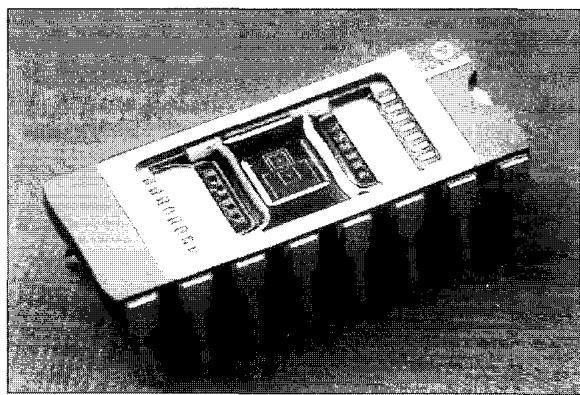  
Fig. 7. Photograph of the packaged DRXL chip.

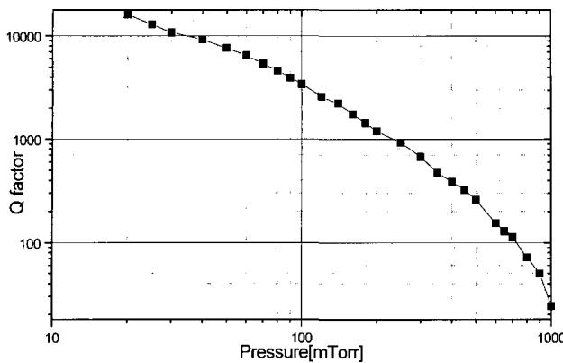  
Fig. 8. Resonance characteristics as a function of the ambient pressure.

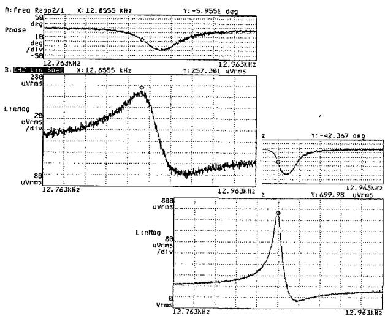  
Fig. 9. Illustrative example of resonance characteristics of vacuum packaged DRXL device (upper: without Ti layer, lower: glass bonding with Ti layer).

this experiment, test setup is devised using a small vacuum chamber, in which driving and charge amplifier circuits are equipped for the signal detection with low external noise level. Fig. 8 shows the inner resonator's $Q$ -factor of the proposed DRXL as a function of the ambient pressure from $20~\mathrm{mTorr}$ to 1 Torr. For the high sensitivity of the resonant device, the $Q$ -factor should be about $1\times 10^{3}$ , and this corresponds to the inside pressure below than 200 mTorr. The result of the resonance property in Fig. 8 is feedback to determine internal pressure of vacuum packaged DRXL device.

Fig. 9 shows resonance characteristics of the vacuum packaged device. Silicon and glass wafer are bonded together at $5 \times 10^{-5}$ Torr ambient pressure. But after bonding, $Q$ factor was less than $1 \times 10^{2}$ , thus pressure inside the packaged devices was estimated to be about $800\mathrm{mTorr}$ . Mainly this poor vacuum pressure is due to the outgassing at the bonding interface between the glass and poly-silicon wafer. To

resolve the outgassing problem, a Ti layer is evaporated to the glass cavity as gas capturing material. The upper left and lower right display of Fig. 9 shows the resonance characteristics before and after Ti layer evaporation, respectively. The internal pressure of vacuum packaged DRXL is highly improved by depositing Ti layer, where the $Q$ factor is increased more than 10 times and the estimated inside pressure is about $200\mathrm{mTorr}$ .

# 5.2. DRXL performance test with a closed-loop implementation

After observing open loop characteristics of DRXL through vacuum package and precision charge amplifier, a feedback oscillation loop is implemented using discrete element as shown in Fig. 10. To detect minute change of the capacitance due to the gap variation, a precision charge amplifier is devised which can measure an electrical capacitance of subfemto farads.

The nonlinearity in Fig. 10 is realized by cascading phase shifter and Schmitt trigger. The proper phase shift is obtained by tuning a resistor in the phase-shift circuit. The sector-bounded saturated amplifier is obtained by setting the feedback nodes of the Schmitt trigger circuit, with desirable slew rate, to open. After down-gaining the saturation output, it is added to the gap tuning bias and finally feedback to the driving electrode of mechanical structure.

Fig. 11 shows the open loop resonance characteristic of the DRXL used as test device. It is seen that the nominal resonant frequency is about $12.532\mathrm{kHz}$ , signal to noise ratio (SNR) is about $25\mathrm{dB}$ , and the quality factor is about 250.

After phase and gain of the feedback components are fixed, the oscillation loop activates a resonance through the initial white noise in the driving voltage. The warming time to resonance is less than $30~\mathrm{ms}$ which is near to the system settling time.

Fig. 12 shows an output of the constructed loop in the frequency domain. From Fig. 10, a $Q$ -factor of

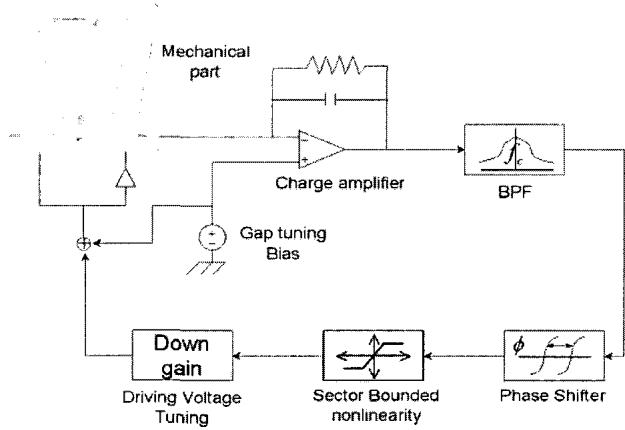  
Fig. 10. Circuit diagram for the feedback system.

40000 is obtained, which shows quite an improved resolution compared to that of the sensing device only.

The acceleration sensitivity was measured by tumble test with applying $2.5\mathrm{V}$ on the sensing electrode, and the result is shown in Fig. 13. The nominal resonant frequency is $12,532\mathrm{Hz}$ and the sensitivity is $12\mathrm{Hz / g}$ for an internal resonator.

Noting that the other side has also complementary output frequency, the sensitivity can be doubled when the both resonators are used, which means the gravity

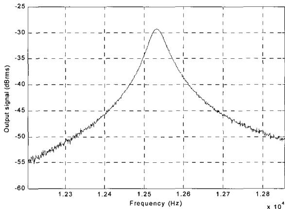  
Fig. 11. Resonant characteristic of the DRXL.

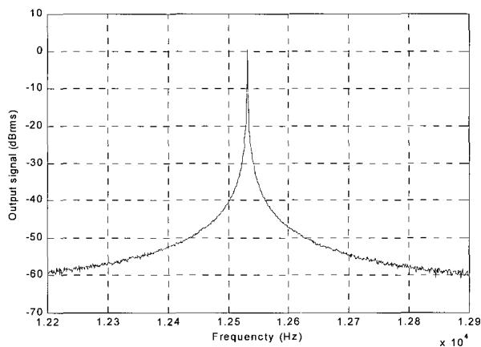  
Fig. 12. Output characteristics of the DRXL with self-oscillation loop.

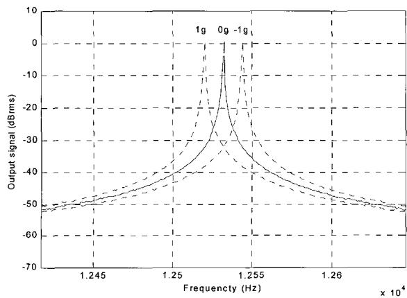  
Fig. 13. Tumble test result of the DRXL.

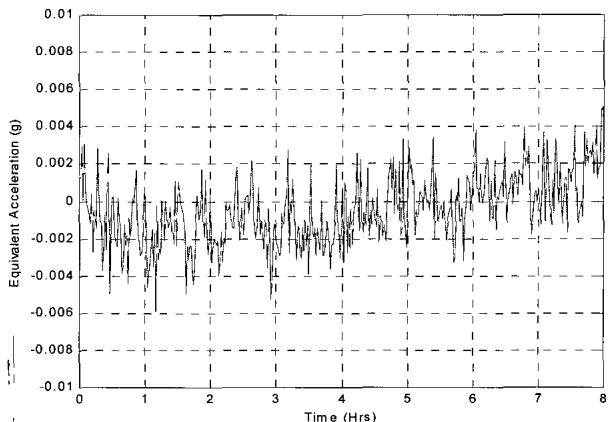  
Fig. 14. Output bias stability of DRXL.

Table 1. Performance test results.   

<table><tr><td>Parameters</td><td>Value</td><td>Notes</td></tr><tr><td>Nominal frequency</td><td>12532Hz</td><td>DC Bias dependent</td></tr><tr><td>Sensitivity</td><td>24Hz/g</td><td></td></tr><tr><td>Dynamic range</td><td>-70g ~ 70g</td><td></td></tr><tr><td>Linearity</td><td>&lt;3% F.S.</td><td></td></tr><tr><td>Bias drift</td><td>2 mg</td><td>1 sigma, 10h</td></tr><tr><td>Bandwidth</td><td>About 100Hz</td><td>3dB attenuation</td></tr><tr><td>Resolution</td><td>0.1 mg</td><td></td></tr><tr><td>Operating temperature</td><td>-40℃ ~ 70℃</td><td>Fixed sensitivity</td></tr></table>

sensitivity of $24\mathrm{Hz / g}$

Fig. 14 shows the static bias drift of the DRXL when zero gravity is applied. The obtained equivalent bias drift is about $2\mathrm{mg}$ of $1\sigma$ standard deviation calculated from output data for 10 hours.

Performance test results of DRXL are summarized in Table 1. The results demonstrate that the reliability and robustness of the implemented accelerometer system are achieved by implementing the designed oscillation loop.

# 6. CONCLUSION

A differential type MEMS resonant accelerometer, which utilizes the electromechanical stiffness changing effect of inner resonator with torsional axis detection and vibration, is proposed. The accelerometer has complementary resonant structures, which improves the output linearity and sensitivity.

The application of quasi-linearization simplifies the oscillation loop analysis and further operator theoretic approach provides a design methodology to be used for DRXL system. The oscillation loop is implemented by combining feedback nonlinearity and detection circuit using discrete electronic components.

Practically, the implemented oscillation loop provides autonomous and stable guidance into system's oscillation status.

The basic test shows that the internal pressure of the vacuum packaged device is about $200\mathrm{mTorr}$ and the $Q$ -factor is about $1\times 10^{3}$ . Various performance tests show that the bias stability is about $2\mathrm{mg}$ with $24\mathrm{Hz / g}$ sensitivity and $\pm 70\mathrm{g}$ dynamic range, which demonstrates the feasibility of high quality and low cost vacuum packaged MEMS accelerometer.

# REFERENCES

[1] B. L. Lee, C. H. Oh, Y. S. Oh, and K. Chun, “A novel resonant accelerometer; Variable electrostatic stiffness type,” Proc. of International Conference on Solid State Sensors and Actuators, Sendai, pp. 1546-1549, 1999.   
[2] L. Lee, C. H. Oh, S. Lee, Y. S. Oh, and K. Chun, "A vacuum packaged differential resonant accelerometer using gap sensitive electrostatic stiffness changing effect," Proc. of the 13th International Conference on MEMS, Miyazaki, pp. 352-357, January 2000.   
[3] S. Sung, J. G. Lee, T. Kang, and J. W. Song, "Design and analysis of nonlinear feedback loop for a resonant accelerometer," Proc. of European Control Conference, Porto, pp. 1906-1911, September 2001.   
[4] B. L. Norling, "Superflex: A synergitic combination of vibrating beam and quartz flexure accelerometer," Journal of the Institute of Navigation, vol. 34, no. 4, pp. 337-353, 1988.   
[5] D. W. Burns, R. D. Horning, W. R. Herb, J. D. Zook, and H. Guckel, "Resonant microbeam accelerometer," Proc. of International Conference on Solid-State Sensors and Actuators (Transducers '95), pp. 659-662, 1995.   
[6] T. A. Rossig, R. T. Howe, A. P. Pisano, and J. H. Smith, "Surface-micromachined resonant accelerometer," Proc. of International Conference on Solid State Sensors and Actuators (Transducers '97), pp. 869-862, 1997.   
[7] M. A. Meldrum, "Application of vibration beam technology to digital acceleration measurement," Sensor and Actuators, vol. A21-A23, pp. 377-380, 1990.   
[8] T. V. Roszhart, H. Jerman, J. Drake, and C. de Cotiis, "An inertial-grade, micromachined vibrating beam accelerometer," Proc. of the 8th International Conference on Solid-State Transducers and Actuators (Transducers '95), pp. 659-662, 1995.   
[9] Y. Omura, Y. Nonomura, and O. Tabata, "New resonant accelerometer based on rigidity change," Proc. of International Conference on Solid State Sensors and Actuators (Transducers

97), pp. 855-858, 1997.   
[10] G. S. Krenz and R. K. Miller, "Qualitative analysis of oscillation in nonlinear control systems: A describing function approach," IEEE Trans. on Circuits and Systems, vol. 33, no. 5, pp. 562-566, May 1986.   
[11] S. Sung, A Feedback Loop Design for MEMS Resonant Accerlerometer Using a Describing Function Technique, Ph.D. Thesis, Seoul National University, February 2003.   
[12] J. E. Slotine and W. Li, Applied Nonlinear Control, Prentice-Hall Inc., Englewood Cliffs, New Jersey, 1991.

Sang Kyung Sung received the B.S., M.S., and Ph.D. degrees in Electrical Engineering from Seoul National University in 1996, 1998, and 2003, respectively. He worked for Telecommunication Network Division, Samsung Electronics before he joined Konkuk University and is now an Assistant Professor of Department of

Aerospace Information System Engineering, Konkuk University. His research interest includes nonlinear and robust control, sensor and navigation system, mobile networking and positioning, telematics and mobile system application.

Chul Hyun received the B.S. degree in Electrical Engineering from Seoul National University in 2001. Now he is a doctoral course graduate student of School of Electrical Engineering, Seoul National University. His main research interest is micro inertial sensor, oscillation system and nonlinear control.

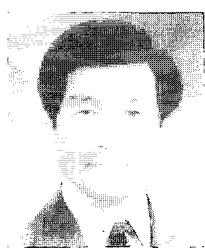

Jang Gyu Lee is a Professor of School of Electrical Engineering, Seoul National University. He received the B.S. degree from Seoul National University in 1971 and M.S. and Ph.D. degrees from the University of Pittsburgh in 1974, 1977, respectively. He worked for the Analytic Sciences Corporation in Reading Massachusetts,

and the Charles Stark Draper Lab in Cambridge, Massachusetts, before he joined the faculty of the Seoul National University in 1982. His current research area includes the inertial navigation system, micro inertial sensors, automated guided vehicle, parameter identification and target tracking systems.