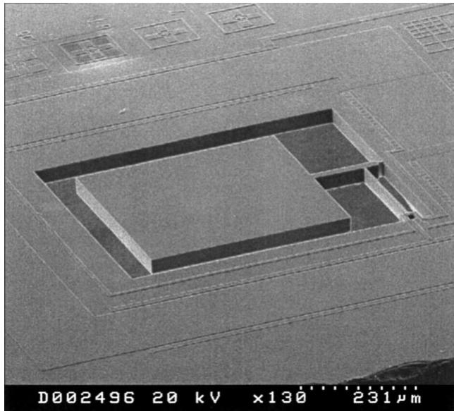
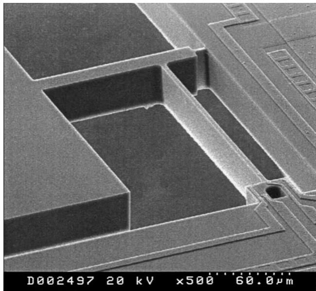
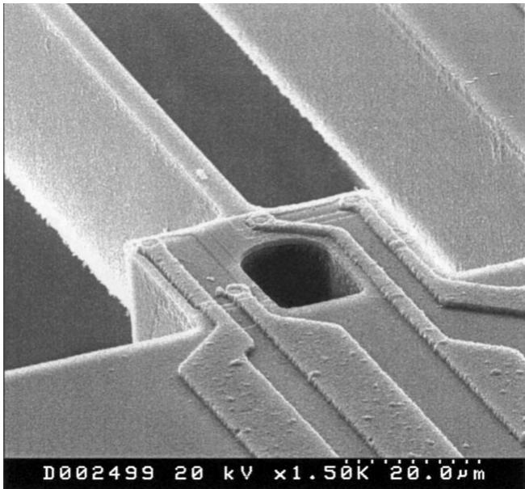
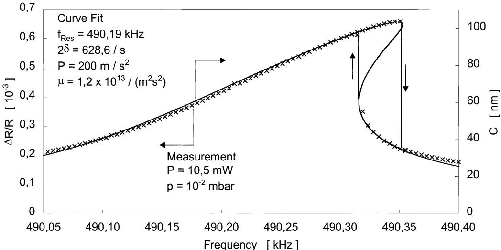
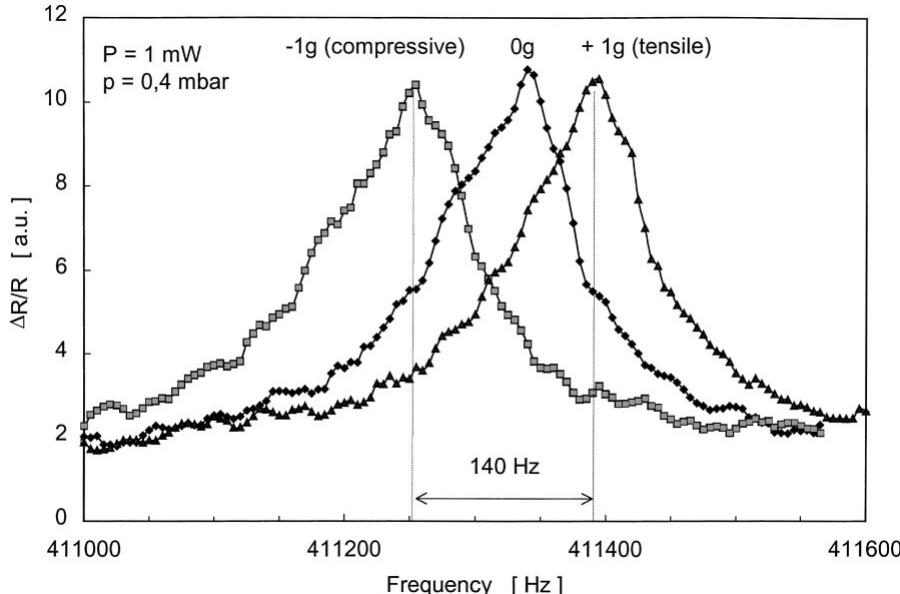
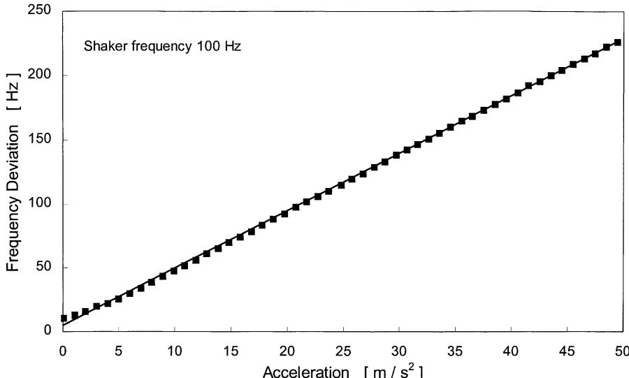
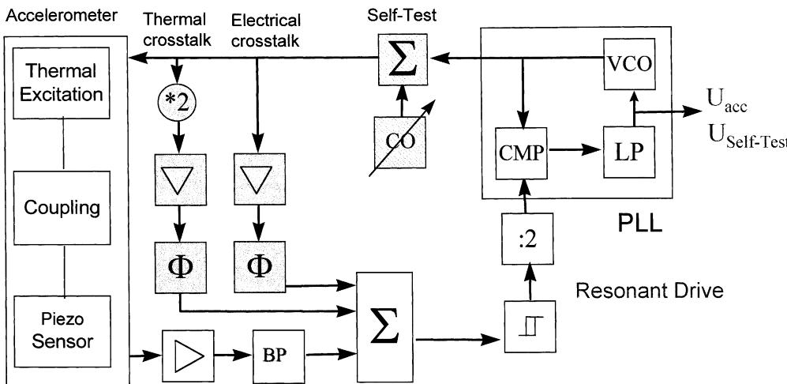
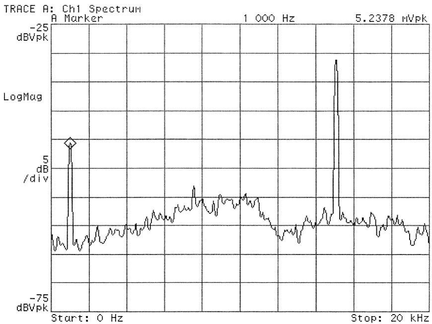

# Resonant accelerometer with self-test

M. Aikele $^{a,\ast}$ , K. Bauer $^{b}$ , W. Ficker $^{b}$ , F. Neubauer $^{c}$ , U. Prechtel $^{b}$ , J. Schalk $^{b}$ , H. Seidel $^{a}$

aTemic Telefunken Microelectronic, GmbH, L/B5/SF/E, Sensor Systems, P.O.B. 800465, 81663 Munich, Germany

$^{b}$ EADS, Research and Technology, Microsystems, 81663 Munich, Germany

$^{c}$ DaimlerChrysler, Mercedes-Benz Technology Center, 71059 Sindelfingen, Germany

Accepted 5 December 2000

# Abstract

A new resonant accelerometer is presented consisting of a doubly clamped beam coupled to a seismic mass. The beam is thermally excited by an implanted resistor and its vibration is sensed piezoresistively. An acceleration which deflects the seismic mass leads to characteristic strains inside the resonator, shifting its resonance frequency. We studied the oscillation characteristics of the resonant beam. The non-linearity at high excitation amplitudes is treated theoretically and experimentally. Further, it is shown that the electrical and thermal cross-talk can be eliminated. The resonant sensing principle ensures a quasi-digital output signal, high sensitivity and a mechanical integrity test. Advanced automotive safety systems and $x$ -by wire applications require a high reliability of the employed sensors. The sensor presented here allows an on-going self-test without any constructive changes of the sensor element. The self-test concept, we developed also finds applications in other sensors with resonant structures. © 2001 Elsevier Science B.V. All rights reserved.

Keywords: Accelerometer; Self-test; Resonant; Thermal excitation; Mechanical oscillator; Duffing oscillator

# 1. Introduction

Automotive electronic systems like airbag, vehicle dynamic systems, $x$ -by wire systems require accelerometers which are highly reliable, shock resistant and operate unperturbed in the frequency range of vehicle vibrations. In the same time, they should be available in high volumes at low prices. It is widely accepted that silicon accelerometers meet these expectations [1]. A relatively new concept for MEMS accelerometers is to use a resonant read-out concept [2,3]. Such an approach ensures a quasi-digital output signal, and a first mechanical integrity test. Another interesting approach is the thermal excitation as actuating principle for resonant structures [4-6]. It was shown that thermal excitation is an elegant actuation principle implementable in most MEMS technologies. Because of the short thermal relaxation times high frequency excitation may be performed [7].

We present here a resonant accelerometer with thermal excitation of a laterally vibrating beam. The sensitive axis of the accelerometer lies in the wafer plane. This sensor exhibits a good sensitivity, has a high frequency of its first

harmonic, and wide bandwidth at a comparably small chip area.

# 2. Operation principle

The accelerometer consists of a resonator and a laterally movable seismic mass (Figs. 1 and 2). The resonator is a doubly clamped beam thermally excited by an implanted resistor with a sinusoidal voltage. Its vibrations are sensed by a piezoresistor. The dimensions of the beam and of the seismic mass are about $200\mu \mathrm{m}\times 3\mu \mathrm{m}$ and $400\mu \mathrm{m}\times$ $400\mu \mathrm{m}$ , respectively. The whole structure has a depth of approximately $30~{\mu\mathrm{m}}$ . The resonance frequency of the first mode of the beam was found around $400\mathrm{kHz}$ which is in good agreement with analytical calculations [8] and FE simulations. The seismic mass is suspended from the bulk by a cantilever of $30\mu \mathrm{m}\times 130\mu \mathrm{m}$ and a hinge of $4\mu \mathrm{m}\times 8\mu \mathrm{m}$ . The main axis of sensitivity is determined by the shape of the hinge. The cantilever is coupled to the resonating beam such that a leverage ratio of about 10:1 is achieved. An acceleration that deflects the mass laterally, induces a tensile or compressive strain inside the resonator shifting its resonance frequency.

The first natural frequency of the whole mechanical structure lies at approximately $17\mathrm{kHz}$ . Therefore, this

  
Fig. 1. SEM-shot of the sensor element with its seismic mass in the centre.

accelerometer is insensitive to vehicle vibrations which have a typical frequency range below $5\mathrm{kHz}$ .

# 2.1. Thermal excitation of the mechanical structure

A thermal excitation of a mechanical structure in the wafer plane (lateral) was presented in [9]. However, it relies on heating large structures, implying the disadvantage of long thermal relaxation times. The maximum frequency amounts to a few $100\mathrm{Hz}$ .

The beam resonator of our accelerometer is thermally excited to a lateral vibration by an implanted resistor. Its

  
Fig. 2. SEM micrograph. Detailed view of the vibrating beam, the hinge and the U-structure for excitation and detection.

  
Fig. 3. SEM micrograph of the U-shaped structure for excitation and signal pick-up.

movement is also detected by an implanted piezoresistor. These two elements are situated on a U-shaped structure that favours the vibration of the beam in the wafer plane. This U-shaped structure can be found on the SEM micrographs (Fig. 3). For excitation, we use a sinusoidal voltage. Each half-wave of this voltage leads to an expansion of the material. This results in a frequency doubling of the mechanical oscillation. The same result is obtained by arguing that the power is proportional to the square of the voltage.

The first lateral natural frequency of approximately $400\mathrm{kHz}$ as well as the second natural frequency in the same plane at about $1.2\mathrm{MHz}$ are easily excited by the employment of the U-structure.

For different widths of the resonating beam, we compared the analytically calculated [8] eigenfrequencies of the lowest lateral mode with the corresponding measured frequencies of sensor samples. We show the results in Table 1. The accuracy of the calculated data is mainly determined by the error in measurement of the geometrical dimensions of the beam. It amounts to approximately $20\mathrm{kHz}$ . The slight uncertainty of the measured frequencies lies at a few Hertz.

For the operation of the sensor, it is important to study the quality factor $Q$ of the resonator. At atmospheric pressure we

Table 1 Comparison of analytically calculated and measured resonant frequencies for different levels of the beam width   

<table><tr><td rowspan="2">Width of the beam (μm)</td><td colspan="2">Resonant frequency (kHz)</td></tr><tr><td>Calculations</td><td>Measurements</td></tr><tr><td>1.94</td><td>257</td><td>258</td></tr><tr><td>2.84</td><td>407</td><td>412</td></tr><tr><td>3.87</td><td>586</td><td>580</td></tr></table>

found $Q \approx 100$ and we reached the maximum $Q$ of 60 000 at 0.01 mbar.

# 2.2. Theory of beam-operation

This paragraph is concerned with the modelling of the resonant beam. Special attention is given to the region of non-linear behaviour of the resonator and the derivation of the third-order term of the differential equation. Even though its physics is very interesting this region is avoided in sensor applications.

The transverse deflection $w(x,t)$ of a free vibrating beam is described by a linear partial differential equation [10], where $x$ and $t$ describe the axial position and the time, respectively. It can be assumed that the response $w(x,t)$ of the beam consists of a time-dependent term $q(t)$ and a position-dependent term $y(x)$ . Roessig [11] proves that the time-dependent part $q(t)$ obeys the differential equation of the harmonic oscillator if effective values for the mass $M_{\mathrm{eff}}$ and stiffness $K_{\mathrm{eff}}$ are introduced.

Taking into account the change of length, $\Delta L$ , of the doubly clamped beam, we calculate the resulting additional restoring force $F_{3}$ for small amplitudes of vibration. In this case, we can write for $\Delta L$

$$
\Delta L \approx \frac {1}{2} \int_ {0} ^ {L} \left(\frac {\mathrm {d} w (x , t)}{\mathrm {d} x}\right) ^ {2} \mathrm {d} x \tag {1}
$$

The variation of the length is connected to a variation of the potential energy $\Delta U$

$$
\Delta U = \frac {E A}{2 L} \Delta L ^ {2} \tag {2}
$$

where $E$ is the modulus of elasticity, $A$ the area of the cross-section and $L$ is the length of the undeflected beam. The resulting additional restoring force $F_{3}$ can be calculated by deriving $\Delta U$ with respect to the local deflection $q(t)$ . We obtain

$$
F _ {3} = K _ {3} q (t) ^ {3} \quad K _ {3} = \frac {E A}{L} \left(\int_ {0} ^ {L} y ^ {\prime} (x) ^ {2} \mathrm {d} x\right) ^ {2} \tag {3}
$$

Using this expression, we get the following differential equation, which describes the driven Duffing oscillator:

$$
\ddot {q} (t) + 2 \delta \cdot \dot {q} (t) + \omega_ {0} ^ {2} \cdot q (t) + \mu \cdot q (t) ^ {3} = P (t) \tag {4}
$$

where $\delta$ is the damping coefficient, $\omega_0^2 = K_{\mathrm{eff}} / M_{\mathrm{eff}}$ , $P(t) = F(t) / M_{\mathrm{eff}}$ , and $\mu = K_3 / M_{\mathrm{eff}}$ .

With a harmonic driving term $P(t)$ of frequency $\Omega$ , we get a relationship [12] between the driving amplitude $P$ and the resulting local amplitude of the beam oscillation $C$

$$
P ^ {2} = \left[ \left(\omega_ {0} ^ {2} - \Omega^ {2}\right) C + \frac {3}{4} \mu C ^ {3} \right] ^ {2} + \left(2 \delta \Omega C\right) ^ {2} \tag {5}
$$

The resonant frequency $\omega_{\mathrm{NL}}$ of the non-linear oscillator is

$$
\omega_ {\mathrm {N L}} = \sqrt {\omega_ {0} ^ {2} + \frac {3}{4} \mu C ^ {2}} \approx \omega_ {0} \left(1 + \frac {3}{8} \frac {\mu}{\omega_ {0} ^ {2}} C ^ {2}\right) \tag {6}
$$

For $\mu \rightarrow 0$ , Eqs. (5) and (6) give the well-known results of the harmonic oscillator. For $\mu < 0$ , the restoring force and the resonant frequency are smaller (soft spring) than in the linear case.

In the case of our beam $\mu$ and $K_{3}$ are always positive as indicated by Eq. (3). For our geometry, the numeric value for the coefficient of the non-linearity is $\mu \approx 1.5\times 10^{13} / (\mathrm{m}^2\mathrm{s}^2)$ . Thus, the resonant frequency is shifted upwards, which is known as the hard spring effect. The Duffing oscillator is also known to show a hysteresis effect which we found in our experimental investigations described in Section 3. The minimum peak amplitude of the resonator which is required to observe hysteresis can be found in [13].

Another interesting point is the relationship between the frequency shift due to the non-linearity and the amplitude of the deflected beam. One can show that

$$
\frac {\Delta \omega_ {\mathrm {N L}}}{\omega_ {0}} \approx 0. 0 6 \frac {A}{I} C ^ {2} \tag {7}
$$

where $I$ represents the area moment of inertia. Taking into account that a certain minimal amplitude $C_{\mathrm{min}}$ is necessary to detect the vibration of the beam, we obtain an estimate of the expected frequency shift caused by the non-linearity at fixed geometry of the beam. Particularly for rectangular beams the relative frequency shift decreases with the square of the beam width.

# 3. Measurement results

A comparison of a calculated and a measured resonant curve in the non-linear region is shown in Fig. 4. The crosses represent the measurement data and the solid line is the resonance curve of the beam according to the non-linear model discussed in the Section 2. The eigenfrequency $\omega_0$ and the damping coefficient $\delta$ have been determined experimentally by working with low excitation forces and consequently in the linear region. Their values can also be found in Fig. 4. By comparing the FE-simulation of the thermal excitation of the resonant beam and the measurements of the induced piezovoltages, which are directly related to the mechanical stress we deduce a maximum amplitude of our beam $C_{\mathrm{max}} \approx 100 \mathrm{~nm}$ . In order to determine the experimental value of the non-linearity parameter $\mu$ (Eq. (4)), we fitted our measurement data with the expression given in Eq. (5).

The result is given by the solid line in Fig. 4 and provides $\mu \approx 1.2 \times 10^{13} / (\mathrm{m}^2\mathrm{s}^2)$ . There is a good agreement between the theoretically predicted value of $\mu \approx 1.5 \times 10^{13} / (\mathrm{m}^2\mathrm{s}^2)$ for our beam geometry and the parameter extracted from the experiment. Therefore, it is clearly demonstrated that the non-linearity is caused by a varying length of the beam and can be described by Eq. (3). The non-linear part of the restoring force $K_{3}C_{\mathrm{max}}^{3} / K_{\mathrm{eff}}C_{\mathrm{max}}$ amounts to $0.1\%$ , the relative frequency shift due to non-linearity $\Delta \omega_{\mathrm{NL}} / \omega_0$ (Eq. (7)) to $10^{-4}$ . The experimental measurements of the unloaded resonant beam show an excellent agreement with

  
Fig. 4. Calculated (solid line) and measured (crosses) resonance curve of the beam in the non-linear region.

the predicted resonance characteristic of the Duffing oscillator including its hysteresis.

Next we proceed to the experimental characterisation of the loaded resonant beam namely the function of our system as an accelerometer. Here we choose small excitation amplitudes in order to operate in the quasi-linear region of the resonator. The result of a measurement with applied accelerations of $\pm 1\mathrm{g}$ is shown in Fig. 5 demonstrating the frequency shift of the resonating beam induced by the deflection of the mass. The sensitivity lies at approximately $70\mathrm{Hz / g}$ . The curves are asymmetric due to the uncertainty of the alignment. The symmetry was verified in dynamic measurements.

The behaviour of the accelerometer under sinusoidal time-varying loads up to $5\mathrm{g}$ was investigated (Fig. 6) on a shaker. In this range, the sensor shows an excellent linearity. The smallest detectable acceleration is determined by the chosen

bandwidth. In first experiments, a bandwidth of $10\mathrm{kHz}$ allowed a resolution of at least $0.1\mathrm{g}$ . For this sample, we get a lower sensitivity of $46\mathrm{Hz / g}$ than for the sample investigated in Fig. 5 since the width of the beam and consequently the resonant frequency are higher (Table 1) [6].

# 3.1. Electronics and self-test

The main element of the electronic circuitry (Fig. 7) is the phase locked loop (PLL) oscillator. It is used to control the $90^{\circ}$ phase shift condition of the mechanical resonance of the beam and to demodulate the FM-signal. Here the resonator is driven in the linear region. Consequently, the resonant frequency is independent of the vibration amplitude and a feedback control of the beam amplitude is not necessary. Typical values of the input power are about $2\mathrm{mW}$ .

  
Fig. 5. Measured output signals for different acceleration levels. The sensitivity is $70\mathrm{Hz / g}$

  
Fig. 6. Sensor characteristic of a resonant accelerometer. The sensitivity of this device is $45\mathrm{Hz / g}$

The sensor shows also a coupling between the excitation voltage and the read-out signal which is not related to mechanical vibrations of the beam. This cross-talk can be divided up into two parts. The thermal cross-talk has twice the frequency of the excitation voltage following the same argument as the thermal excitation itself. The main contribution is caused by the temperature gradient on the readout resistor leading to a thermoelectric voltage. The crosstalk resulting from the thermal expansion of the U-shaped structure is negligible. The capacitive coupling between the excitation and read-out signals is the origin of an electric cross-talk which has the same frequency as the excitation voltage. We can eliminate the cross-talk by continuously subtracting its contributions from the output signal of the sensor (shaded in Fig. 7).

The self-test circuitry generates a special test-signature, which is then applied to the thermal actuator in order to generate a superimposed vibration of the mechanical structure. This vibration corresponds to a lateral oscillation of the seismic mass and, therefore, has the same effect as an applied dynamic acceleration. For our geometry, the frequency of this test-acceleration lies at approximately $17\mathrm{kHz}$ . This value is above the frequency spectrum of automotive vibrations and the specified dynamic range of acceleration measurement. Since the frequency of the test mode is essentially independent of the acceleration magnitude expected in the application environment, the actual measurement process has no influence on the self-test signal and a feed back of the self-test answer to CO can be omitted.

  
Fig. 7. Concept of electronic circuitry of the resonant sensor including its self-test (shaded elements). The phase locked loop (PLL) ensures the $90^{\circ}$ phase condition of the resonating beam. It consists of a voltage controlled oscillator (VCO), a comparator (CMP) and a low pass (LP). The tuneable oscillator (CO) is used for the excitation of the self-test mode. A bandpass (BP) serves for noise reduction of the sensor output signal. The elements $*2$ and :2 multiply and divide the frequency by 2, respectively. They are necessary due to the frequency doubling of the thermal excitation.

  
Fig. 8. Spectrum of the read-out signal including the self-test response. The peak at $1\mathrm{kHz}$ indicates the presence of the applied sinusoidal acceleration and the second peak is the answer of the system to the excited test mode.

As shown in Fig. 8, the response to the self-test signal can be separated from the measurement signal and compared to its expected form. An intolerable deviation activates a failure notification.

The presented self-test and the acceleration measurement do not affect each other. It is an on-going self-test which runs simultaneously with the actual acceleration measurement. The above concept also finds application in diagnose functions of other resonant transducers [14].

# 4. Conclusions

We have presented a resonant accelerometer using a laterally vibrating beam as oscillator. The beam is excited thermally by a heating resistor and its vibration is sensed piezoresitively. Both resistors are situated on a U-shaped structure working up to the MHz-range. For high amplitudes of vibration, we found a non-linear region in the resonance curve. A calculation of the additional restoring force gives a third-order term, leading to the Duffing oscillator. The sensitivity of our accelerometer amounts to approximately $70\mathrm{Hz}/$ g. We show an on-going self-test which is based on the fact that the ground mode of the seismic mass and the resonating beam can be excited simultaneously by our thermal actuator.

# References

[1] D.E. Ricken, W. Gessner (Eds.), in: Proceedings of the Advanced Microsystems for Automotive Applications (AMAA), Springer, Berlin, March 1999.   
[2] T.A. Roessig, R.T. Howe, A.P. Pisano, J.H. Smith, Surface-Micromachined Resonant Accelerometer, in: Proceedings of the

International Conference of Solid State Sensors and Actuators, Transducers 1997, Chicago, USA, pp. 859-862.   
[3] T. Kvisteröy, H. Jakobsen, 1998, Force Sensor Device, US Patent 5,834,646.   
[4] D.W. Satchell, J.C. Greenwood, A thermally-excited silicon accelerometer, Sens. Actuators 17 (1989) 241-245.   
[5] T.S.J. Lammerink, M. Elwenspoek, R.H. Van Ouwerkerk, S. Bouwstra, J.H.J. Fluitman, Performance of thermally excited resonators, Sens. Actuators A 21-23 (1990) 352-356.   
[6] T.S.J. Lammerink, M. Elwenspoek, J.H.J. Fluitman, Frequency dependence of micro-mechanical resonators, Sens. Actuators A 25-27 (1991) 685-689.   
[7] Ch. Burrer, J. Esteve, Thermally driven micromechanical bridge resonators, Sens. Actuators A 41-42 (1994) 680-684.   
[8] S. Bouwstra, B. Geijuelaers, On the resonance frequencies of microbridges, in: Proceedings of International Conference of Solid State Sensors and Actuators, Transducers 1991, San Francisco, USA, pp. 538-542.   
[9] C.S. Pan, W. Hsu, An electro-thermally and laterally driven polysilicon microactuator, J. Micromech. Microeng. 7 (1997) 7-13.   
[10] W. Weaver, Jr., S.P. Timoshenko, D.H. Young, Vibration Problems in Engineering, 5th Edition, Wiley, New York, 1992, pp. 363-510.   
[11] T.A.W. Roessig, Integrated MEMS tuning fork oscillators for sensor applications, Dissertation, Berkeley, California, USA, 1998.   
[12] P. Hagedorn, Nichtlineare Schwingungen, Akademische Verlagsgesellschaft, Wiesbaden, 1978, pp. 1-58.   
[13] M.V. Andres, K.W.H. Foulds, M.J. Tudor, Non-linear vibrations and hysteresis of micromachined silicon resonators designed as frequency-out sensors, Electron. Lett. 23 (18) (1987) 952-954.   
[14] S. Sassen et al., Robust and self-testable silicon tuning fork gyroscope with enhanced resolution, in: Proceedings of Advanced Microsystems for Automotive Applications (AMAA), Berlin, 2000, pp. 233-245.

# Biographies

Matthias Aikele received diploma in physics in 1997 and his PhD degree in 2000 from the Eberhard-Karls-University Tuebingen. His research was focused on resonant sensors at TEMIC Sensor Systems in Munich. He is

currently involved in the development of micromachined accelerometers for automotive applications.

Karin Bauer received her MS in physics from the University of Washington in Seattle in 1986 and completed German Diploma in 1988 and PhD in 1991 at the Institute of Applied Physics of the University of Regensburg. Her research was on the structure and transport properties of disordered materials and later in theoretic and applied statistical physics. Since 1994, she works in the field of microsystems in silicon and is now mainly concerned with conceiving, modelling and evaluating microsensors and sensor assemblies and relating them to applications.

Wilhelm Ficker received examination for officially recognised technical engineer in Munich (Germany). Since 1977, he is working in the field of measuring and electronic design. During this time, he has been in the Research and Technology Departments of Messerschmitt-Bölkow-Blohm and DaimlerChrysler which now are part of the EADS.

Frank Neubauer has received diploma in physical electronics from the Fachhochschule Isny (Germany) in 1997. From 1997 to 2000, he worked on electronic design and measuring at the department for Research and Technology at DaimlerChrysler. Since 2000, he has been with IMH — Institute for Motorconstruction (a subsidiary of DaimlerChrysler) and is working at the Mercedes-Benz Technology Centre (MTC) in the

development department for Driving Dynamic Systems. He is responsible for the sensors of new breaking systems.

Ulrich Prechtel received diploma in physics from the Technical University in Munich (Germany) in 1984. In 1985, he joined the Research and Technology Department at DaimlerChrysler, formerly MBB, now EADS. In his first years of industrial employment, he was engaged in the development of different types of radiation sensitive detectors made of high-resistivity silicon. Further work focused on PtSi-infrared focal-plane-arrays. Since 1995, he works in the field of microsystems responsible for development of technology and realisation of silicon-type microsensors.

Josef Schalk received diploma in electrical engineering from the Fachhochschule Muenchen (Germany). Since 1985, he is working in the field of electronic design and measuring. Now he is in charge of the microinertial systems projects. During this time, he has been in the Research and Technology Departments of Messerschmitt-Bölkow-Blohm and DaimlerChrysler which today are part of the EADS.

Helmut Seidel was born in Munich, Germany, in 1954. He received diploma in physics in 1980 from the Ludwig-Maximilian-University in Munich and took his doctorate from the Free University of Berlin in 1986. From 1980 to 1986, he worked on microsystems at the Fraunhofer Institute in Munich. Then he joined the research group of DaimlerChrysler (formerly MBB). Since 1996, he is responsible for microsensors development at TEMIC.