# Design and performance test of an oscillation loop for a MEMS resonant accelerometer

To cite this article: Sangkyung Sung et al 2003 J. Micromech. Microeng. 13 246

View the article online for updates and enhancements.

# You may also like

- Phase synchronization and synchronization frequency of two-coupled van der Pol oscillators with delayed coupling

Hossein Gholzade-Narm, Asad Azemi and Morteza Khademi

- Fiber-based joint time and frequency dissemination via star-shaped commercial telecommunication network

Yi-Bo Yuan, Bo Wang et al.

- Algorithm for evaluating the stability of mechanical structure of a triphibian robot based on reduced-dimensional fuzzy C-means clustering

Zhuoyao Zhang

# Design and performance test of an oscillation loop for a MEMS resonant accelerometer

Sangkyung Sung $^{1}$ , Jang Gyu Lee $^{1}$ , Byeungleul Lee $^{1}$ and Taesam Kang $^{2}$

$^{1}$ School of Electrical Engineering and Computer Science, Seoul National University, Seoul 151-742, Korea

$^{2}$ Department of Aerospace Engineering, Konkuk University, Seoul 143-701, Korea

E-mail: ssk@asrignc3.snu.ac.kr

Received 15 August 2002, in final form 19 November 2002

Published 13 January 2003

Online at stacks.iop.org/JMM/13/246

# Abstract

In this paper, the design, analysis and experimental results of the self-sustained oscillation loop for a tunable surface micromachined resonant accelerometer, ACRC-RXL are presented. The fabrication process of the mechanical structure is also illustrated. For the oscillation loop analysis, an operator-theoretical approach is applied based on the describing function technique. Using the analytical results, feedback parameters are designed and the expected loop performance is characterized. Then the accelerometer system is practically implemented using the mechanical structure and signal processing electronics. The experimental results show that the developed accelerometer has a performance of bias stability of about $0.7\mathrm{mg}$ and a dynamic range over $10\mathrm{g}$ , which satisfies the navigation-graded sensor performance.

# 1. Introduction

With the help of microelectromechanical systems (MEMS) technology, various types of miniaturized accelerometers have been developed. Among these, resonance-type accelerometers are reported to have good properties such as large dynamic range and high sensitivity as well as the advantage of easy interface with digital electronics [1-3]. In particular, the surface micromachined accelerometer in [2] showed good sensitivity of $45\mathrm{Hzg^{-1}}$ but suffered a relatively strong stiffening-spring effect by its thin double ended tuning fork (DETF) structure. The advantages of resonant accelerometers are also found in classical quartz-type accelerometers [4, 5].

Recently, a novel resonant accelerometer having navigation-graded performance, called ACRC-RXL, has been developed using the surface micromachining process [6-8]. This frequency-reading, electrically-tunable accelerometer has several advantages, such as wide dynamic range, digital reading, and temperature robustness. Also, enhanced sensitivity is obtained simply by tuning the bias voltage. In particular, the device is vacuum packaged using the glass

fabrication process at the wafer level [7]. The vacuum package introduces an easy oscillation and enhances reliability.

As a resonant sensor, ACRC-RXL requires a precise self-sustaining oscillation loop to read out the variation of the resonant frequency due to externally applied accelerations. This is because the performance of the resonant accelerometer depends heavily on the accuracy of the oscillation loop that tracks the resonant frequency variations. Earlier results including the basic loop construction and showing prototype performance of ACRC-RXL can be found in [8], where the describing function (DF) method is introduced to analyze the feedback oscillation loop for ACRC-RXL.

The DF method allows an efficient analysis for many practical vibratory systems [10-12]. The nonlinear feedback loop is analyzed using the quasi-linearized model and the bestapproximated sinusoid in the loop is predicted. But more attention is needed to treat a case such as a resonant sensor in which oscillation accuracy is essential, since the harmonic balance principle of the DF method neglects the higher-order uncertainty. Thus, in this paper, extending the results in [8], we present an improved loop design for the oscillation loop of ACRC-RXL. Following the analytical process, we give a more

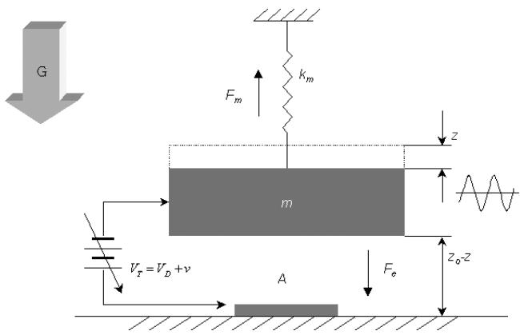  
Figure 1. A simplified structure and working principle of ACRC-RXL.

refined result including the existence range and uncertainty bound of the periodic signal in the oscillation loop as well as the amplitude and frequency of the best predicted sinusoid.

In section 2, we give a brief description of the principle and modeling. In section 3, the fabrication process of the mechanical structure is illustrated. Then the loop design and analysis for ACRC-RXL is given in section 4. In section 5, we give the experimental results using the implemented oscillation loop, and we give concluding remarks in section 6.

# 2. Description of the system

The basic principle of ACRC-RXL is to detect the variation of the resonant frequency when external acceleration is applied to the parallel-plated electrostatic oscillator. For this, we require a highly sensitive oscillation loop succeeding the resonant characteristics of the mechanical dynamics. In the following, for the design and analysis of the feedback oscillation loop, we present a brief working principle and the plant modeling of ACRC-RXL.

Figure 1 shows a working principle of the ACRC-RXL. Observing the figure, the plant dynamics of ACRC-RXL is given as

$$
F _ {a} = m \ddot {z} + D \dot {z} + k _ {m} z - \varepsilon A \frac {\left(V _ {D} + v\right) ^ {2}}{2 \left(z _ {0} - z\right) ^ {2}} \tag {1}
$$

where $m$ represents inertial mass, $D$ is the damping coefficient, $k_{m}$ is the spring stiffness, $\varepsilon$ is the permittivity constant, $A$ is the driving electrode area, $V_{D}$ is the driving voltage bias, $v$ is the driving voltage, $z_{0}$ is the equilibrium gap, and $z$ is the small displacement. Thus, from equation (1), the resonant frequency of the electromechanical system is determined by the external applied acceleration $F_{a}$ .

Assuming $z_0 \gg z$ and $V_D \gg v$ (in fact, the vibration is confined to about 5% of the nominal gap), the plant dynamics with zero input can be modeled as a linear form represented as

$$
G (s) = \frac {\varepsilon A V _ {D} / z _ {0} ^ {2}}{m s ^ {2} + D s + \left[ k _ {m} - \frac {\varepsilon A V _ {D} ^ {2}}{z _ {0} ^ {3}} \right]} \tag {2}
$$

where the higher-order perturbation term is neglected. Note that plant transfer function $G(s)$ has a low-pass filtering dynamics that mitigates higher-order harmonics.

Given the plant dynamics, it is necessary to design a feedback component that guarantees the oscillation loop

performance for the resonant accelerometer, ACRC-RXL. For this, several design factors are considered in the loop construction. First, it is necessary to generate and sustain a sinusoidal limit cycle, since the readout signal of ACRC-RXL is the very frequency of the limit cycle. In addition, the nominal point of resonance should be defined in a desired region. By setting a proper resonant point, a sufficient magnitude of displacement can be obtained as the oscillation accuracy is improved. Also, the designed loop should be periodically stable, i.e., the limit cycle in the loop is asymptotically stable.

# 3. Structure fabrication

We used $40~\mu \mathrm{m}$ thick epitaxially grown polysilicon as the structural layer and sealing area. With the exception of the chemical mechanical polishing (CMP) process, for smoothing the bonding area, the fabrication process is as simple as the conventional surface micromachining process.

Figure 2 shows the overall process flow to fabricate the proposed accelerometer device. The structural polysilicon layer was grown on a $1000\AA$ thick seed polysilicon layer in an epitaxial reactor at $1050^{\circ}\mathrm{C}$ and under reduced pressure conditions. The measured residual tensile stress was about $10\mathrm{MPa}$ , and the stress gradient is below $1\mathrm{MPa}\mu \mathrm{m}^{-1}$ . The average roughness of the structural polysilicon was initially about $4000\AA$ , so we polished the surface until the roughness decreased below $50\AA$ . In figure 3, the left picture shows the surface of the structure before and after the CMP process, which makes bonding possible.

The polished $40\mu \mathrm{m}$ thick layer was etched by inductively coupled plasma reactive ion etching (ICP-RIE). Following this, a dichloro-dimethyl-silanes (DDMS) coating process was used for an anti-stiction release [9]. We used $2.5\mu \mathrm{m}$ thick tetra-ethyl-ortho-silicate (TEOS) for the sacrificial layer and $0.5\mu \mathrm{m}$ thick polysilicon for the bottom electrode. The scanning electron microscopy (SEM) image on the right of figure 3 shows the fabricated mechanical structure with a $2.0\mu \mathrm{m}$ gap between the resonant structures and the bottom electrodes.

Finally, we used the glass fabrication process for the vacuum packaged device [7]. For the sealing cap, the Pyrex 7740 glass wafer was etched in hydrofluoric acid (HF) solution with $\mathrm{Cr / Au}$ and a photoresist (PR) masking layer, and then anodically bonded with the polysilicon wafer at $5\times 10^{-5}$ Torr ambience. The bonding temperature and voltage were $400^{\circ}\mathrm{C}$ and $300\mathrm{V}$ , respectively.

Figure 4 shows the SEM image of the mechanical structure of ACRC-RXL. In the figure, the left image shows the whole structure of $1000 \times 1000 \times 40 \mu \mathrm{m}^3$ , before vacuum packaging and the right image shows a quarter view of the structure. Note that etch holes of $5 \times 5 \mu \mathrm{m}^2$ are distributed over the whole mass surface, which reduces the squeeze damping effect. After dicing the bonded wafer, we attach each mechanical device to a ceramic holder and then bonded Au wires. Using this wire-bonded device, the performance test is carried out.

Since ACRC-RXL is a vertically vibrating sensor, the well-known squeeze film effect can cause a nonlinear damping coefficient. To avoid the nonlinear dynamics of the damping

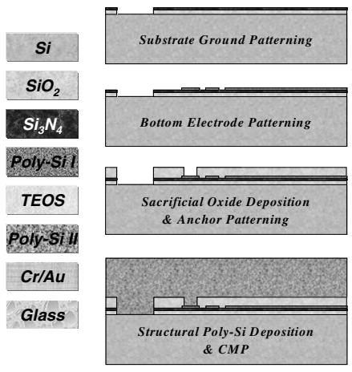

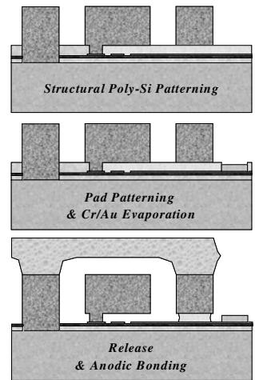  
Figure 2. Main fabrication process.

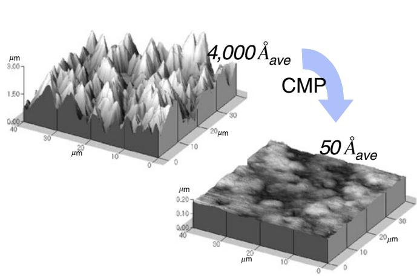

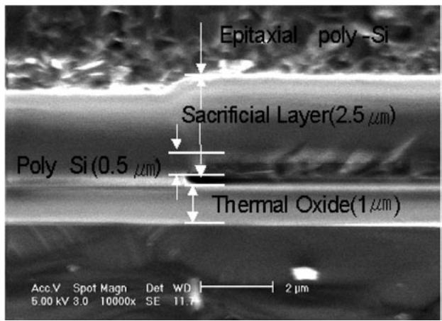  
Figure 3. SEM images of the structure: left, the surface of the structure; right, a cross-sectional view of the layers.

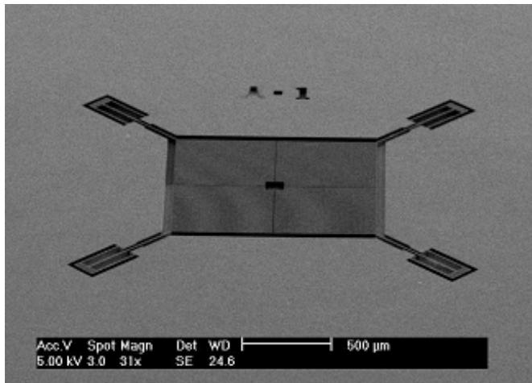

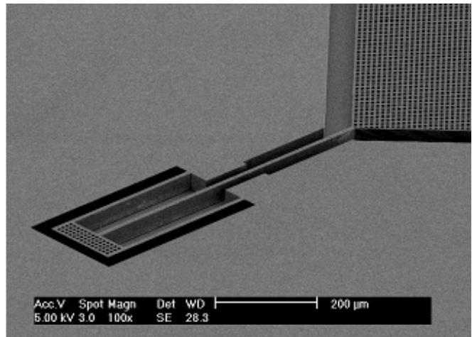  
Figure 4. SEM images of the released structure: left, the whole structure before vacuum packaging; right, one of the sustaining beams.

term, we introduced three ideas. First, using the vacuum packaged device, we obtained a low ambient pressure about $200 \times 10^{-3}$ Torr and a high quality factor for the mechanical resonant characteristics. The low pressure in the vacuum packaged device also results in a reduced noise floor caused by Brownian motion. Next, the etch holes over the entire mass surface reduce the squeeze film effect on the vertical

movement of the mass. Finally, the vertical amplitude of electrostatic vibration is designed to be less than $10\%$ of the nominal gap. With these techniques, we greatly reduce the squeeze film effect and can regard the damping coefficient as a first-order model, which can be calculated by the quality factor. Using the structural dimensions, the physical parameters are summarized in table 1.

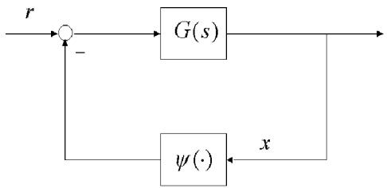  
Figure 5. Nonlinear feedback system for the resonant accelerometer, ACRC-RXL.

Table 1. Physical parameters of ACRC-RXL.   

<table><tr><td>Parameters</td><td>Value</td><td>Notes</td></tr><tr><td>m</td><td>8.72 × 10-8(kg)</td><td>Mass</td></tr><tr><td>km</td><td>144 (N m-1)</td><td>Mechanical stiffness</td></tr><tr><td>D</td><td>1.772 × 10-4N (m s-1)-1</td><td>Damping coefficient</td></tr><tr><td>A</td><td>2 × 10-7(m2)</td><td>Driving electrode area</td></tr><tr><td>d</td><td>2 × 10-6(m)</td><td>Initial gap</td></tr><tr><td>VD</td><td>12.01 (Volt)</td><td>Driving bias potential</td></tr><tr><td>ε</td><td>8.854 × 10-12</td><td>Permittivity</td></tr></table>

# 4. Oscillation loop design and analysis

In this section, the oscillation loop is designed using an analytical result based on the DF method, since the fundamental principle of harmonic balance simplifies the nonlinear system analysis. Also the theoretical shortcoming of harmonic balance can be complemented using the operator theoretical approaches presented in [13] and the application-based works in [14, 15]. Thus, using analytical results in these works, the feedback loop with a desired property can be achieved.

Consider a nonlinear feedback loop for ACRC-RXL, as shown in figure 5. In the figure, $G(s)$ represents a linear, continuous, and bounded plant of ACRC-RXL as given in equation (2) and $\psi(\cdot)$ represents a feedback nonlinearity to design. For a simpler DF representation, $\psi(\cdot)$ is generally chosen as a single-valued, odd symmetric, and sector bounded nonlinearity, such that

$$
c _ {1} \left(x _ {A} - x _ {B}\right) \leqslant \left[ \psi \left(x _ {A}\right) - \psi \left(x _ {B}\right) \right] \leqslant c _ {2} \left(x _ {A} - x _ {B}\right) \tag {3}
$$

for all real functions $x_A$ and $x_B$ where $x_A \geqslant x_B$ . Now the loop equation in figure 5 is given as

$$
- G \psi (x) = x. \tag {4}
$$

Also, due to the nonlinearity conditions, the loop solution of equation (4) can be assumed to be half-wave symmetric, i.e.

$$
x (t) = a _ {1} \sin \omega t (= x _ {1} (t)) + \sum_ {k > 1, \text {o d d}} ^ {\infty} b _ {k} \sin k \omega t \tag {5}
$$

where the right-hand side is sum of a dominant sinusoid denoted by $x_{1}(t)$ and its higher-order harmonics. Now to satisfy these conditions, the nonlinearity $\psi(\cdot)$ is constructed as the cascade of delay and sector bounded saturator. Then the DF technique simplifies the nonlinear loop equation in equation (4) into the first-order harmonic balance, namely

$$
1 + G (\mathrm {j} \omega) \Psi_ {N} (a _ {1}) \mathrm {e} ^ {\mathrm {j} \phi} = 0 \tag {6}
$$

where $\Psi_N(\cdot)$ denotes the DF of $\psi (x)$ except the phase delay. In equation (6), note that a tuning variable $\phi$ is

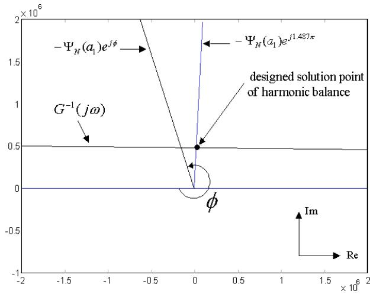

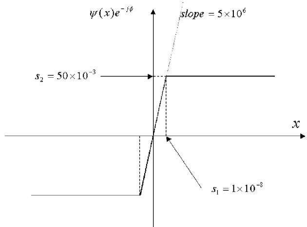  
Figure 6. Determination of limit cycle point by the loci of $\Psi_N(\cdot)$ and $G^{-1}(\mathrm{j}\omega)$ .   
Figure 7. Input to output relationship of nonlinearity, before the phase shift of $\phi$ .

introduced, which is essential in determining the limit cycle point.

Using equations (4), (5) and (6), a feedback nonlinearity can be designed to satisfy several design factors. To obtain particular parameters, plant dynamics with the physical parameters of ACRC-RXL in table 1 is applied in the design process. First, the best-approximated sinusoid in equation (5) is obtained by solving equation (6) when the phase delay $\phi$ is fixed. Since the sector higher bound of $\psi (\cdot)$ fixes the magnitude of $\Psi_N(\cdot)$ , $c_{2}$ is set to $5\times 10^{6}$ for equation (6) to have a nontrivial solution, i.e., a limit cycle to exist, and $c_{1}$ is set to zero for convenience. Next, the operator theoretical approach [13, 15] verifies that equation (5) becomes the solution of equation (4) and provides an analytical result for the magnitude bound of $\eta (x_{1})$ which denotes the higher-order solutions in equation (5) as

$$
\left\| \eta \left(x _ {1}\right) \right\| \leqslant \frac {\frac {c _ {2} - c _ {1}}{2}}{\left| \frac {c _ {1} + c _ {2}}{2} + G ^ {- 1} (\mathrm {j} 3 \omega) \right| - \frac {c _ {2} - c _ {1}}{2}} \cdot \left\| x _ {1} \right\|, \tag {7}
$$

for ACRC-RXL. Then setting equation (7) as a performance index, the objective limit cycle point is obtained numerically as $\phi = 1.487 \times \pi$ which minimizes the harmonic distortions in the signal loop. Figure 6 shows a graphical analysis to illustrate the limit cycle determination in the complex plane.

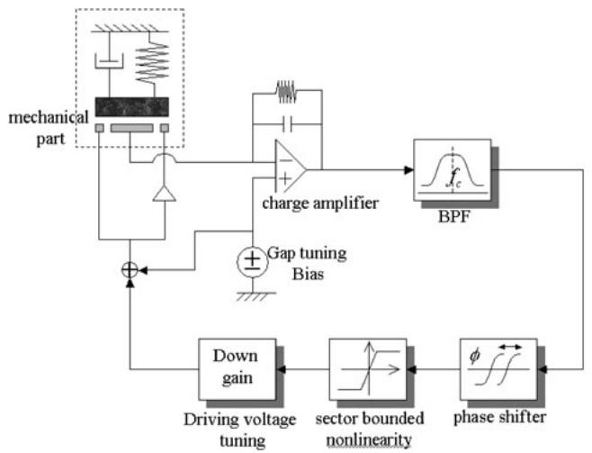

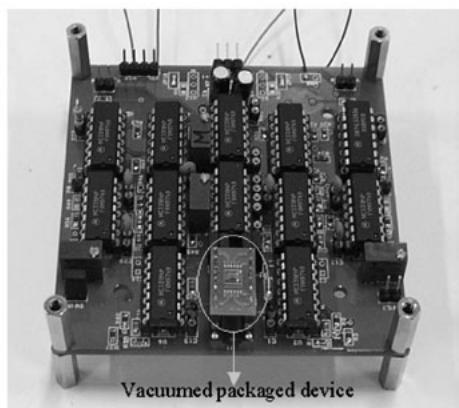  
Figure 8. Feedback loop implementation for ACRC-RXL and the PCB.

As expected, the limit cycle point, which minimizes the uncertain higher-order solutions, is obtained when the two loci are nearly normal at the intersection.

Consequently, after the design process involving a graphical analysis, the feedback nonlinearity $\psi (\cdot)$ is obtained as an odd symmetric, phase-shifted, and sector bounded saturator, as shown in figure 7. Then, after some calculations [15], the DF for the designed nonlinearity is written as

$$
\begin{array}{l} \Psi_ {N} \left(a _ {1}\right) \mathrm {e} ^ {\mathrm {i} \phi} = 2 \times \frac {5 \times 1 0 ^ {6}}{\pi} \left[ \sin^ {- 1} \left(\frac {1 0 ^ {- 8}}{a _ {1}}\right) \right. \\ \left. + \frac {1 0 ^ {- 8}}{a _ {1}} \sqrt {1 - \frac {1 0 ^ {- 1 6}}{a _ {1} ^ {2}}} \right] e ^ {j 1. 4 8 7 \pi}. \\ \end{array}
$$

Using the linearized plant and the designed feedback nonlinearity, the loop characteristics can be summarized in the following. The best-approximated sinusoid is obtained as $x_{1}^{\mathrm{RXL}}(t) = 133.05 \times 10^{-9} \sin (2\pi \times 5703.2t)$ . Each existence range of the amplitude $a_{1} \in [a_{l}, a_{u}]$ and frequency $\omega \in [\omega_{l}, \omega_{u}]$ for the exact solution can be obtained through the operator theoretical approach3.

Thus, there is a unique solution of equation (4) represented as equation (5) in $\Omega_{\mathrm{RXL}} = \{(a_1,\omega)|a_1\in$ $[132.76\mathrm{nm},133.35\mathrm{nm}],\omega \in 2\pi \times [5698.0,5708.4]\}$ . Also, for the solution in the range, the magnitude of the higher-order solution is bounded as $\| x_{\mathrm{RXL}}^{*} / x_{1}\| \leqslant 1.52\times 10^{-2}$

The stability of the designed loop can be shown via the extended Nyquist stability criterion [16]. In figure 6, since points near the intersection and along the $a_1$ -increasing side of $-\Psi_N(\cdot)$ loci are not encircled by the plant loci $G^{-1}(\mathrm{j}\omega)$ , the limit cycle is stable.

# 5. Experiment

In this section, we present the implementation of the oscillation loop for ACRC-RXL. Using the hybrid resonant system, various experiments are carried out to show its performance.

The signal processing part for the hybrid system is illustrated in figure 8. The left figure shows each functioning

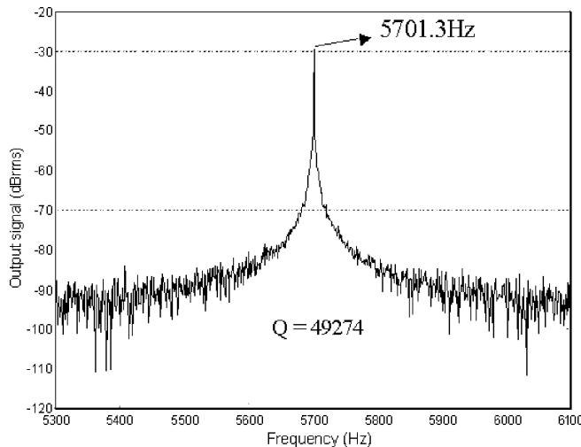  
Figure 9. Output characteristics of the loop signal in the frequency domain.

block of the signal processing electronics, which are mainly divided into detection and feedback nonlinearity parts. For the detection circuit, a precision charge amplifier is devised which can measure an electrical capacitance of sub-femtofarads. Then the nonlinearity in figure 7 is realized by cascading phase shifter and Schmitt trigger. The phase shift of $1.487 \times \pi$ is obtained by tuning a resistor in the phase-shift circuit. The sector-bounded saturator is obtained by setting the feedback nodes of the Schmitt trigger circuit to open for an operational amplifier with a proper slew rate. After down gaining the saturator output to satisfy $s_2$ in figure 7, it is added to the gap tuning bias and then fed back to the driving electrode of mechanical structure.

Including the mechanical structure, all the hybrid electronics for the performance test are implemented in a single printed circuit board (PCB) less than $3\mathrm{in}^2$ . The right picture in figure 8 shows the manufactured PCB containing the vacuum packaged device at the bottom of the board. Each experiment is carried out using the PCB fixed inside an electromagnetic shielding case.

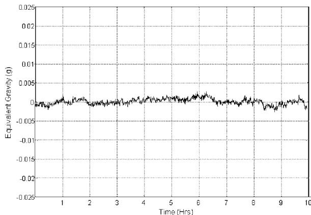  
(a)

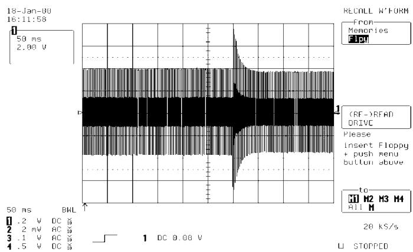  
(b)

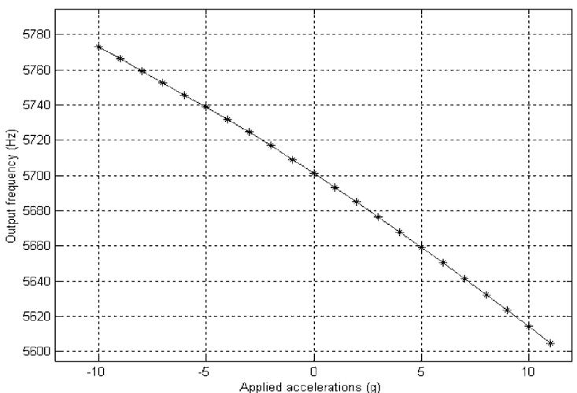  
(c)   
Figure 10. Performance test results of the implemented resonant accelerometer system: (a) output bias stability; (b) step response in time domain; (c) output frequency over dynamic range.

# 5.1. Evaluation of the self-sustained oscillation loop

After fixing the phase and gain of the feedback components, the oscillation loop activates a resonance with the help of initial white noise in the driving voltage. The warming time to resonance is less than $30\mathrm{ms}$ , which is near to the settling time. With $200\mathrm{mTorr}$ vacuum degree in the device, we obtained the open-loop $Q$ -factor of ACRC-RXL of about 150 and this provides a system bandwidth of $60\mathrm{Hz}$ . Figure 9 shows an output of the constructed loop in the frequency domain. The figure shows an achieved resonant frequency of $5701.3\mathrm{Hz}$ . The loop resonant frequency exists in the frequency range of $\Omega_{\mathrm{RXL}}$ , as shown in the previous section, but it differs slightly from the best-approximated frequency, $5703.2\mathrm{Hz}$ . The difference mainly comes from two sources: from the higher-order uncertainty and from the implementation error both mechanically and electrically. From figure 9, a $Q$ -factor of 49274 is obtained, which shows quite an improved resolution compared to the open-loop dynamics.

# 5.2. Evaluation of the ACRC-RXL performance

The sensitivity of ACRC-RXL is measured as $24.7\mathrm{Hzg^{-1}}$ when the resonant frequency is fixed at $5701.3\mathrm{Hz}$ .With this sensitivity, a static test is performed by means of applying a

tilt angle using a two-axis rate table (Acutronics 2000). The rate table is precisely leveled to Earth's gravity and is able to apply static gravity step-by-step up to $0.01\mathrm{mg}$

Figure $10(a)$ shows the static bias drift of the resonant accelerometer when zero gravity is applied. The obtained equivalent bias drift is about $0.7\mathrm{mg}$ with $1\sigma$ standard deviation from output data for $10\mathrm{h}$ . Figure $10(b)$ represents a step response of oscillating amplitude, which exhibits a bandwidth of about $60\mathrm{Hz}$ . Note that the frequency output response is proportional to the amplitude response of the mass. Figure $10(c)$ shows a relationship between input acceleration and output resonant frequency. The figure has a characteristic curve between acceleration and frequency, which is expected from the governing equation (1).

To check the system's reliability, some environmental tests are performed including high-G shock test, temperature test, random vibration, and on-off repeatability. Using the shock test, the oscillation loop was found to operate well up to $75\mathrm{g}$ acceleration. Furthermore, the running sensor could endure about $1000\mathrm{g}$ accelerations for a duration of several milliseconds. It is observed that, besides the peak acceleration over $1000\mathrm{g}$ , ACRC-RXL is not affected by parasitic accelerations in the high-frequency band, which is also applied during the shock test.

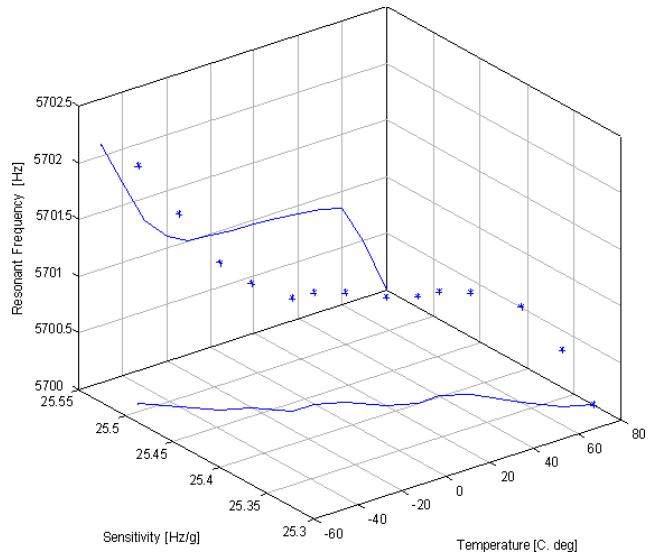  
(a)

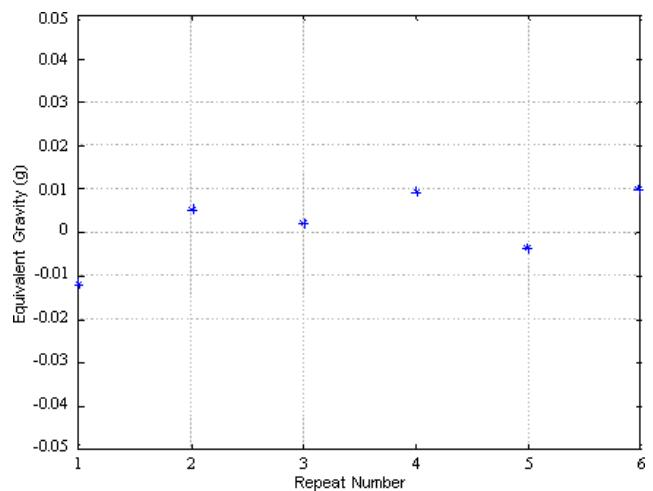  
(b)   
Figure 11. Environmental test result: (a) temperature characteristics $(-50$ to $+80^{\circ}\mathrm{C})$ ; (b) random bias from six repeated trials of $50\mathrm{min}$ run time and $10\mathrm{min}$ interval time ( $X$ is the trial number and $Y$ is the equivalent bias in g).

Table 2. Performance test results.   

<table><tr><td>Parameters</td><td>Value</td><td>Notes</td></tr><tr><td>Nominal frequency</td><td>5701.3 Hz</td><td>Bias dependent</td></tr><tr><td>Sensitivity</td><td>24.7 Hz g-1</td><td>-</td></tr><tr><td>Dynamic range</td><td>-10 g-10 g</td><td>max 15 g</td></tr><tr><td>Linearity</td><td>&lt;2% F.S.</td><td>Before compensation</td></tr><tr><td>Bias drift</td><td>~0.7 mg</td><td>1 sigma, 10 h</td></tr><tr><td>Bandwidth</td><td>about 60 Hz</td><td>3 dB attenuation</td></tr><tr><td>Ready time</td><td>&lt;200 ms</td><td>Loop-on time</td></tr></table>

Table 3. Environmental test results.   

<table><tr><td>Parameters</td><td>Value</td><td>Notes</td></tr><tr><td>Random bias</td><td>7 mg</td><td>On/off repeatability</td></tr><tr><td>Temperature</td><td></td><td>Fixed sensitivity</td></tr><tr><td>operating</td><td>-40 °C-70 °C</td><td></td></tr><tr><td>storage</td><td>-50 °C-85 °C</td><td></td></tr><tr><td>Random vibration</td><td>4 g</td><td>20-20 000 Hz</td></tr><tr><td>Shock test</td><td></td><td></td></tr><tr><td>operation</td><td>75 g</td><td>Quarter sine, 10 ms</td></tr><tr><td>endurance</td><td>1200 g</td><td>Half sine, 2 ms</td></tr></table>

Here we give the environmental test results. Figure 11(a) shows the temperature test result. In the figure, we can see little variation of the output bias characteristics over the temperature range of $-50$ to $+80^{\circ}\mathrm{C}$ . The maximum resonant frequency variation was $0.4\%$ over the full temperature range, which is enough for industrial applications. Figure 11(b) shows an on-off repeatability of about $7\mathrm{mg}$ , which becomes the main source of the accelerometer's random bias noise. Finally, a random vibration test over $2\mathrm{Hz}$ to $2\mathrm{kHz}$ with an equivalent acceleration of $4\mathrm{g}$ demonstrates little effect on the stability of the self-sustained oscillation loop.

The performance test results of ACRC-RXL are summarized in table 2, and results from the environmental test are summarized in table 3. The results demonstrate that the reliability and robustness of the implemented accelerometer

system are considerably enhanced with the proper installation of an oscillation loop.

# 6. Conclusion

In this paper, we present an illustration of the system, structural fabrication and design, analysis, and experiments of an oscillation loop for a MEMS resonant accelerometer, ACRC-RXL.

First, we give the principle of the proposed accelerometer and then we illustrate the fabrication following a conventional surface micromachining process. To obtain a satisfactory oscillation loop using the control theory, system modeling is required. The equation for the plant model is derived based on an ideal case by significantly reducing the nonlinear or non-ideal characteristics of the micromachined structure. After the plant modelling, the concept of self-sustained oscillation and the principle of harmonic balance are introduced. Using a linearized model for the plant dynamics, a phase-shifted, sector-bounded limiter is designed as feedback nonlinearity. An analytical result guaranteeing minimum uncertainty is used as a dominant design factor and, applying this, specific parameters of the nonlinearity are determined.

Then the oscillation loop is implemented using the signal processing part and the mechanical structure. The implemented oscillation loop has shown good performances in both time and frequency domains. Various experiments have been performed to confirm the performance of ACRC-RXL as a mid navigation-graded accelerometer. In summary, we have measured bias stability of about $0.7\mathrm{mg}$ and resolution of about $0.1\mathrm{mg}$ . Furthermore, using a dynamic performance test, we have obtained a bandwidth of over $60\mathrm{Hz}$ and an operating range over $10\mathrm{g}$ . The environmental test results prove its reliability.

This grade of accelerometer is expected to have many industrial applications such as seismic monitoring, attitude leveling, and as an aided sensor for GPS/INS integrated systems.

# Acknowledgments

This work is supported by the Brain Korea 21 program and the special project given to Automatic Control Research Center of Seoul National University by the Agency for Defense Development.

# References

[1] Rozhart T V et al 1995 An inertial-grade, micromachined vibrating beam accelerometer Proc. Int. Conf. on Solid-State Transducers and Actuators (Transducers'95) pp 659-62   
[2] Roessig T A et al 1997 Surface-micromachined resonant accelerometer Proc. Int. Conf. on Solid State Sensors and Actuators (Transducers'95) pp 859-62   
[3] Meldrum M A 1990 Application of vibration beam technology to digital acceleration measurement Sensors Actuators A 21-23 377-80   
[4] Norling B L 1988 Superflex: a synergitic combination of vibrating beam and quartz flexure accelerometer J. Inst. Navig. 34 337-53   
[5] Albert W C 1982 Vibrating quartz crystal beam accelerometer Proc. 28th ISA Int. Instrumentation Symp. (Las Vegas, 1982) pp 33-44   
[6] Lee B L, Oh C H, Oh Y S and Chun K 1999 A novel resonant accelerometer; variable electrostatic stiffness type Proc. Int. Conference on Solid State Sensors and Actuators (Sqendai, June 1999) pp 1546-9

[7] Lee B L, Oh C H, Lee S, Oh Y S and Chun K 2000 A vacuum packaged differential resonant accelerometer using gap sensitive electrostatic stiffness changing effect Proc. 13th Int. Conf. on Micro Electro Mechanical Systems (Miyazaci 23-27 Jan.) pp 352-7   
[8] Sung S, Lee J G and Kang T 2000 Development of a tunable resonant accelerometer with self-sustained oscillation loop Proc. IEEE National Conf. on Aerospace and Electronics (NAECON 2000) (Dayton, 10-12 Oct. 2000) pp 354-61   
[9] Kim B H et al 1999 A new class of surface modifier for stiction reduction Proc. 12th Int. Conf. on Micro Electro Mechanical System pp 189-93   
[10] Mohamed A M and Emad F P 1993 Nonlinear oscillations in magnetic bearing systems IEEE Trans. Autom. Control 38 1242-5   
[11] Sanders S R 1993 On limit cycles and the describing function method in periodically switched circuits IEEE Trans. Circuits Syst. 40 564-72   
[12] Kim E, Lee H and Park M 2000 Limit cycle prediction of a fuzzy control system based on describing function method IEEE Trans. Fuzzy Syst. 8 11-22   
[13] Bergen A R and Franks R L 1971 Justification of the describing function method SIAM J. Control 9 568-89   
[14] Slotine J E and Li W 1991 Applied Nonlinear Control (Englewood Cliffs, NJ: Prentice-Hall)   
[15] Khalil H K 1996 Nonlinear Systems 2nd edn (Englewood Cliffs, NJ: Prentice-Hall)   
[16] Atherton D P 1975 Nonlinear Control Engineering (London: Van Nostrand Reinhold)