# Study on Packaging Thermal Stress of Micromechanical Silicon Resonant Accelerometer

Libin Huang $^{1, a}$ , Yang Gao $^{1}$ , Qingyun Li $^{1}$ , Dongrui Wang $^{1}$

$^{1}$ School of Instrument Science and Engineering, Southeast University, Nanjing 210096, China

1Key Laboratory of Micro-Inertial Instrument and Advanced Navigation Technology, Ministry of Education

$^a$ huanglibin@seu.edu.cn

Keywords: micromechanical silicon resonant accelerometer; packaging thermal stress; ANSYS; surface mounting technology (SMT)

Abstract: Packaging thermal stress is harmful to the performance of the micromechanical silicon resonant accelerometer. In order to decrease the packaging thermal stress, correlations of packaging thermal stress with the material properties, curing temperature and geometrical size of adhesive layers of adhesive materials were discussed. A finite element model of package was developed to analyze the influence of surface mounting technology (SMT) on the micromechanical silicon resonant accelerometer. The simulation results show that the Young's modulus, thermal expansion coefficient, curing temperature and geometrical sizes of adhesive layers are important influencing factors for packaging thermal stress and the warpage of the chip. The thermal stresses during the process of SMT will cause the resonant frequency shift.

# Introduction

Micromechanical silicon resonant accelerometer is a new generation of high precision micro-mechanical accelerometer [1], which can output digital signal directly with high sensitivity and high resolution. Its major advantages are wide dynamic range, strong anti-interference ability, excellent stability and high measure precision. Thus, it lowers the difficulty to detect weak signal by micro-sensors. However, the development of the accelerometer has been greatly restricted by the relatively backward MEMS packaging technique.

In the package of MEMS devices, the heat-induced structural stress significantly affects the devices' performance [2-13]. As one of the key processes in packaging, SMT usually generates thermal stress which is one of the primary factors affecting the accelerometer's reliability and availability. Hence, the influencing factors for the reliability of packaging and the performance of the device, such as thermal mismatch, stress, strains during the SMT process, should be analyzed and predicted before packaging.

In this paper, the finite element analysis method has been used to reveal the relations among properties of the adhesive material, its curing temperature, geometric parameters of adhesive layers, thermal stress and resonance frequency of the resonator, so as to research the effect of the SMT process on this accelerometer.

# Working Principles of Micromechanical Silicon Resonant Accelerometer

The micromechanical silicon resonant accelerometer involved in this paper is a kind of resonant accelerometer which works though changing the axial stress of the resonant beam. Generally, this type of accelerometer consists of resonator, proof mass, leverage mechanism and suspension beams,

as is shown in Fig. 1. The two resonators have the same dimensions, and are connected by the mass symmetrically. When accelerated, the mass can transform the acceleration into inertia force, which will then be amplified by the leverage mechanism, finally be applied to the resonators. One of the resonators is pressed and its resonant frequency decreases, and the other one is just opposite. So, the input acceleration can be calculated according to the difference between the two frequencies [1, 14].

According to the working principle of the accelerometer, it can be concluded that when the thermal stress generated in the process of packaging acts on the accelerometer, the resonant frequency will change, and will have certain effect on the performance of the accelerometer.

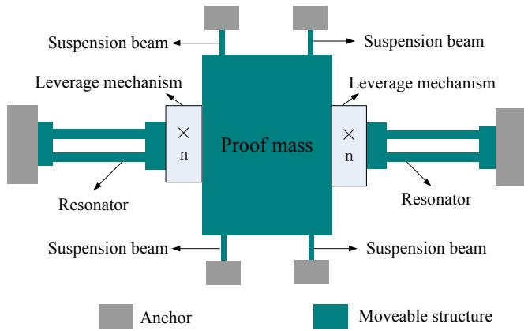  
Fig. 1 Structure of the micromechanical silicon resonant accelerometer.

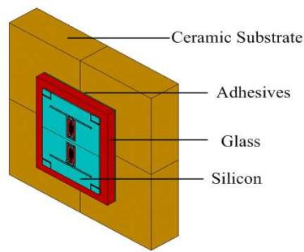  
Fig. 2 3-D simulation model of the packaged micromechanical silicon resonant Accelerometer.

# FEM Simulation Analysis

The device scale package of this silicon resonant accelerometer adopted a ceramic package. According to the actual packaged structure of the accelerometer, a FEM model was built as shown in Fig. 2. Due to the symmetry of the resonator, upper half of the actual model was selected to analyze. The unloaded resonant frequency of the two resonators was obtained as $31263\mathrm{Hz}$ through simulation analysis on the bare chip without the adhesive layers and the substrate.

Effects of Young's Modulus of Adhesives on the Chip's Stress and Warpage. A series of SMT adhesives were used in the simulation, which have the same thermal expansion coefficient of $5 \times 10^{-6} / \mathrm{C}$ , and their Young's modulus varies from 0 to $40\mathrm{GPa}$ . In the simulation, an assumption has been made that Young's modulus of all the SMT adhesives do not change with the temperature. According to the practical environment of the SMT process, the adhesive should be cured at $80^{\circ}\mathrm{C}$ in oven. In the process of simulation, it is supposed that the temperature of the whole device rises from room temperature $25^{\circ}\mathrm{C}$ to $80^{\circ}\mathrm{C}$ . After extracting the stress at the center of the resonator's left beam, the relationship between the stress and the Young's modulus was gained as shown in Fig. 3. Fig. 4 presents the relationship between Young's modulus and the resonant frequency of the resonator. Fig. 5 shows the relationship between the warpage of the accelerometer and the adhesive's Young's modulus.

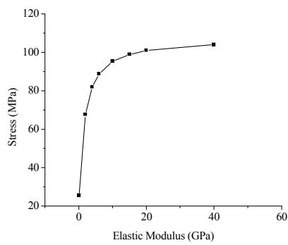

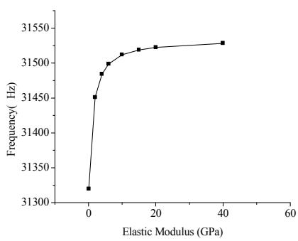

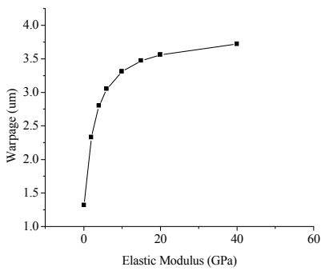  
Fig. 3 Effect of Young' modulus on thermal stress.   
Fig. 4 Effect of Young's modulus on the resonant frequency   
Fig. 5 Relationship between Young's modulus and warpager.

It can be seen from Fig. 3 that the stress of chip always keeps positive as the temperature increases, which means the chip is under tensile stress and is convex. In a range between 0 and $10\mathrm{GPa}$ for Young's modulus, the stress of the chip increases monotonically. However, when the Young modulus is greater than $10\mathrm{GPa}$ , the increasing rate becomes slow. The effect trend of Young's modulus on the resonant frequency (as shown in Fig. 4) is consistent with what has been shown in Fig. 3. When the shearing stress and the pressure tightness are satisfied, it is better to choose an adhesive with low Young's modulus so as to reduce the influence of thermal stress on the resonant frequency.

Effects of Adhesive's Thermal Expansion Coefficient on the Chip's Stress and Warpage. Supposing that the structural temperature of the whole device rises from $25^{\circ}\mathrm{C}$ to $80^{\circ}\mathrm{C}$ , and all the adhesives have the same Young's modulus 3 Gpa, the thermal expansion coefficient varies from 0 to $100 \times 10^{-6} / ^{\circ}\mathrm{C}$ . Fig. 6 shows the relationship between thermal expansion coefficient and the stress of chip. Fig. 7 presents the correlation between the thermal expansion coefficient and resonant frequency of the up-resonator. Fig. 8 depicts the relation curve between the thermal expansion coefficient and the warpage of chip. It can be concluded from the figures that when temperature varies, the thermal stress, variation of the resonant frequency, and the warpage of chip all increase with increasing thermal expansion coefficient, i.e., the change tends of the three variables are identical.

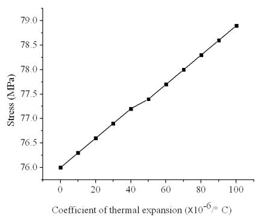  
Fig. 6 Effects of adhesivs'sthermal expansion coefficient on the chip's thermal stess

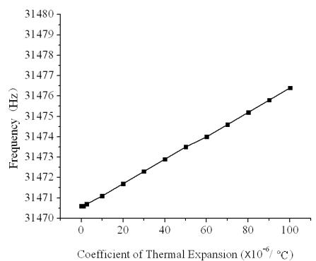  
Fig. 7 Effects of adhesive's thermal expansion coefficient on the resonant frequency

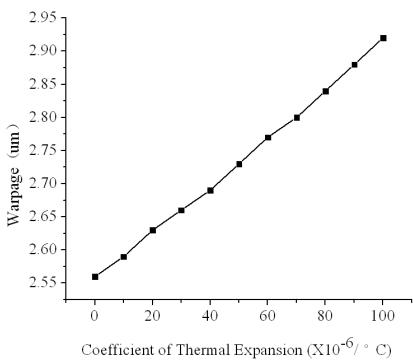  
Fig. 8 Relationship between adhesive's thermal expansion coefficient and the warpage.

Effects of the Geometric Sizes of the Adhesive Layers' Effects on the Thermal Stress. According to reference [12], the geometric dimension of the adhesive layers affects the thermal stress as well. Fig. 9 displays the dimensions of all the parts of the packaged device. The parameter $b$ means the thickness of the adhesive layers, the parameter $w$ means the difference between the dimensions of adhesive plane and the accelerometer. Finite element simulation software ANSYS was adopted to obtain an optimal dimension of the adhesive layers, so as to reduce the effects of stress on the accelerometer.

Supposing that the structural temperature of the whole device rises from room temperature $25^{\circ}\mathrm{C}$ to $80^{\circ}\mathrm{C}$ , and Young's modulus of the adhesive is $3\mathrm{GPa}$ , the thermal expansion coefficient is $15 \times 10^{-6} / ^{\circ}\mathrm{C}$ . Simulation analysis was carried out with an adhesive layer thickness ranging from 5 to $200~\mu \mathrm{m}$ to study its effects on the stress distribution of the accelerometer, and the simulated result is shown in Fig. 10. It can be seen from Fig. 10 that the stress of chip decreases as the thickness of the adhesive layers increases, and when the thickness rises to a certain value, the decrease amplitude of the stress becomes smaller. Fig. 11 displays the curves of $w$ and the thermal stress, and it shows that when the plane size of the adhesive layers is $20~\mu \mathrm{m}$ larger than that of accelerometer, the thermal stresses reach its minimum.

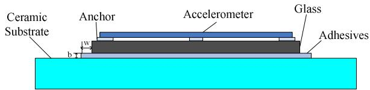  
Fig. 9 Structure diagram of all layers.

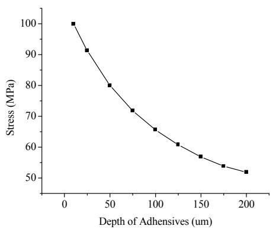  
Fig. 10 Relations between the thickness of adhesive and thermal stress.

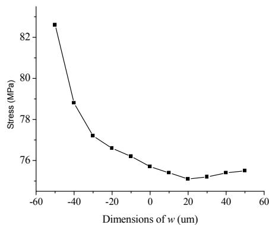  
Fig. 11 Relations between the parameter $w$ and thermal stress.

Based on conclusions above, the thickness and plane size are $200\mu \mathrm{m}$ and $20~\mu \mathrm{m}$ , respectively. When the structural temperature of the whole device rises from $25^{\circ}\mathrm{C}$ to $80^{\circ}\mathrm{C}$ , the distributions of packaging strains and stress are shown in Fig. 12. Fig. 12(a) shows the distributions of strain and stress in chip, and Fig. 12 (b) presents those of the substrate. Different thermal expansion coefficients lead to different contraction and expansion of the connecting materials, thereby inducing the generation of stresses at the adhesive interface. It can be seen from Fig. 12 (a) that the stress of the mass is small and mainly distributes in the anchor zone and the folded beam of the micromechanical silicon accelerometer. According to the strain distribution of the chip, thermal strain mainly locates in the anchor zone and folded beam, and the maximum appears at the fold of the folded beam. Fig. 12 (b) shows the stress and strain distribution of the ceramic substrate, it can be inferred that the packaging structure presents a trend of thermal expansion because of the

increasing environment temperature, and the strain increases gradually from the center. The maximal stress appears at the junction between substrate and the anchor zone in the four corners of the chip.

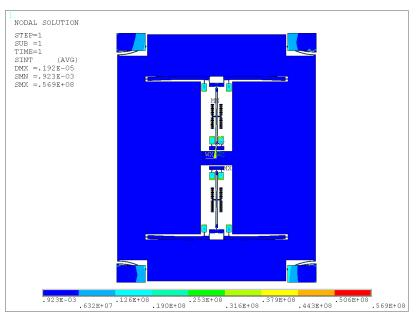  
(1) Stress distribution of the chip (back).

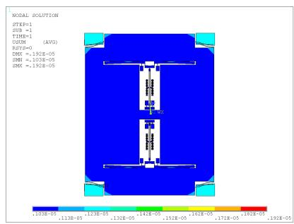  
(2)Strain distribution of the chip.

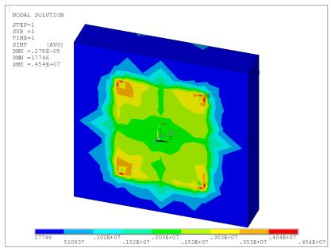  
(a) Stress and strain distribution of the micromechanical silicon accelerometer chip.   
(1) Stress distribution of the substrate.

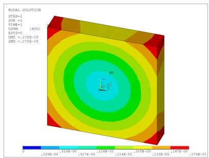  
(2)Strain distribution of the substrate.   
(b) Stress and strain distribution of the ceramic substrate.   
Fig. 12 Stress and strain of the packaged structure.

Influence of the Curing Temperature of Adhesive on Thermal Stress. Generally, adhesive can be cured at different temperatures. Simulation analysis was carried out with different curing temperature $(80^{\circ}\mathrm{C}, 150^{\circ}\mathrm{C}, 250^{\circ}\mathrm{C}$ and $390^{\circ}\mathrm{C})$ to reveal its effect on the thermal stress. The thickness, Young's modulus and thermal expansion coefficient of the adhesive was set as $60~\mu \mathrm{m}$ , $3\mathrm{Gpa}$ and $15\times 10^{-6} / ^{\circ}\mathrm{C}$ , respectively. Simulated results (as shown in Table 1) show that thermal stress and warpager increase with increasing curing temperature, and the deviation between the resonant frequency of resonator and the unloaded resonant frequency of bare chip is enlarged consequently. When the adhesive is cured at its lowest curing temperature, the relative deviation of the resonant frequency is $0.6\%$ , and it reaches $4.3\%$ at the highest curing temperature. Hence, the influence of thermal stress on the resonant frequency of resonator can be reduced by choosing a lower curing temperature in the curing process.

Table 1 Parameter variation at different curing temperature.   

<table><tr><td>Curing temperature (℃)</td><td>80</td><td>150</td><td>250</td><td>390</td></tr><tr><td>stresses (Pa)</td><td>0.764 E+08</td><td>0.174E+09</td><td>0.313 E+09</td><td>0.507 E+09</td></tr><tr><td>warpager (m)</td><td>0.261 E-05</td><td>0.593 E-05</td><td>0.107E-04</td><td>0.173E-04</td></tr><tr><td>Resonant frequency of the up-resonator (Hz)</td><td>31471.4</td><td>31735.1</td><td>32107.6</td><td>32621.3</td></tr></table>

# Conclusions

According to the FEM simulation analysis of the micromechanical silicon resonant accelerometer, following conclusions can be drawn:

1) The Young's modulus and thermal expansion coefficient of adhesive are important influence factors for the thermal stress and the chip warpage. In a certain range, the thermal stress, variation of the resonant frequency, and the warpage of chip increase with increasing Young's modulus. However, when Young's modulus reaches a certain value, the increasing speed of the stress and the warpage become slow. The thermal stress and the warpage of chip and the resonant frequency increase with increasing thermal expansion coefficient.   
2) The geometric thickness of the adhesive layers has great influence on packaging thermal stress. With the thickness increases, the thermal stress decreases; but when the thickness increases to a certain value, the stress grows slowly. When the plane size of the adhesive layers is $20~\mu \mathrm{m}$ larger than the dimension of the accelerometer chip, the thermal stress reaches its minimum.   
3) Different curing temperature of adhesive also affects the thermal stress, the higher temperature is, the larger the thermal stress and the warpage are, and so is the variation of the resonant frequency. Thus, a lower curing temperature should be selected.

# Acknowledgments

This work was supported by the National Natural Science Foundation of China (No.61101021) and the Jiangsu Provincial Natural Science Foundation of China (No.BK2010401); the Foundation (No.KL201103) of Key Laboratory of Micro-Inertial Instrument and Advanced Navigation Technology, Ministry of Education, China.

# References

[1] Ralph Hopkills, Joseph Miola, Roy setterlund: the draper technological digest (2006), p.6   
[2] Stadtmueller M: J Electrochem Soc Vol.139 (1992), p. 3269   
[3] Doerne M, Nix W: CRCCrit Rev Solid States Mater Sci Vol.14 (1988), p. 225   
[4] Nix W D: Metallurgical Transactions A, (1989), p. 2217   
[5] Tamuleviciu S: Vacuum, Vol. 51 (1998), p. 127   
[6] McCarthy J, Pei Z, Becker M, et al: Thin solid films, Vol. 358 (2000), p. 146   
[7] Li Gay, McNeil Andrew, Kouty Dan, et al: 2002 ASME International Mechanical Engineering Congress & Exposition (2002), p.1   
[8] Sung-Hoon Choa: Microsystem technology Vol. 11 (2005), p. 1187   
[9] Li Yashan, Yan Junjie, Liu Jun, Shi Yunbo: Transducer and Microsystem Technologies Vol.30 (2011), p. 25 (In Chinese)   
[10]Guan Rongfeng: Transducer and Microsystem Technologies Vol.27 (2008), p. 24 (In Chinese)   
[11]Xiang Ting, Gou Tao, Lin Dawei, Liu Pengfei: Instrument Technique and Sensor (2011), p. 9 (In Chinese)   
[12]Shi Qin, Su Yan, Qiu Anping, Zhu Xinhua: Chinese Journal of Electron Device Vol. 30 (2007), p. 2294 (In Chinese)   
[13]Wang Dongrui: M.S. Dissertation (2012), Southeast University, Nanjing, China (In Chinese)   
[14]Chen Weiwei: M.S. Dissertation (2012), Southeast University, Nanjing, China (In Chinese)

Sensors, Measurement and Intelligent Materials 10.4028/www.scientific.net/AMM.303-306

Study on Packaging Thermal Stress of Micromechanical Silicon Resonant Accelerometer 10.4028/www.scientific.net/AMM.303-306.155

Reproduced with permission of the copyright owner. Further reproduction prohibited without permission.