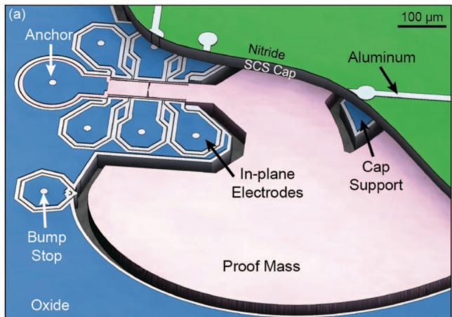
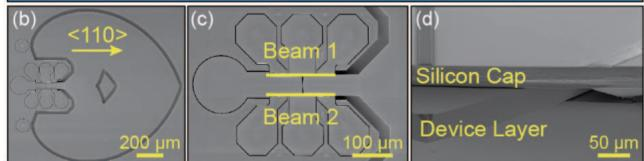
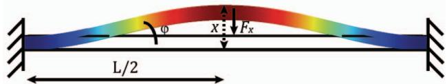
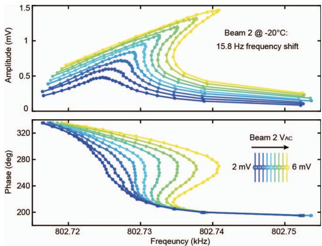
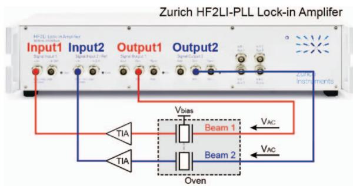
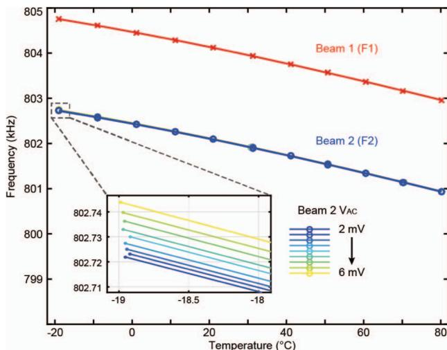
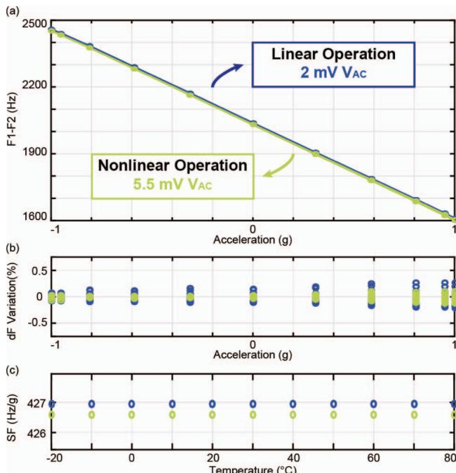
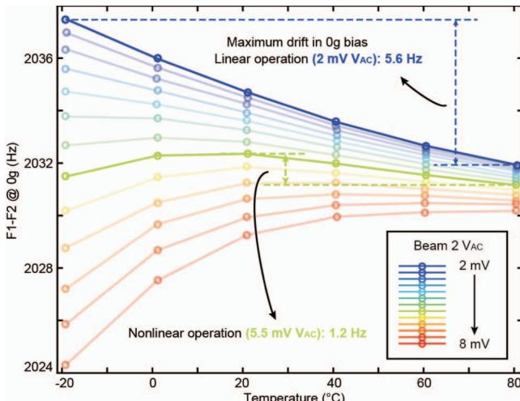

# TEMPERATURE COMPENSATION OF RESONANT ACCELEROMETER VIA NONLINEAR OPERATION

Dongsuk D. Shin1, Yunhan Chen2, Ian B. Flader1, and Thomas W. Kenny1

$^{1}$ Stanford University, Stanford, California, USA

2Apple Incorporated, Cupertino, California, USA

# ABSTRACT

This paper reports a simple, effective method to improve the bias stability of a resonant accelerometer over a large temperature range. By using the nonlinear amplitude-frequency effect, this technique further reduces residual temperature dependence of a passively temperature-compensated differential signal from two sensing resonators. Driving one resonator beam with a large excitation amplitude into the nonlinear regime moves its frequency-temperature characteristic closer to that of the other sensing beam. Preliminary results show a near fivefold improvement in $0\mathrm{g}$ bias stability while maintaining high sensitivity and scale factor stability over the temperature range from $-20^{\circ}\mathrm{C}$ to $80^{\circ}\mathrm{C}$ .

# INTRODUCTION

Silicon-based MEMS accelerometers are among the most widely used sensors across industries, largely due to batch manufacturability, small form factor, low power, and potential for CMOS integration [1]. While the traditional capacitive accelerometers fulfill the needs of most applications that exist today, high-end applications such as inertial navigation demand higher performance in terms of accuracy, dynamic range, mechanical robustness, and sensitivity, among others. MEMS resonant accelerometers have shown promise in addressing these challenges; the resonant transduction scheme is not limited by the proof mass displacement, and therefore enables designs with higher sensitivity and increased dynamic range.

However, one of the main limitations of MEMS resonant accelerometers is high sensitivity to temperature fluctuations. Silicon's intrinsic temperature coefficient of elasticity (TCE) often results in a temperature coefficient of frequency (TCf) of $\sim 30\mathrm{ppm} / {}^{\circ}\mathrm{C}$ . Differential operation employed in most resonant accelerometers [2-5] effectively reduces the temperature dependency of the output signal, but further compensation is required to achieve better stability over a large ambient temperature range. In addition, while degenerate doping of silicon has been shown to reduce frequency-temperature dependence of resonators [6-8], residual mismatches in TCf between pairs of resonators cause errors even with differential sensing. Active temperature compensation schemes such as ovenization have been demonstrated to reduce the remaining temperature effects in resonant accelerometers [9]; however, such active schemes consume large amounts of power and are often complex in implementation.

In this work, a simple, passive compensation scheme that utilizes the nonlinear amplitude-frequency effect is demonstrated for the differential resonant accelerometer reported in [5]. By characterizing and leveraging the sensing beam's nonlinearities and their effects on resonant frequency across a wide range of temperature, this method further improves the sensor's 0g bias stability.

  
Figure 1: (a) Cutaway schematic of the accelerometer with large gaps and no etch holes; SEM images of (b) Top view of the device, (c) Close-up of two sensing beams, (d) Cross-section of the encapsulated device.

# MOTIVATION

This work builds on a device reported in [5], which demonstrated high sensitivity, excellent stability, and good temperature drift rejection. Fabricated in an ultra-clean, hermetic encapsulation process, the device retains the benefits of resonator stability [10] with no detectable signs of fatigue or aging [11]. Illustrated in Figure 1, the device design places two flexural beams in symmetry and in proximity, thereby enabling an effective differential operation that doubles sensitivity and rejects most of the common-mode errors.

Prior work has shown that this differential scheme's first-order compensation produces a bias drift on the order of milli-g's over $100^{\circ}\mathrm{C}$ . The remaining second-order temperature dependence of the differential signal is mainly due to a mismatch in the TCF between the two sensing resonators. Though the beams are designed to have identical geometry, process variations often lead to a minute difference in dimensions. These offsets cause the two beams to have different stress distributions and consequently mismatched TCfs. To reduce the remaining temperature dependence, this work proposes a passive temperature correction to the differential signal without compromising the device performance.

# METHOD

Most micromechanical resonators have nonlinearities as a result of the resonator geometry, transduction mechanisms, materials, and boundary conditions [12].

  
Figure 2: Geometric nonlinearity induced by large vibration amplitude for a clamped-clamped beam resonator. Midline stretching of Euler-Bernoulli beam will add in a $3^{rd}$ order nonlinearity term in the original equation of motion.

Flexural resonators, like the ones used in this work, are typically dominated by electrostatic and geometric nonlinearities. As the mechanical vibration amplitude becomes larger, devices experience a shift in resonant frequency, a phenomenon known as the amplitude-frequency $(A - f)$ effect.

Treating the sensing resonator's connection to the large proof mass as a fixed boundary condition, the sensing resonator's nonlinear dynamics can be shown analytically. The nonlinear behavior of a clamped-clamped beam is described by the equation of motion for the spring-mass damper system with nonlinear constants:

$$
m _ {e f f} \ddot {x} + b \dot {x} + k _ {1} x + k _ {2} x ^ {2} + k _ {3} x ^ {3} = F \cos (\Omega t) \qquad (1)
$$

where $x$ is displacement, $m_{eff}$ is the effective mass, $b$ is the linear damping coefficient, $k_{1}$ is the linear spring constant, $k_{2}$ and $k_{3}$ are the $2^{\mathrm{nd}}$ and $3^{\mathrm{rd}}$ nonlinearity correction factors respectively, and $F\cos(\Omega t)$ is the external actuation force. Here, both $k_{2}$ and $k_{3}$ contribute to the $A - f$ effect. Nonlinear stiffness due to electrostatic actuation typically appears as negative portions of $k_{2}$ and $k_{3}$ terms. This is known as the "electrical-softening" nonlinearity, as it causes the modal frequency response to bend towards the lower frequency side with an increase in displacement.

However, in the case of a clamped-clamped beam, the mechanical stiffness nonlinearities caused by geometrical distortion dominate [13]. By approximating the deformed resonator beam as an isosceles triangle as shown in Figure 2, the nonlinear force $(F_{x})$ in the resonator displacement direction and the corresponding higher order spring constant can be derived:

$$
F _ {x} = 2 F \sin (\varphi) \cong \frac {8 E t w}{L ^ {3}} x ^ {3} \rightarrow k _ {3} = \frac {8 E t w}{L ^ {3}} \tag {2}
$$

where $L$ is the length of the beam, $E$ is the elastic modulus of silicon, $t$ is the thickness, and $w$ is the width of the beam. This positive $k_{3}$ term shows that the nonlinearity is of the stiffening type, which bends the frequency response towards the higher frequency side at large driving amplitudes. Figure 3 demonstrates the predicted behavior for the measured device. A small increase of $4\mathrm{mV}$ in driving voltage $(V_{AC})$ causes a positive frequency shift of $15.8\mathrm{Hz}$ as the resonator experiences stiffening nonlinearity.

For the implementation of the proposed method, only Beam 2 is driven nonlinearly with a large $V_{AC}$ , while Beam 1 is operated in the linear regime. As presented in [14], the

  
Figure 3: Closed-loop frequency response as $V_{AC}$ is increased for Beam 2 at $-20^{\circ}C$ . Positive shift in frequency indicates stiffening nonlinear effects.

  
Figure 4: Block diagram of the experimental setup with variable-phase feedback loops. Two beams are driven simultaneously with two phase-locked loops.

nonlinear effects can change the frequency-temperature behavior of resonators in a closed-loop operation with constant $V_{AC}$ . In this work, inducing nonlinear stiffening effects on Beam 2 bends its TCF curve up at lower temperatures. This is due to the reduction in thermo-elastic damping, which in turn increases the amplitude and causes larger frequency shifts as temperature decreases [15]. With Beam 1's TCF unchanged, the nonlinear shift in frequency of Beam 2 serves to reduce the TCF difference between the two resonator beams.

# RESULTS

In this work, two beams in proximity, shown in Figure 1(c), are simultaneously driven into resonance for differential operation. Figure 4 illustrates the experimental setup in which the two resonant beams are operated in digital phase-locked loops of a Zurich Instrument digital lock-in amplifier. Beam 2 is driven into the nonlinear regime such that its frequency-temperature characteristic is changed to more closely match that of Beam 1, thus improving the device's differential performance over a large temperature range.

Figure 5 shows the resonant frequencies of the two beams over the temperature range, and the inset shows the frequency change in Beam 2 as it is driven with increasing

  
Figure 5: Frequency shift of the two resonant beams as a function of ambient temperature. Inset shows shifts in frequency as Beam 2 is driven into nonlinear regimes.

  
Figure 6: (a) Differential signal as a function of input acceleration from $-1g$ to $+1g$ , measured at ambient temperatures from $-20^{\circ}C$ to $80^{\circ}C$ ; (b) Differential signal variation across the temperature range at each input acceleration; (c) Scale factors over the temperature range. Blue indicates linear operation for both beams; green is when only Beam 2 is driven nonlinearly with $V_{AC}$ of $5.5mV$ .

excitation amplitudes. To characterize the accelerometer performance across the temperature range, an inclinometer setup is placed within a convection oven. At different ambient temperatures, the device is rotated from $-90^{\circ}$ to $+90^{\circ}$ (corresponding to $-1\mathrm{g}$ to $1\mathrm{g}$ acceleration) while the resonant frequency of each beam is measured. Differential measurements in both the linear and nonlinear regimes are plotted in Figure 6, showing that the accelerometer in the nonlinear regime shows similar performance to that of the linear operation. The nonlinear operation shows a marginal improvement in scale factor stability (6(b)) and a slight

  
Figure 7: Differential signal at $0\mathrm{g}$ position as a function of ambient temperature. Beam 1 is always operated in the linear regime, while Beam 2 is driven with increasing $V_{AC}$ at every temperature. Nonlinear operation with $V_{AC}$ of $5.5\mathrm{mV}$ for Beam 2 yields a maximum variation of $1.2\mathrm{Hz}$ (green), improved from $5.6\mathrm{Hz}$ in linear operation of both beams (blue).

decrease in sensitivity (6(c)) over the temperature range from $-20^{\circ}\mathrm{C}$ to $80^{\circ}\mathrm{C}$ .

The differential signal F1-F2, which is critical for bias and scale factor stability, with varying Beam $2V_{AC}$ is plotted in Figure 7. When both beams are operated in the linear regime, the differential signal shows an absolute maximum change of $5.6\mathrm{Hz}$ over the temperature range (blue), corresponding to approximately 13.1 milli-g error. Driving Beam 2 nonlinearly with an amplitude of $5.5\mathrm{mV}$ while keeping Beam 1 in the linear regime—bends the curve down, resulting in a near fivefold improvement with a maximum variation of $1.2\mathrm{Hz}$ (green), or a bias error of 2.8 milli-g.

# CONCLUSION

This work demonstrates a simple and effective temperature compensation method that does not require any external power or circuitry. After characterizing the geometry-dependent mechanical nonlinearity of a resonant beam, one sensing beam is driven nonlinearly such that its frequency-temperature behavior more closely matches that of the other resonant beam. Better matched TCfs of the two sensing resonators effectively improves the cancellation of temperature effects in differential operation, resulting in a near fivefold improvement in bias drift over the $100^{\circ}\mathrm{C}$ temperature range.

# ACKNOWLEDGEMENTS

This work was supported by the Defense Advanced Research Projects Agency grant "Precise Robust Inertial Guidance for Munitions (PRIGM)," managed by Dr. Robert Lutwak, Contract # N66001-16-1-4023. Work was performed in part at the Stanford Nanofabrication Facility (SNF), supported by the National Science Foundation under Grant ECS-9731293, and at Lurie Nanofabrication Facility (LNF) at Michigan University.

# REFERENCES

[1] C.T.-C. Nguyen, “MEMS technology for timing and frequency control,” IEEE Trans. Ultrason., Ferroelectr., Freq. Control, Vol. 54, No. 2, pp. 251-270, 2007.   
[2] C. Comi, A. Corigliano, G. Langfelder, A. Longoni, A. Tocchio, and B. Simoni, “A resonant microaccelerometer with high sensitivity operating in an oscillating circuit,” J. Microelectromech. Syst., Vol. 19, No. 5, pp. 1140-1152, 2010.   
[3] U. Park, J. Rhim, J.U. Jeon, and J. Kim, “A micromachined differential resonant accelerometer based on robust structural design,” Microelectronic Engineering, Vol. 129, pp. 5-11, 2014.   
[4] A.A. Seshia, M. Palaniapan, T.A. Roessig, R.T. Howe, R.W. Gooch, T.R. Schimert, and S. Montague, "A vacuum packaged surface micromachined resonant accelerometer," J. Microelectromech. Syst., Vol. 11, No. 16, pp. 784-793, 2002.   
[5] D.D. Shin, C.H. Ahn, Y. Chen, D.L. Christensen, I.B. Flader, and T.W. Kenny, "Environmentally robust differential resonant accelerometer in a wafer-scale encapsulation process," in Proc. 30th IEEE MEMS, pp. 17-20, 2017.   
[6] E.J. Ng, V.A. Hong, Y. Yang, C.H. Ahn, C.L.M. Everhart, and T.W. Kenny, "Temperature dependence of the elastic constants of doped silicon", J. Microelectromech. Syst., Vol. 24, No. 3, pp. 730-741, 2015.   
[7] A.K. Samarao and F. Ayazi, “Temperature compensation of silicon resonators via degenerate doping,” IEEE Trans. Electron Devices, Vol. 59, No. 1, pp. 87-93, 2012.   
[8] T. Pensala, A. Jaakkola, M. Prunnila, and J. Dekker, "Temperature compensation of silicon MEMS resonators by heavy doping," in Proc. IEEE Int. Ultrason. Symp., pp. 1952-1955, 2011.

[9] D.D. Shin, Y. Chen, I.B. Flader, and T.W. Kenny, "Epitaxially encapsulated resonant accelerometer with an on-chip micro-oven," in Digest Tech. Papers Transducers '17 Conference, pp. 591-594, 2017.   
[10] B. Kim, R.N. Candler, M.A. Hopcroft, M. Agarwal, W.-T. Park, and T.W. Kenny, "Frequency stability of wafer-scale film encapsulated silicon based MEMS resonators," Sens. Actuators, A, Vol. 136, No. 1, pp. 125-131, 2007.   
[11] V.A. Hong, S. Yoneoka, M.W. Messana, A.B. Graham, J.C. Salvia, T.T. Branchflower, E.J. Ng, and T.W. Kenny, “Fatigue experiments on single crystal silicon in an oxygen-free environment”, J. Microelectromech. Syst., Vol. 24, No. 2, pp. 351-359, 2015.   
[12] M. Agarwal, R.N. Candler, B. Kim, M. Hopcroft, R. Melamud, C.M. Jha, T.W. Kenny, and B. Murmann, "Optimal drive condition for nonlinearity reduction in electrostatic microresonators," Applied Physics Letters, Vol. 89, No. 21, pp. 214105, 2006.   
[13] V. Kaajakari, T. Mattila, A. Oja, and H. Seppa, "Nonlinear limits for single-crystal silicon microresonators," J. Microelectromech. Syst., Vol. 13, No. 5, pp. 715-724, 2004.   
[14] H.K. Lee, R. Melamud, B. Kim, S. Chandorkar, J.C. Salvia, and T.W. Kenny, "The effect of the temperature-dependent nonlinearities on the temperature stability of micromechanical resonators," Journal of Applied Physics, Vol. 114, No. 15, pp. 153513, 2013.   
[15] A.E. Duwel, R.N. Candler, T.W. Kenny, and M. Varghese, "Engineering MEMS resonators with low thermoelastic damping," J. Microelectromech. Syst., Vol. 15, No. 6, pp. 1437-1445, 2006.

# CONTACT

*D.D. Shin, email: ddshin@mems.stanford.edu