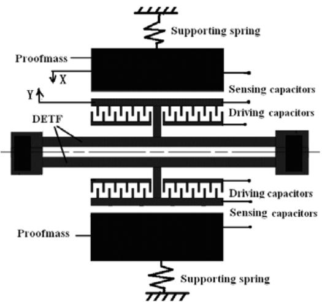
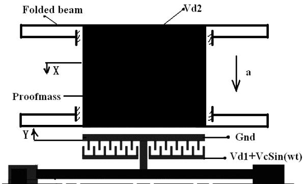
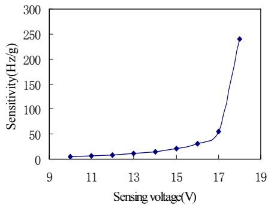
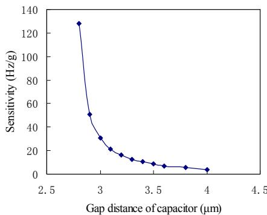
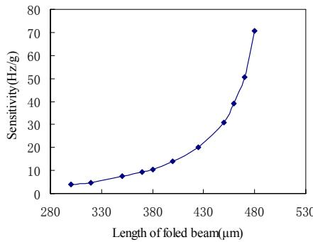
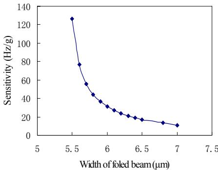
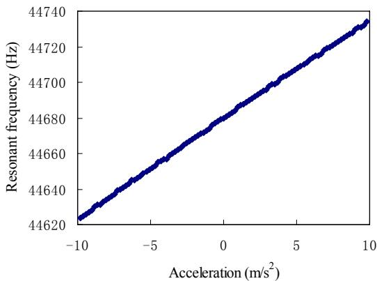
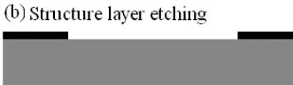
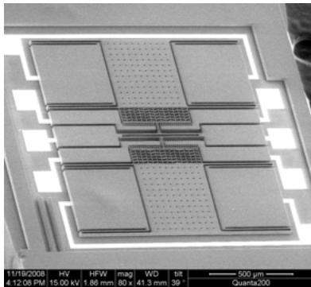
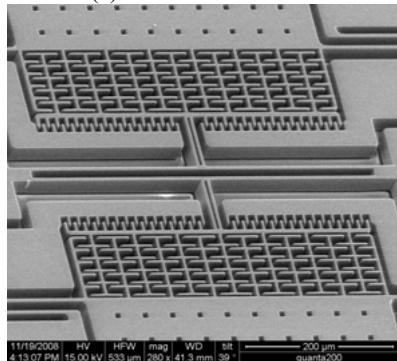

# Structure Design and Fabrication of Silicon Resonant Micro-accelerometer Based on Electrostatic Rigidity

ZHANG Feng-tian, HE Xiao-ping, SHI Zhi-gui, ZHOU Wu

Abstract—The structure characteristics and working principle of silicon resonant micro-accelerometer based on electrostatic rigidity are presented. Dynamic characteristics of double-ended tuning fork (DETF) in the sensor are analyzed. Force equilibrium equations of mass and DETF are built respectively for with or without acceleration, through which the relationship between DETF resonant frequency and acceleration is obtained. The influences of folded supporting beams linked with proof mass and gap between capacitive parallel plates on the sensor sensitivity are analyzed, and finally a resonant micro accelerometer with sensitivity of $60\mathrm{Hz / g}$ is designed and fabricated with bulk-silicon dissolved processes.

Index Terms—Electrostatic rigidity; Resonance; Accelerometer; Bulk-silicon dissolved processes.

# I. INTRODUCTION

Resonant principle has been widely used for measuring physical parameters such as mass, acceleration, force, flow or pressure. The main advantage of a resonant sensor over other sensing principles is its quasi-digital output, which implies good resistance to noise or electrical interference and simple interface to a digital system. Resonant accelerometer has been produced and widely used for many years, for example, RBA500 of Honeywell Company. Most resonant accelerometers use quartz material for its excellent piezoelectric performance, but the quartz fabrication is expensive and not compatible with IC (integrated circuits) fabrication technology, which makes it impossible to integrate the sensor and its interface circuits on one chip.

Resonant accelerometers based on the silicon micromachining technology become very attractive due to low cost, small size, compatibility with IC fabrication processes, and potential application in the fields where size and high precision are required. Most silicon resonant accelerometers detect resonant frequency of the vibrating beam subjected to axial loading which relates to inertial force

Manuscript received February 27, 2009.

Zhang Feng-tian is with the Institute of Electronic Engineering, China Academy of Engineering Physics, Mianyang, Sichuan, China. (Phone: 86-0816-2484595, fax: 86-0816-2487594, e-mail: zftstuart@sohu.com).

He Xiao-ping is with the Institute of Electronic Engineering, China Academy of Engineering Physics, Mianyang, Sichuan, China (e-mail: hxp@xleda.com).

SHI Zhi-gui is with the Institute of Electronic Engineering, China Academy of Engineering Physics, Mianyang, Sichuan, China e-mail: (szg@xleda.com).

Zhou Wu is with the Southwest Jiaotong University, Chengdu, Sichuan, China(e-mail: zhouwu916@yahoo.com.cn).

on the proof mass. The vibrating beam is excited by alternating electrostatic or electrothermal force, and the frequency change is sensed by capacitors or piezoresistive resistors respectively [1-6]. In a relatively new concept of resonant accelerometer, inertial force of the proof mass pushes or pulls one electrode as one part of the proof mass, and changes the gap distance of the parallel-plate capacitor, then the electrostatic force between parallel plate electrodes changes with the gap distance, and equivalently changes the efficient mechanical rigidity of the vibrating beam [7-8]. In the previous work of other research groups, the accelerometer was fabricated and showed excellent performances. But the movement and dynamic characteristics of the vibrating beam were not presented, which is very important for understanding the working principle and the sensor structure design. Therefore, in this study, the movement and dynamic characteristics are analyzed with mechanical dynamic theory. The relationship between resonant frequency of the vibrating beam and acceleration is obtained in theory. Finally, a resonant accelerometer with sensitivity of $60\mathrm{Hz / g}$ is designed and fabricated with bulk-silicon dissolved processes.

# II. OPERATING PRINCIPLE

The concept of the resonant accelerometer is shown in Fig.1. It consists of double-ended tuning fork (DETF), driving capacitors, sensing capacitors, proof mass, and supporting springs. The fixed comb electrodes of driving capacitors are excited by an AC voltage with DC bias, DETF is connected to ground, and the proof mass including the electrode of sensing capacitor is connected to a DC voltage. In the horizontal plane, each clamped-clamped beam of DETF vibrates $180^{\circ}$ out of phase with its natural frequency to cancel reaction forces at the ends when there is no acceleration. The sensing capacitors can detect the vibrating frequency of DETF through interface circuits. When there is acceleration, the proof mass moves near or away from the electrode of DETF under inertial force and changes the gap distance of sensing capacitor. The electrostatic force between sensing electrodes induces an additional electrostatic rigidity, which results in the variation of DETF resonant frequency with acceleration. Therefore, detecting the resonant frequency of DETF can measure acceleration.

  
Fig.1. Principle schematic of a resonant accelerometer

# III. THEORY ANALYSIS

Due to the symmetry of sensor structure, one half of the structure shown as in Fig.2 is analyzed. The supporting spring in Fig.1 is realized with four folded beams which not only support the proof mass but also make it capable of moving freely along $x$ axis. The DC voltage of the proof mass is $V_{\mathrm{d2}}$ , the clamped-clamped beam of DETF is connected to GND, and the driving voltage is $V_{\mathrm{c}} \times \sin (\omega t)$ with DC bias voltage $V_{\mathrm{d1}}$ . The forces applied to the clamped-clamped beam include inertial force, damping force, elastic force, driving and sensing electrostatic forces. The mechanical dynamic equation of the vibrating beam can be written as

$$
m \ddot {Y} + c \dot {Y} + \kappa Y = \frac {\varepsilon A V _ {d 2} {} ^ {2}}{2 \left(g _ {0} - x - Y\right) ^ {2}} - \frac {N _ {1} \varepsilon h \left(V _ {d 1} + V _ {c} \sin (\omega t)\right) ^ {2}}{2 g _ {0}} \tag {1}
$$

Where $m$ is the effective mass of the vibrating beam, $c$ damping coefficient, $\kappa$ the effective spring constant of vibrating beam, $\varepsilon$ the permittivity of free space $(8.85 \times 10^{-12} \mathrm{F/m})$ , $A$ the efficient area of the sensing capacitor, $V_{\mathrm{d2}}$ the sensing voltage, $g_0$ the gap distance of driving capacitor and sensing capacitor, $x$ and $Y$ are respectively the displacement of proof mass or vibrating beam relative to initial position when no voltages are applied, and $N_1$ is number of driving comb finger pairs, $h$ is the structure thickness, $\omega$ is the frequency of AC voltage. The first part on the right in (1) is sensing electrostatic forces, while the second part is driving electrostatic forces. In (1), it assumes that the damping force is proportional to velocity.

  
Fig.2. Schematic of the half structure   
From (1), we can see that electrostatic forces of the

vibrating beam include fixed and alternate parts. We can think that the vibrating beam moves to some position by one fixed electrostatic force and vibrates harmonically about this equilibrium position. So $Y$ in (1) can be expressed as $y_{1} + y$ , and $y = y_0 \times \sin (\omega t + \varphi)$ , where $y_{1}$ is the displacement of vibrating beam by the fixed electrostatic force and $y_{0}$ is the displacement amplitude by harmonic force. If $V_{\mathrm{d1}} >> V_{\mathrm{c}}$ , with Taylor expansion, (1) can be rewritten as

$$
\begin{array}{l} m \ddot {y} + c \dot {y} + \kappa \left(y _ {1} + y\right) \cong \frac {\varepsilon A V _ {d 2} {} ^ {2}}{2 \left(g _ {0} - x - y _ {1}\right) ^ {2}} \tag {2} \\ + \frac {\varepsilon A V _ {d 2} ^ {2}}{\left(g _ {0} - x - y _ {1}\right) ^ {3}} y - \frac {N _ {1} \varepsilon h V _ {d 1} ^ {2}}{2 g _ {0}} - \frac {N _ {1} \varepsilon h V _ {d 1} V _ {c} \sin (\omega t)}{g _ {0}} \\ \end{array}
$$

Equivalently, we can obtain

$$
\kappa y _ {1} - \frac {\varepsilon A V _ {d 2} {} ^ {2}}{2 \left(g _ {0} - x - y _ {1}\right) ^ {2}} + \frac {N _ {1} \varepsilon h V _ {d 1} {} ^ {2}}{2 g _ {0}} = 0 \tag {3}
$$

$$
m \ddot {y} + c \dot {y} + \left(\kappa - \frac {\varepsilon A V _ {d 2} {} ^ {2}}{\left(g _ {0} - x - y _ {1}\right) ^ {3}}\right) y = - \frac {N _ {1} \varepsilon h V _ {d 1} V _ {c} \sin (\omega t)}{g _ {0}} \tag {4}
$$

Equation (3) describes the displacement of vibrating beam by fixed force. We can see that $y_{1}$ is determined by the driving or sensing DC voltage in addition to the sensor structure and size. Equation (4) is the harmonic oscillation equation. It shows that there is an additional force proportional to the vibrating amplitude in (4), equivalently an additional rigidity caused by electrostatic force between parallel plates of sensing capacitor. The rigidity named electrostatic rigidity $\kappa_{\mathrm{e}}$ can be written as

$$
\kappa_ {e} = \frac {\varepsilon A V _ {d 2} {} ^ {2}}{\left(g _ {0} - x - y _ {1}\right) ^ {3}} \tag {5}
$$

Then, the resonant frequency of vibrating beam is as follows

$$
f _ {n} = \frac {1}{2 \pi} \sqrt {\frac {\kappa - \kappa_ {e}}{m}} \tag {6}
$$

When there is acceleration which direction shown as in Fig.2, the displacement of proof mass caused by inertial force is $\Delta x$ . The electrostatic force between parallel plates of sensing capacitor will change and result in displacement variation $\Delta y_{1}$ of the electrode on the vibrating beam. Thus, the gap distance of sensing parallel-plate capacitor change $\Delta x + \Delta y_{1}$ . The electrostatic rigidity induced by sensing parallel-plate capacitor will vary and alter resonant frequency of the vibrating beam shown as

$$
f _ {n} = \frac {1}{2 \pi} \sqrt {\frac {\kappa - \frac {\varepsilon A V _ {d 2} {} ^ {2}}{\left(g _ {0} - (x - \Delta x) - \left(y _ {1} - \Delta y _ {1}\right)\right) ^ {3}}}{m}} \tag {7}
$$

Due to that the natural frequency of vibrating beam is greatly higher than that of proof mass-spring system, the electrostatic force frequency applied to the proof mass by beam vibrating is also largely higher than that of proof mass-string system. So the displacement of proof mass caused by beam vibrating can be neglected. When there is no acceleration, the elastic force and electrostatic force applied to the proof mass are equal. We can obtain the force

equilibrium equation of proof mass as follow

$$
\kappa_ {s} x - \frac {\varepsilon A V _ {d 2} {} ^ {2}}{2 \left(g _ {0} - x - y _ {1}\right) ^ {2}} = 0 \tag {8}
$$

Where $\kappa_{\mathrm{s}}$ is spring constant of the folded supporting beams linked with proof mass.

When there is acceleration shown as in Fig.2, the gap of sensing capacitor will change, and the elastic force plus inertial force is equal to electrostatic force by sensing capacitor, the force equilibrium equation can be written as

$$
\frac {\varepsilon A V _ {d 2} {} ^ {2}}{2 \left(g _ {0} - (x - \Delta x) - \left(y _ {1} - \Delta y _ {1}\right)\right) ^ {2}} - \kappa_ {s} (x - \Delta x) - M a = 0 \tag {9}
$$

Here $M$ refers to the mass of the proof mass. As for the vibrating beam, from (3), we can obtain

$$
\begin{array}{l} \frac {\varepsilon A V _ {d 2} {} ^ {2}}{2 \left(g _ {0} - (x - \Delta x) - \left(y _ {1} - \Delta y _ {1}\right)\right) ^ {2}} - \frac {N _ {1} \varepsilon h V _ {d 1} {} ^ {2}}{2 g _ {0}} \tag {10} \\ + m a - \kappa \left(y _ {1} - \Delta y _ {1}\right) = 0 \\ \end{array}
$$

When the sensor structure size, driving and sensing voltage are determined, from (3) (8) (9) (10), we can calculate the value of $x, y_{1}, \triangle x, \triangle y_{1}$ , and substitute them into (7), the relationship between the beam vibrating frequency and acceleration can be obtained, which is important for sensor structure design.

# IV. STRUCTURE DEIGN

The accelerometer sensitivity directly affects its precision. The important aspect of sensor structure design is to determine proper structure size to improve the sensor sensitivity when the structure stability is guaranteed. The sensor sensitivity will be calculated at different structure size, driving or sensing voltage, with the above established equations. The vibrating beam is $500\mu \mathrm{m}$ long and $5\mu \mathrm{m}$ wide. The sensor structure is $25\mu \mathrm{m}$ in thickness. The driving AC amplitude is 1V with 15V DC bias. The folded supporting beams are U-shape.

Fig.3a shows the relationship between the sensor sensitivity and sensing voltage when the capacitor gap is $3\mu \mathrm{m}$ , the folded beam is $450\mu \mathrm{m}$ long and $6\mu \mathrm{m}$ width. Fig.3b presents the variation of sensitivity with the capacitor gap distance when the folded beam is $450\mu \mathrm{m}$ long and $6\mu \mathrm{m}$ wide and sensing voltage is $16\mathrm{V}$ . We can see that sensor sensitivity is $70\mathrm{Hz / g}$ or $250\mathrm{Hz / g}$ when sensing voltage is $17\mathrm{V}$ or $18\mathrm{V}$ respectively. Larger sensing voltage and small capacitor gap mean higher sensitivity. The reason is that the sensing capacitor electrostatic force increases when sensing voltage increases and capacitor gap gets narrow, then the variation of electrostatic rigidity at same acceleration become larger and produce larger deviation of vibrating beam resonant frequency. But too large sensing voltage and small capacitor gap may lead to absorption of capacitor plates and structure stability will be ruined.

Fig.3c is the relationship of sensor sensitivity and folded supporting beam width, and Fig.3d shows that of sensor sensitivity and supporting beam length. We can see that narrower and longer supporting beams can improve sensor sensitivity. This is due to that the capacitor gap variation

caused by inertial force of the proof mass is larger when the folded beam is narrow and long, and electrostatic rigidity varies greatly. Also, too narrow or long folded beams will affect the strength and resistance to impact, even maybe result in absorption of capacitor plates and destroy the structure stability.

  
(a)

  
(b)   
(c)

  
(d)   
Fig.3. Sensor sensitivity versus voltage and structure size

From above analysis, smaller capacitor gap, longer and narrower supporting beam, and larger sensing voltage are expected to improve the sensor sensitivity. But in the respect

of stability and strength, they should be controlled properly. So sensitivity and structure stability should be considered at the same time when designing the sensor structure size. The sensor structure size in this study is finally designed as follows: folded supporting beam $450\mu \mathrm{m}$ long and $6\mu \mathrm{m}$ wide, capacitor gap $3\mu \mathrm{m}$ wide, and sensing voltage $17\mathrm{V}$ . The relationship between sensor resonant frequency and applied acceleration is shown in Fig.4. We can see that the designed sensor sensitivity is at least $60\mathrm{Hz / g}$ for one clamped-clamped beam of DETF.

  
Fig.4. Resonant frequency versus applied acceleration

# V. FABRICATION PROCESS

The adopted fabrication process in this study is called bulk-silicon dissolved process. The process sequences are as follows: First, boron is heavily doped into the silicon wafer front side to make the $\mathrm{P + + }$ etch-stop layer which is used as the structure layer and about $25\mu \mathrm{m}$ thick; anchors for wafer-glass bonding are patterned and etched on the wafer front side with ICP deep etch technology(Fig.5a); then, the sensor structure is patterned and etched with the second ICP deep etching (Fig.5b); aluminum is sputtered on the glass wafer to form electrodes through which different voltage can be subjected to different parts of the sensor (Fig.5c); Finally, bonding silicon wafer and glass wafer together using anodic bonding (Fig.5d)and etch the silicon wafer from backside in KOH etch solution until arriving the etch-stop layer and obtaining the sensor structure(Fig.5e).

  
(a) Bonding anchors etching

  
(d) Bonding silicon and glass wafer

  
(c)Electrodes etching on the glass wafer

  
(e) Wet thinning wafer from backside   
Fig.5. Fabrication processes

The SEM pictures of the fabricated sensor structure are shown in Fig.6.

  
(a) Resonant accelerometer   
(b) Resonator   
Fig.6 The SEM pictures of the fabricated sensor

# VI. CONCLUSION

In the silicon resonant accelerometer based on electrostatic rigidity, the proof mass will not vibrate when DETF beams vibrate without acceleration. Meanwhile, the proof mass will move away the initial equilibrium position with acceleration, and apply an additional rigidity to the vibrating beam for change the resonant frequency. According to the dynamic equations of proof mass and DETF, the accelerometer resonant frequency can be determined at any acceleration. By analyzing effects of the structure size, sensing voltage on the sensor sensitivity, a sensor structure suitable for actual fabrication condition is designed and fabricated. Future research work will focus on the measurement of the sensor performance.

# REFERENCES

[1] Chr. Burrer, J. Esteve. A novel resonant silicon accelerometer in bulk-micromachining technology. Sensors and Actuators A 46-47, 1995:185-189.   
[2] Susan X. P. Su, Henry S. Yang, and Alice M. Agogino. A Resonant Accelerometer With Two-Stage Microleverage Mechanisms Fabricated by SOI-MEMS Technology. IEEE Sensors Journal, VOL. 5, NO. 6, 2005:1214-1223   
[3] Ashwin A. Seshia, Moorthi Palaniapan, Trey A. Roessig, Roger T. Howe, Roland W. Gooch, Thomas R. Schimert, and Stephen Montague. A Vacuum Packaged Surface Micromachined Resonant Accelerometer. Journal of microelectromechanical Systems, vol.11, no.6, 2002:784-793.   
[4] Mark Helsel, Gene Gassner, Mike Robinson and Jim Woodruff. A Navigation Grade Micro-Machined Silicon Accelerometer. IEEE 94:51-58.   
[5] Jia Yubin, Hao Yilong, and Zhang Rong. Bulk Silicon Resonant Accelerometer. Chinese Journal of Semiconductors, Vol. 26, No. 2, 2005: 281-286.   
[6] W. Burns, R. D. Horning, W. R. Herb, J. D. Zook, and H. Guckel. Resonant microbeam accelerometers. The 8th international Conference

on Solid-State Sensors and Actuators, and Eurosensors IX. Stockholm, Sweden, June 25-29, 1995: 659-662.   
[7] B. L. Lee, C. H. Oh, Y. S. Oh, and K. Chun, “A Novel Resonant Accelerometer: Electrostatic Stiffness Type”, The 10th International

Conference on Solid State Sensors and Actuators (Transducer '99), Sendai, Japan, June 7-10, 1999, pp.1546-1549.   
[8] Seonho Seok, Hak Kim, and Kukjin Chun. An Inertial-grade laterally-driven MEMS Differential Resonant Accelerometer. IEEE 2004:654-657.M. Young, The Technical Writers Handbook. Mill Valley, CA: University Science, 1989.