# Comparison of Two Types of Micromechanical Silicon Resonant Accelerometer Structures

$^{1,2}$ Libin HUANG, $^{1,2}$ Qingyun LI, $^{1,2}$ Hui YANG, $^{1,2}$ Liye ZHAO

1 Key Laboratory of Micro-Inertial Instrument and Advanced Navigation Technology, Ministry of Education, Nanjing 210096, China

$^{2}$ School of Instrument Science and Engineering, Southeast University,

Nanjing 210096, China

Tel.: (86) 25-83793559

E-mail: huanglibin@seu.edu.cn

Received: 6 December 2013 /Accepted: 29 December 2013 /Published: 30 December 2013

Abstract: Micromechanical silicon resonant accelerometer (MSRA) is a popular research topic in the field of high-precision micromechanical accelerometers because it outputs frequency signal that has strong anti-interference ability, high stability, and resolution. The principal component of a MSRA is the resonator. In this study, a comparative analysis is performed on single-beam and double-beam MSRAs that are structurally similar. The simulation and experimental results show that even though the single-beam MSRA has a higher scale factor compared to the double-beam MSRA, its performance is inferior in terms of bias stability and temperature characteristics. Copyright © 2013 IFSA.

Keywords: Resonant accelerometer, Micro electro mechanical system (MEMS), Structural design, Single-beam, Double-beam.

# 1. Introduction

A micromechanical silicon resonant accelerometer (MSRA) is a typical micro electro mechanical system (MEMS) inertial device. Its basic operating principle is based on the force-frequency characteristics of the resonant beam. The changes in the beam's resonant frequency can be used to determine the value of input acceleration. As the output signal of the MSRA is a frequency signal, it is less prone to the interference of environmental noise and errors during transmission and processing, making high-precise measurement feasible. Consequently, MSRA has become an important development direction in the field of micromechanical accelerometers.

The principal component of an MSRA is the resonator, which is the sensitive element. Generally, in terms of their structure forms, resonators can comprise either a single-beam form, double-beam form (or called double-ended tuning fork, DETF), or triple-beam form. Given the structural complexity of the triple-beam resonator, it is rarely used in practical applications. In the comparison of single-beam and DETF resonators, the latter exhibits a higher quality factor, as it comprises a pair of parallel beams that are amalgamated at the base. When appropriate excitation modes are used to generate in-plane antiphase vibrations of the two resonant beams, the force and torque produced at the base of the resonant beams (the amalgamation zone) offset each other. Thus, there is minimal energy coupling between the external environment and the entire structure. As a

result, the energy loss of the vibration system is very small and the vibration system possesses a high quality factor [1]. Hence, in recent years, the DETF structure has seen wide usage, including in studies conducted by the Draper Laboratory (United States) [2]; University of California, Berkeley [3-6]; Seoul National University [7-9]; and various research institutions in China, such as Peking University [10], Tianjin University [11], Beijing University of Aeronautics and Astronautics [12], Chongqing University, China Academy of Engineering Physics [13, 14], Nanjing University of Science and Technology [15] and Tsinghua University [16].

Compared with the single-beam structure, the DETF structure has higher processing requirement. This is because the two beams of the DETF structure must be perfectly symmetrical in order to maximize their advantages during operation.

S. P. Beeby and M. J. Tudor utilized ANSYS simulation to compare energy loss during vibration at the bases of several widely used single-beam, DETF, and triple-beam resonators [1].

Reference [16] performed a comparison between single-beam and DETF MSRAs by using theoretical analyses, finite element simulations, and experimental validation. The findings showed that the scale factor for the single-beam structure was greater than that of the DETF structure. With the increase in environmental pressure during operation, the quality factor Q of the DETF structure gradually converged with that of the single-beam structure. Owing to the limitations of existing domestic microprocessing technologies, a certain degree of error in the resonant frequencies of the two processed DETF beams increased difficulty in the design of the peripheral circuits.

Although the studies mentioned above have made a reasonable number of comparisons between the single-beam and DETF structures, they are not comprehensive. In particular, there has been no comparison made from the perspective of system performance and a clear conclusion could not be arrived.

In this study, a single-beam and a DETF MSRA are designed. The two accelerometers are compared through simulation analysis and testing of system performance.

# 2. Structural Design of the Two Accelerometers

The structure of an MSRA comprises resonators, proof mass, lever amplification mechanisms, and support beams. A differential structure is applied in the overall structure. Two resonators of identical dimensions are placed in a symmetrical arrangement. Under the effect of acceleration, the proof mass converts the acceleration to an inertial force, which then acts on the input beam of the lever. After amplification by the lever, the force acts on the

resonator. When one resonator is under pressure, its resonant frequency is reduced. Meanwhile tensile force is exerted on the other resonator, thereby increasing its resonant frequency. The difference in frequencies between the two resonators can then be used to calculate the magnitude of the input acceleration.

All the structural components of the two accelerometers, except the resonators, are identical. The schematic diagrams of the single-beam and DETF MSRAs are shown in Fig.1 and Fig.2, respectively. The thickness of the entire structural layer is $60~\mu \mathrm{m}$ and the height of the anchor is $20~\mu \mathrm{m}$ . The critical dimensions of the two accelerometers are listed in Table 1.

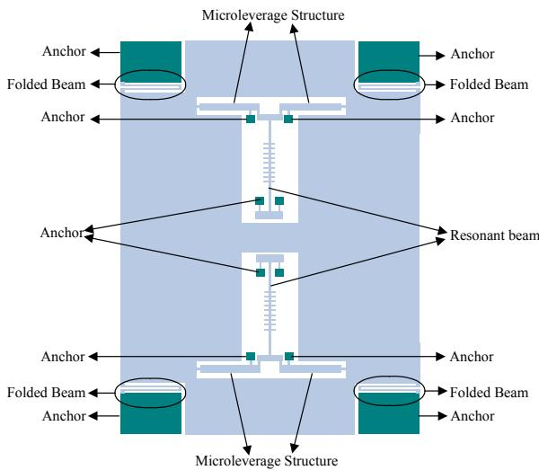  
Fig. 1. Schematic diagram of single-beam MSRA.

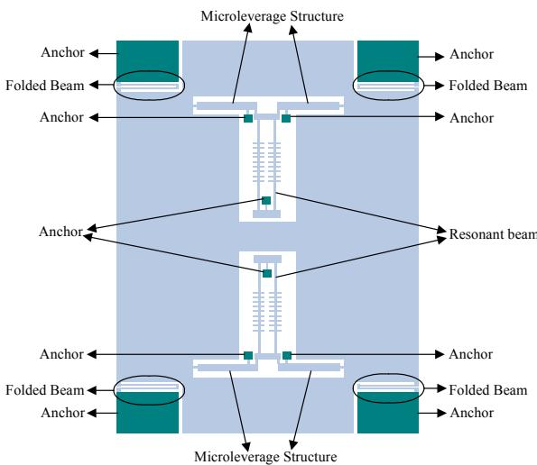  
Fig. 2. Schematic diagram of DETF MSRA.

ANSYS is used to perform mode analysis of the two accelerometer structures. The working modes of the resonators of the single-beam and DETF MSRAs are shown in Fig. 3 and Fig. 4, respectively. The operating frequencies of the upper and lower

resonators of the single-beam MSRA are $41917\mathrm{Hz}$ and $41910\mathrm{Hz}$ , whereas those of the DETF MSRA are $41926\mathrm{Hz}$ and $41915\mathrm{Hz}$ , respectively. The negligible difference between the operating frequencies of the upper and lower resonators in both the accelerometers is caused by cumulative calculation errors.

Table 1. The parameters of the accelerometers.   

<table><tr><td>Parameter</td><td>Length (μm)</td><td>Width (μm)</td><td>Depth (μm)</td></tr><tr><td>Resonant beam</td><td>1100</td><td>8</td><td>60</td></tr><tr><td>Comb</td><td>20</td><td>4</td><td>60</td></tr><tr><td>Microleverage</td><td>950</td><td>50</td><td>60</td></tr><tr><td>Input beam</td><td>50</td><td>10</td><td>60</td></tr><tr><td>Output beam</td><td>60</td><td>10</td><td>60</td></tr><tr><td>Pivot beam</td><td>80</td><td>10</td><td>60</td></tr></table>

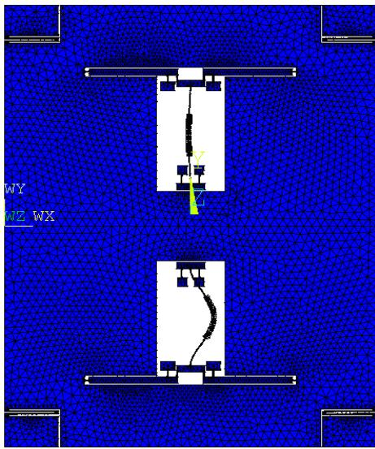  
Fig. 3 (a). Working mode of single-beam MSRA of the lower resonator.

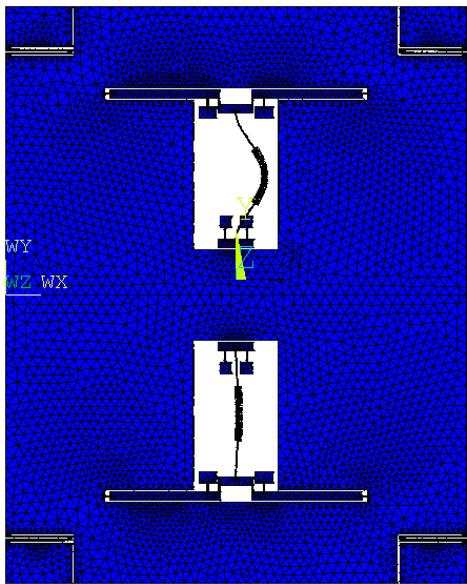  
Fig. 3 (b). Working mode of single-beam MSRA of the upper resonator.

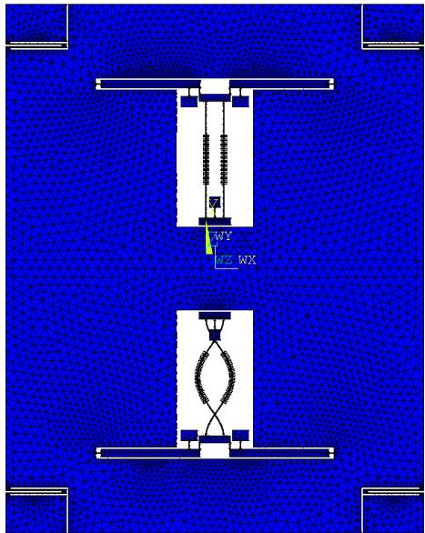  
Fig. 4 (a). Working mode of DETF MSRA of the lower resonator.

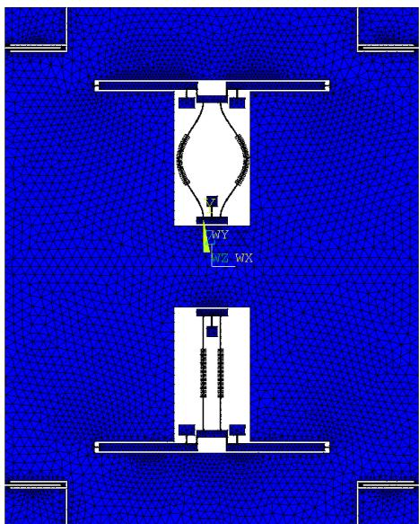  
Fig. 4 (b). Working modes of DETF MSRA of the upper resonator.

Different accelerations are applied to the accelerometers to obtain their frequency changes under various input accelerations in order to calculate of their scale factors. The scale factors of the single-beam and DETF MSRAs are $144.86\mathrm{Hz / g}$ and $80.922\mathrm{Hz / g}$ , respectively. When the dimensions of the resonant beam, comb structure, and leverage mechanism are identical, the scale factor of the single-beam MSRA is evidently much higher than that of the DETF MSRA.

Ideally, the differential structure of the accelerometer should eliminate the common-mode errors caused by temperature. However, the effect of the differential structure is weakened when processing errors cause the upper and lower

resonators within the structure to be imperfectly symmetrical. The analysis is finished in batches of accelerometer structures and the result reveals that there are negligible differences between the two DETF beams. However, there are perceptible differences between the resonant frequencies of the upper and lower resonators for the majority of those structures.

The MSRA is fabricated by silicon-on-glass (SOG) technology. In the process, anodic bonding technology is used to bind the silicon and glass wafers. The silicon and glass wafers act as the structural and substrate layers, respectively, of the MEMS device. Because of the mismatching thermal expansion coefficients of silicon and glass, thermal stress will be produced when temperature changes.

It is assumed that the beam of the upper resonator is over-etched by $0.05\mu \mathrm{m}$ . In this state, the working frequencies of the two resonators of the single-beam MSRA become $41673\mathrm{Hz}$ and $41914\mathrm{Hz}$ , respectively. For the DETF MSRA, the working frequencies of the two resonators become $41695\mathrm{Hz}$ and $41928\mathrm{Hz}$ , respectively. Thermal simulation analyses are separately performed on the two accelerometers. The respective thermal analysis models are shown in Fig. 5. The silicon structural layer, which is $60\mu \mathrm{m}$ thick, is represented by the pale blue portion. The glass layer, which is $500\mu \mathrm{m}$ thick, is represented by the dark blue portion. Fig. 6 shows the stress distributions of the two accelerometers when the ambient temperature decreases from room temperature to $-40^{\circ}\mathrm{C}$ . Fig. 7 is the stress distributions of the two accelerometers when the ambient temperature increases from room temperature to $+60^{\circ}\mathrm{C}$ .

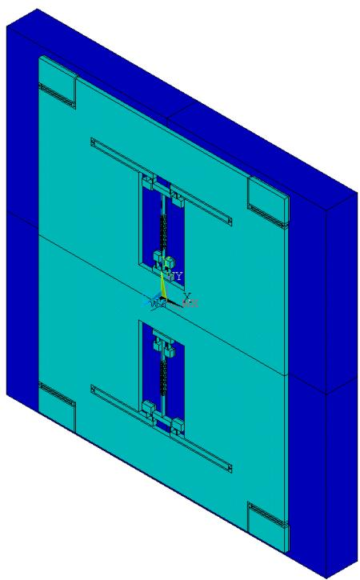  
Fig. 5 (a). Thermal analysis model of the two accelerometers: Single-beam MSRA.

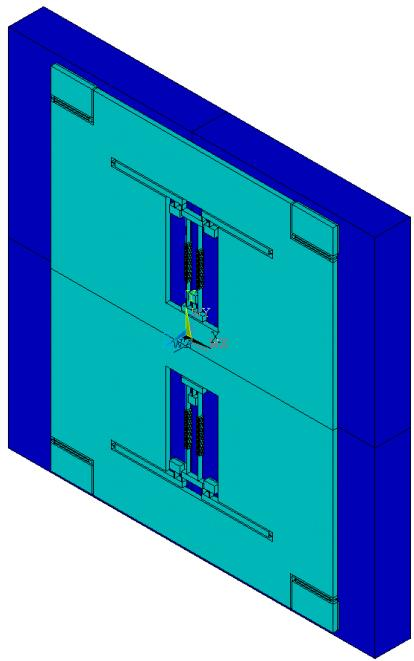  
Fig. 5 (b). Thermal analysis model of the two accelerometers: DETF MSRA.

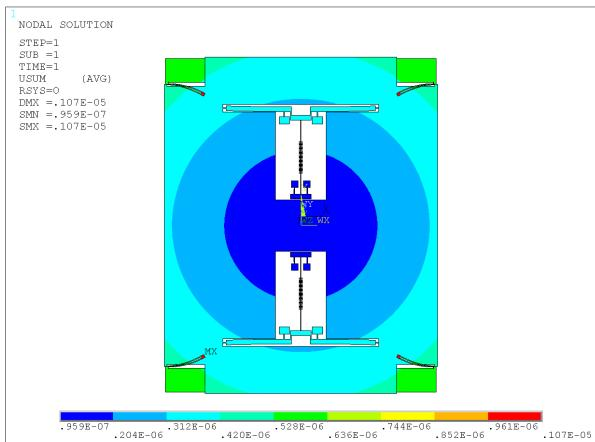  
Fig. 6 (a). The stress distributions of the two accelerometers when the ambient temperature decreases from room temperature to $-40^{\circ}\mathrm{C}$ : single-beam MSRA.

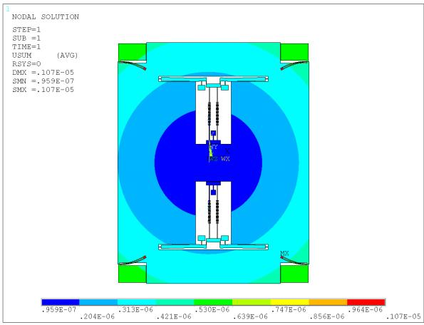  
Fig. 6 (b). The stress distributions of the two accelerometers when the ambient temperature decreases from room temperature to $-40^{\circ}\mathrm{C}$ : DETF MSRA.

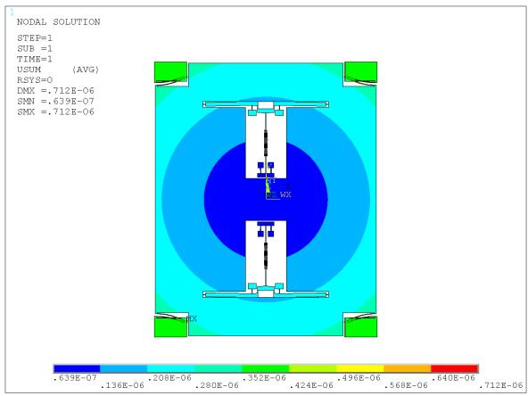  
Fig. 7 (a). The stress distributions of the two accelerometers when the ambient temperature increases from room temperature to $+60^{\circ}\mathrm{C}$ : single-beam MSRA.

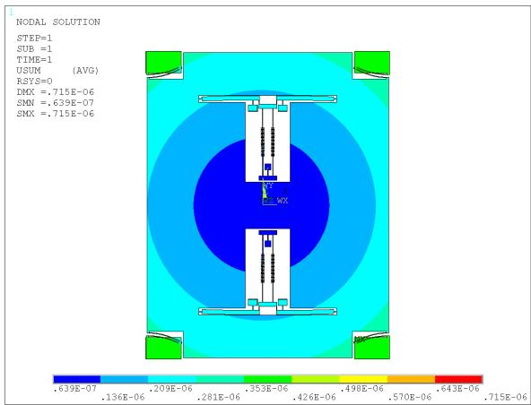  
Fig. 7 (b). The stress distributions of the two accelerometers when the ambient temperature increases from room temperature to $+60^{\circ}\mathrm{C}$ : DETF MSRA.

Table 2. Resonant frequency of the single-beam accelerometer at different temperatures.   

<table><tr><td>Temperature (℃)</td><td>-40</td><td>20</td><td>60</td></tr><tr><td>Frequency of the Upper Resonator (Hz)</td><td>39007</td><td>41673</td><td>43224</td></tr><tr><td>Frequency of the Lower Resonator (Hz)</td><td>39355</td><td>41914</td><td>43531</td></tr><tr><td>Differential Frequency (Hz)</td><td>348</td><td>241</td><td>307</td></tr></table>

Table 3. Resonant frequency of the DETF accelerometer at different temperatures.   

<table><tr><td>Temperature (℃)</td><td>-40</td><td>20</td><td>60</td></tr><tr><td>Frequency of the Upper Resonator (Hz)</td><td>39806</td><td>41695</td><td>42910</td></tr><tr><td>Frequency of the Lower Resonator (Hz)</td><td>40035</td><td>41928</td><td>43128</td></tr><tr><td>Differential Frequency (Hz)</td><td>229</td><td>233</td><td>218</td></tr></table>

The thermal stress is imposed on the structure as pre-stress, and a structural dynamic analysis is performed on the structure. The working frequencies

of the resonator in the single-beam and DETF structures at different temperatures are listed in Tables 2 and 3, respectively. It can be observed from these two tables that when the dimensions of the upper and lower resonators are asymmetrical, their differential outputs vary with changes in temperature. Across the entire range of temperatures, the differential outputs of the single-beam and DETF MSRAs vary by $107\mathrm{Hz}$ and $15\mathrm{Hz}$ , and their temperature coefficients are $7.3864\mathrm{mg} / {}^{\circ}\mathrm{C}$ and $1.8536\mathrm{mg} / {}^{\circ}\mathrm{C}$ , respectively. The simulation results show that when the upper and lower resonators asymmetrical, the effect of temperature on the DETF MSRA is less than that on the single-beam MSRA.

# 3. Experimental Tests and Results

The MSRAs are fabricated by using the SOG technique. Fig. 8 shows that the local structures of the two accelerometers under the 3D video microscope. The accelerometer structures are encapsulated using ceramic vacuum packaging. Three structures are selected from each of the two types of packaged accelerometers used for experimental purposes. Open-loop tests are conducted on the six accelerometers. The test data are displayed in Table 4 (S1, S2 and S3 are single-beam accelerometers; D1, D2 and D3 are DETF accelerometers).

The prototypes of both types of accelerometers are assembled using the same circuit. Testing results of the accelerometers are as following.

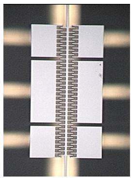  
(a) Single-beam MSRA

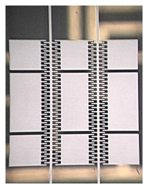  
(b) DETF MSRA   
Fig. 8. The local structure of the two accelerometers under the 3D video microscope.

Table 4. Open-loop test results of accelerometer structures.   

<table><tr><td>Number</td><td>Resonant frequency of the upper resonator (kHz)</td><td>Resonant frequency of the lower resonator (kHz)</td><td>Differential frequency (Hz)</td></tr><tr><td>S1</td><td>38.879</td><td>38.894</td><td>15</td></tr><tr><td>S2</td><td>39.896</td><td>39.947</td><td>51</td></tr><tr><td>S3</td><td>38.886</td><td>38.950</td><td>64</td></tr><tr><td>D1</td><td>41.140</td><td>41.216</td><td>76</td></tr><tr><td>D2</td><td>41.152</td><td>41.189</td><td>37</td></tr><tr><td>D3</td><td>41.293</td><td>41.195</td><td>98</td></tr></table>

# 3.1. Scale Factor

The accelerometer is installed on the precision dividing head at room temperature. First, the accelerometer is electrically pre-heated. After that there is an input of $\pm 1\mathrm{g}$ into the accelerometer. The output data of the accelerometer is recorded at a sampling frequency of $1\mathrm{Hz}$ . The measurement time at each point does not exceed 30 s. The measurements are averaged. The scale factor $K_{1}$ is calculated according to Equation (1):

$$
K _ {1} = \frac {U _ {+ 1 g} - U _ {- 1 g}}{2} \tag {1}
$$

where $U_{+lg}$ and $U_{-lg}$ are the output of the accelerometer when the acceleration input is $+1 \, \mathrm{g}$ and $-1 \, \mathrm{g}$ , respectively. The Scale factors of accelerometers are shown in Table 5.

Table 5. Scale factors of accelerometers.   

<table><tr><td>Number</td><td>Scale factor (Hz/g)</td></tr><tr><td>S1</td><td>135.2021</td></tr><tr><td>S2</td><td>133.121</td></tr><tr><td>S3</td><td>135.7746</td></tr><tr><td>D1</td><td>84.67296</td></tr><tr><td>D2</td><td>80.18871</td></tr><tr><td>D3</td><td>83.48448</td></tr></table>

# 3.2. Bias Stability

The accelerometer is installed on the precision dividing head. The input shaft of the accelerometer is in the horizontal position, which is nearly $0\mathrm{g}$ . After the accelerometer is electrically pre-heated for 20 min at room temperature, the prototype is tested for 60 min at a sampling rate of $1\mathrm{Hz}$ . The standard deviation $(1\sigma)$ is calculated as the stability index. Figs. 9-14 show the bias stability measurement curves of different accelerometers. The values of the Bias stability are listed in Table 6.

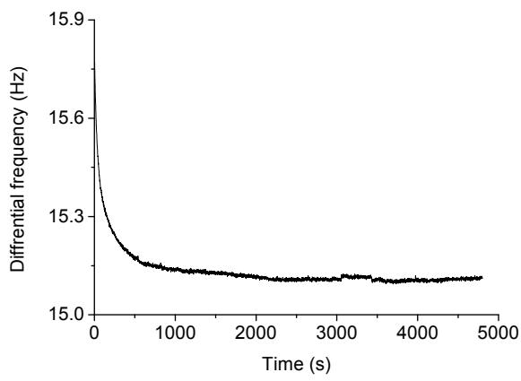  
Fig. 9. The bias stability measurement curve of S1.

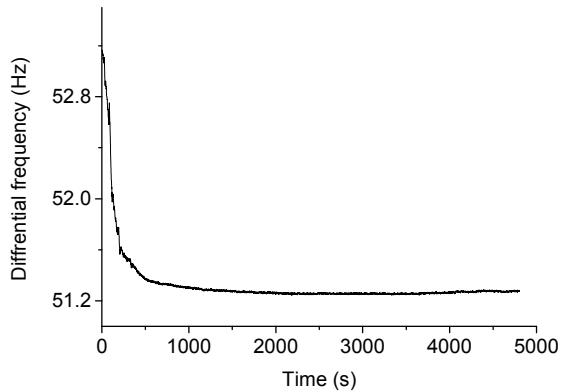  
Fig. 10. The bias stability measurement curve of S2.

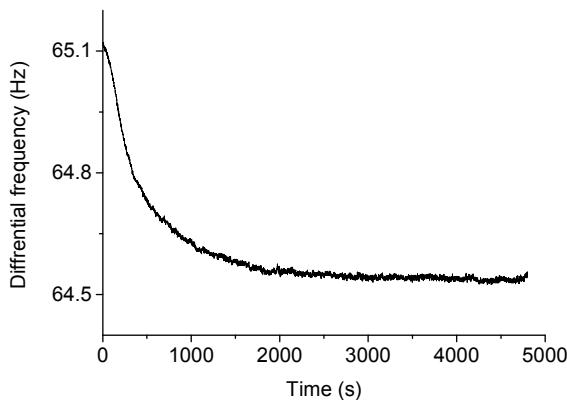  
Fig. 11. The bias stability measurement curve of S3.

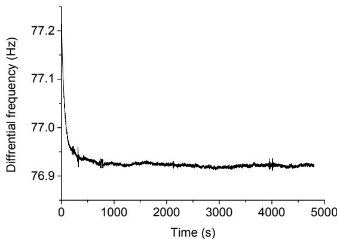  
Fig. 12. The bias stability measurement curve of D1.

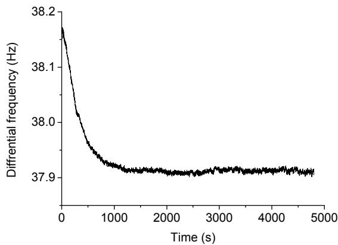  
Fig. 13. The bias stability measurement curve of D2.

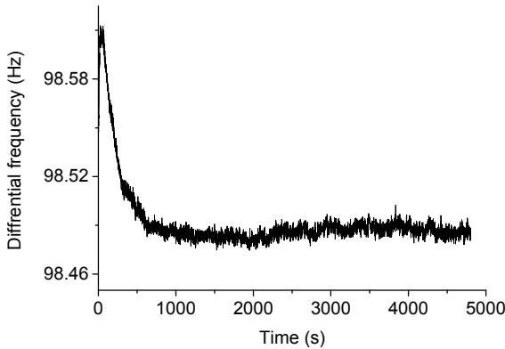  
Fig. 14. The bias stability measurement curve of D3.

Table 6. Bias stability of accelerometers.   

<table><tr><td>Number</td><td>Bias stability (μg)</td></tr><tr><td>S1</td><td>64.30</td></tr><tr><td>S2</td><td>73.62</td></tr><tr><td>S3</td><td>121</td></tr><tr><td>D1</td><td>36.51</td></tr><tr><td>D2</td><td>41.05</td></tr><tr><td>D3</td><td>47.14</td></tr></table>

# 3.3. Full Temperature Test

The accelerometer is placed in a temperature-controlled oven, where the temperature is maintained at $-40^{\circ}\mathrm{C}, -20^{\circ}\mathrm{C}, 0^{\circ}\mathrm{C}, +20^{\circ}\mathrm{C}, +40^{\circ}\mathrm{C}$ and $+60^{\circ}\mathrm{C}$ , each for $1\mathrm{h}$ . Then, the differential frequency of the accelerometer at each temperature is measured. The output data is recorded at a sampling frequency of $1\mathrm{Hz}$ . The measurement time at each temperature is $30\mathrm{s}$ . The average value of 30 samples is considered the output at each temperature.

The bias temperature coefficient, $B_{t}$ , is defined as

$$
B _ {t} = \frac {B _ {\text {m a x}} - B _ {\text {m i n}}}{1 0 0}, \tag {2}
$$

where $B_{\text{max}}$ and $B_{\text{min}}$ are the maximum and minimum differential output values, respectively, during the entire process of varying the temperature. The $B_{t}$ of the six accelerometers are listed in Table 7.

Table 7. Bias temperature coefficient of accelerometers.   

<table><tr><td>Number</td><td>Bias temperature coefficient (Hz/°C)</td><td>Bias temperature coefficient (mg/°C)</td></tr><tr><td>S1</td><td>0.59044</td><td>4.367</td></tr><tr><td>S2</td><td>0.9</td><td>6.7607</td></tr><tr><td>S3</td><td>0.93391</td><td>6.8783</td></tr><tr><td>D1</td><td>0.10603</td><td>1.2522</td></tr><tr><td>D2</td><td>0.13598</td><td>1.6957</td></tr><tr><td>D3</td><td>0.20305</td><td>2.4321</td></tr></table>

# 4. Conclusion

In this study, a comparative analysis is performed on single-beam and DETF MSRAs that are structurally similar. It can be concluded from the simulation analyses that in the case when the critical dimensions are identical, the scale factor of the single-beam MSRA is significantly higher than that of the DETF MSRA. When the upper and lower resonators are not completely symmetrical, the effect of temperature on the DETF MSRA is less than that on the single-beam MSRA. The experimental test results of the two accelerometer prototypes show that even though the scale factor of the single-ended MSRA is significantly higher than that of the DETF MSRA, the performance of the former is lower than that of the latter in full temperature experiment. In addition, the bias stability of the single-beam MSRA is also not as good as that of the DETF MSRA.

# Acknowledgements

This work was supported by the National Natural Science Foundation of China (No. 61101021), the Jiangsu Provincial Natural Science Foundation of China (No. BK2010401), the Foundation (No. KL201103) of Key Laboratory of Micro-Inertial Instrument and Advanced Navigation Technology, Ministry of Education, China and the Fundamental Research Funds for the Central Universities (3222003102).

# References

[1]. S. P. Beeby, M. J. Tudor, Modeling and optimization of micro-machined silicon resonators, journal of Micromechanics and Microengineering, Vol. 5, Issue, 1995, pp. 103-105.   
[2]. Ralph Hopkins, Joseph Miola, Roy Setterlund, The silicon oscillating accelerometer: A high-performance MEMS accelerometer for precision navigation and strategic guidance applications, *The Draper Technological Digest*, 2006, pp. 6-13.   
[3]. Trey A. Roessig, Roger T. Howe, Albert P. Pisano, Surface-micromachined resonant accelerometer, in Proceedings of the International Conference on Solid-State Sensors and Actuators, 1997, pp. 859-862.   
[4]. Ashwin A. Seshia, Moorthi Palaniapan, Trey A. Roessig. A vacuum packaged surface micromachined resonant accelerometer, Journal of Microelectromechanical Systems, Vol. 11, Issue 6, 2002, pp. 784-793.   
[5]. Ashwin Arunkumar Seshia, Integrated micromechanical resonant sensors for inertial measurement systems, PhD Thesis, Department of Electrical Engineering and Computer Sciences, University of California, Berkeley, USA, 2002.   
[6]. X.-P. S. Su, H. S. Yang, Single-stage microleverage mechanism optimization in a resonant accelerometer, Structural and Multidisciplinary Optimization, Vol. 21, Issue 3, April 2001, pp. 246-252.

[7]. Hyeon Cheol Kim, Seonho Seok, Ilwhan Kim, et al. Inertial-grade out-of-plane and in-plane differential resonant silicon accelerometers (DRXLs), in Proceedings of the $13^{\text{th}}$ International Conference on Solid-State Sensors, Actuators and Microsystems, 2005, pp. 172-175.   
[8]. Chul Hyun, Jang Gyu Lee, Taesam Kang, Precise oscillation loop for a resonant type MEMS inertial sensors, in Proceedings of the SICE-ICASE International Joint Conference, 2006, pp. 1953-1958.   
[9]. Seonho Seok, Hak Kim, and Kukjin Chun, An inertial-grade laterally-driven MEMS differential resonant accelerometer, in Proceedings of the IEEE International Conference on Sensors, 24-27 October 2004, Vol. 2, pp. 654-657.   
[10]. Jia Yubin, Hao Yilong, Zhang Rong, Double tuning-fork resonant accelerometer, in Proceedings of the $7^{\text{th}}$ International Conference on Solid-State and Integrated Circuits Technology, Vol. 3, 18-21 October 2004, pp. 1812-1815.   
[11]. Zhong Ying, Zhang Guoxiong, et al., Silicon micromachined tuning fork resonator, Chinese Journal of Science Instrument, Vol. 26, Issue 8, 2005, pp. 782-785.

[12]. Ren Jie, Fan Shang-Chun, Wang Lu-Da, Critical technologies in design of micromechanical resonant accelerometer, Chinese Journal of Sensors and Actuators, Vol. 21, Issue 4, 2008, pp. 593-595.   
[13]. He Gao-Fa, Tang Yi-Ke, He Xiao-Ping, Wu Ying, Design of resonant micro accelerometer and analysis of fabricating error, Transducers and Microsystem Technology, Vol. 28, Issue 1, 2009, pp. 10-12.   
[14]. He Gao-Fa, Tang Yi-Ke, Zhou Chuan-De, He Xiao-Ping, Wu Ying, Design and fabrication of a novel resonator for resonant accelerometer, Journal of Chongqing University, Vol. 32, Issue 9, 2009, pp. 997-1001.   
[15]. Dong Jinhu, Research on the temperature characteristic of the silicon resonant accelerometer, College of Mechanical Engineering, Nanjing University of Science and Technology, Nanjing, 2012.   
[16]. Dong Jingxin, Cao Yu, Wan Caixin, Hu Hao, Comparison of two resonant structures in silicon oscillating accelerometers, Journal of Tsinghua University (Science and Technology), Vol. 50, Issue 11, 2010, pp. 1825-1828.

2013 Copyright ©, International Frequency Sensor Association (IFSA). All rights reserved.  
(http://www.sensorsportal.com)

Reproduced with permission of the copyright owner. Further reproduction prohibited without permission.