# Oscillation Amplitude-controlled Resonant Accelerometer Design Using a Reference Tracking Automatic Gain Control

Sangkyung Sung, Chang Joo Kim, Jungkeun Park, Young Jae Lee, and Joon Goo Park

Abstract: In this paper, it is presented a novel approach for the self-sustained resonant accelerometer design, which takes advantages of an automatic gain control in achieving stabilized oscillation dynamics. Through the proposed system modeling and loop transformation, the feedback controller is designed to maintain uniform oscillation amplitude under dynamic input accelerations. The fabrication process for the mechanical structure is illustrated in brief. Computer simulation and experimental results show the feasibility of the proposed accelerometer design, which is applicable to a control grade inertial sense system.

Keywords: Automatic gain, oscillation, resonant accelerometer, self-sustained.

# 1. INTRODUCTION

With the help of micromachined manufacturing process and technology, various types of MEMS (micro electro-mechanical system) accelerometers have been developed and, among them, resonance type accelerometers are reported to have comparable properties such as large dynamic range and high sensitivity as well as easy interface with digital electronics [1-3]. In particular, the surface micromachined accelerometer in [2] showed good sensitivity with several tens of $\mathrm{Hz / g}$ , but suffered a relatively strong stiffening-spring effect from its beam spring structure. The good feature of resonant accelerometer is also found at the classical quartz type accelerometers as in [4,5]. Also resonant accelerometers presented in [6-8,12] reported sensor performances of control or tactical navigation grade.

The frequency reading, electrically tunable accelerometer has shown certain advantages of an enhanced sensitivity, simple electronics, self-sustained diagnosis, and temperature robustness [6-8]. Yet, owing to its operating and detecting principle, the proposed resonance accelerometer has some shortcomings of limited range and burdensome digital signal processing

electronics. Specifically, the detection strategy of the resonant accelerometer in [8] is to read out the resonant frequency variation from its oscillation signal under applied accelerations. But this sensing strategy has performance limitation since it does not incorporate any control over the proof mass motion. When a large acceleration is applied, the intermediate gap between the proof mass and sensing electrode gets smaller, which may cause an unstable oscillation. This is because the electrostatic force excited in between the moving mass and sensing electrode is inversely proportional to the square of gap distance; the sensor output may produce distorted resonance characteristics, and thus output nonlinearity in certain high input range. Additionally, the frequency readout circuit involves digital electronics parts resulting in a more complicated and noise susceptible signal conditioning circuitry. Unless the integrated circuit method such as ASIC is chosen for the digital signal processing, it is quite burdensome to incorporate the frequency readout circuitry in analog sensor systems. Hence the previous works present a strong case for introducing a resonance type accelerometer that incorporates an oscillation dynamics control and analog signal readout, which can provide an extended bandwidth and robustness. This paper presents a new detection principle and design approach for the resonant accelerometer, which takes advantages of a reference tracking automatic gain control (AGC) scheme. In Section 2, the operational principle and introduction to the plant dynamics are illustrated. In Section 3, detailed system transformation and loop design for the oscillation control is presented. The fabrication of the resonant accelerometer is presented in Section 4. Finally, computer simulation and experimental results are provided in Section 5, followed by the concluding remarks in Section 6.

# 2. SYSTEM ILLUSTRATION

The working principle of the proposed resonant

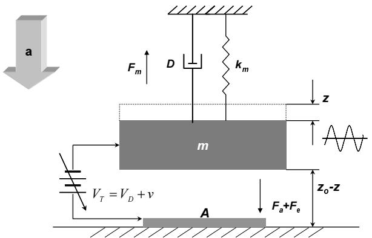  
Fig. 1. Schematics of resonant accelerometer.

accelerometer is based on the oscillation dynamics of MEMS parallel plated resonator. By sustaining the proof mass of the resonator with constant oscillation amplitude subject to acceleration-dependent bias position, the applied acceleration is estimated through the control input signal that maintains the constant oscillation dynamics. In this background, it is devised a parallel-plated electrostatic resonator as shown in Fig. 1. By observing the figure, the governing equation for the plant dynamics is obtained as (1).

$$
F _ {a} = m \ddot {z} + D \dot {z} + k _ {m} z - \varepsilon A \frac {\left(V _ {D} + v\right) ^ {2}}{2 \left(z _ {o} - z\right) ^ {2}}. \tag {1}
$$

In (1), $m$ represents the inertial mass while $D$ represents the damping coefficient, $k_{m}$ represents the spring constant, $\varepsilon$ represents the permittivity constant, $A$ represents the driving electrode area, $V_{D}$ represents the bias voltage, $\nu$ represents the driving voltage, $a$ represents the applied acceleration, $z_{o}$ represents the equilibrium gap and $z$ represents the varying displacement. From the equation, it is easily recognized that the displacement of the proof mass can be controlled by the input driving voltage scaled by the driving bias voltage gain.

Assuming a small signal to $z$ and $\nu$ with respect to $z_{o}$ and $V_{D}$ , respectively, the plant dynamics with a zero input acceleration is modeled as a linear form in below,

$$
G (s) = \frac {k _ {a}}{s ^ {2} + 2 \zeta_ {z} \omega_ {z} s + \omega_ {z} ^ {2}}, \tag {2}
$$

where

$$
k _ {a} = \varepsilon A V _ {D} z _ {o} ^ {- 2} \cdot m ^ {- 1}, \quad \omega_ {z} = \sqrt {(k _ {m} - \varepsilon A V _ {D} ^ {2} z _ {0} ^ {- 3}) \cdot m ^ {- 1}}
$$

and $\zeta_{z} = D\cdot (2m\omega_{z})^{-1}$ . In (2), the higher order perturbation terms are neglected because the plant transfer function $G(s)$ has a low pass filtering dynamics that mitigates the higher order harmonics effectively. Then by applying a sinusoidal driving signal, the proof mass oscillates around the force balanced position where the applied acceleration and electrostatic force are matched to introduce an equilibrium state.

As observed from Fig. 1 and (1), the gap distance between the parallel plates at the equilibrium point varies

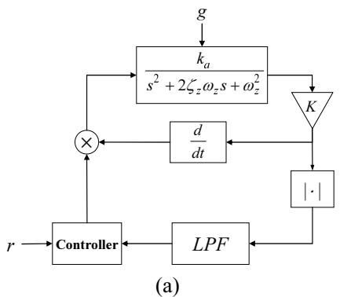

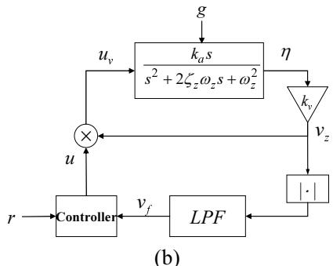  
Fig. 2. (a) AGC loop of resonant accelerometer with differentiator inner branch. (b) Modified AGC loop of resonant accelerometer with simple inner branch.

as the applied acceleration varies. Therefore, the system gain from the driving signal – usually, a voltage – to the electrostatic force contains nonlinear relation depending on the gap induced by the applied acceleration. Also the oscillation amplitude grows large under high acceleration ranges, which results in a performance limitation. Thus the enhanced sensor performance including linearity and high dynamic range motivates an employment of a stable oscillation control.

Considering the dynamical characteristics of the resonant accelerometer yields to a modified automatic gain control loop, which is applied to the system for a stable oscillation around the equilibrium point. In this scheme, the design objective of the control loop is to improve the performance indices of accelerometer, which can include such metrics as dynamic range, output linearity and bandwidth. This objective is accomplished by maintaining the amplitude of oscillation even if there are external accelerations applied. Thus by measuring the control input that suppresses the oscillation amplitude variations, the applied acceleration is computed. In addition, by controlling the oscillation amplitude, the unstable vibration under high acceleration ranges can be effectively avoided.

A simple suppression of the oscillation amplitude variation due to the applied accelerations is achieved by introducing an AGC loop configuration as proposed in Fig. 2(a), where the loop purpose is to regulate the amplitude signal to a given reference value, $r$ . Then by setting a proper reference value, the control objective is to cancel out any amplitude deviation using a stabilizing controller output. In this scheme, however, the derivative

term in the internal feedback connection complicates the analytic equation development required for further system transformations. Instead, the feedback loop given in Fig. 2(b) is taken for the oscillation dynamics control, which reveals its simplicity in further system transformations. Hence in the following design process, the feedback controller is designed to regulate the oscillation velocity at constant magnitude, which results in constant oscillation amplitude control. In Fig. 2(b), $\eta$ denotes the oscillation velocity, $\nu_{z}$ denotes the scaled voltage, $\nu_{f}$ denotes the low pass filter (LPF) output, $u$ denotes the controller output, and $u_{\nu}$ denotes the control input to the plant.

One is also able to observe from the block diagram that the feedback system contains a nonlinear component such as the multiplier and rectifier along with the double-branched feedback connection. Hence it is not easy to design a controller that meets the control objective on the base of conventional control theory. As a breakthrough, a system analysis using the envelope model of the velocity signal is done, and then the resulting controller is applied back to the original nonlinear system.

# 3. CONTROL LOOP DESIGN

In this section, the AGC loop in Section 2 is transformed to achieve a simple feedback connection. An envelope model approximation and state space transformation are applied for the equivalent system development. Using the designed feedback controller, the oscillation velocity is controlled and consequently, the amplitude control is accomplished for the resonant accelerometer.

# 3.1. Envelope-based loop transformation

In Fig. 2(b), under the consideration of the harmonic balance property and low-pass filtering dynamics in the loop, the oscillation velocity of the resonant accelerometer can be given in the following;

$$
\eta (t) = a (t) \sin (\omega_ {r} t + \theta (t)), \tag {3}
$$

where $a(t),\theta (t)$ are the time-varying amplitude and phase, respectively and $\omega_{r} = \omega_{z}\sqrt{1 - \zeta_{z}^{2}}$ is the resonant frequency of the oscillation. If we extract only the envelope of the oscillation by substituting the harmonic principal solution in (3) into the governing equation in (2), it is obtained the following differential equation in terms of amplitude and phase.

$$
2 \dot {a} \left(\omega_ {r} + \dot {\theta}\right) + \left(2 \zeta_ {z} \omega_ {z} a - k _ {a} e\right) \left(\omega_ {r} + \dot {\theta}\right) + a \ddot {\theta} = 0. \tag {4}
$$

Upon dividing the above equation by $2(\omega + \dot{\theta})$ and neglecting the term $\ddot{\theta} / 2(\omega_r + \dot{\theta})$ , the governing equation can be approximated with the following first order differential equation.

$$
\dot {a} + \zeta_ {z} \omega_ {z} \cdot a = 0. 5 \cdot k _ {a} \cdot e. \tag {5}
$$

The removed term, $\ddot{\theta} / 2(\omega_r + \dot{\theta})$ is negligible compared with $\zeta_z\omega_z$ in most vibratory rate sensors operating in the high resonant frequency range. Hence the plant transfer function in Fig. 2(b) can be approximated into

$$
G _ {e} (s) = 0. 5 \cdot k _ {a} / \left(s + \zeta_ {z} \omega_ {z}\right), \tag {6}
$$

which is depicted in Fig. 3(a). Note that the gain of $2 / \pi$ is included due to the gain reduction in the transformed loop, since averaging the absolute value of a sinusoidal signal has a gain of $2 / \pi$ from its maximum amplitude during the envelope detection.

Lastly, the inner feedback loop is simplified by observing the input-output equation at the plant transfer function. By formulating the solution form of the differential equation, the time varying amplitude can be represented in terms of control input $u$ . After some equation developments, it can be defined a nonlinear function $h(u)$ from the control input $u$ to the envelope $a(t)$ as in the following equation.

$$
\begin{array}{l} h [ u (t) ] \triangleq k _ {v} \exp \left\{\int_ {0} ^ {t} \left[ \frac {1}{2} k _ {a} k _ {v} u (\tau) - \zeta_ {z} \omega_ {z} \right] d \tau \right\} \tag {7} \\ = k _ {v} a (t). \\ \end{array}
$$

In (7), $k_{\nu}$ is the voltage gain and $a(t)$ is given by $\exp \{ \int_0^t [0.5 \cdot k_a k_{\nu} u(\tau) - \zeta_z \omega_z ] d\tau \}$ . With this nonlinear function, then the double-branched loop in Fig. 3(a) is transformed into a single loop in Fig. 3(b), since $\nu_{a}(t)$ equals to $k_{\nu} \nu_{a}(t)$ . The detail of the transformation is straightforward using a linear system theory.

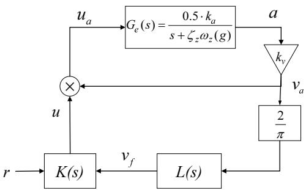  
(a)

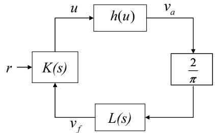  
(b)   
Fig. 3. (a) Envelope-oriented AGC loop of resonant accelerometer. (b) Simple feedback loop realization through a nonlinear functional block.

# 3.2. Controller design

To characterize the desired oscillation dynamics, the feedback controller design needs to resolve a nonlinear reference tracking problem, since the system in Fig. 3(b) contains a nonlinear component in the loop. Considering the frequency rejection feature to realize the envelope detection, we designed the low pass filter as $L(s) = \gamma / (s + \lambda)$ , where $\lambda$ and $\gamma$ are filter parameters determining the cutoff frequency. Then from Fig. 3(b), by defining the state variable as $x_{1} \triangleq \ln(a(t))$ , and $x_{2} \triangleq \nu_{f}(t)$ respectively, the following nonlinear equation holds.

$$
\dot {x} _ {1} = \frac {1}{2} k _ {v} k _ {d} u (\tau) - \zeta_ {z} \omega_ {z}, \tag {8}
$$

$$
\dot {x} _ {2} = \frac {2 \gamma}{\pi} k _ {\nu} e ^ {x _ {1}} - \lambda x _ {2}.
$$

As mentioned previously, the control objective is to regulate the oscillation amplitude in the loop by controlling the velocity signal, which equals to $\nu_{f}$ in Fig. 3(b). Hence by setting the output $y$ to $x_{2}$ , the design goal is to construct a nonlinear feedback tracking system such that the output of the system $y$ tracks a reference input $r$ as time approaches infinity. First, a proportional-integral control employing an output feedback control scheme is taken for the reference tracking performance. A nonlinear system analysis to address the closed loop characteristics is also needed. With this background, the Lyapunov's indirect method is referenced to implement the stable feedback loop [9].

Let us consider a linear feedback control law that contains an integral action such as

$$
u = - k _ {p} y - k _ {i} \sigma , \tag {9}
$$

where $\sigma \triangleq \int_0^t (y - r)d\tau$ . By applying the control law to the nonlinear state equation in (8), the resulting closed-loop system is derived as

$$
\dot {x} = f (x, u), \tag {10}
$$

$$
u = - k _ {p} y - k _ {i} \sigma , \tag {11}
$$

$$
\dot {\sigma} = y - r. \tag {12}
$$

At equilibrium points in (10) and (11), the time derivative of sates goes zero, thus $\dot{x} = 0$ and $\dot{\sigma} = 0$ hold. Therefore at equilibrium point, the following equations hold,

$$
0 = f \left(x _ {e}, u _ {e}\right),
$$

$$
u _ {e} = - k _ {p} y _ {e} - k _ {i} \sigma_ {e}, \tag {13}
$$

$$
0 = y _ {e} - r.
$$

Under the assumption that the equilibrium points in (10) and (12) have a unique solution pair, $(x_{e},\sigma_{e})$ in the domain of interest, the control input $u_{e}$ can be

computed using appropriate control gains, $k_{p}$ and $k_{i}$ in (9). Physically, by obtaining the control gains $k_{p}$ and $k_{i}$ that stabilize the equilibrium point $(x_{e},\sigma_{e})$ , the oscillation velocity in the nonlinear feedback system is asymptotically stable around the equilibrium. Consequently, the oscillation amplitude of the resonant accelerometer converges to a constant value, which is determined by the user-defined reference value $r$ .

Further details about the stability of the designed feedback loop around the equilibrium point can be shown by using Kalman-Yakubovich-Popov Lemma [10], which provides a proper Lyapunov candidate function for the nonlinear feedback system. Then by showing the stability of the transformed system, the stability of the designed system is guaranteed around the equilibrium. The stability analysis is above the scope of this work and thus not included.

# 4. FABRICATION

The fabrication process is basically adapted from [7]. The $40\mu \mathrm{m}$ thick epitaxially grown polysilicon is used as structural layer and sealing area. With the exception of the chemical mechanical planarization (CMP) process, for smoothing the bonding area, the fabrication processes are simple as the conventional surface micromachining process. Fig. 4 shows the overall process flow to fabricate the proposed accelerometer device. The structural ploysilicon layer was grown on $1000\AA$ thick seed poly-Si layer in epitaxial reactor at $1,050^{\circ}\mathrm{C}$ and reduced pressure condition. The measured residual tensile stress was about $10\mathrm{MPa}$ , and the stress gradient is below than $1\mathrm{MPa} / \mu \mathrm{m}$ . The average roughness of the structural ploysilicon was initially about $4,000\AA$ , yet the roughness decreases below than $50\AA$ after the surface polishing process. In Fig. 5, the left picture shows surface of the structure before CMP process and the right one shows the polished surface which enables the bonding process.

The polished $40\mu \mathrm{m}$ thick layer was etched by using the inductive coupled plasma reactive ion etching (DRIE) method. After that a dichloro-dimethyl-silanes (DDMS) coating process was used for an anti-stiction release [11]. The $2.5\mu \mathrm{m}$ thick tetra-ethyl-ortho-silicate (TEOS) was used for the sacrificial layer and $0.5\mu \mathrm{m}$

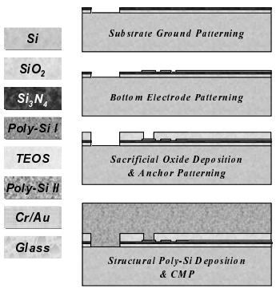

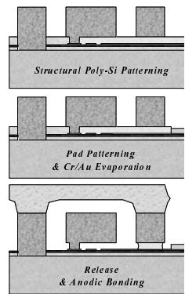  
Fig. 4. Main fabrication process.

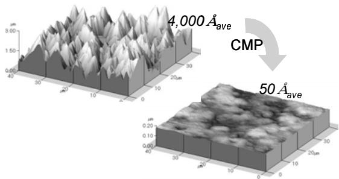  
Fig. 5. SEM pictures of the surface to show CMP process for smoothing.

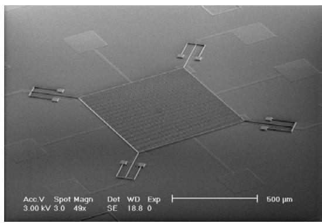  
Fig. 6. SEM picture of the released structure.

thick poly silicon was used for the bottom electrode. Finally, a glass fabrication process was used for the vacuum packaged device implementation [7]. For the sealing cap, the Pyrex #7740 glass wafer was etched in hydrofluoric acid solution with $\mathrm{Cr / Au}$ and PR masking layer, and then anodically bonded with polysilicon wafer at $5\times 10^{-5}$ Torr ambience pressure. The bonding temperature and voltage were $400^{\circ}\mathrm{C}$ and $300\mathrm{V}$ , respectively.

Fig. 6 shows the scanning electron microscope (SEM) picture of the resonant accelerometer mechanical structure. In the figure, the picture in Fig. 6(a) shows whole structure of $1000\mu \mathrm{m}\times 1000\mu \mathrm{m}\times 40\mu \mathrm{m}$ , before vacuum packaging, which is further processed for a PCB mounted device. Note that etch holes of $5\mu \mathrm{m}\times 5\mu \mathrm{m}$ are distributed over the whole surface of mass, which reduces the squeeze damping effect. After dicing the bonded wafer, each mechanical device is attached to the ceramic holder and then bonded with Au wires. Using this wire-bonded device, performance test is done.

The squeeze film effect on the system is taken into account. Since the resonant accelerometer is a vertically vibrating sensor, the well-known squeeze film effect can cause a nonlinear damping coefficient. To avoid the nonlinear dynamics of damping term, three ideas are introduced. First, using the vacuum packaged device, a low ambient pressure about $200 \times 10^{-3}$ Torr was obtained and a high quality factor for the mechanical resonant characteristics. The low pressure in the vacuum packaged device also results in a reduced noise floor caused by Brownian motion. Next, the etch holes over the entire surface of mass reduces the squeeze film effect on the vertical movement of mass. Finally, the vertical

Table 1. Physical parameters of the resonant accelerometer.   

<table><tr><td>parameter</td><td>value</td><td>unit</td></tr><tr><td>Mass</td><td>8.72 x 10-8</td><td>[kg]</td></tr><tr><td>Mechanical stiffness</td><td>144</td><td>[N/m]</td></tr><tr><td>Damping coefficient</td><td>1.772 x 10-4</td><td>[N-s/m]</td></tr><tr><td>Driving electrode</td><td>2.0 x 10-7</td><td>[m2]</td></tr><tr><td>Initial gap</td><td>2.0 x 10-6</td><td>[m]</td></tr><tr><td>Driving bias voltage</td><td>12</td><td>[Volt]</td></tr><tr><td>Permittivity</td><td>8.854 x 10-12</td><td></td></tr></table>

amplitude of electrostatic vibration is designed to be less than $10\%$ of the nominal gap. With these techniques, the squeeze film effect was greatly reduced and could regard the damping coefficient as a first order model, which can be calculated by the quality factor. Using the structural dimensions, the physical parameters are summarized in Table. 1.

# 5. SIMULATION AND EXPERIMENT

In order to verify the designed feedback control loop, a numerical simulation was carried out. The effectiveness of the control loop was further tested on a fabricated MEMS vibratory gyroscope in association with signal conditioning electronics. Both sets of results are presented and discussed herein.

# 5.1. Loop simulation

For a specific application of the developed vibratory gyroscope, the physical parameters listed in Table 1 were utilized. Also the electronics and designed loop parameters are used for the numerical simulation of the proposed AGC loop.

Using the accelerometer parameters, the plant transfer function in (6) is given by $G_{e}(s) = 30.5 / (s + 406.4)$ . The LPF is designed with $\lambda = \gamma = 300$ , so that the cut-off frequency characteristics with respect to the resonant frequency and system bandwidth are satisfied. The reference value to sustain a uniform oscillation in the vertical direction is designed to guarantee the loop stability under full range of input accelerations. Provisioned that the full input range is about $20\mathrm{g}$ , the reference is set to $5\mathrm{V}$ . Then by setting the proportional and integral gain as $k_{p} = 0.5$ and $k_{i} = 50$ respectively, the controller transfer function is given by

$$
K (s) = \frac {0 . 5 (s + 1 0 0)}{s}. \tag {14}
$$

The fundamental operation of the constructed AGC loop is verified by observing the oscillation displacement. Fig. 7 shows the step response of the oscillation signal when $10\mathrm{g}$ acceleration is applied at $\mathfrak{t} = 0.15$ sec. The mean position of oscillation changes because the mass moves into the new equilibrium point, which results in the change of electrostatic force gain according to (1). After the acceleration is applied, the oscillation dynamics

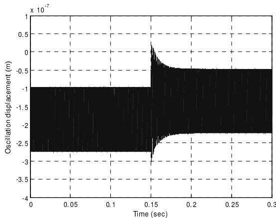  
Fig. 7. Step response when equivalent acceleration of $10\mathrm{g}$ is applied.

converges rapidly to the steady state amplitude of $0.177\mu \mathrm{m}$ , which equals the oscillation amplitude before the acceleration is applied. The simulation showed good result in amplitude regulating with the reference tracking control. Another advantage via the proposed AGC control scheme is that each accelerometer devices have consistently controlled oscillation dynamics while the plant model may have various parameter variations induced by the manufacturing errors.

# 5.2. Experiment

Basic experiments were carried out to show the sensor performance. For this, a hybrid system containing electronics and MEMS mechanical structure are implemented in a single printed circuit board (PCB) that has less than 25 square centimeters. Fig. 8 shows the implementation of electronics. In the figure, the velocity signal was derived using an analog differentiator, where the op-amp circuit is applied to implement.

After applying the reference voltage and adjusting electric gain, the oscillation loop activates a resonance state with the help of the initial white noises lying in the driving voltage. Fig. 9(a) captures an output of the constructed loop in the frequency domain. The figure shows that the oscillation dynamics has the resonant frequency of $5702\mathrm{Hz}$ and the Q-factor of 49883, which

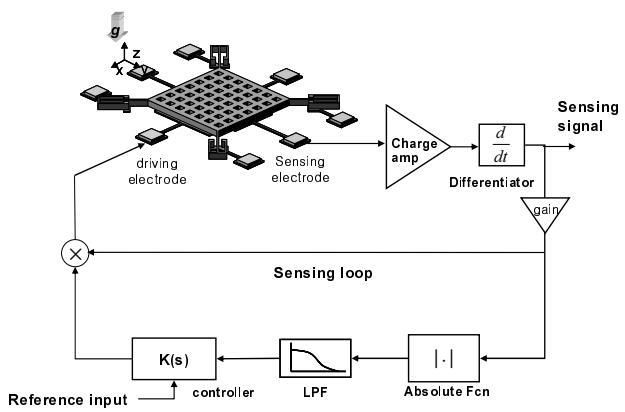  
Fig. 8. Feedback loop implementation for resonant accelerometer.

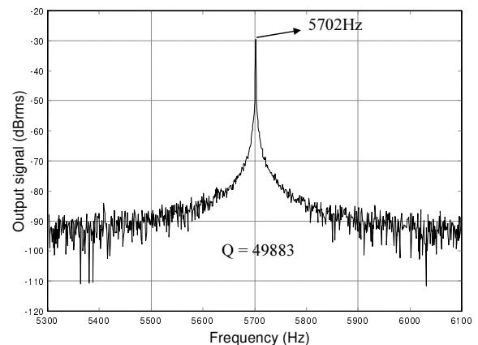  
(a)

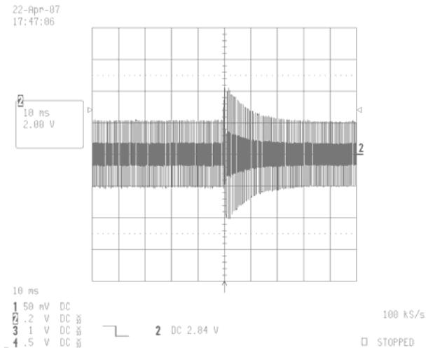  
(b)   
Fig. 9. (a) Output characteristics of loop signal in frequency domain. (b) Step response when $5\mathrm{g}$ is applied.

shows highly stabilized resonance characteristics.

Fig. 9(b) shows the step response of the oscillation amplitude when equivalent acceleration of $5\mathrm{g}$ is applied using electrical force. For readability, the amplitude output was measured by passing through the DC rejection circuitry and thus shows no change of offset voltage change. Through the AGC control loop, the oscillation amplitude approaches to the steady state in less than 20 msec settling time.

A dynamic test was done using a 2-axis rate table, the Acutronics 2000. The rate table is precisely aligned to the earth gravity axis and able to apply static gravity step by step up to the minimum value of $0.01\mathrm{mg}$ . Also accelerations in high range were obtained by the centrifugal force by rotating the rate table. Figure 10 shows the plot of sensor output in association with the applied accelerations. The solid line shows the first order regression model from the measured data. The scale factor is obtained as $0.405\mathrm{V/g}$ in $\pm 10\mathrm{g}$ acceleration range.

In high accelerations ranges over $\pm 10\mathrm{g}$ , the measured voltage output was slightly deviated from the regressive model and generated a nonlinearity which limits the sensor input range. This nonlinearity is caused by the

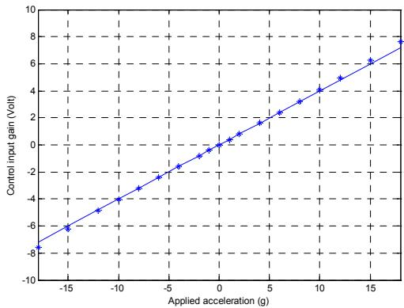  
Fig. 10. Acceleration vs. scaled control input signal when dynamic accelerations are applied.

excessive electrostatic gain control when oscillation condition is much varied from the nominal operating point. With the constraint of scale factor less than $0.5\%$ , the input range is measured as $12\mathrm{g}$ . Lastly, the sensor resolution computed by the signal-to-noise ratio (SNR) with the white noise floor is measured below $1\mathrm{mg}$ . A series of more advanced experiments including environmental test and high acceleration test are under way.

# 6. CONCLUSION

This paper presents a new detection principle and design approach for resonant accelerometer, which takes advantages of a reference tracking automatic gain control scheme. Using the designed oscillation loop and controller, the applied acceleration is measured in the form of the controller output to the accelerometer. For a simple application, the envelope of the driving velocity is considered to make a proper AGC control loop. The mechanical structure is fabricated using the surface micromachining process and anodic wafer bonding method. The high quality factor required for the oscillating dynamics is achieved by producing a vacuum packaged device. We implement the AGC controlled resonant accelerometer by combining the controller, signaling processing electronics, and manufactured device. Both simulation and experimental results show the feasibility of the designed resonant accelerometer with the presented AGC oscillation control scheme. The scale factor linearity of the proposed accelerometer has shown relatively high nonlinear feature, which requires an advanced compensator design in further research.

The proposed resonance type accelerometer can be used to realize an integrated sensor of vibratory gyroscope and resonance-controlled accelerometer simultaneously using the common oscillation dynamics, which is under research presently.

# REFERENCES

[1] T. V. Rozhart, H. Jerman, J. Drake, and C. de Cotis, "An inertial-grade, micromachined vibrating beam accelerometer," Proc. of Transducers '95, pp. 659-662, 1995.

[2] T. A. Roessig, R. Howe, A. Pisano and J. Smith, "Surface-micromachined resonant accelerometer," Proc. of Transducers '97, pp. 859-862, 1997.   
[3] M. A. Meldrum, "Application of vibration beam technology to digital acceleration measurement," Sensors and Actuators A; Physical, vol. A21-A23, pp. 377-380, 1990.   
[4] B. L. Norling, "Superflex: a synergitic combination of vibrating beam and quartz flexure accelerometer," J. of the Institute of Navigation, vol. 34, no.4, pp. 337-353, 1988.   
[5] W. C. Albert, "Vibrating quartz crystal beam accelerometer," Proc. of the 28th ISA International Instrumentation Symposium, pp. 33-44, 1982.   
[6] B. L. Lee, C. H. Oh, Y. S. Oh, and K. Chun, “A novel resonant accelerometer: variable electrostatic stiffness type,” Proc. of Transducers '99, pp. 1546-1549, 1999.   
[7] B. L. Lee, C. H. Oh, S. Lee, Y. S. Oh, and K. Chun, "A vacuum packaged differential resonant accelerometer using gap sensitive electrostatic stiffness changing effect," Proc. of the 13th International Conf. on MEMS, pp. 352-357, 2000.   
[8] S. Sung, J. G. Lee, B. Lee, and T. Kang, "Development of a tunable resonant accelerometer with self-sustained oscillation loop," J. of Micromech. Microeng., vol. 13, no. 3, pp. 246-253, 2003.   
[9] H. K. Khalil, Nonlinear Systems, 2nd edition, Prentice-Hall Inc., Upper Saddle River, New Jersey, 1996.   
[10] Ioannou P. A., Sun J., Robust Adaptive Control, 1st edition, Prentice-Hall PTR, 1995.   
[11] B. Kim, C. Oh, K. Chun, T. Chung, J. Byun, and Y. Lee, “A new class of surface modifier for stiction reduction,” Proc. of the 12th Int'l Conf. on MEMS, pp. 189-193, 1999.   
[12] S. K. Sung, C. Hyun, and J. G. Lee, "Resonant loop design and performance test for a torsional MEMS accelerometer with differential pickoff," International Journal of Control, Automation, and Systems, vol. 5, no. 1, pp. 35-42, 2007.

Sangkyung Sung is an Assistant Professor of the Department of Aerospace Engineering at Konkuk University, Korea. He received the M.S and Ph.D. degrees in Electrical Engineering from Seoul National University in 1998 and 2003, respectively. His research interests include inertial sensors, avionic system

hardware, navigation filter, and intelligent vehicle systems.

Chang-Joo Kim is an Assistant Professor of the Department of Aerospace Engineering at Konkuk University, Korea. He received the Ph.D. degree in Aeronautical Engineering from Seoul National University in 1991. His research interests include nonlinear optimal control, helicopter flight mechanics, and helicopter system design.

Young Jae Lee is a Professor of the Department of Aerospace Engineering at Konkuk University, Korea. He received the Ph.D. degree in Aerospace Engineering from the University of Texas at Austin in 1990. His research interests include integrity monitoring of GNSS signal, GBAS, RTK, attitude determination, orbit determination, and GNSS

related engineering problems.

Jungkeun Park is an Assistant Professor of the Department of Aerospace Engineering at Konkuk University. Dr. Park received the Ph.D. in Electrical Engineering and Computer Science from the Seoul National University in 2004. His current research interests include embedded real-time systems design, real-time operating systems, distributed

embedded real-time systems and multimedia systems.

Joon Goo Park is an Assistant Professor of the Department of Electronic Engineering at Gyung Book National University, Korea. He received the Ph.D. degree in School of Electrical Engineering from Seoul National University in 2001. His research interests include mobile navigation and adaptive control.